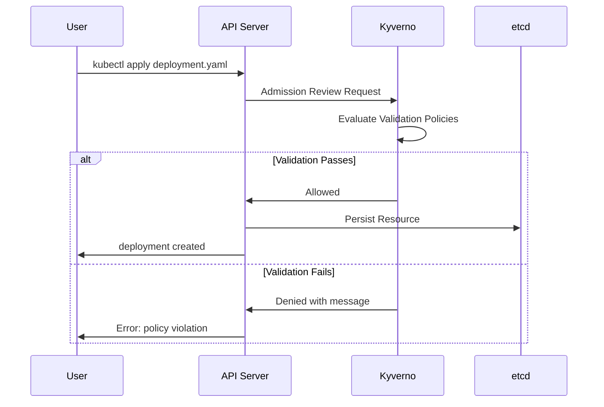

# How to Create Kyverno Policy Validation

Author: [nawazdhandala](https://www.github.com/nawazdhandala)

Tags: Kyverno, Kubernetes, Policy, Security, Admission Control

Description: Implement Kubernetes policy validation with Kyverno for enforcing security standards, resource constraints, and best practices at admission time.

---

Kubernetes clusters can quickly become a compliance nightmare without proper guardrails. Teams deploy workloads with missing labels, containers run as root, images come from untrusted registries, and resource limits are nowhere to be found. Kyverno solves this by letting you write validation policies in plain YAML that catch these issues before resources ever hit your cluster.

This guide walks through creating Kyverno validation policies from scratch. You will learn the policy structure, common validation patterns, and how to test policies before deploying them.

## Understanding Kyverno Validation

Kyverno runs as an admission controller in your cluster. When someone creates or updates a resource, Kyverno intercepts the request and checks it against your policies. If a validation fails, the request gets rejected with a clear error message.



## Policy Structure Basics

Every Kyverno ClusterPolicy follows a consistent structure. Understanding this structure makes writing policies much easier.

```yaml
# policy-template.yaml
# A ClusterPolicy applies across all namespaces
# Use Policy instead for namespace-scoped rules
apiVersion: kyverno.io/v1
kind: ClusterPolicy
metadata:
  name: my-validation-policy
  annotations:
    # These annotations help document the policy
    policies.kyverno.io/title: Human-readable title
    policies.kyverno.io/severity: medium
    policies.kyverno.io/description: >-
      Detailed description of what this policy enforces
      and why it matters for your organization.
spec:
  # Enforce blocks non-compliant resources
  # Audit only logs violations without blocking
  validationFailureAction: Enforce

  # Check existing resources in background scans
  background: true

  rules:
    - name: rule-name
      # Match specifies which resources this rule applies to
      match:
        any:
          - resources:
              kinds:
                - Pod
                - Deployment
      # Exclude keeps certain resources out of scope
      exclude:
        any:
          - resources:
              namespaces:
                - kube-system
      # The actual validation logic
      validate:
        message: "Error message shown when validation fails"
        pattern:
          # Pattern matching against the resource
          spec:
            someField: "expected-value"
```

## Creating Your First Validation Policy

Let us start with something practical: requiring all Deployments to have the `app` label. This label is critical for service discovery and monitoring.

```yaml
# require-app-label.yaml
apiVersion: kyverno.io/v1
kind: ClusterPolicy
metadata:
  name: require-app-label
  annotations:
    policies.kyverno.io/title: Require App Label
    policies.kyverno.io/severity: medium
    policies.kyverno.io/description: >-
      All Deployments must have an 'app' label for proper
      service discovery and monitoring integration.
spec:
  validationFailureAction: Enforce
  background: true
  rules:
    - name: check-app-label
      match:
        any:
          - resources:
              kinds:
                - Deployment
      validate:
        # Clear message helps developers fix the issue quickly
        message: "Deployments must have an 'app' label. Add metadata.labels.app to your Deployment."
        pattern:
          metadata:
            labels:
              # The ?* pattern means any non-empty value
              app: "?*"
```

Apply this policy and test it:

```bash
# Apply the policy
kubectl apply -f require-app-label.yaml

# This Deployment will be rejected
kubectl create deployment nginx --image=nginx
# Error: Deployments must have an 'app' label...

# This one will succeed (kubectl adds the app label by default)
kubectl create deployment nginx --image=nginx -o yaml --dry-run=client | \
  kubectl apply -f -
```

## Pattern Matching Deep Dive

Kyverno patterns support several operators that make validation flexible and powerful.

```yaml
# pattern-examples.yaml
apiVersion: kyverno.io/v1
kind: ClusterPolicy
metadata:
  name: pattern-examples
spec:
  validationFailureAction: Enforce
  rules:
    - name: demonstrate-patterns
      match:
        any:
          - resources:
              kinds:
                - Pod
      validate:
        message: "Pattern validation failed"
        pattern:
          metadata:
            labels:
              # ?* matches any non-empty string
              team: "?*"

              # | provides alternatives (OR)
              environment: "dev | staging | production"

              # * matches zero or more characters
              version: "v*"
          spec:
            containers:
              - name: "*"
                # !value negates the match
                securityContext:
                  runAsRoot: "!true"

                # Numeric comparisons work too
                resources:
                  limits:
                    # >=1 means at least 1
                    cpu: ">=100m"
                    memory: ">=128Mi"
```

## Validating Security Contexts

Security misconfigurations are one of the most common issues in Kubernetes. This policy ensures containers follow security best practices.

```yaml
# require-security-context.yaml
apiVersion: kyverno.io/v1
kind: ClusterPolicy
metadata:
  name: require-security-context
  annotations:
    policies.kyverno.io/title: Require Security Context
    policies.kyverno.io/severity: high
    policies.kyverno.io/description: >-
      Containers must run as non-root and drop all capabilities.
      This reduces the attack surface significantly.
spec:
  validationFailureAction: Enforce
  background: true
  rules:
    - name: require-run-as-non-root
      match:
        any:
          - resources:
              kinds:
                - Pod
      exclude:
        any:
          - resources:
              namespaces:
                - kube-system
                - kyverno
      validate:
        message: >-
          Containers must set securityContext.runAsNonRoot to true.
          Running as root inside containers is a security risk.
        pattern:
          spec:
            containers:
              - securityContext:
                  runAsNonRoot: true

    - name: drop-all-capabilities
      match:
        any:
          - resources:
              kinds:
                - Pod
      exclude:
        any:
          - resources:
              namespaces:
                - kube-system
      validate:
        message: >-
          Containers must drop all capabilities. Add
          securityContext.capabilities.drop: ["ALL"] to each container.
        pattern:
          spec:
            containers:
              - securityContext:
                  capabilities:
                    drop:
                      - ALL
```

## Using Preconditions for Complex Logic

Sometimes you need to validate only when certain conditions are met. Preconditions let you add this logic.

```yaml
# conditional-validation.yaml
apiVersion: kyverno.io/v1
kind: ClusterPolicy
metadata:
  name: production-requirements
  annotations:
    policies.kyverno.io/title: Production Requirements
    policies.kyverno.io/description: >-
      Resources in production namespaces must meet stricter requirements
      including resource limits and multiple replicas.
spec:
  validationFailureAction: Enforce
  rules:
    - name: require-replicas-in-production
      match:
        any:
          - resources:
              kinds:
                - Deployment
              namespaces:
                - production
                - prod-*
      # Preconditions are checked before the pattern
      preconditions:
        all:
          # Only validate if this is not a canary deployment
          - key: "{{ request.object.metadata.labels.deployment-type || 'standard' }}"
            operator: NotEquals
            value: "canary"
      validate:
        message: "Production Deployments must have at least 2 replicas for high availability."
        pattern:
          spec:
            # Minimum 2 replicas
            replicas: ">=2"

    - name: require-resource-limits-production
      match:
        any:
          - resources:
              kinds:
                - Pod
              namespaces:
                - production
                - prod-*
      validate:
        message: "Production Pods must specify CPU and memory limits."
        pattern:
          spec:
            containers:
              - resources:
                  limits:
                    cpu: "?*"
                    memory: "?*"
                  requests:
                    cpu: "?*"
                    memory: "?*"
```

## Validating Image Sources

Controlling which container images can run in your cluster is a fundamental security control.

```yaml
# allowed-image-registries.yaml
apiVersion: kyverno.io/v1
kind: ClusterPolicy
metadata:
  name: allowed-image-registries
  annotations:
    policies.kyverno.io/title: Restrict Image Registries
    policies.kyverno.io/severity: high
    policies.kyverno.io/description: >-
      Only images from approved registries are allowed. This prevents
      deployment of potentially malicious or unvetted images.
spec:
  validationFailureAction: Enforce
  background: true
  rules:
    - name: validate-image-registry
      match:
        any:
          - resources:
              kinds:
                - Pod
      exclude:
        any:
          - resources:
              namespaces:
                - kube-system
      validate:
        message: >-
          Images must come from approved registries:
          gcr.io/my-company, ghcr.io/my-company, or docker.io/library.
          Found: {{ request.object.spec.containers[].image }}
        pattern:
          spec:
            # Validate main containers
            containers:
              - image: "gcr.io/my-company/* | ghcr.io/my-company/* | docker.io/library/*"
            # Also validate init containers if present
            # The =() syntax means "if this field exists"
            =(initContainers):
              - image: "gcr.io/my-company/* | ghcr.io/my-company/* | docker.io/library/*"
```

## Testing Policies Locally

Never deploy policies to production without testing them first. The Kyverno CLI makes this straightforward.

```bash
# Install the Kyverno CLI
brew install kyverno

# Create a test resource
cat > test-deployment.yaml << 'EOF'
apiVersion: apps/v1
kind: Deployment
metadata:
  name: test-app
  labels:
    app: test
spec:
  replicas: 1
  selector:
    matchLabels:
      app: test
  template:
    metadata:
      labels:
        app: test
    spec:
      containers:
        - name: app
          image: nginx:latest
EOF

# Test your policy against the resource
kyverno apply require-app-label.yaml --resource test-deployment.yaml

# Run multiple policies against multiple resources
kyverno apply ./policies/ --resource ./manifests/

# Get detailed output
kyverno apply require-security-context.yaml \
  --resource test-deployment.yaml \
  --detailed-results
```

## Rolling Out Policies Safely

Jumping straight to enforcement can disrupt your teams. Start with audit mode and migrate gradually.

```yaml
# gradual-rollout.yaml
apiVersion: kyverno.io/v1
kind: ClusterPolicy
metadata:
  name: require-probes
spec:
  # Start in Audit mode
  validationFailureAction: Audit

  # Override to Enforce in specific namespaces
  validationFailureActionOverrides:
    - action: Enforce
      namespaces:
        - production
        - staging
    - action: Audit
      namespaces:
        - development
        - "*-dev"

  background: true
  rules:
    - name: require-readiness-probe
      match:
        any:
          - resources:
              kinds:
                - Deployment
      validate:
        message: "Deployments must define readiness probes for proper load balancing."
        pattern:
          spec:
            template:
              spec:
                containers:
                  - readinessProbe:
                      # Accept any probe type
                      (httpGet | tcpSocket | exec): "?*"
```

Check policy violations through reports:

```bash
# View policy reports
kubectl get policyreport -A
kubectl get clusterpolicyreport

# Get details on violations
kubectl describe policyreport -n default

# Count violations by policy
kubectl get policyreport -A -o json | \
  jq '.items[].results[] | select(.result=="fail") | .policy' | \
  sort | uniq -c
```

---

Kyverno validation policies give you control over what runs in your cluster without requiring developers to learn a new language. Start with a few high-impact policies like requiring labels and blocking privileged containers. Use audit mode to understand the current state, then gradually enforce as teams adapt. The pattern-based approach keeps policies readable, and the Kyverno CLI ensures you can test everything before it affects real workloads. Once you have the basics working, explore mutation policies to automatically fix common issues instead of just rejecting them.
