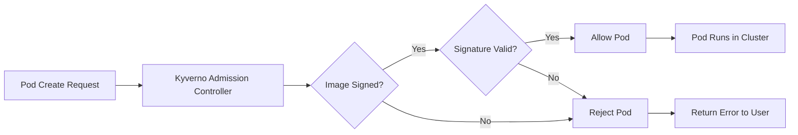
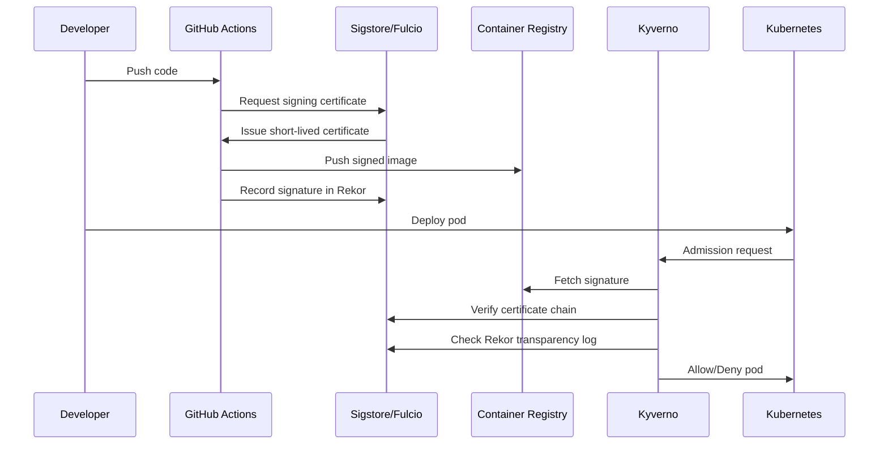

# How to Create Kyverno Policy Verify Images

Author: [nawazdhandala](https://github.com/nawazdhandala)

Tags: Kyverno, Kubernetes, Security, ImageSigning

Description: Learn how to use Kyverno policies to verify container image signatures and attestations for supply chain security in Kubernetes.

---

Container images are the building blocks of Kubernetes workloads. Without verification, you cannot trust that an image is what it claims to be. Kyverno's verifyImages rule lets you enforce that only signed and attested images run in your cluster.

## How Image Verification Works

Kyverno intercepts admission requests and checks image signatures before pods are created. If the signature is invalid or missing, the pod is rejected.



## Prerequisites

Before you start, ensure you have:

- Kubernetes cluster 1.25+
- Kyverno 1.10+ installed
- cosign CLI for signing images
- A container registry that supports OCI artifacts

### Install Kyverno

```bash
# Install Kyverno with Helm
helm repo add kyverno https://kyverno.github.io/kyverno/
helm repo update

# Install with signature verification support
helm install kyverno kyverno/kyverno \
  --namespace kyverno \
  --create-namespace \
  --set replicaCount=3
```

### Install cosign

```bash
# Install cosign on macOS
brew install cosign

# Or download from GitHub releases
curl -LO https://github.com/sigstore/cosign/releases/latest/download/cosign-linux-amd64
chmod +x cosign-linux-amd64
mv cosign-linux-amd64 /usr/local/bin/cosign
```

## Signing Images with cosign

Before Kyverno can verify images, you need to sign them. There are two approaches: key-based and keyless signing.

### Generate a Key Pair

```bash
# Generate a new key pair
# This creates cosign.key (private) and cosign.pub (public)
cosign generate-key-pair

# Store the private key securely
# Never commit it to version control
```

### Sign an Image with a Key

```bash
# Sign an image with your private key
cosign sign --key cosign.key myregistry.com/myapp:v1.0.0

# Verify the signature locally
cosign verify --key cosign.pub myregistry.com/myapp:v1.0.0
```

### Keyless Signing with Sigstore

Keyless signing uses OIDC identity providers and the Sigstore public infrastructure. No keys to manage.

```bash
# Sign using your GitHub, Google, or Microsoft identity
# Opens a browser for authentication
cosign sign myregistry.com/myapp:v1.0.0

# Verify keyless signature
cosign verify \
  --certificate-identity "user@example.com" \
  --certificate-oidc-issuer "https://accounts.google.com" \
  myregistry.com/myapp:v1.0.0
```

## Kyverno Policy: Public Key Verification

This policy verifies images are signed with a specific public key.

```yaml
# policy-verify-image-key.yaml
apiVersion: kyverno.io/v1
kind: ClusterPolicy
metadata:
  name: verify-image-signature
  annotations:
    # Policy applies to all namespaces except kube-system
    policies.kyverno.io/description: >-
      Verifies that container images are signed with the organization's
      private key before allowing pods to run.
spec:
  # Block pods that fail verification
  validationFailureAction: Enforce
  # Run in background to check existing pods
  background: true
  rules:
    - name: verify-signature
      match:
        any:
          - resources:
              kinds:
                - Pod
      # Skip system namespaces
      exclude:
        any:
          - resources:
              namespaces:
                - kube-system
                - kyverno
      verifyImages:
        # Verify all images matching this pattern
        - imageReferences:
            - "myregistry.com/*"
          attestors:
            - count: 1
              entries:
                - keys:
                    # Inline public key for verification
                    publicKeys: |-
                      -----BEGIN PUBLIC KEY-----
                      MFkwEwYHKoZIzj0CAQYIKoZIzj0DAQcDQgAEhyQCx0E9wQWSFI9ULGwy3BuRklnt
                      IqozONbbdbqz11hlRJy9c7SG+hdcFl9jE9uE/dwtuwU2MqU9T/cN0YkWww==
                      -----END PUBLIC KEY-----
```

### Using a Secret for the Public Key

Store the public key in a Kubernetes Secret for easier management.

```bash
# Create a secret with the public key
kubectl create secret generic cosign-pub \
  --from-file=cosign.pub=cosign.pub \
  -n kyverno
```

```yaml
# policy-verify-image-secret.yaml
apiVersion: kyverno.io/v1
kind: ClusterPolicy
metadata:
  name: verify-image-from-secret
spec:
  validationFailureAction: Enforce
  background: true
  rules:
    - name: verify-signature
      match:
        any:
          - resources:
              kinds:
                - Pod
      verifyImages:
        - imageReferences:
            - "myregistry.com/*"
          attestors:
            - count: 1
              entries:
                - keys:
                    # Reference the secret containing the public key
                    secret:
                      name: cosign-pub
                      namespace: kyverno
```

## Kyverno Policy: Keyless Verification

Keyless verification validates the OIDC identity used to sign the image.

```yaml
# policy-verify-keyless.yaml
apiVersion: kyverno.io/v1
kind: ClusterPolicy
metadata:
  name: verify-keyless-signature
  annotations:
    policies.kyverno.io/description: >-
      Verifies images are signed via Sigstore keyless signing
      with a specific identity and issuer.
spec:
  validationFailureAction: Enforce
  background: true
  rules:
    - name: verify-keyless
      match:
        any:
          - resources:
              kinds:
                - Pod
      verifyImages:
        - imageReferences:
            - "ghcr.io/myorg/*"
          attestors:
            - count: 1
              entries:
                - keyless:
                    # The email or subject of the certificate
                    subject: "https://github.com/myorg/*"
                    # The OIDC issuer that authenticated the signer
                    issuer: "https://token.actions.githubusercontent.com"
                    # Use Sigstore's public Rekor transparency log
                    rekor:
                      url: https://rekor.sigstore.dev
```

### Verification Flow for Keyless Signing



## Verifying Image Attestations

Attestations are signed statements about an image, like SBOM (Software Bill of Materials) or vulnerability scan results.

### Create an Attestation

```bash
# Create an SBOM attestation
cosign attest --key cosign.key \
  --predicate sbom.json \
  --type spdx \
  myregistry.com/myapp:v1.0.0

# Create a vulnerability scan attestation
cosign attest --key cosign.key \
  --predicate vuln-scan.json \
  --type vuln \
  myregistry.com/myapp:v1.0.0
```

### Policy to Verify Attestations

```yaml
# policy-verify-attestation.yaml
apiVersion: kyverno.io/v1
kind: ClusterPolicy
metadata:
  name: verify-image-attestation
  annotations:
    policies.kyverno.io/description: >-
      Requires images to have a signed vulnerability scan attestation
      with no critical vulnerabilities.
spec:
  validationFailureAction: Enforce
  background: true
  rules:
    - name: verify-vuln-attestation
      match:
        any:
          - resources:
              kinds:
                - Pod
      verifyImages:
        - imageReferences:
            - "myregistry.com/*"
          attestations:
            # Verify the vulnerability scan attestation
            - predicateType: https://cosign.sigstore.dev/attestation/vuln/v1
              attestors:
                - count: 1
                  entries:
                    - keys:
                        publicKeys: |-
                          -----BEGIN PUBLIC KEY-----
                          MFkwEwYHKoZIzj0CAQYIKoZIzj0DAQcDQgAEhyQCx0E9wQWSFI9ULGwy3BuRklnt
                          IqozONbbdbqz11hlRJy9c7SG+hdcFl9jE9uE/dwtuwU2MqU9T/cN0YkWww==
                          -----END PUBLIC KEY-----
              # Validate the attestation content
              conditions:
                - all:
                    # Ensure no critical vulnerabilities
                    - key: "{{ scanner.result.criticalCount }}"
                      operator: Equals
                      value: 0
                    # Ensure no high vulnerabilities
                    - key: "{{ scanner.result.highCount }}"
                      operator: LessThanOrEquals
                      value: 5
```

## Registry Configuration

### Allowing Unsigned Images for Specific Registries

Some images (like base OS images) may not be signed. Allow them explicitly.

```yaml
# policy-mixed-registries.yaml
apiVersion: kyverno.io/v1
kind: ClusterPolicy
metadata:
  name: verify-images-mixed
spec:
  validationFailureAction: Enforce
  background: true
  rules:
    # Rule 1: Verify internal images
    - name: verify-internal-images
      match:
        any:
          - resources:
              kinds:
                - Pod
      verifyImages:
        - imageReferences:
            - "myregistry.com/*"
          attestors:
            - entries:
                - keys:
                    publicKeys: |-
                      -----BEGIN PUBLIC KEY-----
                      ...your public key...
                      -----END PUBLIC KEY-----

    # Rule 2: Allow specific unsigned images
    - name: allow-trusted-base-images
      match:
        any:
          - resources:
              kinds:
                - Pod
      verifyImages:
        - imageReferences:
            # Trust official images from these registries
            - "docker.io/library/*"
            - "gcr.io/distroless/*"
            - "registry.k8s.io/*"
          # Skip verification for these images
          mutateDigest: true
          verifyDigest: true
          required: false
```

### Configure Registry Credentials

If your registry requires authentication, create an image pull secret and reference it in the policy.

```bash
# Create registry credentials secret
kubectl create secret docker-registry regcred \
  --docker-server=myregistry.com \
  --docker-username=myuser \
  --docker-password=mypassword \
  -n kyverno
```

```yaml
# policy-with-auth.yaml
apiVersion: kyverno.io/v1
kind: ClusterPolicy
metadata:
  name: verify-private-registry
spec:
  validationFailureAction: Enforce
  rules:
    - name: verify-signature
      match:
        any:
          - resources:
              kinds:
                - Pod
      verifyImages:
        - imageReferences:
            - "myregistry.com/*"
          attestors:
            - entries:
                - keys:
                    publicKeys: |-
                      -----BEGIN PUBLIC KEY-----
                      ...
                      -----END PUBLIC KEY-----
          # Use these credentials to pull signatures
          imageRegistryCredentials:
            secrets:
              - regcred
```

## Multiple Attestors: Require Multiple Signatures

For high-security environments, require images to be signed by multiple parties.

```yaml
# policy-multi-attestor.yaml
apiVersion: kyverno.io/v1
kind: ClusterPolicy
metadata:
  name: require-multiple-signatures
  annotations:
    policies.kyverno.io/description: >-
      Requires images to be signed by both the CI system and
      a security team member.
spec:
  validationFailureAction: Enforce
  rules:
    - name: verify-dual-signatures
      match:
        any:
          - resources:
              kinds:
                - Pod
      verifyImages:
        - imageReferences:
            - "myregistry.com/production/*"
          attestors:
            # Require 2 of 2 attestors
            - count: 2
              entries:
                # CI system signature
                - keys:
                    publicKeys: |-
                      -----BEGIN PUBLIC KEY-----
                      ...CI system public key...
                      -----END PUBLIC KEY-----
                # Security team signature
                - keys:
                    publicKeys: |-
                      -----BEGIN PUBLIC KEY-----
                      ...Security team public key...
                      -----END PUBLIC KEY-----
```

## Complete CI/CD Pipeline Example

Here is a GitHub Actions workflow that signs images and creates attestations.

```yaml
# .github/workflows/build-sign.yaml
name: Build and Sign

on:
  push:
    branches: [main]
    tags: ['v*']

env:
  REGISTRY: ghcr.io
  IMAGE_NAME: ${{ github.repository }}

jobs:
  build-sign:
    runs-on: ubuntu-latest
    permissions:
      contents: read
      packages: write
      id-token: write  # Required for keyless signing

    steps:
      - name: Checkout
        uses: actions/checkout@v4

      - name: Set up Docker Buildx
        uses: docker/setup-buildx-action@v3

      - name: Login to Registry
        uses: docker/login-action@v3
        with:
          registry: ${{ env.REGISTRY }}
          username: ${{ github.actor }}
          password: ${{ secrets.GITHUB_TOKEN }}

      - name: Build and Push
        id: build
        uses: docker/build-push-action@v5
        with:
          push: true
          tags: ${{ env.REGISTRY }}/${{ env.IMAGE_NAME }}:${{ github.sha }}

      - name: Install cosign
        uses: sigstore/cosign-installer@v3

      # Keyless signing using GitHub OIDC
      - name: Sign Image
        run: |
          cosign sign --yes \
            ${{ env.REGISTRY }}/${{ env.IMAGE_NAME }}@${{ steps.build.outputs.digest }}

      # Generate and attach SBOM
      - name: Generate SBOM
        uses: anchore/sbom-action@v0
        with:
          image: ${{ env.REGISTRY }}/${{ env.IMAGE_NAME }}@${{ steps.build.outputs.digest }}
          output-file: sbom.spdx.json

      - name: Attest SBOM
        run: |
          cosign attest --yes \
            --predicate sbom.spdx.json \
            --type spdxjson \
            ${{ env.REGISTRY }}/${{ env.IMAGE_NAME }}@${{ steps.build.outputs.digest }}
```

## Testing Your Policies

### Test Unsigned Image Rejection

```bash
# Apply the policy
kubectl apply -f policy-verify-image-key.yaml

# Try to deploy an unsigned image
kubectl run test --image=myregistry.com/unsigned-app:v1.0.0

# Expected error:
# Error from server: admission webhook "mutate.kyverno.svc-fail" denied the request:
# resource Pod/default/test was blocked due to the following policies
#
# verify-image-signature:
#   verify-signature: 'failed to verify signature for myregistry.com/unsigned-app:v1.0.0:
#   no matching signatures found'
```

### Test Signed Image Acceptance

```bash
# Sign an image first
cosign sign --key cosign.key myregistry.com/myapp:v1.0.0

# Deploy the signed image
kubectl run test --image=myregistry.com/myapp:v1.0.0

# Pod should be created successfully
kubectl get pods test
```

### Audit Mode Testing

Use audit mode to test policies without blocking deployments.

```yaml
apiVersion: kyverno.io/v1
kind: ClusterPolicy
metadata:
  name: verify-image-audit
spec:
  # Audit mode: log violations but allow pods
  validationFailureAction: Audit
  rules:
    - name: verify-signature
      # ... same as before
```

```bash
# Check policy reports for violations
kubectl get policyreport -A

# Get detailed report
kubectl describe policyreport -n default
```

## Troubleshooting

### Common Issues

**Signature not found**
```bash
# Verify signature exists
cosign verify --key cosign.pub myregistry.com/myapp:v1.0.0

# Check the signature is attached to the correct digest
crane manifest myregistry.com/myapp:v1.0.0 | jq .
```

**Wrong public key**
```bash
# List all signatures on an image
cosign triangulate myregistry.com/myapp:v1.0.0
crane ls $(cosign triangulate myregistry.com/myapp:v1.0.0 | cut -d: -f1)
```

**Registry authentication issues**
```bash
# Test registry access from Kyverno pod
kubectl exec -it -n kyverno deploy/kyverno -- \
  wget -qO- https://myregistry.com/v2/
```

### Debug Kyverno Logs

```bash
# Check Kyverno logs for verification errors
kubectl logs -n kyverno -l app.kubernetes.io/name=kyverno --tail=100

# Enable debug logging
helm upgrade kyverno kyverno/kyverno \
  --namespace kyverno \
  --set extraArgs='{--v=4}'
```

## Security Checklist

- [ ] Generate and securely store signing keys
- [ ] Set up keyless signing in CI/CD pipelines
- [ ] Create policies for all production namespaces
- [ ] Require attestations for vulnerability scans
- [ ] Test policies in audit mode before enforcing
- [ ] Monitor policy reports for violations
- [ ] Rotate signing keys periodically
- [ ] Use multiple attestors for critical workloads
- [ ] Document allowed unsigned image exceptions

---

Image verification is a critical layer in Kubernetes supply chain security. With Kyverno and cosign, you can ensure that only trusted, signed images run in your cluster. Start with audit mode, build confidence, then enforce. Your security posture will thank you.
