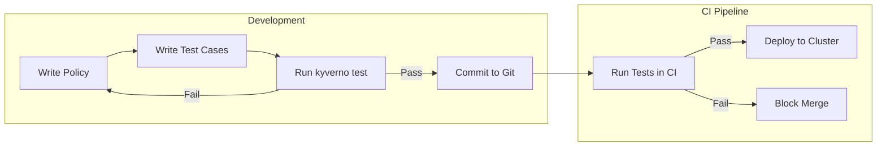
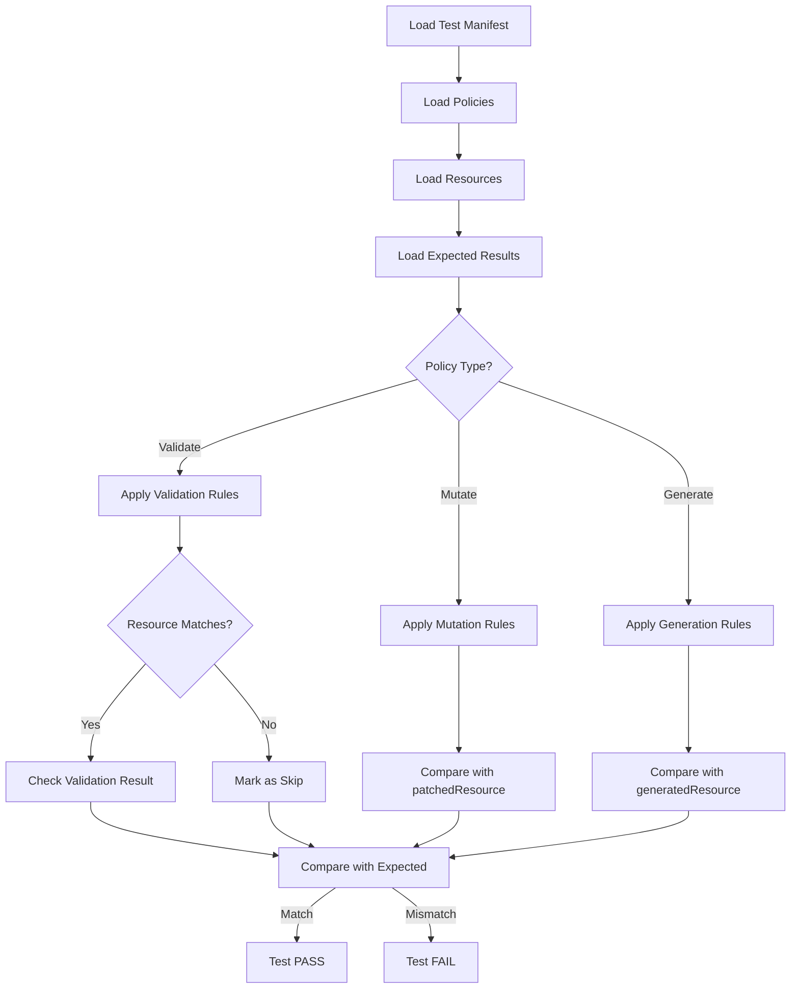

# How to Create Kyverno Test Cases

Author: [nawazdhandala](https://github.com/nawazdhandala)

Tags: Kyverno, Kubernetes, Testing, PolicyAsCode

Description: Learn how to write and run Kyverno test cases to validate your Kubernetes policies before deploying them to production.

---

Kyverno policies enforce security and best practices in your Kubernetes clusters. But how do you know your policies work correctly before deploying them? Kyverno includes a built-in testing framework that lets you validate policies against mock resources locally.

## Why Test Kyverno Policies?

Testing policies before deployment prevents:
- Blocking legitimate workloads in production
- Allowing resources that should be denied
- Unexpected mutation or generation behavior
- Breaking changes when updating policies



## Test Manifest Structure

Kyverno tests are defined in YAML files. A test manifest specifies which policies to test, which resources to test against, and what results to expect.

### Basic Test File Structure

```yaml
# kyverno-test.yaml
name: require-labels-test          # Name of the test suite
policies:                          # List of policy files to test
  - policies/require-labels.yaml
resources:                         # List of resource files to test against
  - resources/pod-with-labels.yaml
  - resources/pod-without-labels.yaml
results:                           # Expected outcomes
  - policy: require-labels         # Policy name
    rule: check-for-labels         # Rule name within the policy
    resource: good-pod             # Resource name
    kind: Pod                      # Resource kind
    result: pass                   # Expected result: pass, fail, skip
  - policy: require-labels
    rule: check-for-labels
    resource: bad-pod
    kind: Pod
    result: fail
```

### Complete Test Directory Layout

```
policy-tests/
├── kyverno-test.yaml              # Test manifest
├── policies/
│   ├── require-labels.yaml        # Validation policy
│   ├── add-default-resources.yaml # Mutation policy
│   └── generate-configmap.yaml    # Generation policy
└── resources/
    ├── pod-with-labels.yaml       # Should pass validation
    ├── pod-without-labels.yaml    # Should fail validation
    ├── deployment-no-resources.yaml
    └── namespace-trigger.yaml
```

## Resource Fixtures and Expected Results

Resource fixtures are Kubernetes manifests that represent the inputs to your policies.

### Creating Test Resources

```yaml
# resources/pod-with-labels.yaml
# This pod has all required labels and should pass validation
apiVersion: v1
kind: Pod
metadata:
  name: good-pod
  labels:
    app: myapp
    env: production
    owner: team-a
spec:
  containers:
    - name: nginx
      image: nginx:1.21

---
# resources/pod-without-labels.yaml
# This pod is missing required labels and should fail validation
apiVersion: v1
kind: Pod
metadata:
  name: bad-pod
  labels:
    app: myapp
    # Missing: env and owner labels
spec:
  containers:
    - name: nginx
      image: nginx:1.21
```

### Defining Expected Results

The `results` section maps resources to their expected policy outcomes:

```yaml
results:
  # Validation: pass means the resource is allowed
  - policy: require-labels
    rule: check-for-labels
    resource: good-pod
    kind: Pod
    result: pass

  # Validation: fail means the resource is denied
  - policy: require-labels
    rule: check-for-labels
    resource: bad-pod
    kind: Pod
    result: fail

  # Mutation: pass means the mutation was applied
  - policy: add-default-resources
    rule: add-resources
    resource: deployment-no-limits
    kind: Deployment
    patchedResource: resources/expected-deployment.yaml  # Compare against expected output
    result: pass

  # Generation: pass means the resource was generated
  - policy: generate-networkpolicy
    rule: create-default-netpol
    resource: new-namespace
    kind: Namespace
    generatedResource: resources/expected-netpol.yaml    # Compare against expected output
    result: pass

  # Skip: the policy does not apply to this resource
  - policy: require-labels
    rule: check-for-labels
    resource: configmap-test
    kind: ConfigMap
    result: skip
```

## Testing Validation Policies

Validation policies check if resources meet certain criteria.

### Example Validation Policy

```yaml
# policies/require-labels.yaml
apiVersion: kyverno.io/v1
kind: ClusterPolicy
metadata:
  name: require-labels
  annotations:
    policies.kyverno.io/title: Require Labels
    policies.kyverno.io/description: >-
      All Pods must have app, env, and owner labels.
spec:
  validationFailureAction: Enforce   # Block non-compliant resources
  background: true
  rules:
    - name: check-for-labels
      match:
        any:
          - resources:
              kinds:
                - Pod
      validate:
        message: "Pods must have app, env, and owner labels."
        pattern:
          metadata:
            labels:
              app: "?*"        # Must exist and not be empty
              env: "?*"
              owner: "?*"
```

### Test Manifest for Validation

```yaml
# kyverno-test.yaml
name: require-labels-tests
policies:
  - policies/require-labels.yaml
resources:
  - resources/pods.yaml
results:
  # Pod with all labels should pass
  - policy: require-labels
    rule: check-for-labels
    resource: complete-pod
    kind: Pod
    result: pass

  # Pod missing env label should fail
  - policy: require-labels
    rule: check-for-labels
    resource: missing-env-pod
    kind: Pod
    result: fail

  # Pod missing all labels should fail
  - policy: require-labels
    rule: check-for-labels
    resource: no-labels-pod
    kind: Pod
    result: fail
```

### Running the Test

```bash
# Run tests from the test directory
kyverno test policy-tests/

# Run with verbose output
kyverno test policy-tests/ --detailed-results

# Run specific test file
kyverno test policy-tests/kyverno-test.yaml
```

Expected output:

```
Loading test  ( policy-tests/kyverno-test.yaml ) ...
  Loading values/variables ...
  Loading policies ...
  Loading resources ...
  Loading expected results ...
  Applying 1 policy to 3 resources ...

Test Results:
├── require-labels-tests
│   ├── complete-pod        PASS
│   ├── missing-env-pod     PASS
│   └── no-labels-pod       PASS

Test Summary: 3 tests passed, 0 tests failed, 0 tests skipped
```

## Testing Mutation Policies

Mutation policies modify resources. Tests verify that mutations produce the expected output.

### Example Mutation Policy

```yaml
# policies/add-default-resources.yaml
apiVersion: kyverno.io/v1
kind: ClusterPolicy
metadata:
  name: add-default-resources
spec:
  background: false
  rules:
    - name: add-resources
      match:
        any:
          - resources:
              kinds:
                - Deployment
      mutate:
        patchStrategicMerge:
          spec:
            template:
              spec:
                containers:
                  - (name): "*"       # Match all containers
                    resources:
                      limits:
                        memory: "256Mi"
                        cpu: "500m"
                      requests:
                        memory: "128Mi"
                        cpu: "250m"
```

### Input Resource

```yaml
# resources/deployment-no-limits.yaml
apiVersion: apps/v1
kind: Deployment
metadata:
  name: deployment-no-limits
spec:
  replicas: 1
  selector:
    matchLabels:
      app: test
  template:
    metadata:
      labels:
        app: test
    spec:
      containers:
        - name: app
          image: nginx:1.21
          # No resources specified
```

### Expected Mutated Resource

```yaml
# resources/expected-deployment.yaml
apiVersion: apps/v1
kind: Deployment
metadata:
  name: deployment-no-limits
spec:
  replicas: 1
  selector:
    matchLabels:
      app: test
  template:
    metadata:
      labels:
        app: test
    spec:
      containers:
        - name: app
          image: nginx:1.21
          resources:              # Added by mutation
            limits:
              memory: "256Mi"
              cpu: "500m"
            requests:
              memory: "128Mi"
              cpu: "250m"
```

### Mutation Test Manifest

```yaml
# kyverno-test.yaml
name: mutation-tests
policies:
  - policies/add-default-resources.yaml
resources:
  - resources/deployment-no-limits.yaml
results:
  - policy: add-default-resources
    rule: add-resources
    resource: deployment-no-limits
    kind: Deployment
    patchedResource: resources/expected-deployment.yaml   # Compare output
    result: pass
```

## Testing Generation Policies

Generation policies create new resources when triggered.

### Example Generation Policy

```yaml
# policies/generate-networkpolicy.yaml
apiVersion: kyverno.io/v1
kind: ClusterPolicy
metadata:
  name: generate-networkpolicy
spec:
  rules:
    - name: create-default-netpol
      match:
        any:
          - resources:
              kinds:
                - Namespace
      exclude:
        any:
          - resources:
              namespaces:
                - kube-system
                - kube-public
      generate:
        apiVersion: networking.k8s.io/v1
        kind: NetworkPolicy
        name: default-deny-ingress
        namespace: "{{request.object.metadata.name}}"
        synchronize: true
        data:
          spec:
            podSelector: {}
            policyTypes:
              - Ingress
```

### Trigger Resource

```yaml
# resources/new-namespace.yaml
apiVersion: v1
kind: Namespace
metadata:
  name: new-namespace
  labels:
    env: production
```

### Expected Generated Resource

```yaml
# resources/expected-netpol.yaml
apiVersion: networking.k8s.io/v1
kind: NetworkPolicy
metadata:
  name: default-deny-ingress
  namespace: new-namespace
spec:
  podSelector: {}
  policyTypes:
    - Ingress
```

### Generation Test Manifest

```yaml
# kyverno-test.yaml
name: generation-tests
policies:
  - policies/generate-networkpolicy.yaml
resources:
  - resources/new-namespace.yaml
results:
  - policy: generate-networkpolicy
    rule: create-default-netpol
    resource: new-namespace
    kind: Namespace
    generatedResource: resources/expected-netpol.yaml    # Compare generated output
    result: pass
```

## Test Execution Flow



## Using Variables in Tests

Kyverno supports variables for dynamic values. Test files can specify variable values.

### Policy with Variables

```yaml
# policies/allowed-registries.yaml
apiVersion: kyverno.io/v1
kind: ClusterPolicy
metadata:
  name: allowed-registries
spec:
  validationFailureAction: Enforce
  rules:
    - name: validate-registries
      match:
        any:
          - resources:
              kinds:
                - Pod
      validate:
        message: "Images must come from allowed registries: {{registries}}"
        deny:
          conditions:
            any:
              - key: "{{request.object.spec.containers[*].image}}"
                operator: AnyNotIn
                value: "{{registries}}"
```

### Test with Variables

```yaml
# kyverno-test.yaml
name: registry-tests
policies:
  - policies/allowed-registries.yaml
resources:
  - resources/pods.yaml
variables: values.yaml                    # Load variables from file
results:
  - policy: allowed-registries
    rule: validate-registries
    resource: allowed-registry-pod
    kind: Pod
    result: pass
  - policy: allowed-registries
    rule: validate-registries
    resource: blocked-registry-pod
    kind: Pod
    result: fail
```

### Variables File

```yaml
# values.yaml
policies:
  - name: allowed-registries
    rules:
      - name: validate-registries
        values:
          registries:
            - "gcr.io/*"
            - "docker.io/library/*"
            - "ghcr.io/myorg/*"
```

## Integrating Tests in CI Pipelines

### GitHub Actions Workflow

```yaml
# .github/workflows/kyverno-tests.yaml
name: Kyverno Policy Tests

on:
  push:
    paths:
      - 'policies/**'
      - 'tests/**'
  pull_request:
    paths:
      - 'policies/**'
      - 'tests/**'

jobs:
  test-policies:
    runs-on: ubuntu-latest
    steps:
      - name: Checkout code
        uses: actions/checkout@v4

      - name: Install Kyverno CLI
        run: |
          curl -LO https://github.com/kyverno/kyverno/releases/download/v1.11.0/kyverno-cli_v1.11.0_linux_x86_64.tar.gz
          tar -xzf kyverno-cli_v1.11.0_linux_x86_64.tar.gz
          sudo mv kyverno /usr/local/bin/

      - name: Validate policies
        run: |
          # Check policy syntax
          kyverno validate policies/

      - name: Run policy tests
        run: |
          # Run all tests and fail on any failure
          kyverno test tests/ --detailed-results

      - name: Upload test results
        if: always()
        uses: actions/upload-artifact@v3
        with:
          name: kyverno-test-results
          path: test-results/
```

### GitLab CI Pipeline

```yaml
# .gitlab-ci.yml
stages:
  - validate
  - test
  - deploy

variables:
  KYVERNO_VERSION: "v1.11.0"

validate-policies:
  stage: validate
  image: alpine:latest
  before_script:
    - apk add --no-cache curl tar
    - curl -LO https://github.com/kyverno/kyverno/releases/download/${KYVERNO_VERSION}/kyverno-cli_${KYVERNO_VERSION}_linux_x86_64.tar.gz
    - tar -xzf kyverno-cli_${KYVERNO_VERSION}_linux_x86_64.tar.gz
    - mv kyverno /usr/local/bin/
  script:
    - kyverno validate policies/
  rules:
    - changes:
        - policies/**/*

test-policies:
  stage: test
  image: alpine:latest
  before_script:
    - apk add --no-cache curl tar
    - curl -LO https://github.com/kyverno/kyverno/releases/download/${KYVERNO_VERSION}/kyverno-cli_${KYVERNO_VERSION}_linux_x86_64.tar.gz
    - tar -xzf kyverno-cli_${KYVERNO_VERSION}_linux_x86_64.tar.gz
    - mv kyverno /usr/local/bin/
  script:
    - kyverno test tests/ --detailed-results
  rules:
    - changes:
        - policies/**/*
        - tests/**/*

deploy-policies:
  stage: deploy
  image: bitnami/kubectl:latest
  script:
    - kubectl apply -f policies/
  rules:
    - if: $CI_COMMIT_BRANCH == "main"
  needs:
    - test-policies
```

### Pre-commit Hook

```yaml
# .pre-commit-config.yaml
repos:
  - repo: local
    hooks:
      - id: kyverno-validate
        name: Validate Kyverno Policies
        entry: kyverno validate policies/
        language: system
        files: ^policies/.*\.yaml$
        pass_filenames: false

      - id: kyverno-test
        name: Test Kyverno Policies
        entry: kyverno test tests/
        language: system
        files: ^(policies|tests)/.*\.yaml$
        pass_filenames: false
```

## Advanced Testing Patterns

### Testing Multiple Rules in One Policy

```yaml
name: multi-rule-tests
policies:
  - policies/pod-security.yaml
resources:
  - resources/pods.yaml
results:
  # Test each rule separately
  - policy: pod-security
    rule: deny-privileged
    resource: privileged-pod
    kind: Pod
    result: fail
  - policy: pod-security
    rule: deny-privileged
    resource: unprivileged-pod
    kind: Pod
    result: pass
  - policy: pod-security
    rule: require-readonly-root
    resource: writable-root-pod
    kind: Pod
    result: fail
  - policy: pod-security
    rule: require-readonly-root
    resource: readonly-root-pod
    kind: Pod
    result: pass
```

### Testing Namespace-Scoped Policies

```yaml
# resources/namespaced-pod.yaml
apiVersion: v1
kind: Pod
metadata:
  name: test-pod
  namespace: production      # Specify namespace for scoped policies
  labels:
    app: test
spec:
  containers:
    - name: app
      image: nginx:1.21
```

### Testing with Context Data

```yaml
# kyverno-test.yaml
name: context-tests
policies:
  - policies/check-image-signature.yaml
resources:
  - resources/signed-pod.yaml
  - resources/unsigned-pod.yaml
variables: values.yaml
results:
  - policy: check-image-signature
    rule: verify-signature
    resource: signed-pod
    kind: Pod
    result: pass
  - policy: check-image-signature
    rule: verify-signature
    resource: unsigned-pod
    kind: Pod
    result: fail
```

```yaml
# values.yaml
policies:
  - name: check-image-signature
    rules:
      - name: verify-signature
        values:
          imageData:
            verified: true
```

## Debugging Test Failures

### Common Issues and Solutions

**Test expects pass but gets fail:**
```bash
# Check policy validation message
kyverno apply policies/require-labels.yaml --resource resources/pod.yaml

# Review the exact validation error
kyverno apply policies/require-labels.yaml --resource resources/pod.yaml -o yaml
```

**Test expects fail but gets pass:**
```bash
# Verify the policy match conditions
# Check if resource kind, namespace, or labels match the policy selector
kyverno apply policies/require-labels.yaml --resource resources/pod.yaml --detailed-results
```

**Mutation output does not match:**
```bash
# Generate actual mutation output
kyverno apply policies/add-resources.yaml --resource resources/deployment.yaml -o yaml > actual-output.yaml

# Compare with expected
diff actual-output.yaml resources/expected-deployment.yaml
```

### Verbose Test Output

```bash
# Run with maximum verbosity
kyverno test tests/ --detailed-results -v 6

# Output only failures
kyverno test tests/ --fail-only
```

## Best Practices

1. **Test both pass and fail cases** for validation policies
2. **Always verify mutation output** against expected files
3. **Run tests in CI** before merging policy changes
4. **Use descriptive resource names** that indicate test purpose
5. **Group related tests** in the same test manifest
6. **Keep test resources minimal** with only relevant fields
7. **Document test intent** with comments in test files
8. **Version your test files** alongside policies

---

Testing Kyverno policies before deployment is essential for maintaining cluster stability. The built-in testing framework catches policy errors early and gives you confidence that your security and compliance rules work as intended. Integrate tests into your CI pipeline to enforce policy quality gates automatically.
