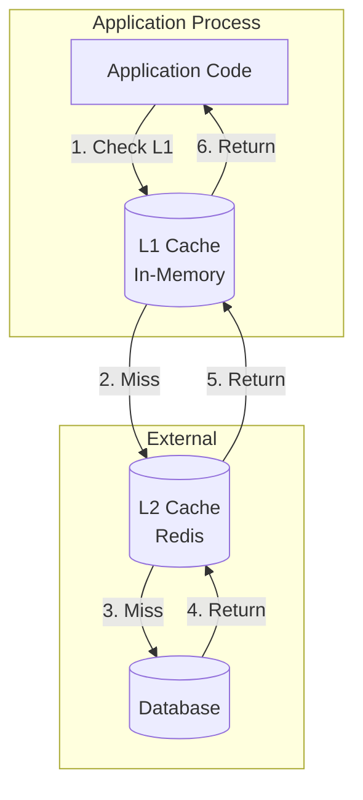
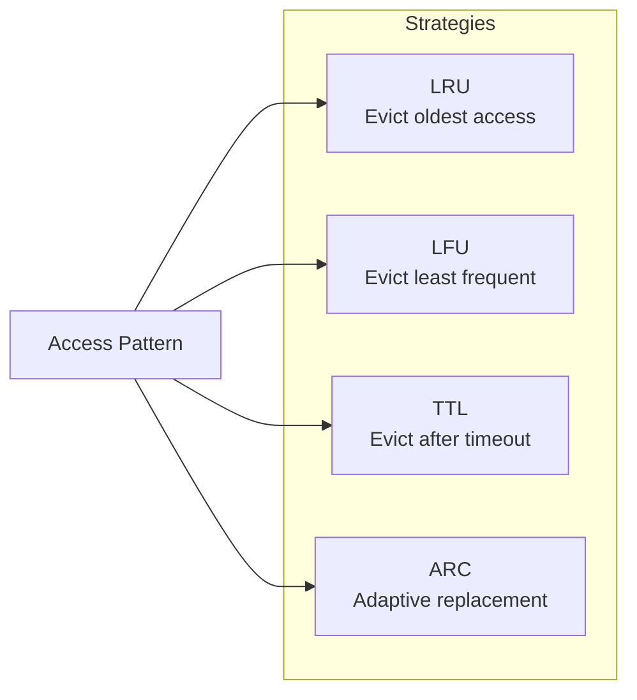
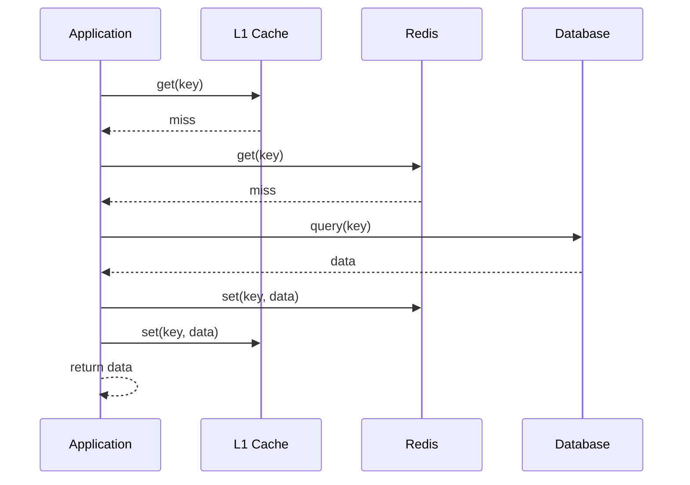

# How to Build L1 Cache Design

Author: [nawazdhandala](https://github.com/nawazdhandala)

Tags: Caching, L1 Cache, In-Memory, Performance

Description: Learn to build L1 cache design using in-process memory caching for ultra-fast data access.

---

An L1 cache sits in the same process as your application, providing the fastest possible data access. Unlike distributed caches that require network calls, L1 caches operate entirely in memory with sub-microsecond latency. This makes them ideal for frequently accessed data that rarely changes.

This guide covers the design principles, implementation patterns, and production considerations for building an effective L1 cache layer.

## Why L1 Caching?

Every network call adds latency. Even the fastest Redis instance running on localhost introduces milliseconds of overhead. An L1 cache eliminates this entirely by storing data in the application's heap memory.

Here is a comparison of cache access times at different layers.

| Cache Layer | Location | Typical Latency | Best For |
|-------------|----------|-----------------|----------|
| L1 Cache | In-process memory | < 1 microsecond | Hot data, config, lookups |
| L2 Cache | Local Redis/Memcached | 0.5-2 ms | Shared process data |
| L3 Cache | Remote distributed cache | 2-10 ms | Cross-region data |
| Database | Persistent storage | 10-100 ms | Source of truth |

The tradeoff is clear: L1 caches sacrifice shared state for raw speed. Each application instance maintains its own cache, which means data can diverge between instances.

## Architecture Overview

An L1 cache fits between your application logic and slower storage layers. It intercepts reads, serves cached data when available, and falls through to the next layer on cache misses.



## Core Data Structures

The foundation of an L1 cache is a hash map with eviction support. A simple implementation wraps a Map with TTL tracking and size limits.

```typescript
interface CacheEntry<T> {
  value: T;
  expiresAt: number;      // Unix timestamp in milliseconds
  accessedAt: number;     // For LRU tracking
}

class L1Cache<T> {
  private cache: Map<string, CacheEntry<T>> = new Map();
  private maxSize: number;
  private defaultTTL: number;

  constructor(maxSize: number = 10000, defaultTTL: number = 60000) {
    this.maxSize = maxSize;
    this.defaultTTL = defaultTTL;
  }

  get(key: string): T | undefined {
    const entry = this.cache.get(key);

    if (!entry) {
      return undefined;
    }

    // Check if entry has expired
    if (Date.now() > entry.expiresAt) {
      this.cache.delete(key);
      return undefined;
    }

    // Update access time for LRU tracking
    entry.accessedAt = Date.now();
    return entry.value;
  }

  set(key: string, value: T, ttl?: number): void {
    // Evict if at capacity before adding new entry
    if (this.cache.size >= this.maxSize && !this.cache.has(key)) {
      this.evictLRU();
    }

    const now = Date.now();
    this.cache.set(key, {
      value,
      expiresAt: now + (ttl ?? this.defaultTTL),
      accessedAt: now,
    });
  }

  private evictLRU(): void {
    // Find least recently accessed entry
    let oldestKey: string | null = null;
    let oldestTime = Infinity;

    for (const [key, entry] of this.cache) {
      if (entry.accessedAt < oldestTime) {
        oldestTime = entry.accessedAt;
        oldestKey = key;
      }
    }

    if (oldestKey) {
      this.cache.delete(oldestKey);
    }
  }

  delete(key: string): boolean {
    return this.cache.delete(key);
  }

  clear(): void {
    this.cache.clear();
  }

  size(): number {
    return this.cache.size;
  }
}
```

## Eviction Strategies

Choosing the right eviction strategy depends on your access patterns. The most common approaches are LRU, LFU, and TTL-based expiration.



Here is a comparison of when to use each strategy.

| Strategy | Best For | Weakness |
|----------|----------|----------|
| LRU | General purpose, recency matters | Scan pollution |
| LFU | Stable hot set, frequency matters | Slow to adapt to changes |
| TTL | Time-sensitive data | No size control alone |
| ARC | Unknown or mixed patterns | Higher memory overhead |

This LFU implementation tracks access frequency alongside recency.

```typescript
interface LFUEntry<T> {
  value: T;
  expiresAt: number;
  frequency: number;
}

class LFUCache<T> {
  private cache: Map<string, LFUEntry<T>> = new Map();
  private frequencyBuckets: Map<number, Set<string>> = new Map();
  private minFrequency: number = 0;
  private maxSize: number;

  constructor(maxSize: number = 10000) {
    this.maxSize = maxSize;
  }

  get(key: string): T | undefined {
    const entry = this.cache.get(key);
    if (!entry) return undefined;

    if (Date.now() > entry.expiresAt) {
      this.removeKey(key, entry.frequency);
      return undefined;
    }

    // Move to next frequency bucket
    this.updateFrequency(key, entry);
    return entry.value;
  }

  private updateFrequency(key: string, entry: LFUEntry<T>): void {
    const oldFreq = entry.frequency;
    const newFreq = oldFreq + 1;

    // Remove from old bucket
    const oldBucket = this.frequencyBuckets.get(oldFreq);
    oldBucket?.delete(key);

    // Update min frequency if old bucket is now empty
    if (oldFreq === this.minFrequency && oldBucket?.size === 0) {
      this.minFrequency = newFreq;
    }

    // Add to new bucket
    if (!this.frequencyBuckets.has(newFreq)) {
      this.frequencyBuckets.set(newFreq, new Set());
    }
    this.frequencyBuckets.get(newFreq)!.add(key);

    entry.frequency = newFreq;
  }

  private removeKey(key: string, frequency: number): void {
    this.cache.delete(key);
    this.frequencyBuckets.get(frequency)?.delete(key);
  }

  set(key: string, value: T, ttl: number = 60000): void {
    if (this.maxSize <= 0) return;

    if (this.cache.has(key)) {
      const entry = this.cache.get(key)!;
      entry.value = value;
      entry.expiresAt = Date.now() + ttl;
      this.updateFrequency(key, entry);
      return;
    }

    // Evict if at capacity
    if (this.cache.size >= this.maxSize) {
      this.evictLFU();
    }

    // Add new entry with frequency 1
    this.cache.set(key, {
      value,
      expiresAt: Date.now() + ttl,
      frequency: 1,
    });

    if (!this.frequencyBuckets.has(1)) {
      this.frequencyBuckets.set(1, new Set());
    }
    this.frequencyBuckets.get(1)!.add(key);
    this.minFrequency = 1;
  }

  private evictLFU(): void {
    const bucket = this.frequencyBuckets.get(this.minFrequency);
    if (!bucket || bucket.size === 0) return;

    // Remove first key from lowest frequency bucket
    const keyToEvict = bucket.values().next().value;
    this.removeKey(keyToEvict, this.minFrequency);
  }
}
```

## Multi-Layer Cache Integration

An L1 cache works best when integrated with slower cache layers. This pattern checks each layer in order and populates upper layers on cache misses.



Here is a multi-layer cache client that handles the fallback logic.

```typescript
interface CacheLayer {
  get(key: string): Promise<string | undefined>;
  set(key: string, value: string, ttl?: number): Promise<void>;
}

class MultiLayerCache {
  private l1: L1Cache<string>;
  private l2: CacheLayer;  // Redis client
  private l1TTL: number;
  private l2TTL: number;

  constructor(l2Client: CacheLayer, l1TTL = 30000, l2TTL = 300000) {
    this.l1 = new L1Cache<string>(10000, l1TTL);
    this.l2 = l2Client;
    this.l1TTL = l1TTL;
    this.l2TTL = l2TTL;
  }

  async get(key: string): Promise<string | undefined> {
    // Try L1 first for fastest access
    const l1Value = this.l1.get(key);
    if (l1Value !== undefined) {
      return l1Value;
    }

    // Fall through to L2
    const l2Value = await this.l2.get(key);
    if (l2Value !== undefined) {
      // Populate L1 on L2 hit
      this.l1.set(key, l2Value, this.l1TTL);
      return l2Value;
    }

    return undefined;
  }

  async set(key: string, value: string): Promise<void> {
    // Write to both layers
    this.l1.set(key, value, this.l1TTL);
    await this.l2.set(key, value, this.l2TTL);
  }

  async invalidate(key: string): Promise<void> {
    // Clear from all layers
    this.l1.delete(key);
    await this.l2.set(key, '', 1);  // Expire immediately in L2
  }
}
```

## Cache Warming

Cold caches hurt performance after deploys or restarts. Warming the cache with known hot keys reduces initial latency spikes.

```typescript
class CacheWarmer {
  private cache: L1Cache<string>;
  private dataSource: (keys: string[]) => Promise<Map<string, string>>;

  constructor(
    cache: L1Cache<string>,
    dataSource: (keys: string[]) => Promise<Map<string, string>>
  ) {
    this.cache = cache;
    this.dataSource = dataSource;
  }

  async warmFromKeys(hotKeys: string[]): Promise<number> {
    // Fetch all hot keys from source in batch
    const data = await this.dataSource(hotKeys);

    let warmedCount = 0;
    for (const [key, value] of data) {
      this.cache.set(key, value);
      warmedCount++;
    }

    return warmedCount;
  }

  async warmFromAccessLog(logPath: string, topN: number = 1000): Promise<number> {
    // Parse access log to find most requested keys
    // Implementation depends on log format
    const hotKeys = await this.parseTopKeys(logPath, topN);
    return this.warmFromKeys(hotKeys);
  }

  private async parseTopKeys(logPath: string, topN: number): Promise<string[]> {
    // Count key access frequency from logs
    // Return top N most accessed keys
    return [];  // Implement based on your log format
  }
}
```

## Memory Management

L1 caches compete with your application for heap memory. Monitor cache size and set appropriate limits based on available memory.

| Application Memory | Suggested L1 Size | Max Entries |
|--------------------|-------------------|-------------|
| 512 MB | 50-100 MB | 10,000-50,000 |
| 2 GB | 200-400 MB | 100,000-500,000 |
| 8 GB | 1-2 GB | 500,000-2,000,000 |

Track these metrics to tune your cache size.

- Hit rate: percentage of requests served from cache
- Eviction rate: how often entries are removed before expiry
- Memory usage: actual bytes consumed by cache entries
- P99 latency: tail latency for cache operations

## Conclusion

An L1 cache provides the fastest possible data access for your application. Start with a simple LRU cache with TTL support. Add LFU or adaptive replacement if your access patterns demand it. Integrate with L2 caches for shared state and use cache warming to avoid cold start penalties.

Keep cache sizes bounded, monitor hit rates, and invalidate aggressively when source data changes. The code examples in this guide give you a foundation to build production-ready L1 caching that cuts your p99 latency significantly.
