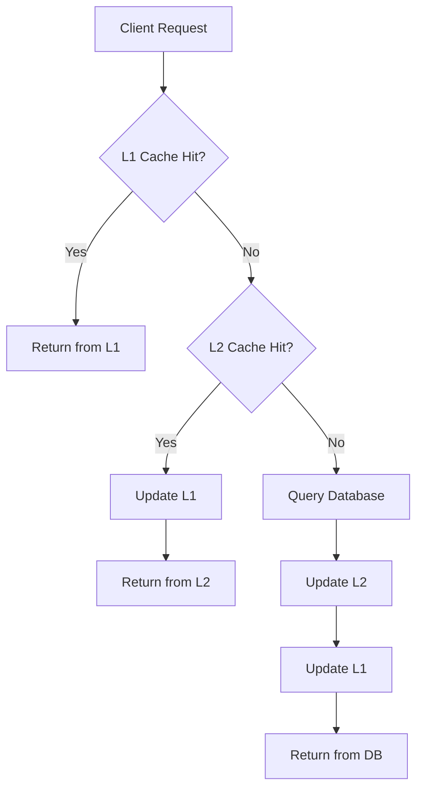
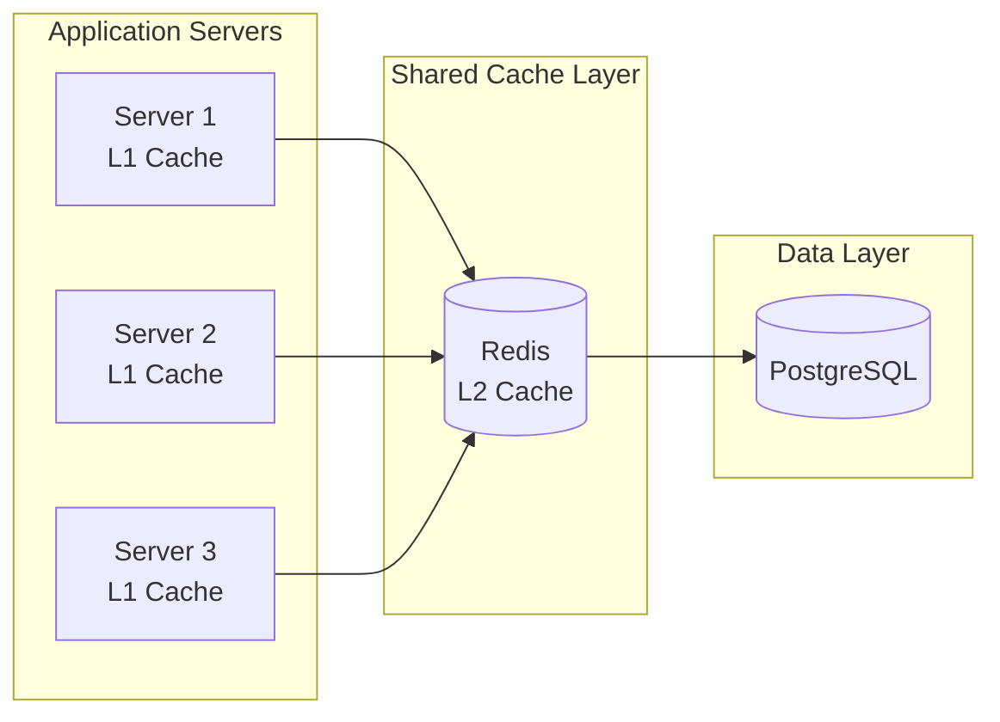
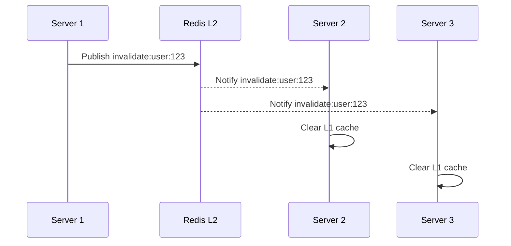

# How to Implement L2 Cache Design

Author: [nawazdhandala](https://github.com/nawazdhandala)

Tags: Caching, L2 Cache, Redis, Architecture

Description: Learn to implement L2 cache design using shared caching for distributed applications.

---

Caching is one of the most effective ways to improve application performance. While most developers are familiar with L1 (local) caching, L2 (shared) caching becomes essential when running distributed applications across multiple servers. This guide walks you through implementing a robust L2 cache design that scales.

## Understanding Cache Levels

Before diving into implementation, let's clarify what L1 and L2 caches mean in application architecture.

| Cache Level | Location | Scope | Speed | Use Case |
|-------------|----------|-------|-------|----------|
| L1 Cache | In-process memory | Single instance | Fastest | Frequently accessed, small data |
| L2 Cache | External service (Redis, Memcached) | Shared across instances | Fast | Session data, computed results |
| Database | Persistent storage | Global | Slowest | Source of truth |

The diagram below shows how requests flow through a two-level cache architecture.



## Architecture Overview

A well-designed L2 cache sits between your application instances and the database. All application servers share the same L2 cache, which ensures consistency across your distributed system.



## Implementation

Let's build a TypeScript implementation that handles both cache levels with proper fallback behavior.

First, define the interfaces that establish the contract for our cache operations.

```typescript
// cache-interfaces.ts
interface CacheConfig {
  l1MaxSize: number;      // Maximum items in L1 cache
  l1TtlSeconds: number;   // Time-to-live for L1 entries
  l2TtlSeconds: number;   // Time-to-live for L2 entries
  namespace: string;      // Prefix for cache keys
}

interface CacheEntry<T> {
  data: T;
  timestamp: number;
  expiresAt: number;
}
```

Next, implement the L1 cache using a simple in-memory Map with LRU eviction.

```typescript
// l1-cache.ts
class L1Cache {
  private cache: Map<string, CacheEntry<unknown>>;
  private maxSize: number;
  private ttlSeconds: number;

  constructor(maxSize: number, ttlSeconds: number) {
    this.cache = new Map();
    this.maxSize = maxSize;
    this.ttlSeconds = ttlSeconds;
  }

  // Get value from L1 cache, returns null if expired or missing
  get<T>(key: string): T | null {
    const entry = this.cache.get(key) as CacheEntry<T> | undefined;

    if (!entry) {
      return null;
    }

    // Check if entry has expired
    if (Date.now() > entry.expiresAt) {
      this.cache.delete(key);
      return null;
    }

    // Move to end for LRU ordering
    this.cache.delete(key);
    this.cache.set(key, entry);

    return entry.data;
  }

  // Store value in L1 cache with automatic eviction
  set<T>(key: string, data: T): void {
    // Evict oldest entries if at capacity
    if (this.cache.size >= this.maxSize) {
      const oldestKey = this.cache.keys().next().value;
      if (oldestKey) {
        this.cache.delete(oldestKey);
      }
    }

    const entry: CacheEntry<T> = {
      data,
      timestamp: Date.now(),
      expiresAt: Date.now() + this.ttlSeconds * 1000,
    };

    this.cache.set(key, entry);
  }

  invalidate(key: string): void {
    this.cache.delete(key);
  }
}
```

Now implement the L2 cache layer using Redis as the backing store.

```typescript
// l2-cache.ts
import Redis from 'ioredis';

class L2Cache {
  private redis: Redis;
  private ttlSeconds: number;
  private namespace: string;

  constructor(redisUrl: string, ttlSeconds: number, namespace: string) {
    this.redis = new Redis(redisUrl);
    this.ttlSeconds = ttlSeconds;
    this.namespace = namespace;
  }

  // Build namespaced key to avoid collisions
  private buildKey(key: string): string {
    return `${this.namespace}:${key}`;
  }

  async get<T>(key: string): Promise<T | null> {
    const fullKey = this.buildKey(key);
    const data = await this.redis.get(fullKey);

    if (!data) {
      return null;
    }

    return JSON.parse(data) as T;
  }

  async set<T>(key: string, data: T): Promise<void> {
    const fullKey = this.buildKey(key);
    const serialized = JSON.stringify(data);

    // Set with expiration using EX flag
    await this.redis.set(fullKey, serialized, 'EX', this.ttlSeconds);
  }

  async invalidate(key: string): Promise<void> {
    const fullKey = this.buildKey(key);
    await this.redis.del(fullKey);
  }

  // Invalidate all keys matching a pattern
  async invalidatePattern(pattern: string): Promise<void> {
    const fullPattern = this.buildKey(pattern);
    const keys = await this.redis.keys(fullPattern);

    if (keys.length > 0) {
      await this.redis.del(...keys);
    }
  }
}
```

Finally, create the unified cache manager that coordinates both levels.

```typescript
// cache-manager.ts
class CacheManager {
  private l1: L1Cache;
  private l2: L2Cache;

  constructor(config: CacheConfig, redisUrl: string) {
    this.l1 = new L1Cache(config.l1MaxSize, config.l1TtlSeconds);
    this.l2 = new L2Cache(redisUrl, config.l2TtlSeconds, config.namespace);
  }

  // Fetch with cache-aside pattern through both levels
  async get<T>(
    key: string,
    fetcher: () => Promise<T>
  ): Promise<T> {
    // Check L1 first (fastest)
    const l1Result = this.l1.get<T>(key);
    if (l1Result !== null) {
      return l1Result;
    }

    // Check L2 (shared cache)
    const l2Result = await this.l2.get<T>(key);
    if (l2Result !== null) {
      // Populate L1 from L2 hit
      this.l1.set(key, l2Result);
      return l2Result;
    }

    // Cache miss: fetch from source
    const freshData = await fetcher();

    // Populate both cache levels
    await this.l2.set(key, freshData);
    this.l1.set(key, freshData);

    return freshData;
  }

  // Invalidate across both cache levels
  async invalidate(key: string): Promise<void> {
    this.l1.invalidate(key);
    await this.l2.invalidate(key);
  }
}
```

## Usage Example

Here is how you would use the cache manager in a real application.

```typescript
// Initialize cache with configuration
const cache = new CacheManager(
  {
    l1MaxSize: 1000,
    l1TtlSeconds: 60,       // L1 expires in 1 minute
    l2TtlSeconds: 300,      // L2 expires in 5 minutes
    namespace: 'myapp',
  },
  'redis://localhost:6379'
);

// Fetch user with automatic caching
async function getUser(userId: string): Promise<User> {
  return cache.get(`user:${userId}`, async () => {
    // This only runs on cache miss
    const user = await database.query(
      'SELECT * FROM users WHERE id = $1',
      [userId]
    );
    return user;
  });
}

// Invalidate when user is updated
async function updateUser(userId: string, data: Partial<User>): Promise<void> {
  await database.query(
    'UPDATE users SET ... WHERE id = $1',
    [userId]
  );

  // Clear stale cache entries
  await cache.invalidate(`user:${userId}`);
}
```

## Cache Invalidation Strategies

Choosing the right invalidation strategy depends on your consistency requirements.

| Strategy | Consistency | Complexity | Best For |
|----------|-------------|------------|----------|
| TTL-based | Eventual | Low | Read-heavy data that tolerates staleness |
| Write-through | Strong | Medium | Critical data requiring freshness |
| Event-driven | Strong | High | Microservices with message queues |

For event-driven invalidation, you can publish cache invalidation messages through Redis Pub/Sub.



## Performance Considerations

Keep these guidelines in mind when tuning your cache.

Set L1 TTL shorter than L2 TTL. This ensures L1 refreshes from L2 periodically, maintaining better consistency across instances while still benefiting from the speed of local cache.

Size your L1 cache based on memory constraints. A typical starting point is 1000 to 5000 entries per application instance. Monitor memory usage and adjust accordingly.

Use Redis clustering for L2 when handling more than 100,000 requests per second. Single Redis instances can handle significant load, but clustering provides both capacity and redundancy.

Implement circuit breakers around L2 operations. If Redis becomes unavailable, your application should fall back to direct database queries rather than failing entirely.

## Conclusion

L2 cache design bridges the gap between fast local caching and distributed system consistency. By implementing a two-level cache with proper invalidation, you can dramatically reduce database load while ensuring all application instances see reasonably fresh data. Start with the basic implementation shown here, then add monitoring and tune TTL values based on your actual traffic patterns.
