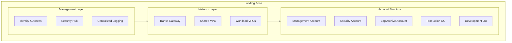
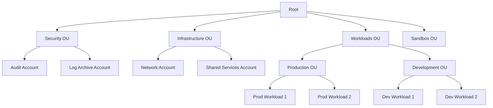
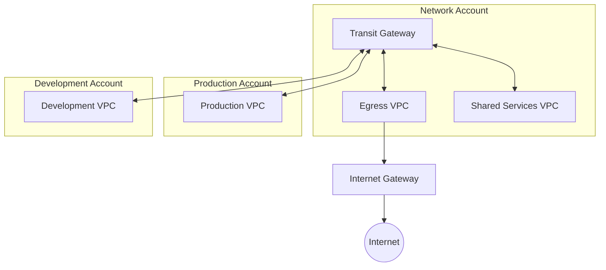
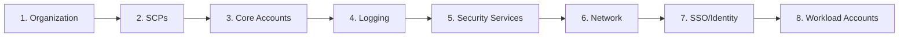

# How to Build Landing Zone

Author: [nawazdhandala](https://github.com/nawazdhandala)

Tags: Cloud, Infrastructure, IaC, AWS, Terraform, Landing Zone

Description: A comprehensive guide to building a secure, scalable cloud landing zone that provides the foundation for enterprise workloads using Infrastructure as Code.

---

A landing zone is the foundational architecture that enables organizations to deploy workloads in the cloud with security, governance, and operational best practices baked in from day one. Think of it as building the foundation of a house before constructing the rooms. Without a solid landing zone, organizations end up with sprawling, ungovernable cloud environments that become security nightmares.

## What is a Landing Zone?

A landing zone is a pre-configured, secure, multi-account cloud environment that follows organizational best practices. It includes:

- **Account Structure**: Organized hierarchy of cloud accounts for isolation and governance
- **Identity and Access Management**: Centralized authentication and authorization
- **Network Architecture**: Secure connectivity patterns and segmentation
- **Security Baselines**: Guardrails, logging, and compliance controls
- **Cost Management**: Budgets, tagging, and allocation strategies



## Why You Need a Landing Zone

Without a landing zone, teams often:

- Create accounts manually with inconsistent configurations
- Deploy resources without proper network isolation
- Miss critical security controls like CloudTrail or GuardDuty
- Struggle with cross-account access and permissions
- Lack visibility into costs and resource usage

A well-designed landing zone solves these problems by providing a standardized, automated foundation.

## Landing Zone Architecture Components

### 1. Multi-Account Strategy

The cornerstone of any landing zone is a well-thought-out account structure. AWS Organizations enables you to create a hierarchy of accounts organized into Organizational Units (OUs).



### 2. Core Account Types

Here is a breakdown of the essential accounts in a landing zone:

| Account Type | Purpose | Key Services |
|-------------|---------|--------------|
| Management | Organization root, billing, SCPs | AWS Organizations, Billing |
| Audit/Security | Security monitoring and response | Security Hub, GuardDuty, Config |
| Log Archive | Centralized, immutable log storage | S3, CloudWatch Logs |
| Network | Shared networking infrastructure | Transit Gateway, Route 53, Direct Connect |
| Shared Services | Common tools and services | CI/CD, artifact repositories, DNS |
| Workload | Application deployments | Application-specific resources |

## Building the Landing Zone with Terraform

Let's build a production-ready landing zone step by step using Terraform. We will start with the foundational components and work our way up.

### Project Structure

Organize your Terraform code for maintainability and reusability.

```
landing-zone/
  modules/
    organization/
      main.tf
      variables.tf
      outputs.tf
    account/
      main.tf
      variables.tf
      outputs.tf
    security-baseline/
      main.tf
      variables.tf
      outputs.tf
    network/
      main.tf
      variables.tf
      outputs.tf
  environments/
    management/
      main.tf
      backend.tf
      variables.tf
    security/
      main.tf
      backend.tf
    network/
      main.tf
      backend.tf
  policies/
    scps/
      deny-root-account.json
      require-imdsv2.json
      deny-leave-org.json
```

### Step 1: Set Up AWS Organizations

First, create the AWS Organization and define your Organizational Units.

The following Terraform configuration establishes the organization structure with separate OUs for security, infrastructure, and workloads.

```hcl
# modules/organization/main.tf

# Create the AWS Organization with all features enabled
resource "aws_organizations_organization" "main" {
  # Enable all features including SCPs
  feature_set = "ALL"

  # Enable trusted access for AWS services
  aws_service_access_principals = [
    "cloudtrail.amazonaws.com",
    "config.amazonaws.com",
    "securityhub.amazonaws.com",
    "guardduty.amazonaws.com",
    "sso.amazonaws.com",
    "ram.amazonaws.com"
  ]

  # Enable policy types
  enabled_policy_types = [
    "SERVICE_CONTROL_POLICY",
    "TAG_POLICY"
  ]
}

# Create Organizational Units for account organization
resource "aws_organizations_organizational_unit" "security" {
  name      = "Security"
  parent_id = aws_organizations_organization.main.roots[0].id
}

resource "aws_organizations_organizational_unit" "infrastructure" {
  name      = "Infrastructure"
  parent_id = aws_organizations_organization.main.roots[0].id
}

resource "aws_organizations_organizational_unit" "workloads" {
  name      = "Workloads"
  parent_id = aws_organizations_organization.main.roots[0].id
}

# Create sub-OUs for production and development workloads
resource "aws_organizations_organizational_unit" "production" {
  name      = "Production"
  parent_id = aws_organizations_organizational_unit.workloads.id
}

resource "aws_organizations_organizational_unit" "development" {
  name      = "Development"
  parent_id = aws_organizations_organizational_unit.workloads.id
}

resource "aws_organizations_organizational_unit" "sandbox" {
  name      = "Sandbox"
  parent_id = aws_organizations_organization.main.roots[0].id
}
```

### Step 2: Implement Service Control Policies (SCPs)

SCPs are guardrails that restrict what actions can be taken in member accounts. They are essential for enforcing security policies across your organization.

This SCP prevents users from disabling critical security services or modifying security configurations.

```hcl
# modules/organization/scps.tf

# Deny disabling of security services
resource "aws_organizations_policy" "deny_security_disable" {
  name        = "DenySecurityServiceDisable"
  description = "Prevents disabling of critical security services"
  type        = "SERVICE_CONTROL_POLICY"

  content = jsonencode({
    Version = "2012-10-17"
    Statement = [
      {
        Sid    = "DenySecurityHubDisable"
        Effect = "Deny"
        Action = [
          "securityhub:DeleteInvitations",
          "securityhub:DisableSecurityHub",
          "securityhub:DisassociateFromMasterAccount",
          "securityhub:DeleteMembers",
          "securityhub:DisassociateMembers"
        ]
        Resource = "*"
      },
      {
        Sid    = "DenyGuardDutyDisable"
        Effect = "Deny"
        Action = [
          "guardduty:DeleteDetector",
          "guardduty:DeleteMembers",
          "guardduty:DisassociateFromMasterAccount",
          "guardduty:StopMonitoringMembers"
        ]
        Resource = "*"
      },
      {
        Sid    = "DenyCloudTrailDisable"
        Effect = "Deny"
        Action = [
          "cloudtrail:DeleteTrail",
          "cloudtrail:StopLogging",
          "cloudtrail:UpdateTrail"
        ]
        Resource = "*"
        Condition = {
          StringNotLike = {
            "aws:PrincipalArn" = [
              "arn:aws:iam::*:role/LandingZoneAdmin"
            ]
          }
        }
      }
    ]
  })
}

# Require IMDSv2 for all EC2 instances
resource "aws_organizations_policy" "require_imdsv2" {
  name        = "RequireIMDSv2"
  description = "Requires IMDSv2 for all EC2 instances"
  type        = "SERVICE_CONTROL_POLICY"

  content = jsonencode({
    Version = "2012-10-17"
    Statement = [
      {
        Sid    = "RequireImdsV2"
        Effect = "Deny"
        Action = "ec2:RunInstances"
        Resource = "arn:aws:ec2:*:*:instance/*"
        Condition = {
          StringNotEquals = {
            "ec2:MetadataHttpTokens" = "required"
          }
        }
      }
    ]
  })
}

# Prevent accounts from leaving the organization
resource "aws_organizations_policy" "deny_leave_org" {
  name        = "DenyLeaveOrganization"
  description = "Prevents accounts from leaving the organization"
  type        = "SERVICE_CONTROL_POLICY"

  content = jsonencode({
    Version = "2012-10-17"
    Statement = [
      {
        Sid      = "DenyLeaveOrg"
        Effect   = "Deny"
        Action   = "organizations:LeaveOrganization"
        Resource = "*"
      }
    ]
  })
}

# Attach SCPs to OUs
resource "aws_organizations_policy_attachment" "security_scp" {
  policy_id = aws_organizations_policy.deny_security_disable.id
  target_id = aws_organizations_organizational_unit.workloads.id
}

resource "aws_organizations_policy_attachment" "imdsv2_scp" {
  policy_id = aws_organizations_policy.require_imdsv2.id
  target_id = aws_organizations_organization.main.roots[0].id
}

resource "aws_organizations_policy_attachment" "leave_org_scp" {
  policy_id = aws_organizations_policy.deny_leave_org.id
  target_id = aws_organizations_organization.main.roots[0].id
}
```

### Step 3: Create Core Accounts

Use a reusable module to create accounts consistently with the right configurations.

This module creates new AWS accounts and places them in the correct OU with standardized settings.

```hcl
# modules/account/main.tf

# Create AWS account within the organization
resource "aws_organizations_account" "this" {
  name      = var.account_name
  email     = var.account_email
  parent_id = var.parent_ou_id

  # IAM role that allows management account access
  role_name = "OrganizationAccountAccessRole"

  # Allow Terraform to handle account closure
  close_on_deletion = var.close_on_deletion

  tags = merge(var.tags, {
    Environment = var.environment
    ManagedBy   = "terraform"
  })

  lifecycle {
    # Prevent accidental account deletion
    prevent_destroy = true
  }
}

# Wait for account to be ready before proceeding
resource "time_sleep" "wait_for_account" {
  depends_on      = [aws_organizations_account.this]
  create_duration = "60s"
}
```

```hcl
# modules/account/variables.tf

variable "account_name" {
  description = "Name of the AWS account"
  type        = string
}

variable "account_email" {
  description = "Email address for the AWS account"
  type        = string
}

variable "parent_ou_id" {
  description = "ID of the parent Organizational Unit"
  type        = string
}

variable "environment" {
  description = "Environment type (production, development, sandbox)"
  type        = string
}

variable "close_on_deletion" {
  description = "Whether to close the account on deletion"
  type        = bool
  default     = false
}

variable "tags" {
  description = "Additional tags for the account"
  type        = map(string)
  default     = {}
}
```

Now use the module to create the core accounts.

```hcl
# environments/management/accounts.tf

# Security/Audit Account
module "security_account" {
  source = "../../modules/account"

  account_name      = "security-audit"
  account_email     = "aws-security@example.com"
  parent_ou_id      = module.organization.security_ou_id
  environment       = "security"
  close_on_deletion = false

  tags = {
    CostCenter = "security"
    Team       = "platform"
  }
}

# Log Archive Account
module "log_archive_account" {
  source = "../../modules/account"

  account_name      = "log-archive"
  account_email     = "aws-logs@example.com"
  parent_ou_id      = module.organization.security_ou_id
  environment       = "security"
  close_on_deletion = false

  tags = {
    CostCenter = "security"
    Team       = "platform"
  }
}

# Network Account
module "network_account" {
  source = "../../modules/account"

  account_name      = "network"
  account_email     = "aws-network@example.com"
  parent_ou_id      = module.organization.infrastructure_ou_id
  environment       = "infrastructure"
  close_on_deletion = false

  tags = {
    CostCenter = "infrastructure"
    Team       = "platform"
  }
}

# Shared Services Account
module "shared_services_account" {
  source = "../../modules/account"

  account_name      = "shared-services"
  account_email     = "aws-shared@example.com"
  parent_ou_id      = module.organization.infrastructure_ou_id
  environment       = "infrastructure"
  close_on_deletion = false

  tags = {
    CostCenter = "infrastructure"
    Team       = "platform"
  }
}
```

### Step 4: Set Up Centralized Logging

Centralized logging is critical for security, compliance, and troubleshooting. All CloudTrail, Config, and VPC Flow Logs should flow to the Log Archive account.

This configuration creates an S3 bucket with proper retention policies, encryption, and access controls for centralized log storage.

```hcl
# modules/logging/main.tf

# S3 bucket for centralized logs with proper security controls
resource "aws_s3_bucket" "central_logs" {
  bucket = "${var.organization_id}-central-logs-${var.region}"

  tags = {
    Name        = "Central Logs Bucket"
    Environment = "security"
    ManagedBy   = "terraform"
  }
}

# Enable versioning for audit trail
resource "aws_s3_bucket_versioning" "central_logs" {
  bucket = aws_s3_bucket.central_logs.id

  versioning_configuration {
    status = "Enabled"
  }
}

# Server-side encryption with AWS KMS
resource "aws_s3_bucket_server_side_encryption_configuration" "central_logs" {
  bucket = aws_s3_bucket.central_logs.id

  rule {
    apply_server_side_encryption_by_default {
      kms_master_key_id = aws_kms_key.log_encryption.arn
      sse_algorithm     = "aws:kms"
    }
    bucket_key_enabled = true
  }
}

# Block all public access
resource "aws_s3_bucket_public_access_block" "central_logs" {
  bucket = aws_s3_bucket.central_logs.id

  block_public_acls       = true
  block_public_policy     = true
  ignore_public_acls      = true
  restrict_public_buckets = true
}

# Lifecycle policy for log retention
resource "aws_s3_bucket_lifecycle_configuration" "central_logs" {
  bucket = aws_s3_bucket.central_logs.id

  rule {
    id     = "cloudtrail-retention"
    status = "Enabled"

    filter {
      prefix = "cloudtrail/"
    }

    # Move to Glacier after 90 days
    transition {
      days          = 90
      storage_class = "GLACIER"
    }

    # Move to Deep Archive after 365 days
    transition {
      days          = 365
      storage_class = "DEEP_ARCHIVE"
    }

    # Delete after 7 years for compliance
    expiration {
      days = 2555
    }
  }

  rule {
    id     = "config-retention"
    status = "Enabled"

    filter {
      prefix = "config/"
    }

    transition {
      days          = 90
      storage_class = "GLACIER"
    }

    expiration {
      days = 2555
    }
  }

  rule {
    id     = "vpc-flow-logs-retention"
    status = "Enabled"

    filter {
      prefix = "vpc-flow-logs/"
    }

    transition {
      days          = 30
      storage_class = "STANDARD_IA"
    }

    transition {
      days          = 90
      storage_class = "GLACIER"
    }

    expiration {
      days = 365
    }
  }
}

# KMS key for log encryption
resource "aws_kms_key" "log_encryption" {
  description             = "KMS key for central log encryption"
  deletion_window_in_days = 30
  enable_key_rotation     = true

  policy = jsonencode({
    Version = "2012-10-17"
    Statement = [
      {
        Sid    = "Enable IAM User Permissions"
        Effect = "Allow"
        Principal = {
          AWS = "arn:aws:iam::${data.aws_caller_identity.current.account_id}:root"
        }
        Action   = "kms:*"
        Resource = "*"
      },
      {
        Sid    = "Allow CloudTrail to encrypt logs"
        Effect = "Allow"
        Principal = {
          Service = "cloudtrail.amazonaws.com"
        }
        Action = [
          "kms:GenerateDataKey*",
          "kms:DescribeKey"
        ]
        Resource = "*"
        Condition = {
          StringLike = {
            "kms:EncryptionContext:aws:cloudtrail:arn" = "arn:aws:cloudtrail:*:${var.organization_id}:trail/*"
          }
        }
      },
      {
        Sid    = "Allow Config to encrypt snapshots"
        Effect = "Allow"
        Principal = {
          Service = "config.amazonaws.com"
        }
        Action = [
          "kms:GenerateDataKey*",
          "kms:Decrypt"
        ]
        Resource = "*"
      }
    ]
  })

  tags = {
    Name      = "central-logs-kms-key"
    ManagedBy = "terraform"
  }
}

resource "aws_kms_alias" "log_encryption" {
  name          = "alias/central-logs"
  target_key_id = aws_kms_key.log_encryption.key_id
}

# Bucket policy allowing cross-account writes from all org accounts
resource "aws_s3_bucket_policy" "central_logs" {
  bucket = aws_s3_bucket.central_logs.id

  policy = jsonencode({
    Version = "2012-10-17"
    Statement = [
      {
        Sid    = "AllowCloudTrailWrite"
        Effect = "Allow"
        Principal = {
          Service = "cloudtrail.amazonaws.com"
        }
        Action   = "s3:PutObject"
        Resource = "${aws_s3_bucket.central_logs.arn}/cloudtrail/*"
        Condition = {
          StringEquals = {
            "s3:x-amz-acl"             = "bucket-owner-full-control"
            "aws:SourceOrgID"          = var.organization_id
          }
        }
      },
      {
        Sid    = "AllowCloudTrailBucketACL"
        Effect = "Allow"
        Principal = {
          Service = "cloudtrail.amazonaws.com"
        }
        Action   = "s3:GetBucketAcl"
        Resource = aws_s3_bucket.central_logs.arn
        Condition = {
          StringEquals = {
            "aws:SourceOrgID" = var.organization_id
          }
        }
      },
      {
        Sid    = "AllowConfigWrite"
        Effect = "Allow"
        Principal = {
          Service = "config.amazonaws.com"
        }
        Action   = "s3:PutObject"
        Resource = "${aws_s3_bucket.central_logs.arn}/config/*"
        Condition = {
          StringEquals = {
            "s3:x-amz-acl"    = "bucket-owner-full-control"
            "aws:SourceOrgID" = var.organization_id
          }
        }
      },
      {
        Sid    = "DenyInsecureTransport"
        Effect = "Deny"
        Principal = "*"
        Action   = "s3:*"
        Resource = [
          aws_s3_bucket.central_logs.arn,
          "${aws_s3_bucket.central_logs.arn}/*"
        ]
        Condition = {
          Bool = {
            "aws:SecureTransport" = "false"
          }
        }
      }
    ]
  })
}

data "aws_caller_identity" "current" {}
```

### Step 5: Enable Organization-Wide CloudTrail

Set up an organization trail that captures API activity from all accounts.

```hcl
# modules/logging/cloudtrail.tf

# Organization-wide CloudTrail
resource "aws_cloudtrail" "organization" {
  name                          = "organization-trail"
  s3_bucket_name               = aws_s3_bucket.central_logs.id
  s3_key_prefix                = "cloudtrail"

  # Enable for all accounts in the organization
  is_organization_trail        = true
  is_multi_region_trail        = true
  include_global_service_events = true

  # Enable log file validation
  enable_log_file_validation   = true

  # Encrypt logs with KMS
  kms_key_id                   = aws_kms_key.log_encryption.arn

  # Enable CloudWatch Logs integration
  cloud_watch_logs_group_arn   = "${aws_cloudwatch_log_group.cloudtrail.arn}:*"
  cloud_watch_logs_role_arn    = aws_iam_role.cloudtrail_cloudwatch.arn

  # Capture data events for S3 and Lambda
  event_selector {
    read_write_type           = "All"
    include_management_events = true

    data_resource {
      type   = "AWS::S3::Object"
      values = ["arn:aws:s3"]
    }
  }

  event_selector {
    read_write_type           = "All"
    include_management_events = true

    data_resource {
      type   = "AWS::Lambda::Function"
      values = ["arn:aws:lambda"]
    }
  }

  tags = {
    Name      = "Organization CloudTrail"
    ManagedBy = "terraform"
  }
}

# CloudWatch Log Group for CloudTrail
resource "aws_cloudwatch_log_group" "cloudtrail" {
  name              = "/aws/cloudtrail/organization"
  retention_in_days = 90
  kms_key_id        = aws_kms_key.log_encryption.arn

  tags = {
    Name      = "CloudTrail Logs"
    ManagedBy = "terraform"
  }
}

# IAM role for CloudTrail to write to CloudWatch
resource "aws_iam_role" "cloudtrail_cloudwatch" {
  name = "cloudtrail-cloudwatch-role"

  assume_role_policy = jsonencode({
    Version = "2012-10-17"
    Statement = [
      {
        Action = "sts:AssumeRole"
        Effect = "Allow"
        Principal = {
          Service = "cloudtrail.amazonaws.com"
        }
      }
    ]
  })
}

resource "aws_iam_role_policy" "cloudtrail_cloudwatch" {
  name = "cloudtrail-cloudwatch-policy"
  role = aws_iam_role.cloudtrail_cloudwatch.id

  policy = jsonencode({
    Version = "2012-10-17"
    Statement = [
      {
        Effect = "Allow"
        Action = [
          "logs:CreateLogStream",
          "logs:PutLogEvents"
        ]
        Resource = "${aws_cloudwatch_log_group.cloudtrail.arn}:*"
      }
    ]
  })
}
```

### Step 6: Configure Security Services

Enable Security Hub and GuardDuty across all accounts from the security account.

```hcl
# modules/security-baseline/main.tf

# Enable Security Hub as the delegated administrator
resource "aws_securityhub_organization_admin_account" "main" {
  admin_account_id = var.security_account_id
}

# Security Hub organization configuration
resource "aws_securityhub_organization_configuration" "main" {
  auto_enable           = true
  auto_enable_standards = "DEFAULT"

  depends_on = [aws_securityhub_organization_admin_account.main]
}

# Enable GuardDuty as the delegated administrator
resource "aws_guardduty_organization_admin_account" "main" {
  admin_account_id = var.security_account_id
}

# GuardDuty detector in the delegated admin account
resource "aws_guardduty_detector" "main" {
  enable = true

  datasources {
    s3_logs {
      enable = true
    }
    kubernetes {
      audit_logs {
        enable = true
      }
    }
    malware_protection {
      scan_ec2_instance_with_findings {
        ebs_volumes {
          enable = true
        }
      }
    }
  }

  finding_publishing_frequency = "FIFTEEN_MINUTES"

  tags = {
    Name      = "Organization GuardDuty"
    ManagedBy = "terraform"
  }
}

# Auto-enable GuardDuty for new accounts
resource "aws_guardduty_organization_configuration" "main" {
  auto_enable_organization_members = "ALL"
  detector_id                      = aws_guardduty_detector.main.id

  datasources {
    s3_logs {
      auto_enable = true
    }
    kubernetes {
      audit_logs {
        enable = true
      }
    }
    malware_protection {
      scan_ec2_instance_with_findings {
        ebs_volumes {
          auto_enable = true
        }
      }
    }
  }
}

# Enable AWS Config with organization-wide rules
resource "aws_config_organization_managed_rule" "encrypted_volumes" {
  name            = "encrypted-volumes"
  rule_identifier = "ENCRYPTED_VOLUMES"
}

resource "aws_config_organization_managed_rule" "root_mfa" {
  name            = "root-account-mfa-enabled"
  rule_identifier = "ROOT_ACCOUNT_MFA_ENABLED"
}

resource "aws_config_organization_managed_rule" "s3_bucket_ssl" {
  name            = "s3-bucket-ssl-requests-only"
  rule_identifier = "S3_BUCKET_SSL_REQUESTS_ONLY"
}

resource "aws_config_organization_managed_rule" "iam_password_policy" {
  name            = "iam-password-policy"
  rule_identifier = "IAM_PASSWORD_POLICY"

  input_parameters = jsonencode({
    RequireUppercaseCharacters = "true"
    RequireLowercaseCharacters = "true"
    RequireSymbols             = "true"
    RequireNumbers             = "true"
    MinimumPasswordLength      = "14"
    PasswordReusePrevention    = "24"
    MaxPasswordAge             = "90"
  })
}
```

### Step 7: Build the Network Foundation

Create a hub-and-spoke network architecture using Transit Gateway.



This module creates a Transit Gateway and configures route tables for hub-and-spoke connectivity.

```hcl
# modules/network/transit-gateway.tf

# Create Transit Gateway for centralized connectivity
resource "aws_ec2_transit_gateway" "main" {
  description                     = "Organization Transit Gateway"
  default_route_table_association = "disable"
  default_route_table_propagation = "disable"

  # Enable DNS support
  dns_support = "enable"

  # Enable VPN ECMP support for redundancy
  vpn_ecmp_support = "enable"

  # Auto accept shared attachments from RAM
  auto_accept_shared_attachments = "enable"

  tags = {
    Name      = "organization-tgw"
    ManagedBy = "terraform"
  }
}

# Route tables for different traffic types
resource "aws_ec2_transit_gateway_route_table" "production" {
  transit_gateway_id = aws_ec2_transit_gateway.main.id

  tags = {
    Name        = "production-route-table"
    Environment = "production"
    ManagedBy   = "terraform"
  }
}

resource "aws_ec2_transit_gateway_route_table" "development" {
  transit_gateway_id = aws_ec2_transit_gateway.main.id

  tags = {
    Name        = "development-route-table"
    Environment = "development"
    ManagedBy   = "terraform"
  }
}

resource "aws_ec2_transit_gateway_route_table" "shared" {
  transit_gateway_id = aws_ec2_transit_gateway.main.id

  tags = {
    Name        = "shared-services-route-table"
    Environment = "shared"
    ManagedBy   = "terraform"
  }
}

# Share Transit Gateway with organization using RAM
resource "aws_ram_resource_share" "transit_gateway" {
  name                      = "transit-gateway-share"
  allow_external_principals = false

  tags = {
    Name      = "Transit Gateway Share"
    ManagedBy = "terraform"
  }
}

resource "aws_ram_resource_association" "transit_gateway" {
  resource_arn       = aws_ec2_transit_gateway.main.arn
  resource_share_arn = aws_ram_resource_share.transit_gateway.arn
}

# Share with entire organization
resource "aws_ram_principal_association" "organization" {
  principal          = var.organization_arn
  resource_share_arn = aws_ram_resource_share.transit_gateway.arn
}
```

```hcl
# modules/network/egress-vpc.tf

# Egress VPC for centralized internet access
resource "aws_vpc" "egress" {
  cidr_block           = var.egress_vpc_cidr
  enable_dns_hostnames = true
  enable_dns_support   = true

  tags = {
    Name        = "egress-vpc"
    Environment = "network"
    ManagedBy   = "terraform"
  }
}

# Public subnets for NAT Gateways
resource "aws_subnet" "egress_public" {
  count             = length(var.availability_zones)
  vpc_id            = aws_vpc.egress.id
  cidr_block        = cidrsubnet(var.egress_vpc_cidr, 4, count.index)
  availability_zone = var.availability_zones[count.index]

  map_public_ip_on_launch = true

  tags = {
    Name        = "egress-public-${var.availability_zones[count.index]}"
    Environment = "network"
    ManagedBy   = "terraform"
  }
}

# Private subnets for Transit Gateway attachments
resource "aws_subnet" "egress_private" {
  count             = length(var.availability_zones)
  vpc_id            = aws_vpc.egress.id
  cidr_block        = cidrsubnet(var.egress_vpc_cidr, 4, count.index + length(var.availability_zones))
  availability_zone = var.availability_zones[count.index]

  tags = {
    Name        = "egress-private-${var.availability_zones[count.index]}"
    Environment = "network"
    ManagedBy   = "terraform"
  }
}

# Internet Gateway
resource "aws_internet_gateway" "egress" {
  vpc_id = aws_vpc.egress.id

  tags = {
    Name        = "egress-igw"
    Environment = "network"
    ManagedBy   = "terraform"
  }
}

# Elastic IPs for NAT Gateways
resource "aws_eip" "nat" {
  count  = length(var.availability_zones)
  domain = "vpc"

  tags = {
    Name        = "egress-nat-eip-${var.availability_zones[count.index]}"
    Environment = "network"
    ManagedBy   = "terraform"
  }
}

# NAT Gateways for outbound internet access
resource "aws_nat_gateway" "egress" {
  count         = length(var.availability_zones)
  allocation_id = aws_eip.nat[count.index].id
  subnet_id     = aws_subnet.egress_public[count.index].id

  tags = {
    Name        = "egress-nat-${var.availability_zones[count.index]}"
    Environment = "network"
    ManagedBy   = "terraform"
  }

  depends_on = [aws_internet_gateway.egress]
}

# Transit Gateway attachment for egress VPC
resource "aws_ec2_transit_gateway_vpc_attachment" "egress" {
  subnet_ids         = aws_subnet.egress_private[*].id
  transit_gateway_id = aws_ec2_transit_gateway.main.id
  vpc_id             = aws_vpc.egress.id

  dns_support        = "enable"

  tags = {
    Name        = "egress-vpc-attachment"
    Environment = "network"
    ManagedBy   = "terraform"
  }
}

# Route tables
resource "aws_route_table" "egress_public" {
  vpc_id = aws_vpc.egress.id

  route {
    cidr_block = "0.0.0.0/0"
    gateway_id = aws_internet_gateway.egress.id
  }

  # Route to spoke VPCs via Transit Gateway
  route {
    cidr_block         = "10.0.0.0/8"
    transit_gateway_id = aws_ec2_transit_gateway.main.id
  }

  tags = {
    Name        = "egress-public-rt"
    Environment = "network"
    ManagedBy   = "terraform"
  }
}

resource "aws_route_table" "egress_private" {
  count  = length(var.availability_zones)
  vpc_id = aws_vpc.egress.id

  route {
    cidr_block     = "0.0.0.0/0"
    nat_gateway_id = aws_nat_gateway.egress[count.index].id
  }

  route {
    cidr_block         = "10.0.0.0/8"
    transit_gateway_id = aws_ec2_transit_gateway.main.id
  }

  tags = {
    Name        = "egress-private-rt-${var.availability_zones[count.index]}"
    Environment = "network"
    ManagedBy   = "terraform"
  }
}

# Route table associations
resource "aws_route_table_association" "egress_public" {
  count          = length(var.availability_zones)
  subnet_id      = aws_subnet.egress_public[count.index].id
  route_table_id = aws_route_table.egress_public.id
}

resource "aws_route_table_association" "egress_private" {
  count          = length(var.availability_zones)
  subnet_id      = aws_subnet.egress_private[count.index].id
  route_table_id = aws_route_table.egress_private[count.index].id
}
```

### Step 8: Workload Account VPC Module

Create a reusable module for workload VPCs that connect to the Transit Gateway.

```hcl
# modules/network/workload-vpc/main.tf

# Workload VPC with standard configuration
resource "aws_vpc" "workload" {
  cidr_block           = var.vpc_cidr
  enable_dns_hostnames = true
  enable_dns_support   = true

  tags = {
    Name        = "${var.environment}-vpc"
    Environment = var.environment
    ManagedBy   = "terraform"
  }
}

# Private subnets for workloads (no direct internet access)
resource "aws_subnet" "private" {
  count             = length(var.availability_zones)
  vpc_id            = aws_vpc.workload.id
  cidr_block        = cidrsubnet(var.vpc_cidr, 4, count.index)
  availability_zone = var.availability_zones[count.index]

  tags = {
    Name        = "${var.environment}-private-${var.availability_zones[count.index]}"
    Environment = var.environment
    Type        = "private"
    ManagedBy   = "terraform"
  }
}

# Database subnets (isolated, no route to internet)
resource "aws_subnet" "database" {
  count             = length(var.availability_zones)
  vpc_id            = aws_vpc.workload.id
  cidr_block        = cidrsubnet(var.vpc_cidr, 4, count.index + length(var.availability_zones))
  availability_zone = var.availability_zones[count.index]

  tags = {
    Name        = "${var.environment}-database-${var.availability_zones[count.index]}"
    Environment = var.environment
    Type        = "database"
    ManagedBy   = "terraform"
  }
}

# Transit Gateway attachment for this VPC
resource "aws_ec2_transit_gateway_vpc_attachment" "workload" {
  subnet_ids         = aws_subnet.private[*].id
  transit_gateway_id = var.transit_gateway_id
  vpc_id             = aws_vpc.workload.id

  dns_support = "enable"

  tags = {
    Name        = "${var.environment}-vpc-attachment"
    Environment = var.environment
    ManagedBy   = "terraform"
  }
}

# Route table for private subnets
resource "aws_route_table" "private" {
  vpc_id = aws_vpc.workload.id

  # Route to internet via Transit Gateway (goes through egress VPC)
  route {
    cidr_block         = "0.0.0.0/0"
    transit_gateway_id = var.transit_gateway_id
  }

  # Route to other VPCs via Transit Gateway
  route {
    cidr_block         = "10.0.0.0/8"
    transit_gateway_id = var.transit_gateway_id
  }

  tags = {
    Name        = "${var.environment}-private-rt"
    Environment = var.environment
    ManagedBy   = "terraform"
  }
}

# Route table for database subnets (no internet route)
resource "aws_route_table" "database" {
  vpc_id = aws_vpc.workload.id

  # Only route to other internal networks if needed
  route {
    cidr_block         = "10.0.0.0/8"
    transit_gateway_id = var.transit_gateway_id
  }

  tags = {
    Name        = "${var.environment}-database-rt"
    Environment = var.environment
    ManagedBy   = "terraform"
  }
}

# Route table associations
resource "aws_route_table_association" "private" {
  count          = length(var.availability_zones)
  subnet_id      = aws_subnet.private[count.index].id
  route_table_id = aws_route_table.private.id
}

resource "aws_route_table_association" "database" {
  count          = length(var.availability_zones)
  subnet_id      = aws_subnet.database[count.index].id
  route_table_id = aws_route_table.database.id
}

# VPC Flow Logs
resource "aws_flow_log" "workload" {
  iam_role_arn    = var.flow_log_role_arn
  log_destination = var.flow_log_destination
  traffic_type    = "ALL"
  vpc_id          = aws_vpc.workload.id

  tags = {
    Name        = "${var.environment}-vpc-flow-logs"
    Environment = var.environment
    ManagedBy   = "terraform"
  }
}
```

## Setting Up AWS IAM Identity Center (SSO)

Configure centralized identity management for all accounts.

```hcl
# modules/identity/sso.tf

# Enable AWS IAM Identity Center
data "aws_ssoadmin_instances" "main" {}

# Create permission sets for different access levels
resource "aws_ssoadmin_permission_set" "admin" {
  name             = "AdministratorAccess"
  description      = "Full administrative access"
  instance_arn     = tolist(data.aws_ssoadmin_instances.main.arns)[0]
  session_duration = "PT4H"

  tags = {
    ManagedBy = "terraform"
  }
}

resource "aws_ssoadmin_managed_policy_attachment" "admin" {
  instance_arn       = tolist(data.aws_ssoadmin_instances.main.arns)[0]
  managed_policy_arn = "arn:aws:iam::aws:policy/AdministratorAccess"
  permission_set_arn = aws_ssoadmin_permission_set.admin.arn
}

resource "aws_ssoadmin_permission_set" "developer" {
  name             = "DeveloperAccess"
  description      = "Developer access with restricted permissions"
  instance_arn     = tolist(data.aws_ssoadmin_instances.main.arns)[0]
  session_duration = "PT8H"

  tags = {
    ManagedBy = "terraform"
  }
}

resource "aws_ssoadmin_managed_policy_attachment" "developer_poweruser" {
  instance_arn       = tolist(data.aws_ssoadmin_instances.main.arns)[0]
  managed_policy_arn = "arn:aws:iam::aws:policy/PowerUserAccess"
  permission_set_arn = aws_ssoadmin_permission_set.developer.arn
}

resource "aws_ssoadmin_permission_set" "readonly" {
  name             = "ReadOnlyAccess"
  description      = "Read-only access for auditing"
  instance_arn     = tolist(data.aws_ssoadmin_instances.main.arns)[0]
  session_duration = "PT8H"

  tags = {
    ManagedBy = "terraform"
  }
}

resource "aws_ssoadmin_managed_policy_attachment" "readonly" {
  instance_arn       = tolist(data.aws_ssoadmin_instances.main.arns)[0]
  managed_policy_arn = "arn:aws:iam::aws:policy/ReadOnlyAccess"
  permission_set_arn = aws_ssoadmin_permission_set.readonly.arn
}

# Custom permission set for security team
resource "aws_ssoadmin_permission_set" "security" {
  name             = "SecurityAudit"
  description      = "Security team access for auditing and incident response"
  instance_arn     = tolist(data.aws_ssoadmin_instances.main.arns)[0]
  session_duration = "PT4H"

  tags = {
    ManagedBy = "terraform"
  }
}

resource "aws_ssoadmin_managed_policy_attachment" "security_audit" {
  instance_arn       = tolist(data.aws_ssoadmin_instances.main.arns)[0]
  managed_policy_arn = "arn:aws:iam::aws:policy/SecurityAudit"
  permission_set_arn = aws_ssoadmin_permission_set.security.arn
}

resource "aws_ssoadmin_permission_set_inline_policy" "security_custom" {
  instance_arn       = tolist(data.aws_ssoadmin_instances.main.arns)[0]
  permission_set_arn = aws_ssoadmin_permission_set.security.arn

  inline_policy = jsonencode({
    Version = "2012-10-17"
    Statement = [
      {
        Effect = "Allow"
        Action = [
          "guardduty:Get*",
          "guardduty:List*",
          "securityhub:Get*",
          "securityhub:List*",
          "securityhub:Describe*",
          "inspector2:Get*",
          "inspector2:List*"
        ]
        Resource = "*"
      }
    ]
  })
}
```

## Deploying the Landing Zone

Here is a recommended deployment order for your landing zone.



### Deployment Script

This script automates the deployment sequence with proper dependencies.

```bash
#!/bin/bash
# deploy-landing-zone.sh

set -e

echo "Deploying Landing Zone..."

# Step 1: Deploy Organization structure
echo "Step 1: Creating Organization structure..."
cd environments/management
terraform init
terraform plan -out=tfplan
terraform apply tfplan

# Step 2: Deploy Security baseline
echo "Step 2: Deploying Security baseline..."
cd ../security
terraform init
terraform plan -out=tfplan
terraform apply tfplan

# Step 3: Deploy Network infrastructure
echo "Step 3: Deploying Network infrastructure..."
cd ../network
terraform init
terraform plan -out=tfplan
terraform apply tfplan

# Step 4: Configure SSO
echo "Step 4: Configuring IAM Identity Center..."
cd ../identity
terraform init
terraform plan -out=tfplan
terraform apply tfplan

echo "Landing Zone deployment complete!"
```

## Best Practices Summary

| Area | Best Practice |
|------|---------------|
| Account Structure | Use separate accounts for security, logging, networking, and workloads |
| SCPs | Start with deny-all and explicitly allow required services |
| Logging | Centralize all logs in a dedicated account with immutable storage |
| Security | Enable GuardDuty, Security Hub, and Config in all accounts |
| Networking | Use Transit Gateway for hub-and-spoke connectivity |
| Identity | Use IAM Identity Center for centralized access management |
| IaC | Version control all configurations and use CI/CD for deployments |
| Tagging | Enforce consistent tagging through SCPs and Config rules |

## Common Pitfalls to Avoid

1. **Starting without a plan**: Define your account structure and network topology before writing any code
2. **Over-permissive SCPs**: Start restrictive and add permissions as needed
3. **Forgetting DNS**: Always include DNS resolution in network policies
4. **Ignoring costs**: Set up budgets and cost allocation tags from day one
5. **Manual changes**: Any manual change will cause drift - automate everything
6. **Single region**: Design for multi-region from the start, even if you deploy to one region initially

## Next Steps

Once your landing zone is deployed, you can:

1. **Create workload accounts** using the account vending machine pattern
2. **Set up CI/CD pipelines** for infrastructure deployments
3. **Implement monitoring** with CloudWatch and third-party tools like OneUptime
4. **Establish runbooks** for common operational tasks
5. **Document everything** in a central knowledge base

---

A well-architected landing zone is the foundation for successful cloud operations. By investing time upfront in building a solid foundation with proper account structure, security controls, and automation, you set your organization up for scalable and secure cloud adoption. The Terraform modules provided here give you a production-ready starting point that you can customize for your specific requirements.
