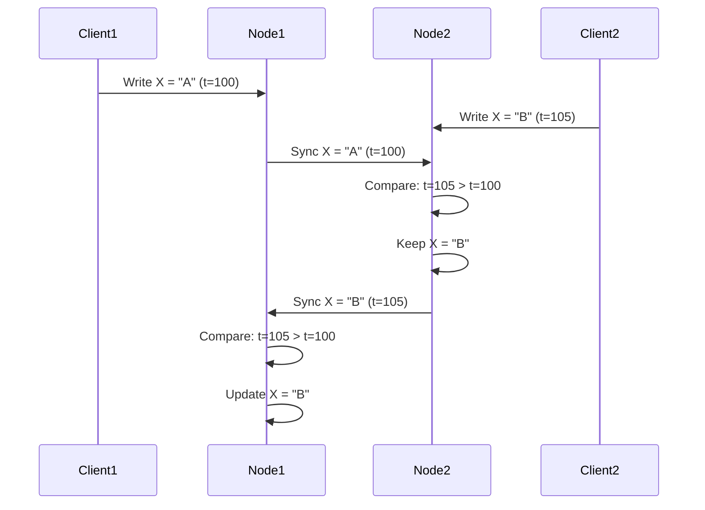
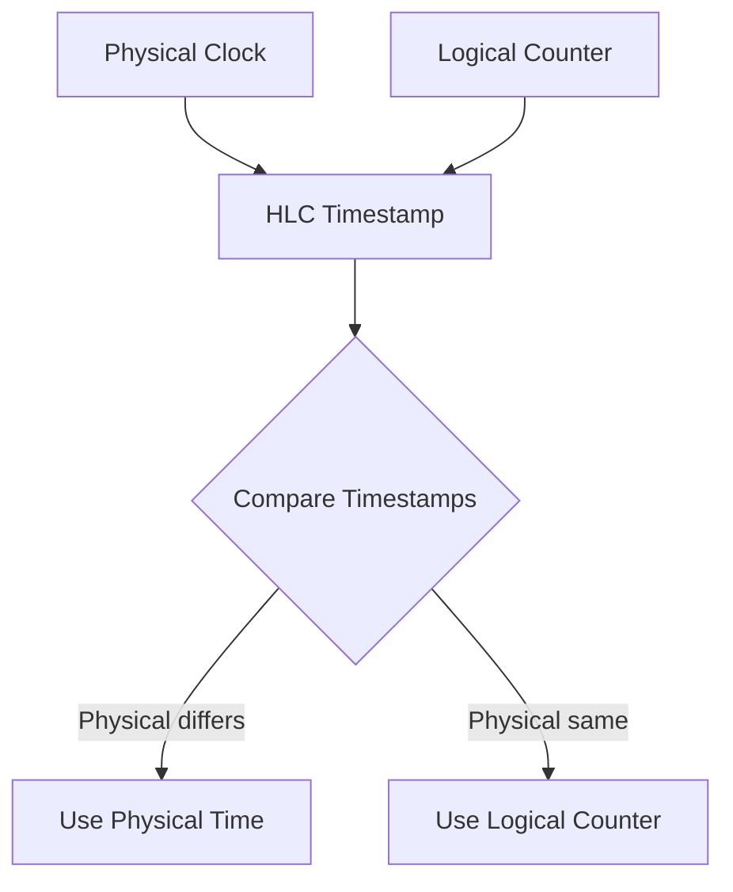
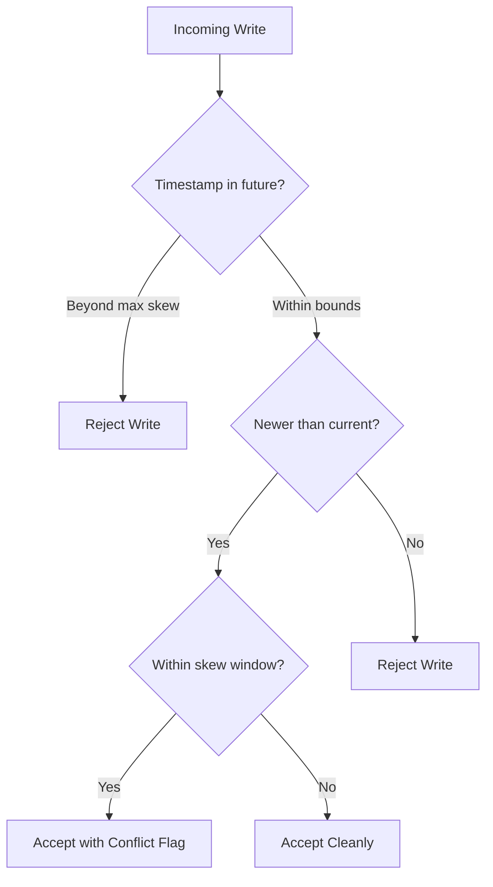
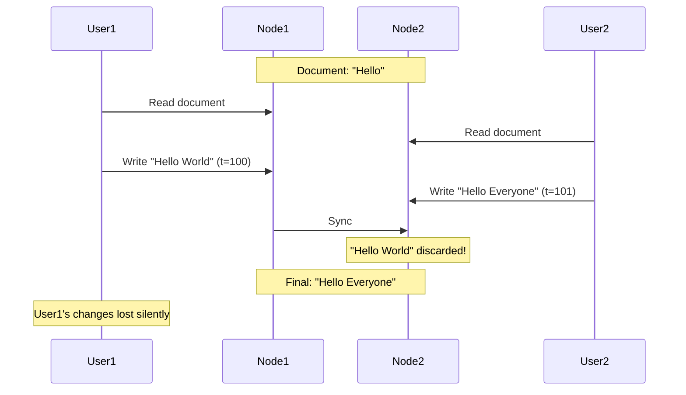
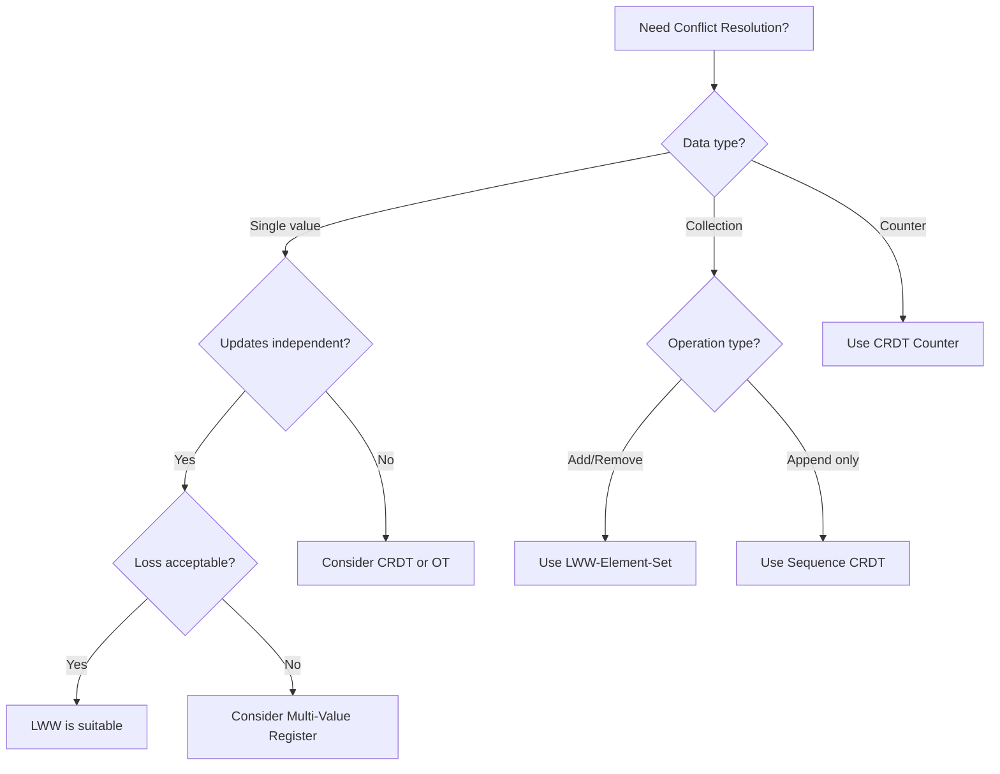
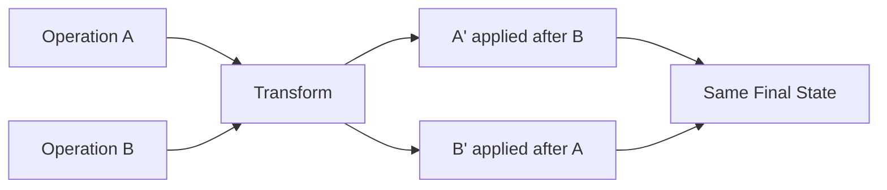

# How to Implement Last-Write-Wins

Author: [nawazdhandala](https://github.com/nawazdhandala)

Tags: Distributed Systems, Conflict Resolution, Database, Replication

Description: Learn how to implement last-write-wins conflict resolution strategy.

---

In distributed systems, conflicts are inevitable. When multiple nodes can accept writes concurrently, you need a strategy to resolve conflicting updates. **Last-Write-Wins (LWW)** is one of the simplest and most widely used conflict resolution strategies. In this post, we will explore how to implement LWW, understand its trade-offs, and learn when to use it.

## What is Last-Write-Wins?

Last-Write-Wins is a conflict resolution strategy where the write with the latest timestamp wins. When two conflicting updates are detected, the system compares their timestamps and keeps the one that occurred most recently.



The diagram above shows how LWW resolves conflicts during replication. Node2 receives a write with timestamp 105, and when Node1's earlier write (timestamp 100) arrives, it is discarded because 105 > 100.

## LWW Algorithm Basics

The core algorithm is straightforward:

1. Attach a timestamp to every write operation
2. When receiving an update, compare timestamps
3. Keep the value with the higher (more recent) timestamp
4. Discard the older value

Here is a basic implementation in TypeScript:

```typescript
interface LWWValue<T> {
  value: T;
  timestamp: number;
}

class LWWRegister<T> {
  private data: LWWValue<T> | null = null;

  write(value: T, timestamp: number): boolean {
    if (this.data === null || timestamp > this.data.timestamp) {
      this.data = { value, timestamp };
      return true; // Write accepted
    }
    return false; // Write rejected (older timestamp)
  }

  read(): T | null {
    return this.data?.value ?? null;
  }

  merge(other: LWWValue<T>): void {
    this.write(other.value, other.timestamp);
  }

  getState(): LWWValue<T> | null {
    return this.data;
  }
}

// Usage example
const register = new LWWRegister<string>();

register.write("Alice", 100);
console.log(register.read()); // "Alice"

register.write("Bob", 95);    // Rejected - older timestamp
console.log(register.read()); // "Alice"

register.write("Charlie", 110);
console.log(register.read()); // "Charlie"
```

### Handling Equal Timestamps

What happens when two writes have the same timestamp? You need a tiebreaker. Common approaches include:

```typescript
interface LWWValueWithId<T> {
  value: T;
  timestamp: number;
  nodeId: string; // Tiebreaker
}

class LWWRegisterWithTiebreaker<T> {
  private data: LWWValueWithId<T> | null = null;

  write(value: T, timestamp: number, nodeId: string): boolean {
    if (this.data === null) {
      this.data = { value, timestamp, nodeId };
      return true;
    }

    // Primary comparison: timestamp
    if (timestamp > this.data.timestamp) {
      this.data = { value, timestamp, nodeId };
      return true;
    }

    // Tiebreaker: lexicographic comparison of node IDs
    if (timestamp === this.data.timestamp && nodeId > this.data.nodeId) {
      this.data = { value, timestamp, nodeId };
      return true;
    }

    return false;
  }

  read(): T | null {
    return this.data?.value ?? null;
  }
}
```

## Timestamp Generation

The effectiveness of LWW depends heavily on timestamp quality. Let us explore different approaches.

### Wall Clock Timestamps

The simplest approach uses system time:

```typescript
function getWallClockTimestamp(): number {
  return Date.now();
}
```

**Pros:**
- Simple to implement
- Human-readable
- No coordination needed

**Cons:**
- Clock skew between nodes
- Clock can jump backward (NTP adjustments)
- Not monotonic

### Hybrid Logical Clocks (HLC)

HLCs combine physical time with logical counters to provide better ordering guarantees:

```typescript
class HybridLogicalClock {
  private physicalTime: number = 0;
  private logicalCounter: number = 0;

  now(): { pt: number; lc: number } {
    const currentPhysical = Date.now();

    if (currentPhysical > this.physicalTime) {
      this.physicalTime = currentPhysical;
      this.logicalCounter = 0;
    } else {
      this.logicalCounter++;
    }

    return {
      pt: this.physicalTime,
      lc: this.logicalCounter
    };
  }

  receive(remotePt: number, remoteLc: number): { pt: number; lc: number } {
    const currentPhysical = Date.now();
    const maxPhysical = Math.max(currentPhysical, this.physicalTime, remotePt);

    if (maxPhysical === this.physicalTime && maxPhysical === remotePt) {
      this.logicalCounter = Math.max(this.logicalCounter, remoteLc) + 1;
    } else if (maxPhysical === this.physicalTime) {
      this.logicalCounter++;
    } else if (maxPhysical === remotePt) {
      this.logicalCounter = remoteLc + 1;
    } else {
      this.logicalCounter = 0;
    }

    this.physicalTime = maxPhysical;

    return {
      pt: this.physicalTime,
      lc: this.logicalCounter
    };
  }

  compare(a: { pt: number; lc: number }, b: { pt: number; lc: number }): number {
    if (a.pt !== b.pt) return a.pt - b.pt;
    return a.lc - b.lc;
  }
}

// Usage
const hlc = new HybridLogicalClock();
const ts1 = hlc.now();
const ts2 = hlc.now();
console.log(hlc.compare(ts1, ts2)); // -1 (ts1 < ts2)
```



### Lamport Timestamps

For purely logical ordering without physical time:

```typescript
class LamportClock {
  private counter: number = 0;

  tick(): number {
    return ++this.counter;
  }

  receive(remoteCounter: number): number {
    this.counter = Math.max(this.counter, remoteCounter) + 1;
    return this.counter;
  }

  getCounter(): number {
    return this.counter;
  }
}
```

## Clock Synchronization

When using wall clock timestamps, clock synchronization becomes critical. Here are strategies to minimize clock skew issues.

### NTP Best Practices

```typescript
// Check clock health before accepting writes
async function isClockHealthy(): Promise<boolean> {
  const ntpOffset = await getNtpOffset(); // Get offset from NTP server
  const maxAllowedSkew = 100; // milliseconds

  return Math.abs(ntpOffset) < maxAllowedSkew;
}

// Reject writes if clock is unhealthy
async function safeWrite<T>(
  register: LWWRegister<T>,
  value: T
): Promise<boolean> {
  if (!await isClockHealthy()) {
    throw new Error("Clock skew too high - write rejected");
  }
  return register.write(value, Date.now());
}
```

### Bounded Clock Skew

Design your system to tolerate bounded clock skew:

```typescript
class BoundedSkewLWW<T> {
  private data: LWWValue<T> | null = null;
  private readonly maxSkew: number;

  constructor(maxSkewMs: number = 1000) {
    this.maxSkew = maxSkewMs;
  }

  write(value: T, timestamp: number): { accepted: boolean; conflict: boolean } {
    const now = Date.now();

    // Reject future timestamps beyond acceptable skew
    if (timestamp > now + this.maxSkew) {
      return { accepted: false, conflict: false };
    }

    if (this.data === null || timestamp > this.data.timestamp) {
      const conflict = this.data !== null &&
        Math.abs(timestamp - this.data.timestamp) < this.maxSkew;

      this.data = { value, timestamp };
      return { accepted: true, conflict };
    }

    return { accepted: false, conflict: false };
  }
}
```



## Data Loss Considerations

LWW is simple but can lead to data loss. Understanding these scenarios is crucial.

### The Lost Update Problem



User1's changes are completely lost because User2's write had a later timestamp, even though both users started from the same state.

### Mitigation Strategies

**1. Version Vectors for Conflict Detection:**

```typescript
interface VersionVector {
  [nodeId: string]: number;
}

interface VersionedValue<T> {
  value: T;
  timestamp: number;
  version: VersionVector;
}

class LWWWithConflictDetection<T> {
  private data: VersionedValue<T> | null = null;
  private nodeId: string;

  constructor(nodeId: string) {
    this.nodeId = nodeId;
  }

  write(value: T): void {
    const timestamp = Date.now();
    const version: VersionVector = this.data?.version
      ? { ...this.data.version }
      : {};

    version[this.nodeId] = (version[this.nodeId] || 0) + 1;

    this.data = { value, timestamp, version };
  }

  merge(remote: VersionedValue<T>): { merged: boolean; conflict: boolean } {
    if (!this.data) {
      this.data = remote;
      return { merged: true, conflict: false };
    }

    const dominance = this.compareVersions(this.data.version, remote.version);

    if (dominance === "remote") {
      this.data = remote;
      return { merged: true, conflict: false };
    }

    if (dominance === "concurrent") {
      // Concurrent updates detected - use timestamp as tiebreaker
      if (remote.timestamp > this.data.timestamp) {
        this.data = remote;
      }
      return { merged: true, conflict: true }; // Signal conflict!
    }

    return { merged: false, conflict: false };
  }

  private compareVersions(
    local: VersionVector,
    remote: VersionVector
  ): "local" | "remote" | "concurrent" {
    let localGreater = false;
    let remoteGreater = false;

    const allKeys = new Set([
      ...Object.keys(local),
      ...Object.keys(remote)
    ]);

    for (const key of allKeys) {
      const l = local[key] || 0;
      const r = remote[key] || 0;

      if (l > r) localGreater = true;
      if (r > l) remoteGreater = true;
    }

    if (localGreater && remoteGreater) return "concurrent";
    if (remoteGreater) return "remote";
    return "local";
  }
}
```

**2. Logging Overwritten Values:**

```typescript
interface AuditLog<T> {
  overwrittenValue: T;
  overwrittenTimestamp: number;
  newValue: T;
  newTimestamp: number;
  occurredAt: number;
}

class AuditedLWW<T> {
  private data: LWWValue<T> | null = null;
  private auditLog: AuditLog<T>[] = [];

  write(value: T, timestamp: number): boolean {
    if (this.data === null || timestamp > this.data.timestamp) {
      if (this.data !== null) {
        this.auditLog.push({
          overwrittenValue: this.data.value,
          overwrittenTimestamp: this.data.timestamp,
          newValue: value,
          newTimestamp: timestamp,
          occurredAt: Date.now()
        });
      }
      this.data = { value, timestamp };
      return true;
    }
    return false;
  }

  getAuditLog(): AuditLog<T>[] {
    return [...this.auditLog];
  }
}
```

## Use Case Suitability

LWW works well for some scenarios and poorly for others. Here is a guide:

### Good Fit

| Use Case | Why LWW Works |
|----------|---------------|
| User preferences | Last setting is what user wants |
| Status updates | Latest status is most relevant |
| Sensor readings | Most recent reading is typically most useful |
| Session data | Latest session state matters most |
| Cache invalidation | Newer data should replace older |

### Poor Fit

| Use Case | Why LWW Fails |
|----------|---------------|
| Collaborative editing | Changes from multiple users get lost |
| Shopping carts | Items added concurrently may disappear |
| Counters | Increments can be lost |
| Financial transactions | Cannot lose any transaction |
| Append-only logs | Ordering and completeness matter |

### Decision Flowchart



## LWW-Element-Set: Extending LWW to Sets

For set operations, the LWW-Element-Set is a powerful extension:

```typescript
interface ElementState<T> {
  addTimestamp: number;
  removeTimestamp: number;
}

class LWWElementSet<T> {
  private elements: Map<string, ElementState<T>> = new Map();
  private valueToKey: (value: T) => string;

  constructor(keyFn: (value: T) => string = JSON.stringify) {
    this.valueToKey = keyFn;
  }

  add(value: T, timestamp: number = Date.now()): void {
    const key = this.valueToKey(value);
    const existing = this.elements.get(key);

    if (!existing) {
      this.elements.set(key, { addTimestamp: timestamp, removeTimestamp: 0 });
    } else if (timestamp > existing.addTimestamp) {
      existing.addTimestamp = timestamp;
    }
  }

  remove(value: T, timestamp: number = Date.now()): void {
    const key = this.valueToKey(value);
    const existing = this.elements.get(key);

    if (!existing) {
      this.elements.set(key, { addTimestamp: 0, removeTimestamp: timestamp });
    } else if (timestamp > existing.removeTimestamp) {
      existing.removeTimestamp = timestamp;
    }
  }

  has(value: T): boolean {
    const key = this.valueToKey(value);
    const state = this.elements.get(key);

    if (!state) return false;

    // Element exists if add timestamp > remove timestamp
    // Bias towards add on equal timestamps
    return state.addTimestamp >= state.removeTimestamp;
  }

  values(): T[] {
    const result: T[] = [];
    for (const [key, state] of this.elements) {
      if (state.addTimestamp >= state.removeTimestamp) {
        result.push(JSON.parse(key));
      }
    }
    return result;
  }

  merge(other: LWWElementSet<T>): void {
    for (const [key, otherState] of other.elements) {
      const existing = this.elements.get(key);

      if (!existing) {
        this.elements.set(key, { ...otherState });
      } else {
        existing.addTimestamp = Math.max(
          existing.addTimestamp,
          otherState.addTimestamp
        );
        existing.removeTimestamp = Math.max(
          existing.removeTimestamp,
          otherState.removeTimestamp
        );
      }
    }
  }
}

// Usage example
const set1 = new LWWElementSet<string>();
const set2 = new LWWElementSet<string>();

set1.add("apple", 100);
set1.add("banana", 100);

set2.add("apple", 100);
set2.remove("apple", 105);
set2.add("cherry", 110);

set1.merge(set2);

console.log(set1.values()); // ["banana", "cherry"]
// "apple" was removed because remove timestamp (105) > add timestamp (100)
```

## Alternatives to LWW

When LWW is not suitable, consider these alternatives:

### Multi-Value Register (MVR)

Keep all concurrent values and let the application decide:

```typescript
interface MVRValue<T> {
  value: T;
  version: VersionVector;
}

class MultiValueRegister<T> {
  private values: MVRValue<T>[] = [];

  write(value: T, nodeId: string): void {
    const newVersion: VersionVector = {};

    // Merge all current versions
    for (const v of this.values) {
      for (const [node, counter] of Object.entries(v.version)) {
        newVersion[node] = Math.max(newVersion[node] || 0, counter);
      }
    }

    // Increment this node's counter
    newVersion[nodeId] = (newVersion[nodeId] || 0) + 1;

    this.values = [{ value, version: newVersion }];
  }

  merge(remote: MVRValue<T>): void {
    const dominated: number[] = [];
    let dominated_by_existing = false;

    for (let i = 0; i < this.values.length; i++) {
      const cmp = this.compareVersions(this.values[i].version, remote.version);

      if (cmp === "remote") {
        dominated.push(i);
      } else if (cmp === "local") {
        dominated_by_existing = true;
        break;
      }
    }

    if (dominated_by_existing) return;

    // Remove dominated values
    this.values = this.values.filter((_, i) => !dominated.includes(i));
    this.values.push(remote);
  }

  read(): T[] {
    return this.values.map(v => v.value);
  }

  hasConflict(): boolean {
    return this.values.length > 1;
  }

  private compareVersions(
    local: VersionVector,
    remote: VersionVector
  ): "local" | "remote" | "concurrent" {
    // Same implementation as before
    let localGreater = false;
    let remoteGreater = false;

    const allKeys = new Set([
      ...Object.keys(local),
      ...Object.keys(remote)
    ]);

    for (const key of allKeys) {
      const l = local[key] || 0;
      const r = remote[key] || 0;

      if (l > r) localGreater = true;
      if (r > l) remoteGreater = true;
    }

    if (localGreater && remoteGreater) return "concurrent";
    if (remoteGreater) return "remote";
    return "local";
  }
}
```

### Operational Transformation (OT)

For collaborative editing where all operations must be preserved:



### CRDTs (Conflict-free Replicated Data Types)

Mathematically proven to converge without conflicts:

- **G-Counter**: Grow-only counter
- **PN-Counter**: Positive-negative counter
- **G-Set**: Grow-only set
- **OR-Set**: Observed-remove set
- **LWW-Register**: Last-write-wins register (what we covered)
- **RGA**: Replicated growable array

## Production Implementation Checklist

When implementing LWW in production:

```typescript
interface ProductionLWWConfig {
  // Clock configuration
  clockType: "wall" | "hlc" | "lamport";
  maxClockSkewMs: number;

  // Conflict handling
  logConflicts: boolean;
  conflictCallback?: (old: unknown, new_: unknown) => void;

  // Tiebreaker
  nodeId: string;

  // Persistence
  persistenceAdapter: PersistenceAdapter;
}

interface PersistenceAdapter {
  save(key: string, value: LWWValue<unknown>): Promise<void>;
  load(key: string): Promise<LWWValue<unknown> | null>;
}

class ProductionLWW<T> {
  private config: ProductionLWWConfig;
  private clock: HybridLogicalClock;
  private data: Map<string, LWWValue<T>> = new Map();

  constructor(config: ProductionLWWConfig) {
    this.config = config;
    this.clock = new HybridLogicalClock();
  }

  async write(key: string, value: T): Promise<boolean> {
    const timestamp = this.getTimestamp();
    const existing = this.data.get(key);

    if (!existing || this.isNewer(timestamp, existing.timestamp)) {
      if (existing && this.config.logConflicts) {
        console.log(`Conflict resolved: ${key}`, {
          old: existing,
          new: { value, timestamp }
        });
        this.config.conflictCallback?.(existing.value, value);
      }

      const newValue = { value, timestamp };
      this.data.set(key, newValue);
      await this.config.persistenceAdapter.save(key, newValue);
      return true;
    }

    return false;
  }

  private getTimestamp(): number {
    switch (this.config.clockType) {
      case "wall":
        return Date.now();
      case "hlc":
        const hlc = this.clock.now();
        return hlc.pt * 1000000 + hlc.lc; // Combine into single number
      case "lamport":
        // Would need separate Lamport clock
        return Date.now();
    }
  }

  private isNewer(incoming: number, existing: number): boolean {
    if (incoming > existing) return true;
    if (incoming === existing) {
      // Tiebreaker: use node ID
      return this.config.nodeId > ""; // Simplified
    }
    return false;
  }
}
```

## Summary

Last-Write-Wins is a powerful tool when used appropriately:

**Use LWW when:**
- Simplicity is important
- Losing some concurrent updates is acceptable
- Updates represent complete state replacement
- You need high availability and partition tolerance

**Avoid LWW when:**
- Every update must be preserved
- Concurrent operations need to be merged
- Data integrity is critical
- Users expect collaborative editing semantics

**Key implementation considerations:**
- Choose the right timestamp generation strategy
- Handle clock skew appropriately
- Implement tiebreakers for equal timestamps
- Log conflicts for debugging
- Consider hybrid approaches for complex use cases

LWW is not perfect, but its simplicity and predictability make it an excellent choice for many distributed systems scenarios. Understanding its trade-offs helps you make informed decisions about when to use it and when to reach for more sophisticated alternatives.
