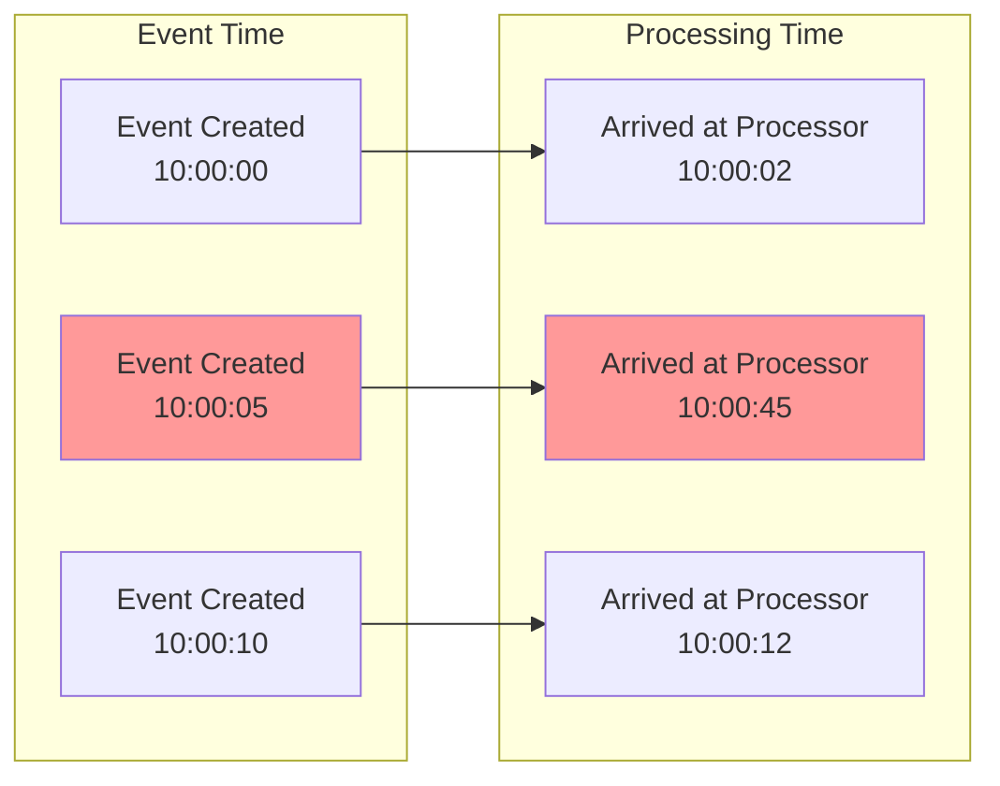
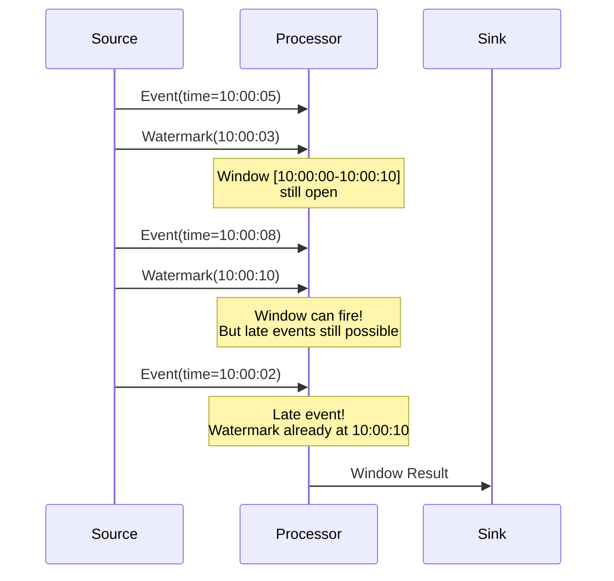
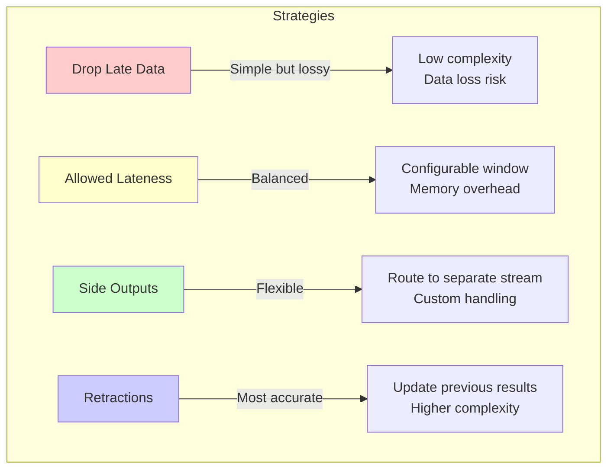
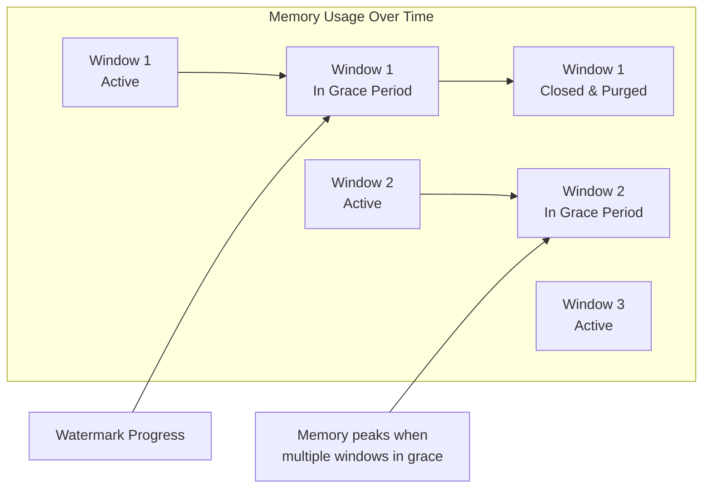
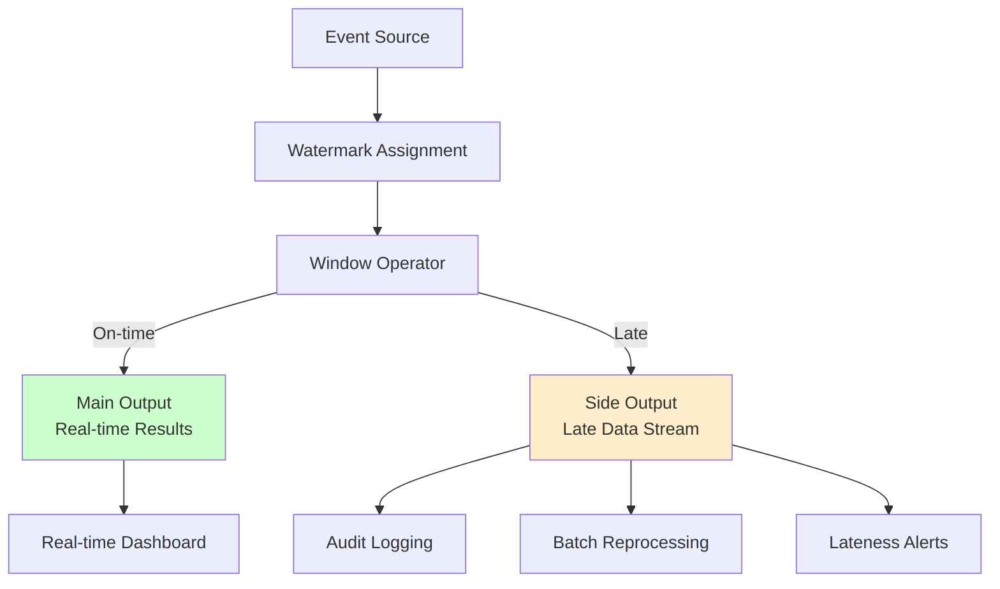
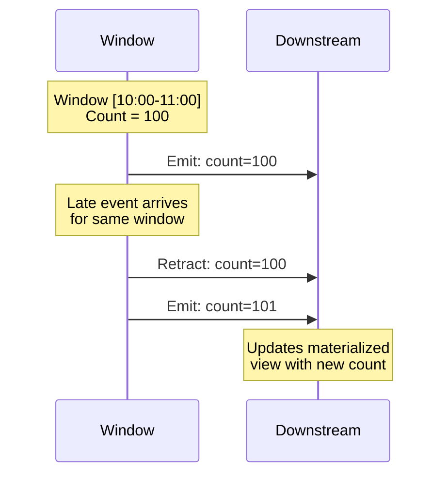
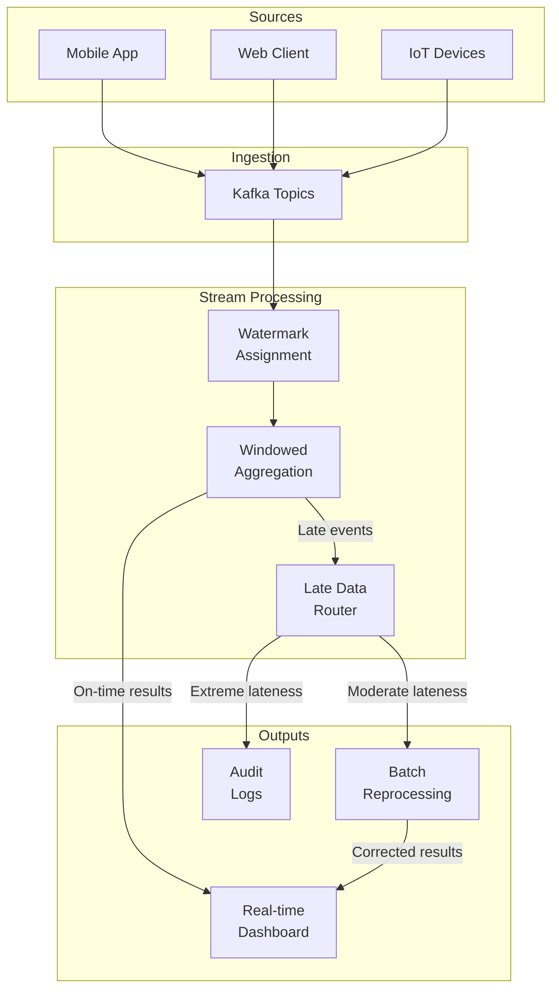
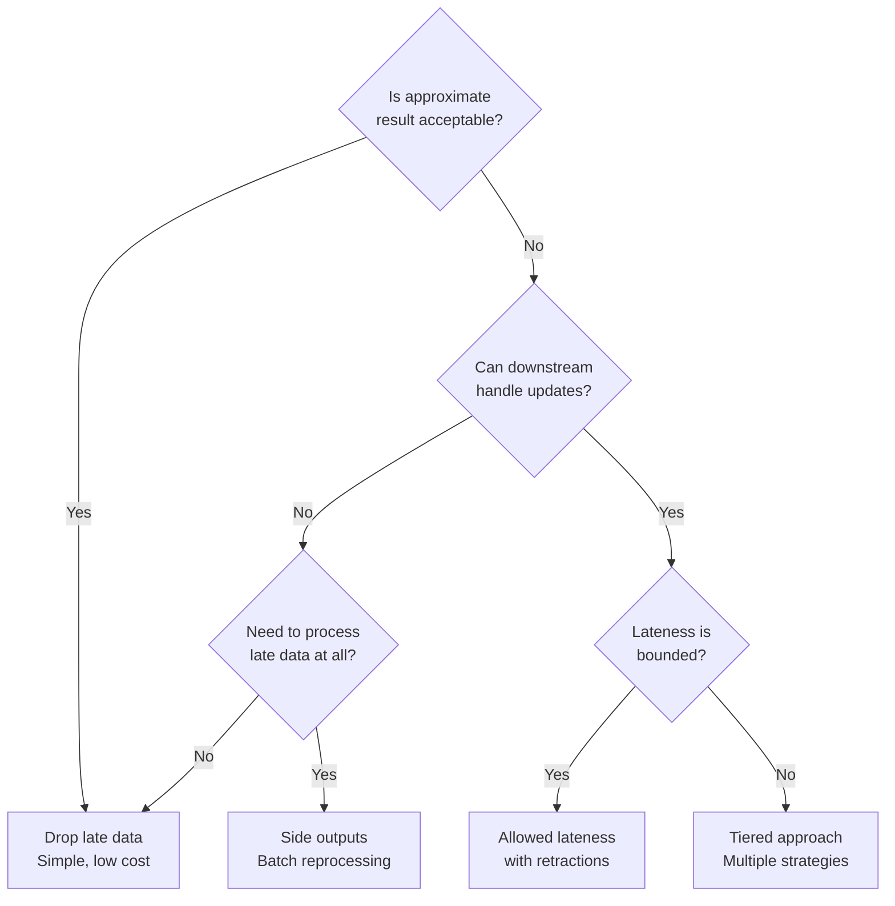

# How to Create Late Data Handling

Author: [nawazdhandala](https://github.com/nawazdhandala)

Tags: Stream Processing, Late Data, Event Time, Apache Flink

Description: Learn how to handle late-arriving data in stream processing systems.

---

You have built a beautiful real-time dashboard. Events flow in, windows compute aggregates, and results stream out. Then reality hits: a mobile device reconnects after being offline for two hours, a network partition resolves, or a batch job finally pushes buffered logs. Your carefully computed hourly totals are now wrong.

Welcome to the world of **late data** in stream processing.

This post walks through the core concepts, strategies, and code patterns for handling late-arriving events gracefully. We will cover allowed lateness, side outputs, retractions, and practical approaches that balance correctness with resource usage.

---

## Why Late Data Happens

In distributed systems, the time an event *occurred* (event time) and the time it *arrives* at your processor (processing time) are rarely the same. Events can arrive late for many reasons:

- **Network delays:** Packets take longer routes or get queued
- **Device offline periods:** Mobile apps buffer events until connectivity returns
- **Upstream batching:** Services accumulate events before flushing
- **Clock skew:** Producers have drifted system clocks
- **Reprocessing:** Historical data replays through the same pipeline

The gap between event time and processing time is called **event time skew**. A robust stream processor must handle this skew without losing data or producing incorrect results.

---

## Event Time vs Processing Time

Before diving into late data handling, let's clarify the two time domains:



Notice that `E2` (created at 10:00:05) arrives 40 seconds late. If we are computing a window for `10:00:00-10:00:10`, should we include it? That depends on our late data strategy.

---

## Watermarks: Tracking Progress in Event Time

A **watermark** is a timestamp that declares: "I believe all events with event time less than this watermark have arrived." Watermarks flow through the processing pipeline alongside data, allowing operators to know when windows can safely close.



Watermarks are heuristics. They can be:

- **Perfect:** When you know the exact maximum delay (rare)
- **Heuristic:** Based on observed delays with some safety margin
- **Punctuated:** Derived from special markers in the data stream

---

## The Late Data Handling Spectrum

There are several strategies for handling late data, each with different tradeoffs:



Let's explore each approach in detail.

---

## Strategy 1: Allowed Lateness

The simplest approach to handle late data is to keep windows open for a grace period after the watermark passes. Events arriving within this period are still included in the window computation.

### Apache Flink Example

```java
// Define a tumbling window with allowed lateness
// This window aggregates click events by user over 1-hour periods
// and tolerates events arriving up to 10 minutes after the window closes

DataStream<ClickEvent> clicks = env
    .addSource(kafkaSource)
    .assignTimestampsAndWatermarks(
        WatermarkStrategy
            .<ClickEvent>forBoundedOutOfOrderness(Duration.ofSeconds(30))
            .withTimestampAssigner((event, timestamp) -> event.getTimestamp())
    );

clicks
    // Key by user ID to compute per-user aggregates
    .keyBy(click -> click.getUserId())
    // Create 1-hour tumbling windows based on event time
    .window(TumblingEventTimeWindows.of(Time.hours(1)))
    // Allow events to arrive up to 10 minutes late
    // Window state is kept for this additional period
    .allowedLateness(Time.minutes(10))
    // Aggregate: count clicks per user per hour
    .aggregate(new ClickCounter())
    // Send results downstream
    .addSink(resultSink);
```

### Apache Kafka Streams Example

```java
// Kafka Streams uses grace periods for late data handling
// Events arriving within the grace period trigger window updates

StreamsBuilder builder = new StreamsBuilder();

KStream<String, ClickEvent> clicks = builder.stream(
    "clicks",
    Consumed.with(Serdes.String(), clickEventSerde)
);

clicks
    // Group by user ID for windowed aggregation
    .groupByKey()
    // Define a 1-hour tumbling window with a 10-minute grace period
    // The grace period determines how long to wait for late events
    .windowedBy(
        TimeWindows
            .ofSizeWithNoGrace(Duration.ofHours(1))
            .grace(Duration.ofMinutes(10))
    )
    // Count events in each window
    .count(Materialized.as("click-counts"))
    // Convert windowed result to a regular stream
    .toStream()
    // Write results to output topic
    .to("click-counts-output");
```

### Memory Implications

Allowed lateness keeps window state in memory longer. Consider:

- **Window count:** More open windows = more memory
- **State size:** Large aggregates multiply the cost
- **Lateness duration:** Longer grace periods = longer state retention



---

## Strategy 2: Side Outputs for Late Data

Sometimes you want to handle late data differently than on-time data. Side outputs let you route late events to a separate stream for special processing.

### Apache Flink Side Output Example

```java
// Define a tag to identify the side output stream
// Late events will be routed here instead of being dropped
final OutputTag<ClickEvent> lateDataTag =
    new OutputTag<ClickEvent>("late-clicks"){};

// Main processing pipeline with side output for late data
SingleOutputStreamOperator<ClickAggregate> mainResults = clicks
    .keyBy(click -> click.getUserId())
    .window(TumblingEventTimeWindows.of(Time.hours(1)))
    // Keep a small grace period for slightly late data
    .allowedLateness(Time.minutes(1))
    // Route significantly late data to side output
    .sideOutputLateData(lateDataTag)
    .aggregate(new ClickCounter());

// Get the late data stream for separate handling
DataStream<ClickEvent> lateClicks = mainResults.getSideOutput(lateDataTag);

// Process late data differently
// Options: store for batch reprocessing, alert, or apply corrections
lateClicks
    // Add metadata about why this event was late
    .map(click -> enrichWithLatenessInfo(click))
    // Write to a separate topic/table for analysis or reprocessing
    .addSink(lateDataSink);

// Main results go to the primary sink
mainResults.addSink(resultSink);
```

### Side Output Use Cases

Side outputs are valuable when you need to:

1. **Audit late arrivals:** Track which sources produce late data
2. **Batch correction:** Accumulate late data for periodic recomputation
3. **Alert on anomalies:** Detect unusual lateness patterns
4. **Separate SLAs:** Apply different processing guarantees



---

## Strategy 3: Retractions and Corrections

For applications requiring eventual correctness, retractions allow you to update previously emitted results when late data arrives.

### How Retractions Work



### Flink Table API with Retractions

```java
// Create a streaming table environment
// Retraction mode is enabled by default for aggregations
StreamTableEnvironment tableEnv = StreamTableEnvironment.create(env);

// Register the click stream as a table with event time
tableEnv.createTemporaryView("clicks", clicks,
    Schema.newBuilder()
        .column("userId", DataTypes.STRING())
        .column("clickTime", DataTypes.TIMESTAMP(3))
        .column("url", DataTypes.STRING())
        // Define the event time attribute with watermark
        .watermark("clickTime", "clickTime - INTERVAL '30' SECOND")
        .build()
);

// Query with tumbling window aggregation
// Results will automatically include retractions when late data arrives
Table hourlyClicks = tableEnv.sqlQuery(
    "SELECT " +
    "  userId, " +
    "  TUMBLE_START(clickTime, INTERVAL '1' HOUR) as windowStart, " +
    "  COUNT(*) as clickCount " +
    "FROM clicks " +
    "GROUP BY " +
    "  userId, " +
    "  TUMBLE(clickTime, INTERVAL '1' HOUR)"
);

// Convert to retract stream
// Each record is a tuple of (Boolean, Row) where:
// - true = insert/update (add this value)
// - false = retraction (remove previous value)
DataStream<Tuple2<Boolean, Row>> retractStream =
    tableEnv.toRetractStream(hourlyClicks, Row.class);

// Handle retractions in the sink
retractStream.addSink(new RetractingSink());
```

### Implementing a Retracting Sink

```java
// A sink that properly handles retraction messages
// This maintains a key-value store and applies updates/deletes

public class RetractingSink extends RichSinkFunction<Tuple2<Boolean, Row>> {

    // Connection to a database or key-value store that supports updates
    private transient KeyValueStore<String, Long> store;

    @Override
    public void open(Configuration parameters) {
        // Initialize connection to the backing store
        store = new KeyValueStore<>(getConnectionConfig());
    }

    @Override
    public void invoke(Tuple2<Boolean, Row> value, Context context) {
        // Extract the key (userId + windowStart)
        String key = value.f1.getField(0) + "_" + value.f1.getField(1);
        Long count = (Long) value.f1.getField(2);

        if (value.f0) {
            // This is an insert or update message
            // Write the new count to the store
            store.put(key, count);
            log.info("Upserted: {} = {}", key, count);
        } else {
            // This is a retraction message
            // The downstream already has the old value;
            // a new insert will follow with the corrected value
            // Some sinks may need to explicitly delete here
            log.info("Retracted: {} (was {})", key, count);
        }
    }

    @Override
    public void close() {
        store.close();
    }
}
```

### Retraction Considerations

Retractions add complexity but provide stronger guarantees:

| Aspect | Without Retractions | With Retractions |
|--------|---------------------|------------------|
| Result accuracy | Approximate | Eventually correct |
| Sink requirements | Append-only | Must support updates |
| Network overhead | Single emit | Retract + re-emit |
| State management | Simpler | Must track emitted values |
| Use case fit | Dashboards, alerts | Billing, reporting, ML |

---

## Practical Late Data Strategies

Here are battle-tested patterns for production systems:

### 1. Tiered Lateness Handling

```java
// Handle different levels of lateness with different strategies
// Tier 1: Slightly late (< 5 min) - include in window
// Tier 2: Moderately late (5-60 min) - side output for batch
// Tier 3: Very late (> 60 min) - log and alert

final OutputTag<ClickEvent> moderatelyLateTag =
    new OutputTag<ClickEvent>("moderately-late"){};
final OutputTag<ClickEvent> veryLateTag =
    new OutputTag<ClickEvent>("very-late"){};

public class TieredLatenessRouter
    extends ProcessWindowFunction<ClickEvent, ClickAggregate, String, TimeWindow> {

    @Override
    public void process(
            String key,
            Context context,
            Iterable<ClickEvent> events,
            Collector<ClickAggregate> out) {

        long windowEnd = context.window().getEnd();
        long currentWatermark = context.currentWatermark();

        List<ClickEvent> onTime = new ArrayList<>();

        for (ClickEvent event : events) {
            long lateness = currentWatermark - event.getTimestamp();

            if (lateness <= Duration.ofMinutes(5).toMillis()) {
                // Tier 1: Include in main computation
                onTime.add(event);
            } else if (lateness <= Duration.ofMinutes(60).toMillis()) {
                // Tier 2: Route to batch reprocessing
                context.output(moderatelyLateTag, event);
            } else {
                // Tier 3: Log for investigation
                context.output(veryLateTag, event);
            }
        }

        // Emit aggregate for on-time events
        if (!onTime.isEmpty()) {
            out.collect(computeAggregate(key, windowEnd, onTime));
        }
    }
}
```

### 2. Watermark Strategy Selection

Choose your watermark strategy based on your data characteristics:

```java
// Strategy 1: Bounded out-of-orderness
// Use when you know the maximum expected delay
// Good for: controlled environments, internal services

WatermarkStrategy
    .<Event>forBoundedOutOfOrderness(Duration.ofSeconds(30))
    .withTimestampAssigner((event, ts) -> event.getTimestamp());

// Strategy 2: Monotonically increasing
// Use when events arrive strictly in order (rare)
// Good for: single-producer systems, sorted logs

WatermarkStrategy
    .<Event>forMonotonousTimestamps()
    .withTimestampAssigner((event, ts) -> event.getTimestamp());

// Strategy 3: Custom watermark generator
// Use when delay varies by source or time of day
// Good for: multi-source ingestion, variable network conditions

WatermarkStrategy
    .<Event>forGenerator(ctx -> new AdaptiveWatermarkGenerator())
    .withTimestampAssigner((event, ts) -> event.getTimestamp());
```

### 3. Adaptive Watermark Generator

```java
// A watermark generator that adapts to observed lateness patterns
// Tracks recent delays and adjusts the watermark accordingly

public class AdaptiveWatermarkGenerator
    implements WatermarkGenerator<Event> {

    // Track recent maximum observed delays
    private final long[] recentDelays = new long[100];
    private int delayIndex = 0;

    // Base delay assumption
    private long estimatedMaxDelay = Duration.ofSeconds(10).toMillis();

    // Safety margin multiplier
    private static final double SAFETY_FACTOR = 1.5;

    private long maxTimestamp = Long.MIN_VALUE;

    @Override
    public void onEvent(Event event, long eventTimestamp, WatermarkOutput output) {
        // Update max observed timestamp
        maxTimestamp = Math.max(maxTimestamp, eventTimestamp);

        // Calculate this event's delay
        long processingTime = System.currentTimeMillis();
        long delay = processingTime - eventTimestamp;

        // Track delay for adaptive estimation
        recentDelays[delayIndex] = delay;
        delayIndex = (delayIndex + 1) % recentDelays.length;

        // Periodically update estimated max delay
        if (delayIndex == 0) {
            updateDelayEstimate();
        }
    }

    @Override
    public void onPeriodicEmit(WatermarkOutput output) {
        // Emit watermark with adaptive delay buffer
        long watermark = maxTimestamp - estimatedMaxDelay;
        output.emitWatermark(new Watermark(watermark));
    }

    private void updateDelayEstimate() {
        // Use 99th percentile of recent delays with safety margin
        long[] sorted = Arrays.copyOf(recentDelays, recentDelays.length);
        Arrays.sort(sorted);
        long p99Delay = sorted[(int)(sorted.length * 0.99)];

        // Apply safety factor and bounds
        estimatedMaxDelay = Math.max(
            Duration.ofSeconds(5).toMillis(),
            Math.min(
                (long)(p99Delay * SAFETY_FACTOR),
                Duration.ofMinutes(5).toMillis()
            )
        );
    }
}
```

### 4. Late Data Metrics and Monitoring

```java
// Track late data metrics for observability
// Essential for understanding data quality and tuning parameters

public class LateDataMetricsFunction
    extends ProcessFunction<Event, Event> {

    // Counters for monitoring
    private transient Counter onTimeEvents;
    private transient Counter lateEvents;
    private transient Counter veryLateEvents;
    private transient Histogram latenessHistogram;

    @Override
    public void open(Configuration parameters) {
        MetricGroup metrics = getRuntimeContext().getMetricGroup();

        // Count events by lateness category
        onTimeEvents = metrics.counter("events.ontime");
        lateEvents = metrics.counter("events.late");
        veryLateEvents = metrics.counter("events.very_late");

        // Distribution of lateness values
        latenessHistogram = metrics.histogram(
            "events.lateness_ms",
            new DescriptiveStatisticsHistogram(1000)
        );
    }

    @Override
    public void processElement(
            Event event,
            Context ctx,
            Collector<Event> out) {

        long lateness = ctx.timerService().currentWatermark()
                      - event.getTimestamp();

        // Record lateness distribution
        latenessHistogram.update(lateness);

        // Categorize and count
        if (lateness <= 0) {
            onTimeEvents.inc();
        } else if (lateness < Duration.ofMinutes(10).toMillis()) {
            lateEvents.inc();
        } else {
            veryLateEvents.inc();
            // Log very late events for investigation
            log.warn("Very late event: {} ms late, source={}",
                     lateness, event.getSource());
        }

        out.collect(event);
    }
}
```

---

## Complete Pipeline Example

Here is a complete example combining multiple late data handling strategies:

```java
// Complete late data handling pipeline
// Combines watermarks, allowed lateness, side outputs, and monitoring

public class LateDataHandlingPipeline {

    public static void main(String[] args) throws Exception {
        StreamExecutionEnvironment env =
            StreamExecutionEnvironment.getExecutionEnvironment();

        // Enable checkpointing for fault tolerance
        env.enableCheckpointing(Duration.ofMinutes(1).toMillis());

        // Configure state backend for large state
        env.setStateBackend(new EmbeddedRocksDBStateBackend());

        // Define output tags for late data routing
        final OutputTag<ClickEvent> lateDataTag =
            new OutputTag<ClickEvent>("late-data"){};

        // Source: Kafka with exactly-once semantics
        KafkaSource<ClickEvent> source = KafkaSource.<ClickEvent>builder()
            .setBootstrapServers("kafka:9092")
            .setTopics("clicks")
            .setGroupId("late-data-demo")
            .setStartingOffsets(OffsetsInitializer.earliest())
            .setDeserializer(new ClickEventDeserializer())
            .build();

        // Create stream with watermark strategy
        DataStream<ClickEvent> clicks = env
            .fromSource(source,
                WatermarkStrategy
                    .<ClickEvent>forBoundedOutOfOrderness(
                        Duration.ofSeconds(30))
                    .withTimestampAssigner(
                        (event, ts) -> event.getTimestamp())
                    .withIdleness(Duration.ofMinutes(1)),
                "Kafka Source");

        // Add late data monitoring
        DataStream<ClickEvent> monitoredClicks = clicks
            .process(new LateDataMetricsFunction());

        // Main aggregation with late data handling
        SingleOutputStreamOperator<HourlyClickStats> hourlyStats =
            monitoredClicks
                .keyBy(ClickEvent::getUserId)
                .window(TumblingEventTimeWindows.of(Time.hours(1)))
                // Allow 10 minutes for late arrivals
                .allowedLateness(Time.minutes(10))
                // Route very late data to side output
                .sideOutputLateData(lateDataTag)
                // Aggregate with incremental computation
                .aggregate(
                    new ClickAggregator(),
                    new ClickWindowFunction()
                );

        // Handle side output: store late data for batch reprocessing
        DataStream<ClickEvent> lateClicks =
            hourlyStats.getSideOutput(lateDataTag);

        lateClicks
            .map(event -> {
                // Enrich with metadata about lateness
                event.setLateArrival(true);
                event.setLatenessMs(
                    System.currentTimeMillis() - event.getTimestamp());
                return event;
            })
            .sinkTo(
                // Write to separate topic for batch correction
                KafkaSink.<ClickEvent>builder()
                    .setBootstrapServers("kafka:9092")
                    .setRecordSerializer(
                        new ClickEventSerializer("late-clicks"))
                    .build()
            );

        // Main output: real-time dashboard updates
        hourlyStats.sinkTo(
            KafkaSink.<HourlyClickStats>builder()
                .setBootstrapServers("kafka:9092")
                .setRecordSerializer(
                    new StatsSerializer("hourly-click-stats"))
                .build()
        );

        env.execute("Late Data Handling Pipeline");
    }
}

// Aggregator for incremental window computation
class ClickAggregator
    implements AggregateFunction<ClickEvent, ClickAccumulator, ClickAccumulator> {

    @Override
    public ClickAccumulator createAccumulator() {
        return new ClickAccumulator();
    }

    @Override
    public ClickAccumulator add(ClickEvent event, ClickAccumulator acc) {
        acc.count++;
        acc.urls.add(event.getUrl());
        acc.firstClick = Math.min(acc.firstClick, event.getTimestamp());
        acc.lastClick = Math.max(acc.lastClick, event.getTimestamp());
        return acc;
    }

    @Override
    public ClickAccumulator getResult(ClickAccumulator acc) {
        return acc;
    }

    @Override
    public ClickAccumulator merge(ClickAccumulator a, ClickAccumulator b) {
        a.count += b.count;
        a.urls.addAll(b.urls);
        a.firstClick = Math.min(a.firstClick, b.firstClick);
        a.lastClick = Math.max(a.lastClick, b.lastClick);
        return a;
    }
}

// Window function to add window metadata to results
class ClickWindowFunction
    extends ProcessWindowFunction<ClickAccumulator, HourlyClickStats, String, TimeWindow> {

    @Override
    public void process(
            String userId,
            Context context,
            Iterable<ClickAccumulator> elements,
            Collector<HourlyClickStats> out) {

        ClickAccumulator acc = elements.iterator().next();
        TimeWindow window = context.window();

        HourlyClickStats stats = new HourlyClickStats();
        stats.setUserId(userId);
        stats.setWindowStart(window.getStart());
        stats.setWindowEnd(window.getEnd());
        stats.setClickCount(acc.count);
        stats.setUniqueUrls(acc.urls.size());
        stats.setFirstClickTime(acc.firstClick);
        stats.setLastClickTime(acc.lastClick);

        // Mark if this is an updated result due to late data
        stats.setIsUpdate(context.currentWatermark() > window.getEnd());

        out.collect(stats);
    }
}
```

---

## Architecture Overview

Here is how all the pieces fit together:



---

## Choosing the Right Strategy

Use this decision tree to select your late data handling approach:



| Requirement | Recommended Strategy |
|-------------|---------------------|
| Real-time dashboards, some loss OK | Allowed lateness (short) |
| Financial reporting, must be accurate | Retractions + batch correction |
| IoT with unpredictable connectivity | Tiered lateness + side outputs |
| Log analytics, approximate OK | Drop after brief grace period |
| Billing systems | Full retractions with audit trail |

---

## Key Takeaways

1. **Late data is inevitable** in distributed systems. Design for it from the start.

2. **Watermarks are heuristics**, not guarantees. Choose a strategy that matches your data characteristics.

3. **Allowed lateness is your first tool.** It handles most cases with minimal complexity.

4. **Side outputs provide flexibility.** Route late data to appropriate handlers based on your requirements.

5. **Retractions enable correctness.** Use them when downstream systems need accurate final results.

6. **Monitor lateness patterns.** Track metrics to tune parameters and detect data quality issues.

7. **Combine strategies** for complex requirements. Tiered approaches handle different lateness levels appropriately.

---

## Further Reading

- [Apache Flink Event Time Documentation](https://nightlies.apache.org/flink/flink-docs-stable/docs/concepts/time/)
- [Kafka Streams Windowing](https://kafka.apache.org/documentation/streams/developer-guide/dsl-api.html#windowing)
- [The Dataflow Model Paper](https://research.google/pubs/pub43864/) (Google's foundational work on stream processing)
- [Streaming Systems Book](https://www.oreilly.com/library/view/streaming-systems/9781491983867/) by Tyler Akidau

---

Late data handling is one of the most challenging aspects of stream processing, but with the right strategies and tools, you can build pipelines that are both timely and correct. Start with allowed lateness, add monitoring, and evolve your approach as you learn your data's characteristics.
