# How to Implement Latency Analysis

Author: [nawazdhandala](https://github.com/nawazdhandala)

Tags: Observability, Tracing, Performance, SRE

Description: Learn how to analyze latency patterns in distributed traces to identify performance bottlenecks.

---

Your users are complaining about slow page loads. Your dashboards show a p99 latency spike. But where exactly is the time going? Is it the database? The external API? Network overhead? Without proper latency analysis, you are left guessing.

Distributed tracing gives you the raw data. Latency analysis turns that data into actionable insights. This guide walks through practical techniques for dissecting trace data to find exactly where time is spent in your distributed systems.

---

## Table of Contents

1. Why Latency Analysis Matters
2. Understanding Span Duration
3. Visualizing Trace Latency
4. Critical Path Identification
5. Latency Breakdown by Service
6. Latency Breakdown by Operation Type
7. Detecting Latency Anomalies
8. Building a Latency Analysis Pipeline
9. Practical Implementation in Node.js
10. Common Latency Patterns and Fixes
11. Summary

---

## 1. Why Latency Analysis Matters

Latency is not just one number. A single request flows through multiple services, databases, caches, and external APIs. Each hop adds time. Understanding the composition of that latency is crucial for:

- **Identifying bottlenecks:** Which service or operation dominates the request time?
- **Prioritizing optimization:** Fix the 500ms database query before optimizing the 5ms cache lookup.
- **Capacity planning:** Know which components will become bottlenecks as traffic grows.
- **SLO management:** Understand what contributes to SLO violations.

Traces give you the timeline. Latency analysis gives you the story.

---

## 2. Understanding Span Duration

Every span in a trace has a start time and end time. The difference is the span duration. But duration alone tells an incomplete story.

### Key Duration Metrics

| Metric | Definition | Use Case |
|--------|------------|----------|
| Span Duration | End time minus start time | Total time for one operation |
| Self Time | Duration minus child span durations | Time spent in this span only (not waiting on children) |
| Wait Time | Gaps between child spans | Time spent waiting, queuing, or in overhead |
| Critical Path Time | Sum of spans on the longest path | Minimum possible request latency |

### Self Time vs Total Duration

Consider this trace structure:

```mermaid
gantt
    title Span Duration Analysis
    dateFormat X
    axisFormat %L ms

    section Parent Span
    api.request (total: 200ms) :a1, 0, 200

    section Child Spans
    db.query (80ms)     :a2, 20, 100
    cache.lookup (15ms) :a3, 105, 120
    http.external (60ms):a4, 125, 185
```

In this example:
- **Total duration of api.request:** 200ms
- **Child span durations:** 80ms + 15ms + 60ms = 155ms
- **Self time of api.request:** 200ms - 155ms = 45ms

The 45ms self time represents work done directly in the parent span: serialization, business logic, framework overhead, and gaps between operations.

### Calculating Self Time

```typescript
// span-analysis.ts
// Utility functions for analyzing span durations

interface Span {
  spanId: string;
  parentSpanId: string | null;
  name: string;
  startTime: number;  // Unix timestamp in milliseconds
  endTime: number;
  attributes: Record<string, any>;
}

interface SpanAnalysis {
  span: Span;
  duration: number;
  selfTime: number;
  childTime: number;
  children: SpanAnalysis[];
}

/**
 * Calculate the total duration of a span in milliseconds.
 * This is the simplest metric: end time minus start time.
 */
function calculateDuration(span: Span): number {
  return span.endTime - span.startTime;
}

/**
 * Build a tree structure from flat span array and calculate self time.
 * Self time = total duration - sum of direct children durations.
 * This helps identify where time is actually spent vs waiting on dependencies.
 */
function analyzeSpanTree(spans: Span[]): SpanAnalysis[] {
  // Create a map for quick lookup by spanId
  const spanMap = new Map<string, Span>();
  spans.forEach(span => spanMap.set(span.spanId, span));

  // Group spans by parent
  const childrenMap = new Map<string | null, Span[]>();
  spans.forEach(span => {
    const parentId = span.parentSpanId;
    if (!childrenMap.has(parentId)) {
      childrenMap.set(parentId, []);
    }
    childrenMap.get(parentId)!.push(span);
  });

  // Recursive function to analyze each span
  function analyze(span: Span): SpanAnalysis {
    const duration = calculateDuration(span);
    const children = (childrenMap.get(span.spanId) || []).map(analyze);

    // Sum up all direct children durations
    const childTime = children.reduce((sum, child) => sum + child.duration, 0);

    // Self time is what remains after accounting for children
    // Note: Can be negative if children overlap (parallel execution)
    const selfTime = duration - childTime;

    return {
      span,
      duration,
      selfTime,
      childTime,
      children,
    };
  }

  // Find root spans (no parent) and build trees from them
  const rootSpans = childrenMap.get(null) || [];
  return rootSpans.map(analyze);
}

/**
 * Find spans with unusually high self time.
 * These are candidates for optimization since they represent
 * actual work rather than waiting on dependencies.
 */
function findHighSelfTimeSpans(
  analysis: SpanAnalysis[],
  threshold: number
): SpanAnalysis[] {
  const results: SpanAnalysis[] = [];

  function traverse(node: SpanAnalysis) {
    if (node.selfTime > threshold) {
      results.push(node);
    }
    node.children.forEach(traverse);
  }

  analysis.forEach(traverse);
  return results.sort((a, b) => b.selfTime - a.selfTime);
}
```

---

## 3. Visualizing Trace Latency

Understanding latency requires good visualization. Here are the key views for latency analysis.

### Waterfall View (Timeline)

The waterfall shows spans arranged by start time with duration as width. This is the default view in most tracing UIs.

```mermaid
gantt
    title Request Waterfall: POST /api/orders
    dateFormat X
    axisFormat %L ms

    section Gateway
    gateway.request      :g1, 0, 450

    section Order Service
    order.validate       :o1, 10, 60
    order.create         :o2, 65, 350

    section Inventory
    inventory.check      :i1, 70, 130
    inventory.reserve    :i2, 135, 200

    section Payment
    payment.process      :p1, 205, 340
    payment.gateway.call :p2, 210, 330

    section Database
    db.insert.order      :d1, 345, 400
```

Reading this waterfall:
1. Total request time: 450ms
2. Payment processing (135ms) is the longest single operation
3. Sequential flow means no parallelization opportunity was taken
4. Gap between inventory.reserve end (200ms) and payment.process start (205ms) is only 5ms, good

### Flame Graph View

Flame graphs show the call hierarchy with width representing duration. Wider sections take more time.

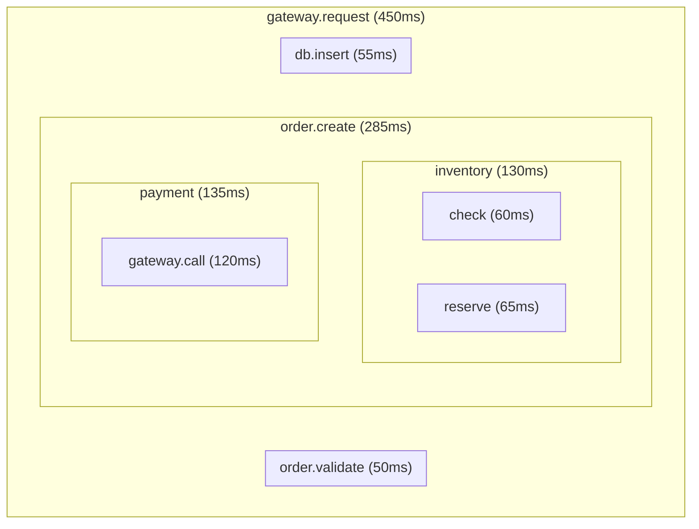

Flame graphs make it easy to spot:
- Which branches consume the most time (widest sections)
- Deep call stacks that might indicate over-instrumentation
- Relative proportions of time across services

---

## 4. Critical Path Identification

The critical path is the longest chain of dependent operations in a trace. It represents the minimum possible latency for the request. Any improvement to spans on the critical path directly reduces total latency.

### What is the Critical Path?

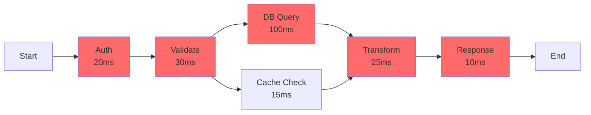

In this example:
- **Critical path:** Auth -> Validate -> DB Query -> Transform -> Response = 185ms
- **Non-critical:** Cache Check (15ms) runs parallel to DB Query
- **Optimization impact:** Reducing DB Query by 50ms saves 50ms total. Reducing Cache Check saves nothing (unless it becomes slower than DB Query).

### Finding the Critical Path

```typescript
// critical-path.ts
// Algorithm to identify the critical path through a trace

interface SpanWithTiming {
  spanId: string;
  parentSpanId: string | null;
  name: string;
  startTime: number;
  endTime: number;
  service: string;
}

interface CriticalPathResult {
  spans: SpanWithTiming[];
  totalDuration: number;
  breakdown: Map<string, number>;  // service -> total time on critical path
}

/**
 * Find the critical path in a trace.
 * The critical path is the longest chain of dependent spans.
 * Uses dynamic programming approach: for each span, compute the
 * longest path from trace start to span end.
 */
function findCriticalPath(spans: SpanWithTiming[]): CriticalPathResult {
  // Sort spans by end time to process in order
  const sorted = [...spans].sort((a, b) => a.endTime - b.endTime);

  // Map to store longest path ending at each span
  const longestPathTo = new Map<string, {
    duration: number;
    path: SpanWithTiming[];
  }>();

  // Build parent lookup for quick access
  const spanById = new Map<string, SpanWithTiming>();
  spans.forEach(s => spanById.set(s.spanId, s));

  // Build children lookup
  const childrenOf = new Map<string, SpanWithTiming[]>();
  spans.forEach(s => {
    if (s.parentSpanId) {
      if (!childrenOf.has(s.parentSpanId)) {
        childrenOf.set(s.parentSpanId, []);
      }
      childrenOf.get(s.parentSpanId)!.push(s);
    }
  });

  // Find root span (no parent)
  const root = spans.find(s => !s.parentSpanId);
  if (!root) {
    return { spans: [], totalDuration: 0, breakdown: new Map() };
  }

  // Initialize root
  const rootDuration = root.endTime - root.startTime;
  longestPathTo.set(root.spanId, {
    duration: rootDuration,
    path: [root],
  });

  // Process each span in end-time order
  for (const span of sorted) {
    if (span.spanId === root.spanId) continue;

    const parent = span.parentSpanId ? spanById.get(span.parentSpanId) : null;
    if (!parent) continue;

    const parentPath = longestPathTo.get(parent.spanId);
    if (!parentPath) continue;

    // Get siblings that end before this span starts (dependencies)
    const siblings = childrenOf.get(parent.spanId) || [];
    const precedingSiblings = siblings.filter(
      s => s.spanId !== span.spanId && s.endTime <= span.startTime
    );

    // Find the longest path among preceding siblings
    let bestPreceding = parentPath;
    for (const sib of precedingSiblings) {
      const sibPath = longestPathTo.get(sib.spanId);
      if (sibPath && sibPath.duration > bestPreceding.duration) {
        bestPreceding = sibPath;
      }
    }

    // This span's contribution to the path
    const spanDuration = span.endTime - span.startTime;

    longestPathTo.set(span.spanId, {
      duration: bestPreceding.duration + spanDuration,
      path: [...bestPreceding.path, span],
    });
  }

  // Find the span with the longest path (should be a leaf or the root)
  let maxPath = { duration: 0, path: [] as SpanWithTiming[] };
  for (const [, pathInfo] of longestPathTo) {
    if (pathInfo.duration > maxPath.duration) {
      maxPath = pathInfo;
    }
  }

  // Calculate breakdown by service
  const breakdown = new Map<string, number>();
  for (const span of maxPath.path) {
    const duration = span.endTime - span.startTime;
    const current = breakdown.get(span.service) || 0;
    breakdown.set(span.service, current + duration);
  }

  return {
    spans: maxPath.path,
    totalDuration: maxPath.duration,
    breakdown,
  };
}

/**
 * Calculate the impact of optimizing a span on the critical path.
 * Returns the percentage of total latency this span represents.
 */
function calculateOptimizationImpact(
  span: SpanWithTiming,
  criticalPath: CriticalPathResult
): number {
  const isOnCriticalPath = criticalPath.spans.some(
    s => s.spanId === span.spanId
  );

  if (!isOnCriticalPath) {
    return 0;  // Optimizing non-critical spans has no direct impact
  }

  const spanDuration = span.endTime - span.startTime;
  return (spanDuration / criticalPath.totalDuration) * 100;
}
```

### Critical Path Analysis Output

After running the algorithm, you might get output like:

```
Critical Path Analysis for trace: abc123
Total Duration: 450ms

Path:
  1. gateway.request      [gateway]     0ms -> 450ms (self: 45ms)
  2. order.create        [order-svc]   65ms -> 350ms (self: 20ms)
  3. payment.process     [payment-svc] 205ms -> 340ms (self: 5ms)
  4. payment.gateway.call [payment-svc] 210ms -> 330ms (self: 120ms)

Service Breakdown on Critical Path:
  gateway:     45ms  (10.0%)
  order-svc:   20ms  (4.4%)
  payment-svc: 125ms (27.8%)
  [waiting]:   260ms (57.8%)

Recommendation: Focus optimization on payment.gateway.call (120ms self time)
```

---

## 5. Latency Breakdown by Service

Understanding which services contribute most to latency helps prioritize optimization efforts across teams.

### Service Latency Aggregation

```typescript
// service-latency.ts
// Aggregate latency metrics by service across many traces

interface TraceSpan {
  traceId: string;
  spanId: string;
  parentSpanId: string | null;
  serviceName: string;
  operationName: string;
  startTime: number;
  endTime: number;
}

interface ServiceLatencyStats {
  serviceName: string;
  spanCount: number;
  totalDuration: number;
  avgDuration: number;
  p50Duration: number;
  p95Duration: number;
  p99Duration: number;
  percentOfTraceTime: number;
}

/**
 * Calculate percentile from sorted array of numbers.
 * Used for p50, p95, p99 latency calculations.
 */
function percentile(sorted: number[], p: number): number {
  if (sorted.length === 0) return 0;
  const index = Math.ceil((p / 100) * sorted.length) - 1;
  return sorted[Math.max(0, index)];
}

/**
 * Aggregate latency statistics by service across multiple traces.
 * This helps identify which services are the biggest latency contributors.
 */
function aggregateByService(spans: TraceSpan[]): ServiceLatencyStats[] {
  // Group spans by service
  const byService = new Map<string, TraceSpan[]>();
  spans.forEach(span => {
    if (!byService.has(span.serviceName)) {
      byService.set(span.serviceName, []);
    }
    byService.get(span.serviceName)!.push(span);
  });

  // Calculate total trace time for percentage calculation
  const traceGroups = new Map<string, TraceSpan[]>();
  spans.forEach(span => {
    if (!traceGroups.has(span.traceId)) {
      traceGroups.set(span.traceId, []);
    }
    traceGroups.get(span.traceId)!.push(span);
  });

  let totalTraceTime = 0;
  for (const [, traceSpans] of traceGroups) {
    const root = traceSpans.find(s => !s.parentSpanId);
    if (root) {
      totalTraceTime += root.endTime - root.startTime;
    }
  }

  // Calculate stats for each service
  const results: ServiceLatencyStats[] = [];

  for (const [serviceName, serviceSpans] of byService) {
    const durations = serviceSpans
      .map(s => s.endTime - s.startTime)
      .sort((a, b) => a - b);

    const totalDuration = durations.reduce((sum, d) => sum + d, 0);

    results.push({
      serviceName,
      spanCount: serviceSpans.length,
      totalDuration,
      avgDuration: totalDuration / serviceSpans.length,
      p50Duration: percentile(durations, 50),
      p95Duration: percentile(durations, 95),
      p99Duration: percentile(durations, 99),
      percentOfTraceTime: (totalDuration / totalTraceTime) * 100,
    });
  }

  // Sort by total duration descending
  return results.sort((a, b) => b.totalDuration - a.totalDuration);
}

/**
 * Generate a latency breakdown report for a set of traces.
 */
function generateServiceLatencyReport(spans: TraceSpan[]): string {
  const stats = aggregateByService(spans);

  let report = 'Service Latency Breakdown\n';
  report += '=' .repeat(60) + '\n\n';
  report += 'Service Name'.padEnd(25) +
            'Spans'.padStart(8) +
            'Avg (ms)'.padStart(12) +
            'P95 (ms)'.padStart(12) +
            'P99 (ms)'.padStart(12) +
            '% Time'.padStart(10) + '\n';
  report += '-'.repeat(79) + '\n';

  for (const stat of stats) {
    report += stat.serviceName.padEnd(25) +
              stat.spanCount.toString().padStart(8) +
              stat.avgDuration.toFixed(1).padStart(12) +
              stat.p95Duration.toFixed(1).padStart(12) +
              stat.p99Duration.toFixed(1).padStart(12) +
              stat.percentOfTraceTime.toFixed(1).padStart(9) + '%\n';
  }

  return report;
}
```

### Visualization: Service Latency Distribution

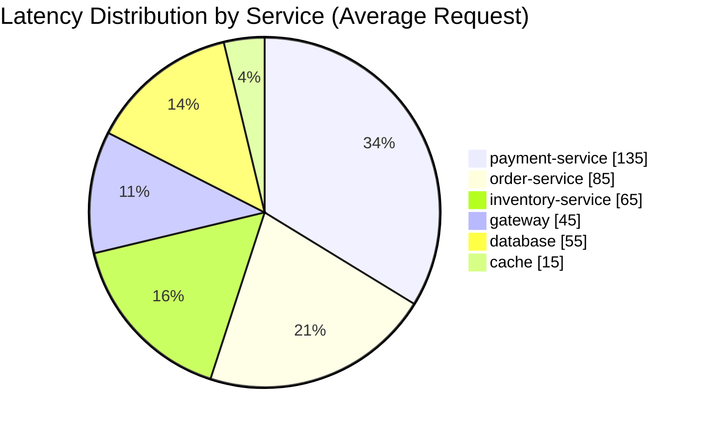

This pie chart immediately shows that payment-service accounts for the largest portion of request latency and should be the primary optimization target.

---

## 6. Latency Breakdown by Operation Type

Beyond service-level analysis, breaking down latency by operation type reveals patterns across your system.

### Operation Categories

```typescript
// operation-latency.ts
// Categorize and analyze spans by operation type

type OperationType =
  | 'http-inbound'    // Receiving HTTP requests
  | 'http-outbound'   // Making HTTP calls to other services
  | 'database'        // Database operations
  | 'cache'           // Cache reads/writes
  | 'queue'           // Message queue operations
  | 'compute'         // CPU-bound processing
  | 'external-api'    // Third-party API calls
  | 'unknown';

interface CategorizedSpan {
  span: TraceSpan;
  category: OperationType;
  duration: number;
}

/**
 * Categorize a span based on its attributes and naming conventions.
 * Uses OpenTelemetry semantic conventions for identification.
 */
function categorizeSpan(span: TraceSpan & { attributes?: Record<string, any> }): OperationType {
  const name = span.operationName.toLowerCase();
  const attrs = span.attributes || {};

  // Check for database operations
  if (attrs['db.system'] || name.includes('db.') || name.includes('sql')) {
    return 'database';
  }

  // Check for cache operations
  if (attrs['cache.hit'] !== undefined ||
      name.includes('cache') ||
      name.includes('redis') ||
      name.includes('memcache')) {
    return 'cache';
  }

  // Check for queue operations
  if (attrs['messaging.system'] ||
      name.includes('kafka') ||
      name.includes('queue') ||
      name.includes('publish') ||
      name.includes('consume')) {
    return 'queue';
  }

  // Check for HTTP operations
  if (attrs['http.method']) {
    // Inbound if it's a server span, outbound if client
    if (attrs['http.route'] || name.startsWith('http.server')) {
      return 'http-inbound';
    }
    return 'http-outbound';
  }

  // Check for external API calls (non-internal hosts)
  if (attrs['http.host'] && !attrs['http.host'].includes('.internal')) {
    return 'external-api';
  }

  // Check for compute operations
  if (name.includes('process') ||
      name.includes('compute') ||
      name.includes('transform') ||
      name.includes('parse')) {
    return 'compute';
  }

  return 'unknown';
}

/**
 * Aggregate latency by operation type across traces.
 * This reveals system-wide patterns like "we spend 40% of time in DB calls".
 */
function aggregateByOperationType(
  spans: (TraceSpan & { attributes?: Record<string, any> })[]
): Map<OperationType, { count: number; totalMs: number; avgMs: number }> {
  const aggregated = new Map<OperationType, number[]>();

  for (const span of spans) {
    const category = categorizeSpan(span);
    const duration = span.endTime - span.startTime;

    if (!aggregated.has(category)) {
      aggregated.set(category, []);
    }
    aggregated.get(category)!.push(duration);
  }

  const results = new Map<OperationType, { count: number; totalMs: number; avgMs: number }>();

  for (const [category, durations] of aggregated) {
    const total = durations.reduce((sum, d) => sum + d, 0);
    results.set(category, {
      count: durations.length,
      totalMs: total,
      avgMs: total / durations.length,
    });
  }

  return results;
}
```

### Example Output: Operation Type Breakdown

```
Operation Type Latency Analysis (Last 1000 traces)
==================================================

Operation Type    Span Count    Total (s)    Avg (ms)    % of Total
-----------------------------------------------------------------------
database              3,450       125.3        36.3         31.2%
external-api          1,200       102.8        85.7         25.6%
http-outbound         2,800        89.4        31.9         22.3%
http-inbound          1,000        45.2        45.2         11.3%
compute               4,200        28.6         6.8          7.1%
cache                 5,100        8.4          1.6          2.1%
queue                   340        1.6          4.7          0.4%

Insights:
- Database operations account for 31% of total latency
- External API calls have the highest average duration (85.7ms)
- Cache operations are efficient (1.6ms average)
```

---

## 7. Detecting Latency Anomalies

Not all slow requests are created equal. Anomaly detection helps identify unusual latency patterns that warrant investigation.

### Statistical Anomaly Detection

```typescript
// anomaly-detection.ts
// Detect latency anomalies in trace data

interface LatencyAnomaly {
  traceId: string;
  spanId: string;
  operationName: string;
  actualDuration: number;
  expectedDuration: number;
  zScore: number;
  anomalyType: 'slow' | 'fast';  // Fast anomalies can indicate skipped work
}

interface OperationBaseline {
  operationName: string;
  mean: number;
  stdDev: number;
  p99: number;
  sampleCount: number;
}

/**
 * Calculate baseline statistics for each operation.
 * These baselines are used to detect anomalies.
 */
function calculateBaselines(spans: TraceSpan[]): Map<string, OperationBaseline> {
  // Group by operation name
  const byOperation = new Map<string, number[]>();

  for (const span of spans) {
    const duration = span.endTime - span.startTime;
    if (!byOperation.has(span.operationName)) {
      byOperation.set(span.operationName, []);
    }
    byOperation.get(span.operationName)!.push(duration);
  }

  const baselines = new Map<string, OperationBaseline>();

  for (const [operationName, durations] of byOperation) {
    // Need minimum samples for reliable statistics
    if (durations.length < 30) continue;

    const sorted = [...durations].sort((a, b) => a - b);
    const mean = durations.reduce((sum, d) => sum + d, 0) / durations.length;

    // Calculate standard deviation
    const squaredDiffs = durations.map(d => Math.pow(d - mean, 2));
    const variance = squaredDiffs.reduce((sum, d) => sum + d, 0) / durations.length;
    const stdDev = Math.sqrt(variance);

    baselines.set(operationName, {
      operationName,
      mean,
      stdDev,
      p99: percentile(sorted, 99),
      sampleCount: durations.length,
    });
  }

  return baselines;
}

/**
 * Detect anomalous spans based on z-score threshold.
 * Z-score > 3 means the value is more than 3 standard deviations from mean.
 */
function detectAnomalies(
  spans: TraceSpan[],
  baselines: Map<string, OperationBaseline>,
  zScoreThreshold: number = 3
): LatencyAnomaly[] {
  const anomalies: LatencyAnomaly[] = [];

  for (const span of spans) {
    const baseline = baselines.get(span.operationName);
    if (!baseline || baseline.stdDev === 0) continue;

    const duration = span.endTime - span.startTime;
    const zScore = (duration - baseline.mean) / baseline.stdDev;

    if (Math.abs(zScore) > zScoreThreshold) {
      anomalies.push({
        traceId: span.traceId,
        spanId: span.spanId,
        operationName: span.operationName,
        actualDuration: duration,
        expectedDuration: baseline.mean,
        zScore,
        anomalyType: zScore > 0 ? 'slow' : 'fast',
      });
    }
  }

  // Sort by absolute z-score descending (most anomalous first)
  return anomalies.sort((a, b) => Math.abs(b.zScore) - Math.abs(a.zScore));
}

/**
 * Detect latency degradation trends over time.
 * Compares recent window to historical baseline.
 */
function detectLatencyDegradation(
  recentSpans: TraceSpan[],
  historicalBaseline: Map<string, OperationBaseline>,
  degradationThreshold: number = 1.5  // 50% slower triggers alert
): { operation: string; currentAvg: number; baselineAvg: number; ratio: number }[] {
  const degradations: { operation: string; currentAvg: number; baselineAvg: number; ratio: number }[] = [];

  // Calculate current averages
  const currentByOp = new Map<string, number[]>();
  for (const span of recentSpans) {
    const duration = span.endTime - span.startTime;
    if (!currentByOp.has(span.operationName)) {
      currentByOp.set(span.operationName, []);
    }
    currentByOp.get(span.operationName)!.push(duration);
  }

  for (const [operation, durations] of currentByOp) {
    const baseline = historicalBaseline.get(operation);
    if (!baseline) continue;

    const currentAvg = durations.reduce((sum, d) => sum + d, 0) / durations.length;
    const ratio = currentAvg / baseline.mean;

    if (ratio > degradationThreshold) {
      degradations.push({
        operation,
        currentAvg,
        baselineAvg: baseline.mean,
        ratio,
      });
    }
  }

  return degradations.sort((a, b) => b.ratio - a.ratio);
}
```

### Anomaly Visualization

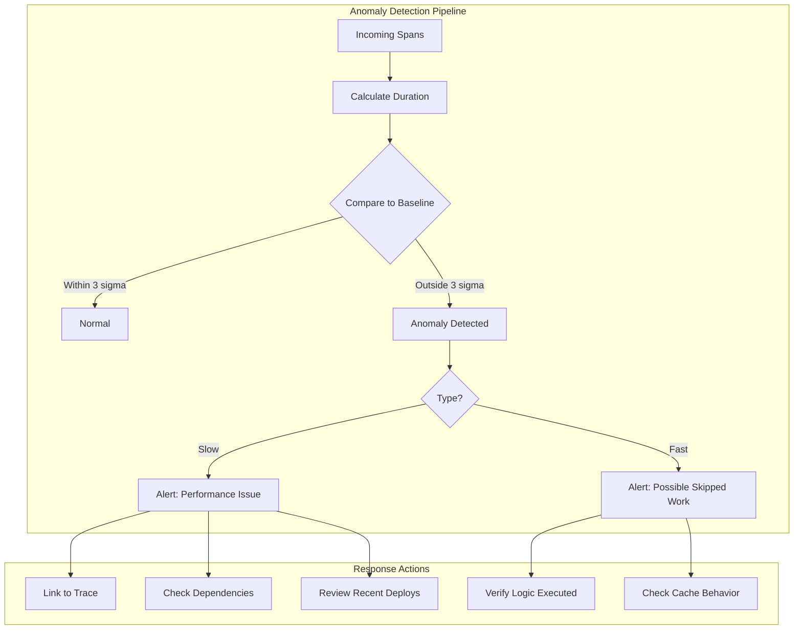

---

## 8. Building a Latency Analysis Pipeline

For production use, you need an automated pipeline that continuously analyzes traces and surfaces insights.

### Pipeline Architecture

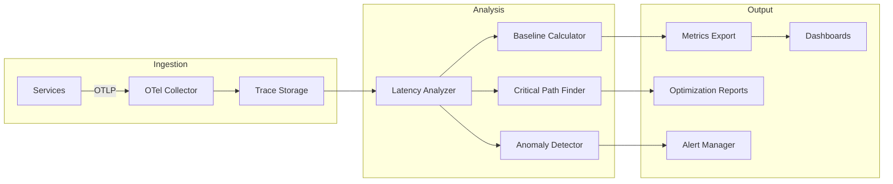

### Implementation: Continuous Analysis Job

```typescript
// latency-pipeline.ts
// Continuous latency analysis pipeline

import { trace, metrics } from '@opentelemetry/api';

interface AnalysisPipelineConfig {
  traceStorageUrl: string;
  analysisIntervalMs: number;
  baselineWindowHours: number;
  anomalyZScoreThreshold: number;
  slowTraceThresholdMs: number;
}

interface AnalysisResult {
  timestamp: Date;
  tracesAnalyzed: number;
  anomaliesDetected: LatencyAnomaly[];
  serviceBreakdown: ServiceLatencyStats[];
  criticalPathInsights: CriticalPathResult[];
  degradationAlerts: { operation: string; ratio: number }[];
}

/**
 * Main latency analysis pipeline.
 * Runs continuously to analyze traces and generate insights.
 */
class LatencyAnalysisPipeline {
  private config: AnalysisPipelineConfig;
  private baselines: Map<string, OperationBaseline> = new Map();
  private meter = metrics.getMeter('latency-analyzer');

  // Metrics for monitoring the analyzer itself
  private tracesAnalyzedCounter = this.meter.createCounter('traces_analyzed_total');
  private anomaliesDetectedCounter = this.meter.createCounter('anomalies_detected_total');
  private analysisLatencyHistogram = this.meter.createHistogram('analysis_latency_ms');

  constructor(config: AnalysisPipelineConfig) {
    this.config = config;
  }

  /**
   * Start the continuous analysis loop.
   */
  async start(): Promise<void> {
    console.log('Starting latency analysis pipeline...');

    // Initial baseline calculation from historical data
    await this.refreshBaselines();

    // Run analysis on interval
    setInterval(async () => {
      try {
        const result = await this.runAnalysisCycle();
        await this.processResults(result);
      } catch (error) {
        console.error('Analysis cycle failed:', error);
      }
    }, this.config.analysisIntervalMs);
  }

  /**
   * Refresh baselines from historical data.
   * Should run periodically (e.g., hourly) to adapt to normal drift.
   */
  async refreshBaselines(): Promise<void> {
    const historicalSpans = await this.fetchSpans(
      Date.now() - (this.config.baselineWindowHours * 60 * 60 * 1000),
      Date.now()
    );

    this.baselines = calculateBaselines(historicalSpans);
    console.log(`Refreshed baselines for ${this.baselines.size} operations`);
  }

  /**
   * Run one analysis cycle on recent traces.
   */
  async runAnalysisCycle(): Promise<AnalysisResult> {
    const startTime = Date.now();

    // Fetch recent spans (last interval)
    const recentSpans = await this.fetchSpans(
      Date.now() - this.config.analysisIntervalMs,
      Date.now()
    );

    // Group spans by trace
    const traceGroups = this.groupByTrace(recentSpans);

    // Run all analyses
    const anomalies = detectAnomalies(
      recentSpans,
      this.baselines,
      this.config.anomalyZScoreThreshold
    );

    const serviceBreakdown = aggregateByService(recentSpans);

    const criticalPaths: CriticalPathResult[] = [];
    for (const [traceId, spans] of traceGroups) {
      // Only analyze slow traces in detail
      const rootSpan = spans.find(s => !s.parentSpanId);
      if (rootSpan && (rootSpan.endTime - rootSpan.startTime) > this.config.slowTraceThresholdMs) {
        criticalPaths.push(findCriticalPath(spans));
      }
    }

    const degradations = detectLatencyDegradation(recentSpans, this.baselines);

    // Record metrics
    const analysisLatency = Date.now() - startTime;
    this.tracesAnalyzedCounter.add(traceGroups.size);
    this.anomaliesDetectedCounter.add(anomalies.length);
    this.analysisLatencyHistogram.record(analysisLatency);

    return {
      timestamp: new Date(),
      tracesAnalyzed: traceGroups.size,
      anomaliesDetected: anomalies,
      serviceBreakdown,
      criticalPathInsights: criticalPaths,
      degradationAlerts: degradations,
    };
  }

  /**
   * Process analysis results: send alerts, update dashboards, etc.
   */
  async processResults(result: AnalysisResult): Promise<void> {
    // Log summary
    console.log(`Analysis complete: ${result.tracesAnalyzed} traces, ` +
                `${result.anomaliesDetected.length} anomalies, ` +
                `${result.degradationAlerts.length} degradation alerts`);

    // Send alerts for severe anomalies
    for (const anomaly of result.anomaliesDetected) {
      if (anomaly.zScore > 5) {  // Severe anomaly
        await this.sendAlert({
          severity: 'warning',
          title: `Latency anomaly: ${anomaly.operationName}`,
          description: `Duration ${anomaly.actualDuration}ms is ${anomaly.zScore.toFixed(1)} ` +
                       `standard deviations from expected ${anomaly.expectedDuration.toFixed(1)}ms`,
          traceId: anomaly.traceId,
        });
      }
    }

    // Send alerts for degradation
    for (const degradation of result.degradationAlerts) {
      await this.sendAlert({
        severity: 'warning',
        title: `Latency degradation: ${degradation.operation}`,
        description: `Current average ${degradation.currentAvg.toFixed(1)}ms is ` +
                     `${(degradation.ratio * 100).toFixed(0)}% of baseline`,
      });
    }
  }

  // Helper methods (implementation depends on your infrastructure)
  private async fetchSpans(startTime: number, endTime: number): Promise<TraceSpan[]> {
    // Fetch from your trace storage (e.g., OneUptime, Jaeger, Tempo)
    // Implementation depends on your backend
    return [];
  }

  private groupByTrace(spans: TraceSpan[]): Map<string, TraceSpan[]> {
    const groups = new Map<string, TraceSpan[]>();
    for (const span of spans) {
      if (!groups.has(span.traceId)) {
        groups.set(span.traceId, []);
      }
      groups.get(span.traceId)!.push(span);
    }
    return groups;
  }

  private async sendAlert(alert: {
    severity: string;
    title: string;
    description: string;
    traceId?: string;
  }): Promise<void> {
    // Send to your alerting system (e.g., OneUptime, PagerDuty, Slack)
    console.log(`ALERT [${alert.severity}]: ${alert.title}`);
  }
}

// Usage
const pipeline = new LatencyAnalysisPipeline({
  traceStorageUrl: process.env.TRACE_STORAGE_URL || 'http://localhost:4317',
  analysisIntervalMs: 60_000,  // Analyze every minute
  baselineWindowHours: 24,     // 24-hour baseline
  anomalyZScoreThreshold: 3,   // 3 sigma for anomaly detection
  slowTraceThresholdMs: 500,   // Deep analyze traces > 500ms
});

pipeline.start();
```

---

## 9. Practical Implementation in Node.js

Here is a complete example showing how to instrument an application for latency analysis.

### Setting Up Instrumentation

```typescript
// telemetry-setup.ts
// Complete telemetry setup for latency analysis

import { NodeSDK } from '@opentelemetry/sdk-node';
import { getNodeAutoInstrumentations } from '@opentelemetry/auto-instrumentations-node';
import { OTLPTraceExporter } from '@opentelemetry/exporter-trace-otlp-http';
import { Resource } from '@opentelemetry/resources';
import { SemanticResourceAttributes } from '@opentelemetry/semantic-conventions';
import {
  ParentBasedSampler,
  TraceIdRatioBasedSampler
} from '@opentelemetry/sdk-trace-node';

// Configure the OTLP exporter to send traces to OneUptime
const traceExporter = new OTLPTraceExporter({
  url: process.env.OTLP_ENDPOINT || 'https://otlp.oneuptime.com/v1/traces',
  headers: {
    'x-oneuptime-token': process.env.ONEUPTIME_TOKEN || '',
  },
});

// Use parent-based sampling with 10% base rate
// This ensures we capture enough data for statistical analysis
const sampler = new ParentBasedSampler({
  root: new TraceIdRatioBasedSampler(
    parseFloat(process.env.TRACE_SAMPLE_RATE || '0.1')
  ),
});

// Initialize the SDK
export const sdk = new NodeSDK({
  resource: new Resource({
    [SemanticResourceAttributes.SERVICE_NAME]: 'order-service',
    [SemanticResourceAttributes.SERVICE_VERSION]: process.env.APP_VERSION || '1.0.0',
    [SemanticResourceAttributes.DEPLOYMENT_ENVIRONMENT]: process.env.NODE_ENV || 'development',
  }),
  traceExporter,
  sampler,
  instrumentations: [
    getNodeAutoInstrumentations({
      // Customize instrumentation for better latency analysis
      '@opentelemetry/instrumentation-http': {
        // Include request/response size for correlation with latency
        requestHook: (span, request) => {
          span.setAttribute('http.request.size',
            request.headers?.['content-length'] || 0
          );
        },
        responseHook: (span, response) => {
          span.setAttribute('http.response.size',
            response.headers?.['content-length'] || 0
          );
        },
      },
      '@opentelemetry/instrumentation-pg': {
        // Capture query stats for database latency analysis
        enhancedDatabaseReporting: true,
      },
    }),
  ],
});

// Start telemetry before importing app code
sdk.start();

// Graceful shutdown
process.on('SIGTERM', async () => {
  await sdk.shutdown();
  process.exit(0);
});
```

### Adding Custom Latency Attributes

```typescript
// latency-attributes.ts
// Add custom attributes to spans for deeper latency analysis

import { trace, context, SpanStatusCode, Span } from '@opentelemetry/api';

const tracer = trace.getTracer('order-service', '1.0.0');

/**
 * Wrapper that adds latency-relevant attributes to spans.
 * These attributes enable more detailed latency breakdown analysis.
 */
export async function withLatencyTracking<T>(
  name: string,
  operation: (span: Span) => Promise<T>,
  options: {
    operationType?: string;        // database, http, cache, compute, etc.
    targetService?: string;        // Name of downstream service
    isRetry?: boolean;             // Is this a retry attempt?
    retryCount?: number;           // Which retry attempt?
    queueTime?: number;            // Time spent waiting in queue
    expectedDurationMs?: number;   // Expected duration for anomaly detection
  } = {}
): Promise<T> {
  return tracer.startActiveSpan(name, async (span) => {
    const startTime = Date.now();

    // Add pre-execution attributes
    if (options.operationType) {
      span.setAttribute('latency.operation_type', options.operationType);
    }
    if (options.targetService) {
      span.setAttribute('latency.target_service', options.targetService);
    }
    if (options.isRetry) {
      span.setAttribute('latency.is_retry', true);
      span.setAttribute('latency.retry_count', options.retryCount || 1);
    }
    if (options.queueTime !== undefined) {
      span.setAttribute('latency.queue_time_ms', options.queueTime);
    }
    if (options.expectedDurationMs !== undefined) {
      span.setAttribute('latency.expected_duration_ms', options.expectedDurationMs);
    }

    try {
      const result = await operation(span);

      // Add post-execution attributes
      const actualDuration = Date.now() - startTime;
      span.setAttribute('latency.actual_duration_ms', actualDuration);

      if (options.expectedDurationMs) {
        const ratio = actualDuration / options.expectedDurationMs;
        span.setAttribute('latency.duration_ratio', ratio);

        // Flag slow operations
        if (ratio > 2) {
          span.setAttribute('latency.is_slow', true);
          span.addEvent('latency.slow_operation', {
            expected_ms: options.expectedDurationMs,
            actual_ms: actualDuration,
            ratio: ratio,
          });
        }
      }

      return result;
    } catch (error: any) {
      span.recordException(error);
      span.setStatus({ code: SpanStatusCode.ERROR, message: error.message });

      // Record latency even for failed operations
      const actualDuration = Date.now() - startTime;
      span.setAttribute('latency.actual_duration_ms', actualDuration);
      span.setAttribute('latency.failed', true);

      throw error;
    } finally {
      span.end();
    }
  });
}

// Example usage in application code
async function processOrder(orderId: string): Promise<void> {
  // Track database operation with expected duration
  const order = await withLatencyTracking(
    'db.orders.fetch',
    async (span) => {
      span.setAttribute('order.id', orderId);
      // Simulate database call
      return { id: orderId, items: [], total: 100 };
    },
    {
      operationType: 'database',
      expectedDurationMs: 50,  // We expect this to take ~50ms
    }
  );

  // Track external API call
  await withLatencyTracking(
    'payment.gateway.charge',
    async (span) => {
      span.setAttribute('payment.amount', order.total);
      // Simulate payment API call
      await new Promise(resolve => setTimeout(resolve, 120));
      return { success: true };
    },
    {
      operationType: 'external-api',
      targetService: 'stripe',
      expectedDurationMs: 200,
    }
  );
}
```

### Extracting Latency Metrics

```typescript
// latency-metrics.ts
// Export latency data as metrics for dashboards and alerting

import { metrics } from '@opentelemetry/api';

const meter = metrics.getMeter('latency-metrics', '1.0.0');

// Histogram for operation latency by type
const operationLatency = meter.createHistogram('operation.latency', {
  description: 'Latency of operations by type',
  unit: 'ms',
});

// Counter for slow operations
const slowOperationCounter = meter.createCounter('operation.slow.count', {
  description: 'Count of operations exceeding latency threshold',
});

// Gauge for current p99 latency (updated periodically)
const p99Gauge = meter.createObservableGauge('operation.latency.p99', {
  description: 'P99 latency over the last minute',
});

// Store recent latencies for percentile calculation
const recentLatencies = new Map<string, number[]>();

/**
 * Record an operation's latency for metric export.
 * This complements span data with aggregated metrics.
 */
export function recordOperationLatency(
  operationType: string,
  serviceName: string,
  durationMs: number,
  slowThresholdMs: number = 500
): void {
  // Record to histogram
  operationLatency.record(durationMs, {
    'operation.type': operationType,
    'service.name': serviceName,
  });

  // Count slow operations
  if (durationMs > slowThresholdMs) {
    slowOperationCounter.add(1, {
      'operation.type': operationType,
      'service.name': serviceName,
    });
  }

  // Store for percentile calculation
  const key = `${operationType}:${serviceName}`;
  if (!recentLatencies.has(key)) {
    recentLatencies.set(key, []);
  }
  const latencies = recentLatencies.get(key)!;
  latencies.push(durationMs);

  // Keep only last 1000 samples
  if (latencies.length > 1000) {
    latencies.shift();
  }
}

// Register observable gauge callback
p99Gauge.addCallback((result) => {
  for (const [key, latencies] of recentLatencies) {
    if (latencies.length < 10) continue;  // Need minimum samples

    const [operationType, serviceName] = key.split(':');
    const sorted = [...latencies].sort((a, b) => a - b);
    const p99Index = Math.floor(sorted.length * 0.99);
    const p99Value = sorted[p99Index];

    result.observe(p99Value, {
      'operation.type': operationType,
      'service.name': serviceName,
    });
  }
});
```

---

## 10. Common Latency Patterns and Fixes

Understanding common latency patterns helps you quickly identify and resolve issues.

### Pattern 1: Sequential Dependencies

```mermaid
gantt
    title Sequential Dependencies (Anti-pattern)
    dateFormat X
    axisFormat %L ms

    section Current
    Service A :a1, 0, 100
    Service B :a2, 100, 200
    Service C :a3, 200, 300
    Total: 300ms :milestone, 300, 300

    section Optimized (Parallel)
    Service A :b1, 0, 100
    Service B :b2, 0, 100
    Service C :b3, 0, 100
    Total: 100ms :milestone, 100, 100
```

**Problem:** Services called one after another when they have no data dependencies.

**Fix:** Parallelize independent calls using `Promise.all()`.

```typescript
// Before: Sequential (300ms total)
const resultA = await callServiceA();
const resultB = await callServiceB();
const resultC = await callServiceC();

// After: Parallel (100ms total)
const [resultA, resultB, resultC] = await Promise.all([
  callServiceA(),
  callServiceB(),
  callServiceC(),
]);
```

### Pattern 2: N+1 Query Problem

```mermaid
gantt
    title N+1 Query Problem
    dateFormat X
    axisFormat %L ms

    section N+1 Pattern
    SELECT orders       :a1, 0, 20
    SELECT user (id=1)  :a2, 25, 35
    SELECT user (id=2)  :a3, 40, 50
    SELECT user (id=3)  :a4, 55, 65
    SELECT user (id=4)  :a5, 70, 80
    SELECT user (id=5)  :a6, 85, 95
    Total: 95ms :milestone, 95, 95

    section Batched
    SELECT orders       :b1, 0, 20
    SELECT users IN()   :b2, 25, 45
    Total: 45ms :milestone, 45, 45
```

**Problem:** One query to fetch a list, then N queries for related data.

**Fix:** Batch related queries using IN clauses or JOINs.

### Pattern 3: Retry Amplification

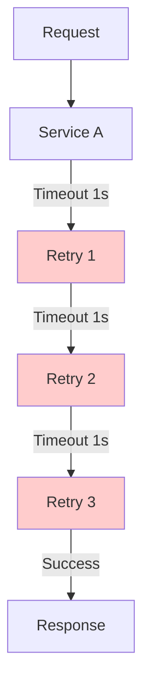

**Problem:** Retries add up, especially when nested across services.

**Fix:**
- Use exponential backoff with jitter
- Set overall request budgets
- Implement circuit breakers

```typescript
// Retry with exponential backoff and budget
async function withRetryBudget<T>(
  operation: () => Promise<T>,
  options: {
    maxRetries: number;
    baseDelayMs: number;
    budgetMs: number;  // Total time budget including retries
  }
): Promise<T> {
  const startTime = Date.now();
  let lastError: Error | null = null;

  for (let attempt = 0; attempt <= options.maxRetries; attempt++) {
    // Check if we have time budget remaining
    const elapsed = Date.now() - startTime;
    if (elapsed > options.budgetMs) {
      throw new Error(`Retry budget exhausted after ${elapsed}ms`);
    }

    try {
      return await operation();
    } catch (error: any) {
      lastError = error;

      if (attempt < options.maxRetries) {
        // Exponential backoff with jitter
        const delay = options.baseDelayMs * Math.pow(2, attempt);
        const jitter = delay * 0.2 * Math.random();
        await new Promise(r => setTimeout(r, delay + jitter));
      }
    }
  }

  throw lastError;
}
```

### Pattern 4: Cold Start Latency

```mermaid
gantt
    title Cold Start Impact
    dateFormat X
    axisFormat %L ms

    section Cold Start
    Container Init  :crit, a1, 0, 500
    App Bootstrap   :crit, a2, 500, 800
    Connection Pool :crit, a3, 800, 900
    Handle Request  :a4, 900, 950
    Total: 950ms :milestone, 950, 950

    section Warm Request
    Handle Request  :b1, 0, 50
    Total: 50ms :milestone, 50, 50
```

**Problem:** First requests after deployment or scale-up are slow.

**Fix:**
- Implement health check endpoints that warm up the application
- Pre-warm connection pools during startup
- Use readiness probes in Kubernetes to delay traffic until warm

### Pattern 5: Cascading Timeouts

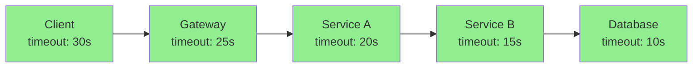

**Problem:** Improperly configured timeouts cause premature failures or resource holding.

**Fix:** Configure timeouts to decrease as you go deeper into the stack, leaving headroom for response propagation.

---

## 11. Summary

Latency analysis transforms raw trace data into actionable insights. Here is what we covered:

| Technique | What It Reveals | When To Use |
|-----------|-----------------|-------------|
| Span Duration Analysis | Total time per operation | Always - basic building block |
| Self Time Calculation | Where work actually happens vs waiting | Identifying true bottlenecks |
| Critical Path Analysis | Minimum latency, optimization targets | Prioritizing improvements |
| Service Breakdown | Which teams/services to focus on | Cross-team coordination |
| Operation Type Analysis | System-wide patterns (DB, cache, API) | Architecture decisions |
| Anomaly Detection | Unusual behavior requiring investigation | Alerting and triage |

### Key Takeaways

1. **Duration alone is not enough.** Calculate self time to find where work actually happens.

2. **Focus on the critical path.** Optimizing non-critical operations will not reduce total latency.

3. **Aggregate across traces.** Single trace analysis finds one-off issues; statistical analysis finds systemic problems.

4. **Automate the analysis.** Build pipelines that continuously surface latency insights.

5. **Connect to action.** Every insight should link to a trace, a dashboard, or an alert.

---

## Next Steps

Ready to implement latency analysis for your services? Here is a quick start checklist:

- [ ] Ensure all services are instrumented with OpenTelemetry
- [ ] Configure OTLP export to your tracing backend (e.g., OneUptime)
- [ ] Add custom attributes for operation type and expected duration
- [ ] Set up latency percentile dashboards (p50, p95, p99)
- [ ] Implement baseline calculation for anomaly detection
- [ ] Create alerts for latency degradation
- [ ] Schedule regular latency review sessions with your team

---

**Related Reading:**

- [What are Traces and Spans in OpenTelemetry](/blog/post/2025-08-27-traces-and-spans-in-opentelemetry)
- [The Three Pillars of Observability](/blog/post/2025-08-20-three-pillars-of-observability-logs-metrics-traces)
- [SRE Metrics to Track](/blog/post/2025-11-28-sre-metrics-to-track)
