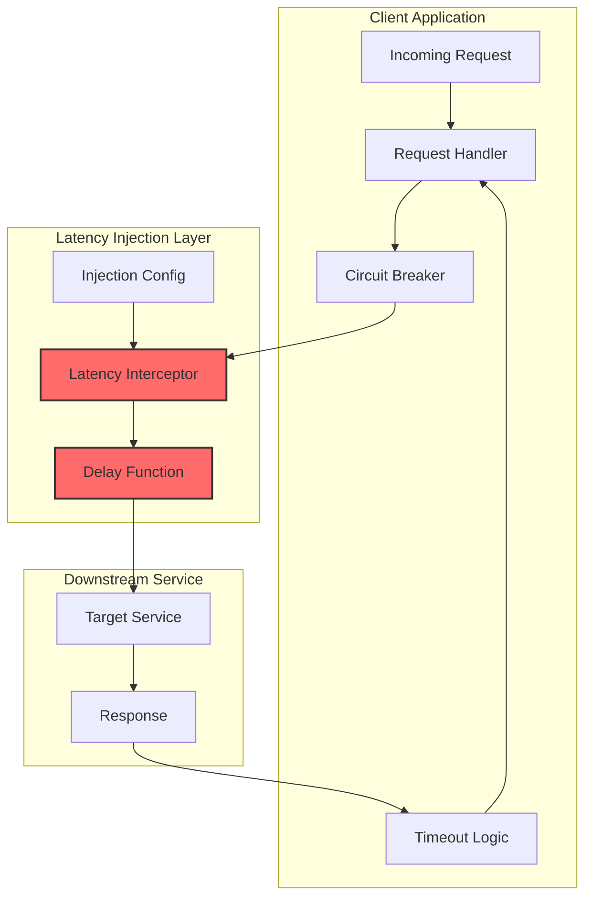
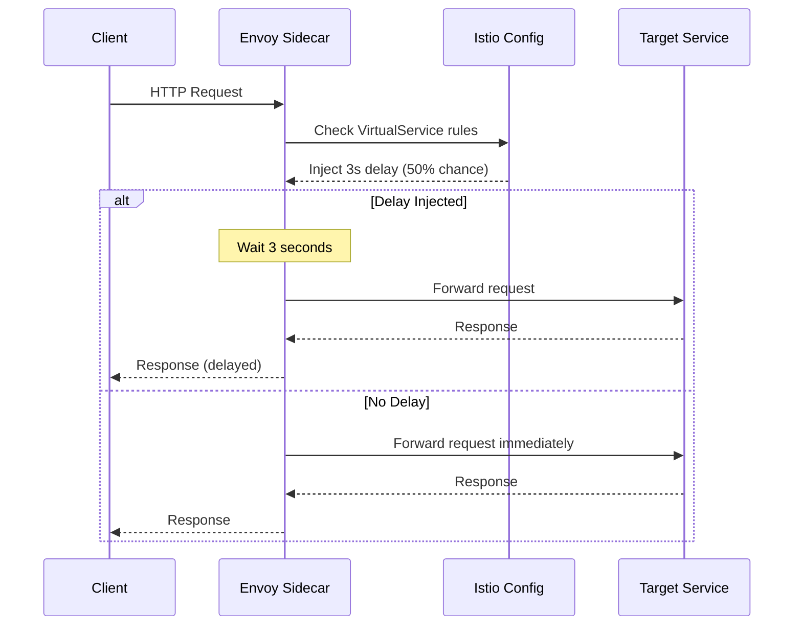
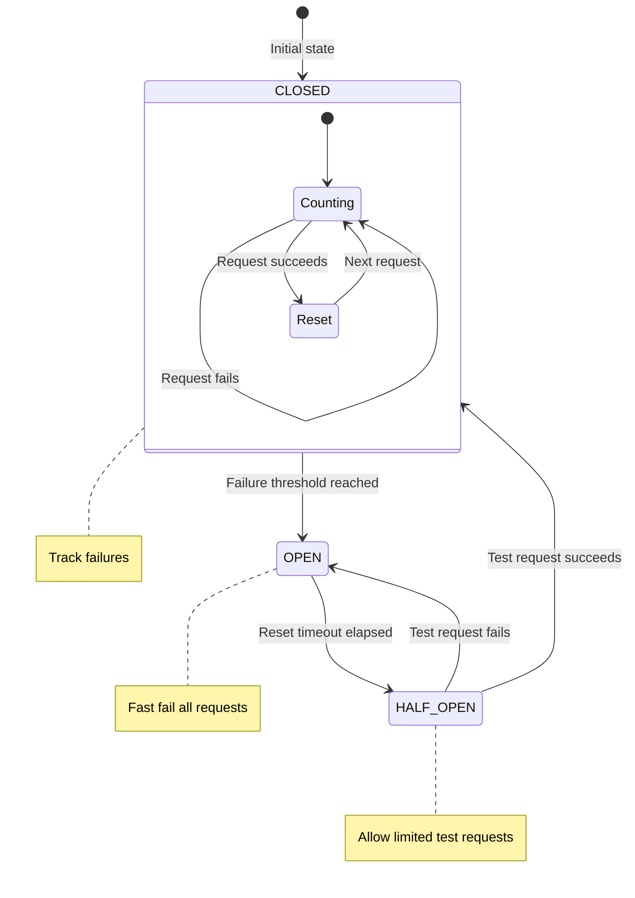

# How to Implement Latency Injection

Author: [nawazdhandala](https://github.com/nawazdhandala)

Tags: Testing, ChaosEngineering, Latency, Resilience

Description: Learn how to implement latency injection to test timeout handling, validate circuit breakers, and build resilient distributed systems.

---

Production systems fail in unexpected ways. Latency spikes, slow database queries, and network congestion can cascade into outages. Latency injection is a chaos engineering technique that deliberately introduces delays into your system to validate timeout handling, circuit breakers, and graceful degradation. This guide covers practical techniques for implementing latency injection at different layers of your stack.

## Why Latency Injection Matters

Timeout handling code rarely gets exercised in normal conditions. Developers write timeout logic, but it sits untested until production traffic triggers edge cases. Latency injection proactively validates that your system handles slow dependencies correctly before users experience problems.

| Problem | What Latency Injection Reveals |
|---------|-------------------------------|
| **Timeout misconfiguration** | Timeouts set too high or too low |
| **Missing circuit breakers** | Cascading failures from slow services |
| **Resource exhaustion** | Thread pool saturation, connection pool depletion |
| **Retry storms** | Aggressive retries overwhelming recovering services |
| **User experience degradation** | What users see when dependencies slow down |

## Latency Injection Flow



## Application-Level Latency Injection

The simplest approach is injecting delays directly in your application code. This provides fine-grained control and works without infrastructure changes.

### Node.js Latency Injection Middleware

This middleware intercepts HTTP requests and adds configurable delays. It supports percentage-based injection, route-specific rules, and different delay distributions.

```javascript
// Latency injection middleware for Express
// Intercepts requests and adds configurable delays
class LatencyInjector {
  constructor(options = {}) {
    // Percentage of requests to inject latency (0-100)
    this.percentage = options.percentage || 100;
    // Base delay in milliseconds
    this.delayMs = options.delayMs || 1000;
    // Maximum additional random delay
    this.jitterMs = options.jitterMs || 0;
    // Routes to target (empty means all routes)
    this.targetRoutes = options.targetRoutes || [];
    // Whether injection is enabled
    this.enabled = options.enabled || false;
  }

  // Calculate delay with optional jitter for realistic variation
  calculateDelay() {
    const jitter = this.jitterMs > 0
      ? Math.random() * this.jitterMs
      : 0;
    return this.delayMs + jitter;
  }

  // Check if this request should be injected
  shouldInject(req) {
    if (!this.enabled) return false;

    // Check route targeting
    if (this.targetRoutes.length > 0) {
      const matchesRoute = this.targetRoutes.some(route =>
        req.path.startsWith(route)
      );
      if (!matchesRoute) return false;
    }

    // Check percentage
    return Math.random() * 100 < this.percentage;
  }

  // Express middleware function
  middleware() {
    return async (req, res, next) => {
      if (this.shouldInject(req)) {
        const delay = this.calculateDelay();
        console.log(`[Latency Injection] Adding ${delay}ms delay to ${req.path}`);

        await new Promise(resolve => setTimeout(resolve, delay));
      }
      next();
    };
  }

  // Update configuration at runtime
  configure(options) {
    if (options.percentage !== undefined) this.percentage = options.percentage;
    if (options.delayMs !== undefined) this.delayMs = options.delayMs;
    if (options.jitterMs !== undefined) this.jitterMs = options.jitterMs;
    if (options.targetRoutes !== undefined) this.targetRoutes = options.targetRoutes;
    if (options.enabled !== undefined) this.enabled = options.enabled;
  }
}

// Usage with Express
const express = require('express');
const app = express();

const latencyInjector = new LatencyInjector({
  enabled: process.env.ENABLE_LATENCY_INJECTION === 'true',
  delayMs: 2000,
  jitterMs: 500,
  percentage: 50,
  targetRoutes: ['/api/orders', '/api/payments'],
});

// Apply middleware before route handlers
app.use(latencyInjector.middleware());

// Admin endpoint to control injection at runtime
app.post('/admin/latency-injection', (req, res) => {
  latencyInjector.configure(req.body);
  res.json({ status: 'configured', config: req.body });
});

app.get('/api/orders', async (req, res) => {
  // This route may experience injected latency
  const orders = await fetchOrders();
  res.json(orders);
});
```

### Python Latency Injection Decorator

Use decorators to inject latency into specific functions. This approach works well for testing individual service calls or database queries.

```python
import asyncio
import functools
import random
import time
from typing import Callable, List, Optional

class LatencyInjector:
    """
    Latency injection decorator for Python functions.
    Supports sync and async functions with configurable delays.
    """

    def __init__(
        self,
        delay_ms: int = 1000,
        jitter_ms: int = 0,
        percentage: int = 100,
        enabled: bool = False,
    ):
        self.delay_ms = delay_ms
        self.jitter_ms = jitter_ms
        self.percentage = percentage
        self.enabled = enabled

    def _calculate_delay(self) -> float:
        """Calculate delay in seconds with optional jitter."""
        jitter = random.uniform(0, self.jitter_ms) if self.jitter_ms > 0 else 0
        return (self.delay_ms + jitter) / 1000

    def _should_inject(self) -> bool:
        """Determine if latency should be injected based on percentage."""
        if not self.enabled:
            return False
        return random.randint(1, 100) <= self.percentage

    def inject(self, func: Callable) -> Callable:
        """
        Decorator that injects latency before function execution.
        Works with both sync and async functions.
        """
        @functools.wraps(func)
        async def async_wrapper(*args, **kwargs):
            if self._should_inject():
                delay = self._calculate_delay()
                print(f"[Latency Injection] Adding {delay*1000:.0f}ms delay to {func.__name__}")
                await asyncio.sleep(delay)
            return await func(*args, **kwargs)

        @functools.wraps(func)
        def sync_wrapper(*args, **kwargs):
            if self._should_inject():
                delay = self._calculate_delay()
                print(f"[Latency Injection] Adding {delay*1000:.0f}ms delay to {func.__name__}")
                time.sleep(delay)
            return func(*args, **kwargs)

        if asyncio.iscoroutinefunction(func):
            return async_wrapper
        return sync_wrapper

    def configure(
        self,
        delay_ms: Optional[int] = None,
        jitter_ms: Optional[int] = None,
        percentage: Optional[int] = None,
        enabled: Optional[bool] = None,
    ):
        """Update configuration at runtime."""
        if delay_ms is not None:
            self.delay_ms = delay_ms
        if jitter_ms is not None:
            self.jitter_ms = jitter_ms
        if percentage is not None:
            self.percentage = percentage
        if enabled is not None:
            self.enabled = enabled


# Create a global injector for the application
latency_injector = LatencyInjector(
    delay_ms=2000,
    jitter_ms=500,
    percentage=50,
    enabled=False,
)


# Usage with FastAPI
from fastapi import FastAPI

app = FastAPI()


@app.get("/api/orders")
@latency_injector.inject
async def get_orders():
    """This endpoint may experience injected latency."""
    orders = await fetch_orders_from_database()
    return {"orders": orders}


@app.post("/admin/latency-injection")
async def configure_injection(config: dict):
    """Runtime configuration endpoint."""
    latency_injector.configure(**config)
    return {"status": "configured"}
```

### Go HTTP Client with Latency Injection

Wrap your HTTP client to inject delays on outgoing requests. This tests how your application handles slow external dependencies.

```go
package latency

import (
    "context"
    "math/rand"
    "net/http"
    "sync"
    "time"
)

// Config holds latency injection configuration
type Config struct {
    Enabled     bool          // Whether injection is enabled
    DelayMs     int           // Base delay in milliseconds
    JitterMs    int           // Maximum random additional delay
    Percentage  int           // Percentage of requests to inject (0-100)
    TargetHosts []string      // Hosts to target (empty means all)
}

// Injector wraps an HTTP transport with latency injection
type Injector struct {
    transport http.RoundTripper
    config    Config
    mu        sync.RWMutex
}

// NewInjector creates a new latency injector
func NewInjector(transport http.RoundTripper, config Config) *Injector {
    if transport == nil {
        transport = http.DefaultTransport
    }
    return &Injector{
        transport: transport,
        config:    config,
    }
}

// RoundTrip implements http.RoundTripper with latency injection
func (i *Injector) RoundTrip(req *http.Request) (*http.Response, error) {
    i.mu.RLock()
    config := i.config
    i.mu.RUnlock()

    if i.shouldInject(req, config) {
        delay := i.calculateDelay(config)

        select {
        case <-time.After(delay):
            // Delay completed
        case <-req.Context().Done():
            // Request was cancelled during delay
            return nil, req.Context().Err()
        }
    }

    return i.transport.RoundTrip(req)
}

// shouldInject determines if latency should be added to this request
func (i *Injector) shouldInject(req *http.Request, config Config) bool {
    if !config.Enabled {
        return false
    }

    // Check host targeting
    if len(config.TargetHosts) > 0 {
        matched := false
        for _, host := range config.TargetHosts {
            if req.URL.Host == host {
                matched = true
                break
            }
        }
        if !matched {
            return false
        }
    }

    // Check percentage
    return rand.Intn(100) < config.Percentage
}

// calculateDelay computes the delay with jitter
func (i *Injector) calculateDelay(config Config) time.Duration {
    delay := config.DelayMs
    if config.JitterMs > 0 {
        delay += rand.Intn(config.JitterMs)
    }
    return time.Duration(delay) * time.Millisecond
}

// Configure updates the injection configuration at runtime
func (i *Injector) Configure(config Config) {
    i.mu.Lock()
    defer i.mu.Unlock()
    i.config = config
}

// Usage example
func main() {
    // Create injector with configuration
    injector := NewInjector(http.DefaultTransport, Config{
        Enabled:     true,
        DelayMs:     2000,
        JitterMs:    500,
        Percentage:  50,
        TargetHosts: []string{"api.example.com"},
    })

    // Create HTTP client with injector
    client := &http.Client{
        Transport: injector,
        Timeout:   10 * time.Second,
    }

    // Requests to api.example.com may experience injected latency
    ctx, cancel := context.WithTimeout(context.Background(), 5*time.Second)
    defer cancel()

    req, _ := http.NewRequestWithContext(ctx, "GET", "https://api.example.com/data", nil)
    resp, err := client.Do(req)
    if err != nil {
        // Handle timeout or context cancellation
        log.Printf("Request failed: %v", err)
        return
    }
    defer resp.Body.Close()
}
```

## Service Mesh Latency Injection

Service meshes like Istio and Linkerd provide infrastructure-level latency injection without code changes. This approach is ideal for testing in staging or production environments.

### Istio Fault Injection

Istio's VirtualService resources support latency injection as a first-class feature.

```yaml
# Istio VirtualService with latency injection
# Applies to all traffic to the orders service
apiVersion: networking.istio.io/v1beta1
kind: VirtualService
metadata:
  name: orders-latency-injection
  namespace: production
spec:
  hosts:
    - orders-service
  http:
    - fault:
        delay:
          # Inject 3 second delay
          fixedDelay: 3s
          # Apply to 50% of requests
          percentage:
            value: 50
      route:
        - destination:
            host: orders-service
            port:
              number: 80
```

### Conditional Latency Based on Headers

Target specific requests using header matching. This allows testing latency handling for specific users or request types.

```yaml
# Inject latency only for requests with specific headers
# Useful for testing without affecting all traffic
apiVersion: networking.istio.io/v1beta1
kind: VirtualService
metadata:
  name: orders-conditional-latency
  namespace: production
spec:
  hosts:
    - orders-service
  http:
    # Rule 1: Inject latency for chaos testing requests
    - match:
        - headers:
            x-chaos-latency:
              exact: "enabled"
      fault:
        delay:
          fixedDelay: 5s
          percentage:
            value: 100
      route:
        - destination:
            host: orders-service

    # Rule 2: Normal traffic passes through without delay
    - route:
        - destination:
            host: orders-service
```

### Linkerd Latency Injection

Linkerd uses ServiceProfiles for traffic policies including latency injection.

```yaml
# Linkerd ServiceProfile with latency injection
apiVersion: linkerd.io/v1alpha2
kind: ServiceProfile
metadata:
  name: orders-service.production.svc.cluster.local
  namespace: production
spec:
  routes:
    - name: GET /api/orders
      condition:
        method: GET
        pathRegex: /api/orders.*
      # Inject 2 second delay on 30% of requests
      timeout: 10s
      # Note: Linkerd uses traffic splits for fault injection
      # This example shows the structure; actual fault injection
      # requires Linkerd's fault injection extension
```

### Service Mesh Injection Flow



## Timeout Testing Scenarios

Latency injection helps validate different timeout scenarios. Here are patterns for testing common timeout configurations.

### Testing Client-Side Timeouts

```javascript
const axios = require('axios');

// Test that client timeouts work correctly
// The latency injector should add delays longer than the timeout
async function testClientTimeout() {
  const client = axios.create({
    baseURL: 'http://api.example.com',
    // 2 second timeout
    timeout: 2000,
  });

  try {
    // With 3s latency injection, this should timeout
    await client.get('/api/orders');
    console.log('ERROR: Request should have timed out');
  } catch (error) {
    if (error.code === 'ECONNABORTED') {
      console.log('SUCCESS: Client timeout triggered correctly');
    } else {
      console.log('ERROR: Unexpected error:', error.message);
    }
  }
}

// Test timeout with retry logic
async function testTimeoutWithRetry() {
  const client = axios.create({
    baseURL: 'http://api.example.com',
    timeout: 2000,
  });

  const maxRetries = 3;
  let attempts = 0;

  while (attempts < maxRetries) {
    attempts++;
    try {
      const response = await client.get('/api/orders');
      console.log(`SUCCESS: Request succeeded on attempt ${attempts}`);
      return response.data;
    } catch (error) {
      console.log(`Attempt ${attempts} failed: ${error.code || error.message}`);
      if (attempts === maxRetries) {
        throw new Error(`All ${maxRetries} attempts failed`);
      }
      // Wait before retry with exponential backoff
      await new Promise(r => setTimeout(r, Math.pow(2, attempts) * 1000));
    }
  }
}
```

### Testing Cascading Timeout Scenarios

When Service A calls Service B, and B calls Service C, timeouts must be configured correctly to prevent cascading failures.

```javascript
// Simulate a chain of service calls with proper timeout budgets
// Each downstream call should have a smaller timeout than the upstream

class TimeoutBudget {
  constructor(totalMs) {
    this.totalMs = totalMs;
    this.startTime = Date.now();
  }

  // Get remaining time budget for downstream calls
  remaining() {
    const elapsed = Date.now() - this.startTime;
    return Math.max(0, this.totalMs - elapsed);
  }

  // Check if budget is exhausted
  isExhausted() {
    return this.remaining() <= 0;
  }
}

// Service A handler
async function serviceAHandler(req) {
  // Total timeout budget for this request
  const budget = new TimeoutBudget(5000);

  // Call Service B with portion of budget
  // Leave buffer for processing
  const serviceBTimeout = Math.min(budget.remaining() - 500, 3000);

  if (serviceBTimeout <= 0) {
    throw new Error('Timeout budget exhausted before calling Service B');
  }

  try {
    const serviceBResult = await callServiceB(serviceBTimeout);

    // Process result within remaining budget
    if (budget.isExhausted()) {
      throw new Error('Timeout budget exhausted during processing');
    }

    return processResult(serviceBResult);
  } catch (error) {
    if (error.code === 'ECONNABORTED') {
      console.log('Service B timed out, using fallback');
      return getFallbackResult();
    }
    throw error;
  }
}

// Service B handler (called by Service A)
async function callServiceB(timeoutMs) {
  const budget = new TimeoutBudget(timeoutMs);

  // Call Service C with smaller budget
  const serviceCTimeout = Math.min(budget.remaining() - 200, 1500);

  if (serviceCTimeout <= 0) {
    throw new Error('Timeout budget exhausted before calling Service C');
  }

  const client = axios.create({
    baseURL: 'http://service-c',
    timeout: serviceCTimeout,
  });

  const response = await client.get('/api/data');
  return response.data;
}
```

## Circuit Breaker Validation

Latency injection is essential for testing circuit breakers. The circuit should open when too many requests timeout.

### Testing Circuit Breaker States

```javascript
// Circuit breaker with configurable thresholds
class CircuitBreaker {
  constructor(options = {}) {
    this.failureThreshold = options.failureThreshold || 5;
    this.resetTimeout = options.resetTimeout || 30000;
    this.halfOpenRequests = options.halfOpenRequests || 1;

    this.state = 'CLOSED';
    this.failures = 0;
    this.lastFailureTime = null;
    this.halfOpenAttempts = 0;
  }

  async execute(fn) {
    // Check if circuit should transition from OPEN to HALF_OPEN
    if (this.state === 'OPEN') {
      if (Date.now() - this.lastFailureTime > this.resetTimeout) {
        this.state = 'HALF_OPEN';
        this.halfOpenAttempts = 0;
        console.log('[Circuit Breaker] State: OPEN -> HALF_OPEN');
      } else {
        throw new Error('Circuit breaker is OPEN');
      }
    }

    // Limit requests in HALF_OPEN state
    if (this.state === 'HALF_OPEN' && this.halfOpenAttempts >= this.halfOpenRequests) {
      throw new Error('Circuit breaker is HALF_OPEN, waiting for test requests');
    }

    try {
      if (this.state === 'HALF_OPEN') {
        this.halfOpenAttempts++;
      }

      const result = await fn();
      this.onSuccess();
      return result;
    } catch (error) {
      this.onFailure();
      throw error;
    }
  }

  onSuccess() {
    if (this.state === 'HALF_OPEN') {
      this.state = 'CLOSED';
      this.failures = 0;
      console.log('[Circuit Breaker] State: HALF_OPEN -> CLOSED');
    } else {
      this.failures = 0;
    }
  }

  onFailure() {
    this.failures++;
    this.lastFailureTime = Date.now();

    if (this.state === 'HALF_OPEN') {
      this.state = 'OPEN';
      console.log('[Circuit Breaker] State: HALF_OPEN -> OPEN');
    } else if (this.failures >= this.failureThreshold) {
      this.state = 'OPEN';
      console.log('[Circuit Breaker] State: CLOSED -> OPEN');
    }
  }

  getState() {
    return {
      state: this.state,
      failures: this.failures,
      lastFailureTime: this.lastFailureTime,
    };
  }
}

// Test circuit breaker with latency injection
async function testCircuitBreaker() {
  const circuitBreaker = new CircuitBreaker({
    failureThreshold: 3,
    resetTimeout: 10000,
  });

  const client = axios.create({
    baseURL: 'http://api.example.com',
    timeout: 1000, // 1 second timeout
  });

  // With 3s latency injection, requests will timeout
  // After 3 failures, circuit should open
  for (let i = 1; i <= 5; i++) {
    try {
      await circuitBreaker.execute(async () => {
        const response = await client.get('/api/orders');
        return response.data;
      });
      console.log(`Request ${i}: SUCCESS`);
    } catch (error) {
      console.log(`Request ${i}: FAILED - ${error.message}`);
      console.log(`Circuit state: ${circuitBreaker.getState().state}`);
    }
  }

  // Wait for reset timeout
  console.log('Waiting for circuit breaker reset...');
  await new Promise(r => setTimeout(r, 11000));

  // Disable latency injection for recovery test
  // Circuit should transition to HALF_OPEN and then CLOSED
  try {
    await circuitBreaker.execute(async () => {
      const response = await client.get('/api/orders');
      return response.data;
    });
    console.log('Recovery request: SUCCESS');
    console.log(`Circuit state: ${circuitBreaker.getState().state}`);
  } catch (error) {
    console.log(`Recovery request: FAILED - ${error.message}`);
  }
}
```

### Circuit Breaker State Diagram



## Database Latency Injection

Test how your application handles slow database queries. This is critical for applications that depend heavily on database performance.

### PostgreSQL Query Delay

```sql
-- Function to inject latency into specific queries
-- Use in test/staging environments only
CREATE OR REPLACE FUNCTION inject_latency(delay_ms INTEGER)
RETURNS void AS $$
BEGIN
    PERFORM pg_sleep(delay_ms / 1000.0);
END;
$$ LANGUAGE plpgsql;

-- Example: Add 2 second delay to order queries
-- Call this before the actual query logic
SELECT inject_latency(2000);
SELECT * FROM orders WHERE customer_id = $1;
```

### Application-Level Database Delay

```javascript
const { Pool } = require('pg');

// Wrap pg pool with latency injection
class InstrumentedPool {
  constructor(config, latencyConfig = {}) {
    this.pool = new Pool(config);
    this.latencyConfig = {
      enabled: latencyConfig.enabled || false,
      delayMs: latencyConfig.delayMs || 0,
      percentage: latencyConfig.percentage || 100,
      // Target specific query patterns
      targetPatterns: latencyConfig.targetPatterns || [],
    };
  }

  shouldInject(queryText) {
    if (!this.latencyConfig.enabled) return false;

    // Check query pattern matching
    if (this.latencyConfig.targetPatterns.length > 0) {
      const matches = this.latencyConfig.targetPatterns.some(pattern =>
        queryText.toLowerCase().includes(pattern.toLowerCase())
      );
      if (!matches) return false;
    }

    // Check percentage
    return Math.random() * 100 < this.latencyConfig.percentage;
  }

  async query(text, params) {
    if (this.shouldInject(text)) {
      console.log(`[DB Latency] Injecting ${this.latencyConfig.delayMs}ms delay`);
      await new Promise(r => setTimeout(r, this.latencyConfig.delayMs));
    }

    return this.pool.query(text, params);
  }

  // Configure at runtime
  configureLatency(config) {
    Object.assign(this.latencyConfig, config);
  }

  async end() {
    return this.pool.end();
  }
}

// Usage
const db = new InstrumentedPool(
  {
    host: 'localhost',
    database: 'myapp',
    user: 'myuser',
    password: 'mypassword',
  },
  {
    enabled: process.env.INJECT_DB_LATENCY === 'true',
    delayMs: 3000,
    percentage: 30,
    targetPatterns: ['SELECT * FROM orders'],
  }
);

// Queries matching the pattern will have latency injected
const orders = await db.query('SELECT * FROM orders WHERE customer_id = $1', [customerId]);
```

## Testing Graceful Degradation

Latency injection validates that your system degrades gracefully when dependencies slow down.

```javascript
// Service with fallback behavior
class OrderService {
  constructor(options = {}) {
    this.primaryClient = options.primaryClient;
    this.cacheClient = options.cacheClient;
    this.timeout = options.timeout || 2000;
  }

  async getOrders(customerId) {
    try {
      // Try primary data source with timeout
      const response = await Promise.race([
        this.primaryClient.get(`/api/orders?customer=${customerId}`),
        this.createTimeout(this.timeout),
      ]);
      return response.data;
    } catch (error) {
      console.log(`[OrderService] Primary source failed: ${error.message}`);

      // Fallback to cache
      try {
        const cached = await this.cacheClient.get(`orders:${customerId}`);
        if (cached) {
          console.log('[OrderService] Serving from cache');
          return JSON.parse(cached);
        }
      } catch (cacheError) {
        console.log(`[OrderService] Cache lookup failed: ${cacheError.message}`);
      }

      // Final fallback: return empty with warning
      console.log('[OrderService] All sources failed, returning empty result');
      return {
        orders: [],
        degraded: true,
        message: 'Order data temporarily unavailable',
      };
    }
  }

  createTimeout(ms) {
    return new Promise((_, reject) =>
      setTimeout(() => reject(new Error('Request timeout')), ms)
    );
  }
}

// Test graceful degradation
async function testGracefulDegradation() {
  const orderService = new OrderService({
    primaryClient: axios.create({
      baseURL: 'http://orders-api', // Has 5s latency injection
      timeout: 2000,
    }),
    cacheClient: redis,
    timeout: 2000,
  });

  // Pre-populate cache for testing
  await redis.set('orders:customer123', JSON.stringify([
    { id: 1, product: 'Widget', status: 'shipped' },
  ]));

  // Test 1: Primary timeout, cache hit
  const result1 = await orderService.getOrders('customer123');
  console.log('With cache:', result1);
  // Expected: Returns cached data

  // Test 2: Primary timeout, cache miss
  const result2 = await orderService.getOrders('customer456');
  console.log('Without cache:', result2);
  // Expected: Returns degraded response with empty orders
}
```

## Monitoring Latency Injection Impact

Track the impact of latency injection on your system to understand failure modes.

```javascript
const prometheus = require('prom-client');

// Metrics for latency injection
const latencyInjectionCounter = new prometheus.Counter({
  name: 'latency_injection_total',
  help: 'Total number of latency injections',
  labelNames: ['route', 'injected'],
});

const latencyInjectionDuration = new prometheus.Histogram({
  name: 'latency_injection_duration_seconds',
  help: 'Duration of injected latency',
  labelNames: ['route'],
  buckets: [0.1, 0.5, 1, 2, 5, 10],
});

const timeoutCounter = new prometheus.Counter({
  name: 'request_timeouts_total',
  help: 'Total number of request timeouts',
  labelNames: ['route', 'type'],
});

// Instrumented latency injector
class InstrumentedLatencyInjector {
  constructor(options = {}) {
    this.delayMs = options.delayMs || 1000;
    this.percentage = options.percentage || 100;
    this.enabled = options.enabled || false;
  }

  async middleware(req, res, next) {
    const route = req.route?.path || req.path;
    const shouldInject = this.enabled && Math.random() * 100 < this.percentage;

    latencyInjectionCounter.inc({
      route,
      injected: shouldInject ? 'true' : 'false',
    });

    if (shouldInject) {
      const delay = this.delayMs / 1000;
      latencyInjectionDuration.observe({ route }, delay);

      await new Promise(resolve => setTimeout(resolve, this.delayMs));
    }

    next();
  }
}

// Track timeouts in error handler
function timeoutErrorHandler(err, req, res, next) {
  const route = req.route?.path || req.path;

  if (err.code === 'ECONNABORTED' || err.message.includes('timeout')) {
    timeoutCounter.inc({ route, type: 'client_timeout' });
  }

  next(err);
}
```

## Summary

| Technique | Use Case | Pros | Cons |
|-----------|----------|------|------|
| **Application middleware** | Fine-grained control | No infrastructure changes | Requires code changes |
| **Service mesh** | Production testing | No code changes | Requires mesh infrastructure |
| **Database injection** | Query timeout testing | Tests real DB behavior | Environment-specific |
| **Client wrapper** | External dependency testing | Isolated testing | Only tests outgoing calls |

Latency injection is a powerful tool for building resilient systems. By deliberately introducing delays, you can validate timeout configurations, test circuit breakers, and ensure graceful degradation before real latency issues affect users. Start with application-level injection for development testing, then graduate to service mesh injection for staging and controlled production testing.

**Related Reading:**

- [How to Implement Retry Logic with Exponential Backoff in Node.js](https://oneuptime.com/blog/post/2026-01-06-nodejs-retry-exponential-backoff/view)
- [12 SRE Best Practices That Actually Move the Needle](https://oneuptime.com/blog/post/2025-11-28-sre-best-practices/view)
- [The Five Stages of SRE Maturity](https://oneuptime.com/blog/post/2025-09-01-the-five-stages-of-sre-maturity/view)
