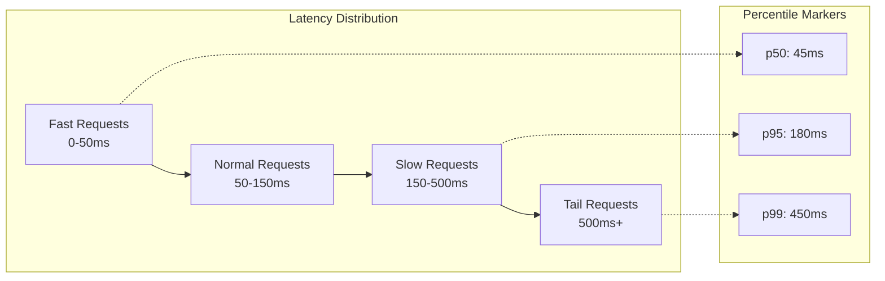
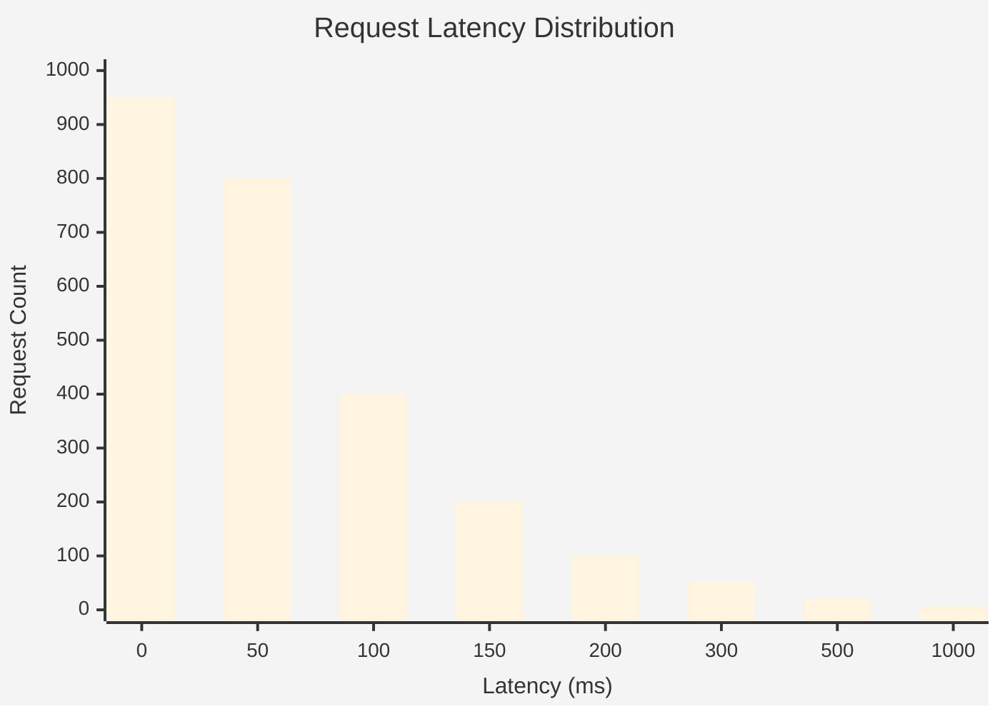
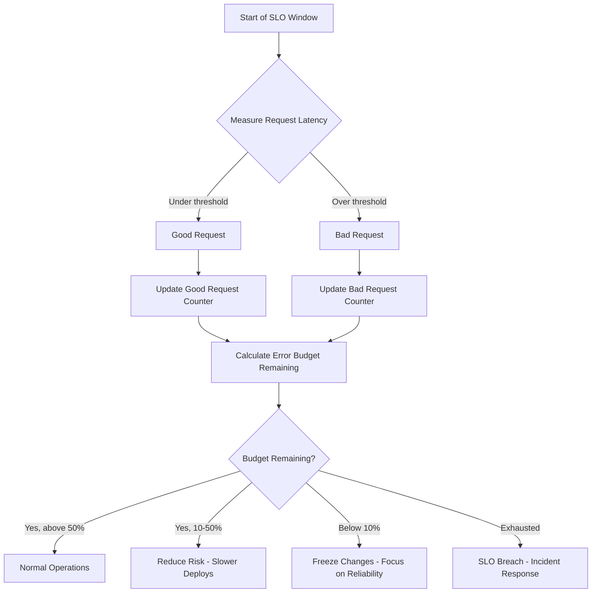
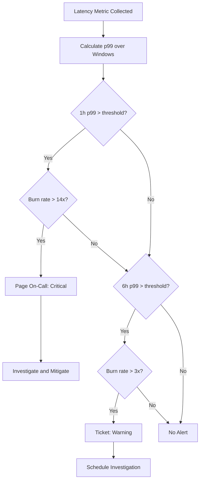

# How to Build Latency Percentile SLOs

Author: [nawazdhandala](https://github.com/nawazdhandala)

Tags: SRE, SLO, Latency, Observability

Description: A practical guide to defining, measuring, and alerting on latency percentile SLOs to ensure consistent user experience.

---

## Why Averages Lie and Percentiles Tell the Truth

When measuring latency, averages can be misleading. A service with an average response time of 100ms might sound healthy, but if 5% of requests take 2 seconds, your users are suffering. Percentiles expose this hidden pain by showing you the distribution of latency across all requests.

Consider this scenario: your checkout API has an average latency of 80ms. Looks great on paper. But the p99 latency is 1.8 seconds. That means 1 in 100 users waits nearly two seconds to complete their purchase. Those are the users who abandon carts, write angry reviews, and churn.

This is why latency percentile SLOs matter. They protect your tail latency and ensure a consistent experience for all users, not just the lucky majority.

---

## Understanding Latency Percentiles

Latency percentiles rank your response times from fastest to slowest. The percentile value tells you what percentage of requests are faster than that threshold.

| Percentile | Meaning | Use Case |
|------------|---------|----------|
| **p50 (median)** | 50% of requests are faster | Baseline user experience |
| **p90** | 90% of requests are faster | Majority experience |
| **p95** | 95% of requests are faster | Good coverage of edge cases |
| **p99** | 99% of requests are faster | Tail latency for critical paths |
| **p99.9** | 99.9% of requests are faster | High-value transactions |

### Choosing the Right Percentile

Your choice depends on your service and user expectations:

- **p50**: Use for internal dashboards and trend analysis. Not suitable for SLOs because it ignores half your traffic.
- **p95**: A balanced choice for most web applications. Catches significant tail latency without being too sensitive to outliers.
- **p99**: Ideal for critical user journeys like checkout, login, or API endpoints where even rare slowdowns hurt.
- **p99.9**: Reserve for payment processing, trading systems, or any path where a single slow request means lost revenue.

---

## Latency Distribution Visualization

The following diagram shows a typical latency distribution with percentile markers:



A more detailed view of how latency accumulates:



---

## Defining Your Latency SLO

A latency SLO has three components:

1. **The SLI (Service Level Indicator)**: The metric you measure
2. **The threshold**: The latency target
3. **The target percentage**: How often you must meet it

### SLO Formula

```
[Percentile] latency of [service/endpoint] will be under [threshold] for [target]% of requests over [time window]
```

### Example SLOs

| Service | SLO Definition |
|---------|----------------|
| Web API | p95 latency under 200ms for 99% of requests over 28 days |
| Checkout | p99 latency under 500ms for 99.5% of requests over 28 days |
| Search | p50 latency under 50ms for 99% of requests over 7 days |

---

## Measuring Latency Percentiles

### Using OpenTelemetry Histograms

OpenTelemetry provides histogram metrics that let you compute percentiles. Here is how to instrument your service:

```javascript
// Node.js example with OpenTelemetry
const { MeterProvider } = require('@opentelemetry/sdk-metrics');
const { OTLPMetricExporter } = require('@opentelemetry/exporter-metrics-otlp-http');

// Create a meter provider with OTLP exporter
const meterProvider = new MeterProvider({
  readers: [
    {
      exporter: new OTLPMetricExporter({
        url: 'https://otel.oneuptime.com/v1/metrics',
      }),
    },
  ],
});

const meter = meterProvider.getMeter('api-service');

// Create a histogram for request latency
// Histograms automatically track distribution for percentile calculation
const requestLatency = meter.createHistogram('http_request_duration_ms', {
  description: 'HTTP request latency in milliseconds',
  unit: 'ms',
  // Define bucket boundaries that match your expected latency distribution
  advice: {
    explicitBucketBoundaries: [5, 10, 25, 50, 100, 200, 500, 1000, 2000, 5000],
  },
});

// Middleware to record latency for each request
function latencyMiddleware(req, res, next) {
  const startTime = Date.now();

  // Record latency when response finishes
  res.on('finish', () => {
    const duration = Date.now() - startTime;

    // Record with attributes for filtering
    requestLatency.record(duration, {
      'http.method': req.method,
      'http.route': req.route?.path || 'unknown',
      'http.status_code': res.statusCode,
    });
  });

  next();
}
```

### Python Example with OpenTelemetry

```python
from opentelemetry import metrics
from opentelemetry.sdk.metrics import MeterProvider
from opentelemetry.sdk.metrics.export import PeriodicExportingMetricReader
from opentelemetry.exporter.otlp.proto.http.metric_exporter import OTLPMetricExporter
import time
from functools import wraps

# Configure the meter provider
exporter = OTLPMetricExporter(endpoint="https://otel.oneuptime.com/v1/metrics")
reader = PeriodicExportingMetricReader(exporter, export_interval_millis=60000)
provider = MeterProvider(metric_readers=[reader])
metrics.set_meter_provider(provider)

meter = metrics.get_meter("api-service")

# Create histogram with explicit bucket boundaries
# Boundaries should cover your expected latency range
request_latency = meter.create_histogram(
    name="http_request_duration_ms",
    description="HTTP request latency in milliseconds",
    unit="ms",
)

def track_latency(endpoint_name):
    """Decorator to track endpoint latency."""
    def decorator(func):
        @wraps(func)
        def wrapper(*args, **kwargs):
            start_time = time.perf_counter()
            try:
                result = func(*args, **kwargs)
                status = "success"
                return result
            except Exception as e:
                status = "error"
                raise
            finally:
                # Calculate duration in milliseconds
                duration_ms = (time.perf_counter() - start_time) * 1000

                # Record to histogram with attributes
                request_latency.record(
                    duration_ms,
                    attributes={
                        "endpoint": endpoint_name,
                        "status": status,
                    }
                )
        return wrapper
    return decorator

# Usage example
@track_latency("checkout")
def process_checkout(order_id):
    # Your checkout logic here
    pass
```

---

## Error Budget Calculation for Latency

Error budgets quantify how much "bad" latency you can tolerate before breaching your SLO. This creates a balance between reliability and velocity.

### The Math

```
Error Budget = (1 - SLO Target) * Total Requests * Time Window
```

### Example Calculation

Given:
- SLO: p99 latency under 500ms for 99.5% of requests
- Time window: 28 days
- Average requests per day: 1,000,000

```
Allowed slow requests = (1 - 0.995) * 1,000,000 * 28
                      = 0.005 * 28,000,000
                      = 140,000 requests over 28 days
                      = 5,000 requests per day
```

You can afford 5,000 requests per day exceeding 500ms at p99 before breaching your SLO.

### Tracking Error Budget Consumption



### Error Budget Burn Rate

Burn rate measures how fast you are consuming your error budget:

```python
def calculate_burn_rate(bad_requests_current_hour, total_requests_current_hour, slo_target, window_hours):
    """
    Calculate error budget burn rate.

    A burn rate of 1.0 means you are consuming budget exactly as planned.
    A burn rate of 2.0 means you will exhaust budget in half the time.
    """
    # Expected error rate based on SLO
    expected_error_rate = 1 - slo_target

    # Actual error rate in current window
    if total_requests_current_hour == 0:
        return 0

    actual_error_rate = bad_requests_current_hour / total_requests_current_hour

    # Burn rate is actual divided by expected
    burn_rate = actual_error_rate / expected_error_rate

    return burn_rate

# Example usage
burn_rate = calculate_burn_rate(
    bad_requests_current_hour=100,    # requests over latency threshold
    total_requests_current_hour=10000,
    slo_target=0.995,                  # 99.5% target
    window_hours=1
)

print(f"Burn rate: {burn_rate:.2f}x")
# If burn_rate > 1, you are consuming budget faster than sustainable
```

---

## Alerting on Latency SLOs

Traditional threshold alerts create noise. SLO-based alerting focuses on user impact and budget consumption.

### Multi-Window, Multi-Burn-Rate Alerts

This approach catches both sudden spikes and slow degradation:

```yaml
# Prometheus alerting rules for latency SLO
groups:
  - name: latency-slo-alerts
    rules:
      # Fast burn alert: catches sudden latency spikes
      # 14.4x burn rate over 1 hour = 2% of 28-day budget in 1 hour
      - alert: LatencySLOFastBurn
        expr: |
          (
            histogram_quantile(0.99, sum(rate(http_request_duration_ms_bucket{job="api"}[1h])) by (le))
            > 500
          )
          and
          (
            sum(rate(http_request_duration_ms_count{job="api"}[1h])) > 100
          )
        for: 2m
        labels:
          severity: critical
        annotations:
          summary: "High p99 latency consuming error budget rapidly"
          description: "p99 latency is above 500ms, burning error budget at 14x normal rate"
          runbook: "https://runbooks.example.com/latency-slo-breach"

      # Slow burn alert: catches gradual degradation
      # 3x burn rate over 6 hours = 1.5% of 28-day budget
      - alert: LatencySLOSlowBurn
        expr: |
          (
            histogram_quantile(0.99, sum(rate(http_request_duration_ms_bucket{job="api"}[6h])) by (le))
            > 500
          )
          and
          (
            histogram_quantile(0.99, sum(rate(http_request_duration_ms_bucket{job="api"}[30m])) by (le))
            > 500
          )
        for: 15m
        labels:
          severity: warning
        annotations:
          summary: "Sustained elevated p99 latency"
          description: "p99 latency has been above 500ms for 6+ hours"

      # Error budget exhaustion warning
      - alert: LatencyErrorBudgetLow
        expr: |
          (
            1 - (
              sum(rate(http_request_duration_ms_bucket{job="api", le="500"}[28d]))
              /
              sum(rate(http_request_duration_ms_count{job="api"}[28d]))
            )
          ) > 0.005 * 0.5
        for: 10m
        labels:
          severity: warning
        annotations:
          summary: "Latency error budget below 50%"
          description: "More than half of the 28-day latency error budget has been consumed"
```

### Alert Flow Diagram



---

## Practical Implementation Checklist

### Step 1: Baseline Your Current Latency

Before setting SLOs, measure your current performance:

```sql
-- ClickHouse query to analyze current latency distribution
SELECT
    quantile(0.50)(duration_ms) as p50,
    quantile(0.90)(duration_ms) as p90,
    quantile(0.95)(duration_ms) as p95,
    quantile(0.99)(duration_ms) as p99,
    quantile(0.999)(duration_ms) as p999
FROM http_requests
WHERE timestamp > now() - INTERVAL 7 DAY
  AND endpoint = '/api/checkout'
```

### Step 2: Set Realistic Targets

Based on your baseline and user expectations:

```javascript
// SLO configuration object
const latencySLOs = {
  checkout: {
    percentile: 'p99',
    thresholdMs: 500,
    target: 0.995,      // 99.5% of requests under threshold
    windowDays: 28,
    description: 'Checkout p99 latency under 500ms for 99.5% of requests'
  },
  search: {
    percentile: 'p95',
    thresholdMs: 200,
    target: 0.99,
    windowDays: 28,
    description: 'Search p95 latency under 200ms for 99% of requests'
  },
  homepage: {
    percentile: 'p50',
    thresholdMs: 100,
    target: 0.99,
    windowDays: 7,
    description: 'Homepage p50 latency under 100ms for 99% of requests'
  }
};
```

### Step 3: Implement Measurement

Ensure consistent instrumentation:

```javascript
// Middleware that captures all the context needed for SLO measurement
function sloMiddleware(req, res, next) {
  const startTime = process.hrtime.bigint();

  res.on('finish', () => {
    const endTime = process.hrtime.bigint();
    const durationMs = Number(endTime - startTime) / 1_000_000;

    // Emit metric with all relevant dimensions
    metrics.recordLatency({
      service: 'api',
      endpoint: req.route?.path || 'unknown',
      method: req.method,
      statusCode: res.statusCode,
      durationMs: durationMs,
      // Include attributes that help identify SLO-relevant traffic
      isAuthenticated: !!req.user,
      customerTier: req.user?.tier || 'anonymous',
    });
  });

  next();
}
```

### Step 4: Build Dashboards

Key visualizations for latency SLOs:

1. **Current percentile values** vs targets
2. **Error budget remaining** as a percentage
3. **Burn rate trend** over the past 7 days
4. **Latency heatmap** showing distribution over time
5. **Top slow endpoints** sorted by error budget consumption

### Step 5: Establish Response Procedures

| Error Budget Status | Action |
|---------------------|--------|
| Above 50% | Normal operations, ship features freely |
| 25-50% | Review recent changes, add monitoring |
| 10-25% | Pause risky deployments, prioritize fixes |
| Below 10% | Feature freeze, all hands on reliability |
| Exhausted | Incident declared, postmortem required |

---

## Common Pitfalls to Avoid

**Pitfall 1: Too many SLOs**

Start with 2-3 SLOs for your most critical user journeys. You can always add more later.

**Pitfall 2: Unrealistic targets**

Setting p99 latency at 50ms when your baseline is 200ms sets you up for failure. Be ambitious but achievable.

**Pitfall 3: Ignoring client-side latency**

Server latency is only part of the story. Consider measuring end-to-end latency from the user perspective when possible.

**Pitfall 4: Not excluding health checks**

Health check endpoints skew your latency data. Filter them out of SLO calculations.

```javascript
// Filter out non-user traffic from SLO calculations
function isUserRequest(req) {
  const excludedPaths = ['/health', '/ready', '/metrics', '/favicon.ico'];
  return !excludedPaths.includes(req.path);
}
```

**Pitfall 5: Alerting on raw percentiles instead of budget**

A single p99 spike is not necessarily a problem. Alert on sustained budget consumption, not momentary blips.

---

## Conclusion

Latency percentile SLOs transform how you think about performance. Instead of chasing arbitrary thresholds, you focus on user experience and make data-driven decisions about reliability vs velocity tradeoffs.

Start with these steps:

1. Instrument your critical endpoints with histograms
2. Baseline your current latency distribution
3. Set achievable SLOs based on user expectations
4. Calculate and track error budgets
5. Configure multi-window burn rate alerts
6. Establish clear response procedures

The goal is not perfection. It is a sustainable balance between shipping features and maintaining the reliability your users deserve.

---

**Related Reading:**

- [18 SRE Metrics Worth Tracking](https://oneuptime.com/blog/post/2025-11-28-sre-metrics-to-track/view)
- [The Five Stages of SRE Maturity](https://oneuptime.com/blog/post/2025-09-01-the-five-stages-of-sre-maturity/view)
- [What is Site Reliability Engineering](https://oneuptime.com/blog/post/2025-11-28-what-is-site-reliability-engineering/view)
