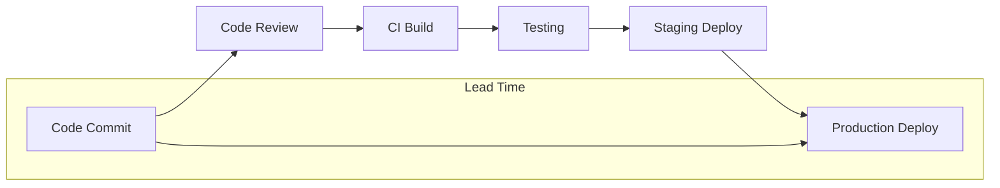
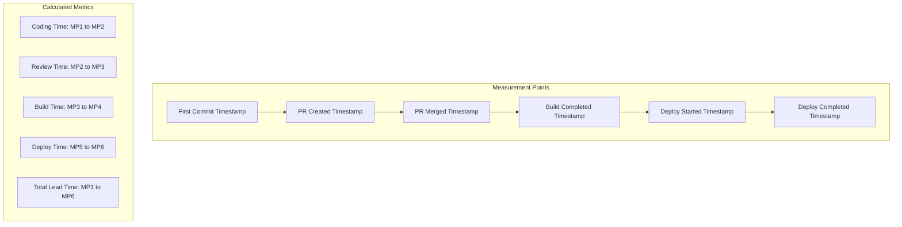
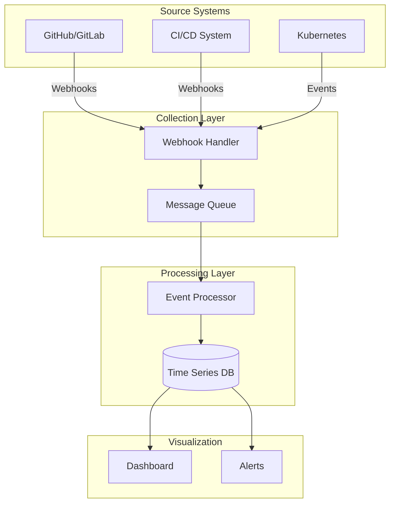
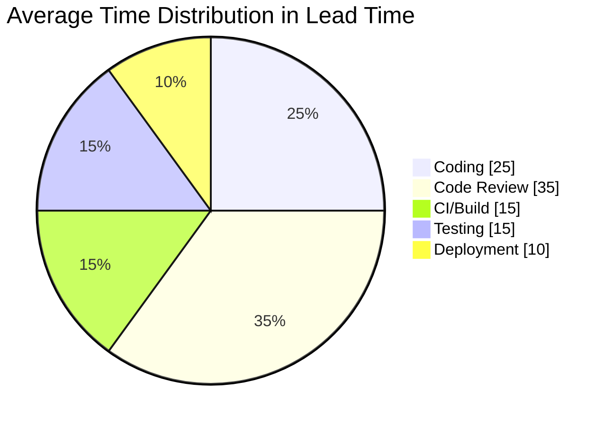
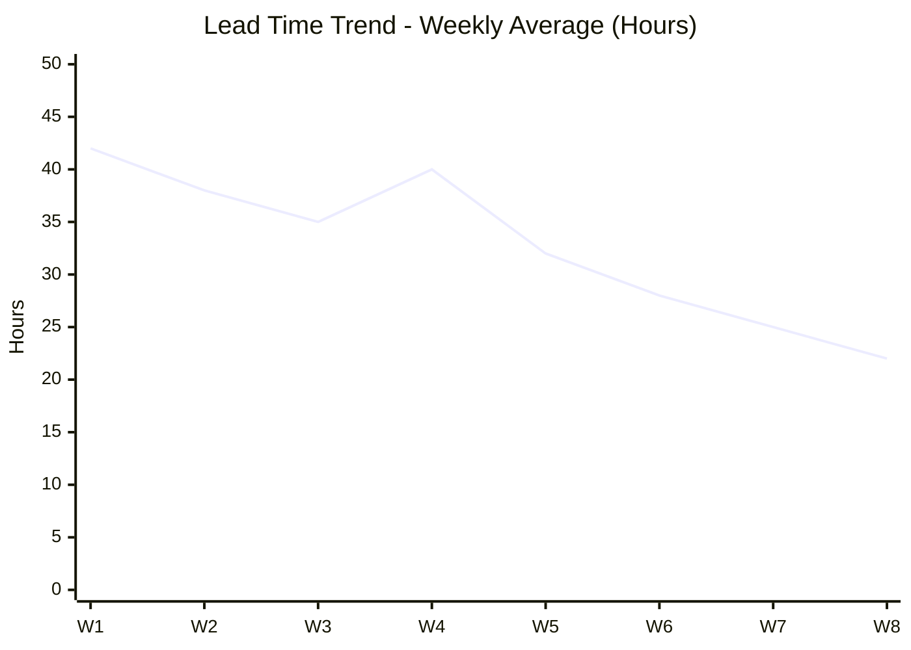
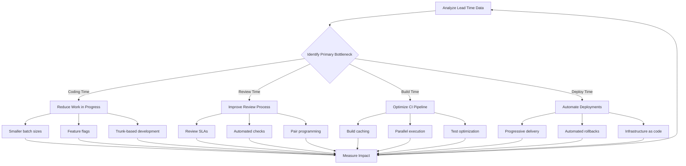

# How to Implement Lead Time Tracking

Author: [nawazdhandala](https://github.com/nawazdhandala)

Tags: DevOps, DORA Metrics, Lead Time, Developer Experience

Description: Learn to implement lead time tracking with commit-to-deploy measurement, bottleneck identification, and trend analysis for delivery optimization.

---

Lead time is one of the four key DORA metrics that measures the time it takes for a commit to reach production. Understanding and optimizing lead time directly impacts your team's ability to deliver value quickly and respond to market demands. In this guide, we will walk through implementing a comprehensive lead time tracking system from scratch.

## What is Lead Time?

Lead time for changes measures the duration between when code is committed and when it is successfully deployed to production. This metric captures the efficiency of your entire delivery pipeline.



The DORA research categorizes teams by their lead time performance:

| Performance Level | Lead Time |
|------------------|-----------|
| Elite | Less than one hour |
| High | One day to one week |
| Medium | One week to one month |
| Low | More than one month |

## Measurement Points in the Delivery Pipeline

To effectively track lead time, you need to capture timestamps at critical points in your delivery process. Here are the key measurement points:



## Data Collection Architecture

### Event-Driven Data Collection

The most effective approach is to collect data through webhooks from your tools. Here is a high-level architecture:



### Setting Up Webhook Handlers

Create a webhook handler service to capture events from your version control and CI/CD systems. The following FastAPI application handles GitHub webhook events for commits, pull requests, and deployments.

```python
# webhook_handler.py
from fastapi import FastAPI, Request, HTTPException
from datetime import datetime
import json
from typing import Optional
from pydantic import BaseModel

app = FastAPI()

class LeadTimeEvent(BaseModel):
    event_type: str
    repository: str
    commit_sha: str
    timestamp: datetime
    metadata: dict

# In-memory store for demonstration - use a proper database in production
events_store = {}

@app.post("/webhooks/github")
async def github_webhook(request: Request):
    """Handle GitHub webhook events for commits, PRs, and deployments."""
    payload = await request.json()
    event_type = request.headers.get("X-GitHub-Event")

    if event_type == "push":
        # Capture first commit timestamp
        for commit in payload.get("commits", []):
            event = LeadTimeEvent(
                event_type="commit",
                repository=payload["repository"]["full_name"],
                commit_sha=commit["id"],
                timestamp=datetime.fromisoformat(
                    commit["timestamp"].replace("Z", "+00:00")
                ),
                metadata={
                    "author": commit["author"]["name"],
                    "message": commit["message"][:100]
                }
            )
            store_event(event)

    elif event_type == "pull_request":
        action = payload.get("action")
        pr = payload.get("pull_request", {})

        if action == "opened":
            event = LeadTimeEvent(
                event_type="pr_opened",
                repository=payload["repository"]["full_name"],
                commit_sha=pr["head"]["sha"],
                timestamp=datetime.fromisoformat(
                    pr["created_at"].replace("Z", "+00:00")
                ),
                metadata={
                    "pr_number": pr["number"],
                    "title": pr["title"][:100]
                }
            )
            store_event(event)

        elif action == "closed" and pr.get("merged"):
            event = LeadTimeEvent(
                event_type="pr_merged",
                repository=payload["repository"]["full_name"],
                commit_sha=pr["merge_commit_sha"],
                timestamp=datetime.fromisoformat(
                    pr["merged_at"].replace("Z", "+00:00")
                ),
                metadata={
                    "pr_number": pr["number"],
                    "base_branch": pr["base"]["ref"]
                }
            )
            store_event(event)

    elif event_type == "deployment_status":
        if payload["deployment_status"]["state"] == "success":
            event = LeadTimeEvent(
                event_type="deployment_success",
                repository=payload["repository"]["full_name"],
                commit_sha=payload["deployment"]["sha"],
                timestamp=datetime.fromisoformat(
                    payload["deployment_status"]["created_at"].replace("Z", "+00:00")
                ),
                metadata={
                    "environment": payload["deployment"]["environment"],
                    "deployment_id": payload["deployment"]["id"]
                }
            )
            store_event(event)

    return {"status": "processed"}

def store_event(event: LeadTimeEvent):
    """Store event in the events store keyed by commit SHA."""
    key = f"{event.repository}:{event.commit_sha}"
    if key not in events_store:
        events_store[key] = []
    events_store[key].append(event.dict())
    print(f"Stored event: {event.event_type} for {key}")
```

### CI/CD Pipeline Integration

Add instrumentation to your CI/CD pipeline to capture build and deployment events. This GitHub Actions workflow demonstrates how to emit timing events at each stage.

```yaml
# .github/workflows/deploy.yml
name: Build and Deploy

on:
  push:
    branches: [main]

jobs:
  build:
    runs-on: ubuntu-latest
    steps:
      - uses: actions/checkout@v4

      - name: Record build start
        run: |
          curl -X POST ${{ secrets.METRICS_ENDPOINT }}/events \
            -H "Content-Type: application/json" \
            -d '{
              "event_type": "build_started",
              "commit_sha": "${{ github.sha }}",
              "repository": "${{ github.repository }}",
              "timestamp": "'$(date -u +%Y-%m-%dT%H:%M:%SZ)'"
            }'

      - name: Build application
        run: |
          npm ci
          npm run build

      - name: Record build complete
        run: |
          curl -X POST ${{ secrets.METRICS_ENDPOINT }}/events \
            -H "Content-Type: application/json" \
            -d '{
              "event_type": "build_completed",
              "commit_sha": "${{ github.sha }}",
              "repository": "${{ github.repository }}",
              "timestamp": "'$(date -u +%Y-%m-%dT%H:%M:%SZ)'"
            }'

      - name: Deploy to production
        run: |
          kubectl apply -f k8s/

      - name: Record deployment complete
        run: |
          curl -X POST ${{ secrets.METRICS_ENDPOINT }}/events \
            -H "Content-Type: application/json" \
            -d '{
              "event_type": "deployment_completed",
              "commit_sha": "${{ github.sha }}",
              "repository": "${{ github.repository }}",
              "timestamp": "'$(date -u +%Y-%m-%dT%H:%M:%SZ)'",
              "environment": "production"
            }'
```

## Lead Time Calculation Methods

### Basic Lead Time Calculator

Here is a Python implementation that calculates lead time and its component phases. The calculator groups events by type and computes durations between key milestones.

```python
# lead_time_calculator.py
from datetime import datetime, timedelta
from typing import List, Dict, Optional
from dataclasses import dataclass
from enum import Enum

class EventType(Enum):
    COMMIT = "commit"
    PR_OPENED = "pr_opened"
    PR_MERGED = "pr_merged"
    BUILD_STARTED = "build_started"
    BUILD_COMPLETED = "build_completed"
    DEPLOYMENT_COMPLETED = "deployment_completed"

@dataclass
class LeadTimeMetrics:
    commit_sha: str
    repository: str
    total_lead_time: timedelta
    coding_time: Optional[timedelta]
    review_time: Optional[timedelta]
    build_time: Optional[timedelta]
    deploy_time: Optional[timedelta]
    first_commit: datetime
    deployment_time: datetime

class LeadTimeCalculator:
    def __init__(self, events: List[Dict]):
        self.events = sorted(events, key=lambda x: x["timestamp"])
        self.events_by_type = self._group_by_type()

    def _group_by_type(self) -> Dict[str, Dict]:
        grouped = {}
        for event in self.events:
            event_type = event["event_type"]
            if event_type not in grouped:
                grouped[event_type] = event
        return grouped

    def calculate(self) -> Optional[LeadTimeMetrics]:
        """Calculate lead time metrics from collected events."""
        commit_event = self.events_by_type.get(EventType.COMMIT.value)
        deploy_event = self.events_by_type.get(
            EventType.DEPLOYMENT_COMPLETED.value
        )

        if not commit_event or not deploy_event:
            return None

        first_commit = self._parse_timestamp(commit_event["timestamp"])
        deployment_time = self._parse_timestamp(deploy_event["timestamp"])

        # Calculate component times
        pr_opened = self.events_by_type.get(EventType.PR_OPENED.value)
        pr_merged = self.events_by_type.get(EventType.PR_MERGED.value)
        build_started = self.events_by_type.get(EventType.BUILD_STARTED.value)
        build_completed = self.events_by_type.get(
            EventType.BUILD_COMPLETED.value
        )

        coding_time = None
        if pr_opened:
            coding_time = (
                self._parse_timestamp(pr_opened["timestamp"]) - first_commit
            )

        review_time = None
        if pr_opened and pr_merged:
            review_time = (
                self._parse_timestamp(pr_merged["timestamp"]) -
                self._parse_timestamp(pr_opened["timestamp"])
            )

        build_time = None
        if build_started and build_completed:
            build_time = (
                self._parse_timestamp(build_completed["timestamp"]) -
                self._parse_timestamp(build_started["timestamp"])
            )

        deploy_time = None
        if build_completed:
            deploy_time = (
                deployment_time -
                self._parse_timestamp(build_completed["timestamp"])
            )

        return LeadTimeMetrics(
            commit_sha=commit_event.get("commit_sha", "unknown"),
            repository=commit_event.get("repository", "unknown"),
            total_lead_time=deployment_time - first_commit,
            coding_time=coding_time,
            review_time=review_time,
            build_time=build_time,
            deploy_time=deploy_time,
            first_commit=first_commit,
            deployment_time=deployment_time
        )

    def _parse_timestamp(self, ts) -> datetime:
        if isinstance(ts, datetime):
            return ts
        return datetime.fromisoformat(ts.replace("Z", "+00:00"))
```

### Aggregating Lead Time Statistics

For meaningful insights, you need to aggregate lead time across multiple deployments. This aggregator computes percentiles and averages for trend analysis.

```python
# lead_time_aggregator.py
from datetime import timedelta
from typing import List
from dataclasses import dataclass
import statistics

@dataclass
class LeadTimeStatistics:
    period_start: str
    period_end: str
    deployment_count: int
    mean_lead_time: timedelta
    median_lead_time: timedelta
    p90_lead_time: timedelta
    p95_lead_time: timedelta
    min_lead_time: timedelta
    max_lead_time: timedelta
    mean_coding_time: timedelta
    mean_review_time: timedelta
    mean_build_time: timedelta

class LeadTimeAggregator:
    def __init__(self, metrics: List[LeadTimeMetrics]):
        self.metrics = metrics

    def calculate_statistics(self) -> LeadTimeStatistics:
        """Calculate aggregate statistics for lead time metrics."""
        if not self.metrics:
            raise ValueError("No metrics to aggregate")

        lead_times = [
            m.total_lead_time.total_seconds() for m in self.metrics
        ]
        coding_times = [
            m.coding_time.total_seconds()
            for m in self.metrics
            if m.coding_time is not None
        ]
        review_times = [
            m.review_time.total_seconds()
            for m in self.metrics
            if m.review_time is not None
        ]
        build_times = [
            m.build_time.total_seconds()
            for m in self.metrics
            if m.build_time is not None
        ]

        sorted_lead_times = sorted(lead_times)

        return LeadTimeStatistics(
            period_start=min(m.first_commit for m in self.metrics).isoformat(),
            period_end=max(
                m.deployment_time for m in self.metrics
            ).isoformat(),
            deployment_count=len(self.metrics),
            mean_lead_time=timedelta(seconds=statistics.mean(lead_times)),
            median_lead_time=timedelta(seconds=statistics.median(lead_times)),
            p90_lead_time=timedelta(
                seconds=self._percentile(sorted_lead_times, 90)
            ),
            p95_lead_time=timedelta(
                seconds=self._percentile(sorted_lead_times, 95)
            ),
            min_lead_time=timedelta(seconds=min(lead_times)),
            max_lead_time=timedelta(seconds=max(lead_times)),
            mean_coding_time=timedelta(
                seconds=statistics.mean(coding_times) if coding_times else 0
            ),
            mean_review_time=timedelta(
                seconds=statistics.mean(review_times) if review_times else 0
            ),
            mean_build_time=timedelta(
                seconds=statistics.mean(build_times) if build_times else 0
            )
        )

    def _percentile(self, sorted_data: List[float], percentile: int) -> float:
        """Calculate percentile from sorted data."""
        index = (len(sorted_data) - 1) * percentile / 100
        lower = int(index)
        upper = lower + 1
        if upper >= len(sorted_data):
            return sorted_data[-1]
        weight = index - lower
        return sorted_data[lower] * (1 - weight) + sorted_data[upper] * weight
```

## Bottleneck Identification

Understanding where time is spent in your pipeline helps identify optimization opportunities. The following diagram shows a typical time distribution:



### Bottleneck Detection Algorithm

This detector analyzes each phase against industry benchmarks and generates actionable recommendations.

```python
# bottleneck_detector.py
from typing import List
from dataclasses import dataclass
from enum import Enum

class Phase(Enum):
    CODING = "coding"
    REVIEW = "review"
    BUILD = "build"
    DEPLOY = "deploy"

@dataclass
class BottleneckAnalysis:
    phase: Phase
    average_duration_hours: float
    percentage_of_total: float
    trend: str  # "increasing", "stable", "decreasing"
    recommendation: str

class BottleneckDetector:
    # Industry benchmarks for elite performers (in hours)
    BENCHMARKS = {
        Phase.CODING: 4.0,
        Phase.REVIEW: 2.0,
        Phase.BUILD: 0.25,
        Phase.DEPLOY: 0.5
    }

    def __init__(self, statistics_history: List[LeadTimeStatistics]):
        self.history = statistics_history

    def analyze(self) -> List[BottleneckAnalysis]:
        """Identify bottlenecks in the delivery pipeline."""
        if not self.history:
            return []

        latest = self.history[-1]
        total_seconds = (
            latest.mean_coding_time.total_seconds() +
            latest.mean_review_time.total_seconds() +
            latest.mean_build_time.total_seconds()
        )

        results = []

        phases_data = [
            (Phase.CODING, latest.mean_coding_time),
            (Phase.REVIEW, latest.mean_review_time),
            (Phase.BUILD, latest.mean_build_time),
        ]

        for phase, duration in phases_data:
            hours = duration.total_seconds() / 3600
            percentage = (
                (duration.total_seconds() / total_seconds * 100)
                if total_seconds > 0 else 0
            )
            trend = self._calculate_trend(phase)
            recommendation = self._generate_recommendation(phase, hours)

            results.append(BottleneckAnalysis(
                phase=phase,
                average_duration_hours=round(hours, 2),
                percentage_of_total=round(percentage, 1),
                trend=trend,
                recommendation=recommendation
            ))

        return sorted(
            results, key=lambda x: x.average_duration_hours, reverse=True
        )

    def _calculate_trend(self, phase: Phase) -> str:
        """Calculate trend for a phase over the history."""
        if len(self.history) < 3:
            return "stable"

        phase_attr_map = {
            Phase.CODING: "mean_coding_time",
            Phase.REVIEW: "mean_review_time",
            Phase.BUILD: "mean_build_time",
        }

        attr = phase_attr_map.get(phase)
        if not attr:
            return "stable"

        recent = [
            getattr(s, attr).total_seconds() for s in self.history[-3:]
        ]

        if recent[-1] > recent[0] * 1.1:
            return "increasing"
        elif recent[-1] < recent[0] * 0.9:
            return "decreasing"
        return "stable"

    def _generate_recommendation(self, phase: Phase, hours: float) -> str:
        """Generate improvement recommendations based on phase duration."""
        benchmark = self.BENCHMARKS.get(phase, 1.0)
        ratio = hours / benchmark

        recommendations = {
            Phase.CODING: {
                "high": "Consider breaking down work into smaller increments. "
                        "Implement feature flags for incremental delivery.",
                "medium": "Review task sizing in sprint planning. "
                          "Encourage smaller, focused commits.",
                "low": "Coding time is within healthy range. "
                       "Maintain current practices."
            },
            Phase.REVIEW: {
                "high": "Implement review SLAs. Consider pair programming to "
                        "reduce async review wait time. Add automated code "
                        "review tools.",
                "medium": "Review team capacity for code reviews. "
                          "Consider rotating review duties.",
                "low": "Review process is efficient. "
                       "Maintain current review practices."
            },
            Phase.BUILD: {
                "high": "Investigate build caching strategies. "
                        "Consider parallelizing build steps. "
                        "Review test suite for slow tests.",
                "medium": "Monitor build times for regression. "
                          "Consider incremental builds.",
                "low": "Build times are optimal. "
                       "Continue monitoring for regression."
            },
            Phase.DEPLOY: {
                "high": "Implement progressive deployment strategies. "
                        "Review deployment automation for manual steps.",
                "medium": "Consider canary deployments to reduce "
                          "verification time.",
                "low": "Deployment process is efficient. "
                       "Maintain current practices."
            }
        }

        if ratio > 2:
            return recommendations[phase]["high"]
        elif ratio > 1:
            return recommendations[phase]["medium"]
        return recommendations[phase]["low"]
```

## Visualization and Dashboards

### Time Series Visualization

Track lead time trends over time to identify patterns and improvements. The following diagram shows a typical weekly trend:



### Building a Dashboard API

This FastAPI endpoint provides dashboard data for lead time visualization. It returns current metrics, trends, phase breakdowns, and identified bottlenecks.

```python
# dashboard_api.py
from fastapi import FastAPI, Query
from typing import List, Optional
from pydantic import BaseModel

app = FastAPI()

class LeadTimeTrend(BaseModel):
    date: str
    mean_hours: float
    median_hours: float
    deployment_count: int

class PhaseDuration(BaseModel):
    phase: str
    duration_hours: float
    percentage: float

class DashboardData(BaseModel):
    current_lead_time_hours: float
    lead_time_trend: str  # "improving", "stable", "degrading"
    weekly_trend: List[LeadTimeTrend]
    phase_breakdown: List[PhaseDuration]
    deployment_frequency: float  # deployments per day
    bottlenecks: List[str]

@app.get("/api/dashboard/lead-time")
async def get_lead_time_dashboard(
    repository: Optional[str] = Query(
        None, description="Filter by repository"
    ),
    days: int = Query(30, description="Number of days to analyze")
) -> DashboardData:
    """Get lead time dashboard data for visualization."""

    # In production, query your database here
    return DashboardData(
        current_lead_time_hours=24.5,
        lead_time_trend="improving",
        weekly_trend=[
            LeadTimeTrend(
                date="2026-01-06",
                mean_hours=32.0,
                median_hours=28.0,
                deployment_count=12
            ),
            LeadTimeTrend(
                date="2026-01-13",
                mean_hours=28.0,
                median_hours=24.0,
                deployment_count=15
            ),
            LeadTimeTrend(
                date="2026-01-20",
                mean_hours=26.0,
                median_hours=22.0,
                deployment_count=18
            ),
            LeadTimeTrend(
                date="2026-01-27",
                mean_hours=24.5,
                median_hours=20.0,
                deployment_count=20
            ),
        ],
        phase_breakdown=[
            PhaseDuration(
                phase="coding", duration_hours=8.0, percentage=32.6
            ),
            PhaseDuration(
                phase="review", duration_hours=10.0, percentage=40.8
            ),
            PhaseDuration(
                phase="build", duration_hours=2.5, percentage=10.2
            ),
            PhaseDuration(
                phase="deploy", duration_hours=4.0, percentage=16.3
            ),
        ],
        deployment_frequency=2.8,
        bottlenecks=[
            "Code review time exceeds benchmark by 2x",
            "Consider implementing review automation"
        ]
    )
```

### React Dashboard Component

This React component renders lead time metrics with interactive charts using Recharts.

```typescript
// LeadTimeDashboard.tsx
import React, { useEffect, useState } from 'react';
import {
  LineChart,
  Line,
  XAxis,
  YAxis,
  CartesianGrid,
  Tooltip,
  Legend,
  PieChart,
  Pie,
  Cell,
  ResponsiveContainer
} from 'recharts';

interface LeadTimeTrend {
  date: string;
  meanHours: number;
  medianHours: number;
  deploymentCount: number;
}

interface PhaseDuration {
  phase: string;
  durationHours: number;
  percentage: number;
}

interface DashboardData {
  currentLeadTimeHours: number;
  leadTimeTrend: string;
  weeklyTrend: LeadTimeTrend[];
  phaseBreakdown: PhaseDuration[];
  deploymentFrequency: number;
  bottlenecks: string[];
}

const COLORS = ['#0088FE', '#00C49F', '#FFBB28', '#FF8042'];

const LeadTimeDashboard: React.FC = () => {
  const [data, setData] = useState<DashboardData | null>(null);
  const [loading, setLoading] = useState(true);

  useEffect(() => {
    fetchDashboardData();
  }, []);

  const fetchDashboardData = async () => {
    try {
      const response = await fetch('/api/dashboard/lead-time?days=30');
      const result = await response.json();
      setData(result);
    } catch (error) {
      console.error('Failed to fetch dashboard data:', error);
    } finally {
      setLoading(false);
    }
  };

  if (loading) return <div>Loading...</div>;
  if (!data) return <div>No data available</div>;

  const getTrendIndicator = (trend: string) => {
    switch (trend) {
      case 'improving':
        return 'Improving';
      case 'degrading':
        return 'Needs Attention';
      default:
        return 'Stable';
    }
  };

  return (
    <div className="dashboard">
      <header className="dashboard-header">
        <h1>Lead Time Metrics</h1>
        <div className="current-metric">
          <span className="value">
            {data.currentLeadTimeHours.toFixed(1)}h
          </span>
          <span className="trend">
            {getTrendIndicator(data.leadTimeTrend)}
          </span>
        </div>
      </header>

      <section className="chart-section">
        <h2>Lead Time Trend</h2>
        <ResponsiveContainer width="100%" height={300}>
          <LineChart data={data.weeklyTrend}>
            <CartesianGrid strokeDasharray="3 3" />
            <XAxis dataKey="date" />
            <YAxis
              label={{
                value: 'Hours',
                angle: -90,
                position: 'insideLeft'
              }}
            />
            <Tooltip />
            <Legend />
            <Line
              type="monotone"
              dataKey="meanHours"
              stroke="#8884d8"
              name="Mean Lead Time"
            />
            <Line
              type="monotone"
              dataKey="medianHours"
              stroke="#82ca9d"
              name="Median Lead Time"
            />
          </LineChart>
        </ResponsiveContainer>
      </section>

      <section className="chart-section">
        <h2>Time Distribution by Phase</h2>
        <ResponsiveContainer width="100%" height={300}>
          <PieChart>
            <Pie
              data={data.phaseBreakdown}
              dataKey="durationHours"
              nameKey="phase"
              cx="50%"
              cy="50%"
              outerRadius={100}
              label={({ phase, percentage }) =>
                `${phase}: ${percentage.toFixed(1)}%`
              }
            >
              {data.phaseBreakdown.map((entry, index) => (
                <Cell
                  key={entry.phase}
                  fill={COLORS[index % COLORS.length]}
                />
              ))}
            </Pie>
            <Tooltip />
          </PieChart>
        </ResponsiveContainer>
      </section>

      <section className="bottlenecks">
        <h2>Identified Bottlenecks</h2>
        <ul>
          {data.bottlenecks.map((bottleneck, index) => (
            <li key={index}>{bottleneck}</li>
          ))}
        </ul>
      </section>
    </div>
  );
};

export default LeadTimeDashboard;
```

## Improvement Strategies

### Strategy Framework

Based on your lead time analysis, implement targeted improvements using this decision framework:



### Implementation Priority Matrix

| Bottleneck | Quick Wins | Medium Term | Strategic |
|------------|------------|-------------|-----------|
| Coding Time | Task breakdown, WIP limits | Feature flags | Architecture refactoring |
| Review Time | Review SLAs, CODEOWNERS | Automated reviews | Pair programming culture |
| Build Time | Dependency caching | Test parallelization | Monorepo tooling |
| Deploy Time | Automated approvals | Canary releases | Platform engineering |

### Setting Up Automated Alerts

This alert manager monitors lead time metrics and notifies your team when thresholds are exceeded.

```python
# alerts.py
from dataclasses import dataclass
from typing import List, Callable
from datetime import timedelta

@dataclass
class AlertRule:
    name: str
    condition: Callable[[LeadTimeStatistics], bool]
    message_template: str
    severity: str  # "info", "warning", "critical"

class LeadTimeAlertManager:
    def __init__(self, notification_handler: Callable):
        self.notification_handler = notification_handler
        self.rules: List[AlertRule] = []
        self._setup_default_rules()

    def _setup_default_rules(self):
        """Set up default alerting rules."""
        self.rules = [
            AlertRule(
                name="lead_time_regression",
                condition=lambda s: s.median_lead_time > timedelta(hours=48),
                message_template=(
                    "Lead time has exceeded 48 hours "
                    "(current: {median_hours:.1f}h)"
                ),
                severity="warning"
            ),
            AlertRule(
                name="lead_time_critical",
                condition=lambda s: s.median_lead_time > timedelta(hours=96),
                message_template=(
                    "CRITICAL: Lead time has exceeded 96 hours "
                    "(current: {median_hours:.1f}h)"
                ),
                severity="critical"
            ),
            AlertRule(
                name="review_bottleneck",
                condition=lambda s: s.mean_review_time > timedelta(hours=24),
                message_template=(
                    "Code review is taking longer than 24 hours on average"
                ),
                severity="warning"
            ),
            AlertRule(
                name="build_degradation",
                condition=lambda s: s.mean_build_time > timedelta(minutes=30),
                message_template="Build times have exceeded 30 minutes",
                severity="info"
            ),
        ]

    async def evaluate(self, statistics: LeadTimeStatistics):
        """Evaluate all rules against current statistics."""
        triggered_alerts = []

        for rule in self.rules:
            if rule.condition(statistics):
                message = rule.message_template.format(
                    median_hours=(
                        statistics.median_lead_time.total_seconds() / 3600
                    ),
                    mean_hours=(
                        statistics.mean_lead_time.total_seconds() / 3600
                    ),
                    deployment_count=statistics.deployment_count
                )
                triggered_alerts.append({
                    "rule": rule.name,
                    "severity": rule.severity,
                    "message": message
                })

        if triggered_alerts:
            await self.notification_handler(triggered_alerts)

        return triggered_alerts
```

## Database Schema for Persistent Storage

For production deployments, store lead time events in a relational database. This PostgreSQL schema supports efficient querying and aggregation.

```sql
-- PostgreSQL schema for lead time tracking

CREATE TABLE lead_time_events (
    id UUID PRIMARY KEY DEFAULT gen_random_uuid(),
    commit_sha VARCHAR(40) NOT NULL,
    repository VARCHAR(255) NOT NULL,
    event_type VARCHAR(50) NOT NULL,
    timestamp TIMESTAMPTZ NOT NULL,
    metadata JSONB,
    created_at TIMESTAMPTZ DEFAULT NOW()
);

CREATE INDEX idx_commit_sha ON lead_time_events(commit_sha);
CREATE INDEX idx_repository_timestamp
    ON lead_time_events(repository, timestamp);
CREATE INDEX idx_event_type ON lead_time_events(event_type);

CREATE TABLE lead_time_metrics (
    id UUID PRIMARY KEY DEFAULT gen_random_uuid(),
    commit_sha VARCHAR(40) NOT NULL,
    repository VARCHAR(255) NOT NULL,
    first_commit_at TIMESTAMPTZ NOT NULL,
    deployed_at TIMESTAMPTZ NOT NULL,
    total_lead_time_seconds INTEGER NOT NULL,
    coding_time_seconds INTEGER,
    review_time_seconds INTEGER,
    build_time_seconds INTEGER,
    deploy_time_seconds INTEGER,
    created_at TIMESTAMPTZ DEFAULT NOW(),
    UNIQUE (commit_sha, repository)
);

CREATE INDEX idx_repository_deployed
    ON lead_time_metrics(repository, deployed_at);

-- View for weekly aggregations
CREATE VIEW weekly_lead_time_stats AS
SELECT
    repository,
    DATE_TRUNC('week', deployed_at) as week,
    COUNT(*) as deployment_count,
    AVG(total_lead_time_seconds) / 3600 as mean_lead_time_hours,
    PERCENTILE_CONT(0.5) WITHIN GROUP (
        ORDER BY total_lead_time_seconds
    ) / 3600 as median_lead_time_hours,
    PERCENTILE_CONT(0.9) WITHIN GROUP (
        ORDER BY total_lead_time_seconds
    ) / 3600 as p90_lead_time_hours
FROM lead_time_metrics
GROUP BY repository, DATE_TRUNC('week', deployed_at)
ORDER BY week DESC;
```

## Getting Started Checklist

Follow this sequence to implement lead time tracking in your organization:

**Week 1: Instrument commits**
- Set up webhook handlers for your source control
- Start capturing commit timestamps and metadata
- Verify data is flowing correctly

**Week 2: Instrument deployments**
- Add deployment events to your CI/CD pipeline
- Ensure you capture which commits are in each deployment
- Link deployments to the correct commits

**Week 3: Calculate and store**
- Implement lead time calculation logic
- Store records for historical analysis
- Emit metrics to your observability platform

**Week 4: Visualize and alert**
- Build dashboards showing lead time trends
- Set up alerts for regressions
- Share metrics with engineering leadership

**Ongoing: Improve**
- Analyze bottlenecks using pipeline breakdowns
- Run experiments to reduce lead time
- Celebrate improvements and investigate regressions

## Conclusion

Implementing lead time tracking provides valuable insights into your software delivery performance. By following this guide, you can:

1. **Capture accurate data** through webhook integrations with your VCS and CI/CD systems
2. **Calculate meaningful metrics** including total lead time and phase-specific durations
3. **Identify bottlenecks** using automated analysis and benchmarking
4. **Visualize trends** through dashboards and time-series charts
5. **Drive improvements** with data-driven decision making and automated alerts

Remember that lead time is just one of the four DORA metrics. For a complete picture of your delivery performance, combine lead time tracking with deployment frequency, change failure rate, and mean time to recovery measurements.

Start with basic event collection, iterate on your measurement approach, and gradually add sophistication as your team's needs evolve. The goal is not just to measure, but to enable continuous improvement in your delivery process.
