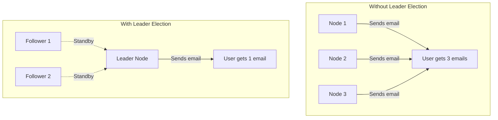
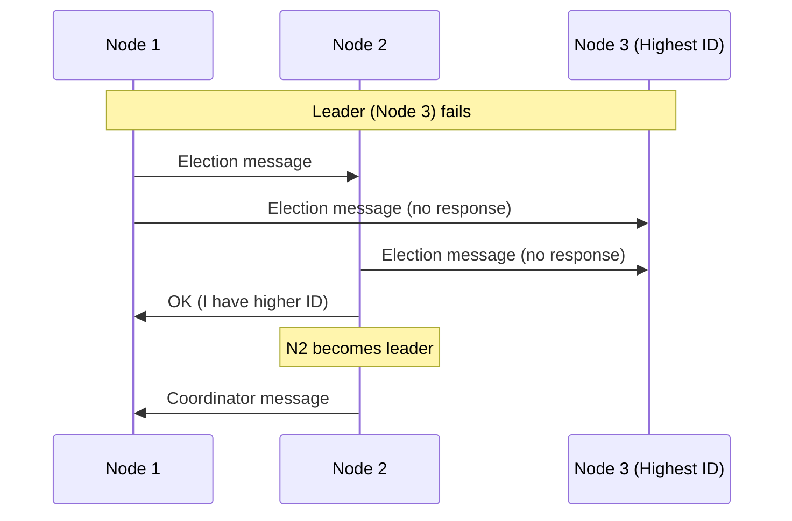
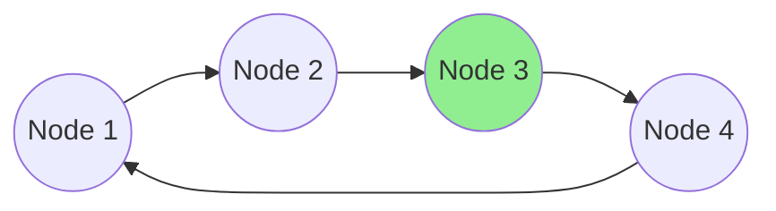
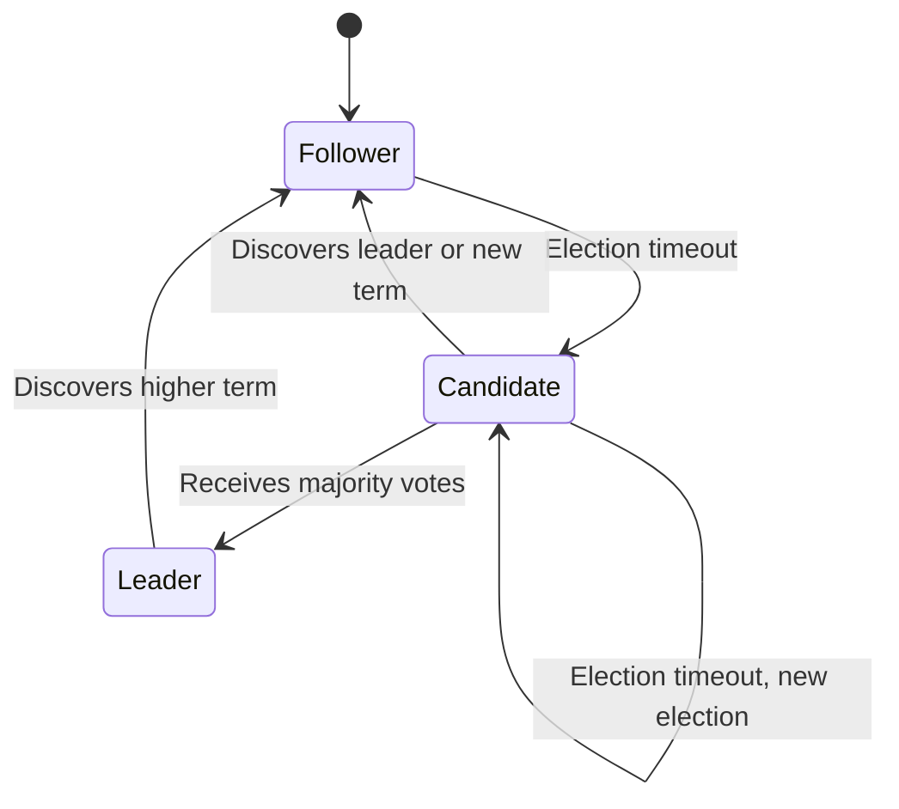
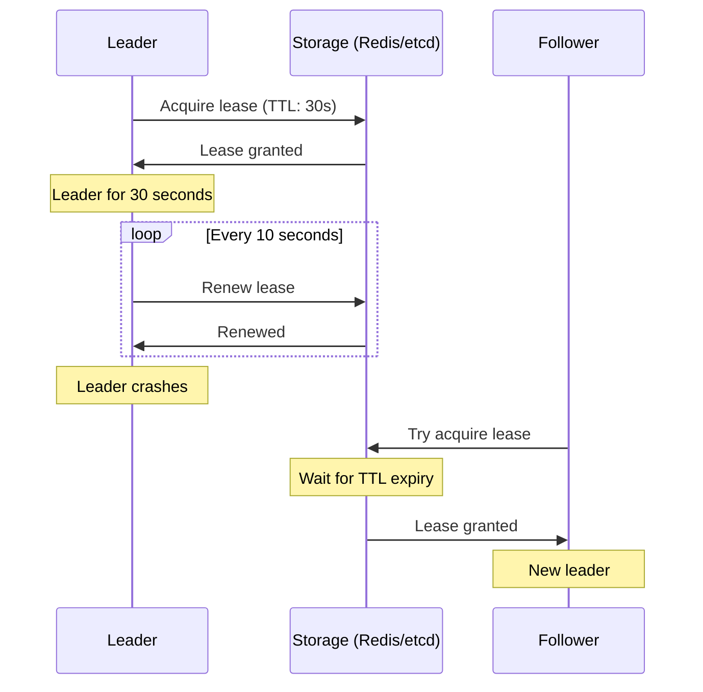
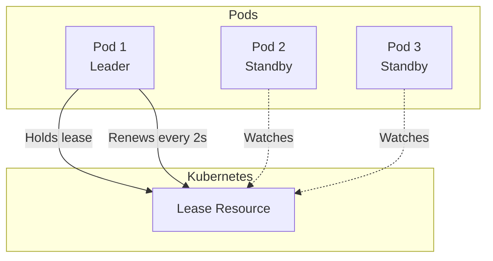
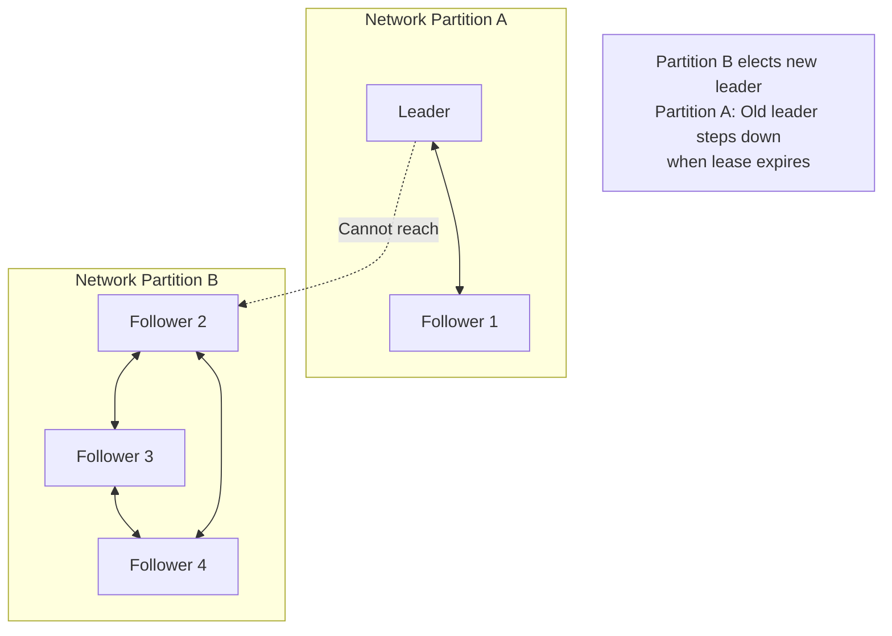

# How to Create Leader Election Patterns

Author: [nawazdhandala](https://github.com/nawazdhandala)

Tags: Distributed Systems, Leader Election, High Availability, Consensus

Description: Learn patterns for implementing leader election in distributed systems.

---

In distributed systems, leader election is the process of designating a single node as the coordinator for some shared resource or task. When multiple instances of a service run simultaneously, you often need exactly one to perform certain operations - sending notifications, running scheduled jobs, or coordinating state changes. Leader election solves this problem.

## Why Leader Election Matters

Without leader election, you face two dangerous scenarios:

1. **Split-brain**: Multiple nodes think they're the leader, causing duplicate work or data corruption
2. **No leader**: All nodes wait for someone else, causing work to stall



## Leader Election Algorithms

Several algorithms exist for leader election, each with different trade-offs.

### Bully Algorithm

The simplest approach: the node with the highest ID wins. When a node detects the leader is down, it initiates an election.



**Pros**: Simple to understand and implement
**Cons**: High message overhead, not partition-tolerant

### Ring Algorithm

Nodes are arranged in a logical ring. Election messages travel around the ring, collecting node IDs. The highest ID becomes leader.



**Pros**: Lower message complexity than Bully
**Cons**: Slow when ring is large, sensitive to node failures

### Raft Consensus Algorithm

Raft is the gold standard for leader election in production systems. It guarantees that at most one leader exists at any time through term numbers and majority voting.



## Raft-Based Election Implementation

Here's a practical implementation of Raft-style leader election in TypeScript:

```typescript
import { EventEmitter } from 'events';

enum NodeState {
    FOLLOWER = 'follower',
    CANDIDATE = 'candidate',
    LEADER = 'leader'
}

interface VoteRequest {
    term: number;
    candidateId: string;
}

interface VoteResponse {
    term: number;
    voteGranted: boolean;
}

class RaftNode extends EventEmitter {
    private nodeId: string;
    private state: NodeState = NodeState.FOLLOWER;
    private currentTerm: number = 0;
    private votedFor: string | null = null;
    private leaderId: string | null = null;
    private electionTimeout: NodeJS.Timeout | null = null;
    private heartbeatInterval: NodeJS.Timeout | null = null;
    private peers: Map<string, RaftNode> = new Map();

    // Randomize election timeout to prevent split votes
    private readonly minElectionTimeout = 150;
    private readonly maxElectionTimeout = 300;
    private readonly heartbeatPeriod = 50;

    constructor(nodeId: string) {
        super();
        this.nodeId = nodeId;
    }

    public start(): void {
        this.resetElectionTimeout();
        console.log(`[${this.nodeId}] Started as follower`);
    }

    public addPeer(peer: RaftNode): void {
        this.peers.set(peer.nodeId, peer);
    }

    private resetElectionTimeout(): void {
        if (this.electionTimeout) {
            clearTimeout(this.electionTimeout);
        }

        const timeout = this.minElectionTimeout +
            Math.random() * (this.maxElectionTimeout - this.minElectionTimeout);

        this.electionTimeout = setTimeout(() => {
            this.startElection();
        }, timeout);
    }

    private startElection(): void {
        this.state = NodeState.CANDIDATE;
        this.currentTerm++;
        this.votedFor = this.nodeId;

        console.log(`[${this.nodeId}] Starting election for term ${this.currentTerm}`);

        let votesReceived = 1; // Vote for self
        const votesNeeded = Math.floor(this.peers.size / 2) + 1;

        const voteRequest: VoteRequest = {
            term: this.currentTerm,
            candidateId: this.nodeId
        };

        // Request votes from all peers
        for (const [peerId, peer] of this.peers) {
            const response = peer.handleVoteRequest(voteRequest);

            if (response.term > this.currentTerm) {
                // Discovered higher term, revert to follower
                this.currentTerm = response.term;
                this.state = NodeState.FOLLOWER;
                this.votedFor = null;
                this.resetElectionTimeout();
                return;
            }

            if (response.voteGranted) {
                votesReceived++;
                console.log(`[${this.nodeId}] Received vote from ${peerId}`);
            }
        }

        if (votesReceived >= votesNeeded && this.state === NodeState.CANDIDATE) {
            this.becomeLeader();
        } else {
            // Election failed, reset timeout for next attempt
            this.resetElectionTimeout();
        }
    }

    public handleVoteRequest(request: VoteRequest): VoteResponse {
        // If request term is higher, update our term
        if (request.term > this.currentTerm) {
            this.currentTerm = request.term;
            this.state = NodeState.FOLLOWER;
            this.votedFor = null;
        }

        // Grant vote if we haven't voted in this term
        const voteGranted = request.term >= this.currentTerm &&
            (this.votedFor === null || this.votedFor === request.candidateId);

        if (voteGranted) {
            this.votedFor = request.candidateId;
            this.resetElectionTimeout();
        }

        return {
            term: this.currentTerm,
            voteGranted
        };
    }

    private becomeLeader(): void {
        this.state = NodeState.LEADER;
        this.leaderId = this.nodeId;

        console.log(`[${this.nodeId}] Became leader for term ${this.currentTerm}`);
        this.emit('leader', this.nodeId);

        // Clear election timeout
        if (this.electionTimeout) {
            clearTimeout(this.electionTimeout);
        }

        // Start sending heartbeats
        this.sendHeartbeats();
        this.heartbeatInterval = setInterval(() => {
            this.sendHeartbeats();
        }, this.heartbeatPeriod);
    }

    private sendHeartbeats(): void {
        for (const [peerId, peer] of this.peers) {
            peer.handleHeartbeat(this.currentTerm, this.nodeId);
        }
    }

    public handleHeartbeat(term: number, leaderId: string): void {
        if (term >= this.currentTerm) {
            this.currentTerm = term;
            this.state = NodeState.FOLLOWER;
            this.leaderId = leaderId;
            this.votedFor = null;

            // Stop heartbeat if we were leader
            if (this.heartbeatInterval) {
                clearInterval(this.heartbeatInterval);
                this.heartbeatInterval = null;
            }

            this.resetElectionTimeout();
        }
    }

    public isLeader(): boolean {
        return this.state === NodeState.LEADER;
    }

    public getLeaderId(): string | null {
        return this.leaderId;
    }
}

// Usage example
const nodes = [
    new RaftNode('node-1'),
    new RaftNode('node-2'),
    new RaftNode('node-3')
];

// Connect all nodes to each other
for (const node of nodes) {
    for (const peer of nodes) {
        if (node !== peer) {
            node.addPeer(peer);
        }
    }
}

// Start all nodes
nodes.forEach(node => {
    node.on('leader', (leaderId) => {
        console.log(`New leader elected: ${leaderId}`);
    });
    node.start();
});
```

## Lease-Based Leader Election

Leases provide a simpler approach than full consensus. A node acquires a time-limited lease, and must renew it before expiration to remain leader.



### Redis-Based Lease Implementation

```typescript
import Redis from 'ioredis';

interface LeaderElectionConfig {
    key: string;
    ttlSeconds: number;
    renewIntervalMs: number;
    nodeId: string;
}

class RedisLeaderElection {
    private redis: Redis;
    private config: LeaderElectionConfig;
    private isLeader: boolean = false;
    private renewInterval: NodeJS.Timeout | null = null;
    private onBecomeLeader?: () => void;
    private onLoseLeadership?: () => void;

    constructor(redis: Redis, config: LeaderElectionConfig) {
        this.redis = redis;
        this.config = config;
    }

    public async start(
        onBecomeLeader: () => void,
        onLoseLeadership: () => void
    ): Promise<void> {
        this.onBecomeLeader = onBecomeLeader;
        this.onLoseLeadership = onLoseLeadership;

        await this.tryAcquireLease();

        // Periodically try to acquire or renew lease
        this.renewInterval = setInterval(async () => {
            await this.tryAcquireLease();
        }, this.config.renewIntervalMs);
    }

    public async stop(): Promise<void> {
        if (this.renewInterval) {
            clearInterval(this.renewInterval);
        }

        if (this.isLeader) {
            // Release the lease
            await this.releaseLease();
        }
    }

    private async tryAcquireLease(): Promise<boolean> {
        const { key, ttlSeconds, nodeId } = this.config;

        // Try to set the key only if it doesn't exist (NX) with expiry (EX)
        const acquired = await this.redis.set(
            key,
            nodeId,
            'EX',
            ttlSeconds,
            'NX'
        );

        if (acquired === 'OK') {
            if (!this.isLeader) {
                console.log(`[${nodeId}] Acquired leadership`);
                this.isLeader = true;
                this.onBecomeLeader?.();
            }
            return true;
        }

        // Check if we already hold the lease
        const currentHolder = await this.redis.get(key);

        if (currentHolder === nodeId) {
            // Renew our lease
            await this.redis.expire(key, ttlSeconds);
            return true;
        }

        // Someone else is leader
        if (this.isLeader) {
            console.log(`[${nodeId}] Lost leadership to ${currentHolder}`);
            this.isLeader = false;
            this.onLoseLeadership?.();
        }

        return false;
    }

    private async releaseLease(): Promise<void> {
        const { key, nodeId } = this.config;

        // Only delete if we own the key (using Lua script for atomicity)
        const script = `
            if redis.call("get", KEYS[1]) == ARGV[1] then
                return redis.call("del", KEYS[1])
            else
                return 0
            end
        `;

        await this.redis.eval(script, 1, key, nodeId);
        this.isLeader = false;
        console.log(`[${nodeId}] Released leadership`);
    }

    public checkIsLeader(): boolean {
        return this.isLeader;
    }
}

// Usage example
async function main() {
    const redis = new Redis({ host: 'localhost', port: 6379 });

    const election = new RedisLeaderElection(redis, {
        key: 'myapp:leader',
        ttlSeconds: 30,
        renewIntervalMs: 10000,
        nodeId: `node-${process.pid}`
    });

    await election.start(
        () => {
            console.log('I am now the leader!');
            // Start leader-only tasks
        },
        () => {
            console.log('I am no longer the leader');
            // Stop leader-only tasks
        }
    );

    // Your application logic here
    setInterval(() => {
        if (election.checkIsLeader()) {
            console.log('Performing leader duties...');
        }
    }, 5000);
}
```

## Kubernetes Leader Election

Kubernetes provides built-in leader election through its coordination API. This is the recommended approach for applications running in Kubernetes.



### Using the Kubernetes Client Library

```typescript
import * as k8s from '@kubernetes/client-node';

interface LeaderElectionConfig {
    leaseName: string;
    namespace: string;
    identity: string;
    leaseDurationSeconds: number;
    renewDeadlineSeconds: number;
    retryPeriodSeconds: number;
}

class KubernetesLeaderElection {
    private coordinationApi: k8s.CoordinationV1Api;
    private config: LeaderElectionConfig;
    private isLeader: boolean = false;
    private running: boolean = false;
    private onStartLeading?: () => void;
    private onStopLeading?: () => void;

    constructor(config: LeaderElectionConfig) {
        const kc = new k8s.KubeConfig();
        kc.loadFromCluster(); // Use in-cluster config
        this.coordinationApi = kc.makeApiClient(k8s.CoordinationV1Api);
        this.config = config;
    }

    public async start(
        onStartLeading: () => void,
        onStopLeading: () => void
    ): Promise<void> {
        this.onStartLeading = onStartLeading;
        this.onStopLeading = onStopLeading;
        this.running = true;

        while (this.running) {
            try {
                await this.acquireOrRenew();
            } catch (error) {
                console.error('Leader election error:', error);
                if (this.isLeader) {
                    this.isLeader = false;
                    this.onStopLeading?.();
                }
            }

            await this.sleep(this.config.retryPeriodSeconds * 1000);
        }
    }

    public stop(): void {
        this.running = false;
        if (this.isLeader) {
            this.isLeader = false;
            this.onStopLeading?.();
        }
    }

    private async acquireOrRenew(): Promise<void> {
        const { leaseName, namespace, identity, leaseDurationSeconds } = this.config;

        try {
            // Try to get existing lease
            const { body: lease } = await this.coordinationApi.readNamespacedLease(
                leaseName,
                namespace
            );

            const now = new Date();
            const renewTime = lease.spec?.renewTime
                ? new Date(lease.spec.renewTime)
                : new Date(0);
            const leaseDuration = (lease.spec?.leaseDurationSeconds || 0) * 1000;

            // Check if lease has expired
            if (now.getTime() - renewTime.getTime() > leaseDuration) {
                // Lease expired, try to acquire
                await this.tryAcquire(lease);
            } else if (lease.spec?.holderIdentity === identity) {
                // We hold the lease, renew it
                await this.renew(lease);
            } else {
                // Someone else holds a valid lease
                if (this.isLeader) {
                    console.log(`Lost leadership to ${lease.spec?.holderIdentity}`);
                    this.isLeader = false;
                    this.onStopLeading?.();
                }
            }
        } catch (error: any) {
            if (error.statusCode === 404) {
                // Lease doesn't exist, create it
                await this.createLease();
            } else {
                throw error;
            }
        }
    }

    private async createLease(): Promise<void> {
        const { leaseName, namespace, identity, leaseDurationSeconds } = this.config;

        const lease: k8s.V1Lease = {
            apiVersion: 'coordination.k8s.io/v1',
            kind: 'Lease',
            metadata: {
                name: leaseName,
                namespace: namespace
            },
            spec: {
                holderIdentity: identity,
                leaseDurationSeconds: leaseDurationSeconds,
                acquireTime: new Date().toISOString() as any,
                renewTime: new Date().toISOString() as any
            }
        };

        await this.coordinationApi.createNamespacedLease(namespace, lease);
        console.log(`Created lease and became leader: ${identity}`);
        this.isLeader = true;
        this.onStartLeading?.();
    }

    private async tryAcquire(existingLease: k8s.V1Lease): Promise<void> {
        const { namespace, identity, leaseDurationSeconds } = this.config;

        existingLease.spec = {
            ...existingLease.spec,
            holderIdentity: identity,
            leaseDurationSeconds: leaseDurationSeconds,
            acquireTime: new Date().toISOString() as any,
            renewTime: new Date().toISOString() as any
        };

        await this.coordinationApi.replaceNamespacedLease(
            existingLease.metadata!.name!,
            namespace,
            existingLease
        );

        console.log(`Acquired leadership: ${identity}`);
        this.isLeader = true;
        this.onStartLeading?.();
    }

    private async renew(existingLease: k8s.V1Lease): Promise<void> {
        const { namespace } = this.config;

        existingLease.spec!.renewTime = new Date().toISOString() as any;

        await this.coordinationApi.replaceNamespacedLease(
            existingLease.metadata!.name!,
            namespace,
            existingLease
        );
    }

    private sleep(ms: number): Promise<void> {
        return new Promise(resolve => setTimeout(resolve, ms));
    }

    public checkIsLeader(): boolean {
        return this.isLeader;
    }
}

// Kubernetes Deployment YAML
/*
apiVersion: apps/v1
kind: Deployment
metadata:
  name: my-app
spec:
  replicas: 3
  selector:
    matchLabels:
      app: my-app
  template:
    metadata:
      labels:
        app: my-app
    spec:
      serviceAccountName: my-app-leader-election
      containers:
        - name: my-app
          image: my-app:latest
          env:
            - name: POD_NAME
              valueFrom:
                fieldRef:
                  fieldPath: metadata.name
---
apiVersion: v1
kind: ServiceAccount
metadata:
  name: my-app-leader-election
---
apiVersion: rbac.authorization.k8s.io/v1
kind: Role
metadata:
  name: leader-election
rules:
  - apiGroups: ["coordination.k8s.io"]
    resources: ["leases"]
    verbs: ["get", "create", "update"]
---
apiVersion: rbac.authorization.k8s.io/v1
kind: RoleBinding
metadata:
  name: leader-election
roleRef:
  apiGroup: rbac.authorization.k8s.io
  kind: Role
  name: leader-election
subjects:
  - kind: ServiceAccount
    name: my-app-leader-election
*/
```

## Database-Backed Leader Election

For applications that already use a database, you can implement leader election using database locks.

### PostgreSQL Advisory Locks

```typescript
import { Pool, PoolClient } from 'pg';

class PostgresLeaderElection {
    private pool: Pool;
    private lockId: number;
    private nodeId: string;
    private client: PoolClient | null = null;
    private isLeader: boolean = false;
    private running: boolean = false;

    constructor(pool: Pool, lockId: number, nodeId: string) {
        this.pool = pool;
        this.lockId = lockId;
        this.nodeId = nodeId;
    }

    public async start(
        onBecomeLeader: () => void,
        onLoseLeadership: () => void
    ): Promise<void> {
        this.running = true;

        while (this.running) {
            try {
                if (!this.isLeader) {
                    const acquired = await this.tryAcquireLock();
                    if (acquired) {
                        console.log(`[${this.nodeId}] Acquired leadership`);
                        this.isLeader = true;
                        onBecomeLeader();
                    }
                } else {
                    // Verify we still hold the lock
                    const stillHolding = await this.verifyLock();
                    if (!stillHolding) {
                        console.log(`[${this.nodeId}] Lost leadership`);
                        this.isLeader = false;
                        onLoseLeadership();
                    }
                }
            } catch (error) {
                console.error('Leader election error:', error);
                if (this.isLeader) {
                    this.isLeader = false;
                    onLoseLeadership();
                }
                await this.releaseLock();
            }

            await this.sleep(1000);
        }
    }

    public async stop(): Promise<void> {
        this.running = false;
        await this.releaseLock();
    }

    private async tryAcquireLock(): Promise<boolean> {
        // Get a dedicated connection for the lock
        this.client = await this.pool.connect();

        // Try to acquire advisory lock (non-blocking)
        const result = await this.client.query(
            'SELECT pg_try_advisory_lock($1) as acquired',
            [this.lockId]
        );

        if (result.rows[0].acquired) {
            return true;
        }

        // Didn't get the lock, release the connection
        this.client.release();
        this.client = null;
        return false;
    }

    private async verifyLock(): Promise<boolean> {
        if (!this.client) return false;

        try {
            // Check if we still hold the lock
            const result = await this.client.query(
                `SELECT pg_advisory_locks.granted
                 FROM pg_advisory_locks
                 WHERE pg_advisory_locks.objid = $1
                 AND pg_advisory_locks.pid = pg_backend_pid()`,
                [this.lockId]
            );
            return result.rows.length > 0;
        } catch {
            return false;
        }
    }

    private async releaseLock(): Promise<void> {
        if (this.client) {
            try {
                await this.client.query(
                    'SELECT pg_advisory_unlock($1)',
                    [this.lockId]
                );
            } finally {
                this.client.release();
                this.client = null;
            }
        }
    }

    private sleep(ms: number): Promise<void> {
        return new Promise(resolve => setTimeout(resolve, ms));
    }

    public checkIsLeader(): boolean {
        return this.isLeader;
    }
}

// Alternative: Table-based leader election with TTL
/*
CREATE TABLE leader_election (
    lock_name VARCHAR(255) PRIMARY KEY,
    holder_id VARCHAR(255) NOT NULL,
    acquired_at TIMESTAMP NOT NULL,
    expires_at TIMESTAMP NOT NULL
);

-- Acquire or renew leadership
INSERT INTO leader_election (lock_name, holder_id, acquired_at, expires_at)
VALUES ('my-service', 'node-1', NOW(), NOW() + INTERVAL '30 seconds')
ON CONFLICT (lock_name) DO UPDATE
SET holder_id = EXCLUDED.holder_id,
    acquired_at = NOW(),
    expires_at = NOW() + INTERVAL '30 seconds'
WHERE leader_election.expires_at < NOW()
   OR leader_election.holder_id = EXCLUDED.holder_id;
*/
```

### etcd-Based Leader Election

etcd provides native support for distributed locks and leader election.

```typescript
import { Etcd3, Lease } from 'etcd3';

class EtcdLeaderElection {
    private client: Etcd3;
    private lease: Lease | null = null;
    private key: string;
    private nodeId: string;
    private ttlSeconds: number;
    private isLeader: boolean = false;

    constructor(
        endpoints: string[],
        key: string,
        nodeId: string,
        ttlSeconds: number = 10
    ) {
        this.client = new Etcd3({ hosts: endpoints });
        this.key = key;
        this.nodeId = nodeId;
        this.ttlSeconds = ttlSeconds;
    }

    public async start(
        onBecomeLeader: () => void,
        onLoseLeadership: () => void
    ): Promise<void> {
        // Create a lease that automatically expires
        this.lease = this.client.lease(this.ttlSeconds);

        // Handle lease loss
        this.lease.on('lost', () => {
            console.log(`[${this.nodeId}] Lease lost`);
            if (this.isLeader) {
                this.isLeader = false;
                onLoseLeadership();
            }
        });

        // Try to acquire leadership
        await this.campaign(onBecomeLeader, onLoseLeadership);
    }

    private async campaign(
        onBecomeLeader: () => void,
        onLoseLeadership: () => void
    ): Promise<void> {
        while (true) {
            try {
                // Try to create the key with our lease
                // This will fail if the key already exists
                await this.client.if(this.key, 'Create', '==', 0)
                    .then(
                        this.client.put(this.key)
                            .value(this.nodeId)
                            .lease(this.lease!)
                    )
                    .commit();

                console.log(`[${this.nodeId}] Became leader`);
                this.isLeader = true;
                onBecomeLeader();

                // Watch for key deletion (leadership loss)
                const watcher = await this.client.watch()
                    .key(this.key)
                    .create();

                for await (const event of watcher) {
                    if (event.type === 'delete') {
                        console.log(`[${this.nodeId}] Lost leadership`);
                        this.isLeader = false;
                        onLoseLeadership();
                        break;
                    }
                }
            } catch (error: any) {
                // Key already exists, someone else is leader
                // Wait for the key to be deleted
                const watcher = await this.client.watch()
                    .key(this.key)
                    .create();

                for await (const event of watcher) {
                    if (event.type === 'delete') {
                        // Leader left, try to acquire
                        break;
                    }
                }
            }
        }
    }

    public async stop(): Promise<void> {
        if (this.lease) {
            await this.lease.revoke();
        }
        this.client.close();
    }

    public checkIsLeader(): boolean {
        return this.isLeader;
    }
}
```

## Failure Handling

Leader election must handle various failure scenarios gracefully.

### Network Partitions



### Implementing Graceful Degradation

```typescript
interface LeaderElectionOptions {
    maxConsecutiveFailures: number;
    failureBackoffMs: number;
    onDemoted?: () => void;
}

class ResilientLeaderElection {
    private consecutiveFailures: number = 0;
    private maxFailures: number;
    private backoffMs: number;
    private isLeader: boolean = false;
    private demoted: boolean = false;
    private onDemoted?: () => void;

    constructor(options: LeaderElectionOptions) {
        this.maxFailures = options.maxConsecutiveFailures;
        this.backoffMs = options.failureBackoffMs;
        this.onDemoted = options.onDemoted;
    }

    public async renewLeadership(renewFn: () => Promise<boolean>): Promise<boolean> {
        try {
            const success = await renewFn();

            if (success) {
                this.consecutiveFailures = 0;
                this.demoted = false;
                return true;
            }

            return this.handleFailure();
        } catch (error) {
            console.error('Leadership renewal failed:', error);
            return this.handleFailure();
        }
    }

    private handleFailure(): boolean {
        this.consecutiveFailures++;

        if (this.consecutiveFailures >= this.maxFailures) {
            if (!this.demoted) {
                console.warn(
                    `Leadership renewal failed ${this.consecutiveFailures} times. ` +
                    `Voluntarily stepping down to prevent split-brain.`
                );
                this.demoted = true;
                this.isLeader = false;
                this.onDemoted?.();
            }
            return false;
        }

        // Exponential backoff
        const backoff = this.backoffMs * Math.pow(2, this.consecutiveFailures - 1);
        console.warn(
            `Leadership renewal failed. Retry ${this.consecutiveFailures}/${this.maxFailures} ` +
            `in ${backoff}ms`
        );

        return this.isLeader; // Tentatively remain leader during retry window
    }

    // Fencing token to prevent stale leaders from making changes
    public getFencingToken(): number {
        // In a real implementation, this would come from the lease/lock mechanism
        // and monotonically increase with each leadership acquisition
        return Date.now();
    }
}

// Using fencing tokens to prevent stale writes
class FencedStorage {
    private currentFencingToken: number = 0;

    public async write(
        key: string,
        value: string,
        fencingToken: number
    ): Promise<boolean> {
        if (fencingToken < this.currentFencingToken) {
            console.warn(
                `Rejecting write from stale leader. ` +
                `Token ${fencingToken} < current ${this.currentFencingToken}`
            );
            return false;
        }

        this.currentFencingToken = fencingToken;
        // Perform the actual write
        console.log(`Writing ${key}=${value} with token ${fencingToken}`);
        return true;
    }
}
```

### Health Check Integration

```typescript
import express from 'express';

class LeaderAwareHealthCheck {
    private leaderElection: any; // Your leader election implementation
    private app: express.Application;

    constructor(leaderElection: any) {
        this.leaderElection = leaderElection;
        this.app = express();
        this.setupEndpoints();
    }

    private setupEndpoints(): void {
        // Basic liveness - am I running?
        this.app.get('/health/live', (req, res) => {
            res.status(200).json({ status: 'alive' });
        });

        // Readiness - can I serve traffic?
        this.app.get('/health/ready', (req, res) => {
            // Non-leaders can still serve read traffic
            res.status(200).json({
                status: 'ready',
                isLeader: this.leaderElection.checkIsLeader()
            });
        });

        // Leader check - am I the leader?
        this.app.get('/health/leader', (req, res) => {
            if (this.leaderElection.checkIsLeader()) {
                res.status(200).json({
                    status: 'leader',
                    nodeId: process.env.POD_NAME
                });
            } else {
                res.status(503).json({
                    status: 'follower',
                    nodeId: process.env.POD_NAME
                });
            }
        });
    }

    public start(port: number): void {
        this.app.listen(port, () => {
            console.log(`Health check server running on port ${port}`);
        });
    }
}

// Kubernetes Service for leader-only traffic
/*
apiVersion: v1
kind: Service
metadata:
  name: my-app-leader
spec:
  selector:
    app: my-app
  ports:
    - port: 8080
---
# Use a separate service that routes only to the leader
# by combining with a custom health check
apiVersion: v1
kind: Endpoints
metadata:
  name: my-app-leader
# Endpoints are managed by a controller that watches
# the /health/leader endpoint
*/
```

## Best Practices

### 1. Always Use Fencing Tokens

Prevent stale leaders from corrupting data:

```typescript
// Bad: No protection against stale leader
async function processJob(job: Job): Promise<void> {
    if (isLeader) {
        await database.update(job.id, { status: 'completed' });
    }
}

// Good: Fencing token prevents stale writes
async function processJob(job: Job, fencingToken: number): Promise<void> {
    if (isLeader) {
        await database.update(
            job.id,
            { status: 'completed' },
            { fencingToken } // Storage rejects if token is stale
        );
    }
}
```

### 2. Implement Graceful Leadership Transfer

```typescript
class GracefulLeaderElection {
    private draining: boolean = false;

    public async prepareToResign(): Promise<void> {
        this.draining = true;

        // Stop accepting new work
        console.log('Stopping new work acceptance...');

        // Wait for in-flight work to complete
        await this.waitForInFlightWork();

        // Release leadership
        await this.releaseLease();

        console.log('Leadership transferred gracefully');
    }

    private async waitForInFlightWork(): Promise<void> {
        // Implementation depends on your workload
        const maxWaitMs = 30000;
        const startTime = Date.now();

        while (this.hasInFlightWork() && Date.now() - startTime < maxWaitMs) {
            await this.sleep(100);
        }
    }

    private hasInFlightWork(): boolean {
        // Check your work queues
        return false;
    }

    private async releaseLease(): Promise<void> {
        // Release the lease/lock
    }

    private sleep(ms: number): Promise<void> {
        return new Promise(resolve => setTimeout(resolve, ms));
    }
}
```

### 3. Monitor Leader Election

```typescript
import { Counter, Gauge, Histogram } from 'prom-client';

const leaderElectionMetrics = {
    isLeader: new Gauge({
        name: 'leader_election_is_leader',
        help: 'Whether this instance is the leader (1) or not (0)',
        labelNames: ['service']
    }),

    electionCount: new Counter({
        name: 'leader_election_total',
        help: 'Total number of leader elections',
        labelNames: ['service', 'result']
    }),

    leadershipDuration: new Histogram({
        name: 'leader_election_leadership_duration_seconds',
        help: 'How long leadership was held',
        labelNames: ['service'],
        buckets: [1, 5, 10, 30, 60, 300, 600, 1800, 3600]
    }),

    renewalLatency: new Histogram({
        name: 'leader_election_renewal_latency_seconds',
        help: 'Latency of leadership renewal attempts',
        labelNames: ['service'],
        buckets: [0.001, 0.005, 0.01, 0.05, 0.1, 0.5, 1]
    })
};

// Update metrics in your leader election implementation
function onBecomeLeader(): void {
    leaderElectionMetrics.isLeader.set({ service: 'my-service' }, 1);
    leaderElectionMetrics.electionCount.inc({ service: 'my-service', result: 'won' });
}

function onLoseLeadership(durationSeconds: number): void {
    leaderElectionMetrics.isLeader.set({ service: 'my-service' }, 0);
    leaderElectionMetrics.leadershipDuration.observe(
        { service: 'my-service' },
        durationSeconds
    );
}
```

## Choosing the Right Pattern

| Pattern | Best For | Trade-offs |
|---------|----------|------------|
| **Raft-based** | Strong consistency needs, custom implementations | Complex, requires odd number of nodes |
| **Lease-based (Redis)** | Simple setups, already using Redis | Depends on Redis availability |
| **Kubernetes native** | K8s workloads | Only works in Kubernetes |
| **Database locks** | Existing database dependency | Database becomes SPOF |
| **etcd** | High availability, native support | Additional infrastructure |

---

Leader election is foundational to building reliable distributed systems. Start with the simplest pattern that meets your needs - often lease-based with Redis or Kubernetes native if you're already on K8s. Add complexity only when you need stronger guarantees. Remember: the best leader election is the one that fails gracefully and recovers automatically.
