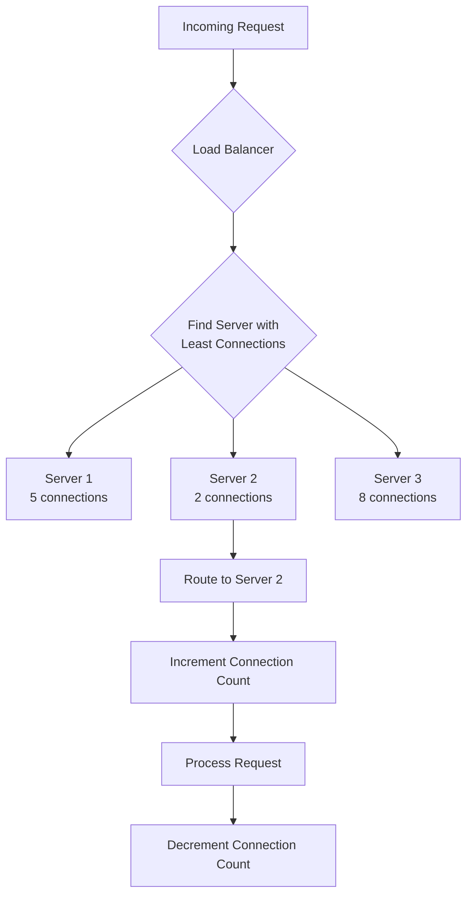
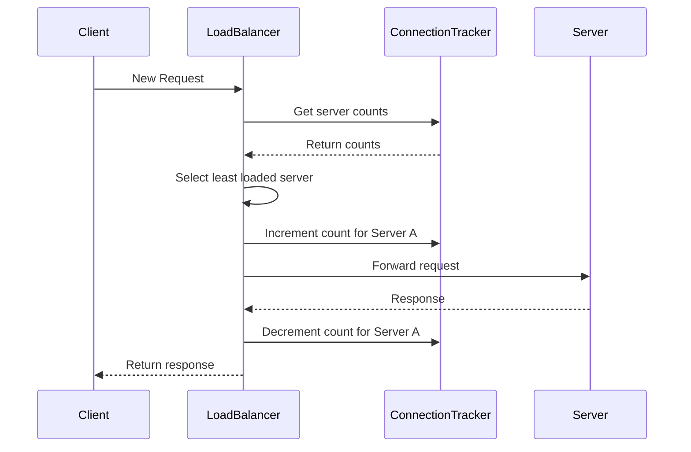
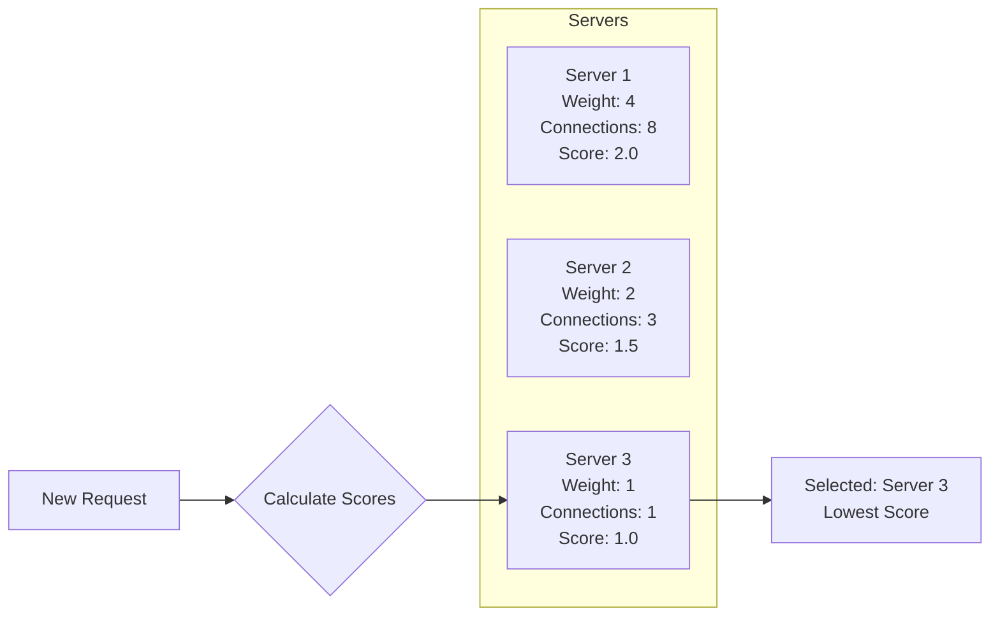
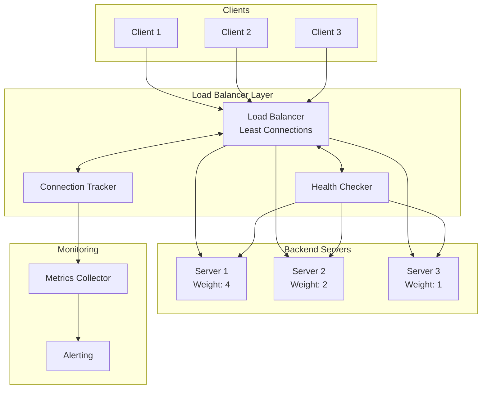

# How to Build Least Connections Algorithm

Author: [nawazdhandala](https://github.com/nawazdhandala)

Tags: Load Balancing, Algorithms, Infrastructure, SRE

Description: Learn how to implement the least connections load balancing algorithm for optimal distribution.

---

Load balancing is a critical component of modern distributed systems. Among the various algorithms available, the **Least Connections** algorithm stands out for its ability to dynamically distribute traffic based on real-time server load. In this post, we will explore how to build a least connections load balancer from scratch, implement connection tracking, extend it to weighted least connections, and configure it in production environments using NGINX and HAProxy.

## What is the Least Connections Algorithm?

The Least Connections algorithm routes incoming requests to the server with the fewest active connections. Unlike round-robin, which distributes requests evenly without considering server load, least connections accounts for the actual workload each server is handling.



## Why Use Least Connections?

Consider these scenarios where least connections excels:

1. **Variable Request Duration**: When some requests take longer than others, servers can become unevenly loaded with round-robin.
2. **Heterogeneous Backends**: When servers have different processing capabilities.
3. **Long-lived Connections**: WebSocket connections or streaming endpoints that maintain persistent connections.

## Implementing a Basic Least Connections Load Balancer

Let us start with a simple implementation in Python that demonstrates the core concepts.

### Step 1: Define the Server Class

```python
# server.py
# Represents a backend server with connection tracking

from dataclasses import dataclass
from threading import Lock

@dataclass
class Server:
    """
    Represents a backend server in the load balancer pool.

    Attributes:
        host: The hostname or IP address of the server
        port: The port number the server is listening on
        connections: Current number of active connections
        healthy: Whether the server is healthy and can accept requests
    """
    host: str
    port: int
    connections: int = 0
    healthy: bool = True
    _lock: Lock = None

    def __post_init__(self):
        # Initialize the lock for thread-safe connection counting
        self._lock = Lock()

    def increment_connections(self):
        """
        Thread-safe increment of active connection count.
        Called when a new request is routed to this server.
        """
        with self._lock:
            self.connections += 1

    def decrement_connections(self):
        """
        Thread-safe decrement of active connection count.
        Called when a request completes or connection closes.
        """
        with self._lock:
            if self.connections > 0:
                self.connections -= 1

    @property
    def address(self) -> str:
        """Returns the full address of the server."""
        return f"{self.host}:{self.port}"
```

### Step 2: Implement the Load Balancer

```python
# load_balancer.py
# Least Connections Load Balancer Implementation

from typing import List, Optional
from threading import Lock
from server import Server

class LeastConnectionsLoadBalancer:
    """
    A load balancer that routes requests to the server with
    the fewest active connections.

    This implementation is thread-safe and supports:
    - Dynamic server pool management
    - Health checking integration
    - Connection tracking
    """

    def __init__(self, servers: List[Server] = None):
        """
        Initialize the load balancer with an optional list of servers.

        Args:
            servers: Initial list of backend servers
        """
        self.servers: List[Server] = servers or []
        self._lock = Lock()

    def add_server(self, server: Server) -> None:
        """
        Add a new server to the pool.

        Args:
            server: The server to add to the load balancer pool
        """
        with self._lock:
            self.servers.append(server)

    def remove_server(self, server: Server) -> None:
        """
        Remove a server from the pool.

        Args:
            server: The server to remove from the load balancer pool
        """
        with self._lock:
            self.servers = [s for s in self.servers if s.address != server.address]

    def get_server(self) -> Optional[Server]:
        """
        Select the server with the least active connections.

        Returns:
            The server with minimum connections, or None if no healthy servers
        """
        with self._lock:
            # Filter to only healthy servers
            healthy_servers = [s for s in self.servers if s.healthy]

            if not healthy_servers:
                return None

            # Find the server with minimum connections
            # In case of tie, the first server found wins
            min_server = min(healthy_servers, key=lambda s: s.connections)

            return min_server

    def handle_request(self, request_handler):
        """
        Route a request to the least loaded server.

        Args:
            request_handler: A callable that processes the request
                            and takes the server as an argument

        Returns:
            The result of the request_handler
        """
        server = self.get_server()

        if server is None:
            raise Exception("No healthy servers available")

        # Increment connection count before processing
        server.increment_connections()

        try:
            # Process the request
            result = request_handler(server)
            return result
        finally:
            # Always decrement connection count when done
            server.decrement_connections()
```

### Step 3: Example Usage

```python
# main.py
# Demonstration of the Least Connections Load Balancer

import time
import random
from concurrent.futures import ThreadPoolExecutor
from server import Server
from load_balancer import LeastConnectionsLoadBalancer

def simulate_request(server: Server) -> str:
    """
    Simulate a request that takes variable time to complete.

    Args:
        server: The server handling the request

    Returns:
        A string describing which server handled the request
    """
    # Simulate variable processing time (100ms to 500ms)
    processing_time = random.uniform(0.1, 0.5)
    time.sleep(processing_time)
    return f"Request handled by {server.address} in {processing_time:.2f}s"

def main():
    # Create backend servers
    servers = [
        Server(host="192.168.1.10", port=8080),
        Server(host="192.168.1.11", port=8080),
        Server(host="192.168.1.12", port=8080),
    ]

    # Initialize load balancer
    lb = LeastConnectionsLoadBalancer(servers)

    # Simulate concurrent requests
    with ThreadPoolExecutor(max_workers=20) as executor:
        futures = []

        for i in range(100):
            future = executor.submit(lb.handle_request, simulate_request)
            futures.append(future)

        # Collect results
        for future in futures:
            print(future.result())

    # Print final connection counts (should all be 0)
    print("\nFinal connection counts:")
    for server in servers:
        print(f"  {server.address}: {server.connections} connections")

if __name__ == "__main__":
    main()
```

## Connection Tracking Architecture

Accurate connection tracking is essential for the least connections algorithm to work correctly. Here is a detailed look at how connection tracking flows through the system:



### Implementing a Connection Tracker

```python
# connection_tracker.py
# Centralized connection tracking with metrics

from typing import Dict
from threading import Lock
from dataclasses import dataclass, field
from datetime import datetime
import time

@dataclass
class ConnectionMetrics:
    """
    Tracks detailed metrics for a single server.
    """
    current_connections: int = 0
    total_connections: int = 0
    total_requests: int = 0
    failed_requests: int = 0
    total_response_time: float = 0.0
    last_request_time: datetime = None

    @property
    def average_response_time(self) -> float:
        """Calculate the average response time for this server."""
        if self.total_requests == 0:
            return 0.0
        return self.total_response_time / self.total_requests

    @property
    def error_rate(self) -> float:
        """Calculate the error rate for this server."""
        if self.total_requests == 0:
            return 0.0
        return self.failed_requests / self.total_requests

class ConnectionTracker:
    """
    Centralized connection tracker that maintains metrics
    for all servers in the pool.

    Features:
    - Thread-safe connection counting
    - Response time tracking
    - Error rate calculation
    - Historical metrics
    """

    def __init__(self):
        self._metrics: Dict[str, ConnectionMetrics] = {}
        self._lock = Lock()

    def register_server(self, server_address: str) -> None:
        """
        Register a new server with the tracker.

        Args:
            server_address: The address of the server to track
        """
        with self._lock:
            if server_address not in self._metrics:
                self._metrics[server_address] = ConnectionMetrics()

    def get_connections(self, server_address: str) -> int:
        """
        Get the current connection count for a server.

        Args:
            server_address: The address of the server

        Returns:
            Current active connection count
        """
        with self._lock:
            if server_address in self._metrics:
                return self._metrics[server_address].current_connections
            return 0

    def start_request(self, server_address: str) -> float:
        """
        Record the start of a new request to a server.

        Args:
            server_address: The address of the target server

        Returns:
            The start timestamp for response time calculation
        """
        with self._lock:
            if server_address not in self._metrics:
                self._metrics[server_address] = ConnectionMetrics()

            metrics = self._metrics[server_address]
            metrics.current_connections += 1
            metrics.total_connections += 1
            metrics.last_request_time = datetime.now()

            return time.time()

    def end_request(self, server_address: str, start_time: float,
                    success: bool = True) -> None:
        """
        Record the completion of a request.

        Args:
            server_address: The address of the server
            start_time: The timestamp when the request started
            success: Whether the request completed successfully
        """
        with self._lock:
            if server_address in self._metrics:
                metrics = self._metrics[server_address]
                metrics.current_connections = max(0, metrics.current_connections - 1)
                metrics.total_requests += 1
                metrics.total_response_time += time.time() - start_time

                if not success:
                    metrics.failed_requests += 1

    def get_all_metrics(self) -> Dict[str, ConnectionMetrics]:
        """
        Get metrics for all tracked servers.

        Returns:
            Dictionary mapping server addresses to their metrics
        """
        with self._lock:
            return dict(self._metrics)
```

## Weighted Least Connections

In real-world scenarios, servers often have different capacities. A server with 16 CPU cores can handle more connections than one with 4 cores. Weighted Least Connections addresses this by assigning weights to servers.

The algorithm calculates an effective load score:

```
score = active_connections / weight
```

The server with the lowest score receives the next request.



### Implementing Weighted Least Connections

```python
# weighted_load_balancer.py
# Weighted Least Connections Implementation

from dataclasses import dataclass
from typing import List, Optional
from threading import Lock

@dataclass
class WeightedServer:
    """
    Represents a backend server with a weight factor.

    The weight represents the relative capacity of the server.
    Higher weights indicate servers that can handle more load.

    Attributes:
        host: Server hostname or IP
        port: Server port number
        weight: Capacity weight (higher = more capacity)
        connections: Current active connections
        healthy: Server health status
    """
    host: str
    port: int
    weight: int = 1  # Default weight of 1
    connections: int = 0
    healthy: bool = True
    _lock: Lock = None

    def __post_init__(self):
        self._lock = Lock()
        # Ensure weight is at least 1 to avoid division by zero
        if self.weight < 1:
            self.weight = 1

    @property
    def score(self) -> float:
        """
        Calculate the weighted score for this server.
        Lower scores indicate better candidates for new requests.

        Returns:
            The ratio of connections to weight
        """
        return self.connections / self.weight

    @property
    def address(self) -> str:
        return f"{self.host}:{self.port}"

    def increment_connections(self):
        with self._lock:
            self.connections += 1

    def decrement_connections(self):
        with self._lock:
            if self.connections > 0:
                self.connections -= 1

class WeightedLeastConnectionsLoadBalancer:
    """
    Load balancer using the Weighted Least Connections algorithm.

    This implementation considers both the number of active connections
    and the weight (capacity) of each server when making routing decisions.
    """

    def __init__(self, servers: List[WeightedServer] = None):
        self.servers: List[WeightedServer] = servers or []
        self._lock = Lock()

    def add_server(self, server: WeightedServer) -> None:
        """Add a server to the pool."""
        with self._lock:
            self.servers.append(server)

    def get_server(self) -> Optional[WeightedServer]:
        """
        Select the server with the lowest weighted score.

        The score is calculated as: connections / weight
        A server with weight=4 and 8 connections has the same score
        as a server with weight=2 and 4 connections (both score 2.0).

        Returns:
            The server with the lowest score, or None if no healthy servers
        """
        with self._lock:
            healthy_servers = [s for s in self.servers if s.healthy]

            if not healthy_servers:
                return None

            # Find server with minimum score (connections/weight ratio)
            return min(healthy_servers, key=lambda s: s.score)

    def handle_request(self, request_handler):
        """Route a request using weighted least connections."""
        server = self.get_server()

        if server is None:
            raise Exception("No healthy servers available")

        server.increment_connections()

        try:
            return request_handler(server)
        finally:
            server.decrement_connections()

    def get_status(self) -> str:
        """
        Get a formatted status of all servers.

        Returns:
            A string showing each server's connections, weight, and score
        """
        lines = ["Server Status:"]
        for server in self.servers:
            status = "healthy" if server.healthy else "unhealthy"
            lines.append(
                f"  {server.address}: {server.connections} connections, "
                f"weight={server.weight}, score={server.score:.2f} ({status})"
            )
        return "\n".join(lines)
```

### Example: Weighted Load Balancer in Action

```python
# weighted_example.py
# Demonstration of Weighted Least Connections

from weighted_load_balancer import WeightedServer, WeightedLeastConnectionsLoadBalancer

def main():
    # Create servers with different weights based on capacity
    # A weight of 4 means the server can handle 4x the load of weight 1
    servers = [
        WeightedServer(host="high-capacity.example.com", port=8080, weight=4),
        WeightedServer(host="medium-capacity.example.com", port=8080, weight=2),
        WeightedServer(host="low-capacity.example.com", port=8080, weight=1),
    ]

    lb = WeightedLeastConnectionsLoadBalancer(servers)

    # Simulate some existing connections
    servers[0].connections = 8   # Score: 8/4 = 2.0
    servers[1].connections = 3   # Score: 3/2 = 1.5
    servers[2].connections = 1   # Score: 1/1 = 1.0

    print("Current status:")
    print(lb.get_status())

    # Get next server - should be low-capacity (lowest score)
    next_server = lb.get_server()
    print(f"\nNext request goes to: {next_server.address}")

    # After adding a connection to low-capacity
    servers[2].connections = 2   # New score: 2/1 = 2.0

    print("\nAfter adding connection to low-capacity server:")
    print(lb.get_status())

    # Now medium-capacity should be selected
    next_server = lb.get_server()
    print(f"\nNext request goes to: {next_server.address}")

if __name__ == "__main__":
    main()
```

## Production Configuration: NGINX

NGINX supports least connections out of the box. Here is how to configure it:

### Basic Least Connections

```nginx
# /etc/nginx/nginx.conf
# Basic Least Connections Configuration

http {
    # Define the upstream server group
    upstream backend {
        # Enable least connections algorithm
        least_conn;

        # Backend servers
        server 192.168.1.10:8080;
        server 192.168.1.11:8080;
        server 192.168.1.12:8080;
    }

    server {
        listen 80;
        server_name example.com;

        location / {
            # Forward requests to the backend group
            proxy_pass http://backend;

            # Important headers for proper connection tracking
            proxy_http_version 1.1;
            proxy_set_header Connection "";
            proxy_set_header Host $host;
            proxy_set_header X-Real-IP $remote_addr;
            proxy_set_header X-Forwarded-For $proxy_add_x_forwarded_for;
        }
    }
}
```

### Weighted Least Connections in NGINX

```nginx
# /etc/nginx/conf.d/weighted-backend.conf
# Weighted Least Connections Configuration

upstream weighted_backend {
    # Enable least connections algorithm
    least_conn;

    # Servers with different weights
    # Weight determines relative capacity
    server 192.168.1.10:8080 weight=4;  # High capacity server
    server 192.168.1.11:8080 weight=2;  # Medium capacity server
    server 192.168.1.12:8080 weight=1;  # Low capacity server

    # Backup server - only used when all others are down
    server 192.168.1.99:8080 backup;

    # Mark a server as temporarily unavailable
    # server 192.168.1.13:8080 down;
}

server {
    listen 80;
    server_name api.example.com;

    location / {
        proxy_pass http://weighted_backend;

        # Connection keepalive for better performance
        proxy_http_version 1.1;
        proxy_set_header Connection "";

        # Timeouts
        proxy_connect_timeout 5s;
        proxy_read_timeout 60s;
        proxy_send_timeout 60s;

        # Retry configuration
        proxy_next_upstream error timeout http_500 http_502 http_503;
        proxy_next_upstream_tries 3;
    }
}
```

### NGINX with Health Checks (NGINX Plus)

```nginx
# /etc/nginx/conf.d/health-check.conf
# NGINX Plus configuration with active health checks

upstream backend_with_health {
    least_conn;
    zone backend_zone 64k;  # Shared memory zone for health data

    server 192.168.1.10:8080 weight=4;
    server 192.168.1.11:8080 weight=2;
    server 192.168.1.12:8080 weight=1;
}

server {
    listen 80;

    location / {
        proxy_pass http://backend_with_health;

        # Active health checks (NGINX Plus feature)
        health_check interval=5s fails=3 passes=2;
    }

    # Health check endpoint
    location /health {
        # Check if backend is responding with valid JSON
        health_check uri=/api/health match=json_health;
    }
}

# Define what constitutes a healthy response
match json_health {
    status 200;
    header Content-Type ~ "application/json";
    body ~ '"status":\s*"healthy"';
}
```

## Production Configuration: HAProxy

HAProxy provides powerful least connections support with extensive configuration options.

### Basic HAProxy Configuration

```haproxy
# /etc/haproxy/haproxy.cfg
# HAProxy Least Connections Configuration

global
    # Global settings
    log /dev/log local0
    maxconn 4096
    user haproxy
    group haproxy
    daemon

    # Stats socket for runtime management
    stats socket /var/run/haproxy.sock mode 660 level admin

defaults
    mode http
    log global
    option httplog
    option dontlognull
    option http-server-close
    option forwardfor except 127.0.0.0/8
    option redispatch

    # Timeouts
    timeout connect 5s
    timeout client  30s
    timeout server  30s

    # Retries
    retries 3

# Frontend - receives incoming requests
frontend http_front
    bind *:80
    default_backend http_back

# Backend - least connections load balancing
backend http_back
    # Use least connections algorithm
    balance leastconn

    # Backend servers
    server server1 192.168.1.10:8080 check
    server server2 192.168.1.11:8080 check
    server server3 192.168.1.12:8080 check
```

### Weighted Least Connections in HAProxy

```haproxy
# /etc/haproxy/haproxy.cfg
# Weighted Least Connections with Health Checks

global
    log /dev/log local0
    maxconn 10000
    user haproxy
    group haproxy
    daemon
    stats socket /var/run/haproxy.sock mode 660 level admin expose-fd listeners

defaults
    mode http
    log global
    option httplog
    option dontlognull
    option http-server-close
    option forwardfor

    timeout connect 5s
    timeout client  50s
    timeout server  50s
    timeout http-request 10s
    timeout http-keep-alive 10s

    # Enable stats page
    stats enable
    stats uri /haproxy-stats
    stats auth admin:secure_password

frontend http_front
    bind *:80
    bind *:443 ssl crt /etc/ssl/certs/example.pem

    # Redirect HTTP to HTTPS
    http-request redirect scheme https unless { ssl_fc }

    # Default backend
    default_backend weighted_backend

backend weighted_backend
    # Least connections with weights
    balance leastconn

    # Cookie-based session persistence (optional)
    cookie SERVERID insert indirect nocache

    # Health check configuration
    option httpchk GET /health
    http-check expect status 200

    # Weighted servers with health checks
    # Weight determines how many connections a server should receive
    # relative to others
    server high-cap    192.168.1.10:8080 weight 100 check inter 3s fall 3 rise 2 cookie s1
    server medium-cap  192.168.1.11:8080 weight 50  check inter 3s fall 3 rise 2 cookie s2
    server low-cap     192.168.1.12:8080 weight 25  check inter 3s fall 3 rise 2 cookie s3

    # Backup server
    server backup      192.168.1.99:8080 weight 25  check backup

# Statistics backend
backend stats_backend
    stats enable
    stats uri /stats
    stats refresh 10s
    stats admin if TRUE
```

### Advanced HAProxy Configuration with Stick Tables

```haproxy
# /etc/haproxy/haproxy.cfg
# Advanced configuration with connection tracking via stick tables

global
    log /dev/log local0
    maxconn 50000
    user haproxy
    group haproxy
    daemon

defaults
    mode http
    log global
    option httplog
    timeout connect 5s
    timeout client  30s
    timeout server  30s

frontend http_front
    bind *:80

    # Track connections per source IP
    stick-table type ip size 100k expire 30s store conn_cur,conn_rate(10s)

    # Track the source IP
    tcp-request content track-sc0 src

    # Reject if too many connections from single IP
    tcp-request content reject if { sc0_conn_cur gt 100 }

    default_backend api_backend

backend api_backend
    balance leastconn

    # Stick table for backend connection tracking
    stick-table type ip size 50k expire 30s store conn_cur

    # Health checking
    option httpchk GET /api/health
    http-check expect status 200

    # Server definitions with comprehensive options
    server api1 192.168.1.10:8080 weight 100 check inter 2s fall 3 rise 2 maxconn 1000
    server api2 192.168.1.11:8080 weight 75  check inter 2s fall 3 rise 2 maxconn 750
    server api3 192.168.1.12:8080 weight 50  check inter 2s fall 3 rise 2 maxconn 500
```

## Architecture Overview

Here is a complete view of how the least connections load balancer fits into a typical architecture:



## Best Practices

When implementing least connections load balancing, consider these best practices:

### 1. Always Implement Health Checks

```python
# health_checker.py
# Simple health checker implementation

import asyncio
import aiohttp
from typing import List
from dataclasses import dataclass

@dataclass
class HealthCheckConfig:
    """Configuration for health checks."""
    endpoint: str = "/health"
    interval_seconds: int = 5
    timeout_seconds: int = 2
    unhealthy_threshold: int = 3
    healthy_threshold: int = 2

class HealthChecker:
    """
    Periodically checks the health of backend servers.
    """

    def __init__(self, servers: List, config: HealthCheckConfig = None):
        self.servers = servers
        self.config = config or HealthCheckConfig()
        self._failure_counts = {s.address: 0 for s in servers}
        self._success_counts = {s.address: 0 for s in servers}

    async def check_server(self, server) -> bool:
        """
        Check if a single server is healthy.

        Returns:
            True if the server responded with a 200 status
        """
        url = f"http://{server.address}{self.config.endpoint}"

        try:
            async with aiohttp.ClientSession() as session:
                async with session.get(
                    url,
                    timeout=aiohttp.ClientTimeout(total=self.config.timeout_seconds)
                ) as response:
                    return response.status == 200
        except Exception:
            return False

    async def run_health_checks(self):
        """
        Continuously run health checks on all servers.
        """
        while True:
            for server in self.servers:
                is_healthy = await self.check_server(server)

                if is_healthy:
                    self._success_counts[server.address] += 1
                    self._failure_counts[server.address] = 0

                    # Mark healthy if threshold met
                    if self._success_counts[server.address] >= self.config.healthy_threshold:
                        server.healthy = True
                else:
                    self._failure_counts[server.address] += 1
                    self._success_counts[server.address] = 0

                    # Mark unhealthy if threshold met
                    if self._failure_counts[server.address] >= self.config.unhealthy_threshold:
                        server.healthy = False

            await asyncio.sleep(self.config.interval_seconds)
```

### 2. Monitor Connection Distribution

Track metrics to ensure the algorithm is working as expected:

- Connections per server over time
- Response times per server
- Error rates per server
- Load distribution ratios

### 3. Set Connection Limits

Prevent any single server from being overwhelmed:

```python
# Example: Adding connection limits to the server class

@dataclass
class ServerWithLimits:
    host: str
    port: int
    weight: int = 1
    max_connections: int = 1000  # Maximum allowed connections
    connections: int = 0
    healthy: bool = True

    def can_accept_connection(self) -> bool:
        """Check if server can accept more connections."""
        return self.connections < self.max_connections
```

### 4. Handle Graceful Degradation

When all servers are at capacity or unhealthy, have a fallback strategy:

- Return 503 Service Unavailable with Retry-After header
- Queue requests for processing when capacity is available
- Route to a static error page

## Conclusion

The Least Connections algorithm is a powerful approach to load balancing that adapts to real-time server conditions. By implementing connection tracking, adding weight support, and integrating health checks, you can build a robust load balancing solution that maximizes resource utilization and minimizes response times.

Key takeaways:

1. **Basic Least Connections** routes to the server with fewest active connections
2. **Weighted Least Connections** accounts for different server capacities
3. **Connection Tracking** must be thread-safe and accurate
4. **Health Checks** prevent routing to failed servers
5. **NGINX and HAProxy** provide production-ready implementations

Whether you build your own implementation or use NGINX/HAProxy, understanding the underlying algorithm helps you make better configuration decisions and troubleshoot issues when they arise.

## Further Reading

- NGINX Documentation: Upstream Module
- HAProxy Documentation: Load Balancing Algorithms
- TCP/IP Illustrated, Volume 1: The Protocols
- Site Reliability Engineering by Google
