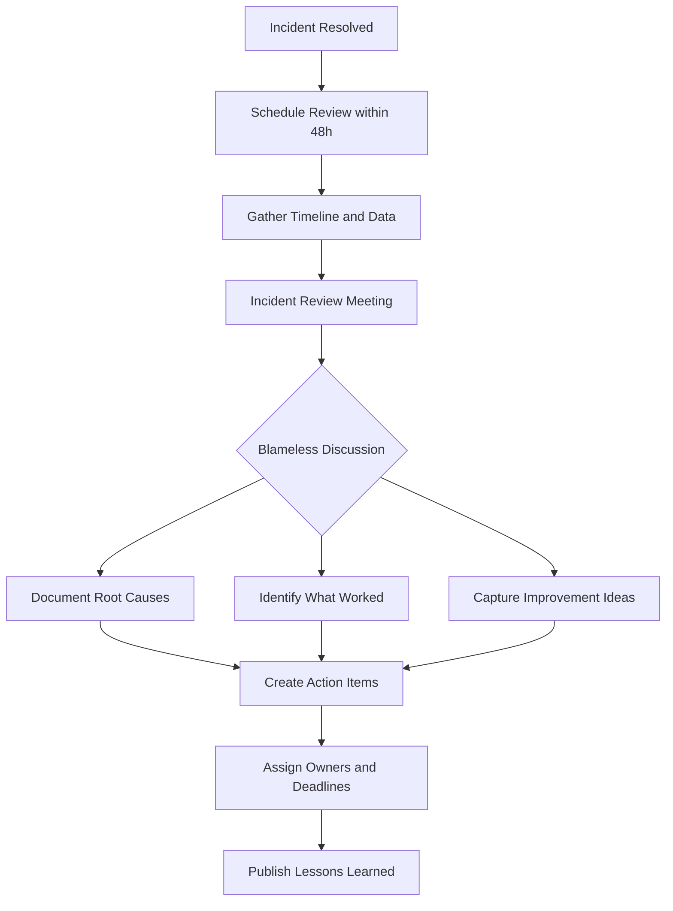
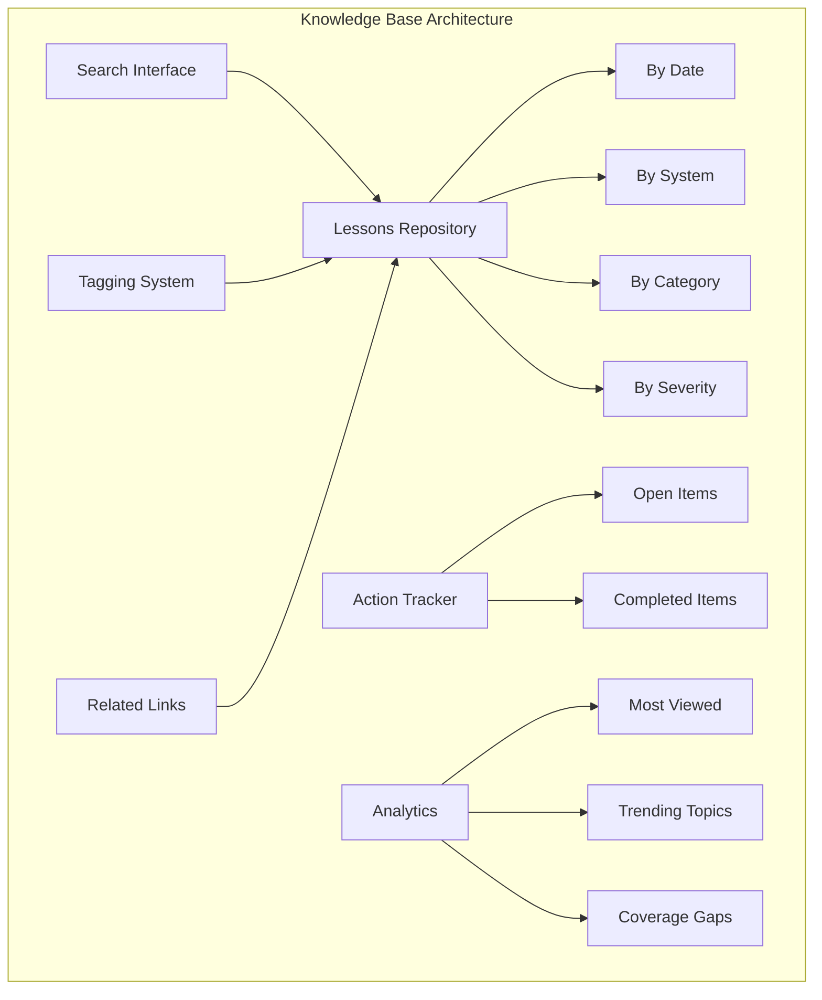
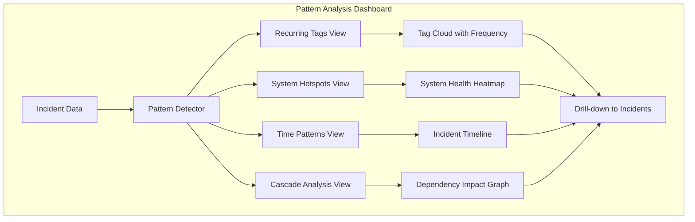
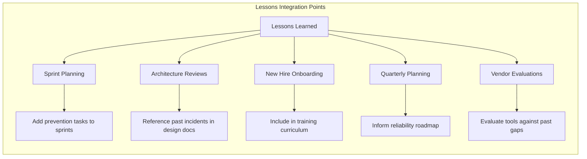
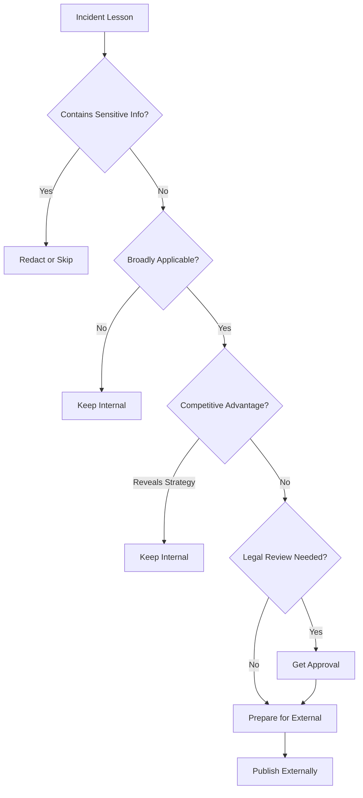
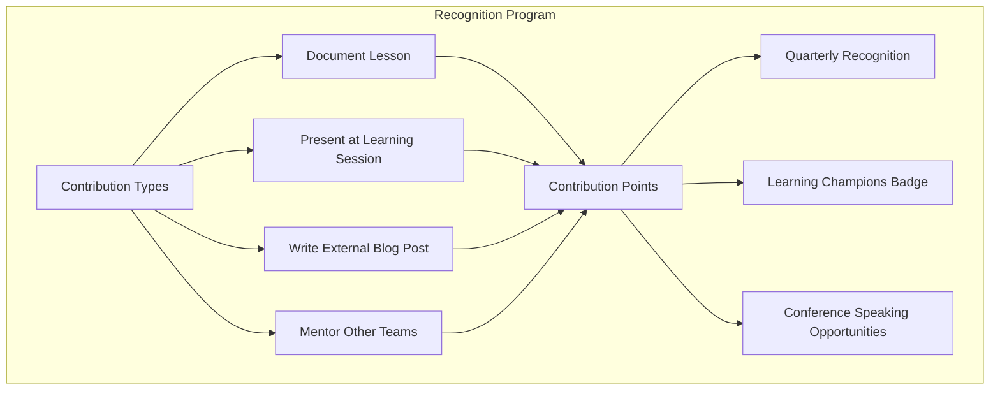

# How to Create Lessons Learned Sharing

Author: [nawazdhandala](https://github.com/nawazdhandala)

Tags: Incident Management, Knowledge Sharing, SRE, Culture

Description: Learn how to effectively share lessons learned from incidents across the organization.

---

Every incident carries valuable knowledge. The difference between organizations that repeatedly stumble and those that continuously improve lies in how effectively they capture and share lessons learned. This guide walks you through building a systematic approach to lessons learned sharing that transforms individual incidents into organization-wide improvements.

## Why Lessons Learned Sharing Matters

Incidents are expensive teachers. When you fail to share what you learned, you pay tuition multiple times for the same lesson. A single database connection pool exhaustion incident might teach one team about proper connection management, but without sharing, three other teams will discover the same lesson the hard way.

The goal is simple: learn once, benefit everywhere.

## Incident Review Meetings

The foundation of lessons learned sharing starts with well-structured incident review meetings. These are not blame sessions; they are learning opportunities.

### Scheduling the Review

Hold incident reviews within 48-72 hours of resolution while details remain fresh. Invite everyone involved in the incident, plus representatives from teams that own similar systems.

```yaml
# Example: Incident Review Meeting Template
apiVersion: v1
kind: ConfigMap
metadata:
  name: incident-review-template
  namespace: sre-tools
data:
  meeting-structure: |
    1. Timeline walkthrough (15 min)
    2. Root cause deep-dive (20 min)
    3. What went well (10 min)
    4. What could improve (10 min)
    5. Action items and owners (15 min)
    6. Cross-team applicability (10 min)

  facilitator-checklist: |
    - [ ] Send calendar invite within 24 hours of resolution
    - [ ] Include incident timeline document link
    - [ ] Ensure no-blame language in invite
    - [ ] Invite affected team leads
    - [ ] Reserve recording for async viewers
```

### Running Effective Reviews

The facilitator role is critical. They keep discussions productive and blameless while extracting maximum learning value.



### Capturing Insights During Reviews

Use a structured template to ensure consistent capture of learnings:

```typescript
// lessons-learned-schema.ts
interface LessonsLearned {
  incidentId: string;
  date: Date;
  severity: 'SEV1' | 'SEV2' | 'SEV3' | 'SEV4';

  // Core findings
  rootCauses: RootCause[];
  contributingFactors: string[];

  // What to share
  keyLessons: Lesson[];
  applicableTeams: string[];

  // Actions
  actionItems: ActionItem[];

  // Metadata for searchability
  tags: string[];
  affectedSystems: string[];
  incidentType: string;
}

interface Lesson {
  title: string;
  description: string;
  category: 'detection' | 'response' | 'prevention' | 'communication' | 'tooling';
  applicability: 'team' | 'department' | 'organization' | 'industry';
}

interface ActionItem {
  description: string;
  owner: string;
  deadline: Date;
  status: 'open' | 'in-progress' | 'completed' | 'wont-fix';
  preventsFuture: boolean;
}
```

## Cross-Team Knowledge Sharing

Individual team learnings have limited value. The real power comes from systematic cross-team sharing.

### Knowledge Sharing Channels

```mermaid
flowchart LR
    subgraph Sources["Learning Sources"]
        A[Incident Reviews]
        B[Near Misses]
        C[External Incidents]
        D[Chaos Experiments]
    end

    subgraph Channels["Distribution Channels"]
        E[Weekly Digest Email]
        F[Slack/Teams Channel]
        G[Monthly Learning Sessions]
        H[Knowledge Base]
    end

    subgraph Consumers["Learning Consumers"]
        I[Engineering Teams]
        J[Product Teams]
        K[Leadership]
        L[New Hires]
    end

    Sources --> Channels
    Channels --> Consumers
```



### Weekly Reliability Digest

Create an automated digest that summarizes recent learnings:

```python
# weekly_digest_generator.py
from datetime import datetime, timedelta
from typing import List
import json

class LessonsDigest:
    def __init__(self, knowledge_base_client):
        self.kb = knowledge_base_client

    def generate_weekly_digest(self) -> dict:
        """Generate a weekly digest of lessons learned."""
        week_ago = datetime.now() - timedelta(days=7)

        # Fetch recent lessons
        lessons = self.kb.query_lessons(
            since=week_ago,
            min_applicability='department'  # Skip team-only lessons
        )

        digest = {
            'period': f"{week_ago.strftime('%Y-%m-%d')} to {datetime.now().strftime('%Y-%m-%d')}",
            'summary': self._generate_summary(lessons),
            'top_lessons': self._rank_lessons(lessons)[:5],
            'action_items_due': self._get_upcoming_actions(),
            'patterns_detected': self._identify_patterns(lessons),
            'recommended_reading': self._get_recommendations(lessons)
        }

        return digest

    def _identify_patterns(self, lessons: List[dict]) -> List[dict]:
        """Identify recurring themes across lessons."""
        tag_counts = {}
        for lesson in lessons:
            for tag in lesson.get('tags', []):
                tag_counts[tag] = tag_counts.get(tag, 0) + 1

        # Find tags appearing in multiple incidents
        patterns = [
            {'tag': tag, 'count': count, 'trend': 'increasing'}
            for tag, count in tag_counts.items()
            if count >= 2
        ]

        return sorted(patterns, key=lambda x: x['count'], reverse=True)

    def _generate_summary(self, lessons: List[dict]) -> str:
        """Generate executive summary."""
        if not lessons:
            return "No significant lessons captured this week."

        categories = {}
        for lesson in lessons:
            cat = lesson.get('category', 'other')
            categories[cat] = categories.get(cat, 0) + 1

        top_category = max(categories, key=categories.get)
        return f"This week: {len(lessons)} lessons captured. Primary focus area: {top_category}."
```

### Learning Sessions

Monthly learning sessions bring teams together to discuss significant incidents and share knowledge interactively.

```yaml
# learning-session-format.yaml
learning_session:
  frequency: monthly
  duration: 60 minutes
  format:
    - segment: "Incident Deep Dive"
      duration: 25 minutes
      description: |
        One team presents a significant incident in detail.
        Focus on the investigation process, not just the fix.

    - segment: "Pattern Review"
      duration: 15 minutes
      description: |
        SRE team presents trends observed across incidents.
        Highlight recurring issues and systemic improvements needed.

    - segment: "External Learning"
      duration: 10 minutes
      description: |
        Review a public postmortem from another company.
        Discuss applicability to our systems.

    - segment: "Q&A and Discussion"
      duration: 10 minutes
      description: |
        Open floor for questions and cross-team discussion.
        Capture any new action items that emerge.

  artifacts:
    - Recording for async viewing
    - Slide deck in knowledge base
    - Action items in tracking system
```

## Documentation Platforms

A searchable, well-organized knowledge base is essential for lessons learned to have lasting value.

### Knowledge Base Structure



### Implementing a Lessons Learned Repository

```typescript
// lessons-repository.ts
import { Client } from '@elastic/elasticsearch';

interface LessonsRepository {
  index(lesson: LessonsLearned): Promise<string>;
  search(query: SearchQuery): Promise<SearchResult>;
  getRelated(lessonId: string): Promise<LessonsLearned[]>;
  getPatterns(timeRange: TimeRange): Promise<Pattern[]>;
}

class ElasticsearchLessonsRepository implements LessonsRepository {
  private client: Client;
  private indexName = 'lessons-learned';

  constructor(elasticsearchUrl: string) {
    this.client = new Client({ node: elasticsearchUrl });
  }

  async index(lesson: LessonsLearned): Promise<string> {
    const result = await this.client.index({
      index: this.indexName,
      body: {
        ...lesson,
        indexedAt: new Date(),
        // Generate embeddings for semantic search
        embedding: await this.generateEmbedding(lesson),
        // Extract searchable text
        fullText: this.extractFullText(lesson)
      }
    });

    return result._id;
  }

  async search(query: SearchQuery): Promise<SearchResult> {
    const response = await this.client.search({
      index: this.indexName,
      body: {
        query: {
          bool: {
            must: [
              { multi_match: { query: query.text, fields: ['title^2', 'description', 'fullText'] } }
            ],
            filter: [
              ...(query.tags ? [{ terms: { tags: query.tags } }] : []),
              ...(query.severity ? [{ term: { severity: query.severity } }] : []),
              ...(query.dateRange ? [{
                range: {
                  date: {
                    gte: query.dateRange.start,
                    lte: query.dateRange.end
                  }
                }
              }] : [])
            ]
          }
        },
        highlight: {
          fields: { description: {}, fullText: {} }
        },
        aggs: {
          by_category: { terms: { field: 'category.keyword' } },
          by_system: { terms: { field: 'affectedSystems.keyword' } }
        }
      }
    });

    return this.formatSearchResult(response);
  }

  async getRelated(lessonId: string): Promise<LessonsLearned[]> {
    // Use more-like-this query for related lessons
    const lesson = await this.getById(lessonId);

    const response = await this.client.search({
      index: this.indexName,
      body: {
        query: {
          more_like_this: {
            fields: ['tags', 'affectedSystems', 'description'],
            like: [{ _index: this.indexName, _id: lessonId }],
            min_term_freq: 1,
            min_doc_freq: 1
          }
        }
      }
    });

    return response.hits.hits.map(hit => hit._source as LessonsLearned);
  }
}
```

### Documentation Best Practices

Write lessons for future readers who have no context about the incident:

```markdown
<!-- Template: lessons-learned-document.md -->

# [Incident Title] - Lessons Learned

**Incident Date:** YYYY-MM-DD
**Severity:** SEV-X
**Affected Systems:** [List systems]
**Tags:** [searchable tags]

## Summary

[2-3 sentence summary that someone could understand without reading the full postmortem]

## Key Lessons

### Lesson 1: [Concise Title]

**What we learned:** [Clear statement of the learning]

**Why it matters:** [Impact if this lesson is ignored]

**How to apply:** [Actionable guidance for other teams]

**Applicable to:** [Which systems/teams should pay attention]

### Lesson 2: [Concise Title]

[Same structure]

## Prevention Checklist

Use this checklist to verify your system isn't vulnerable to similar issues:

- [ ] Check item 1
- [ ] Check item 2
- [ ] Check item 3

## Related Incidents

- [Link to similar incident 1]
- [Link to similar incident 2]

## Further Reading

- [Internal documentation link]
- [External resource link]
```

## Pattern Identification

Individual incidents are data points. Patterns across incidents reveal systemic issues that demand attention.

### Automated Pattern Detection

```python
# pattern_detector.py
from collections import defaultdict
from datetime import datetime, timedelta
from typing import List, Dict, Tuple
import numpy as np

class PatternDetector:
    def __init__(self, lessons_repository):
        self.repo = lessons_repository
        self.pattern_thresholds = {
            'recurring_tag': 3,      # Same tag in 3+ incidents
            'time_correlation': 0.7,  # 70% confidence for time patterns
            'system_hotspot': 4       # 4+ incidents on same system
        }

    def detect_patterns(self, lookback_days: int = 90) -> List[Dict]:
        """Analyze recent incidents for patterns."""
        since = datetime.now() - timedelta(days=lookback_days)
        lessons = self.repo.query_lessons(since=since)

        patterns = []
        patterns.extend(self._find_recurring_tags(lessons))
        patterns.extend(self._find_system_hotspots(lessons))
        patterns.extend(self._find_time_patterns(lessons))
        patterns.extend(self._find_cascade_patterns(lessons))

        return self._rank_patterns(patterns)

    def _find_recurring_tags(self, lessons: List[dict]) -> List[Dict]:
        """Find tags that appear frequently across incidents."""
        tag_incidents = defaultdict(list)

        for lesson in lessons:
            for tag in lesson.get('tags', []):
                tag_incidents[tag].append(lesson['incidentId'])

        patterns = []
        for tag, incidents in tag_incidents.items():
            if len(incidents) >= self.pattern_thresholds['recurring_tag']:
                patterns.append({
                    'type': 'recurring_tag',
                    'tag': tag,
                    'incident_count': len(incidents),
                    'incidents': incidents,
                    'recommendation': f"Systemic issue with '{tag}' - consider dedicated improvement initiative"
                })

        return patterns

    def _find_system_hotspots(self, lessons: List[dict]) -> List[Dict]:
        """Find systems with frequent incidents."""
        system_incidents = defaultdict(list)

        for lesson in lessons:
            for system in lesson.get('affectedSystems', []):
                system_incidents[system].append({
                    'id': lesson['incidentId'],
                    'date': lesson['date'],
                    'severity': lesson['severity']
                })

        patterns = []
        for system, incidents in system_incidents.items():
            if len(incidents) >= self.pattern_thresholds['system_hotspot']:
                # Calculate severity score
                severity_weights = {'SEV1': 8, 'SEV2': 4, 'SEV3': 2, 'SEV4': 1}
                severity_score = sum(
                    severity_weights.get(i['severity'], 1)
                    for i in incidents
                )

                patterns.append({
                    'type': 'system_hotspot',
                    'system': system,
                    'incident_count': len(incidents),
                    'severity_score': severity_score,
                    'recommendation': f"System '{system}' needs reliability investment - {len(incidents)} incidents in period"
                })

        return patterns

    def _find_cascade_patterns(self, lessons: List[dict]) -> List[Dict]:
        """Find incidents that frequently cascade to other systems."""
        cascade_pairs = defaultdict(int)

        for lesson in lessons:
            systems = lesson.get('affectedSystems', [])
            root_system = lesson.get('rootCauseSystem')

            if root_system and len(systems) > 1:
                for affected in systems:
                    if affected != root_system:
                        cascade_pairs[(root_system, affected)] += 1

        patterns = []
        for (source, target), count in cascade_pairs.items():
            if count >= 2:
                patterns.append({
                    'type': 'cascade_pattern',
                    'source_system': source,
                    'target_system': target,
                    'occurrence_count': count,
                    'recommendation': f"Add circuit breaker or bulkhead between '{source}' and '{target}'"
                })

        return patterns
```

### Pattern Visualization Dashboard



### Pattern-to-Action Pipeline

```yaml
# pattern-response-playbook.yaml
patterns:
  recurring_tag:
    threshold: 3 incidents in 30 days
    actions:
      - Create improvement epic in backlog
      - Assign reliability champion
      - Schedule deep-dive review
      - Set 90-day resolution target

  system_hotspot:
    threshold: 4 incidents in 60 days
    actions:
      - Conduct system reliability review
      - Update SLOs if needed
      - Allocate engineering time for hardening
      - Consider architectural changes

  cascade_pattern:
    threshold: 2 cascades from same source
    actions:
      - Review circuit breaker configuration
      - Implement bulkhead pattern
      - Add dependency health checks
      - Update runbooks for isolation

  time_correlation:
    threshold: 70% confidence
    actions:
      - Investigate scheduled jobs
      - Review deployment timing
      - Check for capacity patterns
      - Consider load balancing changes
```

## Organization-Wide Learning

For lessons to have maximum impact, they must reach beyond engineering into the broader organization.

### Stakeholder-Appropriate Summaries

Different audiences need different levels of detail:

```typescript
// stakeholder-summaries.ts
interface SummaryGenerator {
  generateForAudience(lesson: LessonsLearned, audience: Audience): Summary;
}

type Audience = 'engineering' | 'product' | 'executive' | 'customer-success';

class LessonsSummaryGenerator implements SummaryGenerator {
  generateForAudience(lesson: LessonsLearned, audience: Audience): Summary {
    switch (audience) {
      case 'engineering':
        return this.engineeringSummary(lesson);
      case 'product':
        return this.productSummary(lesson);
      case 'executive':
        return this.executiveSummary(lesson);
      case 'customer-success':
        return this.customerSuccessSummary(lesson);
    }
  }

  private engineeringSummary(lesson: LessonsLearned): Summary {
    return {
      title: lesson.title,
      content: `
## Technical Summary
${lesson.description}

## Root Cause
${lesson.rootCauses.map(rc => `- ${rc.description}`).join('\n')}

## Code/Config Changes
${lesson.actionItems.filter(a => a.type === 'code').map(a => `- ${a.description}`).join('\n')}

## Systems Affected
${lesson.affectedSystems.join(', ')}

## Recommended Reading
- Full postmortem: [link]
- Related incidents: [links]
      `,
      format: 'detailed'
    };
  }

  private executiveSummary(lesson: LessonsLearned): Summary {
    const customerImpact = this.calculateCustomerImpact(lesson);
    const costImpact = this.estimateCostImpact(lesson);

    return {
      title: lesson.title,
      content: `
## Business Impact
- Customers affected: ${customerImpact.count}
- Duration: ${lesson.duration} minutes
- Estimated cost: $${costImpact.toLocaleString()}

## Key Takeaway
${lesson.keyLessons[0]?.description || 'See full report'}

## Prevention Investment
${lesson.actionItems.filter(a => a.preventsFuture).length} action items identified
Estimated effort: ${this.estimateEffort(lesson)} engineering days

## Status
${this.getOverallStatus(lesson)}
      `,
      format: 'brief'
    };
  }

  private productSummary(lesson: LessonsLearned): Summary {
    return {
      title: lesson.title,
      content: `
## User Impact
${this.describeUserImpact(lesson)}

## Feature Implications
${this.identifyFeatureImplications(lesson)}

## Timeline Considerations
${this.describeTimelineImpact(lesson)}

## Customer Communications
${lesson.externalCommunications || 'No external communication required'}
      `,
      format: 'moderate'
    };
  }
}
```

### Integration with Existing Workflows

Lessons learned should flow into existing processes, not create parallel workflows:



### Metrics for Learning Effectiveness

Track whether lessons learned actually prevent future incidents:

```python
# learning_effectiveness_metrics.py
from dataclasses import dataclass
from datetime import datetime, timedelta
from typing import List, Optional

@dataclass
class LearningMetrics:
    period: str
    lessons_captured: int
    lessons_shared: int
    action_items_created: int
    action_items_completed: int
    action_items_overdue: int
    repeat_incidents_prevented: int
    mean_time_to_share: float  # hours from resolution to published lesson
    cross_team_adoption_rate: float  # % of applicable teams that acknowledged

class LearningEffectivenessTracker:
    def __init__(self, lessons_repo, incidents_repo):
        self.lessons = lessons_repo
        self.incidents = incidents_repo

    def calculate_metrics(self, period_days: int = 30) -> LearningMetrics:
        since = datetime.now() - timedelta(days=period_days)

        lessons = self.lessons.query(since=since)
        incidents = self.incidents.query(since=since)

        return LearningMetrics(
            period=f"Last {period_days} days",
            lessons_captured=len(lessons),
            lessons_shared=len([l for l in lessons if l.shared_at]),
            action_items_created=sum(len(l.action_items) for l in lessons),
            action_items_completed=self._count_completed_actions(lessons),
            action_items_overdue=self._count_overdue_actions(lessons),
            repeat_incidents_prevented=self._estimate_prevented(lessons, incidents),
            mean_time_to_share=self._calculate_mean_share_time(lessons),
            cross_team_adoption_rate=self._calculate_adoption_rate(lessons)
        )

    def _estimate_prevented(self, lessons: List, incidents: List) -> int:
        """
        Estimate incidents prevented by counting similar incidents
        that didn't recur after lessons were shared.
        """
        prevented = 0
        for lesson in lessons:
            if lesson.shared_at and lesson.action_items:
                # Check if similar incidents occurred after sharing
                similar_after = self._find_similar_incidents(
                    lesson,
                    incidents,
                    after=lesson.shared_at
                )
                if not similar_after:
                    prevented += 1
        return prevented

    def generate_report(self, metrics: LearningMetrics) -> str:
        completion_rate = (
            metrics.action_items_completed / metrics.action_items_created * 100
            if metrics.action_items_created > 0 else 0
        )

        return f"""
# Learning Effectiveness Report - {metrics.period}

## Capture Metrics
- Lessons documented: {metrics.lessons_captured}
- Lessons shared org-wide: {metrics.lessons_shared}
- Share rate: {metrics.lessons_shared / metrics.lessons_captured * 100:.1f}%

## Action Item Metrics
- Total created: {metrics.action_items_created}
- Completed: {metrics.action_items_completed}
- Overdue: {metrics.action_items_overdue}
- Completion rate: {completion_rate:.1f}%

## Impact Metrics
- Estimated incidents prevented: {metrics.repeat_incidents_prevented}
- Mean time to share: {metrics.mean_time_to_share:.1f} hours
- Cross-team adoption: {metrics.cross_team_adoption_rate:.1f}%

## Recommendations
{self._generate_recommendations(metrics)}
        """
```

## External Sharing Considerations

Sharing lessons externally can benefit the broader industry while building your organization's reputation. However, it requires careful consideration.

### What to Share Externally



### Preparing Public Postmortems

```python
# public_postmortem_generator.py
from typing import List, Optional
import re

class PublicPostmortemGenerator:
    def __init__(self):
        self.redaction_patterns = [
            (r'\b\d{1,3}\.\d{1,3}\.\d{1,3}\.\d{1,3}\b', '[IP_ADDRESS]'),
            (r'\b[A-Za-z0-9._%+-]+@[A-Za-z0-9.-]+\.[A-Z|a-z]{2,}\b', '[EMAIL]'),
            (r'customer[_-]?id[:\s]+\w+', 'customer_id: [REDACTED]'),
            (r'api[_-]?key[:\s]+\w+', 'api_key: [REDACTED]'),
            (r'\$[\d,]+(?:\.\d{2})?', '[AMOUNT]'),  # Dollar amounts
        ]

        self.sensitive_sections = [
            'internal_communication',
            'customer_names',
            'revenue_impact',
            'employee_names'
        ]

    def generate_public_version(self, internal_postmortem: dict) -> dict:
        """Transform internal postmortem into public-safe version."""
        public = {
            'title': internal_postmortem['title'],
            'date': internal_postmortem['date'],
            'duration': internal_postmortem['duration'],
            'summary': self._redact_text(internal_postmortem['summary']),
            'impact': self._generalize_impact(internal_postmortem['impact']),
            'timeline': self._sanitize_timeline(internal_postmortem['timeline']),
            'root_cause': self._redact_text(internal_postmortem['root_cause']),
            'lessons_learned': self._extract_public_lessons(internal_postmortem),
            'action_items': self._generalize_actions(internal_postmortem['action_items'])
        }

        return public

    def _redact_text(self, text: str) -> str:
        """Apply redaction patterns to text."""
        result = text
        for pattern, replacement in self.redaction_patterns:
            result = re.sub(pattern, replacement, result, flags=re.IGNORECASE)
        return result

    def _generalize_impact(self, impact: dict) -> dict:
        """Convert specific impact numbers to ranges."""
        return {
            'users_affected': self._to_range(impact.get('users_affected', 0)),
            'duration_minutes': impact.get('duration_minutes'),
            'services_affected': len(impact.get('services', [])),
            'description': self._redact_text(impact.get('description', ''))
        }

    def _to_range(self, number: int) -> str:
        """Convert specific number to range for privacy."""
        if number < 100:
            return "< 100"
        elif number < 1000:
            return "100-1,000"
        elif number < 10000:
            return "1,000-10,000"
        elif number < 100000:
            return "10,000-100,000"
        else:
            return "> 100,000"

    def _extract_public_lessons(self, postmortem: dict) -> List[dict]:
        """Extract lessons safe for public sharing."""
        public_lessons = []

        for lesson in postmortem.get('lessons_learned', []):
            if lesson.get('public_safe', True):
                public_lessons.append({
                    'title': lesson['title'],
                    'description': self._redact_text(lesson['description']),
                    'category': lesson['category'],
                    'recommendation': self._redact_text(lesson.get('recommendation', ''))
                })

        return public_lessons
```

### External Sharing Channels

Consider these channels for external sharing:

1. **Company Engineering Blog**: Detailed technical postmortems
2. **Conference Talks**: Present significant incidents at SREcon, KubeCon, etc.
3. **Industry Working Groups**: Share with peers in similar industries
4. **Open Source Contributions**: If the fix benefits open source projects

```yaml
# external-sharing-checklist.yaml
pre_publication_checklist:
  legal_review:
    - No customer PII or business data
    - No contractual violations
    - No regulatory concerns

  security_review:
    - No infrastructure details that aid attackers
    - No API endpoints or internal URLs
    - No credential patterns or security weaknesses

  business_review:
    - No competitive intelligence
    - No unreleased product information
    - Approved by communications team

  technical_review:
    - Lessons are accurate and helpful
    - Recommendations are sound
    - Code examples are safe to share

publication_metadata:
  author: "SRE Team"  # Not individual names unless they consent
  review_date: YYYY-MM-DD
  approvers:
    - Legal: [name]
    - Security: [name]
    - Engineering Lead: [name]
```

## Building a Learning Culture

Technical systems for sharing lessons only work if the culture supports learning.

### Principles for a Learning Culture

```yaml
# learning-culture-principles.yaml
principles:
  blamelessness:
    description: |
      Focus on systems and processes, not individuals.
      People make mistakes; systems should catch them.
    practices:
      - Use "we" language in postmortems
      - Discuss contributing factors, not blame
      - Celebrate finding and fixing issues

  psychological_safety:
    description: |
      People must feel safe to report mistakes and near-misses.
      Punishment for honesty kills learning.
    practices:
      - Thank people for reporting issues
      - Share leadership's own mistakes
      - Never use incident data in performance reviews

  continuous_improvement:
    description: |
      Every incident is an opportunity to get better.
      Perfection isn't the goal; progress is.
    practices:
      - Track improvement metrics, not incident counts
      - Celebrate completed action items
      - Allocate time for reliability work

  knowledge_sharing:
    description: |
      Hoarding knowledge creates single points of failure.
      Shared knowledge multiplies value.
    practices:
      - Default to public (within the org) documentation
      - Reward teaching and mentoring
      - Include knowledge sharing in role expectations
```

### Incentivizing Knowledge Sharing



## Conclusion

Effective lessons learned sharing transforms incidents from costly setbacks into valuable learning opportunities. The key elements are:

1. **Structured incident reviews** that capture learnings systematically
2. **Multiple distribution channels** that reach different audiences appropriately
3. **Searchable documentation** that makes past lessons discoverable
4. **Pattern detection** that identifies systemic issues
5. **Organization-wide integration** that connects lessons to business processes
6. **Thoughtful external sharing** that benefits the broader community
7. **Cultural foundations** that make learning safe and valued

Start simple: document your next incident's lessons, share them with one other team, and track whether it helps. Then iterate. The goal is not perfection but continuous improvement in how your organization learns from experience.

Remember: the most expensive lesson is the one you have to learn twice.
