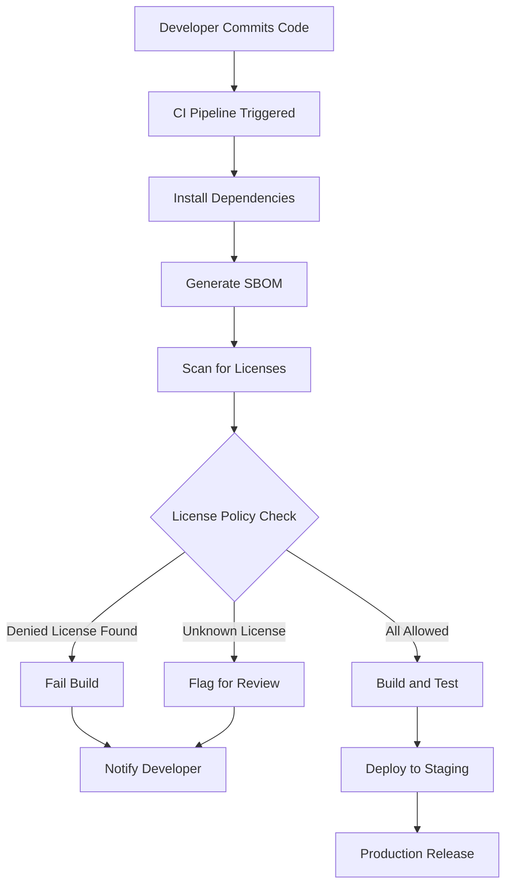

# How to Create License Compliance Testing

Author: [nawazdhandala](https://github.com/nawazdhandala)

Tags: Testing, Compliance, Licensing, OpenSource

Description: A practical guide to automating open source license compliance checks in your CI/CD pipeline to avoid legal risks.

---

Open source powers modern software, but every dependency carries license obligations. Shipping code without verifying license compatibility can expose your organization to legal action, forced disclosure of proprietary code, or removal of critical features. License compliance testing automates the detection and enforcement of acceptable licenses across your dependency tree.

## Why License Compliance Matters

Most projects pull in hundreds of transitive dependencies. Each one has a license that may:

- Require attribution in documentation.
- Mandate that derivative works use the same license (copyleft).
- Prohibit commercial use or modification.
- Conflict with your own project license.

Manual audits do not scale. Automated compliance testing catches violations before code reaches production.

## The Compliance Workflow

The following diagram shows how license compliance fits into a typical CI/CD pipeline:



## License Detection Tools

Several tools can identify licenses in your dependencies:

| Tool | Language Support | Output Formats | SBOM Support |
|------|-----------------|----------------|--------------|
| **Licensee** | Ruby | JSON, Markdown | No |
| **license-checker** | Node.js | JSON, CSV, Markdown | No |
| **pip-licenses** | Python | JSON, CSV, Markdown | No |
| **go-licenses** | Go | JSON, CSV | Yes |
| **Syft** | All | JSON, SPDX, CycloneDX | Yes |
| **Trivy** | All | JSON, SPDX, CycloneDX | Yes |
| **FOSSA** | All | JSON, SPDX | Yes |
| **Scancode** | All | JSON, SPDX, CycloneDX | Yes |

For polyglot projects, Syft or Trivy provide the broadest coverage with SBOM generation built in.

## License Categorization and Risk Levels

Not all licenses carry the same risk. Categorize them by obligation level:

### Permissive (Low Risk)

These licenses allow modification and redistribution with minimal requirements, usually just attribution.

- MIT
- BSD-2-Clause
- BSD-3-Clause
- Apache-2.0
- ISC
- Unlicense
- CC0-1.0

### Weak Copyleft (Medium Risk)

Modifications to the licensed library must be shared, but your proprietary code linking to it remains yours.

- LGPL-2.1
- LGPL-3.0
- MPL-2.0
- EPL-2.0

### Strong Copyleft (High Risk)

Any software that includes or links to these works must be released under the same license.

- GPL-2.0
- GPL-3.0
- AGPL-3.0

### Non-Commercial or Restrictive (Very High Risk)

These prohibit commercial use or impose other restrictions incompatible with most business models.

- CC-BY-NC-*
- SSPL
- Commons Clause
- Proprietary

## Defining Your License Policy

Create a policy file that explicitly lists allowed and denied licenses. Here is an example configuration for different tools:

### FOSSA Policy Example

```yaml
# .fossa.yml - FOSSA license policy configuration

version: 3
project:
  id: github.com/your-org/your-repo
  name: your-project

# Define which licenses are acceptable for your project
policy:
  # Licenses that are always allowed (permissive licenses)
  allowlist:
    - MIT
    - Apache-2.0
    - BSD-2-Clause
    - BSD-3-Clause
    - ISC
    - Unlicense
    - CC0-1.0

  # Licenses that require manual review before approval
  flaglist:
    - LGPL-2.1-only
    - LGPL-3.0-only
    - MPL-2.0
    - EPL-2.0

  # Licenses that will automatically fail the build
  denylist:
    - GPL-2.0-only
    - GPL-3.0-only
    - AGPL-3.0-only
    - SSPL-1.0
    - CC-BY-NC-4.0
```

### License-Checker Configuration (Node.js)

```json
{
  "name": "license-checker-config",
  "licenseCheckerConfig": {
    "onlyAllow": [
      "MIT",
      "Apache-2.0",
      "BSD-2-Clause",
      "BSD-3-Clause",
      "ISC",
      "Unlicense",
      "CC0-1.0"
    ],
    "excludePackages": [
      "internal-package@1.0.0"
    ],
    "failOn": [
      "GPL",
      "AGPL",
      "SSPL"
    ]
  }
}
```

## SBOM-Based Compliance Checking

A Software Bill of Materials (SBOM) provides a complete inventory of your software components. Using SBOMs for compliance offers several advantages:

- Standardized formats (SPDX, CycloneDX) work across tools.
- Single source of truth for dependencies and licenses.
- Required by regulations like US Executive Order 14028.
- Enables supply chain transparency.

### Generating an SBOM with Syft

```bash
#!/bin/bash
# generate-sbom.sh - Generate SBOM in CycloneDX format

# Install syft if not present
if ! command -v syft &> /dev/null; then
    curl -sSfL https://raw.githubusercontent.com/anchore/syft/main/install.sh | sh -s -- -b /usr/local/bin
fi

# Generate SBOM from the current directory
# Output in CycloneDX JSON format for broad tool compatibility
syft dir:. -o cyclonedx-json=sbom.cdx.json

# Also generate SPDX format for compliance tools that prefer it
syft dir:. -o spdx-json=sbom.spdx.json

echo "SBOM generated: sbom.cdx.json and sbom.spdx.json"
```

### Scanning SBOM for License Violations

```bash
#!/bin/bash
# scan-licenses.sh - Check SBOM against license policy

# Define allowed licenses as an array
ALLOWED_LICENSES=(
    "MIT"
    "Apache-2.0"
    "BSD-2-Clause"
    "BSD-3-Clause"
    "ISC"
    "Unlicense"
)

# Convert SBOM to license report using grype
# Then filter for license information
grype sbom:sbom.cdx.json -o json > scan-results.json

# Extract unique licenses from the SBOM
FOUND_LICENSES=$(jq -r '.components[].licenses[]?.license?.id // .components[].licenses[]?.expression // "UNKNOWN"' sbom.cdx.json | sort -u)

# Check each license against the allowed list
EXIT_CODE=0
for license in $FOUND_LICENSES; do
    ALLOWED=false
    for allowed in "${ALLOWED_LICENSES[@]}"; do
        if [[ "$license" == "$allowed" ]]; then
            ALLOWED=true
            break
        fi
    done

    if [[ "$ALLOWED" == false && "$license" != "UNKNOWN" ]]; then
        echo "DENIED: $license is not in the allowed list"
        EXIT_CODE=1
    else
        echo "OK: $license"
    fi
done

exit $EXIT_CODE
```

## Integrating into CI/CD

### GitHub Actions Workflow

```yaml
# .github/workflows/license-compliance.yml
name: License Compliance Check

on:
  push:
    branches: [main, develop]
  pull_request:
    branches: [main]

jobs:
  license-check:
    runs-on: ubuntu-latest
    steps:
      # Check out the repository code
      - name: Checkout code
        uses: actions/checkout@v4

      # Install Syft for SBOM generation
      - name: Install Syft
        uses: anchore/sbom-action/download-syft@v0

      # Generate SBOM from the repository
      - name: Generate SBOM
        run: syft dir:. -o cyclonedx-json=sbom.cdx.json

      # Upload SBOM as artifact for audit trail
      - name: Upload SBOM
        uses: actions/upload-artifact@v4
        with:
          name: sbom
          path: sbom.cdx.json

      # Run license compliance check
      - name: Check licenses
        run: |
          # Install jq for JSON parsing
          sudo apt-get install -y jq

          # Define allowed licenses
          ALLOWED='["MIT","Apache-2.0","BSD-2-Clause","BSD-3-Clause","ISC","Unlicense","CC0-1.0"]'

          # Extract licenses from SBOM and check against policy
          jq -r '.components[]?.licenses[]?.license?.id // empty' sbom.cdx.json | sort -u | while read license; do
            if ! echo "$ALLOWED" | jq -e --arg l "$license" 'index($l)' > /dev/null; then
              echo "::error::Denied license found: $license"
              exit 1
            fi
          done

          echo "All licenses are compliant"

      # Notify on failure
      - name: Notify on failure
        if: failure()
        uses: actions/github-script@v7
        with:
          script: |
            github.rest.issues.createComment({
              owner: context.repo.owner,
              repo: context.repo.repo,
              issue_number: context.issue.number,
              body: 'License compliance check failed. Please review the denied licenses and either remove the dependency or request an exception.'
            })
```

### Python Project Example

```python
#!/usr/bin/env python3
"""
license_checker.py - Automated license compliance checker for Python projects

This script scans installed packages and validates their licenses
against a configurable policy.
"""

import json
import subprocess
import sys
from dataclasses import dataclass
from enum import Enum
from typing import Optional


class RiskLevel(Enum):
    """License risk categories based on obligations."""
    LOW = "low"           # Permissive licenses
    MEDIUM = "medium"     # Weak copyleft
    HIGH = "high"         # Strong copyleft
    CRITICAL = "critical" # Non-commercial or unknown


@dataclass
class LicensePolicy:
    """Defines which licenses are allowed, flagged, or denied."""

    # Licenses that pass without review
    allowed: set[str] = None

    # Licenses that require manual approval
    flagged: set[str] = None

    # Licenses that always fail the build
    denied: set[str] = None

    def __post_init__(self):
        # Default permissive licenses are always allowed
        self.allowed = self.allowed or {
            "MIT",
            "Apache-2.0",
            "BSD-2-Clause",
            "BSD-3-Clause",
            "ISC",
            "Unlicense",
            "CC0-1.0",
            "Python-2.0",
            "PSF-2.0",
        }

        # Weak copyleft requires review
        self.flagged = self.flagged or {
            "LGPL-2.1",
            "LGPL-3.0",
            "MPL-2.0",
            "EPL-2.0",
        }

        # Strong copyleft and restrictive licenses are denied
        self.denied = self.denied or {
            "GPL-2.0",
            "GPL-3.0",
            "AGPL-3.0",
            "SSPL-1.0",
        }

    def check(self, license_id: str) -> tuple[bool, RiskLevel, str]:
        """
        Check if a license is compliant with the policy.

        Returns:
            (is_compliant, risk_level, message)
        """
        # Normalize license identifier
        normalized = license_id.upper().strip()

        # Check against each category
        for allowed in self.allowed:
            if allowed.upper() in normalized:
                return True, RiskLevel.LOW, "Allowed"

        for flagged in self.flagged:
            if flagged.upper() in normalized:
                return False, RiskLevel.MEDIUM, "Requires review"

        for denied in self.denied:
            if denied.upper() in normalized:
                return False, RiskLevel.HIGH, "Denied by policy"

        # Unknown licenses need investigation
        return False, RiskLevel.CRITICAL, "Unknown license"


def get_installed_licenses() -> list[dict]:
    """
    Get licenses for all installed Python packages using pip-licenses.

    Returns:
        List of dicts with package name and license info
    """
    try:
        # Run pip-licenses to get JSON output
        result = subprocess.run(
            ["pip-licenses", "--format=json", "--with-license-file"],
            capture_output=True,
            text=True,
            check=True
        )
        return json.loads(result.stdout)
    except FileNotFoundError:
        print("Error: pip-licenses not installed. Run: pip install pip-licenses")
        sys.exit(1)
    except subprocess.CalledProcessError as e:
        print(f"Error running pip-licenses: {e.stderr}")
        sys.exit(1)


def main():
    """Run license compliance check and report results."""
    policy = LicensePolicy()
    packages = get_installed_licenses()

    violations = []
    flagged = []
    compliant = []

    # Check each package against the policy
    for pkg in packages:
        name = pkg.get("Name", "unknown")
        license_id = pkg.get("License", "UNKNOWN")

        is_ok, risk, message = policy.check(license_id)

        result = {
            "package": name,
            "license": license_id,
            "risk": risk.value,
            "message": message
        }

        if is_ok:
            compliant.append(result)
        elif risk == RiskLevel.MEDIUM:
            flagged.append(result)
        else:
            violations.append(result)

    # Print summary report
    print("\n=== License Compliance Report ===\n")

    print(f"Compliant packages: {len(compliant)}")
    print(f"Flagged for review: {len(flagged)}")
    print(f"Violations: {len(violations)}")

    if flagged:
        print("\n--- Packages Requiring Review ---")
        for pkg in flagged:
            print(f"  {pkg['package']}: {pkg['license']} ({pkg['message']})")

    if violations:
        print("\n--- License Violations ---")
        for pkg in violations:
            print(f"  {pkg['package']}: {pkg['license']} ({pkg['message']})")
        print("\nBuild failed due to license violations.")
        sys.exit(1)

    print("\nAll licenses are compliant.")
    sys.exit(0)


if __name__ == "__main__":
    main()
```

## Handling Exceptions and Overrides

Sometimes you need to allow a specific package with a non-compliant license. Document exceptions explicitly:

```yaml
# license-exceptions.yml - Documented license exceptions

exceptions:
  # Exception for a GPL library used only in build tooling
  - package: "build-tool@2.1.0"
    license: "GPL-3.0"
    reason: "Used only during build, not distributed with final product"
    approved_by: "legal@company.com"
    approved_date: "2026-01-15"
    review_date: "2027-01-15"

  # Exception for an LGPL library properly isolated
  - package: "compression-lib@4.0.0"
    license: "LGPL-2.1"
    reason: "Dynamically linked, source modifications will be shared"
    approved_by: "legal@company.com"
    approved_date: "2026-01-10"
    review_date: "2027-01-10"
```

## Best Practices

1. **Fail fast**: Run license checks early in CI before expensive builds.

2. **Document everything**: Keep a record of approved exceptions with expiration dates.

3. **Use SBOM formats**: SPDX and CycloneDX enable interoperability between tools.

4. **Automate notifications**: Alert developers immediately when violations occur.

5. **Review periodically**: Licenses can change between versions; recheck on updates.

6. **Train your team**: Ensure developers understand license categories and risks.

7. **Include transitive dependencies**: Direct dependencies may be compliant, but their dependencies may not.

8. **Version your policy**: Track policy changes in source control.

---

License compliance testing is not optional for professional software development. By integrating automated checks into your CI/CD pipeline, you catch violations early, maintain audit trails through SBOMs, and protect your organization from legal exposure. Start with a clear policy, choose appropriate tooling, and iterate as your dependency landscape evolves.
