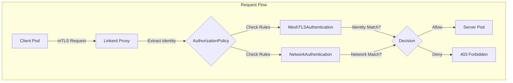
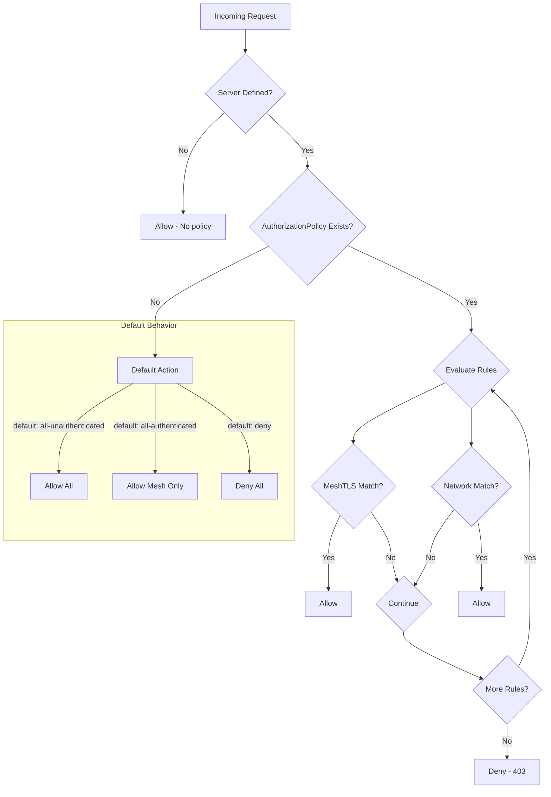

# How to Create Linkerd Authorization Policy

Author: [nawazdhandala](https://github.com/nawazdhandala)

Tags: Linkerd, Kubernetes, ServiceMesh, Authorization

Description: Learn how to secure your Kubernetes workloads with Linkerd Authorization Policies for fine-grained access control.

---

Linkerd provides a powerful policy system for controlling which workloads can communicate with each other. Unlike Kubernetes Network Policies that operate at Layer 3/4, Linkerd Authorization Policies work at Layer 7 and leverage mutual TLS identities for cryptographically verified access control.

## Understanding Linkerd Authorization Policy

Authorization Policies in Linkerd define who can access your workloads based on their mesh identity. Every workload in the Linkerd mesh gets a cryptographic identity derived from its Kubernetes ServiceAccount, enabling secure, identity-based access control.



## The AuthorizationPolicy Resource

The `AuthorizationPolicy` resource is the core building block. It specifies which clients can access a target workload.

### Basic Structure

```yaml
# AuthorizationPolicy defines access rules for a target workload
apiVersion: policy.linkerd.io/v1beta3
kind: AuthorizationPolicy
metadata:
  name: api-authz           # Name of this policy
  namespace: production     # Namespace where target workload lives
spec:
  targetRef:
    group: core             # API group of the target resource
    kind: Server            # Can be Server, HTTPRoute, or GRPCRoute
    name: api-server        # Name of the target resource
  requiredAuthenticationRefs:
    - name: mesh-authn      # Reference to authentication resource
      kind: MeshTLSAuthentication
      group: policy.linkerd.io
```

### Target Reference Options

The `targetRef` field supports multiple resource types:

```yaml
# Target a Server resource (most common)
targetRef:
  group: core
  kind: Server
  name: my-server

# Target an HTTPRoute for path-based authorization
targetRef:
  group: policy.linkerd.io
  kind: HTTPRoute
  name: api-routes

# Target a GRPCRoute for gRPC services
targetRef:
  group: policy.linkerd.io
  kind: GRPCRoute
  name: grpc-routes
```

## Server Resource Definition

Before creating an AuthorizationPolicy, define a `Server` resource to identify the workload being protected.

```yaml
# Server resource identifies ports that require authorization
apiVersion: policy.linkerd.io/v1beta2
kind: Server
metadata:
  name: api-server
  namespace: production
spec:
  podSelector:
    matchLabels:
      app: api             # Select pods with this label
  port: 8080               # Port to apply policy to
  proxyProtocol: HTTP/2    # Protocol: HTTP/1, HTTP/2, gRPC, opaque
```

## Authentication Resources

Linkerd supports two types of authentication for authorization decisions.

### MeshTLSAuthentication

Use `MeshTLSAuthentication` to authenticate based on mesh identity (ServiceAccount).

```yaml
# MeshTLSAuthentication verifies client identity via mTLS
apiVersion: policy.linkerd.io/v1alpha1
kind: MeshTLSAuthentication
metadata:
  name: frontend-identity
  namespace: production
spec:
  identities:
    # Allow the frontend ServiceAccount from production namespace
    - "frontend.production.serviceaccount.identity.linkerd.cluster.local"
  identityRefs:
    # Or reference ServiceAccounts directly
    - kind: ServiceAccount
      name: frontend
      namespace: production
```

### NetworkAuthentication

Use `NetworkAuthentication` for IP-based rules, useful for non-mesh traffic.

```yaml
# NetworkAuthentication allows traffic from specific IP ranges
apiVersion: policy.linkerd.io/v1alpha1
kind: NetworkAuthentication
metadata:
  name: internal-network
  namespace: production
spec:
  networks:
    - cidr: 10.0.0.0/8         # Internal pod network
    - cidr: 192.168.1.0/24     # Specific subnet
```

## Policy Evaluation Flow

Understanding how Linkerd evaluates policies is crucial for debugging.



## Route-Level Authorization

For fine-grained control, apply policies to specific HTTP or gRPC routes.

### HTTPRoute Definition

```yaml
# HTTPRoute defines path-based routing with authorization
apiVersion: policy.linkerd.io/v1beta3
kind: HTTPRoute
metadata:
  name: api-routes
  namespace: production
spec:
  parentRefs:
    - name: api-server      # Reference to the Server resource
      kind: Server
      group: policy.linkerd.io
  rules:
    # Public health endpoint - no auth required
    - matches:
        - path:
            type: Exact
            value: /health
      filters: []

    # Protected API endpoints
    - matches:
        - path:
            type: PathPrefix
            value: /api/v1
          method: GET

    # Admin endpoints - separate policy
    - matches:
        - path:
            type: PathPrefix
            value: /admin
```

### Route-Specific Authorization

```yaml
# AuthorizationPolicy for specific routes
apiVersion: policy.linkerd.io/v1beta3
kind: AuthorizationPolicy
metadata:
  name: api-read-policy
  namespace: production
spec:
  targetRef:
    group: policy.linkerd.io
    kind: HTTPRoute
    name: api-routes
  requiredAuthenticationRefs:
    - name: api-consumers
      kind: MeshTLSAuthentication
      group: policy.linkerd.io
---
# Separate policy for admin routes
apiVersion: policy.linkerd.io/v1beta3
kind: AuthorizationPolicy
metadata:
  name: admin-policy
  namespace: production
spec:
  targetRef:
    group: policy.linkerd.io
    kind: HTTPRoute
    name: admin-routes
  requiredAuthenticationRefs:
    - name: admin-identity
      kind: MeshTLSAuthentication
      group: policy.linkerd.io
```

## Complete Example: Microservices Authorization

Here is a complete example securing a three-tier application.

```yaml
# Define the Server for the API service
apiVersion: policy.linkerd.io/v1beta2
kind: Server
metadata:
  name: api-server
  namespace: production
spec:
  podSelector:
    matchLabels:
      app: api
  port: 8080
  proxyProtocol: HTTP/2
---
# Define the Server for the database service
apiVersion: policy.linkerd.io/v1beta2
kind: Server
metadata:
  name: postgres-server
  namespace: production
spec:
  podSelector:
    matchLabels:
      app: postgres
  port: 5432
  proxyProtocol: opaque    # Non-HTTP protocol
---
# Allow frontend to call API
apiVersion: policy.linkerd.io/v1alpha1
kind: MeshTLSAuthentication
metadata:
  name: frontend-authn
  namespace: production
spec:
  identityRefs:
    - kind: ServiceAccount
      name: frontend
      namespace: production
---
# Allow API to call database
apiVersion: policy.linkerd.io/v1alpha1
kind: MeshTLSAuthentication
metadata:
  name: api-authn
  namespace: production
spec:
  identityRefs:
    - kind: ServiceAccount
      name: api
      namespace: production
---
# API authorization - only frontend can access
apiVersion: policy.linkerd.io/v1beta3
kind: AuthorizationPolicy
metadata:
  name: api-authz
  namespace: production
spec:
  targetRef:
    group: core
    kind: Server
    name: api-server
  requiredAuthenticationRefs:
    - name: frontend-authn
      kind: MeshTLSAuthentication
      group: policy.linkerd.io
---
# Database authorization - only API can access
apiVersion: policy.linkerd.io/v1beta3
kind: AuthorizationPolicy
metadata:
  name: postgres-authz
  namespace: production
spec:
  targetRef:
    group: core
    kind: Server
    name: postgres-server
  requiredAuthenticationRefs:
    - name: api-authn
      kind: MeshTLSAuthentication
      group: policy.linkerd.io
```

## Allowing Multiple Clients

To allow multiple workloads to access a service, list multiple identities.

```yaml
# MeshTLSAuthentication with multiple allowed identities
apiVersion: policy.linkerd.io/v1alpha1
kind: MeshTLSAuthentication
metadata:
  name: api-consumers
  namespace: production
spec:
  identityRefs:
    # Allow frontend service
    - kind: ServiceAccount
      name: frontend
      namespace: production
    # Allow monitoring service
    - kind: ServiceAccount
      name: prometheus
      namespace: monitoring
    # Allow CI/CD service for deployments
    - kind: ServiceAccount
      name: argocd-application-controller
      namespace: argocd
```

## Combining Authentication Types

Use both mesh and network authentication when you need to allow both meshed and non-meshed clients.

```yaml
# Allow both mesh identities and specific networks
apiVersion: policy.linkerd.io/v1alpha1
kind: MeshTLSAuthentication
metadata:
  name: mesh-clients
  namespace: production
spec:
  identityRefs:
    - kind: ServiceAccount
      name: internal-service
      namespace: production
---
apiVersion: policy.linkerd.io/v1alpha1
kind: NetworkAuthentication
metadata:
  name: legacy-clients
  namespace: production
spec:
  networks:
    - cidr: 10.100.0.0/16    # Legacy VM subnet
---
apiVersion: policy.linkerd.io/v1beta3
kind: AuthorizationPolicy
metadata:
  name: hybrid-authz
  namespace: production
spec:
  targetRef:
    group: core
    kind: Server
    name: api-server
  requiredAuthenticationRefs:
    # Either mesh identity OR network match will allow access
    - name: mesh-clients
      kind: MeshTLSAuthentication
      group: policy.linkerd.io
    - name: legacy-clients
      kind: NetworkAuthentication
      group: policy.linkerd.io
```

## Default Policy Configuration

Set cluster-wide defaults using Linkerd's configuration.

```yaml
# Configure default policy during Linkerd installation
# In your Linkerd Helm values
policy:
  defaultPolicy: deny              # Options: deny, all-authenticated, all-unauthenticated, audit
  defaultInboundPolicy: deny       # Default for inbound traffic
  defaultOutboundPolicy: allow     # Default for outbound traffic
```

### Per-Namespace Defaults

```yaml
# Set default policy for a namespace via annotation
apiVersion: v1
kind: Namespace
metadata:
  name: production
  annotations:
    config.linkerd.io/default-inbound-policy: deny
```

### Per-Workload Defaults

```yaml
# Set default policy for a specific deployment
apiVersion: apps/v1
kind: Deployment
metadata:
  name: api
  namespace: production
spec:
  template:
    metadata:
      annotations:
        config.linkerd.io/default-inbound-policy: all-authenticated
```

## Debugging Authorization Policies

### Check Policy Status

```bash
# List all authorization policies
kubectl get authorizationpolicies -n production

# Describe a specific policy
kubectl describe authorizationpolicy api-authz -n production

# List servers
kubectl get servers -n production

# Check MeshTLSAuthentication resources
kubectl get meshtlsauthentications -n production
```

### View Policy Decisions with Linkerd Viz

```bash
# Install Linkerd viz extension if not already installed
linkerd viz install | kubectl apply -f -

# Check traffic and authorization status
linkerd viz tap deployment/api -n production

# Look for unauthorized requests
linkerd viz tap deployment/api -n production | grep -i forbidden
```

### Common Issues

**Issue: All requests denied**
- Check if Server resource matches pod labels
- Verify ServiceAccount names in MeshTLSAuthentication
- Ensure client pods are injected with Linkerd proxy

**Issue: Policy not applied**
- Confirm Server port matches actual service port
- Check that targetRef in AuthorizationPolicy matches Server name
- Verify namespace consistency across resources

**Issue: Intermittent denials**
- Check for multiple policies targeting same Server
- Verify all required authentication refs are correct
- Review proxy logs for identity extraction errors

### Debug Commands

```bash
# Check if pods are meshed
kubectl get pods -n production -o jsonpath='{range .items[*]}{.metadata.name}{"\t"}{.spec.containers[*].name}{"\n"}{end}'

# View proxy logs for auth decisions
kubectl logs deployment/api -n production -c linkerd-proxy | grep -i auth

# Check client identity
kubectl exec deployment/frontend -n production -c linkerd-proxy -- \
  cat /var/run/secrets/kubernetes.io/serviceaccount/token | \
  cut -d. -f2 | base64 -d | jq .sub
```

## Best Practices

### 1. Start with Audit Mode

Before enforcing deny policies, use audit mode to understand traffic patterns.

```yaml
# Start with audit mode to log without blocking
apiVersion: v1
kind: Namespace
metadata:
  name: production
  annotations:
    config.linkerd.io/default-inbound-policy: audit
```

### 2. Use Explicit ServiceAccount References

```yaml
# Prefer identityRefs over raw identity strings
spec:
  identityRefs:
    - kind: ServiceAccount
      name: frontend
      namespace: production
  # Avoid: identities: ["frontend.production.serviceaccount..."]
```

### 3. Organize Policies by Service

```
policies/
  production/
    api/
      server.yaml
      routes.yaml
      authz.yaml
    postgres/
      server.yaml
      authz.yaml
```

### 4. Document Policy Intent

```yaml
apiVersion: policy.linkerd.io/v1beta3
kind: AuthorizationPolicy
metadata:
  name: api-authz
  namespace: production
  annotations:
    description: "Allow frontend and monitoring to access API service"
    owner: "platform-team"
    last-reviewed: "2026-01-30"
```

### 5. Test Policies in Staging

```bash
# Create a test script to verify policies
#!/bin/bash
NAMESPACE=staging

# Test allowed path
kubectl exec deployment/frontend -n $NAMESPACE -- \
  curl -s -o /dev/null -w "%{http_code}" http://api:8080/health

# Test denied path (should return 403)
kubectl exec deployment/unauthorized -n $NAMESPACE -- \
  curl -s -o /dev/null -w "%{http_code}" http://api:8080/health
```

## Security Checklist

- [ ] Define Server resources for all protected workloads
- [ ] Use MeshTLSAuthentication for identity-based access control
- [ ] Set default-inbound-policy to deny in production namespaces
- [ ] Create explicit AuthorizationPolicy for each service
- [ ] Use route-level policies for fine-grained HTTP authorization
- [ ] Test all policies in staging before production rollout
- [ ] Monitor authorization decisions with Linkerd viz
- [ ] Review and audit policies quarterly
- [ ] Document the purpose of each policy with annotations

---

Linkerd Authorization Policies provide a robust, identity-based access control mechanism that goes beyond network-level security. By leveraging mutual TLS identities, you get cryptographically verified authorization that works regardless of network topology or IP addresses. Start with audit mode, understand your traffic patterns, then gradually enforce deny policies to achieve true zero-trust security in your service mesh.
