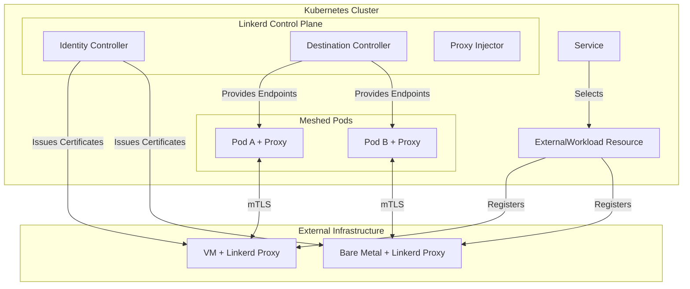
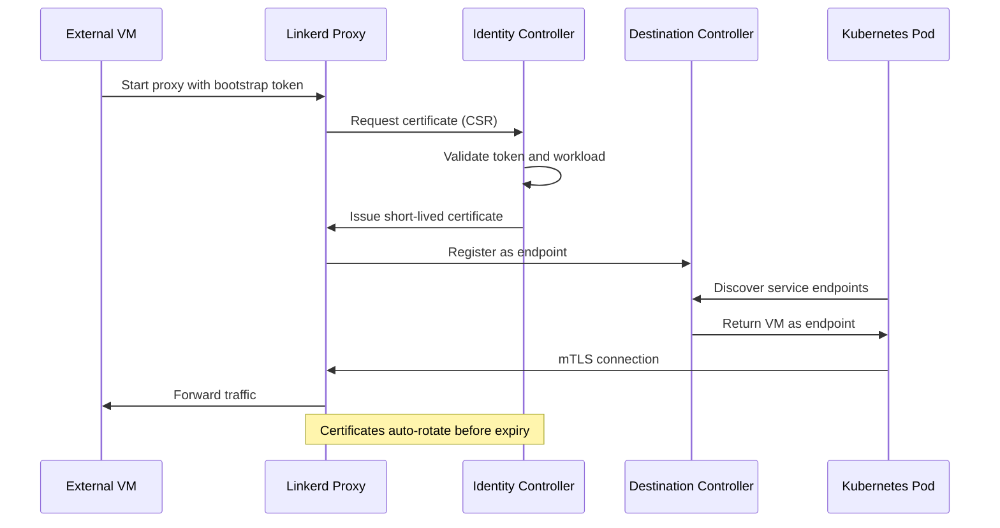
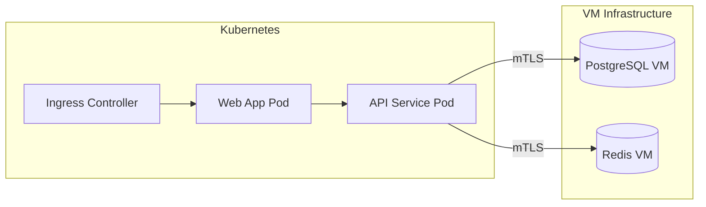

# How to Create Linkerd External Workloads

Author: [nawazdhandala](https://github.com/nawazdhandala)

Tags: Linkerd, Kubernetes, ServiceMesh, VMs

Description: Learn how to integrate non-Kubernetes workloads like VMs and bare metal servers into your Linkerd service mesh using External Workloads.

---

Many organizations run hybrid environments where Kubernetes coexists with virtual machines, bare metal servers, or legacy applications. Linkerd's External Workloads feature bridges this gap by extending the service mesh to non-Kubernetes resources, giving them the same mTLS encryption, observability, and traffic management capabilities as your in-cluster workloads.

## Understanding External Workloads

External Workloads let you register non-Kubernetes endpoints (VMs, bare metal servers, containers running outside Kubernetes) as part of your Linkerd mesh. These external endpoints can then communicate with Kubernetes services using automatic mTLS and participate in service discovery.



### Why External Workloads Matter

- **Gradual migration**: Migrate legacy VMs to Kubernetes incrementally while maintaining secure communication
- **Hybrid architectures**: Run stateful services on dedicated hardware while keeping stateless services in Kubernetes
- **Edge computing**: Extend mesh to edge locations that cannot run full Kubernetes clusters
- **Regulatory requirements**: Keep sensitive workloads on specific infrastructure while still integrating them

## Prerequisites

Before setting up External Workloads, ensure you have:

```bash
# Linkerd 2.14+ installed with External Workloads enabled
linkerd check

# Verify External Workloads feature is available
linkerd viz check

# The external machine must be able to reach the Kubernetes API server
# and the Linkerd identity controller
```

## The ExternalWorkload Resource

The ExternalWorkload CRD registers non-Kubernetes endpoints with Linkerd. Each ExternalWorkload represents a single external process or service instance.

### Basic ExternalWorkload Specification

```yaml
# external-workload.yaml
# Defines a VM running a payment processing service outside Kubernetes
apiVersion: workload.linkerd.io/v1beta1
kind: ExternalWorkload
metadata:
  name: payment-processor-vm-1
  namespace: payments
  labels:
    app: payment-processor        # Used for service discovery
    environment: production
    location: datacenter-east
spec:
  # The IP address of the external workload
  # This must be routable from within the Kubernetes cluster
  meshTLS:
    identity: spiffe://cluster.local/payment-processor
    serverName: payment-processor-vm-1.payments.svc.cluster.local

  # Workload identity for mTLS
  workloadIPs:
    - ip: 10.0.50.100             # Primary IP of the VM

  # Ports exposed by this workload
  ports:
    - name: http
      port: 8080
      protocol: TCP
    - name: metrics
      port: 9090
      protocol: TCP
```

### Advanced ExternalWorkload with Health Checks

```yaml
# external-workload-advanced.yaml
# VM with comprehensive health checking and metadata
apiVersion: workload.linkerd.io/v1beta1
kind: ExternalWorkload
metadata:
  name: database-replica-vm-2
  namespace: data
  labels:
    app: postgres-replica
    role: read-replica
    region: us-west
  annotations:
    linkerd.io/external-workload-version: "v1.2.0"
    prometheus.io/scrape: "true"
    prometheus.io/port: "9187"
spec:
  workloadIPs:
    - ip: 10.0.100.25

  ports:
    - name: postgres
      port: 5432
      protocol: TCP
    - name: metrics
      port: 9187
      protocol: TCP

  # Health probe configuration
  # The proxy will mark the workload unhealthy if probes fail
  probes:
    - path: /health
      port: 8081
      period: 10s
      timeout: 5s
      failureThreshold: 3
      successThreshold: 1
```

## Workload Group Registration

Workload Groups simplify managing multiple external workloads with similar configurations. Instead of creating individual ExternalWorkload resources, you define a template that applies to a group of external machines.

### Creating a Workload Group

```yaml
# workload-group.yaml
# Template for a fleet of cache servers running on VMs
apiVersion: workload.linkerd.io/v1beta1
kind: WorkloadGroup
metadata:
  name: redis-cache-fleet
  namespace: caching
  labels:
    app: redis
    tier: cache
spec:
  # Template applied to all workloads in this group
  template:
    metadata:
      labels:
        app: redis
        tier: cache
        mesh: linkerd
      annotations:
        linkerd.io/inject: enabled

    spec:
      ports:
        - name: redis
          port: 6379
          protocol: TCP
        - name: sentinel
          port: 26379
          protocol: TCP

      # Probes applied to all group members
      probes:
        - path: /health
          port: 8080
          period: 15s
          timeout: 3s
          failureThreshold: 3

  # Identity template for certificate issuance
  meshTLS:
    identity: spiffe://cluster.local/redis-cache
```

### Registering Workloads to a Group

Once you have a WorkloadGroup, register individual VMs:

```yaml
# redis-vm-1.yaml
# Individual VM joining the redis-cache-fleet group
apiVersion: workload.linkerd.io/v1beta1
kind: ExternalWorkload
metadata:
  name: redis-vm-1
  namespace: caching
  labels:
    workloadGroup: redis-cache-fleet    # Links to the WorkloadGroup
    instance: "1"
    datacenter: dc-1
spec:
  workloadIPs:
    - ip: 10.0.200.10

  # Additional ports beyond the group template
  ports:
    - name: exporter
      port: 9121
      protocol: TCP
---
# redis-vm-2.yaml
apiVersion: workload.linkerd.io/v1beta1
kind: ExternalWorkload
metadata:
  name: redis-vm-2
  namespace: caching
  labels:
    workloadGroup: redis-cache-fleet
    instance: "2"
    datacenter: dc-2
spec:
  workloadIPs:
    - ip: 10.0.200.11
```

## Identity and mTLS for External Workloads

Linkerd provides automatic mTLS for external workloads through its identity system. Each external workload receives a TLS certificate from the Linkerd identity controller.

### How Identity Works



### Setting Up Identity on External Workloads

First, generate a bootstrap token on the Kubernetes cluster:

```bash
# Create a service account for the external workload
kubectl create serviceaccount payment-processor-sa -n payments

# Generate a bootstrap token
# This token is used once to obtain the initial certificate
kubectl create token payment-processor-sa \
  --namespace payments \
  --duration=1h \
  > /tmp/bootstrap-token.txt

# Copy the token to the external VM securely
scp /tmp/bootstrap-token.txt admin@10.0.50.100:/etc/linkerd/
rm /tmp/bootstrap-token.txt
```

### Installing the Proxy on External Workloads

On the external VM, install and configure the Linkerd proxy:

```bash
#!/bin/bash
# install-linkerd-proxy.sh
# Run this on the external VM

# Set environment variables
export LINKERD_PROXY_VERSION="stable-2.14.0"
export LINKERD_IDENTITY_TRUST_ANCHORS="/etc/linkerd/ca.crt"
export LINKERD_PROXY_DESTINATION_SVC="destination.linkerd.svc.cluster.local:8086"
export LINKERD_PROXY_IDENTITY_SVC="identity.linkerd.svc.cluster.local:8080"

# Download the proxy binary
curl -sL "https://run.linkerd.io/install" | sh
export PATH=$PATH:$HOME/.linkerd2/bin

# Download the proxy specifically for external workloads
linkerd proxy-init --external-workload

# Create proxy configuration
cat > /etc/linkerd/proxy-config.yaml <<EOF
# Proxy configuration for external workload
admin:
  port: 4191

inbound:
  port: 4143

outbound:
  port: 4140

identity:
  trustAnchors: /etc/linkerd/ca.crt
  tokenPath: /etc/linkerd/bootstrap-token.txt

destination:
  endpoint: ${LINKERD_PROXY_DESTINATION_SVC}

workload:
  name: payment-processor-vm-1
  namespace: payments
EOF

# Start the proxy
linkerd-proxy --config /etc/linkerd/proxy-config.yaml &
```

### Trust Anchor Distribution

Export the trust anchor from your cluster and distribute it to external workloads:

```bash
# Export the trust anchor certificate
kubectl get configmap linkerd-identity-trust-roots \
  -n linkerd \
  -o jsonpath='{.data.ca-bundle\.crt}' > ca.crt

# Copy to all external workloads
for vm in 10.0.50.100 10.0.50.101 10.0.50.102; do
  scp ca.crt admin@${vm}:/etc/linkerd/ca.crt
done
```

## Service Discovery for External Endpoints

External workloads integrate with Kubernetes service discovery through standard Service resources. Create a Service that selects external workloads by their labels.

### Creating a Service for External Workloads

```yaml
# payment-service.yaml
# Service that includes both Kubernetes pods and external VMs
apiVersion: v1
kind: Service
metadata:
  name: payment-processor
  namespace: payments
spec:
  ports:
    - name: http
      port: 8080
      targetPort: 8080
      protocol: TCP

  # Selector matches both pods and ExternalWorkload labels
  selector:
    app: payment-processor
---
# This service will route to:
# 1. Any Kubernetes pods with label app=payment-processor
# 2. Any ExternalWorkloads with label app=payment-processor
```

### Headless Service for Direct Access

Use a headless service when you need direct access to specific external workload instances:

```yaml
# redis-headless-service.yaml
# Headless service for direct connection to specific Redis instances
apiVersion: v1
kind: Service
metadata:
  name: redis-cache
  namespace: caching
spec:
  clusterIP: None                # Headless service
  ports:
    - name: redis
      port: 6379
      targetPort: 6379
  selector:
    app: redis
    tier: cache
```

### EndpointSlice Integration

Linkerd automatically creates EndpointSlice entries for external workloads:

```bash
# View endpoints including external workloads
kubectl get endpointslices -n payments -l kubernetes.io/service-name=payment-processor

# Output shows both pod IPs and external workload IPs
# NAME                        ADDRESSTYPE   PORTS   ENDPOINTS              AGE
# payment-processor-abc123    IPv4          8080    10.244.1.5,10.0.50.100 5m
```

## Complete Example: Hybrid Application

Here is a complete example showing a web application in Kubernetes communicating with a database on a VM.

### Architecture



### Step 1: Create the Namespace and External Workloads

```yaml
# namespace.yaml
apiVersion: v1
kind: Namespace
metadata:
  name: hybrid-app
  annotations:
    linkerd.io/inject: enabled
---
# postgres-external.yaml
apiVersion: workload.linkerd.io/v1beta1
kind: ExternalWorkload
metadata:
  name: postgres-primary
  namespace: hybrid-app
  labels:
    app: postgres
    role: primary
spec:
  workloadIPs:
    - ip: 10.0.100.50
  ports:
    - name: postgres
      port: 5432
      protocol: TCP
  probes:
    - path: /health
      port: 8081
      period: 10s
---
# redis-external.yaml
apiVersion: workload.linkerd.io/v1beta1
kind: ExternalWorkload
metadata:
  name: redis-cache
  namespace: hybrid-app
  labels:
    app: redis
    role: cache
spec:
  workloadIPs:
    - ip: 10.0.100.51
  ports:
    - name: redis
      port: 6379
      protocol: TCP
```

### Step 2: Create Services

```yaml
# services.yaml
apiVersion: v1
kind: Service
metadata:
  name: postgres
  namespace: hybrid-app
spec:
  ports:
    - name: postgres
      port: 5432
      targetPort: 5432
  selector:
    app: postgres
---
apiVersion: v1
kind: Service
metadata:
  name: redis
  namespace: hybrid-app
spec:
  ports:
    - name: redis
      port: 6379
      targetPort: 6379
  selector:
    app: redis
```

### Step 3: Deploy the Kubernetes Application

```yaml
# api-deployment.yaml
apiVersion: apps/v1
kind: Deployment
metadata:
  name: api-server
  namespace: hybrid-app
spec:
  replicas: 3
  selector:
    matchLabels:
      app: api-server
  template:
    metadata:
      labels:
        app: api-server
      annotations:
        linkerd.io/inject: enabled
    spec:
      containers:
        - name: api
          image: myregistry/api-server:v1.0.0
          ports:
            - containerPort: 8080
          env:
            # The API connects to external workloads via service names
            # Linkerd handles mTLS automatically
            - name: DATABASE_URL
              value: "postgres://postgres:5432/myapp"
            - name: REDIS_URL
              value: "redis://redis:6379"
          resources:
            requests:
              cpu: 100m
              memory: 128Mi
            limits:
              cpu: 500m
              memory: 512Mi
```

### Step 4: Configure Traffic Policies

```yaml
# traffic-policy.yaml
# Server resource to configure traffic handling
apiVersion: policy.linkerd.io/v1beta3
kind: Server
metadata:
  name: postgres-server
  namespace: hybrid-app
spec:
  podSelector:
    matchLabels:
      app: postgres
  port: 5432
  proxyProtocol: opaque      # Database traffic is opaque TCP
---
# Authorization policy for database access
apiVersion: policy.linkerd.io/v1beta1
kind: ServerAuthorization
metadata:
  name: postgres-auth
  namespace: hybrid-app
spec:
  server:
    name: postgres-server
  client:
    meshTLS:
      serviceAccounts:
        - name: api-server          # Only API server can access postgres
```

### Step 5: Verify the Setup

```bash
# Check external workloads are registered
kubectl get externalworkloads -n hybrid-app

# Verify endpoints are discovered
kubectl get endpoints postgres redis -n hybrid-app

# Check mTLS is working
linkerd viz stat deploy/api-server -n hybrid-app

# View traffic to external workloads
linkerd viz edges deploy -n hybrid-app

# Test connectivity from a pod
kubectl exec -it deploy/api-server -n hybrid-app -- \
  curl -v http://postgres:5432/
```

## Troubleshooting External Workloads

### Common Issues and Solutions

**Problem: External workload not appearing in endpoints**

```bash
# Check the ExternalWorkload status
kubectl describe externalworkload payment-processor-vm-1 -n payments

# Verify labels match the service selector
kubectl get svc payment-processor -n payments -o yaml | grep -A5 selector
kubectl get externalworkload -n payments --show-labels

# Check if the proxy on the VM is running
ssh admin@10.0.50.100 'systemctl status linkerd-proxy'
```

**Problem: mTLS handshake failing**

```bash
# Verify trust anchors are correct
kubectl get configmap linkerd-identity-trust-roots -n linkerd -o yaml
ssh admin@10.0.50.100 'cat /etc/linkerd/ca.crt'

# Check certificate validity on the VM
ssh admin@10.0.50.100 'openssl x509 -in /etc/linkerd/proxy.crt -text -noout'

# Look at proxy logs
ssh admin@10.0.50.100 'journalctl -u linkerd-proxy -f'
```

**Problem: Workload unreachable from cluster**

```bash
# Test network connectivity
kubectl run debug --rm -it --image=nicolaka/netshoot -- \
  nc -zv 10.0.50.100 8080

# Check firewall rules on the VM
ssh admin@10.0.50.100 'iptables -L -n | grep 8080'

# Verify proxy is listening
ssh admin@10.0.50.100 'netstat -tlnp | grep linkerd'
```

### Monitoring External Workloads

```bash
# View metrics for external workloads
linkerd viz stat externalworkload -n payments

# Watch live traffic
linkerd viz tap externalworkload/payment-processor-vm-1 -n payments

# Check latency and success rates
linkerd viz routes svc/payment-processor -n payments
```

## Best Practices

1. **Use WorkloadGroups for fleet management** - Avoid duplicating configuration across similar external workloads

2. **Automate token rotation** - Bootstrap tokens should be short-lived and automated through CI/CD

3. **Monitor certificate expiry** - Set up alerts for certificate renewal failures

4. **Use network policies** - Restrict which pods can communicate with external workloads

5. **Keep proxies updated** - External workload proxies should match the control plane version

6. **Implement health checks** - Configure probes to remove unhealthy external workloads from load balancing

7. **Document network requirements** - External workloads need access to the Kubernetes API and Linkerd control plane ports

---

External Workloads transform Linkerd from a Kubernetes-only solution into a hybrid mesh that spans your entire infrastructure. Whether you are migrating legacy systems, running specialized hardware, or managing edge deployments, this feature ensures consistent security and observability across all your workloads.
