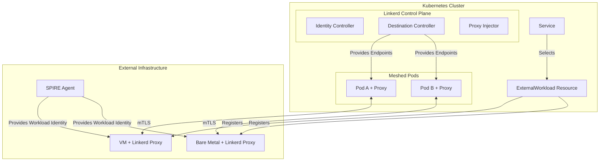
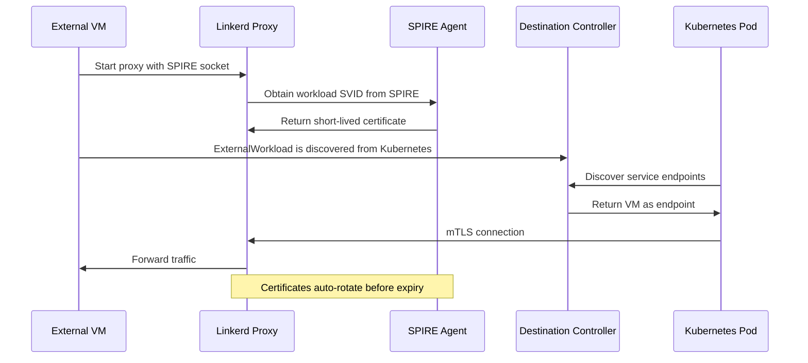
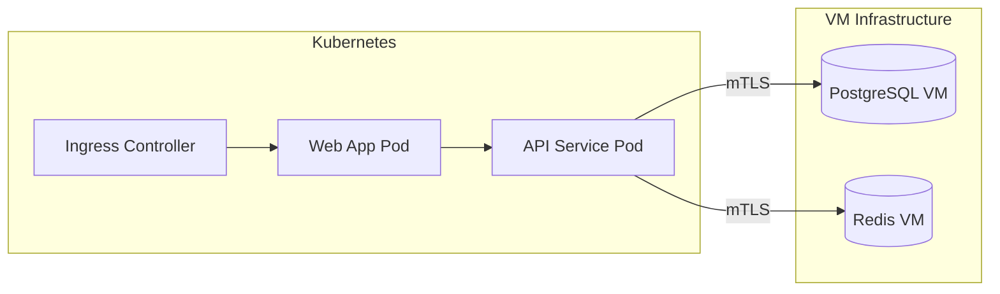

# How to Create Linkerd External Workloads

Author: [nawazdhandala](https://github.com/nawazdhandala)

Tags: Linkerd, Kubernetes, ServiceMesh, VMs

Description: Learn how to integrate non-Kubernetes workloads like VMs and bare metal servers into your Linkerd service mesh using External Workloads.

---

Many organizations run hybrid environments where Kubernetes coexists with virtual machines, bare metal servers, or legacy applications. Linkerd's External Workloads feature bridges this gap by extending the service mesh to non-Kubernetes resources, giving them the same mTLS encryption, observability, and traffic management capabilities as your in-cluster workloads.

## Understanding External Workloads

External Workloads let you register non-Kubernetes endpoints (VMs, bare metal servers, containers running outside Kubernetes) as part of your Linkerd mesh. These external endpoints can then communicate with Kubernetes services using automatic mTLS and participate in service discovery.


```mermaid
flowchart TB
    subgraph Kubernetes Cluster
        subgraph Linkerd Control Plane
            Identity[Identity Controller]
            Destination[Destination Controller]
            ProxyInjector[Proxy Injector]
        end

        subgraph Meshed Pods
            PodA[Pod A + Proxy]
            PodB[Pod B + Proxy]
        end

        EW[ExternalWorkload Resource]
        SVC[Service]
    end

    subgraph External Infrastructure
        SPIRE[SPIRE Agent]
        VM1[VM + Linkerd Proxy]
        VM2[Bare Metal + Linkerd Proxy]
    end

    SPIRE -->|Provides Workload Identity| VM1
    SPIRE -->|Provides Workload Identity| VM2
    Destination -->|Provides Endpoints| PodA
    Destination -->|Provides Endpoints| PodB
    EW -->|Registers| VM1
    EW -->|Registers| VM2
    SVC -->|Selects| EW
    PodA <-->|mTLS| VM1
    PodB <-->|mTLS| VM2
```

### Why External Workloads Matter

- **Gradual migration**: Migrate legacy VMs to Kubernetes incrementally while maintaining secure communication
- **Hybrid architectures**: Run stateful services on dedicated hardware while keeping stateless services in Kubernetes
- **Edge computing**: Extend mesh to edge locations that cannot run full Kubernetes clusters
- **Regulatory requirements**: Keep sensitive workloads on specific infrastructure while still integrating them

## Prerequisites

Before setting up External Workloads, ensure you have:

```bash
# A Linkerd version with mesh expansion support installed

linkerd check

# Verify the ExternalWorkload CRD is available
kubectl api-resources | grep externalworkloads

# The external machine must be able to resolve in-cluster DNS names
# and have IP connectivity to the pods it will communicate with
```

## The ExternalWorkload Resource

The ExternalWorkload CRD registers non-Kubernetes endpoints with Linkerd. Each ExternalWorkload represents a single external process or service instance.

### Basic ExternalWorkload Specification

```yaml
# external-workload.yaml
# Defines a VM running a payment processing service outside Kubernetes
apiVersion: workload.linkerd.io/v1beta1
kind: ExternalWorkload
metadata:
  name: payment-processor-vm-1
  namespace: payments
  labels:
    app: payment-processor        # Used for service discovery
    environment: production
    location: datacenter-east
spec:
  # Workload identity for mTLS
  meshTLS:
    identity: spiffe://root.linkerd.cluster.local/payment-processor-vm-1
    serverName: payment-processor-vm-1.cluster.local

  # The IP address of the external workload
  # This must be routable from within the Kubernetes cluster
  workloadIPs:
    - ip: 10.0.50.100             # Primary IP of the VM

  # Ports exposed by this workload
  ports:
    - name: http
      port: 8080
      protocol: TCP
    - name: metrics
      port: 9090
      protocol: TCP
```

### ExternalWorkload with Metadata

```yaml
# external-workload-advanced.yaml
# VM with metadata and multiple exposed ports
apiVersion: workload.linkerd.io/v1beta1
kind: ExternalWorkload
metadata:
  name: database-replica-vm-2
  namespace: data
  labels:
    app: postgres-replica
    role: read-replica
    region: us-west
  annotations:
    linkerd.io/external-workload-version: "v1.2.0"
    prometheus.io/scrape: "true"
    prometheus.io/port: "9187"
spec:
  meshTLS:
    identity: spiffe://root.linkerd.cluster.local/database-replica-vm-2
    serverName: database-replica-vm-2.cluster.local

  workloadIPs:
    - ip: 10.0.100.25

  ports:
    - name: postgres
      port: 5432
      protocol: TCP
    - name: metrics
      port: 9187
      protocol: TCP
```

## Managing Multiple ExternalWorkloads

Open-source Linkerd models each off-cluster instance with its own `ExternalWorkload` resource. To manage a fleet, create one resource per VM and use shared labels so a Kubernetes `Service` can select the whole group.

### Creating a Labeled Fleet

```yaml
# redis-vm-1.yaml
# Individual VM in the redis-cache fleet
apiVersion: workload.linkerd.io/v1beta1
kind: ExternalWorkload
metadata:
  name: redis-vm-1
  namespace: caching
  labels:
    app: redis
    tier: cache
    instance: "1"
    datacenter: dc-1
spec:
  meshTLS:
    identity: spiffe://root.linkerd.cluster.local/redis-vm-1
    serverName: redis-vm-1.cluster.local
  workloadIPs:
    - ip: 10.0.200.10
  ports:
    - name: redis
      port: 6379
      protocol: TCP
---
# redis-vm-2.yaml
apiVersion: workload.linkerd.io/v1beta1
kind: ExternalWorkload
metadata:
  name: redis-vm-2
  namespace: caching
  labels:
    app: redis
    tier: cache
    instance: "2"
    datacenter: dc-2
spec:
  meshTLS:
    identity: spiffe://root.linkerd.cluster.local/redis-vm-2
    serverName: redis-vm-2.cluster.local
  workloadIPs:
    - ip: 10.0.200.11
  ports:
    - name: redis
      port: 6379
      protocol: TCP
```

## Identity and mTLS for External Workloads

Linkerd provides mTLS for external workloads by using identities rooted in the same trust anchor as the cluster. In the documented mesh expansion flow, the proxy on the external machine obtains its workload identity from SPIRE, and Linkerd uses the `meshTLS` identity in the `ExternalWorkload` resource for discovery and policy.

### How Identity Works


```mermaid
sequenceDiagram
    participant VM as External VM
    participant Proxy as Linkerd Proxy
    participant Identity as SPIRE Agent
    participant Destination as Destination Controller
    participant Pod as Kubernetes Pod

    VM->>Proxy: Start proxy with SPIRE socket
    Proxy->>Identity: Obtain workload SVID from SPIRE
    Identity->>Proxy: Return short-lived certificate
    VM->>Destination: ExternalWorkload is discovered from Kubernetes

    Pod->>Destination: Discover service endpoints
    Destination->>Pod: Return VM as endpoint
    Pod->>Proxy: mTLS connection
    Proxy->>VM: Forward traffic

    Note over Proxy,Identity: Certificates auto-rotate before expiry
```

### Setting Up Identity on External Workloads

First, install and configure SPIRE on the external machine with a trust domain and trust anchor that match your Linkerd installation. For local testing, Linkerd's mesh expansion guide uses `root.linkerd.cluster.local` as the trust domain:

```bash
# Place your Linkerd trust anchor and key where SPIRE can use them
sudo mkdir -p /opt/SPIRE/certs
sudo cp ca.crt ca.key /opt/SPIRE/certs/

# After starting the SPIRE server and agent, create a registration entry
# for the proxy process on the external host.
/opt/SPIRE/bin/spire-server entry create \
  -spiffeID spiffe://root.linkerd.cluster.local/payment-processor-vm-1 \
  -selector unix:uid:2102 \
  -parentID spiffe://root.linkerd.cluster.local/spire/agent/join_token/node
```

### Installing the Proxy on External Workloads

On the external VM, install the Linkerd proxy binary, configure traffic redirection, and start the proxy with environment variables that point it at the destination service, policy service, and SPIRE socket:

```bash
#!/bin/bash
# install-linkerd-proxy.sh
# Run this on the external VM

# Extract the proxy binary for your architecture from the Linkerd proxy image
LINKERD_VERSION=edge-26.6.1
mkdir -p /opt/linkerd-proxy && cd /opt/linkerd-proxy
id=$(docker create cr.l5d.io/linkerd/proxy:${LINKERD_VERSION})
docker cp "$id":/usr/lib/linkerd/linkerd2-proxy ./linkerd-proxy
docker rm -v "$id"

# Configure iptables so inbound and outbound workload traffic is routed through the proxy.
PROXY_INBOUND_PORT=4143
PROXY_OUTBOUND_PORT=4140
PROXY_USER_UID=$(id -u linkerd-proxy)
INBOUND_PORTS_TO_IGNORE="4190,4191,4567,4568"
OUTBOUND_PORTS_TO_IGNORE="4567,4568"

sudo iptables -t nat -N PROXY_INIT_REDIRECT
sudo iptables -t nat -A PROXY_INIT_REDIRECT -p tcp --match multiport --dports "$INBOUND_PORTS_TO_IGNORE" -j RETURN
sudo iptables -t nat -A PROXY_INIT_REDIRECT -p tcp -j REDIRECT --to-port "$PROXY_INBOUND_PORT"
sudo iptables -t nat -A PREROUTING -j PROXY_INIT_REDIRECT

sudo iptables -t nat -N PROXY_INIT_OUTPUT
sudo iptables -t nat -A PROXY_INIT_OUTPUT -m owner --uid-owner "$PROXY_USER_UID" -j RETURN
sudo iptables -t nat -A PROXY_INIT_OUTPUT -o lo -j RETURN
sudo iptables -t nat -A PROXY_INIT_OUTPUT -p tcp --match multiport --dports "$OUTBOUND_PORTS_TO_IGNORE" -j RETURN
sudo iptables -t nat -A PROXY_INIT_OUTPUT -p tcp -j REDIRECT --to-port "$PROXY_OUTBOUND_PORT"
sudo iptables -t nat -A OUTPUT -j PROXY_INIT_OUTPUT

# Start the proxy with the same trust anchor used by the cluster and SPIRE
export LINKERD2_PROXY_IDENTITY_SERVER_ID="spiffe://root.linkerd.cluster.local/payment-processor-vm-1"
export LINKERD2_PROXY_IDENTITY_SERVER_NAME="payment-processor-vm-1.cluster.local"
export LINKERD2_PROXY_POLICY_WORKLOAD="{\"ns\":\"payments\", \"external_workload\":\"payment-processor-vm-1\"}"
export LINKERD2_PROXY_DESTINATION_CONTEXT="{\"ns\":\"payments\", \"nodeName\":\"payment-processor-vm-1\", \"external_workload\":\"payment-processor-vm-1\"}"
export LINKERD2_PROXY_DESTINATION_SVC_ADDR="linkerd-dst-headless.linkerd.svc.cluster.local.:8086"
export LINKERD2_PROXY_DESTINATION_SVC_NAME="linkerd-destination.linkerd.serviceaccount.identity.linkerd.cluster.local"
export LINKERD2_PROXY_POLICY_SVC_ADDR="linkerd-policy.linkerd.svc.cluster.local.:8090"
export LINKERD2_PROXY_POLICY_SVC_NAME="linkerd-destination.linkerd.serviceaccount.identity.linkerd.cluster.local"
export LINKERD2_PROXY_IDENTITY_TRUST_ANCHORS="$(cat /opt/SPIRE/certs/ca.crt)"
export LINKERD2_PROXY_IDENTITY_SPIRE_SOCKET="unix:///tmp/spire-agent/public/api.sock"

sudo -u linkerd-proxy ./linkerd-proxy
```

### Trust Anchor Distribution

The external machine and the cluster must share a trust anchor. If you generated your Linkerd trust anchor during installation, distribute the same `ca.crt` to SPIRE on each external workload:

```bash
# Copy to all external workloads
for vm in 10.0.50.100 10.0.50.101 10.0.50.102; do
  scp ca.crt admin@${vm}:/opt/SPIRE/certs/ca.crt
done
```

## Service Discovery for External Endpoints

External workloads integrate with Kubernetes service discovery through standard Service resources. Create a Service that selects external workloads by their labels.

### Creating a Service for External Workloads

```yaml
# payment-service.yaml
# Service that includes both Kubernetes pods and external VMs
apiVersion: v1
kind: Service
metadata:
  name: payment-processor
  namespace: payments
spec:
  ports:
    - name: http
      port: 8080
      targetPort: 8080
      protocol: TCP

  # Selector matches both pods and ExternalWorkload labels
  selector:
    app: payment-processor
---
# This service will route to:
# 1. Any Kubernetes pods with label app=payment-processor
# 2. Any ExternalWorkloads with label app=payment-processor
```

### Headless Service for Direct Access

Use a headless service when you need direct access to specific external workload instances:

```yaml
# redis-headless-service.yaml
# Headless service for direct connection to specific Redis instances
apiVersion: v1
kind: Service
metadata:
  name: redis-cache
  namespace: caching
spec:
  clusterIP: None                # Headless service
  ports:
    - name: redis
      port: 6379
      targetPort: 6379
  selector:
    app: redis
    tier: cache
```

### EndpointSlice Integration

Linkerd automatically creates EndpointSlice entries for external workloads:

```bash
# View endpoints including external workloads
kubectl get endpointslices -n payments -l kubernetes.io/service-name=payment-processor

# Output shows both pod IPs and external workload IPs
# NAME                        ADDRESSTYPE   PORTS   ENDPOINTS              AGE
# payment-processor-abc123    IPv4          8080    10.244.1.5,10.0.50.100 5m
```

## Complete Example: Hybrid Application

Here is a complete example showing a web application in Kubernetes communicating with a database on a VM.

### Architecture


```mermaid
flowchart LR
    subgraph Kubernetes
        Ingress[Ingress Controller]
        Web[Web App Pod]
        API[API Service Pod]
    end

    subgraph VM Infrastructure
        DB[(PostgreSQL VM)]
        Cache[(Redis VM)]
    end

    Ingress --> Web
    Web --> API
    API -->|mTLS| DB
    API -->|mTLS| Cache
```

### Step 1: Create the Namespace and External Workloads

```yaml
# namespace.yaml
apiVersion: v1
kind: Namespace
metadata:
  name: hybrid-app
  annotations:
    linkerd.io/inject: enabled
---
# postgres-external.yaml
apiVersion: workload.linkerd.io/v1beta1
kind: ExternalWorkload
metadata:
  name: postgres-primary
  namespace: hybrid-app
  labels:
    app: postgres
    role: primary
spec:
  meshTLS:
    identity: spiffe://root.linkerd.cluster.local/postgres-primary
    serverName: postgres-primary.cluster.local
  workloadIPs:
    - ip: 10.0.100.50
  ports:
    - name: postgres
      port: 5432
      protocol: TCP
---
# redis-external.yaml
apiVersion: workload.linkerd.io/v1beta1
kind: ExternalWorkload
metadata:
  name: redis-cache
  namespace: hybrid-app
  labels:
    app: redis
    role: cache
spec:
  meshTLS:
    identity: spiffe://root.linkerd.cluster.local/redis-cache
    serverName: redis-cache.cluster.local
  workloadIPs:
    - ip: 10.0.100.51
  ports:
    - name: redis
      port: 6379
      protocol: TCP
```

### Step 2: Create Services

```yaml
# services.yaml
apiVersion: v1
kind: Service
metadata:
  name: postgres
  namespace: hybrid-app
spec:
  ports:
    - name: postgres
      port: 5432
      targetPort: 5432
  selector:
    app: postgres
---
apiVersion: v1
kind: Service
metadata:
  name: redis
  namespace: hybrid-app
spec:
  ports:
    - name: redis
      port: 6379
      targetPort: 6379
  selector:
    app: redis
```

### Step 3: Deploy the Kubernetes Application

```yaml
# api-deployment.yaml
apiVersion: v1
kind: ServiceAccount
metadata:
  name: api-server
  namespace: hybrid-app
---
apiVersion: apps/v1
kind: Deployment
metadata:
  name: api-server
  namespace: hybrid-app
spec:
  replicas: 3
  selector:
    matchLabels:
      app: api-server
  template:
    metadata:
      labels:
        app: api-server
      annotations:
        linkerd.io/inject: enabled
    spec:
      serviceAccountName: api-server
      containers:
        - name: api
          image: myregistry/api-server:v1.0.0
          ports:
            - containerPort: 8080
          env:
            # The API connects to external workloads via service names
            # Linkerd handles mTLS automatically
            - name: DATABASE_URL
              value: "postgres://postgres:5432/myapp"
            - name: REDIS_URL
              value: "redis://redis:6379"
          resources:
            requests:
              cpu: 100m
              memory: 128Mi
            limits:
              cpu: 500m
              memory: 512Mi
```

### Step 4: Configure Traffic Policies

```yaml
# traffic-policy.yaml
# Server resource to configure traffic handling
apiVersion: policy.linkerd.io/v1beta2
kind: Server
metadata:
  name: postgres-server
  namespace: hybrid-app
spec:
  externalWorkloadSelector:
    matchLabels:
      app: postgres
  port: 5432
  proxyProtocol: opaque      # Database traffic is opaque TCP
---
# Authorization policy for database access
apiVersion: policy.linkerd.io/v1beta1
kind: ServerAuthorization
metadata:
  name: postgres-auth
  namespace: hybrid-app
spec:
  server:
    name: postgres-server
  client:
    meshTLS:
      serviceAccounts:
        - name: api-server          # Only API server can access postgres
```

### Step 5: Verify the Setup

```bash
# Check external workloads are registered
kubectl get externalworkloads -n hybrid-app

# Verify EndpointSlices are discovered
kubectl get endpointslices -n hybrid-app \
  -l kubernetes.io/service-name=postgres

# Check mTLS is working
linkerd viz stat deploy/api-server -n hybrid-app

# View traffic to external workloads
linkerd viz edges deploy -n hybrid-app

# Test connectivity from a pod
kubectl exec -it deploy/api-server -n hybrid-app -- \
  nc -zv postgres 5432
```

## Troubleshooting External Workloads

### Common Issues and Solutions

**Problem: External workload not appearing in endpoints**

```bash
# Check the ExternalWorkload status
kubectl describe externalworkload payment-processor-vm-1 -n payments

# Verify labels match the service selector
kubectl get svc payment-processor -n payments -o yaml | grep -A5 selector
kubectl get externalworkload -n payments --show-labels

# Check if the proxy on the VM is running
ssh admin@10.0.50.100 'systemctl status linkerd-proxy'
```

**Problem: mTLS handshake failing**

```bash
# Verify trust anchors are correct
kubectl get configmap linkerd-identity-trust-roots -n linkerd -o yaml
ssh admin@10.0.50.100 'cat /opt/SPIRE/certs/ca.crt'

# Check the SPIRE agent and proxy logs on the VM
ssh admin@10.0.50.100 'systemctl status spire-agent'

# Look at proxy logs
ssh admin@10.0.50.100 'journalctl -u linkerd-proxy -f'
```

**Problem: Workload unreachable from cluster**

```bash
# Test network connectivity
kubectl run debug --rm -it --image=nicolaka/netshoot -- \
  nc -zv 10.0.50.100 8080

# Check firewall rules on the VM
ssh admin@10.0.50.100 'iptables -L -n | grep 8080'

# Verify proxy is listening
ssh admin@10.0.50.100 'netstat -tlnp | grep linkerd'
```

### Monitoring External Workloads

```bash
# View metrics for the service that selects external workloads
linkerd viz stat svc/payment-processor -n payments

# Inspect Linkerd's discovered endpoints
linkerd diagnostics endpoints payment-processor.payments.svc.cluster.local:8080

# Check latency and success rates
linkerd viz routes svc/payment-processor -n payments
```

## Best Practices

1. **Use consistent labels for fleet management** - Keep labels consistent across similar external workloads so Services and policies select the right instances

2. **Automate identity provisioning** - SPIRE registration entries and trust anchor distribution should be managed through automation

3. **Monitor certificate expiry** - Set up alerts for certificate renewal failures

4. **Use network policies** - Restrict which pods can communicate with external workloads

5. **Keep proxies updated** - External workload proxies should match the control plane version

6. **Monitor workload health outside Kubernetes** - Open-source Linkerd discovers ExternalWorkloads from their Kubernetes resources, so use host-level monitoring to detect unhealthy VMs

7. **Document network requirements** - External workloads need DNS and network connectivity to in-cluster workloads and the Linkerd destination and policy services

---

External Workloads transform Linkerd from a Kubernetes-only solution into a hybrid mesh that spans your entire infrastructure. Whether you are migrating legacy systems, running specialized hardware, or managing edge deployments, this feature ensures consistent security and observability across all your workloads.
