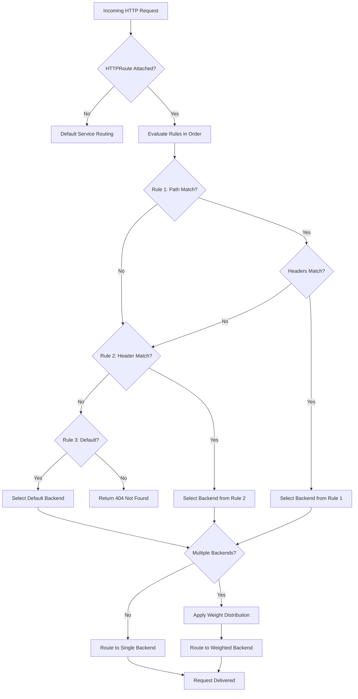
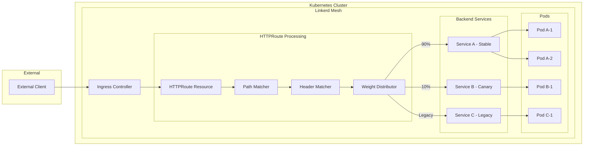

# How to Build Linkerd HTTPRoute

Author: [nawazdhandala](https://github.com/nawazdhandala)

Tags: Linkerd, Kubernetes, ServiceMesh, Routing

Description: Learn how to use Linkerd HTTPRoute for advanced traffic routing with path matching, header-based routing, and weighted backend distribution.

---

## Introduction

Linkerd HTTPRoute is a powerful resource that enables fine-grained control over HTTP traffic routing within your Kubernetes cluster. Part of the Gateway API specification, HTTPRoute allows you to define sophisticated routing rules based on paths, headers, and other request attributes. This guide walks you through building and configuring HTTPRoute resources for production-grade traffic management.

## Understanding HTTPRoute Resource Specification

The HTTPRoute resource follows the Gateway API specification and integrates seamlessly with Linkerd's service mesh capabilities. Here is the basic structure:

```yaml
# HTTPRoute basic structure
# This resource defines how HTTP traffic should be routed to backend services
apiVersion: policy.linkerd.io/v1beta3
kind: HTTPRoute
metadata:
  name: my-http-route
  namespace: default
spec:
  # parentRefs defines which gateway or service this route attaches to
  parentRefs:
    - name: my-service
      kind: Service
      group: core
      port: 8080
  # rules define the routing logic
  rules:
    - matches:
        - path:
            type: PathPrefix
            value: /api
      backendRefs:
        - name: api-service
          port: 80
```

### Key Components

1. **parentRefs**: Specifies the parent resource (Service or Gateway) that this route attaches to
2. **rules**: Contains matching conditions and backend references
3. **matches**: Defines criteria for request matching
4. **backendRefs**: Specifies target services for matched requests

## Path and Header Matching Rules

HTTPRoute supports multiple matching strategies to route traffic based on request characteristics.

### Path Matching

Linkerd HTTPRoute supports three path matching types:

```yaml
# Path matching examples
apiVersion: policy.linkerd.io/v1beta3
kind: HTTPRoute
metadata:
  name: path-based-routing
  namespace: default
spec:
  parentRefs:
    - name: frontend-service
      kind: Service
      group: core
      port: 80
  rules:
    # Exact path match - only matches /api/v1/users exactly
    - matches:
        - path:
            type: Exact
            value: /api/v1/users
      backendRefs:
        - name: users-service
          port: 8080

    # PathPrefix match - matches any path starting with /api/v2
    - matches:
        - path:
            type: PathPrefix
            value: /api/v2
      backendRefs:
        - name: api-v2-service
          port: 8080

    # RegularExpression match - matches paths like /users/123/profile
    - matches:
        - path:
            type: RegularExpression
            value: "^/users/[0-9]+/profile$"
      backendRefs:
        - name: profile-service
          port: 8080
```

### Header Matching

Route traffic based on HTTP headers for scenarios like A/B testing or canary deployments:

```yaml
# Header-based routing for canary deployments
apiVersion: policy.linkerd.io/v1beta3
kind: HTTPRoute
metadata:
  name: header-based-routing
  namespace: default
spec:
  parentRefs:
    - name: api-gateway
      kind: Service
      group: core
      port: 443
  rules:
    # Route beta users to canary deployment
    - matches:
        - headers:
            - name: X-User-Group
              type: Exact
              value: beta-testers
      backendRefs:
        - name: api-canary
          port: 8080

    # Route requests with specific feature flag
    - matches:
        - headers:
            - name: X-Feature-Flag
              type: RegularExpression
              value: "^feature-.*-enabled$"
      backendRefs:
        - name: feature-branch-service
          port: 8080

    # Default route for all other traffic
    - backendRefs:
        - name: api-stable
          port: 8080
```

### Combining Multiple Match Conditions

You can combine path and header matches for precise routing control:

```yaml
# Combined path and header matching
apiVersion: policy.linkerd.io/v1beta3
kind: HTTPRoute
metadata:
  name: combined-matching
  namespace: default
spec:
  parentRefs:
    - name: main-service
      kind: Service
      group: core
      port: 80
  rules:
    # Match requests to /api with specific version header
    # Both conditions must be true (AND logic within a match)
    - matches:
        - path:
            type: PathPrefix
            value: /api
          headers:
            - name: X-API-Version
              type: Exact
              value: "2.0"
          method: POST
      backendRefs:
        - name: api-v2-post-handler
          port: 8080

    # Multiple matches act as OR conditions
    # Either match will route to the same backend
    - matches:
        - path:
            type: PathPrefix
            value: /legacy
        - headers:
            - name: X-Legacy-Client
              type: Exact
              value: "true"
      backendRefs:
        - name: legacy-service
          port: 8080
```

## Route Selection Flow

The following diagram illustrates how Linkerd processes HTTPRoute rules to select the appropriate backend:



## Backend References and Weight Distribution

Weight distribution enables traffic splitting across multiple backends, essential for canary deployments and blue-green releases.

### Basic Weight Distribution

```yaml
# Canary deployment with 90/10 traffic split
apiVersion: policy.linkerd.io/v1beta3
kind: HTTPRoute
metadata:
  name: canary-deployment
  namespace: production
spec:
  parentRefs:
    - name: product-service
      kind: Service
      group: core
      port: 80
  rules:
    - matches:
        - path:
            type: PathPrefix
            value: /
      backendRefs:
        # Stable version receives 90% of traffic
        - name: product-service-stable
          port: 8080
          weight: 90
        # Canary version receives 10% of traffic
        - name: product-service-canary
          port: 8080
          weight: 10
```

### Progressive Rollout Configuration

```yaml
# Blue-green deployment with gradual traffic shift
apiVersion: policy.linkerd.io/v1beta3
kind: HTTPRoute
metadata:
  name: blue-green-rollout
  namespace: production
  labels:
    deployment-stage: phase-2
spec:
  parentRefs:
    - name: checkout-service
      kind: Service
      group: core
      port: 443
  rules:
    - backendRefs:
        # Blue (current production) - 70%
        - name: checkout-blue
          port: 8080
          weight: 70
        # Green (new version) - 30%
        - name: checkout-green
          port: 8080
          weight: 30
```

### Traffic Mirroring with Weights

```yaml
# Traffic mirroring for testing new service versions
apiVersion: policy.linkerd.io/v1beta3
kind: HTTPRoute
metadata:
  name: traffic-mirror-config
  namespace: staging
spec:
  parentRefs:
    - name: order-service
      kind: Service
      group: core
      port: 80
  rules:
    - matches:
        - path:
            type: PathPrefix
            value: /orders
      backendRefs:
        # Primary backend handles all real traffic
        - name: order-service-primary
          port: 8080
          weight: 100
      filters:
        # Mirror 10% of traffic to shadow service for testing
        - type: RequestMirror
          requestMirror:
            backendRef:
              name: order-service-shadow
              port: 8080
            percent: 10
```

## Request and Response Header Modification

HTTPRoute allows you to modify headers on requests and responses, enabling tracing, authentication injection, and debugging.

### Request Header Modification

```yaml
# Adding and removing request headers
apiVersion: policy.linkerd.io/v1beta3
kind: HTTPRoute
metadata:
  name: request-header-modification
  namespace: default
spec:
  parentRefs:
    - name: api-gateway
      kind: Service
      group: core
      port: 80
  rules:
    - matches:
        - path:
            type: PathPrefix
            value: /api
      filters:
        # RequestHeaderModifier filter for request headers
        - type: RequestHeaderModifier
          requestHeaderModifier:
            # Add new headers to the request
            add:
              - name: X-Request-ID
                value: "${request.id}"
              - name: X-Forwarded-Service
                value: api-gateway
              - name: X-Environment
                value: production
            # Set headers (overwrites if exists)
            set:
              - name: X-API-Version
                value: "2.0"
            # Remove sensitive headers before forwarding
            remove:
              - X-Internal-Token
              - X-Debug-Mode
      backendRefs:
        - name: api-backend
          port: 8080
```

### Response Header Modification

```yaml
# Modifying response headers
apiVersion: policy.linkerd.io/v1beta3
kind: HTTPRoute
metadata:
  name: response-header-modification
  namespace: default
spec:
  parentRefs:
    - name: web-service
      kind: Service
      group: core
      port: 80
  rules:
    - matches:
        - path:
            type: PathPrefix
            value: /
      filters:
        # ResponseHeaderModifier filter for response headers
        - type: ResponseHeaderModifier
          responseHeaderModifier:
            # Add security headers to all responses
            add:
              - name: X-Content-Type-Options
                value: nosniff
              - name: X-Frame-Options
                value: DENY
              - name: Strict-Transport-Security
                value: "max-age=31536000; includeSubDomains"
            # Set cache control headers
            set:
              - name: Cache-Control
                value: "no-store, no-cache, must-revalidate"
            # Remove server identification headers
            remove:
              - Server
              - X-Powered-By
      backendRefs:
        - name: web-backend
          port: 8080
```

### Combined Header Operations

```yaml
# Complete header modification example for microservices
apiVersion: policy.linkerd.io/v1beta3
kind: HTTPRoute
metadata:
  name: full-header-config
  namespace: microservices
spec:
  parentRefs:
    - name: ingress-service
      kind: Service
      group: core
      port: 443
  rules:
    # API traffic with full header management
    - matches:
        - path:
            type: PathPrefix
            value: /api/v2
          headers:
            - name: Authorization
              type: RegularExpression
              value: "^Bearer .+"
      filters:
        # Modify request headers going to backend
        - type: RequestHeaderModifier
          requestHeaderModifier:
            add:
              - name: X-Authenticated
                value: "true"
              - name: X-Request-Start
                value: "${timestamp}"
            remove:
              - Cookie
              - X-Forwarded-For
        # Modify response headers coming back
        - type: ResponseHeaderModifier
          responseHeaderModifier:
            add:
              - name: X-Response-Time
                value: "${latency_ms}ms"
            set:
              - name: X-Served-By
                value: api-v2-cluster
      backendRefs:
        - name: api-v2-service
          port: 8080
          weight: 100
```

## Complete Production Example

Here is a comprehensive HTTPRoute configuration combining all features for a production microservices architecture:

```yaml
# Production-ready HTTPRoute configuration
apiVersion: policy.linkerd.io/v1beta3
kind: HTTPRoute
metadata:
  name: production-api-routes
  namespace: production
  labels:
    app: api-gateway
    environment: production
  annotations:
    linkerd.io/created-by: platform-team
spec:
  parentRefs:
    - name: api-gateway-service
      kind: Service
      group: core
      port: 443

  rules:
    # Health check endpoint - no authentication required
    - matches:
        - path:
            type: Exact
            value: /health
          method: GET
      backendRefs:
        - name: health-check-service
          port: 8080

    # API v2 with canary deployment
    - matches:
        - path:
            type: PathPrefix
            value: /api/v2
          headers:
            - name: X-Canary
              type: Exact
              value: "true"
      filters:
        - type: RequestHeaderModifier
          requestHeaderModifier:
            add:
              - name: X-Deployment-Ring
                value: canary
      backendRefs:
        - name: api-v2-canary
          port: 8080

    # API v2 production traffic with weighted distribution
    - matches:
        - path:
            type: PathPrefix
            value: /api/v2
      filters:
        - type: RequestHeaderModifier
          requestHeaderModifier:
            add:
              - name: X-Deployment-Ring
                value: stable
        - type: ResponseHeaderModifier
          responseHeaderModifier:
            add:
              - name: X-API-Version
                value: "2.0"
      backendRefs:
        - name: api-v2-stable
          port: 8080
          weight: 95
        - name: api-v2-canary
          port: 8080
          weight: 5

    # Legacy API v1 - route to deprecated service
    - matches:
        - path:
            type: PathPrefix
            value: /api/v1
      filters:
        - type: ResponseHeaderModifier
          responseHeaderModifier:
            add:
              - name: Deprecation
                value: "true"
              - name: Sunset
                value: "2026-06-01"
      backendRefs:
        - name: api-v1-legacy
          port: 8080

    # WebSocket connections
    - matches:
        - path:
            type: PathPrefix
            value: /ws
          headers:
            - name: Upgrade
              type: Exact
              value: websocket
      backendRefs:
        - name: websocket-service
          port: 8080

    # Default fallback route
    - backendRefs:
        - name: default-backend
          port: 8080
```

## Traffic Flow Architecture

The following diagram shows how HTTPRoute integrates with Linkerd and Kubernetes services:



## Troubleshooting and Validation

Use these commands to validate and debug your HTTPRoute configurations:

```bash
# Check HTTPRoute status
kubectl get httproutes -n production

# Describe HTTPRoute for detailed status
kubectl describe httproute production-api-routes -n production

# Verify Linkerd proxy recognizes the route
linkerd viz routes deploy/api-gateway -n production

# Check route metrics
linkerd viz stat httproute/production-api-routes -n production

# Test route matching with curl
curl -H "X-Canary: true" https://api.example.com/api/v2/users

# View effective routes for a service
linkerd viz routes svc/api-gateway-service -n production
```

## Conclusion

Linkerd HTTPRoute provides a robust, declarative approach to managing HTTP traffic in Kubernetes. By leveraging path matching, header-based routing, weight distribution, and header modification, you can implement sophisticated traffic management strategies including canary deployments, A/B testing, and gradual rollouts. The Gateway API specification ensures compatibility and portability across different service mesh implementations while Linkerd adds its lightweight, security-focused capabilities to the routing layer.

Start with simple path-based routes and gradually add complexity as your traffic management requirements grow. Always validate your HTTPRoute configurations in staging environments before applying them to production workloads.
