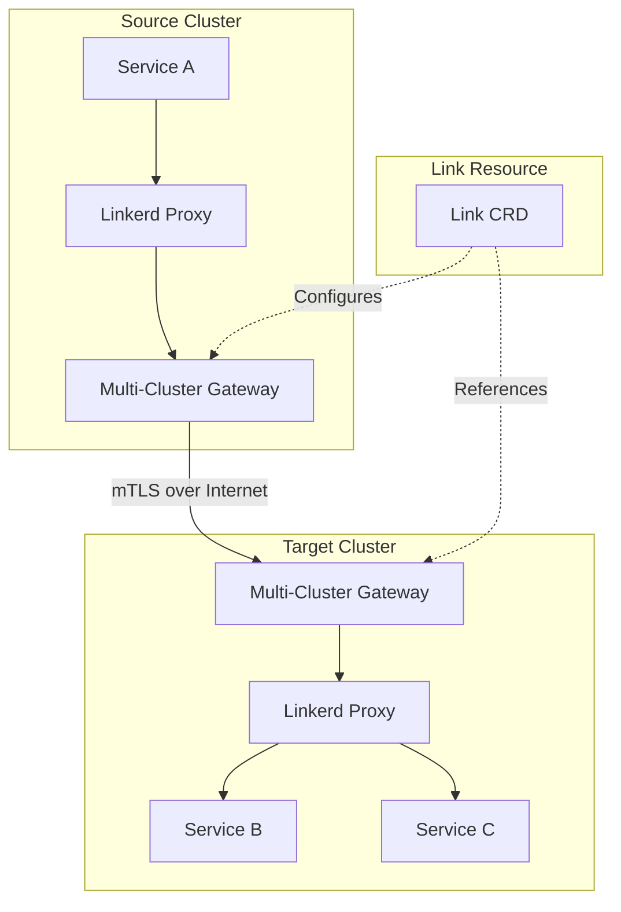
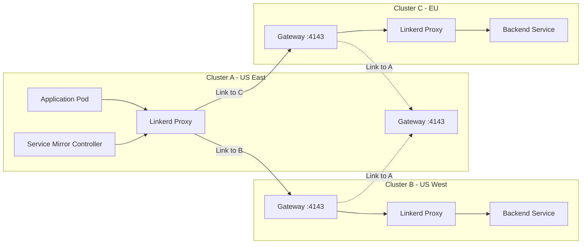
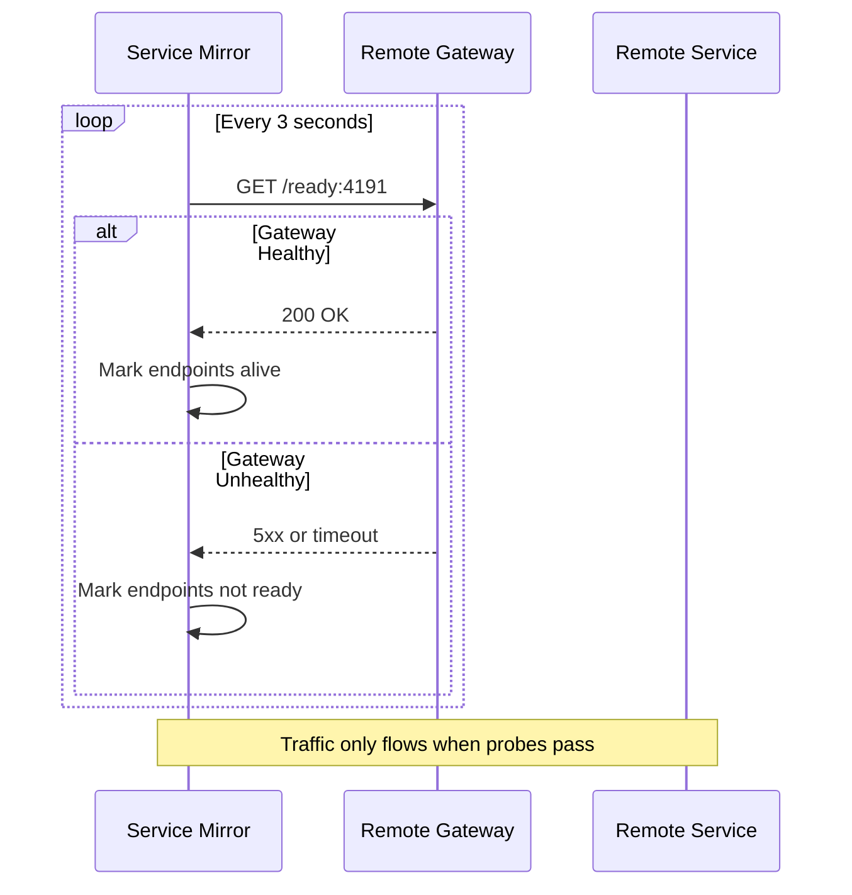

# How to Create Linkerd Link Resource

Author: [nawazdhandala](https://github.com/nawazdhandala)

Tags: Linkerd, Kubernetes, ServiceMesh, MultiCluster

Description: A practical guide to configuring Linkerd Link resources for secure multi-cluster service mesh connectivity.

---

Linkerd multi-cluster enables services to communicate across Kubernetes clusters as if they were in the same cluster. The Link resource is the core custom resource that defines how one cluster connects to another.

## Multi-Cluster Architecture Overview



## Prerequisites

Before creating a Link resource, you need:

1. Linkerd installed on both clusters with multi-cluster extension
2. A shared trust anchor between clusters
3. The target cluster's gateway exposed externally

```bash
# Install Linkerd multi-cluster extension on both clusters
linkerd multicluster install | kubectl apply -f -

# Verify the installation
linkerd multicluster check
```

## Link Resource Specification

The Link resource defines how your source cluster connects to a target cluster. Here is the complete specification:

```yaml
# link.yaml - Defines connection from source to target cluster
apiVersion: multicluster.linkerd.io/v1alpha1
kind: Link
metadata:
  name: target-cluster        # Name used to identify this link
  namespace: linkerd-multicluster
spec:
  # Target cluster name - used in service mirror naming
  targetClusterName: target-cluster

  # Gateway address configuration
  gatewayAddress: gateway.target-cluster.example.com
  gatewayPort: 4143
  gatewayIdentity: gateway.linkerd-multicluster.serviceaccount.identity.linkerd.cluster.local

  # Probe specification for health checking
  probeSpec:
    path: /ready
    port: 4191
    period: 3s

  # Service selector - which services to mirror
  selector:
    matchLabels:
      mirror.linkerd.io/exported: "true"

  # Remote discovery selector for namespace filtering
  remoteDiscoverySelector:
    matchLabels:
      linkerd.io/is-remote-discovery: "true"
```

## Gateway Address Configuration

The gateway address tells your cluster where to send traffic destined for the target cluster.

```yaml
# External gateway with DNS
spec:
  gatewayAddress: linkerd-gateway.prod-east.example.com
  gatewayPort: 4143
  gatewayIdentity: gateway.linkerd-multicluster.serviceaccount.identity.linkerd.cluster.local
```

```yaml
# Gateway with IP address (not recommended for production)
spec:
  gatewayAddress: 203.0.113.50
  gatewayPort: 4143
  gatewayIdentity: gateway.linkerd-multicluster.serviceaccount.identity.linkerd.cluster.local
```

### Gateway Identity

The `gatewayIdentity` field specifies the expected identity of the target gateway for mTLS verification. This follows the SPIFFE format:

```
<service-account>.<namespace>.serviceaccount.identity.linkerd.<trust-domain>
```

## Credentials Configuration

Links require credentials to authenticate with the target cluster's Kubernetes API server. These are stored as Secrets.

```yaml
# Create the kubeconfig secret for the target cluster
apiVersion: v1
kind: Secret
metadata:
  name: cluster-credentials-target
  namespace: linkerd-multicluster
type: mirror.linkerd.io/remote-kubeconfig
data:
  # Base64 encoded kubeconfig with limited permissions
  kubeconfig: <base64-encoded-kubeconfig>
```

Generate the credentials from the target cluster:

```bash
# On the target cluster - generate link credentials
linkerd multicluster link --cluster-name target-cluster > link-credentials.yaml

# Review the generated resources
cat link-credentials.yaml

# Apply on the source cluster
kubectl apply -f link-credentials.yaml
```

The generated kubeconfig uses a service account with minimal permissions:

```yaml
# ServiceAccount on target cluster for remote access
apiVersion: v1
kind: ServiceAccount
metadata:
  name: linkerd-service-mirror-target-cluster
  namespace: linkerd-multicluster
---
# ClusterRole with read-only access to services and endpoints
apiVersion: rbac.authorization.k8s.io/v1
kind: ClusterRole
metadata:
  name: linkerd-service-mirror-target-cluster
rules:
  - apiGroups: [""]
    resources: ["services", "endpoints"]
    verbs: ["get", "list", "watch"]
  - apiGroups: [""]
    resources: ["namespaces"]
    verbs: ["get", "list", "watch"]
```

## Cluster Link Topology



## Service Selector for Mirror Scope

The selector field determines which services from the target cluster get mirrored to your source cluster.

### Mirror All Exported Services

```yaml
# Mirror all services with the export label
spec:
  selector:
    matchLabels:
      mirror.linkerd.io/exported: "true"
```

On the target cluster, export services by adding the label:

```bash
# Export a specific service
kubectl label svc my-service mirror.linkerd.io/exported=true

# Export all services in a namespace
kubectl label svc --all mirror.linkerd.io/exported=true -n production
```

### Mirror by Namespace

```yaml
# Only mirror services from specific namespaces
spec:
  selector:
    matchLabels:
      mirror.linkerd.io/exported: "true"
  remoteDiscoverySelector:
    matchLabels:
      linkerd.io/is-remote-discovery: "true"
```

Label the namespace on the target cluster:

```bash
kubectl label namespace production linkerd.io/is-remote-discovery=true
```

### Mirror by Custom Labels

```yaml
# Mirror services with custom team labels
spec:
  selector:
    matchExpressions:
      - key: mirror.linkerd.io/exported
        operator: In
        values: ["true"]
      - key: team
        operator: In
        values: ["platform", "payments"]
```

## Probe Specifications for Health Checking

The probe spec defines how Linkerd checks the health of the gateway connection.

```yaml
# Standard probe configuration
spec:
  probeSpec:
    path: /ready        # Health check endpoint path
    port: 4191          # Probe port on the gateway
    period: 3s          # How often to probe
```

### Understanding Probe Behavior



### Custom Probe Configuration

```yaml
# Aggressive probing for critical services
spec:
  probeSpec:
    path: /ready
    port: 4191
    period: 1s          # Check every second
```

```yaml
# Relaxed probing for stable connections
spec:
  probeSpec:
    path: /ready
    port: 4191
    period: 10s         # Check every 10 seconds
```

## Complete Example: Three Cluster Setup

### Step 1: Install Multi-Cluster on All Clusters

```bash
# Generate shared trust anchor (do this once)
step certificate create root.linkerd.cluster.local ca.crt ca.key \
  --profile root-ca --no-password --insecure

# Install Linkerd with shared trust anchor on each cluster
for ctx in cluster-a cluster-b cluster-c; do
  linkerd install --context=$ctx \
    --identity-trust-anchors-file ca.crt | kubectl apply --context=$ctx -f -
  linkerd multicluster install --context=$ctx | kubectl apply --context=$ctx -f -
done
```

### Step 2: Generate and Apply Links

```bash
# From cluster-b, generate link for cluster-a to use
linkerd multicluster link --context=cluster-b --cluster-name=cluster-b > link-b.yaml

# From cluster-c, generate link for cluster-a to use
linkerd multicluster link --context=cluster-c --cluster-name=cluster-c > link-c.yaml

# Apply links on cluster-a
kubectl apply --context=cluster-a -f link-b.yaml
kubectl apply --context=cluster-a -f link-c.yaml
```

### Step 3: Custom Link Resource

```yaml
# link-to-production.yaml
apiVersion: multicluster.linkerd.io/v1alpha1
kind: Link
metadata:
  name: production-cluster
  namespace: linkerd-multicluster
spec:
  targetClusterName: production-cluster

  # Gateway configuration
  gatewayAddress: gateway.prod.example.com
  gatewayPort: 4143
  gatewayIdentity: gateway.linkerd-multicluster.serviceaccount.identity.linkerd.cluster.local

  # Health checking
  probeSpec:
    path: /ready
    port: 4191
    period: 3s

  # Only mirror production services
  selector:
    matchLabels:
      mirror.linkerd.io/exported: "true"
      env: production

  # Only from approved namespaces
  remoteDiscoverySelector:
    matchExpressions:
      - key: linkerd.io/is-remote-discovery
        operator: In
        values: ["true"]
      - key: env
        operator: NotIn
        values: ["dev", "staging"]
```

### Step 4: Export Services on Target Cluster

```yaml
# service-export.yaml - Apply on the target cluster
apiVersion: v1
kind: Service
metadata:
  name: api-service
  namespace: production
  labels:
    mirror.linkerd.io/exported: "true"   # Enable mirroring
    env: production
spec:
  selector:
    app: api
  ports:
    - port: 8080
      targetPort: 8080
```

### Step 5: Verify the Link

```bash
# Check link status
linkerd multicluster check

# View mirrored services
kubectl get svc -n production | grep -E ".*-cluster-[a-z]$"

# Example output:
# api-service-cluster-b   ClusterIP   10.96.45.123   <none>   8080/TCP
# api-service-cluster-c   ClusterIP   10.96.45.124   <none>   8080/TCP

# Check gateway health
linkerd multicluster gateways
```

## Consuming Mirrored Services

Once the Link is established, mirrored services appear with a cluster suffix:

```yaml
# Application calling a mirrored service
apiVersion: apps/v1
kind: Deployment
metadata:
  name: web-app
spec:
  template:
    spec:
      containers:
        - name: app
          env:
            # Call the service in the remote cluster
            - name: API_URL
              value: "http://api-service-production-cluster.production.svc.cluster.local:8080"
```

### Traffic Splitting Across Clusters

```yaml
# TrafficSplit to distribute load across clusters
apiVersion: split.smi-spec.io/v1alpha1
kind: TrafficSplit
metadata:
  name: api-service-split
  namespace: production
spec:
  service: api-service
  backends:
    - service: api-service              # Local cluster
      weight: 500
    - service: api-service-cluster-b    # Remote cluster B
      weight: 300
    - service: api-service-cluster-c    # Remote cluster C
      weight: 200
```

## Troubleshooting Links

### Check Link Status

```bash
# Get link resources
kubectl get links -n linkerd-multicluster

# Describe a specific link
kubectl describe link production-cluster -n linkerd-multicluster

# Check service mirror controller logs
kubectl logs -n linkerd-multicluster deploy/linkerd-service-mirror -f
```

### Common Issues

**Gateway unreachable:**
```bash
# Verify gateway is exposed
kubectl get svc -n linkerd-multicluster linkerd-gateway

# Test connectivity from source cluster
kubectl run -it --rm debug --image=curlimages/curl -- \
  curl -v https://gateway.prod.example.com:4143/ready
```

**Services not mirroring:**
```bash
# Check if services have the export label
kubectl get svc -l mirror.linkerd.io/exported=true --all-namespaces

# Verify namespace has discovery label
kubectl get ns -l linkerd.io/is-remote-discovery=true
```

**Probe failures:**
```bash
# Check gateway health
linkerd multicluster gateways

# View probe metrics
kubectl port-forward -n linkerd-multicluster deploy/linkerd-service-mirror 9999:9999
curl localhost:9999/metrics | grep gateway
```

---

The Link resource is the foundation of Linkerd multi-cluster networking. Start with a simple configuration using the generated link command, then customize selectors and probe settings based on your requirements. Always verify connectivity with `linkerd multicluster check` before deploying applications that depend on cross-cluster communication.
