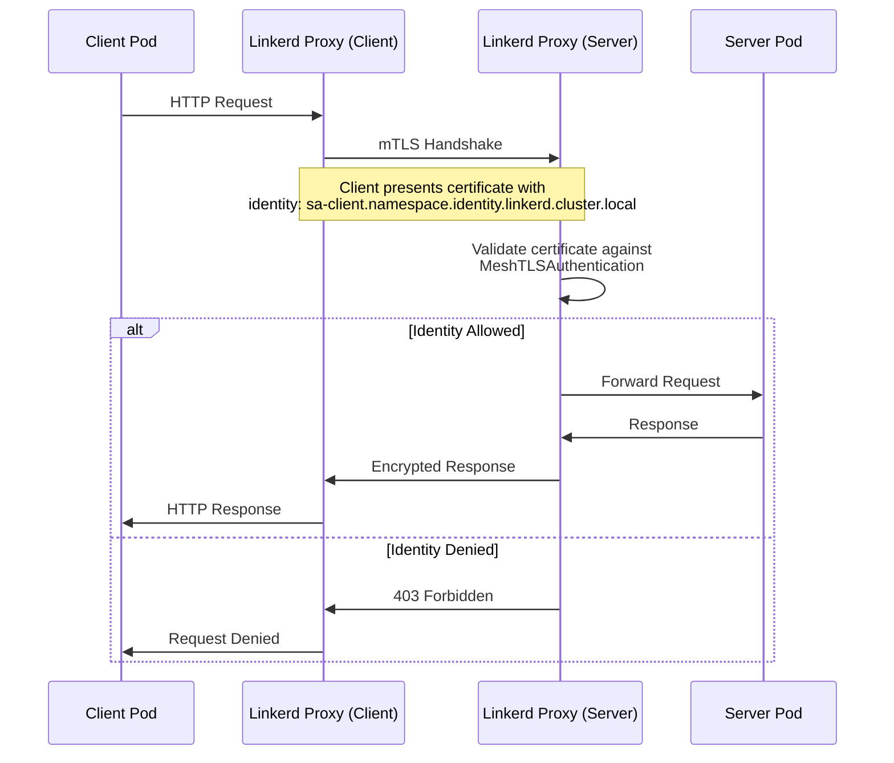
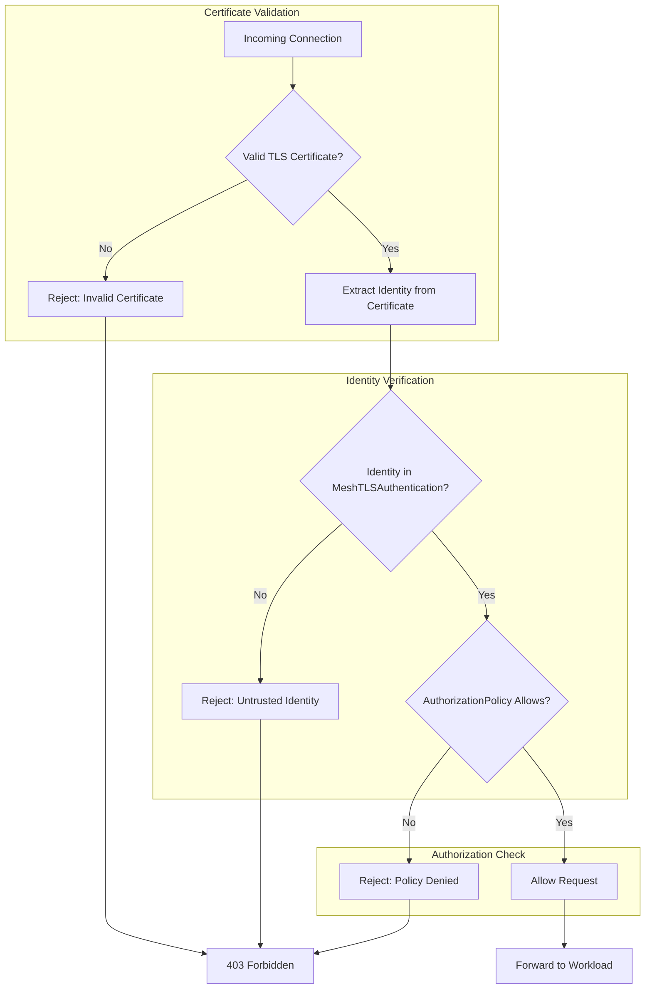

# How to Build Linkerd MeshTLSAuthentication

Author: [nawazdhandala](https://github.com/nawazdhandala)

Tags: Linkerd, Kubernetes, ServiceMesh, mTLS

Description: Implement workload identity verification in Linkerd using MeshTLSAuthentication to enforce cryptographic identity checks between services.

---

Service meshes encrypt traffic with mTLS by default, but encryption alone does not answer the question: "Who is calling me?" MeshTLSAuthentication in Linkerd lets you verify the cryptographic identity of workloads before allowing communication. This guide shows you how to build identity-based access control using MeshTLSAuthentication and AuthorizationPolicy.

## Understanding Workload Identity in Linkerd

Linkerd assigns each workload a cryptographic identity based on its Kubernetes ServiceAccount. When pod A calls pod B, the Linkerd proxy presents a TLS certificate that proves "I am ServiceAccount X in namespace Y." MeshTLSAuthentication lets you define which identities are trusted.



## MeshTLSAuthentication Resource Specification

MeshTLSAuthentication defines a set of trusted workload identities. Here is the complete specification:

```yaml
apiVersion: policy.linkerd.io/v1alpha1
kind: MeshTLSAuthentication
metadata:
  name: allowed-clients           # Name of this authentication resource
  namespace: backend              # Namespace where this policy applies
spec:
  identities:
    # Option 1: Explicit identity strings
    # Format: <service-account>.<namespace>.serviceaccount.identity.linkerd.cluster.local
    - "api-gateway.frontend.serviceaccount.identity.linkerd.cluster.local"
    - "order-service.checkout.serviceaccount.identity.linkerd.cluster.local"

    # Option 2: Wildcard for entire namespace
    # Allows any ServiceAccount in the specified namespace
    - "*.monitoring.serviceaccount.identity.linkerd.cluster.local"
```

### Identity String Format

Linkerd identities follow a specific format derived from the workload's ServiceAccount:

```
<service-account-name>.<namespace>.serviceaccount.identity.linkerd.cluster.local
```

For example, a pod running with ServiceAccount `payment-processor` in namespace `finance` has the identity:

```
payment-processor.finance.serviceaccount.identity.linkerd.cluster.local
```

## Identity References: ServiceAccounts and Namespaces

### Reference by ServiceAccount

Create a MeshTLSAuthentication that allows specific ServiceAccounts:

```yaml
apiVersion: policy.linkerd.io/v1alpha1
kind: MeshTLSAuthentication
metadata:
  name: database-clients
  namespace: data
spec:
  identities:
    # Only these two service accounts can connect
    - "api-server.backend.serviceaccount.identity.linkerd.cluster.local"
    - "batch-processor.jobs.serviceaccount.identity.linkerd.cluster.local"
```

### Reference by Namespace

Allow all workloads from specific namespaces using wildcards:

```yaml
apiVersion: policy.linkerd.io/v1alpha1
kind: MeshTLSAuthentication
metadata:
  name: internal-services
  namespace: api
spec:
  identities:
    # Any ServiceAccount in these namespaces
    - "*.backend.serviceaccount.identity.linkerd.cluster.local"
    - "*.frontend.serviceaccount.identity.linkerd.cluster.local"
    # Block everything else implicitly
```

### Combined ServiceAccount and Namespace References

```yaml
apiVersion: policy.linkerd.io/v1alpha1
kind: MeshTLSAuthentication
metadata:
  name: payment-gateway-clients
  namespace: payments
spec:
  identities:
    # Specific high-trust services
    - "checkout.orders.serviceaccount.identity.linkerd.cluster.local"
    - "refund-processor.finance.serviceaccount.identity.linkerd.cluster.local"
    # All monitoring tools
    - "*.monitoring.serviceaccount.identity.linkerd.cluster.local"
    # Internal admin namespace
    - "*.admin.serviceaccount.identity.linkerd.cluster.local"
```

## How mTLS Identity Verification Works



## Integration with AuthorizationPolicy

MeshTLSAuthentication alone does not enforce anything. You must pair it with an AuthorizationPolicy that references the authentication resource.

### Basic AuthorizationPolicy with MeshTLSAuthentication

```yaml
# Step 1: Define trusted identities
apiVersion: policy.linkerd.io/v1alpha1
kind: MeshTLSAuthentication
metadata:
  name: trusted-api-clients
  namespace: backend
spec:
  identities:
    - "web-frontend.frontend.serviceaccount.identity.linkerd.cluster.local"
    - "mobile-bff.frontend.serviceaccount.identity.linkerd.cluster.local"
---
# Step 2: Create AuthorizationPolicy referencing the authentication
apiVersion: policy.linkerd.io/v1alpha1
kind: AuthorizationPolicy
metadata:
  name: api-server-policy
  namespace: backend
spec:
  # Target workloads with this label
  targetRef:
    group: core
    kind: Server
    name: api-server
  requiredAuthenticationRefs:
    # Reference the MeshTLSAuthentication resource
    - name: trusted-api-clients
      kind: MeshTLSAuthentication
      group: policy.linkerd.io
```

### Server Resource for Targeting

AuthorizationPolicy targets Server resources. Define a Server to specify which ports and pods receive the policy:

```yaml
apiVersion: policy.linkerd.io/v1beta1
kind: Server
metadata:
  name: api-server
  namespace: backend
spec:
  # Match pods with this label
  podSelector:
    matchLabels:
      app: api-server
  # Apply to this port
  port: 8080
  # Protocol type
  proxyProtocol: HTTP/2
```

## Certificate Validation Configuration

Linkerd handles certificate validation automatically through its identity system. However, you can configure the trust anchor and issuer certificates during installation.

### Trust Anchor Configuration

```bash
# Generate trust anchor certificate (valid for 10 years)
step certificate create root.linkerd.cluster.local ca.crt ca.key \
  --profile root-ca \
  --no-password \
  --insecure \
  --not-after=87600h

# Generate issuer certificate (valid for 1 year)
step certificate create identity.linkerd.cluster.local issuer.crt issuer.key \
  --profile intermediate-ca \
  --no-password \
  --insecure \
  --ca ca.crt \
  --ca-key ca.key \
  --not-after=8760h
```

### Install Linkerd with Custom Certificates

```bash
# Install Linkerd with your certificates
linkerd install \
  --identity-trust-anchors-file ca.crt \
  --identity-issuer-certificate-file issuer.crt \
  --identity-issuer-key-file issuer.key \
  | kubectl apply -f -
```

### Verify Certificate Chain

```bash
# Check the identity issuer certificate
kubectl get secret linkerd-identity-issuer \
  -n linkerd \
  -o jsonpath='{.data.crt\.pem}' | base64 -d | openssl x509 -text -noout

# Verify workload certificates
linkerd viz tap deployment/api-server -n backend --to deployment/database -n data
```

## Practical Code Examples

### Example 1: Three-Tier Application

Protect a database so only the API layer can access it:

```yaml
# ServiceAccount for the API server
apiVersion: v1
kind: ServiceAccount
metadata:
  name: api-server
  namespace: backend
---
# Deployment using the ServiceAccount
apiVersion: apps/v1
kind: Deployment
metadata:
  name: api-server
  namespace: backend
spec:
  replicas: 3
  selector:
    matchLabels:
      app: api-server
  template:
    metadata:
      labels:
        app: api-server
      annotations:
        linkerd.io/inject: enabled
    spec:
      serviceAccountName: api-server  # This determines the identity
      containers:
        - name: api
          image: myregistry/api-server:v1.0
          ports:
            - containerPort: 8080
---
# Server resource for the database
apiVersion: policy.linkerd.io/v1beta1
kind: Server
metadata:
  name: postgres-server
  namespace: data
spec:
  podSelector:
    matchLabels:
      app: postgres
  port: 5432
  proxyProtocol: opaque
---
# Define who can access the database
apiVersion: policy.linkerd.io/v1alpha1
kind: MeshTLSAuthentication
metadata:
  name: database-clients
  namespace: data
spec:
  identities:
    # Only the API server can connect
    - "api-server.backend.serviceaccount.identity.linkerd.cluster.local"
---
# Enforce the authentication
apiVersion: policy.linkerd.io/v1alpha1
kind: AuthorizationPolicy
metadata:
  name: postgres-auth
  namespace: data
spec:
  targetRef:
    group: policy.linkerd.io
    kind: Server
    name: postgres-server
  requiredAuthenticationRefs:
    - name: database-clients
      kind: MeshTLSAuthentication
      group: policy.linkerd.io
```

### Example 2: Multi-Tenant Isolation

Isolate tenants so they can only access their own services:

```yaml
# Tenant A authentication
apiVersion: policy.linkerd.io/v1alpha1
kind: MeshTLSAuthentication
metadata:
  name: tenant-a-identities
  namespace: tenant-a
spec:
  identities:
    # Only workloads from tenant-a namespace
    - "*.tenant-a.serviceaccount.identity.linkerd.cluster.local"
---
# Tenant A authorization
apiVersion: policy.linkerd.io/v1alpha1
kind: AuthorizationPolicy
metadata:
  name: tenant-a-isolation
  namespace: tenant-a
spec:
  targetRef:
    group: policy.linkerd.io
    kind: Server
    name: tenant-a-api
  requiredAuthenticationRefs:
    - name: tenant-a-identities
      kind: MeshTLSAuthentication
      group: policy.linkerd.io
---
# Same pattern for Tenant B
apiVersion: policy.linkerd.io/v1alpha1
kind: MeshTLSAuthentication
metadata:
  name: tenant-b-identities
  namespace: tenant-b
spec:
  identities:
    - "*.tenant-b.serviceaccount.identity.linkerd.cluster.local"
```

### Example 3: Allow Monitoring Access

Let Prometheus scrape metrics from all namespaces:

```yaml
# Global monitoring authentication
apiVersion: policy.linkerd.io/v1alpha1
kind: MeshTLSAuthentication
metadata:
  name: prometheus-identity
  namespace: backend
spec:
  identities:
    # Prometheus ServiceAccount in monitoring namespace
    - "prometheus.monitoring.serviceaccount.identity.linkerd.cluster.local"
---
# Server for metrics endpoint
apiVersion: policy.linkerd.io/v1beta1
kind: Server
metadata:
  name: metrics-server
  namespace: backend
spec:
  podSelector:
    matchLabels:
      app: api-server
  port: 9090
  proxyProtocol: HTTP/1
---
# Allow Prometheus to scrape
apiVersion: policy.linkerd.io/v1alpha1
kind: AuthorizationPolicy
metadata:
  name: allow-prometheus
  namespace: backend
spec:
  targetRef:
    group: policy.linkerd.io
    kind: Server
    name: metrics-server
  requiredAuthenticationRefs:
    - name: prometheus-identity
      kind: MeshTLSAuthentication
      group: policy.linkerd.io
```

## Testing Identity Verification

### Verify Pod Identity

```bash
# Check the identity assigned to a pod
kubectl exec -n backend deploy/api-server -c linkerd-proxy -- \
  cat /var/run/linkerd/identity/certificate.crt | \
  openssl x509 -text -noout | grep Subject

# Output should show:
# Subject: CN = api-server.backend.serviceaccount.identity.linkerd.cluster.local
```

### Test Authorized Access

```bash
# From an authorized pod, this should succeed
kubectl exec -n backend deploy/api-server -- \
  curl -s http://postgres.data:5432

# Check the response
echo $?  # Should be 0
```

### Test Unauthorized Access

```bash
# From an unauthorized pod, this should fail
kubectl exec -n frontend deploy/web-app -- \
  curl -s http://postgres.data:5432

# Should receive 403 Forbidden
```

### View Policy Violations

```bash
# Watch for denied requests
linkerd viz authz -n data deployment/postgres

# Output shows authorized and unauthorized requests
```

## Debugging Identity Issues

### Check MeshTLSAuthentication Status

```bash
# List all MeshTLSAuthentication resources
kubectl get meshtlsauthentication -A

# Describe a specific resource
kubectl describe meshtlsauthentication database-clients -n data
```

### Verify AuthorizationPolicy Binding

```bash
# Check policy status
kubectl get authorizationpolicy -n data

# Describe to see targetRef and authentication refs
kubectl describe authorizationpolicy postgres-auth -n data
```

### Common Issues

**Issue: Requests denied unexpectedly**
- Verify the ServiceAccount name matches the identity string
- Check namespace spelling in the identity
- Ensure the pod has `linkerd.io/inject: enabled` annotation

**Issue: Identity not recognized**
- Confirm Linkerd proxy is injected: `kubectl get pods -n backend -o jsonpath='{.items[*].spec.containers[*].name}'`
- Check certificate validity: `linkerd check --proxy`

**Issue: Policy not applied**
- Verify Server resource exists and matches pod labels
- Confirm AuthorizationPolicy references correct Server name

## Best Practices

1. **Use dedicated ServiceAccounts**: Never use the default ServiceAccount for workloads that need specific access.

2. **Principle of least privilege**: List only the specific identities needed, avoid broad namespace wildcards in production.

3. **Document identity requirements**: Add comments to your manifests explaining why each identity is allowed.

4. **Test in staging first**: Deploy MeshTLSAuthentication in permissive mode before enforcing.

5. **Monitor policy decisions**: Use `linkerd viz authz` to track authorized and denied requests.

6. **Rotate certificates regularly**: Set up automatic certificate rotation with cert-manager or similar tools.

---

MeshTLSAuthentication transforms Linkerd from "encrypted by default" to "verified by default." By combining cryptographic identity with explicit authorization policies, you get defense in depth that survives even if an attacker compromises a single workload. Start with your most sensitive services and expand from there.
