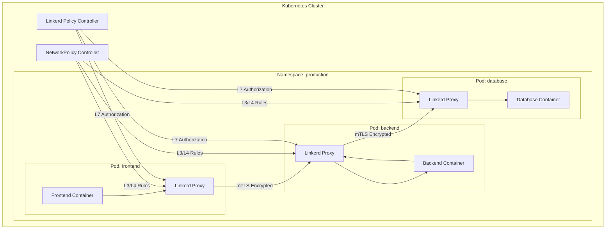
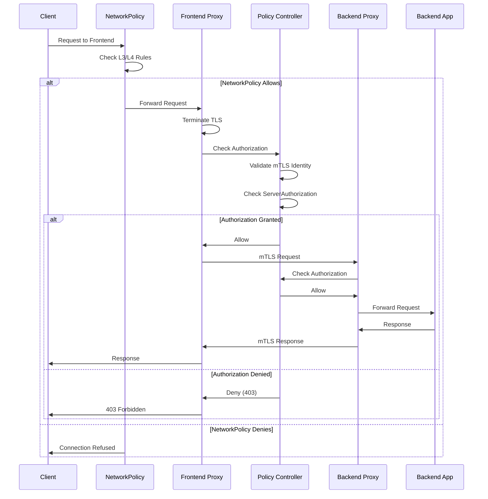

# How to Implement Linkerd Network Policy

Author: [nawazdhandala](https://github.com/nawazdhandala)

Tags: Linkerd, Kubernetes, ServiceMesh, NetworkPolicy

Description: Learn how to integrate Kubernetes NetworkPolicy with Linkerd service mesh for fine-grained traffic control and enhanced security.

---

## Introduction

Linkerd is a lightweight, security-focused service mesh that provides observability, reliability, and security for Kubernetes workloads. When combined with Kubernetes NetworkPolicy, you gain powerful control over which services can communicate with each other at both the network layer (L3/L4) and the application layer (L7).

This guide walks you through integrating NetworkPolicy with Linkerd to create a defense-in-depth security model for your microservices.

## Understanding the Architecture

Before diving into implementation, let us understand how Linkerd and NetworkPolicy work together.



## Prerequisites

Ensure you have the following installed:

- Kubernetes cluster (v1.21+)
- Linkerd CLI and control plane installed
- A CNI plugin that supports NetworkPolicy (Calico, Cilium, or Weave)
- kubectl configured to access your cluster

```bash
# Verify Linkerd installation
linkerd check

# Verify your CNI supports NetworkPolicy
kubectl get pods -n kube-system | grep -E "calico|cilium|weave"
```

## Installing the Linkerd Policy Controller

The Linkerd policy controller enables fine-grained authorization policies for meshed workloads.

```yaml
# linkerd-policy-controller-config.yaml
# This ConfigMap configures the policy controller behavior
apiVersion: v1
kind: ConfigMap
metadata:
  name: linkerd-policy-controller
  namespace: linkerd
data:
  # Default policy when no explicit policy exists
  # Options: all-unauthenticated, all-authenticated, cluster-unauthenticated,
  # cluster-authenticated, deny
  default-policy: "all-authenticated"

  # Log level for debugging policy decisions
  log-level: "info"

  # Enable workload discovery for policy targets
  workload-discovery: "true"
```

Install or upgrade Linkerd with the policy controller enabled:

```bash
# Install Linkerd with policy controller
linkerd install \
  --set policyController.defaultAllowPolicy=all-authenticated \
  --set policyController.logLevel=info \
  | kubectl apply -f -

# Verify the policy controller is running
kubectl get pods -n linkerd -l app=policy-controller
```

## Namespace-Level Policies

Start by defining policies at the namespace level to establish baseline security.

### Default Deny Policy

```yaml
# namespace-default-deny.yaml
# This NetworkPolicy blocks all ingress and egress traffic by default
# Only explicitly allowed traffic will be permitted
apiVersion: networking.k8s.io/v1
kind: NetworkPolicy
metadata:
  name: default-deny-all
  namespace: production
spec:
  # Apply to all pods in the namespace
  podSelector: {}
  # Deny both ingress and egress
  policyTypes:
    - Ingress
    - Egress
```

### Allow Linkerd Control Plane Communication

```yaml
# allow-linkerd-control-plane.yaml
# Essential policy to allow pods to communicate with Linkerd control plane
# Without this, meshed pods cannot function properly
apiVersion: networking.k8s.io/v1
kind: NetworkPolicy
metadata:
  name: allow-linkerd-control-plane
  namespace: production
spec:
  podSelector: {}
  policyTypes:
    - Egress
  egress:
    # Allow communication with Linkerd control plane namespace
    - to:
        - namespaceSelector:
            matchLabels:
              linkerd.io/control-plane-ns: linkerd
      ports:
        # Destination service for service discovery
        - protocol: TCP
          port: 8086
        # Identity service for mTLS certificates
        - protocol: TCP
          port: 8080
        # Policy controller for authorization
        - protocol: TCP
          port: 8090
    # Allow DNS resolution (required for service discovery)
    - to:
        - namespaceSelector: {}
          podSelector:
            matchLabels:
              k8s-app: kube-dns
      ports:
        - protocol: UDP
          port: 53
        - protocol: TCP
          port: 53
```

## Pod-Level Policies

Define granular policies for specific workloads.

### Frontend Service Policy

```yaml
# frontend-network-policy.yaml
# Policy for frontend pods - allows internet ingress and backend egress
apiVersion: networking.k8s.io/v1
kind: NetworkPolicy
metadata:
  name: frontend-policy
  namespace: production
spec:
  # Target pods with the frontend label
  podSelector:
    matchLabels:
      app: frontend
  policyTypes:
    - Ingress
    - Egress
  ingress:
    # Allow traffic from ingress controller
    - from:
        - namespaceSelector:
            matchLabels:
              name: ingress-nginx
          podSelector:
            matchLabels:
              app.kubernetes.io/name: ingress-nginx
      ports:
        # Linkerd proxy inbound port
        - protocol: TCP
          port: 4143
  egress:
    # Allow traffic to backend service only
    - to:
        - podSelector:
            matchLabels:
              app: backend
      ports:
        # Linkerd proxy outbound port
        - protocol: TCP
          port: 4140
```

### Backend Service Policy

```yaml
# backend-network-policy.yaml
# Policy for backend pods - allows frontend ingress and database egress
apiVersion: networking.k8s.io/v1
kind: NetworkPolicy
metadata:
  name: backend-policy
  namespace: production
spec:
  podSelector:
    matchLabels:
      app: backend
  policyTypes:
    - Ingress
    - Egress
  ingress:
    # Only allow traffic from frontend pods
    - from:
        - podSelector:
            matchLabels:
              app: frontend
      ports:
        - protocol: TCP
          port: 4143
  egress:
    # Allow traffic to database pods
    - to:
        - podSelector:
            matchLabels:
              app: database
      ports:
        - protocol: TCP
          port: 4140
    # Allow traffic to external APIs if needed
    - to:
        - ipBlock:
            cidr: 0.0.0.0/0
            except:
              # Block private IP ranges
              - 10.0.0.0/8
              - 172.16.0.0/12
              - 192.168.0.0/16
      ports:
        - protocol: TCP
          port: 443
```

### Database Service Policy

```yaml
# database-network-policy.yaml
# Policy for database pods - highly restrictive, only backend can connect
apiVersion: networking.k8s.io/v1
kind: NetworkPolicy
metadata:
  name: database-policy
  namespace: production
spec:
  podSelector:
    matchLabels:
      app: database
  policyTypes:
    - Ingress
    - Egress
  ingress:
    # Only backend pods can connect to the database
    - from:
        - podSelector:
            matchLabels:
              app: backend
      ports:
        - protocol: TCP
          port: 4143
  # Database should not initiate outbound connections
  # Empty egress means no egress allowed
  egress: []
```

## Linkerd Server Authorization

Linkerd provides additional L7 authorization through Server and ServerAuthorization resources.

### Server Resource Definition

```yaml
# backend-server.yaml
# Defines the backend server and its ports for Linkerd policy
apiVersion: policy.linkerd.io/v1beta2
kind: Server
metadata:
  name: backend-http
  namespace: production
spec:
  # Target pods for this server definition
  podSelector:
    matchLabels:
      app: backend
  # Port configuration
  port: http
  # Protocol detection (http1, http2, grpc, opaque)
  proxyProtocol: HTTP/2
```

### ServerAuthorization Resource

```yaml
# backend-server-authorization.yaml
# Defines who can access the backend server
apiVersion: policy.linkerd.io/v1beta2
kind: ServerAuthorization
metadata:
  name: backend-authz
  namespace: production
spec:
  # Reference to the Server resource
  server:
    name: backend-http
  # Client requirements for authorization
  client:
    # Require mutual TLS authentication
    meshTLS:
      # Only allow specific service accounts
      serviceAccounts:
        - name: frontend
          namespace: production
```

## HTTPRoute-Based Authorization

For more granular control, use HTTPRoute resources to define path-based policies.

```yaml
# backend-http-routes.yaml
# Define HTTP routes for fine-grained authorization
apiVersion: policy.linkerd.io/v1beta2
kind: HTTPRoute
metadata:
  name: backend-routes
  namespace: production
spec:
  # Parent server reference
  parentRefs:
    - name: backend-http
      kind: Server
      group: policy.linkerd.io
  rules:
    # Health check endpoint - allow all authenticated clients
    - matches:
        - path:
            type: Exact
            value: /health
      filters: []
    # API endpoints - require specific authorization
    - matches:
        - path:
            type: PathPrefix
            value: /api/v1
          method: GET
      filters: []
    - matches:
        - path:
            type: PathPrefix
            value: /api/v1
          method: POST
      filters: []
---
# Authorization for specific routes
apiVersion: policy.linkerd.io/v1beta2
kind: AuthorizationPolicy
metadata:
  name: backend-api-authz
  namespace: production
spec:
  # Target the HTTPRoute
  targetRef:
    group: policy.linkerd.io
    kind: HTTPRoute
    name: backend-routes
  requiredAuthenticationRefs:
    - name: frontend-mtls
      kind: MeshTLSAuthentication
      group: policy.linkerd.io
---
# MeshTLS authentication requirement
apiVersion: policy.linkerd.io/v1beta2
kind: MeshTLSAuthentication
metadata:
  name: frontend-mtls
  namespace: production
spec:
  # Identities allowed to access
  identities:
    - "frontend.production.serviceaccount.identity.linkerd.cluster.local"
```

## Traffic Flow Visualization

Here is how traffic flows through the policy layers:



## Complete Example Deployment

Here is a complete example putting all the pieces together:

```yaml
# complete-deployment.yaml
# Full deployment with NetworkPolicy and Linkerd authorization
---
# Namespace with Linkerd injection enabled
apiVersion: v1
kind: Namespace
metadata:
  name: production
  labels:
    linkerd.io/inject: enabled
---
# Frontend Deployment
apiVersion: apps/v1
kind: Deployment
metadata:
  name: frontend
  namespace: production
spec:
  replicas: 2
  selector:
    matchLabels:
      app: frontend
  template:
    metadata:
      labels:
        app: frontend
      annotations:
        # Ensure Linkerd proxy is injected
        linkerd.io/inject: enabled
        # Configure proxy for policy
        config.linkerd.io/default-inbound-policy: "all-authenticated"
    spec:
      serviceAccountName: frontend
      containers:
        - name: frontend
          image: myregistry/frontend:v1.0.0
          ports:
            - containerPort: 8080
              name: http
          resources:
            requests:
              cpu: 100m
              memory: 128Mi
            limits:
              cpu: 500m
              memory: 512Mi
---
# Frontend Service Account
apiVersion: v1
kind: ServiceAccount
metadata:
  name: frontend
  namespace: production
---
# Frontend Service
apiVersion: v1
kind: Service
metadata:
  name: frontend
  namespace: production
spec:
  selector:
    app: frontend
  ports:
    - port: 80
      targetPort: 8080
      name: http
---
# Backend Deployment
apiVersion: apps/v1
kind: Deployment
metadata:
  name: backend
  namespace: production
spec:
  replicas: 3
  selector:
    matchLabels:
      app: backend
  template:
    metadata:
      labels:
        app: backend
      annotations:
        linkerd.io/inject: enabled
        config.linkerd.io/default-inbound-policy: "deny"
    spec:
      serviceAccountName: backend
      containers:
        - name: backend
          image: myregistry/backend:v1.0.0
          ports:
            - containerPort: 8080
              name: http
---
# Backend Service Account
apiVersion: v1
kind: ServiceAccount
metadata:
  name: backend
  namespace: production
---
# Backend Service
apiVersion: v1
kind: Service
metadata:
  name: backend
  namespace: production
spec:
  selector:
    app: backend
  ports:
    - port: 80
      targetPort: 8080
      name: http
```

## Monitoring and Debugging

### Check Policy Status

```bash
# View active policies for a namespace
linkerd policy list -n production

# Check if a specific pod can communicate with another
linkerd diagnostics policy backend-5d4f6b7c8d-xyz12 -n production

# View authorization events
kubectl logs -n linkerd -l app=policy-controller -f
```

### Debug Denied Requests

```bash
# Check NetworkPolicy is applied correctly
kubectl get networkpolicy -n production -o yaml

# Verify Linkerd proxy logs for authorization decisions
kubectl logs deployment/backend -n production -c linkerd-proxy | grep -i authz

# Use linkerd viz to see traffic flow
linkerd viz stat deploy -n production
linkerd viz tap deploy/backend -n production
```

### Metrics for Policy Enforcement

```yaml
# prometheus-rules.yaml
# Alerting rules for policy violations
apiVersion: monitoring.coreos.com/v1
kind: PrometheusRule
metadata:
  name: linkerd-policy-alerts
  namespace: monitoring
spec:
  groups:
    - name: linkerd-policy
      rules:
        - alert: HighAuthorizationDenials
          # Alert when authorization denials exceed threshold
          expr: |
            sum(rate(inbound_http_authz_deny_total[5m])) by (namespace, deployment) > 10
          for: 5m
          labels:
            severity: warning
          annotations:
            summary: "High rate of authorization denials"
            description: "Deployment {{ $labels.deployment }} in namespace {{ $labels.namespace }} has high authorization denials"
```

## Best Practices

1. **Start with deny-all policies**: Begin with a default deny stance and explicitly allow required traffic.

2. **Layer your security**: Use NetworkPolicy for L3/L4 controls and Linkerd for L7 authorization.

3. **Use service accounts**: Always assign dedicated service accounts to workloads for identity-based authorization.

4. **Monitor policy decisions**: Set up alerts for unexpected authorization denials.

5. **Test in staging first**: Always validate policies in a non-production environment before rolling out.

6. **Document your policies**: Maintain clear documentation of what traffic is allowed and why.

7. **Use labels consistently**: Establish a labeling convention for pods and namespaces to simplify policy management.

## Conclusion

Combining Linkerd with Kubernetes NetworkPolicy provides a robust, defense-in-depth security model for your microservices. NetworkPolicy handles L3/L4 traffic control while Linkerd's policy controller adds L7 authorization with mTLS identity verification.

By following this guide, you have learned how to:

- Configure the Linkerd policy controller
- Create namespace-level default deny policies
- Define pod-level ingress and egress rules
- Implement Linkerd Server and ServerAuthorization resources
- Use HTTPRoute for path-based authorization
- Monitor and debug policy enforcement

Remember to always test policies thoroughly in staging environments before applying them to production workloads.

## Additional Resources

- [Linkerd Policy Documentation](https://linkerd.io/2/features/server-policy/)
- [Kubernetes NetworkPolicy Reference](https://kubernetes.io/docs/concepts/services-networking/network-policies/)
- [Linkerd Authorization Policy Guide](https://linkerd.io/2/tasks/configuring-per-route-policy/)
