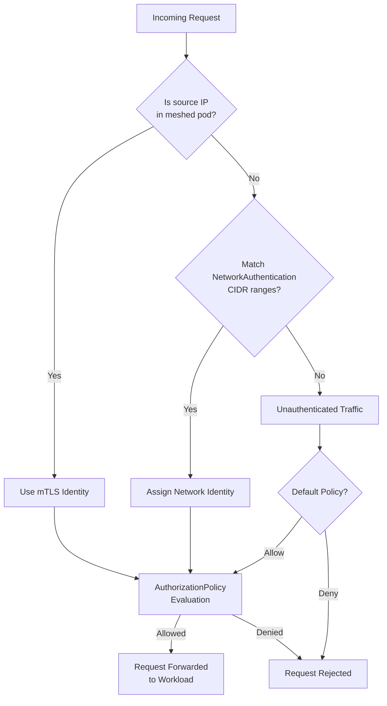
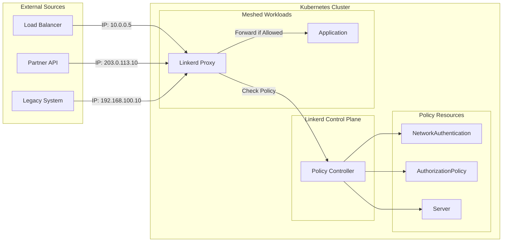

# How to Implement Linkerd NetworkAuthentication

Author: [nawazdhandala](https://github.com/nawazdhandala)

Tags: Linkerd, Kubernetes, ServiceMesh, Authentication

Description: Learn how to use Linkerd NetworkAuthentication to establish network-level identity based on IP addresses and CIDR ranges for secure service mesh authorization.

---

## Introduction

Linkerd provides robust security through mutual TLS (mTLS) and workload identity. However, not all traffic originates from meshed workloads. External systems, legacy applications, or services outside your cluster may need to communicate with your mesh. This is where `NetworkAuthentication` comes in.

`NetworkAuthentication` allows you to assign identity to traffic based on its source IP address or CIDR range. This enables you to apply authorization policies to traffic that cannot present a cryptographic identity.

## What is NetworkAuthentication?

`NetworkAuthentication` is a custom resource in Linkerd that defines network-level identity. Instead of relying on mTLS certificates, it identifies traffic based on source IP addresses. This is particularly useful for:

- Traffic from external load balancers
- Requests from on-premises systems
- Legacy applications that cannot be meshed
- Third-party services with known IP ranges

## NetworkAuthentication Resource Specification

Here is the complete specification for a `NetworkAuthentication` resource:

```yaml
# NetworkAuthentication defines identity based on source IP addresses
apiVersion: policy.linkerd.io/v1alpha1
kind: NetworkAuthentication
metadata:
  name: external-partners        # Name of the authentication resource
  namespace: production          # Namespace where this applies
spec:
  # List of network CIDR ranges that will be assigned this identity
  networks:
    - cidr: 10.0.0.0/8           # Private network range (Class A)
    - cidr: 192.168.1.0/24       # Specific subnet for partner services
    - cidr: 203.0.113.50/32      # Single IP address (a specific server)
```

### Key Fields Explained

| Field | Description |
|-------|-------------|
| `apiVersion` | Must be `policy.linkerd.io/v1alpha1` |
| `kind` | Must be `NetworkAuthentication` |
| `metadata.name` | Unique name for this authentication resource |
| `metadata.namespace` | Namespace scope for the resource |
| `spec.networks` | Array of network definitions |
| `spec.networks[].cidr` | CIDR notation for IP range (e.g., `10.0.0.0/8` or `192.168.1.1/32`) |

## Network CIDR Selectors for IP-Based Identity

CIDR (Classless Inter-Domain Routing) notation allows you to specify IP ranges precisely:

```yaml
apiVersion: policy.linkerd.io/v1alpha1
kind: NetworkAuthentication
metadata:
  name: trusted-networks
  namespace: default
spec:
  networks:
    # Match an entire /16 subnet (65,536 addresses)
    - cidr: 172.16.0.0/16

    # Match a smaller /24 subnet (256 addresses)
    - cidr: 10.100.50.0/24

    # Match a single specific IP address
    - cidr: 52.23.45.67/32

    # Match all IPv4 addresses (use with caution)
    # - cidr: 0.0.0.0/0
```

### Common CIDR Patterns

| CIDR | Addresses | Use Case |
|------|-----------|----------|
| `/32` | 1 | Single server or endpoint |
| `/24` | 256 | Small subnet or team |
| `/16` | 65,536 | Department or environment |
| `/8` | 16,777,216 | Large private network |

## Network Authentication Flow

The following diagram shows how Linkerd processes requests using NetworkAuthentication:



## Integration with AuthorizationPolicy

`NetworkAuthentication` becomes powerful when combined with `AuthorizationPolicy`. Here is how they work together:

### Step 1: Define the Network Identity

```yaml
# Create a NetworkAuthentication for your monitoring system
apiVersion: policy.linkerd.io/v1alpha1
kind: NetworkAuthentication
metadata:
  name: monitoring-system
  namespace: production
spec:
  networks:
    # Prometheus server IP range
    - cidr: 10.50.0.0/24
    # Grafana server
    - cidr: 10.50.1.10/32
```

### Step 2: Create a Server Resource

```yaml
# Define which port and protocol to protect
apiVersion: policy.linkerd.io/v1beta3
kind: Server
metadata:
  name: api-server
  namespace: production
spec:
  podSelector:
    matchLabels:
      app: api                   # Select pods with this label
  port: 8080                     # The port to apply policy to
  proxyProtocol: HTTP/1          # Protocol type (HTTP/1, HTTP/2, gRPC)
```

### Step 3: Create the Authorization Policy

```yaml
# Allow the monitoring system to access metrics endpoints
apiVersion: policy.linkerd.io/v1alpha1
kind: AuthorizationPolicy
metadata:
  name: allow-monitoring
  namespace: production
spec:
  targetRef:
    group: policy.linkerd.io
    kind: Server
    name: api-server             # Reference to the Server resource
  requiredAuthenticationRefs:
    - group: policy.linkerd.io
      kind: NetworkAuthentication
      name: monitoring-system    # Reference to NetworkAuthentication
```

### Complete Example: Multi-Tier Authorization

```yaml
---
# Network identity for internal services
apiVersion: policy.linkerd.io/v1alpha1
kind: NetworkAuthentication
metadata:
  name: internal-services
  namespace: production
spec:
  networks:
    - cidr: 10.0.0.0/8           # All internal RFC1918 addresses
---
# Network identity for external partners
apiVersion: policy.linkerd.io/v1alpha1
kind: NetworkAuthentication
metadata:
  name: partner-api-clients
  namespace: production
spec:
  networks:
    - cidr: 203.0.113.0/24       # Partner A network
    - cidr: 198.51.100.0/24      # Partner B network
---
# Server definition for the API
apiVersion: policy.linkerd.io/v1beta3
kind: Server
metadata:
  name: payment-api
  namespace: production
spec:
  podSelector:
    matchLabels:
      app: payment-service
  port: 443
  proxyProtocol: HTTP/2
---
# Allow internal services full access
apiVersion: policy.linkerd.io/v1alpha1
kind: AuthorizationPolicy
metadata:
  name: allow-internal
  namespace: production
spec:
  targetRef:
    group: policy.linkerd.io
    kind: Server
    name: payment-api
  requiredAuthenticationRefs:
    - group: policy.linkerd.io
      kind: NetworkAuthentication
      name: internal-services
---
# Allow partners limited access
apiVersion: policy.linkerd.io/v1alpha1
kind: AuthorizationPolicy
metadata:
  name: allow-partners
  namespace: production
spec:
  targetRef:
    group: policy.linkerd.io
    kind: Server
    name: payment-api
  requiredAuthenticationRefs:
    - group: policy.linkerd.io
      kind: NetworkAuthentication
      name: partner-api-clients
```

## Use Cases for External Traffic Authorization

### 1. Load Balancer Health Checks

Allow health check traffic from your cloud provider's load balancers:

```yaml
apiVersion: policy.linkerd.io/v1alpha1
kind: NetworkAuthentication
metadata:
  name: aws-elb-health-checks
  namespace: production
spec:
  networks:
    # AWS ELB health checker IP ranges (example)
    - cidr: 10.0.0.0/8
---
apiVersion: policy.linkerd.io/v1alpha1
kind: AuthorizationPolicy
metadata:
  name: allow-health-checks
  namespace: production
spec:
  targetRef:
    group: policy.linkerd.io
    kind: Server
    name: web-server
  requiredAuthenticationRefs:
    - group: policy.linkerd.io
      kind: NetworkAuthentication
      name: aws-elb-health-checks
```

### 2. CI/CD Pipeline Access

Grant deployment systems access to trigger deployments:

```yaml
apiVersion: policy.linkerd.io/v1alpha1
kind: NetworkAuthentication
metadata:
  name: cicd-systems
  namespace: argocd
spec:
  networks:
    # GitHub Actions runner IPs
    - cidr: 140.82.112.0/20
    # Jenkins server
    - cidr: 10.100.5.50/32
    # GitLab runners
    - cidr: 10.100.6.0/24
```

### 3. Legacy System Integration

Allow legacy systems that cannot run the Linkerd proxy:

```yaml
apiVersion: policy.linkerd.io/v1alpha1
kind: NetworkAuthentication
metadata:
  name: legacy-mainframe
  namespace: production
spec:
  networks:
    # Mainframe system IP
    - cidr: 192.168.100.10/32
    # Legacy batch processing servers
    - cidr: 192.168.100.20/32
    - cidr: 192.168.100.21/32
```

### 4. Multi-Cluster Communication

Authorize traffic from other Kubernetes clusters:

```yaml
apiVersion: policy.linkerd.io/v1alpha1
kind: NetworkAuthentication
metadata:
  name: peer-clusters
  namespace: production
spec:
  networks:
    # Cluster A pod CIDR
    - cidr: 10.244.0.0/16
    # Cluster B pod CIDR
    - cidr: 10.245.0.0/16
    # Cluster C pod CIDR
    - cidr: 10.246.0.0/16
```

## Architecture Overview



## Best Practices

### 1. Use Specific CIDR Ranges

Avoid overly broad ranges. Be as specific as possible:

```yaml
# Good: Specific ranges
spec:
  networks:
    - cidr: 10.50.1.0/24         # Only the monitoring subnet

# Avoid: Overly broad ranges
spec:
  networks:
    - cidr: 10.0.0.0/8           # Too permissive
```

### 2. Document Your Network Identities

Use labels and annotations for clarity:

```yaml
apiVersion: policy.linkerd.io/v1alpha1
kind: NetworkAuthentication
metadata:
  name: partner-acme-corp
  namespace: production
  labels:
    partner: acme-corp
    environment: production
  annotations:
    description: "ACME Corp API integration approved 2026-01-15"
    contact: "security@example.com"
    ticket: "SEC-1234"
spec:
  networks:
    - cidr: 203.0.113.0/28
```

### 3. Combine with MeshTLSAuthentication

For comprehensive security, use both network and mesh authentication:

```yaml
# Network-based authentication for external traffic
apiVersion: policy.linkerd.io/v1alpha1
kind: NetworkAuthentication
metadata:
  name: external-ingress
  namespace: production
spec:
  networks:
    - cidr: 10.0.0.0/24
---
# mTLS-based authentication for meshed services
apiVersion: policy.linkerd.io/v1alpha1
kind: MeshTLSAuthentication
metadata:
  name: internal-services
  namespace: production
spec:
  identities:
    - "*.production.serviceaccount.identity.linkerd.cluster.local"
---
# Policy allowing both types
apiVersion: policy.linkerd.io/v1alpha1
kind: AuthorizationPolicy
metadata:
  name: allow-all-trusted
  namespace: production
spec:
  targetRef:
    group: policy.linkerd.io
    kind: Server
    name: api-server
  requiredAuthenticationRefs:
    - group: policy.linkerd.io
      kind: NetworkAuthentication
      name: external-ingress
    - group: policy.linkerd.io
      kind: MeshTLSAuthentication
      name: internal-services
```

### 4. Test Policies Before Enforcement

Use Linkerd's audit mode to test policies:

```bash
# Check the policy status for a specific server
linkerd viz authz -n production deploy/api-server

# View real-time authorization decisions
linkerd viz tap -n production deploy/api-server
```

## Troubleshooting

### Verify NetworkAuthentication is Applied

```bash
# List all NetworkAuthentication resources
kubectl get networkauthentications -A

# Describe a specific resource
kubectl describe networkauthentication external-partners -n production
```

### Check Authorization Decisions

```bash
# Use linkerd viz to see authorization metrics
linkerd viz stat -n production deploy/api-server

# Check for denied requests
linkerd viz tap -n production deploy/api-server | grep -i denied
```

### Common Issues

| Issue | Cause | Solution |
|-------|-------|----------|
| Traffic denied unexpectedly | Source IP not in CIDR range | Verify the actual source IP and update CIDR |
| Policy not taking effect | Server resource not matching | Check pod labels and port configuration |
| Intermittent denials | NAT changing source IPs | Use the NAT gateway IP or SNAT range |

## Conclusion

Linkerd `NetworkAuthentication` provides a bridge between traditional network security and modern service mesh identity. By assigning identity based on IP addresses, you can:

- Authorize traffic from external systems
- Integrate legacy applications securely
- Apply consistent authorization policies across all traffic sources

Combined with `AuthorizationPolicy` and `Server` resources, `NetworkAuthentication` enables fine-grained access control that adapts to the realities of hybrid and multi-cloud environments.

## Further Reading

- [Linkerd Authorization Policy Documentation](https://linkerd.io/2/reference/authorization-policy/)
- [Server Resource Reference](https://linkerd.io/2/reference/server/)
- [Linkerd Security Model](https://linkerd.io/2/features/security/)
