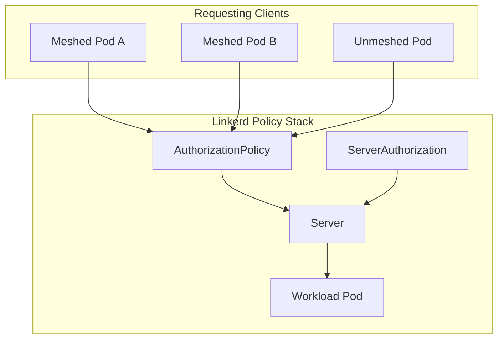
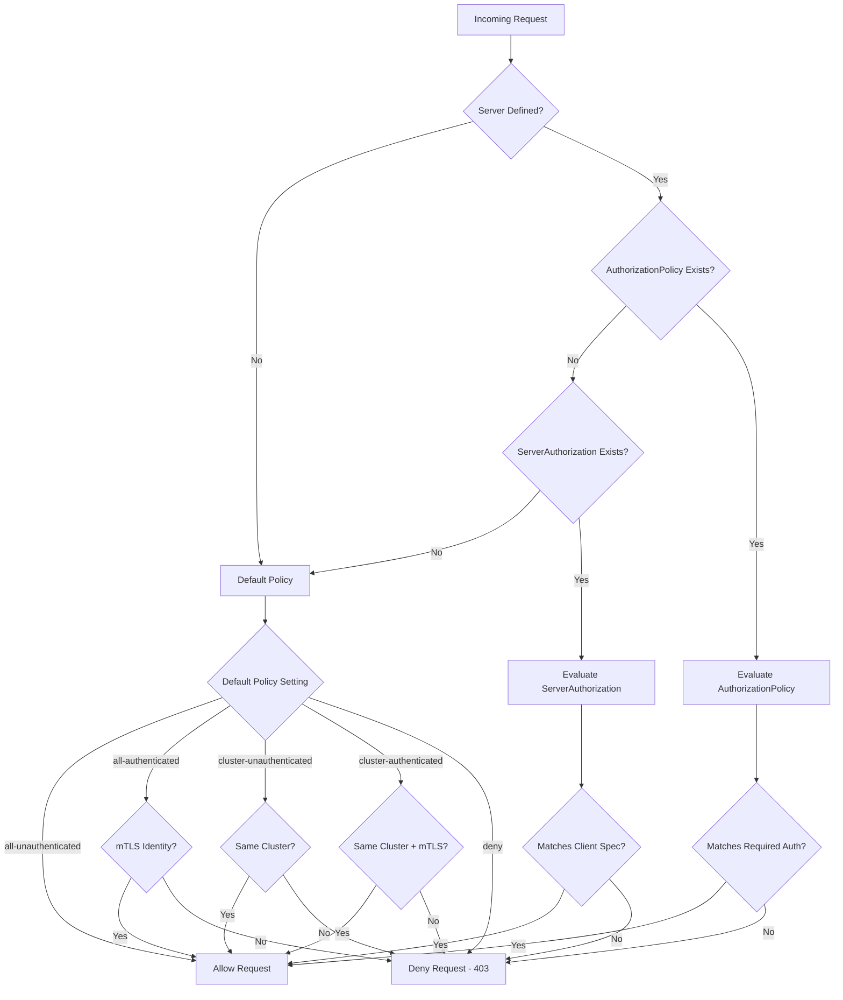
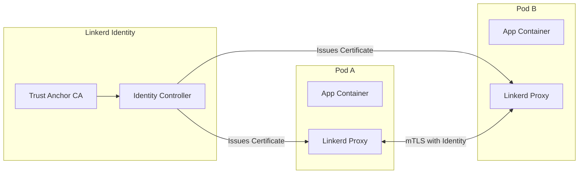

# How to Build Linkerd Policy Resources

Author: [nawazdhandala](https://github.com/nawazdhandala)

Tags: Linkerd, Kubernetes, ServiceMesh, Policy

Description: A complete guide to implementing fine-grained access control in Linkerd using Server, ServerAuthorization, and AuthorizationPolicy resources.

---

Linkerd's policy system lets you control which workloads can communicate with each other at the mesh level. Unlike Kubernetes Network Policies that operate at L3/L4, Linkerd policies work at L7 and can verify workload identity using mutual TLS (mTLS). This guide covers the three core policy resources and how to use them together.

## The Policy Resource Hierarchy

Linkerd provides three main policy resources that work together:

1. **Server** - Defines what ports and protocols your workload exposes
2. **ServerAuthorization** (legacy) - Specifies who can access those Servers
3. **AuthorizationPolicy** - The newer, more flexible way to define access rules



## Understanding the Server Resource

A Server resource defines a named set of ports on a workload. It acts as the target for authorization policies.

```yaml
# server.yaml
# Defines the HTTP port on the API service that policies will protect
apiVersion: policy.linkerd.io/v1beta2
kind: Server
metadata:
  name: api-http          # Name referenced by authorization policies
  namespace: production
spec:
  podSelector:
    matchLabels:
      app: api            # Selects pods with this label
  port: 8080              # The container port to protect
  proxyProtocol: HTTP/2   # Protocol: HTTP/1, HTTP/2, gRPC, opaque, TLS
```

### Server Protocol Options

| Protocol | Use Case |
|----------|----------|
| `HTTP/1` | REST APIs, web traffic |
| `HTTP/2` | HTTP/2 services, some gRPC |
| `gRPC` | gRPC services |
| `opaque` | TCP traffic without protocol detection |
| `TLS` | TLS-terminated traffic |

### Multiple Ports Example

```yaml
# server-multi-port.yaml
# Define separate Servers for different ports on the same workload
apiVersion: policy.linkerd.io/v1beta2
kind: Server
metadata:
  name: api-http
  namespace: production
spec:
  podSelector:
    matchLabels:
      app: api
  port: 8080
  proxyProtocol: HTTP/1
---
apiVersion: policy.linkerd.io/v1beta2
kind: Server
metadata:
  name: api-grpc
  namespace: production
spec:
  podSelector:
    matchLabels:
      app: api
  port: 9090
  proxyProtocol: gRPC
---
apiVersion: policy.linkerd.io/v1beta2
kind: Server
metadata:
  name: api-metrics
  namespace: production
spec:
  podSelector:
    matchLabels:
      app: api
  port: 9091
  proxyProtocol: HTTP/1
```

## ServerAuthorization (Legacy Approach)

ServerAuthorization is the original way to define who can access a Server. It still works but AuthorizationPolicy is preferred for new deployments.

```yaml
# server-authorization.yaml
# Allow only the frontend service to access the API server
apiVersion: policy.linkerd.io/v1beta1
kind: ServerAuthorization
metadata:
  name: frontend-to-api
  namespace: production
spec:
  server:
    name: api-http           # References the Server resource
  client:
    meshTLS:
      serviceAccounts:
        - name: frontend     # Only this ServiceAccount can connect
          namespace: production
```

### ServerAuthorization with Multiple Clients

```yaml
# server-authorization-multi.yaml
# Allow multiple services to access the API
apiVersion: policy.linkerd.io/v1beta1
kind: ServerAuthorization
metadata:
  name: internal-to-api
  namespace: production
spec:
  server:
    name: api-http
  client:
    meshTLS:
      serviceAccounts:
        - name: frontend
          namespace: production
        - name: admin-dashboard
          namespace: production
        - name: batch-processor
          namespace: jobs
```

## AuthorizationPolicy (Recommended Approach)

AuthorizationPolicy is the newer, more powerful way to define access control. It supports more flexible targeting and authentication requirements.

```yaml
# authorization-policy.yaml
# Allow authenticated frontend pods to access the API
apiVersion: policy.linkerd.io/v1alpha1
kind: AuthorizationPolicy
metadata:
  name: api-authz
  namespace: production
spec:
  targetRef:
    group: policy.linkerd.io
    kind: Server
    name: api-http           # Target the Server resource
  requiredAuthenticationRefs:
    - name: frontend-mtls    # Reference to MeshTLSAuthentication
      kind: MeshTLSAuthentication
      group: policy.linkerd.io
```

### MeshTLSAuthentication Resource

AuthorizationPolicy uses MeshTLSAuthentication to verify client identity.

```yaml
# meshtls-authentication.yaml
# Define which identities are allowed
apiVersion: policy.linkerd.io/v1alpha1
kind: MeshTLSAuthentication
metadata:
  name: frontend-mtls
  namespace: production
spec:
  identities:
    # Format: <service-account>.<namespace>.serviceaccount.identity.linkerd.<trust-domain>
    - "frontend.production.serviceaccount.identity.linkerd.cluster.local"
```

### NetworkAuthentication for Non-Meshed Clients

For traffic from unmeshed workloads or external sources, use NetworkAuthentication.

```yaml
# network-authentication.yaml
# Allow traffic from the ingress controller CIDR
apiVersion: policy.linkerd.io/v1alpha1
kind: NetworkAuthentication
metadata:
  name: ingress-network
  namespace: production
spec:
  networks:
    - cidr: 10.0.0.0/24      # Ingress controller network
    - cidr: 192.168.1.0/24   # Internal load balancer network
```

## Policy Evaluation Flow

When a request arrives, Linkerd evaluates policies in this order:



## Default Policy Modes

Linkerd's default policy determines what happens when no explicit policy matches. Set this during installation or per-namespace.

### Cluster-Wide Default

```bash
# Set during installation
linkerd install --set policyController.defaultAllowPolicy=deny | kubectl apply -f -
```

### Per-Namespace Override

```yaml
# namespace-policy.yaml
# Override the default policy for a specific namespace
apiVersion: v1
kind: Namespace
metadata:
  name: production
  annotations:
    config.linkerd.io/default-inbound-policy: "deny"
```

### Default Policy Options

| Mode | Behavior |
|------|----------|
| `all-unauthenticated` | Allow all traffic (least secure) |
| `all-authenticated` | Allow any traffic with valid mTLS identity |
| `cluster-unauthenticated` | Allow traffic from same cluster |
| `cluster-authenticated` | Allow traffic from same cluster with valid mTLS |
| `deny` | Deny all traffic unless explicitly allowed (most secure) |

## Workload Identity Verification

Linkerd automatically assigns identities to meshed workloads based on their Kubernetes ServiceAccount. This identity is cryptographically verified through mTLS.



### Verify Workload Identity

```bash
# Check the identity assigned to a pod
linkerd identity -n production deploy/api

# Output shows the SPIFFE identity
# spiffe://cluster.local/ns/production/sa/api
```

### Identity Format

Linkerd identities follow the SPIFFE format:
```
spiffe://<trust-domain>/ns/<namespace>/sa/<service-account>
```

For MeshTLSAuthentication, use the Linkerd-specific format:
```
<service-account>.<namespace>.serviceaccount.identity.linkerd.<trust-domain>
```

## Complete Example: Three-Tier Application

Here is a complete example protecting a frontend, API, and database setup.

```yaml
# 01-servers.yaml
# Define Servers for each service port
apiVersion: policy.linkerd.io/v1beta2
kind: Server
metadata:
  name: frontend-http
  namespace: production
spec:
  podSelector:
    matchLabels:
      app: frontend
  port: 3000
  proxyProtocol: HTTP/1
---
apiVersion: policy.linkerd.io/v1beta2
kind: Server
metadata:
  name: api-http
  namespace: production
spec:
  podSelector:
    matchLabels:
      app: api
  port: 8080
  proxyProtocol: HTTP/1
---
apiVersion: policy.linkerd.io/v1beta2
kind: Server
metadata:
  name: postgres-tcp
  namespace: production
spec:
  podSelector:
    matchLabels:
      app: postgres
  port: 5432
  proxyProtocol: opaque
```

```yaml
# 02-authentications.yaml
# Define identity requirements for each client
apiVersion: policy.linkerd.io/v1alpha1
kind: MeshTLSAuthentication
metadata:
  name: ingress-identity
  namespace: production
spec:
  identities:
    - "ingress-nginx.ingress-nginx.serviceaccount.identity.linkerd.cluster.local"
---
apiVersion: policy.linkerd.io/v1alpha1
kind: MeshTLSAuthentication
metadata:
  name: frontend-identity
  namespace: production
spec:
  identities:
    - "frontend.production.serviceaccount.identity.linkerd.cluster.local"
---
apiVersion: policy.linkerd.io/v1alpha1
kind: MeshTLSAuthentication
metadata:
  name: api-identity
  namespace: production
spec:
  identities:
    - "api.production.serviceaccount.identity.linkerd.cluster.local"
```

```yaml
# 03-authorization-policies.yaml
# Define who can access each Server
apiVersion: policy.linkerd.io/v1alpha1
kind: AuthorizationPolicy
metadata:
  name: frontend-authz
  namespace: production
spec:
  targetRef:
    group: policy.linkerd.io
    kind: Server
    name: frontend-http
  requiredAuthenticationRefs:
    - name: ingress-identity
      kind: MeshTLSAuthentication
      group: policy.linkerd.io
---
apiVersion: policy.linkerd.io/v1alpha1
kind: AuthorizationPolicy
metadata:
  name: api-authz
  namespace: production
spec:
  targetRef:
    group: policy.linkerd.io
    kind: Server
    name: api-http
  requiredAuthenticationRefs:
    - name: frontend-identity
      kind: MeshTLSAuthentication
      group: policy.linkerd.io
---
apiVersion: policy.linkerd.io/v1alpha1
kind: AuthorizationPolicy
metadata:
  name: postgres-authz
  namespace: production
spec:
  targetRef:
    group: policy.linkerd.io
    kind: Server
    name: postgres-tcp
  requiredAuthenticationRefs:
    - name: api-identity
      kind: MeshTLSAuthentication
      group: policy.linkerd.io
```

## Allowing Health Check Traffic

Kubernetes probes come from the kubelet, which is not meshed. You need to allow this traffic explicitly.

```yaml
# healthcheck-authz.yaml
# Allow kubelet health checks
apiVersion: policy.linkerd.io/v1alpha1
kind: NetworkAuthentication
metadata:
  name: kubelet-network
  namespace: production
spec:
  networks:
    - cidr: 0.0.0.0/0        # Kubelet can come from any node
---
apiVersion: policy.linkerd.io/v1alpha1
kind: AuthorizationPolicy
metadata:
  name: api-healthcheck
  namespace: production
spec:
  targetRef:
    group: policy.linkerd.io
    kind: Server
    name: api-http
  requiredAuthenticationRefs:
    - name: kubelet-network
      kind: NetworkAuthentication
      group: policy.linkerd.io
```

### Alternative: Use Probe Ports

Better approach is to use separate ports for probes and exclude them from the mesh.

```yaml
# deployment-with-probe-port.yaml
apiVersion: apps/v1
kind: Deployment
metadata:
  name: api
  namespace: production
spec:
  template:
    metadata:
      annotations:
        config.linkerd.io/skip-inbound-ports: "8081"  # Probe port
    spec:
      containers:
        - name: api
          ports:
            - containerPort: 8080  # App port (meshed)
            - containerPort: 8081  # Probe port (skipped)
          livenessProbe:
            httpGet:
              path: /healthz
              port: 8081
          readinessProbe:
            httpGet:
              path: /ready
              port: 8081
```

## Debugging Policies

### Check Policy Status

```bash
# List all Servers
kubectl get servers -n production

# List all AuthorizationPolicies
kubectl get authorizationpolicies -n production

# Describe a specific policy
kubectl describe authorizationpolicy api-authz -n production
```

### Inspect Proxy Configuration

```bash
# Check what policies the proxy has loaded
linkerd diagnostics proxy-metrics -n production deploy/api | grep policy

# View the inbound policy for a workload
linkerd diagnostics policy -n production deploy/api --port 8080
```

### Test Connectivity

```bash
# From a meshed pod, test access
kubectl exec -n production deploy/frontend -- curl -v http://api:8080/health

# Check for 403 Forbidden responses indicating policy denial
```

### Common Issues

**Issue: 403 Forbidden on all requests**
- Check that requiredAuthenticationRefs match the client's identity
- Verify the Server targets the correct pods and port
- Ensure the client pod is meshed (has linkerd-proxy sidecar)

**Issue: Policies not taking effect**
- Confirm the policy controller is running: `kubectl get pods -n linkerd`
- Check Server podSelector matches your pods
- Verify the port number matches the container port, not the Service port

**Issue: Health checks failing**
- Add NetworkAuthentication for kubelet traffic
- Or skip the probe port from meshing

## Migration Strategy: Allow-All to Default-Deny

Start permissive and gradually tighten policies.

### Step 1: Install with Permissive Default

```bash
linkerd install --set policyController.defaultAllowPolicy=all-unauthenticated | kubectl apply -f -
```

### Step 2: Add Servers Without Authorization

```yaml
# Define Servers to start collecting metrics
apiVersion: policy.linkerd.io/v1beta2
kind: Server
metadata:
  name: api-http
  namespace: production
spec:
  podSelector:
    matchLabels:
      app: api
  port: 8080
  proxyProtocol: HTTP/1
```

### Step 3: Monitor Traffic Patterns

```bash
# See which identities are calling your service
linkerd viz stat deploy/api -n production --from deploy
```

### Step 4: Add AuthorizationPolicies

Based on observed traffic, add policies to allow legitimate callers.

### Step 5: Switch to Default-Deny

```yaml
# Update namespace annotation
apiVersion: v1
kind: Namespace
metadata:
  name: production
  annotations:
    config.linkerd.io/default-inbound-policy: "deny"
```

---

Linkerd policies provide cryptographic identity verification that Kubernetes Network Policies cannot match. Start with permissive defaults, observe your traffic patterns, then lock down access using Server and AuthorizationPolicy resources. The combination of default-deny mode with explicit AuthorizationPolicies gives you true zero-trust networking at the service mesh layer.
