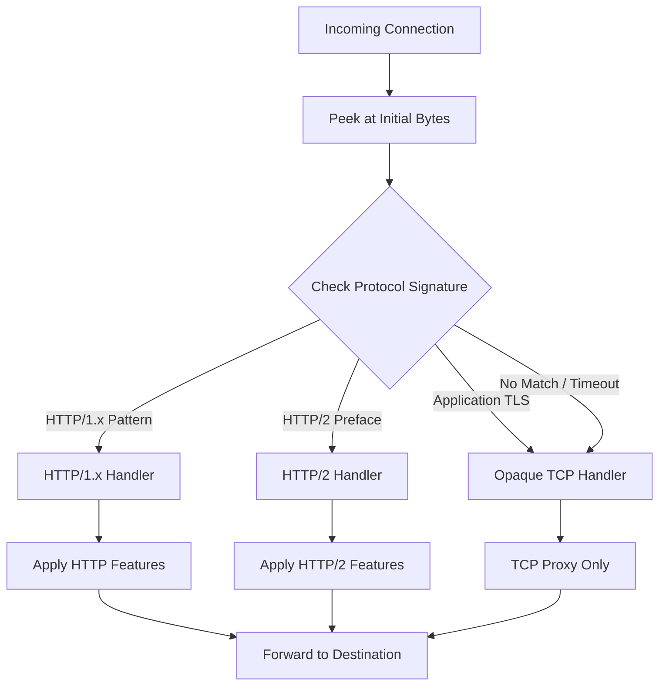

# How to Implement Linkerd Protocol Detection

Author: [nawazdhandala](https://github.com/nawazdhandala)

Tags: Linkerd, Kubernetes, ServiceMesh, Protocol

Description: Learn how Linkerd automatically detects protocols like HTTP, HTTP/2, gRPC, and TCP to enable smart traffic management without manual configuration.

---

## Introduction

Linkerd is a lightweight service mesh that provides observability, reliability, and security for Kubernetes applications. One of its powerful features is automatic protocol detection, which allows Linkerd to identify the protocol being used by incoming connections without requiring explicit configuration.

This automatic detection enables Linkerd to apply protocol-specific features like HTTP metrics, retries, and load balancing strategies without manual annotation of every service.

## How Protocol Detection Works

When a connection arrives at a Linkerd proxy, it needs to determine what protocol the connection is using. Linkerd accomplishes this by peeking at the first few bytes of the connection and matching them against known protocol signatures.

### The Detection Flow



### Protocol Signatures

Linkerd looks for specific byte patterns to identify protocols:

| Protocol | Detection Method |
|----------|------------------|
| HTTP/1.x | Starts with HTTP method (GET, POST, PUT, DELETE, etc.) |
| HTTP/2 | Starts with connection preface `PRI * HTTP/2.0\r\n\r\nSM\r\n\r\n` |
| gRPC | HTTP/2 with `content-type: application/grpc` header |
| Application TLS | Treated as opaque TCP unless TLS is terminated before Linkerd sees the traffic |
| TCP | Fallback when no pattern matches |

## Configuring Protocol Detection

### Default Timeout Configuration

Linkerd waits up to 10 seconds to receive enough bytes from the client for protocol detection. If the timeout expires before detection completes, the connection is treated as opaque TCP.

```yaml
# service.yaml

apiVersion: v1
kind: Service
metadata:
  name: api-server
spec:
  selector:
    app: api-server
  ports:
  - name: http
    port: 80
    targetPort: 8080
    # Declare HTTP/1 and skip automatic protocol detection
    appProtocol: http
```

### Setting Default Opaque Ports via Helm

When installing Linkerd with Helm, you can configure the default opaque ports:

```bash
# Install Linkerd with custom default opaque ports
helm install linkerd-control-plane linkerd/linkerd-control-plane \
  --namespace linkerd \
  --set proxy.opaquePorts="25,587,3306,4444,5432,6379,9300,11211,27017"
```

### Per-Service Configuration

You can declare the protocol for specific Service ports using `appProtocol`:

```yaml
# service.yaml
apiVersion: v1
kind: Service
metadata:
  name: grpc-backend
spec:
  selector:
    app: grpc-backend
  ports:
  - name: grpc
    port: 50051
    targetPort: 50051
    # Declare cleartext HTTP/2 and skip automatic protocol detection
    appProtocol: kubernetes.io/h2c
```

## Marking Ports as Opaque

For services that use protocols that cannot be detected (like MySQL, Redis, or custom binary protocols), you should mark the ports as opaque to skip protocol detection entirely.

### Using appProtocol

```yaml
# service.yaml
apiVersion: v1
kind: Service
metadata:
  name: mysql-service
spec:
  selector:
    app: mysql
  ports:
  - port: 3306
    targetPort: 3306
    # Skip protocol detection for port 3306
    appProtocol: linkerd.io/opaque
```

### Multiple Opaque Ports

```yaml
# service.yaml
apiVersion: v1
kind: Service
metadata:
  name: database-cluster
spec:
  selector:
    app: database-cluster
  ports:
  - name: mysql
    port: 3306
    targetPort: 3306
    appProtocol: linkerd.io/opaque
  - name: redis
    port: 6379
    targetPort: 6379
    appProtocol: linkerd.io/opaque
  - name: mongo
    port: 27017
    targetPort: 27017
    appProtocol: linkerd.io/opaque
```

## Server-First Protocols

Some protocols require the server to send data before the client (server-first protocols). These protocols cannot be detected because Linkerd waits for client data that never arrives.

Common server-first protocols include:
- MySQL
- SMTP
- FTP
- SSH

### Configuring Server-First Ports

```yaml
# service.yaml
apiVersion: v1
kind: Service
metadata:
  name: smtp-service
spec:
  selector:
    app: smtp-server
  ports:
  - name: smtp
    port: 25
    targetPort: 25
    # Mark SMTP as opaque (server-first protocol)
    appProtocol: linkerd.io/opaque
  - name: submission
    port: 587
    targetPort: 587
    appProtocol: linkerd.io/opaque
```

## Protocol Detection in Practice

### Example: HTTP Service with Automatic Detection

```yaml
# http-service.yaml
apiVersion: apps/v1
kind: Deployment
metadata:
  name: api-server
  namespace: default
spec:
  replicas: 3
  selector:
    matchLabels:
      app: api-server
  template:
    metadata:
      labels:
        app: api-server
      # No special annotations needed for HTTP
      # Linkerd will automatically detect HTTP traffic
    spec:
      containers:
      - name: api-server
        image: api-server:v1.0.0
        ports:
        - containerPort: 8080
          name: http
        # Health check endpoint helps verify HTTP detection
        livenessProbe:
          httpGet:
            path: /health
            port: 8080
          initialDelaySeconds: 10
          periodSeconds: 5
---
apiVersion: v1
kind: Service
metadata:
  name: api-server
  namespace: default
spec:
  selector:
    app: api-server
  ports:
  - name: http
    port: 80
    targetPort: 8080
```

### Example: gRPC Service Configuration

```yaml
# grpc-service.yaml
apiVersion: apps/v1
kind: Deployment
metadata:
  name: grpc-backend
  namespace: default
spec:
  replicas: 2
  selector:
    matchLabels:
      app: grpc-backend
  template:
    metadata:
      labels:
        app: grpc-backend
      # gRPC runs over HTTP/2, which Linkerd detects automatically
    spec:
      containers:
      - name: grpc-backend
        image: grpc-backend:v1.0.0
        ports:
        - containerPort: 50051
          name: grpc
        # gRPC health checking
        readinessProbe:
          grpc:
            port: 50051
          initialDelaySeconds: 5
          periodSeconds: 10
---
apiVersion: v1
kind: Service
metadata:
  name: grpc-backend
  namespace: default
spec:
  selector:
    app: grpc-backend
  ports:
  - name: grpc
    port: 50051
    targetPort: 50051
    appProtocol: kubernetes.io/h2c
```

### Example: Mixed Protocol Service

```yaml
# mixed-protocol-service.yaml
apiVersion: apps/v1
kind: Deployment
metadata:
  name: data-service
  namespace: default
spec:
  replicas: 2
  selector:
    matchLabels:
      app: data-service
  template:
    metadata:
      labels:
        app: data-service
    spec:
      containers:
      - name: data-service
        image: data-service:v1.0.0
        ports:
        # HTTP API - will be auto-detected
        - containerPort: 8080
          name: http
        # Redis sidecar - marked as opaque
        - containerPort: 6379
          name: redis
---
apiVersion: v1
kind: Service
metadata:
  name: data-service
  namespace: default
spec:
  selector:
    app: data-service
  ports:
  - name: http
    port: 80
    targetPort: 8080
    appProtocol: http
  - name: redis
    port: 6379
    targetPort: 6379
    appProtocol: linkerd.io/opaque
```

## Troubleshooting Protocol Detection

### Checking Protocol Detection Status

Use the Linkerd CLI to inspect protocol detection:

```bash
# Check the proxy logs for protocol detection information
kubectl logs -n default deploy/api-server -c linkerd-proxy | grep -i "protocol"

# View detailed proxy metrics including protocol information
linkerd viz stat deploy/api-server

# Check if connections are being detected correctly
linkerd viz tap deploy/api-server --to deploy/backend-service
```

### Common Issues and Solutions

#### Issue 1: Connections Timing Out During Detection

Symptoms: Slow initial connection, requests fail intermittently.

```bash
# Check for protocol detection timeouts
kubectl logs -n default deploy/my-service -c linkerd-proxy | grep -i "protocol detection timed out"

# Solution: declare the protocol, or mark the port as opaque
kubectl patch service my-service --type='json' \
  -p='[{"op":"add","path":"/spec/ports/0/appProtocol","value":"linkerd.io/opaque"}]'
```

#### Issue 2: HTTP Traffic Treated as TCP

Symptoms: No HTTP metrics, load balancing not working as expected.

```bash
# Verify the protocol being detected
linkerd viz tap deploy/my-service -o wide

# Check if the service is sending valid HTTP
# The first bytes must be a valid HTTP method
curl -v http://my-service.default.svc.cluster.local/health
```

```yaml
# Solution: Ensure the service responds with valid HTTP
# If using a custom protocol over HTTP, ensure headers are correct
apiVersion: v1
kind: Service
metadata:
  name: my-service
spec:
  ports:
  - port: 80
    targetPort: 8080
    # Declare cleartext HTTP/2 if needed
    appProtocol: kubernetes.io/h2c
```

#### Issue 3: Server-First Protocol Hanging

Symptoms: Connections hang indefinitely, no data transferred.

```bash
# Identify the hanging connections
kubectl exec -it deploy/my-service -c linkerd-proxy -- \
  /bin/sh -c "netstat -an | grep ESTABLISHED"

# Solution: Mark the port as opaque
kubectl patch service mysql-service --type='json' \
  -p='[{"op":"add","path":"/spec/ports/0/appProtocol","value":"linkerd.io/opaque"}]'
```

### Protocol Detection Debugging Script

```bash
#!/bin/bash
# debug-protocol-detection.sh
# Script to debug Linkerd protocol detection issues

NAMESPACE=${1:-default}
DEPLOYMENT=${2:-my-service}

echo "=== Checking Protocol Detection for $DEPLOYMENT in $NAMESPACE ==="

# Get current pod-template annotations
echo -e "\n--- Current Pod Template Annotations ---"
kubectl get deployment $DEPLOYMENT -n $NAMESPACE -o jsonpath='{.spec.template.metadata.annotations}' | jq .

# Check proxy logs for protocol info
echo -e "\n--- Proxy Logs (Protocol Related) ---"
kubectl logs -n $NAMESPACE deploy/$DEPLOYMENT -c linkerd-proxy --tail=50 | grep -i "protocol\|detect\|opaque"

# Get traffic stats
echo -e "\n--- Traffic Statistics ---"
linkerd viz stat deploy/$DEPLOYMENT -n $NAMESPACE

# Check for timeout issues
echo -e "\n--- Checking for Timeout Events ---"
kubectl logs -n $NAMESPACE deploy/$DEPLOYMENT -c linkerd-proxy --tail=100 | grep -i "timeout"

# Live traffic tap (runs for 10 seconds)
echo -e "\n--- Live Traffic Tap (10 seconds) ---"
timeout 10 linkerd viz tap deploy/$DEPLOYMENT -n $NAMESPACE -o wide || true

echo -e "\n=== Debug Complete ==="
```

### Verifying Protocol Detection with Metrics

```bash
# Query Prometheus for protocol-specific metrics
kubectl port-forward -n linkerd-viz svc/prometheus 9090:9090 &

# Check HTTP request metrics (only shows if HTTP was detected)
curl -s 'http://localhost:9090/api/v1/query?query=request_total' | jq '.data.result[] | select(.metric.deployment=="api-server")'

# Check TCP connection metrics
curl -s 'http://localhost:9090/api/v1/query?query=tcp_open_total' | jq '.data.result[] | select(.metric.deployment=="api-server")'
```

## Best Practices

### 1. Use Named Ports and appProtocol

Named ports help operators understand the expected protocol, and `appProtocol` lets Linkerd skip automatic detection when the protocol is known:

```yaml
# Good: Named ports with appProtocol
ports:
- name: http
  port: 80
  targetPort: 8080
  appProtocol: http
- name: grpc
  port: 50051
  targetPort: 50051
  appProtocol: kubernetes.io/h2c
- name: mysql
  port: 3306
  targetPort: 3306
  appProtocol: linkerd.io/opaque

# Avoid: Unnamed ports without appProtocol
ports:
- port: 80
  targetPort: 8080
```

### 2. Pre-Configure Known Opaque Ports

Declare known non-HTTP services as opaque proactively:

```yaml
# Configure at the Service level for consistency
apiVersion: v1
kind: Service
metadata:
  name: postgres
spec:
  selector:
    app: postgres
  ports:
  - name: postgres
    port: 5432
    targetPort: 5432
    appProtocol: linkerd.io/opaque
```

### 3. Monitor Detection Timeouts

Keep an eye on protocol detection timeouts in proxy logs:

```bash
# Check for protocol detection timeout messages
kubectl logs -n default deploy/my-service -c linkerd-proxy | grep -i "protocol detection timed out"
```

### 4. Document Protocol Requirements

Maintain documentation of which services require special protocol configuration:

```yaml
# Add labels for documentation purposes
apiVersion: v1
kind: Service
metadata:
  name: legacy-service
  labels:
    protocol-type: server-first
    requires-opaque: "true"
spec:
  ports:
  - port: 1234
    targetPort: 1234
    appProtocol: linkerd.io/opaque
```

## Conclusion

Linkerd's automatic protocol detection simplifies service mesh adoption by eliminating the need for manual protocol configuration in most cases. Understanding how detection works, when to configure opaque ports, and how to troubleshoot issues ensures smooth operation of your service mesh.

Key takeaways:
- HTTP, HTTP/2, and gRPC are automatically detected
- Server-first protocols and binary protocols should be marked as opaque
- Use `appProtocol` declarations to skip detection when the protocol is known
- Monitor protocol detection timeouts with Linkerd's built-in tools
- Document any special protocol requirements for your services

By following these practices, you can leverage Linkerd's protocol detection to get rich observability and traffic management features with minimal configuration overhead.
