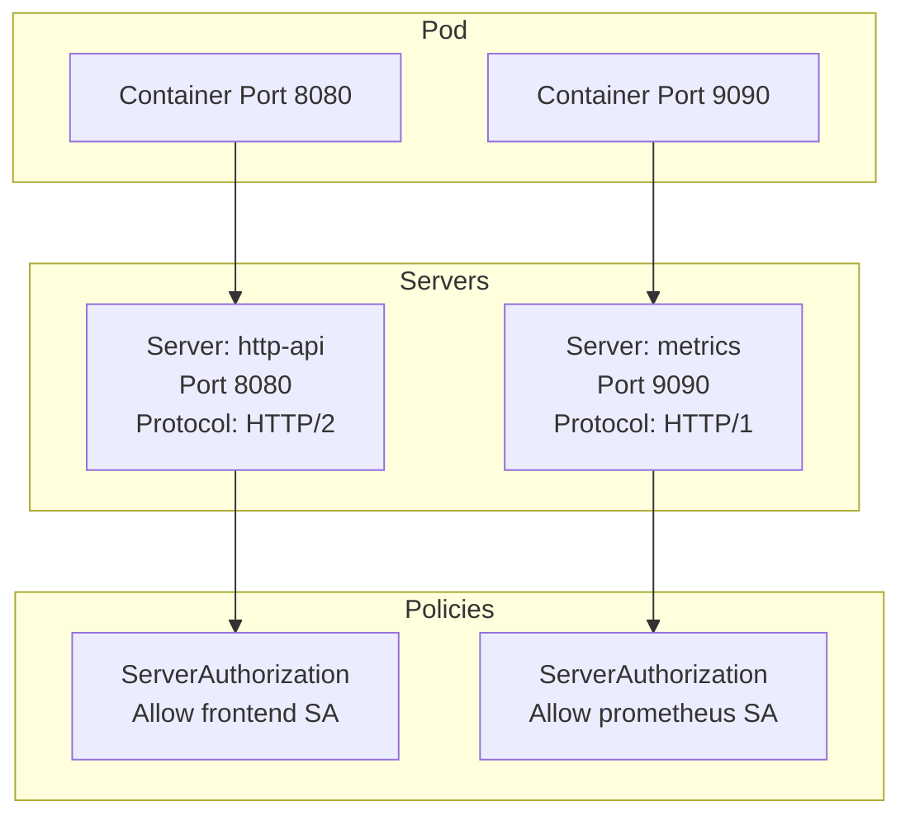
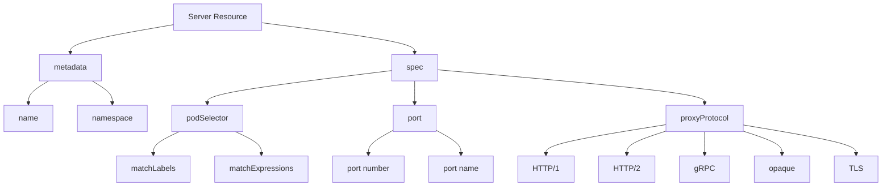
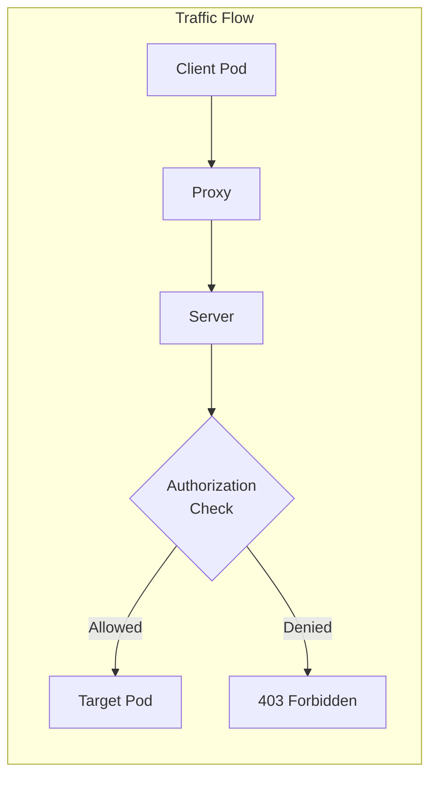

# How to Implement Linkerd Server Resource

Author: [nawazdhandala](https://github.com/nawazdhandala)

Tags: Linkerd, Service Mesh, Server, Policy

Description: A practical guide to implementing Linkerd Server resources for fine-grained traffic policy, port selection, and access control in Kubernetes.

---

Linkerd's policy system lets you control which clients can communicate with your services at a granular level. The Server resource is the foundation of this system. It defines what ports and protocols your workloads accept, and when paired with authorization resources, it determines who can talk to those endpoints.

## What is a Server Resource?

A Server resource tells Linkerd about a specific network endpoint on your pods. Without it, Linkerd applies default policies. With it, you get explicit control over:

- Which pods the policy applies to
- Which ports are covered
- What protocol the proxy should expect
- How to handle unauthorized traffic



## Prerequisites

Before working with Server resources, ensure:

- Linkerd 2.12 or later is installed (policy resources were introduced in 2.11 and stabilized in 2.12)
- Your pods are meshed (have the linkerd-proxy injected)
- You have the `linkerd` CLI installed

Check your installation:

```bash
# Verify Linkerd version
linkerd version

# Check policy controller is running
kubectl get pods -n linkerd | grep policy

# Confirm your namespace is meshed
kubectl get pods -n my-app -o jsonpath='{.items[*].spec.containers[*].name}' | tr ' ' '\n' | grep linkerd-proxy
```

## Basic Server Resource

The simplest Server resource targets a port on selected pods:

```yaml
apiVersion: policy.linkerd.io/v1beta2
kind: Server
metadata:
  name: api-server
  namespace: my-app
spec:
  podSelector:
    matchLabels:
      app: api
  port: 8080
  proxyProtocol: HTTP/2
```

This Server:
- Selects all pods with label `app: api` in the `my-app` namespace
- Covers port 8080
- Tells the proxy to expect HTTP/2 traffic (which includes gRPC)

Apply it:

```bash
kubectl apply -f server.yaml
```

## Server Resource Anatomy



### Pod Selector

The `podSelector` field determines which pods this Server applies to. It works like other Kubernetes selectors.

```yaml
# Match by labels
spec:
  podSelector:
    matchLabels:
      app: api
      version: v2

# Match with expressions
spec:
  podSelector:
    matchExpressions:
      - key: app
        operator: In
        values:
          - api
          - backend
      - key: environment
        operator: NotIn
        values:
          - development
```

An empty selector matches all pods in the namespace:

```yaml
spec:
  podSelector: {}
  port: 8080
```

### Port Selection

You can specify ports by number or by name:

```yaml
# By port number
spec:
  port: 8080

# By port name (matches containerPort name in pod spec)
spec:
  port: http-api

# Port range is not supported - create separate Servers for each port
```

When using port names, the name must match what is defined in your pod's container spec:

```yaml
# Pod container spec
containers:
  - name: api
    ports:
      - name: http-api    # This name
        containerPort: 8080
      - name: metrics
        containerPort: 9090
```

```yaml
# Server targeting named port
spec:
  port: http-api    # Matches the container port name
```

### Proxy Protocol

The `proxyProtocol` field tells Linkerd what kind of traffic to expect. This affects how the proxy handles connections and what features are available.

| Protocol | Use Case | Features Available |
|----------|----------|-------------------|
| `HTTP/1` | REST APIs, web servers | Per-route metrics, retries, timeouts |
| `HTTP/2` | gRPC, HTTP/2 services | Per-route metrics, retries, timeouts, multiplexing |
| `gRPC` | gRPC services (alias for HTTP/2) | Same as HTTP/2 |
| `opaque` | TCP, databases, non-HTTP | mTLS only, no L7 features |
| `TLS` | TLS-encrypted non-HTTP | Passthrough, no mTLS |

```yaml
# HTTP/1 REST API
spec:
  port: 8080
  proxyProtocol: HTTP/1

# gRPC service
spec:
  port: 50051
  proxyProtocol: gRPC

# PostgreSQL (opaque TCP)
spec:
  port: 5432
  proxyProtocol: opaque

# External TLS passthrough
spec:
  port: 443
  proxyProtocol: TLS
```

## Complete Server Examples

### REST API Service

```yaml
apiVersion: policy.linkerd.io/v1beta2
kind: Server
metadata:
  name: users-api
  namespace: production
  labels:
    app: users-api
spec:
  podSelector:
    matchLabels:
      app: users-api
  port: 8080
  proxyProtocol: HTTP/1
```

### gRPC Microservice

```yaml
apiVersion: policy.linkerd.io/v1beta2
kind: Server
metadata:
  name: inventory-grpc
  namespace: warehouse
spec:
  podSelector:
    matchLabels:
      app: inventory
      component: grpc-server
  port: 50051
  proxyProtocol: gRPC
```

### Database Proxy

```yaml
apiVersion: policy.linkerd.io/v1beta2
kind: Server
metadata:
  name: postgres-server
  namespace: data
spec:
  podSelector:
    matchLabels:
      app: postgres
  port: 5432
  proxyProtocol: opaque
```

### Multi-Port Service

For services that expose multiple ports, create a Server for each:

```yaml
apiVersion: policy.linkerd.io/v1beta2
kind: Server
metadata:
  name: api-http
  namespace: my-app
spec:
  podSelector:
    matchLabels:
      app: api
  port: 8080
  proxyProtocol: HTTP/1
---
apiVersion: policy.linkerd.io/v1beta2
kind: Server
metadata:
  name: api-metrics
  namespace: my-app
spec:
  podSelector:
    matchLabels:
      app: api
  port: 9090
  proxyProtocol: HTTP/1
---
apiVersion: policy.linkerd.io/v1beta2
kind: Server
metadata:
  name: api-grpc
  namespace: my-app
spec:
  podSelector:
    matchLabels:
      app: api
  port: 50051
  proxyProtocol: gRPC
```

## Combining Servers with Authorization

Servers alone do not restrict traffic. They define endpoints. To control access, pair them with ServerAuthorization or AuthorizationPolicy resources.



### ServerAuthorization (Deprecated but Common)

The older ServerAuthorization resource references a Server by name:

```yaml
apiVersion: policy.linkerd.io/v1beta2
kind: Server
metadata:
  name: api-server
  namespace: my-app
spec:
  podSelector:
    matchLabels:
      app: api
  port: 8080
  proxyProtocol: HTTP/1
---
apiVersion: policy.linkerd.io/v1beta1
kind: ServerAuthorization
metadata:
  name: allow-frontend
  namespace: my-app
spec:
  server:
    name: api-server
  client:
    meshTLS:
      serviceAccounts:
        - name: frontend
          namespace: my-app
```

### AuthorizationPolicy (Recommended)

The newer AuthorizationPolicy uses targetRef to select Servers:

```yaml
apiVersion: policy.linkerd.io/v1beta2
kind: Server
metadata:
  name: api-server
  namespace: my-app
spec:
  podSelector:
    matchLabels:
      app: api
  port: 8080
  proxyProtocol: HTTP/1
---
apiVersion: policy.linkerd.io/v1alpha1
kind: AuthorizationPolicy
metadata:
  name: allow-frontend
  namespace: my-app
spec:
  targetRef:
    group: policy.linkerd.io
    kind: Server
    name: api-server
  requiredAuthenticationRefs:
    - name: frontend-identity
      kind: MeshTLSAuthentication
      group: policy.linkerd.io
---
apiVersion: policy.linkerd.io/v1alpha1
kind: MeshTLSAuthentication
metadata:
  name: frontend-identity
  namespace: my-app
spec:
  identities:
    - "frontend.my-app.serviceaccount.identity.linkerd.cluster.local"
```

## Default Policy Configuration

When no Server matches a port, Linkerd applies the default policy. Configure it at install time or per-namespace.

### Cluster-Wide Default

```bash
# Set default policy during installation
linkerd install --set policyController.defaultAllowPolicy=all-authenticated | kubectl apply -f -

# Available policies:
# - all-unauthenticated: Allow all traffic (default)
# - all-authenticated: Require mTLS identity
# - cluster-unauthenticated: Allow from cluster only
# - cluster-authenticated: Require mTLS from cluster
# - deny: Deny all traffic without explicit authorization
```

### Per-Namespace Default

```yaml
apiVersion: v1
kind: Namespace
metadata:
  name: secure-apps
  annotations:
    config.linkerd.io/default-inbound-policy: all-authenticated
```

### Per-Workload Default

```yaml
apiVersion: apps/v1
kind: Deployment
metadata:
  name: api
  namespace: my-app
spec:
  template:
    metadata:
      annotations:
        config.linkerd.io/default-inbound-policy: deny
    spec:
      containers:
        - name: api
          image: my-api:v1
```

## Real-World Patterns

### Pattern 1: Zero-Trust API Layer

Deny all traffic by default, then explicitly allow specific clients:

```yaml
# Server for the API
apiVersion: policy.linkerd.io/v1beta2
kind: Server
metadata:
  name: orders-api
  namespace: orders
spec:
  podSelector:
    matchLabels:
      app: orders-api
  port: 8080
  proxyProtocol: HTTP/1
---
# Deny all by default via namespace annotation
apiVersion: v1
kind: Namespace
metadata:
  name: orders
  annotations:
    config.linkerd.io/default-inbound-policy: deny
    linkerd.io/inject: enabled
---
# Allow frontend service account
apiVersion: policy.linkerd.io/v1alpha1
kind: AuthorizationPolicy
metadata:
  name: allow-frontend-to-orders
  namespace: orders
spec:
  targetRef:
    group: policy.linkerd.io
    kind: Server
    name: orders-api
  requiredAuthenticationRefs:
    - name: frontend-mtls
      kind: MeshTLSAuthentication
      group: policy.linkerd.io
---
apiVersion: policy.linkerd.io/v1alpha1
kind: MeshTLSAuthentication
metadata:
  name: frontend-mtls
  namespace: orders
spec:
  identities:
    - "frontend.storefront.serviceaccount.identity.linkerd.cluster.local"
---
# Allow admin service account
apiVersion: policy.linkerd.io/v1alpha1
kind: AuthorizationPolicy
metadata:
  name: allow-admin-to-orders
  namespace: orders
spec:
  targetRef:
    group: policy.linkerd.io
    kind: Server
    name: orders-api
  requiredAuthenticationRefs:
    - name: admin-mtls
      kind: MeshTLSAuthentication
      group: policy.linkerd.io
---
apiVersion: policy.linkerd.io/v1alpha1
kind: MeshTLSAuthentication
metadata:
  name: admin-mtls
  namespace: orders
spec:
  identities:
    - "admin-dashboard.internal.serviceaccount.identity.linkerd.cluster.local"
```

### Pattern 2: Metrics Endpoint for Prometheus

Allow only Prometheus to scrape metrics:

```yaml
apiVersion: policy.linkerd.io/v1beta2
kind: Server
metadata:
  name: app-metrics
  namespace: my-app
spec:
  podSelector:
    matchLabels:
      app: my-app
  port: 9090
  proxyProtocol: HTTP/1
---
apiVersion: policy.linkerd.io/v1alpha1
kind: AuthorizationPolicy
metadata:
  name: prometheus-scrape
  namespace: my-app
spec:
  targetRef:
    group: policy.linkerd.io
    kind: Server
    name: app-metrics
  requiredAuthenticationRefs:
    - name: prometheus-identity
      kind: MeshTLSAuthentication
      group: policy.linkerd.io
---
apiVersion: policy.linkerd.io/v1alpha1
kind: MeshTLSAuthentication
metadata:
  name: prometheus-identity
  namespace: my-app
spec:
  identities:
    - "prometheus.monitoring.serviceaccount.identity.linkerd.cluster.local"
```

### Pattern 3: Database Access Control

Restrict database access to specific backend services:

```yaml
apiVersion: policy.linkerd.io/v1beta2
kind: Server
metadata:
  name: postgres
  namespace: data
spec:
  podSelector:
    matchLabels:
      app: postgres
  port: 5432
  proxyProtocol: opaque
---
apiVersion: policy.linkerd.io/v1alpha1
kind: AuthorizationPolicy
metadata:
  name: db-access
  namespace: data
spec:
  targetRef:
    group: policy.linkerd.io
    kind: Server
    name: postgres
  requiredAuthenticationRefs:
    - name: backend-services
      kind: MeshTLSAuthentication
      group: policy.linkerd.io
---
apiVersion: policy.linkerd.io/v1alpha1
kind: MeshTLSAuthentication
metadata:
  name: backend-services
  namespace: data
spec:
  identities:
    - "api.production.serviceaccount.identity.linkerd.cluster.local"
    - "worker.production.serviceaccount.identity.linkerd.cluster.local"
    - "migration-job.production.serviceaccount.identity.linkerd.cluster.local"
```

### Pattern 4: Health Check Endpoints

Allow health checks from kubelet (unauthenticated) while protecting other endpoints:

```yaml
# Health check port - allow unauthenticated
apiVersion: policy.linkerd.io/v1beta2
kind: Server
metadata:
  name: health-server
  namespace: my-app
spec:
  podSelector:
    matchLabels:
      app: api
  port: 8081
  proxyProtocol: HTTP/1
---
apiVersion: policy.linkerd.io/v1alpha1
kind: AuthorizationPolicy
metadata:
  name: allow-health-checks
  namespace: my-app
spec:
  targetRef:
    group: policy.linkerd.io
    kind: Server
    name: health-server
  requiredAuthenticationRefs:
    - name: allow-all
      kind: NetworkAuthentication
      group: policy.linkerd.io
---
apiVersion: policy.linkerd.io/v1alpha1
kind: NetworkAuthentication
metadata:
  name: allow-all
  namespace: my-app
spec:
  networks:
    - cidr: 0.0.0.0/0
    - cidr: "::/0"
---
# API port - require authentication
apiVersion: policy.linkerd.io/v1beta2
kind: Server
metadata:
  name: api-server
  namespace: my-app
spec:
  podSelector:
    matchLabels:
      app: api
  port: 8080
  proxyProtocol: HTTP/1
---
apiVersion: policy.linkerd.io/v1alpha1
kind: AuthorizationPolicy
metadata:
  name: api-access
  namespace: my-app
spec:
  targetRef:
    group: policy.linkerd.io
    kind: Server
    name: api-server
  requiredAuthenticationRefs:
    - name: mesh-clients
      kind: MeshTLSAuthentication
      group: policy.linkerd.io
```

## Debugging Server Policies

### Check Server Status

```bash
# List all Servers in a namespace
kubectl get servers -n my-app

# Describe a specific Server
kubectl describe server api-server -n my-app

# Check which pods match the Server selector
kubectl get pods -n my-app -l app=api
```

### Verify Policy is Applied

```bash
# Check inbound policy for a pod
linkerd diagnostics policy -n my-app pod/api-xxxxx-yyyyy

# Sample output shows which Servers and authorizations apply
```

### Test Authorization

```bash
# From an authorized client pod
kubectl exec -it deploy/frontend -n my-app -- curl http://api:8080/health

# From an unauthorized pod (should get 403)
kubectl exec -it deploy/debug -n my-app -- curl http://api:8080/health
```

### Check Proxy Logs

```bash
# View proxy logs for policy decisions
kubectl logs deploy/api -n my-app -c linkerd-proxy | grep -i policy

# Enable debug logging temporarily
kubectl annotate pod api-xxxxx-yyyyy -n my-app config.linkerd.io/proxy-log-level=linkerd=debug,info
```

### Common Issues

**Traffic blocked unexpectedly:**
- Check if a Server exists for the target port
- Verify the pod selector matches your pods
- Confirm authorization policies allow the client identity
- Check namespace default policy

**Wrong protocol errors:**
- Ensure `proxyProtocol` matches actual traffic type
- HTTP/2 for gRPC, HTTP/1 for REST APIs
- Use `opaque` for databases and non-HTTP TCP

**Policies not taking effect:**
- Restart pods after creating Servers
- Verify pods have the linkerd-proxy container
- Check linkerd-proxy logs for errors

## Best Practices

1. **Start with monitoring, not enforcement.** Create Servers without restrictive authorization first. Use `linkerd viz tap` to understand traffic patterns before adding restrictions.

2. **Use named ports consistently.** Define port names in your container specs and reference them in Servers. This makes configurations more readable and resilient to port number changes.

3. **Separate health checks from API ports.** Run health check endpoints on a different port so you can allow unauthenticated kubelet probes without exposing your API.

4. **Match Servers to ServiceAccounts.** One service account per workload makes authorization policies cleaner. Avoid sharing service accounts across unrelated services.

5. **Document your policies.** Add labels and annotations to Servers explaining their purpose. Future you will appreciate knowing why that policy exists.

6. **Test in staging first.** Policy misconfigurations can break production traffic. Validate in a staging environment with realistic traffic before production rollout.

7. **Use GitOps for policy management.** Store Server and authorization resources in version control. Review changes through pull requests just like application code.

## Summary

The Server resource is how you tell Linkerd about your workload's network endpoints. It defines which pods, ports, and protocols the policy system should manage. Without Servers, Linkerd applies default policies. With them, you get explicit control over traffic handling and can layer on fine-grained authorization.

Key points:
- Servers target pods via label selectors
- Each Server covers one port (create multiple for multi-port services)
- The `proxyProtocol` field affects available features
- Pair Servers with AuthorizationPolicy for access control
- Default policies fill gaps where no Server exists
- Debug with `linkerd diagnostics policy` and proxy logs

Start by creating Servers for your critical services, observe the traffic patterns, then add authorization policies to lock down access.
