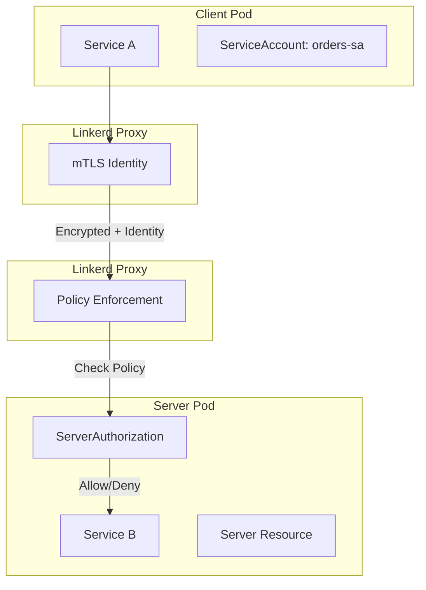
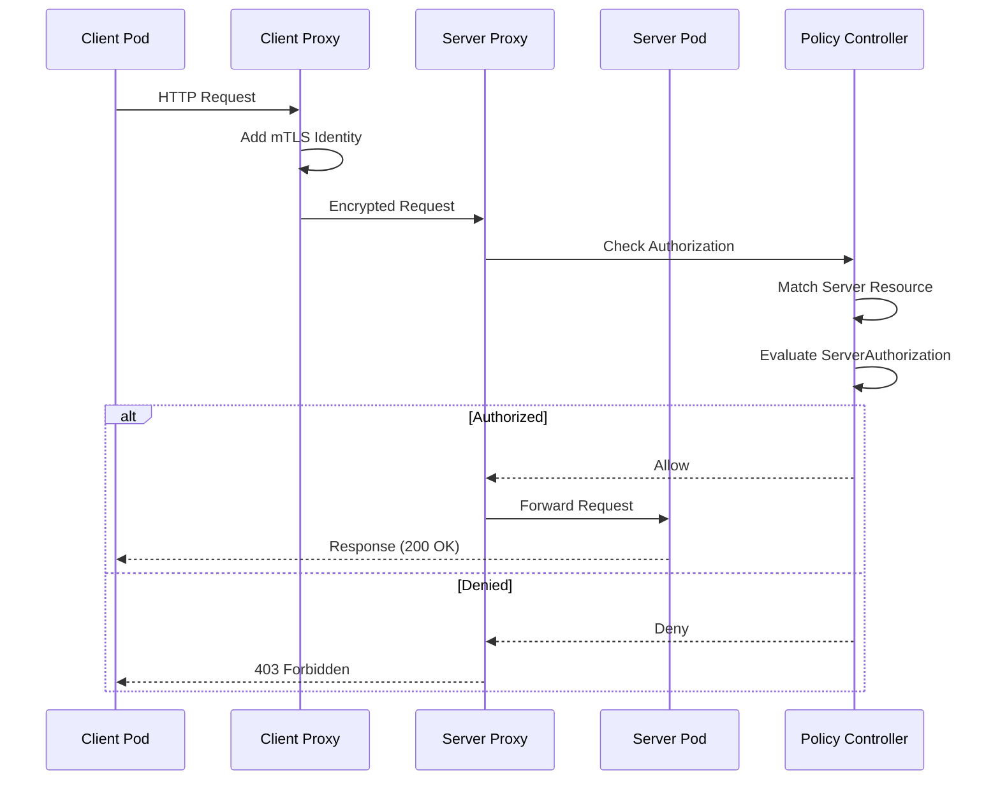

# How to Create Linkerd ServerAuthorization

Author: [nawazdhandala](https://github.com/nawazdhandala)

Tags: Linkerd, Kubernetes, ServiceMesh, Authorization

Description: Learn how to implement service-to-service access control in Linkerd using ServerAuthorization resources for zero-trust security.

---

Linkerd provides built-in authorization policies that let you control which services can communicate with each other. ServerAuthorization is the core resource for defining these access control rules. Unlike Network Policies that operate at Layer 3/4, Linkerd authorization works at Layer 7 and uses cryptographic identities from mTLS certificates.

## Understanding Linkerd Authorization

Linkerd authorization builds on two key concepts: Servers (what you protect) and ServerAuthorizations (who can access it).



### Prerequisites

Before using ServerAuthorization, ensure:

- Linkerd 2.12+ is installed with policy controller enabled
- Pods are injected with Linkerd proxy
- mTLS is enabled (default in Linkerd)

Check your Linkerd installation:

```bash
# Verify Linkerd is installed and healthy
linkerd check

# Verify policy controller is running
kubectl get pods -n linkerd -l linkerd.io/control-plane-component=destination
```

## The Server Resource

Before creating authorizations, you need a Server resource that defines what ports and protocols to protect.

### Basic Server Definition

```yaml
# server.yaml
# Defines a protected endpoint on port 8080 for the payments service
apiVersion: policy.linkerd.io/v1beta2
kind: Server
metadata:
  name: payments-server
  namespace: production
spec:
  # Select pods by label - must match your deployment labels
  podSelector:
    matchLabels:
      app: payments
  # Define the port to protect
  port: 8080
  # Protocol detection (HTTP/1, HTTP/2, gRPC, or opaque for TCP)
  proxyProtocol: HTTP/2
```

### Server with Named Port

```yaml
# server-named-port.yaml
# Reference a port by name instead of number for flexibility
apiVersion: policy.linkerd.io/v1beta2
kind: Server
metadata:
  name: api-server
  namespace: production
spec:
  podSelector:
    matchLabels:
      app: api-gateway
  # Use the port name from your container spec
  port: http
  proxyProtocol: HTTP/1
```

### Server for gRPC Services

```yaml
# server-grpc.yaml
# Configure server for gRPC traffic with HTTP/2 protocol
apiVersion: policy.linkerd.io/v1beta2
kind: Server
metadata:
  name: grpc-server
  namespace: production
spec:
  podSelector:
    matchLabels:
      app: order-service
  port: 50051
  # gRPC requires HTTP/2
  proxyProtocol: gRPC
```

## ServerAuthorization Resource Specification

ServerAuthorization defines who can access a Server. It connects client identities to server resources.

### Full Specification

```yaml
apiVersion: policy.linkerd.io/v1beta2
kind: ServerAuthorization
metadata:
  name: <authorization-name>
  namespace: <namespace>
spec:
  # Required: Reference to the Server resource
  server:
    name: <server-name>
  # Required: Define allowed clients
  client:
    # Option 1: Allow specific ServiceAccounts
    meshTLS:
      serviceAccounts:
        - name: <service-account-name>
          namespace: <namespace>
    # Option 2: Allow by identity string
    meshTLS:
      identities:
        - "*.production.serviceaccount.identity.linkerd.cluster.local"
    # Option 3: Allow unauthenticated traffic (use sparingly)
    unauthenticated: true
    # Option 4: Allow all authenticated mesh traffic
    meshTLS:
      identities:
        - "*"
```

## Client Identity Selectors

Linkerd identifies clients using their ServiceAccount-based mTLS identity. Here are the different ways to select clients.

### Select by ServiceAccount

The most common and recommended approach:

```yaml
# authz-service-account.yaml
# Allow only the checkout service to access payments
apiVersion: policy.linkerd.io/v1beta2
kind: ServerAuthorization
metadata:
  name: allow-checkout-to-payments
  namespace: production
spec:
  server:
    name: payments-server
  client:
    meshTLS:
      # Explicitly list allowed ServiceAccounts
      serviceAccounts:
        - name: checkout-sa
          namespace: production
        - name: refund-sa
          namespace: production
```

### Select by Namespace

Allow all services from specific namespaces:

```yaml
# authz-namespace.yaml
# Allow any service in the internal namespace to access the API
apiVersion: policy.linkerd.io/v1beta2
kind: ServerAuthorization
metadata:
  name: allow-internal-namespace
  namespace: production
spec:
  server:
    name: api-server
  client:
    meshTLS:
      # Wildcard matches all ServiceAccounts in the namespace
      identities:
        - "*.internal.serviceaccount.identity.linkerd.cluster.local"
```

### Select by Identity Pattern

Use wildcards for flexible matching:

```yaml
# authz-identity-pattern.yaml
# Allow services matching a pattern
apiVersion: policy.linkerd.io/v1beta2
kind: ServerAuthorization
metadata:
  name: allow-frontend-services
  namespace: production
spec:
  server:
    name: api-server
  client:
    meshTLS:
      identities:
        # Match any service account starting with "frontend-"
        - "frontend-*.production.serviceaccount.identity.linkerd.cluster.local"
        # Match all services in staging namespace
        - "*.staging.serviceaccount.identity.linkerd.cluster.local"
```

## Authorization Flow

Here is how Linkerd processes an incoming request:



## Practical Examples

### Example 1: Microservices Authorization

Protect a three-tier application where frontend calls API, and API calls database.

```yaml
# 1-servers.yaml
# Define protected servers for each tier
---
apiVersion: policy.linkerd.io/v1beta2
kind: Server
metadata:
  name: api-server
  namespace: production
spec:
  podSelector:
    matchLabels:
      app: api
  port: 8080
  proxyProtocol: HTTP/1
---
apiVersion: policy.linkerd.io/v1beta2
kind: Server
metadata:
  name: database-server
  namespace: production
spec:
  podSelector:
    matchLabels:
      app: postgres
  port: 5432
  # Database uses raw TCP, not HTTP
  proxyProtocol: opaque
```

```yaml
# 2-authorizations.yaml
# Define who can access each server
---
# Only frontend can call API
apiVersion: policy.linkerd.io/v1beta2
kind: ServerAuthorization
metadata:
  name: frontend-to-api
  namespace: production
spec:
  server:
    name: api-server
  client:
    meshTLS:
      serviceAccounts:
        - name: frontend-sa
          namespace: production
---
# Only API can call database
apiVersion: policy.linkerd.io/v1beta2
kind: ServerAuthorization
metadata:
  name: api-to-database
  namespace: production
spec:
  server:
    name: database-server
  client:
    meshTLS:
      serviceAccounts:
        - name: api-sa
          namespace: production
```

### Example 2: Allow Health Check Probes

Kubernetes probes come from the kubelet and are unauthenticated. Create a separate authorization for them:

```yaml
# health-check-authz.yaml
---
# Server for health endpoint only
apiVersion: policy.linkerd.io/v1beta2
kind: Server
metadata:
  name: health-server
  namespace: production
spec:
  podSelector:
    matchLabels:
      app: api
  # Health checks typically use a different port
  port: 8081
  proxyProtocol: HTTP/1
---
# Allow unauthenticated access to health endpoint
apiVersion: policy.linkerd.io/v1beta2
kind: ServerAuthorization
metadata:
  name: allow-health-probes
  namespace: production
spec:
  server:
    name: health-server
  client:
    # Kubelet probes are not part of the mesh
    unauthenticated: true
```

### Example 3: Cross-Namespace Communication

Allow monitoring namespace to scrape metrics from all namespaces:

```yaml
# monitoring-authz.yaml
# Allow Prometheus to scrape metrics from production services
apiVersion: policy.linkerd.io/v1beta2
kind: ServerAuthorization
metadata:
  name: allow-prometheus-scrape
  namespace: production
spec:
  server:
    name: metrics-server
  client:
    meshTLS:
      serviceAccounts:
        # Prometheus runs in the monitoring namespace
        - name: prometheus-sa
          namespace: monitoring
```

### Example 4: Default Deny with Explicit Allows

Implement zero-trust by denying all traffic by default:

```yaml
# default-policy.yaml
# First, set the default policy to deny in the namespace
# This is done via annotation on the namespace
---
apiVersion: v1
kind: Namespace
metadata:
  name: production
  annotations:
    # Deny all traffic by default
    config.linkerd.io/default-inbound-policy: deny
```

```yaml
# explicit-allows.yaml
# Then create explicit authorizations for allowed traffic
---
apiVersion: policy.linkerd.io/v1beta2
kind: Server
metadata:
  name: orders-api
  namespace: production
spec:
  podSelector:
    matchLabels:
      app: orders
  port: 8080
  proxyProtocol: HTTP/1
---
apiVersion: policy.linkerd.io/v1beta2
kind: ServerAuthorization
metadata:
  name: allow-orders-clients
  namespace: production
spec:
  server:
    name: orders-api
  client:
    meshTLS:
      serviceAccounts:
        - name: cart-sa
          namespace: production
        - name: checkout-sa
          namespace: production
        - name: admin-dashboard-sa
          namespace: backoffice
```

## Testing and Debugging

### Verify Server Resources

```bash
# List all servers in a namespace
kubectl get servers -n production

# Describe a specific server
kubectl describe server payments-server -n production
```

### Verify Authorizations

```bash
# List all authorizations
kubectl get serverauthorizations -n production

# Check authorization details
kubectl describe serverauthorization allow-checkout-to-payments -n production
```

### Test Authorization with curl

```bash
# Deploy a test pod with a specific service account
kubectl run test-client \
  --image=curlimages/curl \
  --serviceaccount=checkout-sa \
  --namespace=production \
  --command -- sleep infinity

# Test the connection
kubectl exec -n production test-client -- \
  curl -v http://payments-service:8080/health

# Expected: 200 OK if authorized, 403 Forbidden if denied
```

### Check Linkerd Proxy Logs

```bash
# View proxy logs for authorization decisions
kubectl logs -n production deploy/payments -c linkerd-proxy | grep -i authz

# Use linkerd viz to see traffic
linkerd viz stat -n production deploy/payments
```

### Common Debugging Commands

```bash
# Check if pods have Linkerd proxy injected
kubectl get pods -n production -o jsonpath='{.items[*].spec.containers[*].name}' | tr ' ' '\n' | grep linkerd

# Verify mTLS is working between services
linkerd viz edges -n production

# Check the identity of a pod
kubectl exec -n production deploy/checkout -c linkerd-proxy -- \
  cat /var/run/linkerd/identity/end-entity-certificate.crt | \
  openssl x509 -noout -subject
```

## Best Practices

### 1. Start with Audit Mode

Before enforcing deny-by-default, use audit mode to understand traffic patterns:

```yaml
apiVersion: v1
kind: Namespace
metadata:
  name: production
  annotations:
    # Audit mode logs denied requests without blocking them
    config.linkerd.io/default-inbound-policy: audit
```

### 2. Use Dedicated ServiceAccounts

Create unique ServiceAccounts for each service:

```yaml
# service-accounts.yaml
---
apiVersion: v1
kind: ServiceAccount
metadata:
  name: orders-sa
  namespace: production
---
apiVersion: apps/v1
kind: Deployment
metadata:
  name: orders
  namespace: production
spec:
  template:
    spec:
      # Reference the dedicated ServiceAccount
      serviceAccountName: orders-sa
      containers:
        - name: orders
          image: myapp/orders:v1
```

### 3. Document Authorization Policies

Add labels and annotations for clarity:

```yaml
apiVersion: policy.linkerd.io/v1beta2
kind: ServerAuthorization
metadata:
  name: allow-checkout-to-payments
  namespace: production
  labels:
    owner: payments-team
    purpose: checkout-flow
  annotations:
    description: "Allows checkout service to process payments during order completion"
spec:
  server:
    name: payments-server
  client:
    meshTLS:
      serviceAccounts:
        - name: checkout-sa
          namespace: production
```

### 4. Organize by Service

Group Server and ServerAuthorization resources together:

```
policies/
  production/
    payments/
      server.yaml
      authorizations.yaml
    orders/
      server.yaml
      authorizations.yaml
    shared/
      health-check-authz.yaml
```

## Security Checklist

- [ ] Set default-inbound-policy to deny in production namespaces
- [ ] Create dedicated ServiceAccounts for each service
- [ ] Define Server resources for all exposed ports
- [ ] Create explicit ServerAuthorization for each allowed communication path
- [ ] Allow unauthenticated traffic only for health checks and public endpoints
- [ ] Test authorizations in staging before production
- [ ] Monitor for denied requests using linkerd viz
- [ ] Review and audit authorizations quarterly

---

ServerAuthorization gives you fine-grained control over service-to-service communication in Linkerd. Combined with mTLS identities, it provides cryptographic proof of client identity, making it more secure than IP-based Network Policies. Start with audit mode, map your service dependencies, then enable deny-by-default for true zero-trust networking.
