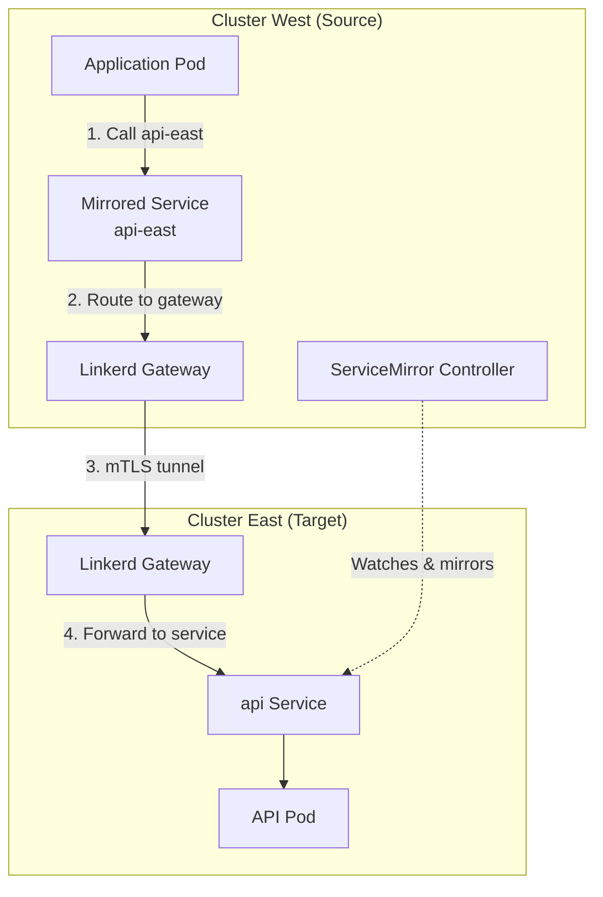
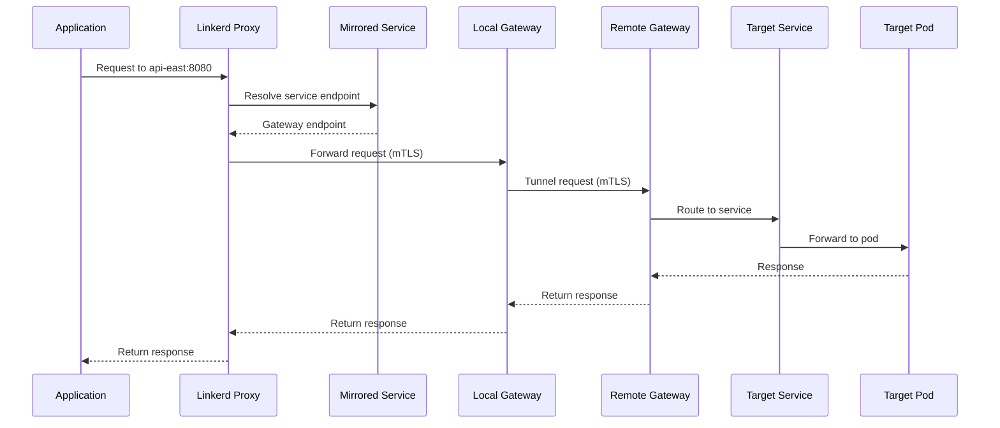
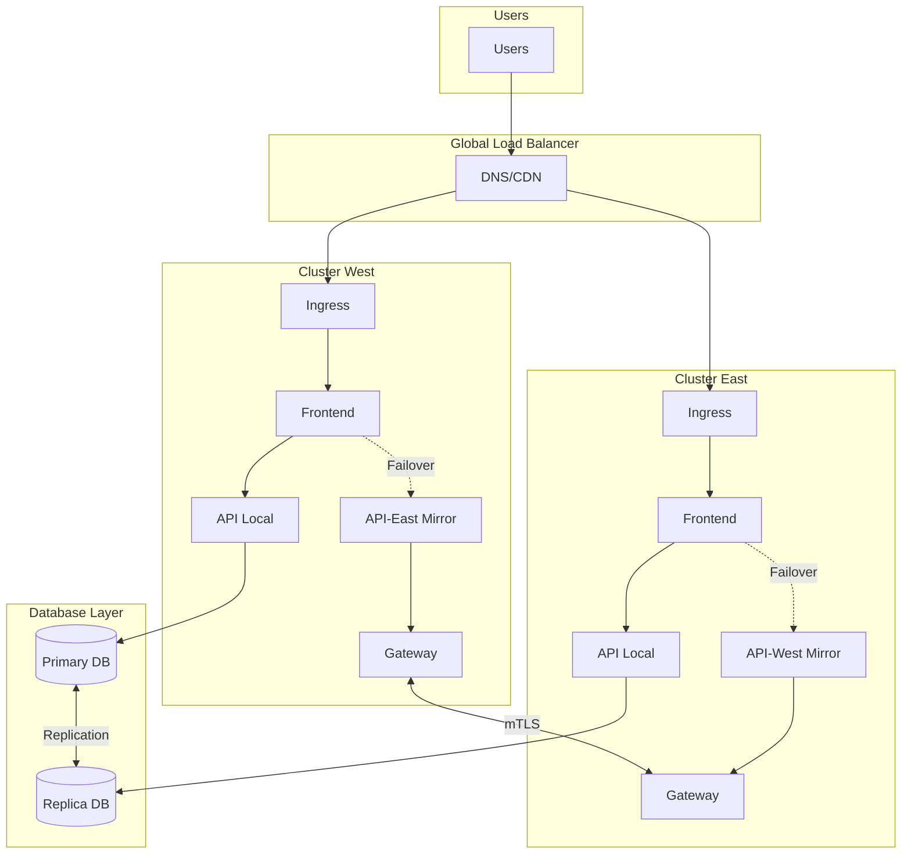

# How to Implement Linkerd ServiceMirror

Author: [nawazdhandala](https://github.com/nawazdhandala)

Tags: Linkerd, Kubernetes, ServiceMesh, MultiCluster

Description: A practical guide to implementing multi-cluster service discovery in Kubernetes using Linkerd ServiceMirror for seamless cross-cluster communication.

---

Running services across multiple Kubernetes clusters is increasingly common for high availability, disaster recovery, and geographic distribution. Linkerd ServiceMirror provides a lightweight approach to multi-cluster service discovery without requiring a centralized control plane or complex networking overlays.

## What is ServiceMirror?

ServiceMirror is Linkerd's mechanism for enabling cross-cluster service discovery. It watches services in a remote cluster and creates "mirrored" services in the local cluster. When a local pod calls a mirrored service, traffic is transparently routed to the remote cluster through a gateway.



## Prerequisites

Before setting up multi-cluster, ensure both clusters have:

- Linkerd control plane installed (version 2.12+)
- A shared trust anchor certificate for mTLS
- Network connectivity between clusters (gateways need to reach each other)

### Verify Linkerd Installation

```bash
# Check Linkerd is healthy on both clusters
linkerd check --context west
linkerd check --context east
```

### Generate Shared Trust Anchor

All clusters must share the same trust anchor for mTLS to work across clusters.

```bash
# Generate a trust anchor certificate (do this once, share across clusters)
step certificate create root.linkerd.cluster.local ca.crt ca.key \
  --profile root-ca \
  --no-password \
  --insecure \
  --not-after=87600h

# Generate issuer credentials for each cluster
step certificate create identity.linkerd.cluster.local issuer.crt issuer.key \
  --profile intermediate-ca \
  --not-after=8760h \
  --no-password \
  --insecure \
  --ca ca.crt \
  --ca-key ca.key
```

## Installing the Multi-Cluster Extension

The multi-cluster extension includes the ServiceMirror controller and gateway components.

### Install on Both Clusters

```bash
# Install multi-cluster extension on the target cluster (east)
# This cluster will export services
linkerd multicluster install --context east | kubectl apply --context east -f -

# Install multi-cluster extension on the source cluster (west)
# This cluster will consume mirrored services
linkerd multicluster install --context west | kubectl apply --context west -f -

# Verify the installation
linkerd multicluster check --context east
linkerd multicluster check --context west
```

### Gateway Configuration

The gateway is the entry point for cross-cluster traffic. By default, it creates a LoadBalancer service.

```yaml
# Custom gateway configuration
# File: gateway-config.yaml
apiVersion: v1
kind: ConfigMap
metadata:
  name: linkerd-gateway-config
  namespace: linkerd-multicluster
data:
  # Configure gateway to use NodePort instead of LoadBalancer
  config: |
    gateway:
      serviceType: NodePort
      nodePort: 30443
```

For production environments, configure the gateway with proper resource limits:

```yaml
# File: gateway-resources.yaml
apiVersion: apps/v1
kind: Deployment
metadata:
  name: linkerd-gateway
  namespace: linkerd-multicluster
spec:
  template:
    spec:
      containers:
        - name: linkerd-gateway
          resources:
            requests:
              cpu: 100m
              memory: 128Mi
            limits:
              cpu: 500m
              memory: 256Mi
```

## Creating the Link Resource

The Link resource establishes the connection between clusters. It contains the credentials and configuration needed to watch and mirror services from the target cluster.

### Generate Link Credentials

On the target cluster (east), generate the credentials that will be used by the source cluster (west).

```bash
# Generate the Link resource with credentials
# Run this on the TARGET cluster (east)
linkerd multicluster link \
  --context east \
  --cluster-name east \
  --gateway-addresses "gateway.east.example.com:4143" \
  --gateway-identity "linkerd-gateway.linkerd-multicluster.serviceaccount.identity.linkerd.cluster.local" \
  > link-east.yaml

# The output contains a Secret with kubeconfig credentials
# Review it before applying
```

### Understanding the Link Resource

```yaml
# Example Link resource structure
apiVersion: multicluster.linkerd.io/v1alpha1
kind: Link
metadata:
  name: east
  namespace: linkerd-multicluster
spec:
  # Target cluster name used for service naming
  targetClusterName: east

  # Domain suffix for mirrored services
  targetClusterDomain: cluster.local

  # Gateway configuration
  gatewayAddress: gateway.east.example.com:4143
  gatewayIdentity: linkerd-gateway.linkerd-multicluster.serviceaccount.identity.linkerd.cluster.local

  # Probe configuration for health checking
  probeSpec:
    path: /ready
    port: 4191
    period: 3s

  # Label selector for services to mirror
  selector:
    matchLabels:
      mirror.linkerd.io/exported: "true"
---
# The Link also creates a Secret with target cluster credentials
apiVersion: v1
kind: Secret
metadata:
  name: cluster-credentials-east
  namespace: linkerd-multicluster
type: mirror.linkerd.io/remote-kubeconfig
data:
  # Base64 encoded kubeconfig with limited permissions
  kubeconfig: <base64-encoded-kubeconfig>
```

### Apply the Link Resource

```bash
# Apply the Link on the SOURCE cluster (west)
kubectl apply --context west -f link-east.yaml

# Verify the link is established
linkerd multicluster gateways --context west
```

## Target Cluster Credentials Management

The ServiceMirror controller needs credentials to watch services in the target cluster. Linkerd uses a ServiceAccount with minimal permissions.

### Review the Generated ServiceAccount

```yaml
# The link command creates this ServiceAccount on the target cluster
apiVersion: v1
kind: ServiceAccount
metadata:
  name: linkerd-service-mirror-remote-access-default
  namespace: linkerd-multicluster
---
# With a ClusterRole that has read-only access to services and endpoints
apiVersion: rbac.authorization.k8s.io/v1
kind: ClusterRole
metadata:
  name: linkerd-service-mirror-remote-access-default
rules:
  - apiGroups: [""]
    resources: ["services", "endpoints"]
    verbs: ["get", "list", "watch"]
  - apiGroups: [""]
    resources: ["namespaces"]
    verbs: ["get", "list", "watch"]
---
apiVersion: rbac.authorization.k8s.io/v1
kind: ClusterRoleBinding
metadata:
  name: linkerd-service-mirror-remote-access-default
roleRef:
  apiGroup: rbac.authorization.k8s.io
  kind: ClusterRole
  name: linkerd-service-mirror-remote-access-default
subjects:
  - kind: ServiceAccount
    name: linkerd-service-mirror-remote-access-default
    namespace: linkerd-multicluster
```

### Rotating Credentials

Credentials should be rotated periodically. Here is the process:

```bash
# 1. Generate new credentials on the target cluster
linkerd multicluster link \
  --context east \
  --cluster-name east \
  > link-east-new.yaml

# 2. Extract the new secret
kubectl get secret -n linkerd-multicluster cluster-credentials-east \
  --context east -o yaml > new-credentials.yaml

# 3. Apply the new secret on the source cluster
kubectl apply --context west -f new-credentials.yaml

# 4. Restart the service mirror controller to pick up new credentials
kubectl rollout restart deployment/linkerd-service-mirror-east \
  -n linkerd-multicluster --context west
```

## Exporting Services

Services are not mirrored by default. You must explicitly export services from the target cluster.

### Export a Service

```bash
# Add the export label to a service in the target cluster
kubectl label service api -n production \
  mirror.linkerd.io/exported=true \
  --context east
```

### Export Configuration Options

```yaml
# Service with export configuration
apiVersion: v1
kind: Service
metadata:
  name: api
  namespace: production
  labels:
    # Required: enables mirroring
    mirror.linkerd.io/exported: "true"
  annotations:
    # Optional: custom name for the mirrored service
    mirror.linkerd.io/remote-svc-name: "api-primary"
    # Optional: gateway to use (if multiple links exist)
    mirror.linkerd.io/gateway-name: "linkerd-gateway"
    mirror.linkerd.io/gateway-ns: "linkerd-multicluster"
spec:
  selector:
    app: api
  ports:
    - port: 8080
      targetPort: 8080
```

### Verify Mirrored Services

```bash
# Check mirrored services on the source cluster
kubectl get services -n production --context west | grep east

# You should see:
# api-east   ClusterIP   10.96.45.123   <none>   8080/TCP   5m

# The mirrored service name follows the pattern: <service-name>-<cluster-name>
```

## Cross-Cluster Traffic Flow



### Calling Mirrored Services

Applications call mirrored services using the standard Kubernetes DNS name with the cluster suffix.

```yaml
# Deployment calling a mirrored service
apiVersion: apps/v1
kind: Deployment
metadata:
  name: frontend
  namespace: production
spec:
  replicas: 3
  selector:
    matchLabels:
      app: frontend
  template:
    metadata:
      labels:
        app: frontend
      annotations:
        # Inject Linkerd proxy
        linkerd.io/inject: enabled
    spec:
      containers:
        - name: frontend
          image: my-frontend:v1
          env:
            # Call the local service when available
            - name: API_LOCAL_URL
              value: "http://api.production.svc.cluster.local:8080"
            # Call the mirrored service from the east cluster
            - name: API_EAST_URL
              value: "http://api-east.production.svc.cluster.local:8080"
```

### Traffic Splitting Between Clusters

Use Linkerd's TrafficSplit to distribute traffic between local and remote services.

```yaml
# Split traffic between local and mirrored service
apiVersion: split.smi-spec.io/v1alpha1
kind: TrafficSplit
metadata:
  name: api-split
  namespace: production
spec:
  service: api
  backends:
    # 80% to local cluster
    - service: api
      weight: 800m
    # 20% to east cluster
    - service: api-east
      weight: 200m
```

## Monitoring Multi-Cluster Traffic

### Check Gateway Health

```bash
# View gateway status across all links
linkerd multicluster gateways

# Output shows latency and success rate to each remote cluster
# CLUSTER  ALIVE  NUM_SVC  LATENCY_P50  LATENCY_P95  LATENCY_P99
# east     True   5        2ms          5ms          10ms
```

### Prometheus Metrics

The ServiceMirror controller exports metrics about cross-cluster traffic.

```yaml
# Prometheus scrape config for multi-cluster metrics
apiVersion: v1
kind: ConfigMap
metadata:
  name: prometheus-config
data:
  prometheus.yml: |
    scrape_configs:
      - job_name: 'linkerd-gateway'
        kubernetes_sd_configs:
          - role: pod
            namespaces:
              names: ['linkerd-multicluster']
        relabel_configs:
          - source_labels: [__meta_kubernetes_pod_label_linkerd_io_control_plane_component]
            action: keep
            regex: gateway
```

### Key Metrics to Monitor

```bash
# Gateway request volume
gateway_requests_total{cluster="east"}

# Gateway request latency
gateway_request_duration_seconds{cluster="east"}

# Service mirror health
service_mirror_probe_success_total{cluster="east"}

# Mirrored endpoints
service_mirror_endpoints{cluster="east", service="api"}
```

## High Availability Architecture



## Troubleshooting

### Link Not Connecting

```bash
# Check the link status
kubectl get link -n linkerd-multicluster --context west

# View service mirror controller logs
kubectl logs -n linkerd-multicluster \
  -l linkerd.io/control-plane-component=service-mirror \
  --context west

# Common issues:
# - Gateway not reachable (check network/firewall)
# - Certificate mismatch (check trust anchors)
# - Expired credentials (regenerate link)
```

### Services Not Mirroring

```bash
# Verify the export label exists on target cluster
kubectl get service api -n production \
  --show-labels --context east

# Check if endpoints exist for the service
kubectl get endpoints api -n production --context east

# Verify the service mirror is watching
kubectl logs -n linkerd-multicluster deploy/linkerd-service-mirror-east \
  --context west | grep "api"
```

### High Latency or Failures

```bash
# Check gateway probe status
linkerd multicluster gateways --context west

# If probe is failing, check gateway health
kubectl exec -n linkerd-multicluster deploy/linkerd-gateway \
  --context east -- wget -qO- localhost:4191/ready

# Check for network issues
kubectl exec -n linkerd-multicluster deploy/linkerd-gateway \
  --context west -- nc -zv gateway.east.example.com 4143
```

## Best Practices

1. **Use Dedicated Gateways** - Run gateways on dedicated nodes with appropriate resources
2. **Monitor Gateway Health** - Set up alerts for gateway probe failures
3. **Rotate Credentials** - Rotate link credentials quarterly
4. **Label Selectively** - Only export services that need cross-cluster access
5. **Plan for Latency** - Cross-cluster calls add network latency, design accordingly
6. **Test Failover** - Regularly test failover scenarios
7. **Use Traffic Splits** - Gradually shift traffic to validate cross-cluster paths

---

Linkerd ServiceMirror provides a simple yet powerful approach to multi-cluster service discovery. By mirroring services across clusters, you can build highly available architectures without complex networking overlays. Start by linking two clusters and exporting a single service, then expand as your multi-cluster needs grow.
