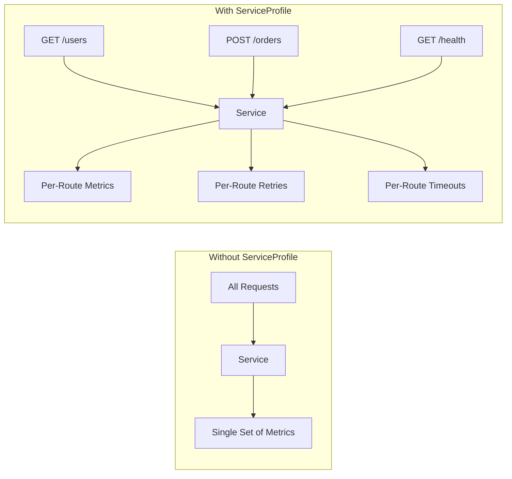
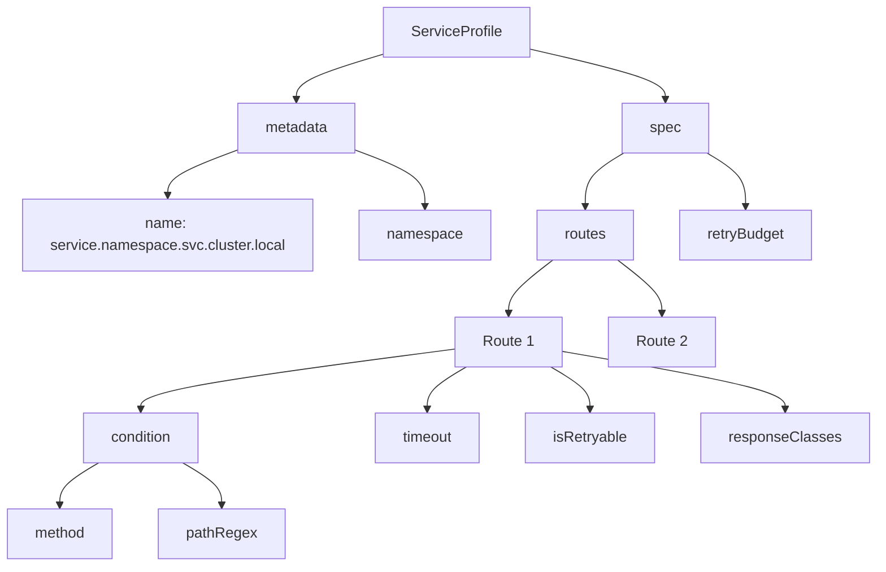

# How to Build Linkerd ServiceProfile

Author: [nawazdhandala](https://github.com/nawazdhandala)

Tags: Linkerd, Service Mesh, Kubernetes, DevOps

Description: A hands-on guide to building Linkerd ServiceProfiles for per-route metrics, retries, and timeouts that give you fine-grained observability and reliability in your Kubernetes services.

---

Linkerd gives you automatic mTLS, observability, and reliability features out of the box. But the real power comes from ServiceProfiles, which let you define per-route behavior for your services. Without them, Linkerd treats all traffic to a service the same way. With them, you get route-level metrics, retries, and timeouts that match how your application actually works.

## What is a ServiceProfile?

A ServiceProfile is a Kubernetes custom resource that tells Linkerd about the routes your service exposes. It maps HTTP paths and methods to named routes, enabling:

- **Per-route metrics:** See latency, success rate, and request volume for each endpoint
- **Per-route retries:** Retry failed GET requests but not POSTs
- **Per-route timeouts:** Give slow reports endpoint more time than quick health checks
- **Traffic splitting:** Route percentages of traffic to different backends per route



## Prerequisites

Before creating ServiceProfiles, make sure you have:

- A Kubernetes cluster with Linkerd installed
- The `linkerd` CLI tool
- A service you want to add profiles to

Check your Linkerd installation:

```bash
# Verify Linkerd is healthy
linkerd check

# Confirm your namespace is meshed
kubectl get namespace <your-namespace> -o jsonpath='{.metadata.annotations.linkerd\.io/inject}'
```

## Creating Your First ServiceProfile

### Manual Creation

The most straightforward way to create a ServiceProfile is to write the YAML yourself. Here is a basic example for an API service.

```yaml
# ServiceProfile for a users API service
# This defines three routes with different retry and timeout behaviors
apiVersion: linkerd.io/v1alpha2
kind: ServiceProfile
metadata:
  name: users-api.default.svc.cluster.local
  namespace: default
spec:
  routes:
    # Health check endpoint - fast timeout, no retries needed
    - name: GET /health
      condition:
        method: GET
        pathRegex: /health
      timeout: 1s
      isRetryable: false

    # List users - safe to retry, standard timeout
    - name: GET /users
      condition:
        method: GET
        pathRegex: /users
      timeout: 10s
      isRetryable: true

    # Get single user - safe to retry, includes path parameter
    - name: GET /users/{id}
      condition:
        method: GET
        pathRegex: /users/[^/]+
      timeout: 5s
      isRetryable: true

    # Create user - not safe to retry (could create duplicates)
    - name: POST /users
      condition:
        method: POST
        pathRegex: /users
      timeout: 10s
      isRetryable: false
```

Apply it to your cluster:

```bash
kubectl apply -f serviceprofile.yaml
```

### Generating from OpenAPI/Swagger

If your service has an OpenAPI specification, Linkerd can generate a ServiceProfile automatically. This is the fastest way to get comprehensive route coverage.

```bash
# Generate ServiceProfile from an OpenAPI spec file
linkerd profile --open-api swagger.yaml users-api > serviceprofile.yaml

# Or fetch the spec from a URL
linkerd profile --open-api https://api.example.com/openapi.json users-api > serviceprofile.yaml
```

The generated profile will include all paths and methods from your spec. Review it before applying since you will want to customize timeouts and retry settings.

### Generating from Protobuf

For gRPC services, generate profiles from your proto files:

```bash
# Generate from protobuf definitions
linkerd profile --proto users.proto users-api > serviceprofile.yaml
```

This creates routes for each RPC method defined in your protobuf service.

### Discovering Routes from Live Traffic

If you do not have API specs, Linkerd can watch actual traffic and suggest routes. This is helpful for legacy services without documentation.

```bash
# Watch traffic for 5 minutes and output discovered routes
linkerd profile --tap deploy/users-api --tap-duration 5m users-api > serviceprofile.yaml
```

Review the output carefully. Tap-based discovery might miss infrequent routes or include noise from health checks and probes.

## ServiceProfile Anatomy

Let us break down each part of a ServiceProfile:



### The Name Field

The ServiceProfile name must match the fully qualified domain name (FQDN) of your service:

```
<service-name>.<namespace>.svc.cluster.local
```

For external services, use the actual hostname:

```yaml
metadata:
  name: api.stripe.com
  namespace: default
```

### Route Conditions

Routes match requests based on method and path. The `pathRegex` field uses regular expressions.

```yaml
routes:
  # Exact path match
  - name: GET /health
    condition:
      method: GET
      pathRegex: /health

  # Path with numeric ID parameter
  - name: GET /orders/{id}
    condition:
      method: GET
      pathRegex: /orders/[0-9]+

  # Path with UUID parameter
  - name: GET /users/{uuid}
    condition:
      method: GET
      pathRegex: /users/[0-9a-f]{8}-[0-9a-f]{4}-[0-9a-f]{4}-[0-9a-f]{4}-[0-9a-f]{12}

  # Wildcard match for nested paths
  - name: GET /files/*
    condition:
      method: GET
      pathRegex: /files/.*

  # Multiple methods using OR condition
  - name: GET or HEAD /status
    condition:
      any:
        - method: GET
          pathRegex: /status
        - method: HEAD
          pathRegex: /status
```

### Timeouts

Set per-route timeouts based on expected response times:

```yaml
routes:
  # Fast endpoint - fail quickly if slow
  - name: GET /health
    condition:
      method: GET
      pathRegex: /health
    timeout: 500ms

  # Standard API call
  - name: GET /users
    condition:
      method: GET
      pathRegex: /users
    timeout: 5s

  # Slow report generation - give it time
  - name: GET /reports/{id}
    condition:
      method: GET
      pathRegex: /reports/[^/]+
    timeout: 60s
```

### Retries

Mark idempotent routes as retryable. Linkerd will automatically retry failed requests.

```yaml
routes:
  # Safe to retry - GET is idempotent
  - name: GET /products
    condition:
      method: GET
      pathRegex: /products
    isRetryable: true

  # Not safe - POST creates resources
  - name: POST /orders
    condition:
      method: POST
      pathRegex: /orders
    isRetryable: false

  # Safe if your PUT is truly idempotent
  - name: PUT /users/{id}
    condition:
      method: PUT
      pathRegex: /users/[^/]+
    isRetryable: true

  # DELETE can be retryable if idempotent
  - name: DELETE /sessions/{id}
    condition:
      method: DELETE
      pathRegex: /sessions/[^/]+
    isRetryable: true
```

### Retry Budget

Control how aggressively Linkerd retries across all routes:

```yaml
apiVersion: linkerd.io/v1alpha2
kind: ServiceProfile
metadata:
  name: users-api.default.svc.cluster.local
  namespace: default
spec:
  # Retry budget applies to all retryable routes
  retryBudget:
    # Retry up to 20% of requests
    retryRatio: 0.2
    # Plus a minimum of 10 retries per second
    minRetriesPerSecond: 10
    # Time window for calculating retry budget
    ttl: 10s
  routes:
    - name: GET /users
      condition:
        method: GET
        pathRegex: /users
      isRetryable: true
```

### Response Classes

Classify responses to customize how Linkerd counts successes and failures:

```yaml
routes:
  - name: GET /users/{id}
    condition:
      method: GET
      pathRegex: /users/[^/]+
    responseClasses:
      # Treat 404 as success (user not found is expected)
      - condition:
          status:
            min: 404
            max: 404
        isFailure: false
      # Treat 5xx as failures (default, but explicit here)
      - condition:
          status:
            min: 500
            max: 599
        isFailure: true
```

## Real-World Examples

### E-Commerce API

A complete ServiceProfile for an e-commerce backend:

```yaml
apiVersion: linkerd.io/v1alpha2
kind: ServiceProfile
metadata:
  name: shop-api.ecommerce.svc.cluster.local
  namespace: ecommerce
spec:
  retryBudget:
    retryRatio: 0.2
    minRetriesPerSecond: 10
    ttl: 10s
  routes:
    # Health and readiness probes
    - name: GET /health
      condition:
        method: GET
        pathRegex: /health
      timeout: 1s
      isRetryable: false

    - name: GET /ready
      condition:
        method: GET
        pathRegex: /ready
      timeout: 2s
      isRetryable: false

    # Product catalog - heavily cached, safe to retry
    - name: GET /products
      condition:
        method: GET
        pathRegex: /products
      timeout: 5s
      isRetryable: true

    - name: GET /products/{id}
      condition:
        method: GET
        pathRegex: /products/[^/]+
      timeout: 3s
      isRetryable: true
      responseClasses:
        - condition:
            status:
              min: 404
              max: 404
          isFailure: false

    # Shopping cart - user-specific, still safe to retry reads
    - name: GET /cart
      condition:
        method: GET
        pathRegex: /cart
      timeout: 5s
      isRetryable: true

    - name: POST /cart/items
      condition:
        method: POST
        pathRegex: /cart/items
      timeout: 5s
      isRetryable: false

    - name: DELETE /cart/items/{id}
      condition:
        method: DELETE
        pathRegex: /cart/items/[^/]+
      timeout: 3s
      isRetryable: true

    # Checkout - critical path, longer timeout, no retries
    - name: POST /checkout
      condition:
        method: POST
        pathRegex: /checkout
      timeout: 30s
      isRetryable: false

    # Order history - safe to retry
    - name: GET /orders
      condition:
        method: GET
        pathRegex: /orders
      timeout: 10s
      isRetryable: true

    - name: GET /orders/{id}
      condition:
        method: GET
        pathRegex: /orders/[^/]+
      timeout: 5s
      isRetryable: true
```

### gRPC Microservice

For gRPC services, routes map to RPC methods:

```yaml
apiVersion: linkerd.io/v1alpha2
kind: ServiceProfile
metadata:
  name: inventory-service.warehouse.svc.cluster.local
  namespace: warehouse
spec:
  retryBudget:
    retryRatio: 0.1
    minRetriesPerSecond: 5
    ttl: 10s
  routes:
    # Unary calls - check stock levels
    - name: POST /inventory.InventoryService/GetStock
      condition:
        method: POST
        pathRegex: /inventory\.InventoryService/GetStock
      timeout: 2s
      isRetryable: true

    # Unary call - reserve inventory (not idempotent)
    - name: POST /inventory.InventoryService/ReserveStock
      condition:
        method: POST
        pathRegex: /inventory\.InventoryService/ReserveStock
      timeout: 5s
      isRetryable: false

    # Server streaming - list all items
    - name: POST /inventory.InventoryService/ListItems
      condition:
        method: POST
        pathRegex: /inventory\.InventoryService/ListItems
      timeout: 30s
      isRetryable: true

    # Bidirectional streaming - real-time sync
    - name: POST /inventory.InventoryService/SyncInventory
      condition:
        method: POST
        pathRegex: /inventory\.InventoryService/SyncInventory
      timeout: 300s
      isRetryable: false
```

### External API Gateway

Create profiles for external services to get metrics and reliability features:

```yaml
apiVersion: linkerd.io/v1alpha2
kind: ServiceProfile
metadata:
  name: api.stripe.com
  namespace: payments
spec:
  retryBudget:
    retryRatio: 0.1
    minRetriesPerSecond: 3
    ttl: 10s
  routes:
    # Charge creation - never retry
    - name: POST /v1/charges
      condition:
        method: POST
        pathRegex: /v1/charges
      timeout: 30s
      isRetryable: false

    # Retrieve charge - safe to retry
    - name: GET /v1/charges/{id}
      condition:
        method: GET
        pathRegex: /v1/charges/[^/]+
      timeout: 10s
      isRetryable: true

    # List charges - safe to retry
    - name: GET /v1/charges
      condition:
        method: GET
        pathRegex: /v1/charges
      timeout: 15s
      isRetryable: true

    # Customer operations
    - name: POST /v1/customers
      condition:
        method: POST
        pathRegex: /v1/customers
      timeout: 10s
      isRetryable: false

    - name: GET /v1/customers/{id}
      condition:
        method: GET
        pathRegex: /v1/customers/[^/]+
      timeout: 10s
      isRetryable: true
```

## Viewing Per-Route Metrics

Once your ServiceProfile is deployed, Linkerd starts collecting per-route metrics.

### Using the CLI

```bash
# View route metrics for a deployment
linkerd routes deploy/users-api

# Sample output:
# ROUTE                     SERVICE   SUCCESS   RPS   LATENCY_P50   LATENCY_P95   LATENCY_P99
# GET /health               users-api   100.00%  2.0        1ms          2ms          3ms
# GET /users                users-api    99.85%  45.2       12ms        48ms        120ms
# GET /users/{id}           users-api    99.92%  123.4       8ms        35ms         89ms
# POST /users               users-api    99.78%  12.1       15ms        52ms        145ms
# [UNMAPPED]                users-api   100.00%  0.5        3ms          5ms          8ms
```

### Using the Dashboard

```bash
# Open the Linkerd dashboard
linkerd dashboard

# Navigate to the deployment and click on a route to see detailed metrics
```

### Prometheus Queries

Linkerd exports per-route metrics to Prometheus. Query them for dashboards and alerts.

```promql
# Success rate by route
sum(rate(response_total{classification="success", deployment="users-api"}[5m])) by (rt_route)
/
sum(rate(response_total{deployment="users-api"}[5m])) by (rt_route)

# P99 latency by route
histogram_quantile(0.99, sum(rate(response_latency_ms_bucket{deployment="users-api"}[5m])) by (le, rt_route))

# Retry rate by route
sum(rate(response_total{classification="success", deployment="users-api", retried="true"}[5m])) by (rt_route)
/
sum(rate(response_total{deployment="users-api"}[5m])) by (rt_route)
```

## Troubleshooting

### Routes Not Matching

If you see traffic in `[UNMAPPED]`, your path regex might not match actual requests.

```bash
# Tap traffic to see actual paths
linkerd tap deploy/users-api --path /

# Check for mismatches between your regex and real paths
# Common issues:
# - Missing trailing slash: /users vs /users/
# - Query parameters: /users?page=1 (regex should not include query string)
# - Case sensitivity: /Users vs /users
```

### Retries Not Happening

Verify retry conditions:

```bash
# Check if route is marked retryable
kubectl get serviceprofile users-api.default.svc.cluster.local -o yaml | grep -A5 "isRetryable"

# Check retry budget
kubectl get serviceprofile users-api.default.svc.cluster.local -o yaml | grep -A5 "retryBudget"

# Retries only happen for:
# - 5xx responses
# - Connection errors
# - Routes marked isRetryable: true
# - Within retry budget limits
```

### Timeouts Not Working

Timeouts in ServiceProfiles are client-side. The server might still process the request after the client gives up.

```bash
# Verify timeout is set
kubectl get serviceprofile users-api.default.svc.cluster.local -o yaml | grep timeout

# Check if the proxy is timing out (look for 504 status codes)
linkerd tap deploy/users-api --method GET --path /slow-endpoint
```

## Best Practices

### Start with Generation, Then Customize

Generate profiles from OpenAPI specs or traffic, then tune:

```bash
# Generate baseline
linkerd profile --open-api swagger.yaml my-service > profile.yaml

# Edit to add:
# - Realistic timeouts based on SLOs
# - Retry settings based on idempotency
# - Response classes for expected error codes

kubectl apply -f profile.yaml
```

### Match Timeouts to SLOs

Set timeouts slightly above your p99 latency target:

| SLO Target | Recommended Timeout |
|------------|---------------------|
| p99 < 100ms | 150ms |
| p99 < 500ms | 750ms |
| p99 < 2s | 3s |
| p99 < 10s | 15s |

### Use Response Classes Thoughtfully

Not every 4xx is a failure:

```yaml
responseClasses:
  # 404 on resource lookup is expected
  - condition:
      status:
        min: 404
        max: 404
    isFailure: false

  # 409 conflict might be expected in some flows
  - condition:
      status:
        min: 409
        max: 409
    isFailure: false

  # Rate limiting (429) is a failure you want to track
  - condition:
      status:
        min: 429
        max: 429
    isFailure: true
```

### Keep Profiles in Version Control

Store ServiceProfiles alongside your application code:

```
my-service/
  kubernetes/
    deployment.yaml
    service.yaml
    serviceprofile.yaml
  src/
    ...
```

Deploy them together so routes stay in sync with code changes.

## Conclusion

ServiceProfiles transform Linkerd from a mesh that treats all traffic equally into one that understands your application's specific routes. The investment in defining routes pays off with:

- Granular observability that shows exactly which endpoints are slow or failing
- Intelligent retries that do not duplicate non-idempotent operations
- Timeouts tuned to each endpoint's expected behavior
- Metrics that map to your API documentation and SLOs

Start with generated profiles, customize based on your application's behavior, and iterate as you learn from the per-route metrics Linkerd provides.
