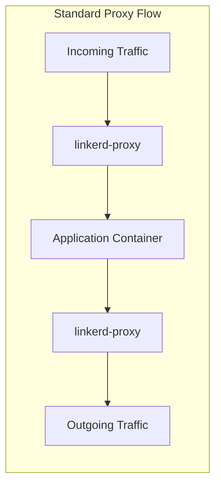
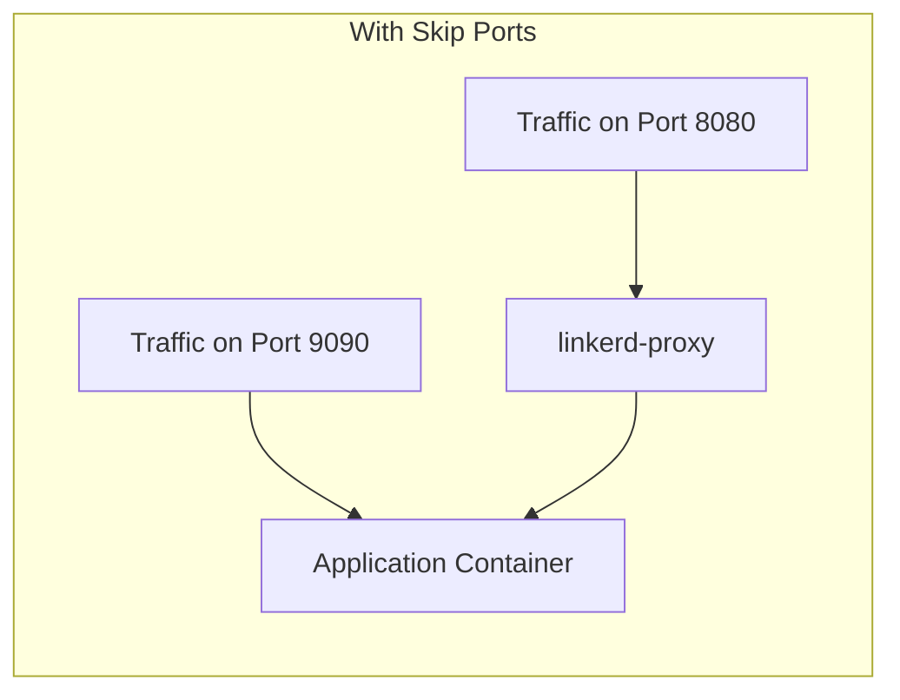
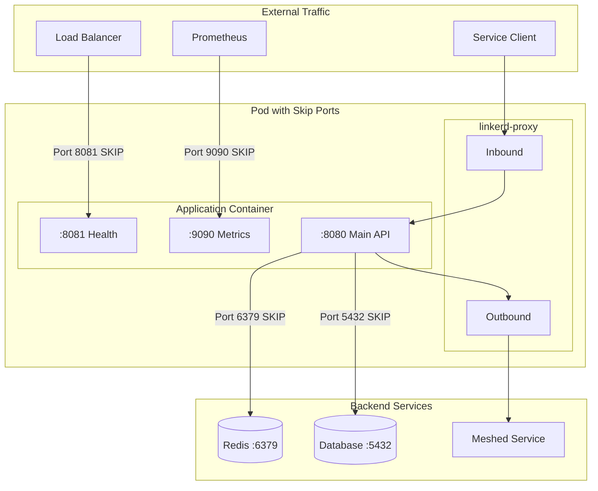

# How to Build Linkerd Skip Ports

Author: [nawazdhandala](https://github.com/nawazdhandala)

Tags: Linkerd, Kubernetes, ServiceMesh, Configuration

Description: Configure Linkerd skip ports annotations to bypass proxy injection for specific traffic, improving performance and compatibility.

---

Linkerd injects a sidecar proxy into your pods to handle service mesh features like mTLS, observability, and traffic management. But sometimes you need traffic to bypass this proxy entirely. Skip ports let you exclude specific ports from proxy injection, giving you fine-grained control over what traffic goes through the mesh.

## Why Skip Ports?

Not all traffic benefits from going through the proxy. Some traffic patterns actively conflict with it:

- **Health checks** from load balancers expect direct pod responses
- **Metrics endpoints** scraped by Prometheus at high frequency
- **Database connections** that use custom protocols
- **Legacy protocols** that break under proxy interception
- **High-throughput internal traffic** where proxy overhead matters

## How Linkerd Proxy Injection Works

Before configuring skip ports, understand what happens during injection.



All traffic flows through the proxy by default. The proxy handles mTLS termination, collects telemetry, and applies traffic policies.



With skip ports configured, traffic on specified ports bypasses the proxy completely.

## Skip Port Annotations

Linkerd provides two annotations for skipping ports:

| Annotation | Direction | Purpose |
|------------|-----------|---------|
| `config.linkerd.io/skip-inbound-ports` | Incoming | Skip proxy for traffic arriving on these ports |
| `config.linkerd.io/skip-outbound-ports` | Outgoing | Skip proxy for traffic leaving to these ports |

## Configuring Inbound Skip Ports

Use `skip-inbound-ports` when external systems need direct access to your pod.

### Basic Configuration

```yaml
# deployment.yaml
apiVersion: apps/v1
kind: Deployment
metadata:
  name: my-service
  namespace: production
spec:
  replicas: 3
  selector:
    matchLabels:
      app: my-service
  template:
    metadata:
      labels:
        app: my-service
      annotations:
        # Skip proxy for health check port
        config.linkerd.io/skip-inbound-ports: "8081"
    spec:
      containers:
        - name: app
          image: my-service:latest
          ports:
            # Main application port - goes through proxy
            - containerPort: 8080
              name: http
            # Health check port - bypasses proxy
            - containerPort: 8081
              name: health
```

### Multiple Inbound Ports

```yaml
metadata:
  annotations:
    # Comma-separated list of ports to skip
    config.linkerd.io/skip-inbound-ports: "8081,9090,9091"
```

### Port Ranges

```yaml
metadata:
  annotations:
    # Skip ports 9000 through 9010
    config.linkerd.io/skip-inbound-ports: "9000-9010"
```

## Configuring Outbound Skip Ports

Use `skip-outbound-ports` when your application connects to services that should not go through the proxy.

### Database Connections

```yaml
# deployment.yaml
apiVersion: apps/v1
kind: Deployment
metadata:
  name: api-server
  namespace: production
spec:
  template:
    metadata:
      annotations:
        # Skip proxy for database connections
        # MySQL: 3306, PostgreSQL: 5432, Redis: 6379
        config.linkerd.io/skip-outbound-ports: "3306,5432,6379"
    spec:
      containers:
        - name: api
          image: api-server:latest
          env:
            - name: DATABASE_HOST
              value: "postgres.database.svc.cluster.local"
            - name: DATABASE_PORT
              value: "5432"
```

### External Service Connections

```yaml
metadata:
  annotations:
    # Skip proxy for external API calls
    # Useful when external services have strict TLS requirements
    config.linkerd.io/skip-outbound-ports: "443"
```

## Traffic Flow with Skip Ports

This diagram shows how traffic flows with both inbound and outbound skip ports configured:



## Common Use Cases

### Health Check Endpoint

Kubernetes liveness and readiness probes work better without proxy overhead.

```yaml
apiVersion: apps/v1
kind: Deployment
metadata:
  name: web-service
spec:
  template:
    metadata:
      annotations:
        # Health check port bypasses proxy
        config.linkerd.io/skip-inbound-ports: "8081"
    spec:
      containers:
        - name: web
          image: web-service:latest
          ports:
            - containerPort: 8080
              name: http
            - containerPort: 8081
              name: health
          # Probes hit the skip port directly
          livenessProbe:
            httpGet:
              path: /healthz
              port: 8081
            initialDelaySeconds: 5
            periodSeconds: 10
          readinessProbe:
            httpGet:
              path: /ready
              port: 8081
            initialDelaySeconds: 5
            periodSeconds: 5
```

### Prometheus Metrics Scraping

High-frequency metrics scraping adds unnecessary load to the proxy.

```yaml
apiVersion: apps/v1
kind: Deployment
metadata:
  name: metrics-heavy-service
spec:
  template:
    metadata:
      annotations:
        # Metrics port bypasses proxy
        config.linkerd.io/skip-inbound-ports: "9090"
        # Prometheus annotations for service discovery
        prometheus.io/scrape: "true"
        prometheus.io/port: "9090"
        prometheus.io/path: "/metrics"
    spec:
      containers:
        - name: app
          image: my-app:latest
          ports:
            - containerPort: 8080
              name: http
            - containerPort: 9090
              name: metrics
```

### Database Connections

Database protocols often have specific requirements that conflict with proxy behavior.

```yaml
apiVersion: apps/v1
kind: Deployment
metadata:
  name: data-processor
spec:
  template:
    metadata:
      annotations:
        # Skip proxy for all database connections
        config.linkerd.io/skip-outbound-ports: "5432,3306,27017,6379,9042"
        # 5432: PostgreSQL
        # 3306: MySQL
        # 27017: MongoDB
        # 6379: Redis
        # 9042: Cassandra
    spec:
      containers:
        - name: processor
          image: data-processor:latest
```

### Mixed Configuration

Combine inbound and outbound skip ports for complete control.

```yaml
apiVersion: apps/v1
kind: Deployment
metadata:
  name: complete-example
  namespace: production
spec:
  replicas: 3
  selector:
    matchLabels:
      app: complete-example
  template:
    metadata:
      labels:
        app: complete-example
      annotations:
        # Inbound: health checks and metrics bypass proxy
        config.linkerd.io/skip-inbound-ports: "8081,9090"
        # Outbound: database and cache connections bypass proxy
        config.linkerd.io/skip-outbound-ports: "5432,6379"
    spec:
      containers:
        - name: app
          image: my-app:latest
          ports:
            # Main port - fully meshed with mTLS
            - containerPort: 8080
              name: http
            # Health port - direct access for probes
            - containerPort: 8081
              name: health
            # Metrics port - direct access for Prometheus
            - containerPort: 9090
              name: metrics
          livenessProbe:
            httpGet:
              path: /healthz
              port: 8081
            periodSeconds: 10
          readinessProbe:
            httpGet:
              path: /ready
              port: 8081
            periodSeconds: 5
          env:
            - name: POSTGRES_HOST
              value: "postgres.database.svc.cluster.local"
            - name: REDIS_HOST
              value: "redis.cache.svc.cluster.local"
```

## Namespace-Level Configuration

Apply skip ports to all pods in a namespace using annotations on the namespace itself.

```yaml
apiVersion: v1
kind: Namespace
metadata:
  name: production
  annotations:
    # All pods in this namespace skip these ports
    config.linkerd.io/skip-inbound-ports: "8081,9090"
    config.linkerd.io/skip-outbound-ports: "5432,6379"
    linkerd.io/inject: enabled
```

Pod-level annotations override namespace-level settings when both are present.

## Performance Considerations

### When to Skip Ports

Skip ports when:

- **High-frequency traffic**: Metrics endpoints scraped every 15 seconds
- **Large payload transfers**: File uploads or bulk data exports
- **Latency-sensitive operations**: Database queries where milliseconds matter
- **Protocol incompatibility**: Custom protocols that break under proxy

### When NOT to Skip Ports

Keep traffic in the mesh when:

- **mTLS is required**: Service-to-service authentication matters
- **Observability is needed**: You want traces and metrics for this traffic
- **Traffic policies apply**: Retries, timeouts, or load balancing rules exist
- **Security boundaries exist**: Traffic crosses trust zones

### Proxy Overhead

The Linkerd proxy adds approximately:

| Metric | Overhead |
|--------|----------|
| Latency | 1-2ms per hop |
| Memory | 10-20MB per pod |
| CPU | Minimal under normal load |

For most traffic, this overhead is negligible. Skip ports only when you have measured a problem.

## Verifying Skip Port Configuration

### Check Pod Annotations

```bash
# Verify annotations are set correctly
kubectl get pod -n production -l app=my-service -o jsonpath='{.items[0].metadata.annotations}' | jq .
```

### Check Proxy Configuration

```bash
# View the proxy configuration
kubectl exec -n production deploy/my-service -c linkerd-proxy -- \
  cat /var/run/linkerd/config/proxy.json | jq '.skip_ports'
```

### Test Connectivity

```bash
# Test that skipped port responds directly
kubectl exec -n production deploy/my-service -c app -- \
  curl -v localhost:8081/healthz

# Compare response times between proxied and skipped ports
kubectl exec -n production deploy/my-service -c app -- \
  sh -c 'time curl -s localhost:8080/api; time curl -s localhost:8081/healthz'
```

### Monitor with Linkerd Dashboard

```bash
# Open Linkerd dashboard
linkerd dashboard &

# Check the tap output - skipped traffic won't appear
linkerd tap deploy/my-service -n production
```

Traffic on skipped ports will not appear in Linkerd metrics or tap output. This is expected behavior.

## Troubleshooting

### Ports Not Being Skipped

**Symptom**: Traffic still appears in Linkerd metrics for skipped ports.

**Check**: Annotation spelling and placement.

```bash
# Correct annotation key
config.linkerd.io/skip-inbound-ports: "8081"

# Common mistakes
linkerd.io/skip-inbound-ports: "8081"      # Wrong prefix
config.linkerd.io/skip-inbound-port: "8081" # Missing 's'
```

**Check**: Annotation is on the pod template, not the deployment.

```yaml
# Correct - annotation on pod template
spec:
  template:
    metadata:
      annotations:
        config.linkerd.io/skip-inbound-ports: "8081"

# Wrong - annotation on deployment
metadata:
  annotations:
    config.linkerd.io/skip-inbound-ports: "8081"
```

### Connection Refused on Skipped Port

**Symptom**: External connections to skipped ports fail.

**Check**: The application is actually listening on that port.

```bash
kubectl exec -n production deploy/my-service -c app -- netstat -tlnp
```

**Check**: NetworkPolicy allows traffic on that port.

```yaml
# Ensure NetworkPolicy allows the skipped port
apiVersion: networking.k8s.io/v1
kind: NetworkPolicy
metadata:
  name: allow-health-checks
spec:
  podSelector:
    matchLabels:
      app: my-service
  ingress:
    - ports:
        - port: 8081
          protocol: TCP
```

### mTLS Not Working After Skip

**Symptom**: Services report TLS errors after adding skip ports.

**Cause**: You skipped a port that needs to be in the mesh.

**Fix**: Remove that port from skip configuration or handle TLS at the application level.

## Security Implications

Skipped ports bypass Linkerd's security features:

- **No mTLS**: Traffic is not encrypted by the proxy
- **No identity verification**: Linkerd cannot verify caller identity
- **No authorization policies**: ServiceProfiles and authorization policies do not apply

For skipped ports, implement security at other layers:

```yaml
# Use NetworkPolicy to restrict access to skipped ports
apiVersion: networking.k8s.io/v1
kind: NetworkPolicy
metadata:
  name: restrict-metrics-access
  namespace: production
spec:
  podSelector:
    matchLabels:
      app: my-service
  policyTypes:
    - Ingress
  ingress:
    # Only allow Prometheus to access metrics port
    - from:
        - namespaceSelector:
            matchLabels:
              name: monitoring
          podSelector:
            matchLabels:
              app: prometheus
      ports:
        - port: 9090
          protocol: TCP
```

---

Skip ports give you escape hatches from the service mesh when you need them. Use them sparingly for health checks, metrics, and database connections. Keep your application traffic in the mesh to benefit from mTLS, observability, and traffic management. When in doubt, measure first and skip only when you have a concrete reason.
