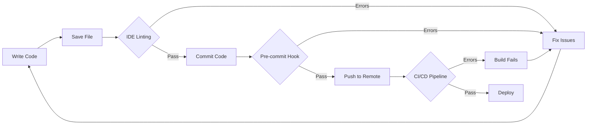
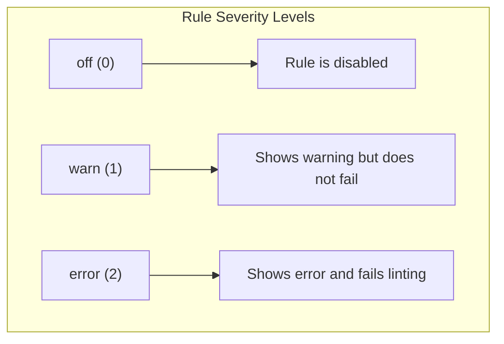
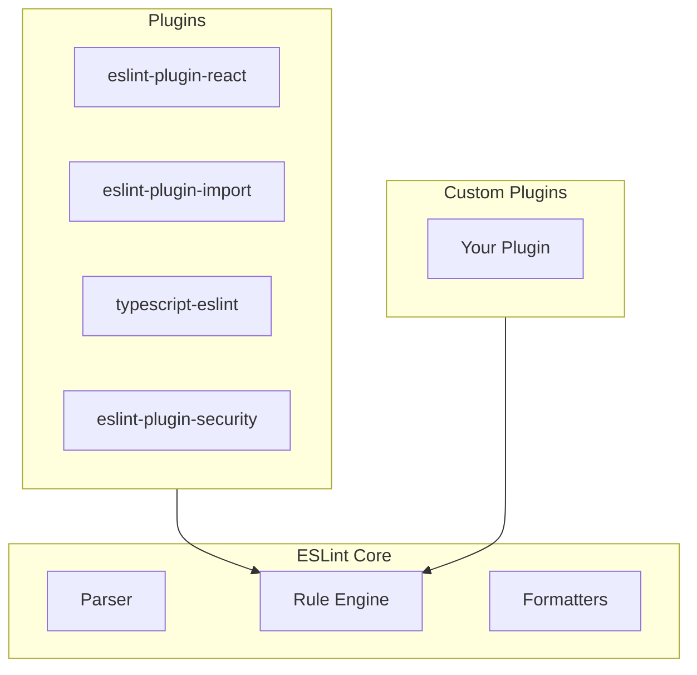
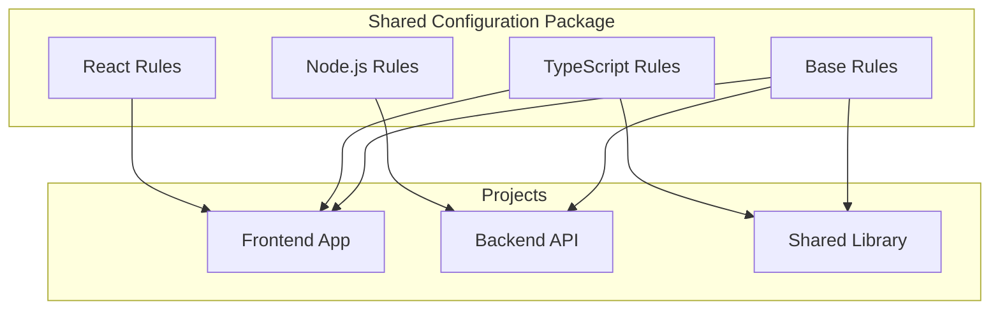
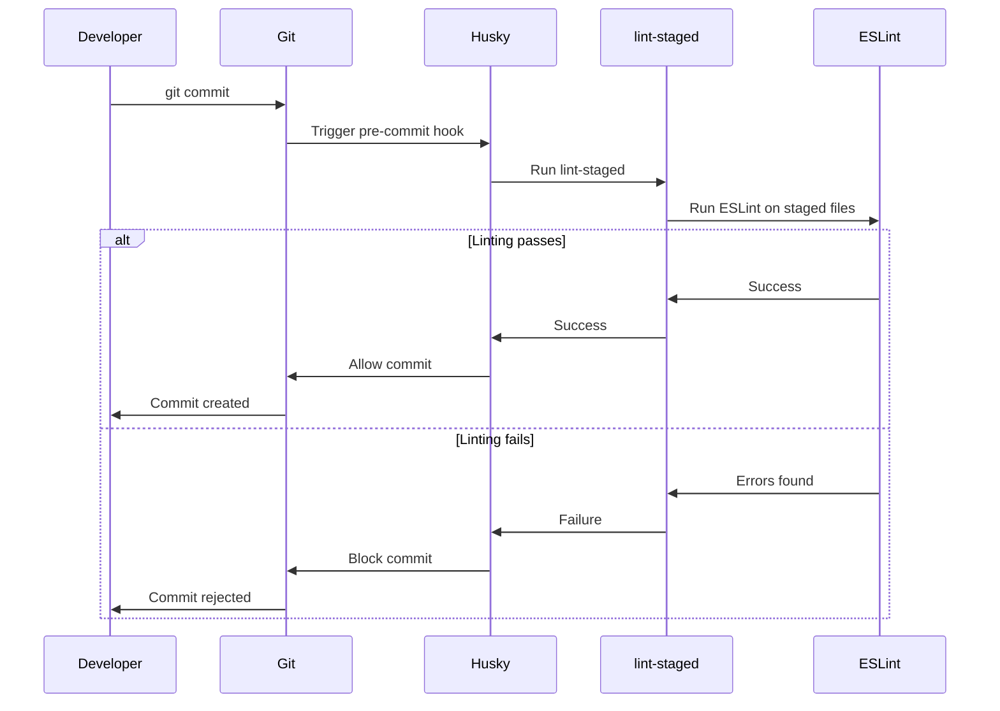
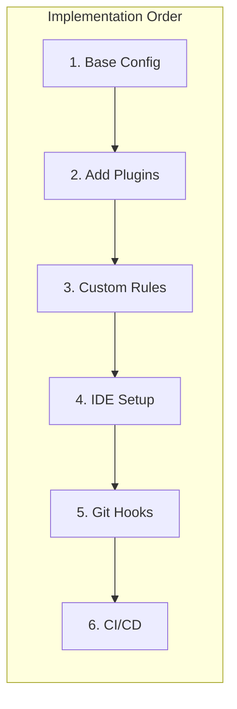

# How to Create Linting Configuration

Author: [nawazdhandala](https://github.com/nawazdhandala)

Tags: Developer Experience, Linting, Code Quality, ESLint

Description: Learn to configure linting for projects with rule selection, plugin integration, and shared configurations for consistent code style.

---

Code linting is one of the most effective ways to maintain code quality across your projects. A well-configured linter catches bugs early, enforces consistent coding standards, and reduces the cognitive load during code reviews. In this guide, we will walk through creating a comprehensive linting configuration from scratch.

## What is Linting?

Linting is the process of running a program that analyzes your code for potential errors, stylistic issues, and suspicious constructs. The term comes from the original Unix utility called "lint" that examined C source code.

Modern linters like ESLint go beyond simple syntax checking. They can:

- Detect potential bugs before runtime
- Enforce coding conventions
- Find security vulnerabilities
- Identify performance issues
- Ensure accessibility compliance

## The Linting Workflow

Understanding how linting fits into your development workflow is crucial for effective implementation.



## Setting Up ESLint

ESLint is the most popular JavaScript and TypeScript linter. Let us start by installing and configuring it.

### Installation

First, initialize your project and install ESLint:

```bash
# Initialize a new project (if needed)
npm init -y

# Install ESLint as a dev dependency
npm install eslint --save-dev

# Initialize ESLint configuration
npx eslint --init
```

The initialization wizard will ask several questions:

1. How would you like to use ESLint?
2. What type of modules does your project use?
3. Which framework does your project use?
4. Does your project use TypeScript?
5. Where does your code run?
6. What format do you want your config file to be in?

### Basic Configuration Structure

ESLint uses a flat configuration format (as of ESLint 9.x). Create an `eslint.config.js` file:

```javascript
// eslint.config.js
import js from '@eslint/js';

export default [
  js.configs.recommended,
  {
    files: ['**/*.js'],
    languageOptions: {
      ecmaVersion: 2024,
      sourceType: 'module',
      globals: {
        console: 'readonly',
        process: 'readonly',
      },
    },
    rules: {
      'no-unused-vars': 'warn',
      'no-console': 'off',
      'semi': ['error', 'always'],
      'quotes': ['error', 'single'],
    },
  },
];
```

## Understanding Rule Configuration

ESLint rules are the core of your linting setup. Each rule can be configured with different severity levels and options.

### Rule Severity Levels



### Configuring Rules

Rules can be simple or have additional options:

```javascript
// eslint.config.js
export default [
  {
    rules: {
      // Simple rule - just severity
      'no-debugger': 'error',

      // Rule with options - array format
      'indent': ['error', 2],

      // Rule with multiple options
      'quotes': ['error', 'single', { 'avoidEscape': true }],

      // Rule with object options
      'max-len': ['warn', {
        code: 100,
        tabWidth: 2,
        ignoreUrls: true,
        ignoreStrings: true,
        ignoreTemplateLiterals: true,
      }],
    },
  },
];
```

### Essential Rules for Code Quality

Here is a recommended set of rules organized by category:

```javascript
// eslint.config.js
export default [
  {
    rules: {
      // Possible Errors
      'no-console': 'warn',
      'no-debugger': 'error',
      'no-duplicate-case': 'error',
      'no-empty': 'error',
      'no-extra-semi': 'error',
      'valid-typeof': 'error',

      // Best Practices
      'curly': ['error', 'all'],
      'default-case': 'warn',
      'eqeqeq': ['error', 'always'],
      'no-eval': 'error',
      'no-implied-eval': 'error',
      'no-return-await': 'error',
      'require-await': 'error',

      // Variables
      'no-shadow': 'error',
      'no-unused-vars': ['error', {
        argsIgnorePattern: '^_',
        varsIgnorePattern: '^_',
      }],
      'no-use-before-define': 'error',

      // Stylistic Issues
      'brace-style': ['error', '1tbs'],
      'camelcase': 'error',
      'comma-dangle': ['error', 'always-multiline'],
      'indent': ['error', 2],
      'quotes': ['error', 'single'],
      'semi': ['error', 'always'],
    },
  },
];
```

## Adding Plugins

Plugins extend ESLint with additional rules for specific frameworks, libraries, or coding patterns.

### Plugin Architecture



### Installing and Configuring Plugins

Let us add some common plugins:

```bash
# Install popular plugins
npm install --save-dev \
  @eslint/js \
  typescript-eslint \
  eslint-plugin-import \
  eslint-plugin-react \
  eslint-plugin-react-hooks
```

Configure them in your ESLint config:

```javascript
// eslint.config.js
import js from '@eslint/js';
import tseslint from 'typescript-eslint';
import importPlugin from 'eslint-plugin-import';
import react from 'eslint-plugin-react';
import reactHooks from 'eslint-plugin-react-hooks';

export default tseslint.config(
  js.configs.recommended,
  ...tseslint.configs.recommended,
  {
    files: ['**/*.{ts,tsx}'],
    plugins: {
      import: importPlugin,
      react: react,
      'react-hooks': reactHooks,
    },
    languageOptions: {
      parserOptions: {
        ecmaFeatures: {
          jsx: true,
        },
      },
    },
    settings: {
      react: {
        version: 'detect',
      },
    },
    rules: {
      // TypeScript specific rules
      '@typescript-eslint/explicit-function-return-type': 'warn',
      '@typescript-eslint/no-explicit-any': 'error',
      '@typescript-eslint/no-unused-vars': 'error',

      // Import rules
      'import/order': ['error', {
        groups: [
          'builtin',
          'external',
          'internal',
          ['parent', 'sibling'],
          'index',
        ],
        'newlines-between': 'always',
        alphabetize: {
          order: 'asc',
          caseInsensitive: true,
        },
      }],
      'import/no-duplicates': 'error',

      // React rules
      'react/jsx-uses-react': 'error',
      'react/jsx-uses-vars': 'error',
      'react/prop-types': 'off',

      // React Hooks rules
      'react-hooks/rules-of-hooks': 'error',
      'react-hooks/exhaustive-deps': 'warn',
    },
  },
);
```

## Creating Shared Configurations

When working with multiple projects, shared configurations ensure consistency across your codebase.

### Shared Config Architecture



### Creating a Shared Config Package

Create a new package for your shared ESLint config:

```bash
mkdir eslint-config-mycompany
cd eslint-config-mycompany
npm init -y
```

Create the configuration files:

```javascript
// eslint-config-mycompany/index.js
import js from '@eslint/js';

export const baseConfig = {
  ...js.configs.recommended,
  rules: {
    'no-console': 'warn',
    'no-debugger': 'error',
    'eqeqeq': ['error', 'always'],
    'curly': ['error', 'all'],
    'semi': ['error', 'always'],
    'quotes': ['error', 'single'],
    'indent': ['error', 2],
    'comma-dangle': ['error', 'always-multiline'],
  },
};

export const typescriptConfig = {
  rules: {
    '@typescript-eslint/explicit-function-return-type': 'warn',
    '@typescript-eslint/no-explicit-any': 'error',
    '@typescript-eslint/consistent-type-imports': 'error',
  },
};

export const reactConfig = {
  rules: {
    'react/jsx-no-target-blank': 'error',
    'react/jsx-key': 'error',
    'react-hooks/rules-of-hooks': 'error',
    'react-hooks/exhaustive-deps': 'warn',
  },
};

export const nodeConfig = {
  rules: {
    'no-process-exit': 'error',
    'handle-callback-err': 'error',
  },
};

export default {
  baseConfig,
  typescriptConfig,
  reactConfig,
  nodeConfig,
};
```

### Using the Shared Configuration

In your projects, install and extend the shared config:

```javascript
// eslint.config.js in your project
import { baseConfig, typescriptConfig, reactConfig } from 'eslint-config-mycompany';

export default [
  baseConfig,
  typescriptConfig,
  reactConfig,
  {
    // Project-specific overrides
    rules: {
      'no-console': 'off', // Allow console in this project
    },
  },
];
```

## IDE Integration

Integrating ESLint with your IDE provides real-time feedback as you write code.

### VS Code Setup

Install the ESLint extension and configure VS Code:

```json
// .vscode/settings.json
{
  "editor.formatOnSave": true,
  "editor.codeActionsOnSave": {
    "source.fixAll.eslint": "explicit"
  },
  "eslint.validate": [
    "javascript",
    "javascriptreact",
    "typescript",
    "typescriptreact"
  ],
  "eslint.useFlatConfig": true,
  "eslint.options": {
    "overrideConfigFile": "eslint.config.js"
  }
}
```

### WebStorm/IntelliJ Setup

1. Go to Settings/Preferences
2. Navigate to Languages and Frameworks - JavaScript - Code Quality Tools - ESLint
3. Select "Automatic ESLint configuration"
4. Enable "Run eslint --fix on save"

### Vim/Neovim Setup

For Neovim with LSP:

```lua
-- In your LSP configuration
require('lspconfig').eslint.setup({
  on_attach = function(client, bufnr)
    vim.api.nvim_create_autocmd("BufWritePre", {
      buffer = bufnr,
      command = "EslintFixAll",
    })
  end,
})
```

## Git Hooks Integration

Enforce linting before commits using Git hooks.

### Using Husky and lint-staged

```bash
# Install husky and lint-staged
npm install --save-dev husky lint-staged

# Initialize husky
npx husky init
```

Configure lint-staged in package.json:

```json
{
  "lint-staged": {
    "*.{js,jsx,ts,tsx}": [
      "eslint --fix",
      "prettier --write"
    ],
    "*.{json,md,yml,yaml}": [
      "prettier --write"
    ]
  }
}
```

Create the pre-commit hook:

```bash
# .husky/pre-commit
npx lint-staged
```

### Hook Workflow



## CI/CD Integration

Add linting to your CI/CD pipeline to catch issues before merging.

### GitHub Actions Example

```yaml
# .github/workflows/lint.yml
name: Lint

on:
  push:
    branches: [main, develop]
  pull_request:
    branches: [main, develop]

jobs:
  lint:
    runs-on: ubuntu-latest

    steps:
      - name: Checkout code
        uses: actions/checkout@v4

      - name: Setup Node.js
        uses: actions/setup-node@v4
        with:
          node-version: '20'
          cache: 'npm'

      - name: Install dependencies
        run: npm ci

      - name: Run ESLint
        run: npm run lint

      - name: Run ESLint with annotations
        uses: reviewdog/action-eslint@v1
        with:
          reporter: github-pr-review
          eslint_flags: '--config eslint.config.js'
```

### GitLab CI Example

```yaml
# .gitlab-ci.yml
stages:
  - lint
  - test
  - build

lint:
  stage: lint
  image: node:20
  cache:
    paths:
      - node_modules/
  script:
    - npm ci
    - npm run lint
  rules:
    - if: $CI_PIPELINE_SOURCE == "merge_request_event"
    - if: $CI_COMMIT_BRANCH == "main"
```

## Advanced Configuration Patterns

### Environment-Specific Configurations

```javascript
// eslint.config.js
import js from '@eslint/js';

const isDevelopment = process.env.NODE_ENV === 'development';

export default [
  js.configs.recommended,
  {
    rules: {
      // Stricter in production, lenient in development
      'no-console': isDevelopment ? 'off' : 'error',
      'no-debugger': isDevelopment ? 'warn' : 'error',
    },
  },
];
```

### File Pattern Overrides

```javascript
// eslint.config.js
export default [
  {
    // Default configuration for all files
    files: ['**/*.{js,ts}'],
    rules: {
      'no-console': 'error',
    },
  },
  {
    // Relaxed rules for test files
    files: ['**/*.test.{js,ts}', '**/*.spec.{js,ts}'],
    rules: {
      'no-console': 'off',
      '@typescript-eslint/no-explicit-any': 'off',
    },
  },
  {
    // Config files can use require
    files: ['*.config.js', '*.config.ts'],
    rules: {
      '@typescript-eslint/no-var-requires': 'off',
    },
  },
];
```

### Ignoring Files

```javascript
// eslint.config.js
export default [
  {
    ignores: [
      'node_modules/**',
      'dist/**',
      'build/**',
      'coverage/**',
      '*.min.js',
      'vendor/**',
    ],
  },
  // ... rest of configuration
];
```

## Combining ESLint with Prettier

ESLint and Prettier work best together when ESLint handles code quality and Prettier handles formatting.

```bash
# Install Prettier and the ESLint config
npm install --save-dev prettier eslint-config-prettier
```

```javascript
// eslint.config.js
import js from '@eslint/js';
import prettier from 'eslint-config-prettier';

export default [
  js.configs.recommended,
  prettier, // Must be last to override other formatting rules
  {
    rules: {
      // Your rules here - avoid formatting rules
      'no-unused-vars': 'error',
      'eqeqeq': 'error',
    },
  },
];
```

Create a Prettier configuration:

```json
// .prettierrc
{
  "semi": true,
  "singleQuote": true,
  "tabWidth": 2,
  "trailingComma": "all",
  "printWidth": 100
}
```

## Troubleshooting Common Issues

### Performance Issues

If ESLint is running slowly:

```javascript
// eslint.config.js
export default [
  {
    // Explicitly ignore heavy directories
    ignores: ['**/node_modules/**', '**/dist/**'],
  },
  {
    // Use specific file patterns instead of broad ones
    files: ['src/**/*.{js,ts}'],
    // ... rules
  },
];
```

### Rule Conflicts

When rules conflict, check the order of your configurations:

```javascript
// eslint.config.js
export default [
  baseConfig,          // Most general
  typescriptConfig,    // More specific
  reactConfig,         // Framework specific
  projectOverrides,    // Project specific - highest priority
];
```

### Debugging Configuration

Use ESLint's config inspector:

```bash
# View the computed configuration for a file
npx eslint --print-config src/index.ts
```

## Summary

Creating an effective linting configuration involves:

1. Starting with a solid base configuration using ESLint's recommended rules
2. Adding plugins for your specific tech stack
3. Customizing rules to match your team's coding standards
4. Creating shared configurations for multi-project consistency
5. Integrating with your IDE for immediate feedback
6. Adding Git hooks to catch issues before commits
7. Including linting in your CI/CD pipeline

A well-configured linter is an investment that pays dividends through fewer bugs, more consistent code, and smoother code reviews.



Remember to periodically review and update your linting configuration as your project evolves and new best practices emerge. Happy linting!
