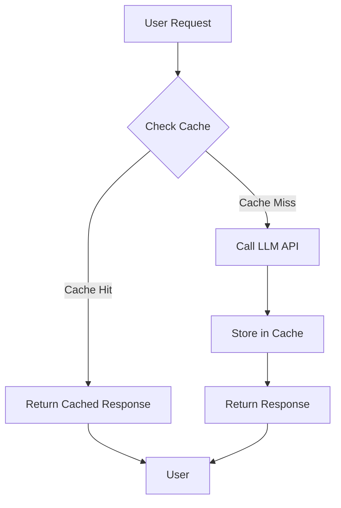
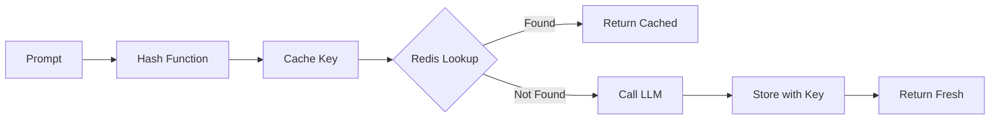
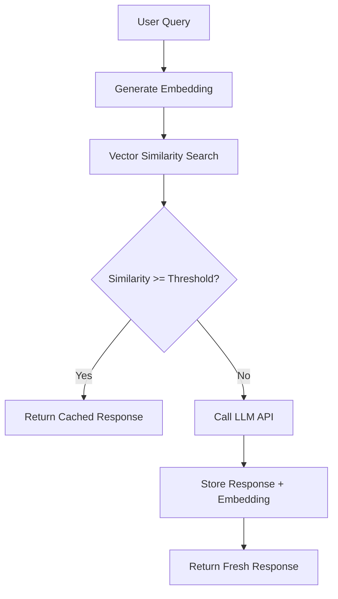
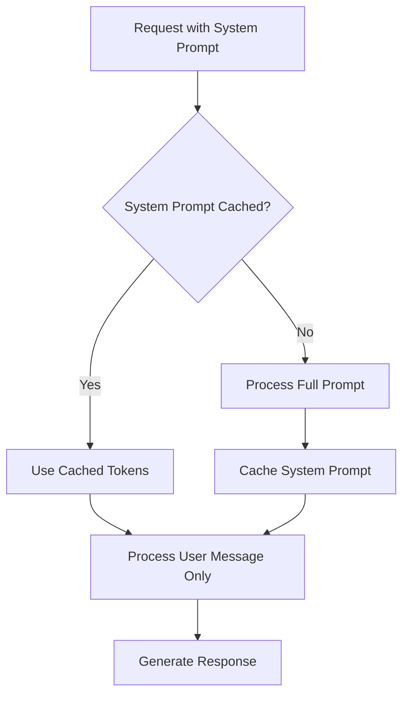
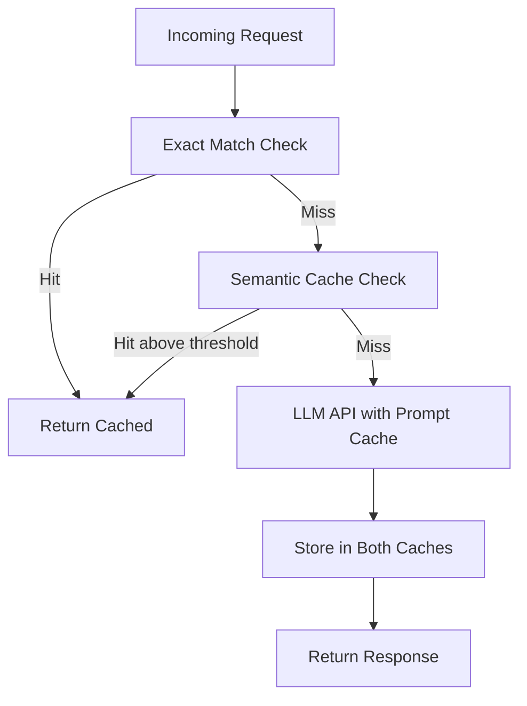

# How to Build LLM Caching Strategies

Author: [nawazdhandala](https://github.com/nawazdhandala)

Tags: LLMOps, LLM, Caching, Cost Optimization

Description: Learn how to implement caching strategies for reducing LLM inference costs.

---

Large Language Model (LLM) APIs can become expensive quickly, especially when your application scales. Every API call to services like OpenAI, Anthropic, or Google costs money based on token usage. Implementing smart caching strategies can reduce your costs by 40-90% while also improving response times. This guide covers three essential caching approaches: exact match caching, semantic caching, and prompt caching.

## Why Cache LLM Responses?

Before diving into implementation, let us understand the benefits:

- **Cost Reduction**: Avoid paying for redundant API calls
- **Latency Improvement**: Cached responses return in milliseconds vs seconds
- **Rate Limit Protection**: Reduce the number of API calls hitting provider limits
- **Consistency**: Return identical responses for identical queries

## Caching Architecture Overview

Here is a high-level view of how LLM caching fits into your application:



## Strategy 1: Exact Match Caching

Exact match caching is the simplest approach. It stores responses using the exact prompt as the cache key. This works well when users frequently send identical queries.

### How Exact Match Caching Works



### Redis Implementation for Exact Match Cache

```python
import hashlib
import json
import redis
from openai import OpenAI

# Initialize Redis client
# Using decode_responses=True to automatically decode bytes to strings
redis_client = redis.Redis(
    host='localhost',
    port=6379,
    db=0,
    decode_responses=True
)

# Initialize OpenAI client
openai_client = OpenAI()

# Cache TTL in seconds (24 hours)
CACHE_TTL = 86400


def generate_cache_key(prompt: str, model: str, temperature: float) -> str:
    """
    Generate a unique cache key based on the prompt and model parameters.

    We include model and temperature because the same prompt with different
    parameters should return different cached results.
    """
    # Create a dictionary of all parameters that affect the response
    cache_data = {
        'prompt': prompt,
        'model': model,
        'temperature': temperature
    }

    # Convert to JSON string for consistent hashing
    cache_string = json.dumps(cache_data, sort_keys=True)

    # Generate SHA256 hash for the cache key
    # Using SHA256 because it produces a fixed-length key regardless of prompt size
    cache_key = hashlib.sha256(cache_string.encode()).hexdigest()

    return f"llm_cache:{cache_key}"


def get_llm_response_with_cache(
    prompt: str,
    model: str = "gpt-4",
    temperature: float = 0.7
) -> dict:
    """
    Get LLM response with exact match caching.

    Returns a dictionary containing the response and cache status.
    """
    # Generate the cache key
    cache_key = generate_cache_key(prompt, model, temperature)

    # Try to get cached response
    cached_response = redis_client.get(cache_key)

    if cached_response:
        # Cache hit - return the stored response
        return {
            'response': json.loads(cached_response),
            'cache_hit': True,
            'cache_key': cache_key
        }

    # Cache miss - call the LLM API
    response = openai_client.chat.completions.create(
        model=model,
        messages=[{"role": "user", "content": prompt}],
        temperature=temperature
    )

    # Extract the response content
    response_content = response.choices[0].message.content

    # Store in cache with TTL
    # Using JSON serialization for complex response data
    redis_client.setex(
        cache_key,
        CACHE_TTL,
        json.dumps(response_content)
    )

    return {
        'response': response_content,
        'cache_hit': False,
        'cache_key': cache_key
    }


# Example usage
if __name__ == "__main__":
    prompt = "Explain quantum computing in simple terms"

    # First call - cache miss
    result1 = get_llm_response_with_cache(prompt)
    print(f"Cache hit: {result1['cache_hit']}")  # False

    # Second call with same prompt - cache hit
    result2 = get_llm_response_with_cache(prompt)
    print(f"Cache hit: {result2['cache_hit']}")  # True
```

### When to Use Exact Match Caching

- FAQ systems where users ask the same questions repeatedly
- Documentation search with common queries
- Chatbots with predefined conversation flows
- API endpoints with deterministic prompts

## Strategy 2: Semantic Caching

Exact match caching fails when users phrase the same question differently. Semantic caching solves this by using embeddings to find similar queries, even if the exact wording differs.

### How Semantic Caching Works



### Embedding-Based Cache with Redis Vector Search

```python
import numpy as np
import json
import redis
from redis.commands.search.field import VectorField, TextField
from redis.commands.search.indexDefinition import IndexDefinition, IndexType
from redis.commands.search.query import Query
from openai import OpenAI

# Initialize clients
redis_client = redis.Redis(host='localhost', port=6379, decode_responses=False)
openai_client = OpenAI()

# Configuration constants
EMBEDDING_MODEL = "text-embedding-3-small"
EMBEDDING_DIMENSION = 1536  # Dimension for text-embedding-3-small
SIMILARITY_THRESHOLD = 0.92  # Cosine similarity threshold for cache hits
INDEX_NAME = "semantic_cache_idx"
CACHE_PREFIX = "semantic_cache:"


def create_vector_index():
    """
    Create a Redis vector search index for semantic caching.

    This index enables fast similarity searches across stored embeddings.
    Run this once during application setup.
    """
    try:
        # Check if index already exists
        redis_client.ft(INDEX_NAME).info()
        print("Index already exists")
        return
    except redis.ResponseError:
        # Index does not exist, create it
        pass

    # Define the schema for our cached items
    schema = (
        # Store the original prompt as searchable text
        TextField("$.prompt", as_name="prompt"),
        # Store the embedding as a vector field for similarity search
        VectorField(
            "$.embedding",
            "FLAT",  # FLAT algorithm for exact nearest neighbor search
            {
                "TYPE": "FLOAT32",
                "DIM": EMBEDDING_DIMENSION,
                "DISTANCE_METRIC": "COSINE"  # Using cosine similarity
            },
            as_name="embedding"
        )
    )

    # Create the index on JSON documents with our prefix
    definition = IndexDefinition(
        prefix=[CACHE_PREFIX],
        index_type=IndexType.JSON
    )

    redis_client.ft(INDEX_NAME).create_index(
        fields=schema,
        definition=definition
    )
    print("Vector index created successfully")


def get_embedding(text: str) -> list:
    """
    Generate an embedding vector for the given text.

    Embeddings capture the semantic meaning of text, allowing us to
    compare similarity between different phrasings of the same question.
    """
    response = openai_client.embeddings.create(
        model=EMBEDDING_MODEL,
        input=text
    )
    return response.data[0].embedding


def find_similar_cached_response(query_embedding: list) -> dict | None:
    """
    Search for a semantically similar cached response.

    Returns the cached response if similarity exceeds threshold, None otherwise.
    """
    # Convert embedding to bytes for Redis query
    query_vector = np.array(query_embedding, dtype=np.float32).tobytes()

    # Build the vector similarity query
    # KNN search for the single most similar cached item
    query = (
        Query("*=>[KNN 1 @embedding $vec AS similarity_score]")
        .return_fields("prompt", "response", "similarity_score")
        .sort_by("similarity_score")
        .dialect(2)
    )

    # Execute the search
    results = redis_client.ft(INDEX_NAME).search(
        query,
        query_params={"vec": query_vector}
    )

    if results.total == 0:
        return None

    # Check if the similarity meets our threshold
    # Redis returns cosine distance, so we convert to similarity
    # For COSINE distance metric, similarity = 1 - distance
    top_result = results.docs[0]
    similarity_score = 1 - float(top_result.similarity_score)

    if similarity_score >= SIMILARITY_THRESHOLD:
        return {
            'response': top_result.response,
            'original_prompt': top_result.prompt,
            'similarity_score': similarity_score
        }

    return None


def get_llm_response_semantic_cache(
    prompt: str,
    model: str = "gpt-4"
) -> dict:
    """
    Get LLM response with semantic caching.

    This function first checks for semantically similar cached responses
    before making an API call.
    """
    # Generate embedding for the incoming prompt
    prompt_embedding = get_embedding(prompt)

    # Search for similar cached responses
    cached = find_similar_cached_response(prompt_embedding)

    if cached:
        return {
            'response': cached['response'],
            'cache_hit': True,
            'similarity_score': cached['similarity_score'],
            'matched_prompt': cached['original_prompt']
        }

    # No similar response found - call the LLM
    response = openai_client.chat.completions.create(
        model=model,
        messages=[{"role": "user", "content": prompt}],
        temperature=0.7
    )

    response_content = response.choices[0].message.content

    # Store the new response with its embedding
    import uuid
    cache_key = f"{CACHE_PREFIX}{uuid.uuid4().hex}"

    cache_data = {
        'prompt': prompt,
        'response': response_content,
        'embedding': prompt_embedding,
        'model': model
    }

    redis_client.json().set(cache_key, "$", cache_data)

    # Set expiration (7 days for semantic cache)
    redis_client.expire(cache_key, 604800)

    return {
        'response': response_content,
        'cache_hit': False,
        'similarity_score': None,
        'matched_prompt': None
    }


# Example usage demonstrating semantic matching
if __name__ == "__main__":
    # Create the index first
    create_vector_index()

    # First query - cache miss
    result1 = get_llm_response_semantic_cache(
        "What is machine learning?"
    )
    print(f"Cache hit: {result1['cache_hit']}")  # False

    # Similar query with different wording - should be cache hit
    result2 = get_llm_response_semantic_cache(
        "Can you explain what ML is?"
    )
    print(f"Cache hit: {result2['cache_hit']}")  # True
    print(f"Similarity: {result2['similarity_score']}")  # ~0.93
```

### Tuning the Similarity Threshold

The similarity threshold is critical for semantic caching performance:

| Threshold | Behavior |
|-----------|----------|
| 0.95+ | Very strict - only nearly identical queries match |
| 0.90-0.95 | Balanced - good for most use cases |
| 0.85-0.90 | Lenient - more cache hits but risk of irrelevant matches |
| Below 0.85 | Too loose - may return incorrect cached responses |

## Strategy 3: Prompt Caching (Provider-Level)

Many LLM providers now offer native prompt caching for system prompts and context. This reduces costs when you repeatedly use the same system instructions or context documents.

### How Prompt Caching Works



### Anthropic Prompt Caching Example

```python
import anthropic

# Initialize the Anthropic client
client = anthropic.Anthropic()

# Define a large system prompt that will be cached
# Prompt caching is most beneficial for prompts with 1024+ tokens
SYSTEM_PROMPT = """
You are an expert customer support agent for TechCorp Inc.

Company Background:
TechCorp Inc. is a leading provider of cloud infrastructure solutions,
founded in 2015. We serve over 10,000 enterprise customers globally.

Product Documentation:
[... extensive product documentation here ...]

Support Guidelines:
1. Always greet the customer professionally
2. Identify the product and issue category
3. Provide step-by-step solutions when possible
4. Escalate to human agents for billing issues
5. Never share internal system information

Response Format:
- Use clear, concise language
- Include relevant documentation links
- Offer follow-up assistance

[... additional context totaling 2000+ tokens ...]
"""


def get_support_response(user_message: str) -> dict:
    """
    Get a support response using Anthropic's prompt caching.

    The system prompt is cached on first use, reducing costs for
    subsequent requests that use the same system context.
    """
    response = client.messages.create(
        model="claude-sonnet-4-20250514",
        max_tokens=1024,
        system=[
            {
                "type": "text",
                "text": SYSTEM_PROMPT,
                # Enable caching for this system prompt block
                # The prompt must be at least 1024 tokens for caching
                "cache_control": {"type": "ephemeral"}
            }
        ],
        messages=[
            {"role": "user", "content": user_message}
        ]
    )

    # Check cache performance in the response
    usage = response.usage

    return {
        'response': response.content[0].text,
        'input_tokens': usage.input_tokens,
        'output_tokens': usage.output_tokens,
        # These fields show caching effectiveness
        'cache_creation_input_tokens': getattr(usage, 'cache_creation_input_tokens', 0),
        'cache_read_input_tokens': getattr(usage, 'cache_read_input_tokens', 0)
    }


# Example usage showing cache benefits
if __name__ == "__main__":
    # First request - cache is created
    result1 = get_support_response("How do I reset my password?")
    print(f"Cache created tokens: {result1['cache_creation_input_tokens']}")

    # Second request - cache is used
    result2 = get_support_response("What are your pricing plans?")
    print(f"Cache read tokens: {result2['cache_read_input_tokens']}")
    # The cached system prompt tokens are now charged at reduced rate
```

### OpenAI Prompt Caching

OpenAI automatically caches prompts for certain models. Here is how to structure your requests to maximize cache hits:

```python
from openai import OpenAI

client = OpenAI()

# Large context that benefits from caching
CONTEXT_DOCUMENT = """
[Your large context document here - technical documentation,
company policies, knowledge base articles, etc.]

This should be substantial content that remains constant across requests.
OpenAI automatically caches prompts longer than 1024 tokens.
"""


def query_with_context(user_query: str) -> dict:
    """
    Query with a large context document that benefits from automatic caching.

    OpenAI caches the longest common prefix of prompts automatically.
    To maximize cache hits:
    1. Keep static content at the beginning of the prompt
    2. Place variable content (user query) at the end
    3. Use consistent formatting for the static portion
    """
    response = client.chat.completions.create(
        model="gpt-4",
        messages=[
            {
                "role": "system",
                "content": f"""You are a helpful assistant with access to
                the following documentation:

                {CONTEXT_DOCUMENT}

                Use this documentation to answer user questions accurately."""
            },
            {
                "role": "user",
                "content": user_query
            }
        ]
    )

    # Check usage for caching information
    usage = response.usage

    return {
        'response': response.choices[0].message.content,
        'prompt_tokens': usage.prompt_tokens,
        'completion_tokens': usage.completion_tokens,
        # Cached tokens show up in prompt_tokens_details for supported models
        'cached_tokens': getattr(
            usage,
            'prompt_tokens_details',
            {}
        ).get('cached_tokens', 0)
    }
```

## Combining Strategies: A Production Cache Layer

For production systems, combining multiple caching strategies provides the best results:



### Multi-Layer Cache Implementation

```python
import hashlib
import json
import numpy as np
import redis
from redis.commands.search.query import Query
from openai import OpenAI
from dataclasses import dataclass
from typing import Optional
import time

# Initialize clients
redis_client = redis.Redis(host='localhost', port=6379, decode_responses=False)
openai_client = OpenAI()


@dataclass
class CacheResult:
    """Data class to hold cache lookup results."""
    response: str
    cache_type: str  # 'exact', 'semantic', or 'none'
    cache_hit: bool
    similarity_score: Optional[float] = None
    latency_ms: float = 0.0
    tokens_saved: int = 0


class MultiLayerLLMCache:
    """
    Production-ready multi-layer caching for LLM responses.

    Layer 1: Exact match cache (fastest, most precise)
    Layer 2: Semantic cache (handles paraphrased queries)
    Layer 3: Provider prompt caching (reduces token costs)
    """

    def __init__(
        self,
        exact_cache_ttl: int = 86400,      # 24 hours
        semantic_cache_ttl: int = 604800,   # 7 days
        similarity_threshold: float = 0.92,
        embedding_model: str = "text-embedding-3-small"
    ):
        self.exact_cache_ttl = exact_cache_ttl
        self.semantic_cache_ttl = semantic_cache_ttl
        self.similarity_threshold = similarity_threshold
        self.embedding_model = embedding_model
        self.embedding_dimension = 1536

        # Ensure vector index exists
        self._ensure_vector_index()

    def _ensure_vector_index(self):
        """Create vector index if it does not exist."""
        from redis.commands.search.field import VectorField, TextField
        from redis.commands.search.indexDefinition import IndexDefinition, IndexType

        try:
            redis_client.ft("multilayer_cache_idx").info()
        except redis.ResponseError:
            schema = (
                TextField("$.prompt", as_name="prompt"),
                VectorField(
                    "$.embedding",
                    "FLAT",
                    {
                        "TYPE": "FLOAT32",
                        "DIM": self.embedding_dimension,
                        "DISTANCE_METRIC": "COSINE"
                    },
                    as_name="embedding"
                )
            )
            definition = IndexDefinition(
                prefix=["semantic:"],
                index_type=IndexType.JSON
            )
            redis_client.ft("multilayer_cache_idx").create_index(
                fields=schema,
                definition=definition
            )

    def _get_exact_cache_key(self, prompt: str, model: str) -> str:
        """Generate deterministic cache key for exact matching."""
        data = json.dumps({'prompt': prompt, 'model': model}, sort_keys=True)
        return f"exact:{hashlib.sha256(data.encode()).hexdigest()}"

    def _get_embedding(self, text: str) -> list:
        """Generate embedding for semantic comparison."""
        response = openai_client.embeddings.create(
            model=self.embedding_model,
            input=text
        )
        return response.data[0].embedding

    def _check_exact_cache(self, prompt: str, model: str) -> Optional[str]:
        """Check for exact match in cache."""
        key = self._get_exact_cache_key(prompt, model)
        cached = redis_client.get(key)
        if cached:
            return json.loads(cached.decode())
        return None

    def _check_semantic_cache(
        self,
        embedding: list
    ) -> Optional[tuple[str, float]]:
        """Check for semantically similar cached response."""
        query_vector = np.array(embedding, dtype=np.float32).tobytes()

        query = (
            Query("*=>[KNN 1 @embedding $vec AS score]")
            .return_fields("response", "score")
            .sort_by("score")
            .dialect(2)
        )

        results = redis_client.ft("multilayer_cache_idx").search(
            query,
            query_params={"vec": query_vector}
        )

        if results.total > 0:
            top = results.docs[0]
            similarity = 1 - float(top.score)
            if similarity >= self.similarity_threshold:
                return (top.response, similarity)

        return None

    def _store_in_caches(
        self,
        prompt: str,
        response: str,
        model: str,
        embedding: list
    ):
        """Store response in both exact and semantic caches."""
        # Store in exact cache
        exact_key = self._get_exact_cache_key(prompt, model)
        redis_client.setex(
            exact_key,
            self.exact_cache_ttl,
            json.dumps(response)
        )

        # Store in semantic cache
        import uuid
        semantic_key = f"semantic:{uuid.uuid4().hex}"
        redis_client.json().set(semantic_key, "$", {
            'prompt': prompt,
            'response': response,
            'embedding': embedding,
            'model': model,
            'created_at': time.time()
        })
        redis_client.expire(semantic_key, self.semantic_cache_ttl)

    def get_response(
        self,
        prompt: str,
        model: str = "gpt-4",
        system_prompt: Optional[str] = None
    ) -> CacheResult:
        """
        Get LLM response with multi-layer caching.

        Checks caches in order of speed:
        1. Exact match (sub-millisecond)
        2. Semantic match (few milliseconds)
        3. API call with prompt caching (seconds)
        """
        start_time = time.time()

        # Layer 1: Check exact cache
        exact_result = self._check_exact_cache(prompt, model)
        if exact_result:
            return CacheResult(
                response=exact_result,
                cache_type='exact',
                cache_hit=True,
                latency_ms=(time.time() - start_time) * 1000
            )

        # Generate embedding for semantic search
        # We do this before semantic check because we will need it later anyway
        embedding = self._get_embedding(prompt)

        # Layer 2: Check semantic cache
        semantic_result = self._check_semantic_cache(embedding)
        if semantic_result:
            response, similarity = semantic_result
            return CacheResult(
                response=response,
                cache_type='semantic',
                cache_hit=True,
                similarity_score=similarity,
                latency_ms=(time.time() - start_time) * 1000
            )

        # Layer 3: Call LLM API
        messages = []
        if system_prompt:
            messages.append({"role": "system", "content": system_prompt})
        messages.append({"role": "user", "content": prompt})

        api_response = openai_client.chat.completions.create(
            model=model,
            messages=messages
        )

        response_text = api_response.choices[0].message.content

        # Store in both caches for future use
        self._store_in_caches(prompt, response_text, model, embedding)

        return CacheResult(
            response=response_text,
            cache_type='none',
            cache_hit=False,
            latency_ms=(time.time() - start_time) * 1000,
            tokens_saved=0
        )


# Usage example with metrics
if __name__ == "__main__":
    cache = MultiLayerLLMCache(
        similarity_threshold=0.90
    )

    # Track cache performance
    queries = [
        "What is Python?",
        "What is Python?",  # Exact match
        "Can you tell me about Python programming?",  # Semantic match
        "Explain JavaScript",  # New query
    ]

    for query in queries:
        result = cache.get_response(query)
        print(f"Query: {query[:40]}...")
        print(f"  Cache type: {result.cache_type}")
        print(f"  Cache hit: {result.cache_hit}")
        print(f"  Latency: {result.latency_ms:.2f}ms")
        if result.similarity_score:
            print(f"  Similarity: {result.similarity_score:.3f}")
        print()
```

## Monitoring and Metrics

Track these metrics to measure caching effectiveness:

```python
import time
from dataclasses import dataclass, field
from typing import Dict
import json


@dataclass
class CacheMetrics:
    """Track caching performance metrics."""

    total_requests: int = 0
    exact_hits: int = 0
    semantic_hits: int = 0
    cache_misses: int = 0

    total_latency_ms: float = 0.0
    cache_hit_latency_ms: float = 0.0
    cache_miss_latency_ms: float = 0.0

    estimated_tokens_saved: int = 0
    estimated_cost_saved_usd: float = 0.0

    # Cost per 1K tokens (adjust based on your model)
    input_cost_per_1k: float = 0.01
    output_cost_per_1k: float = 0.03

    def record_request(
        self,
        cache_type: str,
        latency_ms: float,
        estimated_tokens: int = 500
    ):
        """Record a single request for metrics tracking."""
        self.total_requests += 1
        self.total_latency_ms += latency_ms

        if cache_type == 'exact':
            self.exact_hits += 1
            self.cache_hit_latency_ms += latency_ms
            self._calculate_savings(estimated_tokens)
        elif cache_type == 'semantic':
            self.semantic_hits += 1
            self.cache_hit_latency_ms += latency_ms
            self._calculate_savings(estimated_tokens)
        else:
            self.cache_misses += 1
            self.cache_miss_latency_ms += latency_ms

    def _calculate_savings(self, tokens: int):
        """Calculate estimated cost savings from cache hit."""
        self.estimated_tokens_saved += tokens
        # Rough estimate: 70% input, 30% output tokens
        input_tokens = int(tokens * 0.7)
        output_tokens = int(tokens * 0.3)

        input_cost = (input_tokens / 1000) * self.input_cost_per_1k
        output_cost = (output_tokens / 1000) * self.output_cost_per_1k

        self.estimated_cost_saved_usd += input_cost + output_cost

    @property
    def cache_hit_rate(self) -> float:
        """Calculate overall cache hit rate."""
        if self.total_requests == 0:
            return 0.0
        return (self.exact_hits + self.semantic_hits) / self.total_requests

    @property
    def exact_hit_rate(self) -> float:
        """Calculate exact match cache hit rate."""
        if self.total_requests == 0:
            return 0.0
        return self.exact_hits / self.total_requests

    @property
    def semantic_hit_rate(self) -> float:
        """Calculate semantic cache hit rate."""
        if self.total_requests == 0:
            return 0.0
        return self.semantic_hits / self.total_requests

    @property
    def avg_latency_ms(self) -> float:
        """Calculate average request latency."""
        if self.total_requests == 0:
            return 0.0
        return self.total_latency_ms / self.total_requests

    def get_report(self) -> dict:
        """Generate a metrics report."""
        return {
            'total_requests': self.total_requests,
            'cache_hit_rate': f"{self.cache_hit_rate:.1%}",
            'exact_hit_rate': f"{self.exact_hit_rate:.1%}",
            'semantic_hit_rate': f"{self.semantic_hit_rate:.1%}",
            'avg_latency_ms': f"{self.avg_latency_ms:.2f}",
            'estimated_tokens_saved': self.estimated_tokens_saved,
            'estimated_cost_saved_usd': f"${self.estimated_cost_saved_usd:.2f}"
        }


# Example usage
metrics = CacheMetrics()

# Simulate some requests
metrics.record_request('exact', 0.5, 450)
metrics.record_request('semantic', 15.2, 520)
metrics.record_request('none', 1250.0, 0)
metrics.record_request('exact', 0.3, 380)

print(json.dumps(metrics.get_report(), indent=2))
```

## Best Practices

### 1. Cache Invalidation Strategy

```python
def invalidate_cache_by_pattern(pattern: str):
    """
    Invalidate cache entries matching a pattern.

    Use this when underlying data changes and cached responses
    may become stale.
    """
    cursor = 0
    deleted_count = 0

    while True:
        cursor, keys = redis_client.scan(
            cursor=cursor,
            match=pattern,
            count=100
        )

        if keys:
            deleted_count += redis_client.delete(*keys)

        if cursor == 0:
            break

    return deleted_count


# Example: Invalidate all caches for a specific topic
# invalidate_cache_by_pattern("*:quantum*")
```

### 2. Cache Warming

Pre-populate your cache with common queries during off-peak hours:

```python
def warm_cache(common_queries: list[str], model: str = "gpt-4"):
    """
    Pre-populate cache with responses to common queries.

    Run this during deployment or maintenance windows.
    """
    cache = MultiLayerLLMCache()

    for query in common_queries:
        result = cache.get_response(query, model)
        if not result.cache_hit:
            print(f"Warmed cache for: {query[:50]}...")
            # Add delay to avoid rate limits
            time.sleep(0.5)


# Example common queries for a support bot
common_queries = [
    "How do I reset my password?",
    "What are your business hours?",
    "How do I contact support?",
    "What payment methods do you accept?",
]
```

### 3. TTL Considerations

| Content Type | Recommended TTL | Reason |
|--------------|-----------------|--------|
| Static facts | 7+ days | Information rarely changes |
| Product info | 1-24 hours | May update with releases |
| Time-sensitive | 5-60 minutes | Needs frequent refresh |
| User-specific | No caching | Responses should be personalized |

## Cost Savings Analysis

Here is what you can expect from implementing these caching strategies:

| Strategy | Typical Hit Rate | Cost Reduction |
|----------|-----------------|----------------|
| Exact Match Only | 15-30% | 15-30% |
| Semantic Only | 25-45% | 20-40% |
| Combined | 40-60% | 35-55% |
| Combined + Prompt Cache | 50-70% | 45-70% |

## Conclusion

Implementing LLM caching is one of the most effective ways to reduce costs while improving response times. Start with exact match caching for quick wins, add semantic caching for better coverage, and leverage provider prompt caching for system prompts. Monitor your cache hit rates and adjust thresholds based on your specific use case.

Key takeaways:

1. Exact match caching is simple and effective for repetitive queries
2. Semantic caching handles variations in how users phrase questions
3. Provider prompt caching reduces costs for large system prompts
4. Combining strategies yields the best results
5. Always monitor cache performance and adjust TTLs based on your data freshness requirements

By implementing these strategies, you can significantly reduce your LLM API costs while delivering faster responses to your users.
