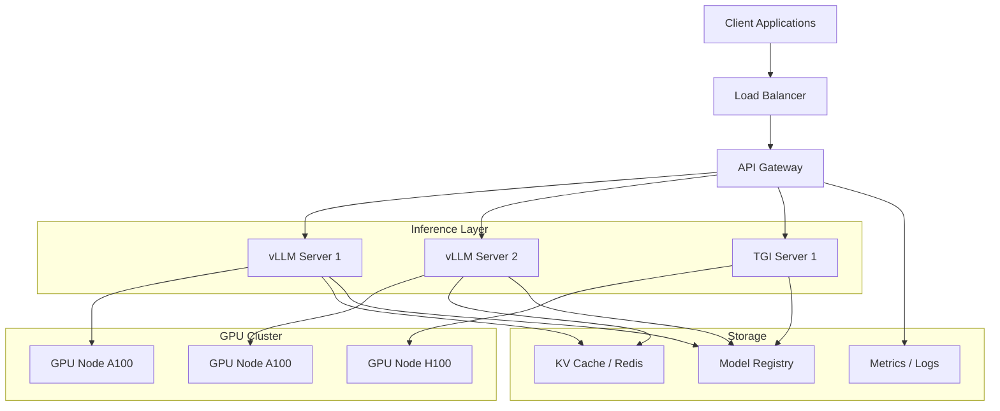
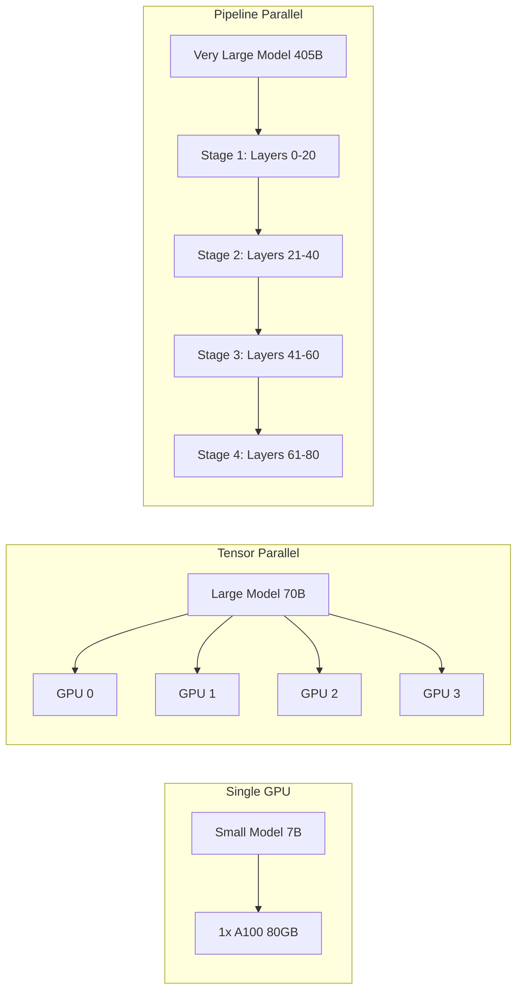
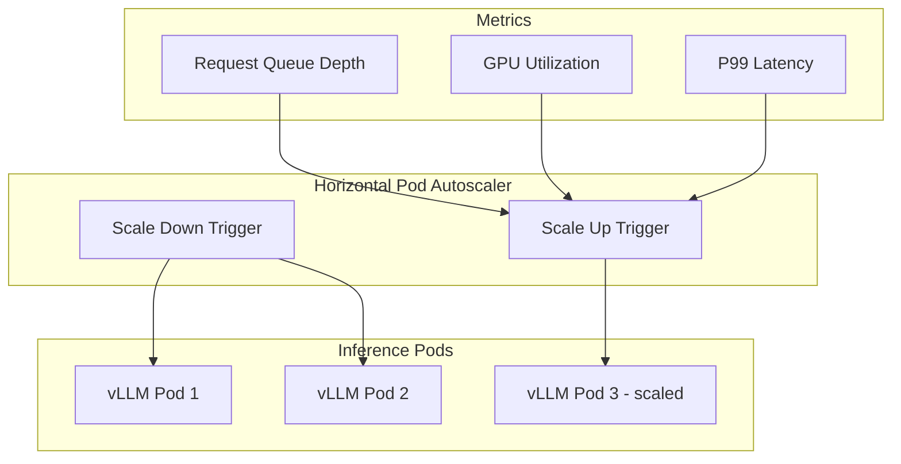
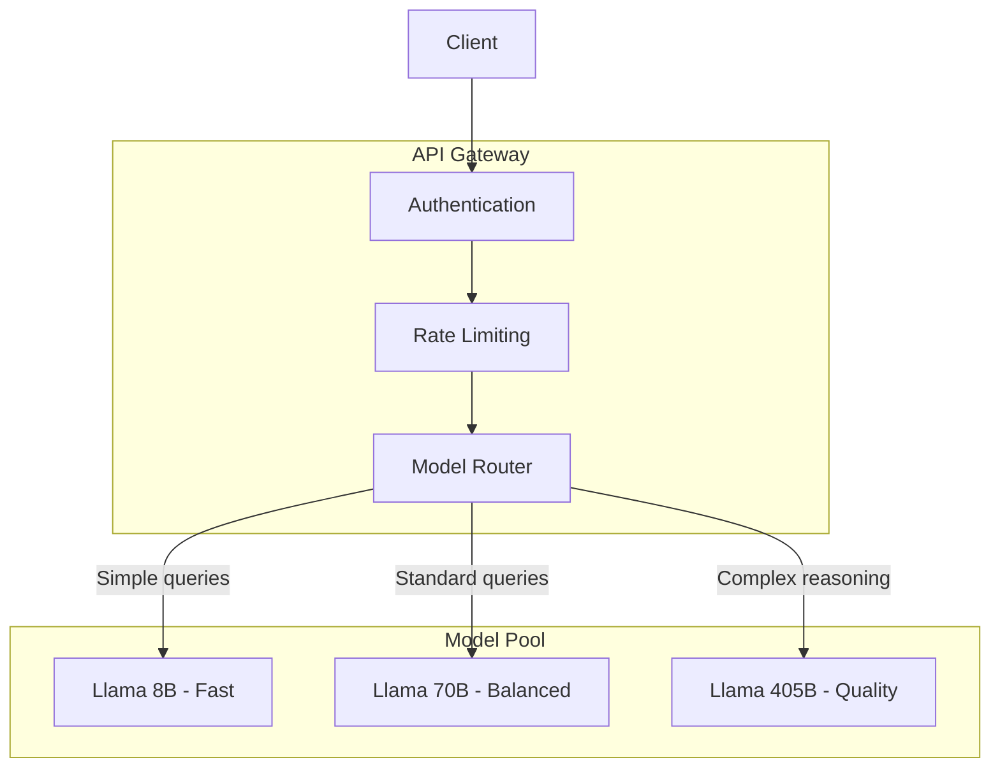
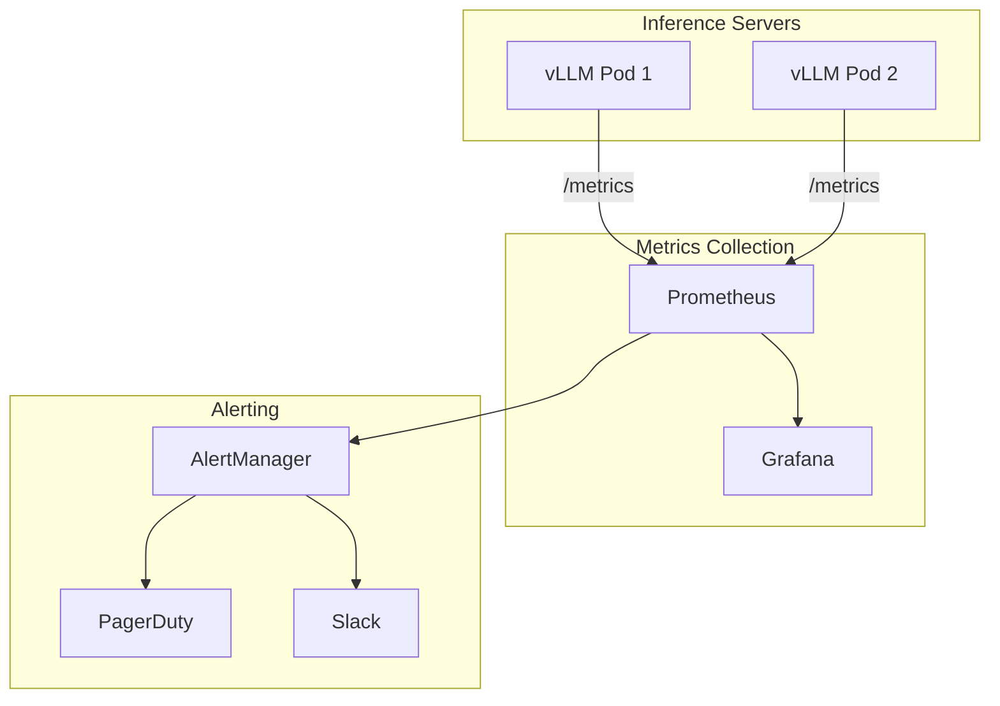
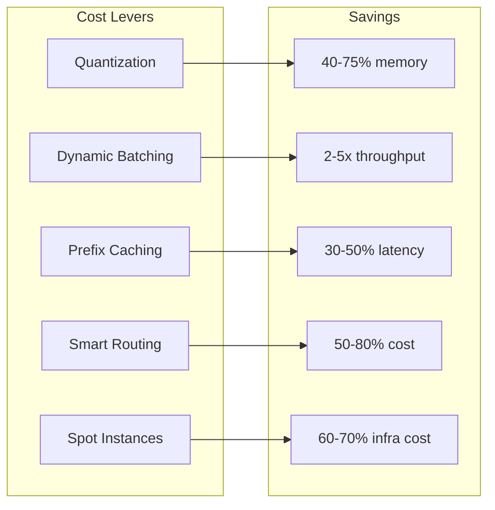

# How to Build LLM Deployment Architecture

Author: [nawazdhandala](https://github.com/nawazdhandala)

Tags: LLMOps, LLM, Deployment, Architecture

Description: Learn how to architect LLM deployments for scale, reliability, and cost efficiency.

---

Deploying large language models in production requires careful architectural decisions. You need to balance inference speed, cost, GPU utilization, and reliability. This guide covers everything from model serving frameworks to GPU allocation strategies.

## LLM Deployment Architecture Overview



Core components:
1. **Load Balancer** - Distributes requests across inference servers
2. **API Gateway** - Handles authentication, rate limiting, and routing
3. **Inference Servers** - vLLM, TGI, or TensorRT-LLM for model serving
4. **GPU Cluster** - Hardware acceleration for inference
5. **Model Registry** - Centralized storage for model weights

## Choosing a Model Serving Framework

### vLLM

vLLM uses PagedAttention for efficient memory management. It is the go-to choice for high-throughput serving.

```python
# vllm_server.py
# Deploy a vLLM server with optimized settings

from vllm import LLM, SamplingParams

# Initialize the LLM with memory optimization
# - gpu_memory_utilization: Reserve 90% of GPU memory for the model
# - tensor_parallel_size: Split model across multiple GPUs
# - max_model_len: Maximum sequence length to support
llm = LLM(
    model="meta-llama/Llama-3.1-70B-Instruct",
    tensor_parallel_size=4,  # Use 4 GPUs for tensor parallelism
    gpu_memory_utilization=0.9,  # Use 90% of available GPU memory
    max_model_len=8192,  # Support up to 8K context length
    enable_prefix_caching=True,  # Cache common prefixes for faster inference
)

# Configure sampling parameters
# - temperature: Controls randomness (0 = deterministic)
# - top_p: Nucleus sampling threshold
# - max_tokens: Maximum tokens to generate
sampling_params = SamplingParams(
    temperature=0.7,
    top_p=0.95,
    max_tokens=1024,
)

# Generate completions
prompts = ["Explain the theory of relativity in simple terms."]
outputs = llm.generate(prompts, sampling_params)

for output in outputs:
    print(output.outputs[0].text)
```

### Text Generation Inference (TGI)

TGI from Hugging Face provides a production-ready inference server with built-in features like continuous batching and token streaming.

```bash
# Deploy TGI with Docker
# - HUGGING_FACE_HUB_TOKEN: Required for gated models
# - NUM_SHARD: Number of GPUs for tensor parallelism
# - MAX_INPUT_LENGTH: Maximum input tokens
# - MAX_TOTAL_TOKENS: Maximum input + output tokens

docker run --gpus all \
  -e HUGGING_FACE_HUB_TOKEN=$HF_TOKEN \
  -p 8080:80 \
  ghcr.io/huggingface/text-generation-inference:latest \
  --model-id meta-llama/Llama-3.1-70B-Instruct \
  --num-shard 4 \
  --max-input-length 4096 \
  --max-total-tokens 8192 \
  --max-batch-prefill-tokens 4096 \
  --quantize bitsandbytes-nf4
```

### Framework Comparison

| Feature | vLLM | TGI | TensorRT-LLM |
|---------|------|-----|--------------|
| PagedAttention | Yes | Yes | Yes |
| Continuous Batching | Yes | Yes | Yes |
| Tensor Parallelism | Yes | Yes | Yes |
| Quantization | AWQ, GPTQ, FP8 | GPTQ, bitsandbytes | FP8, INT8, INT4 |
| Streaming | Yes | Yes | Yes |
| OpenAI Compatible API | Yes | Yes | No |
| Best For | Throughput | Ease of Use | Latency |

## GPU Allocation Strategies



### Memory Requirements by Model Size

```python
# gpu_calculator.py
# Calculate GPU memory requirements for different model configurations

def calculate_gpu_memory(
    params_billions: float,
    precision: str = "fp16",
    context_length: int = 4096,
    batch_size: int = 1,
) -> dict:
    """
    Calculate approximate GPU memory requirements for LLM inference.

    Args:
        params_billions: Model size in billions of parameters
        precision: fp32, fp16, bf16, int8, or int4
        context_length: Maximum sequence length
        batch_size: Number of concurrent sequences

    Returns:
        Dictionary with memory breakdown
    """
    # Bytes per parameter based on precision
    bytes_per_param = {
        "fp32": 4,
        "fp16": 2,
        "bf16": 2,
        "int8": 1,
        "int4": 0.5,
    }

    # Model weights memory
    weights_gb = (params_billions * 1e9 * bytes_per_param[precision]) / 1e9

    # KV cache memory (approximate)
    # Assuming 2 bytes per value, 2 values per token (K and V)
    # and num_layers * num_heads * head_dim typical values
    hidden_size = int(params_billions ** 0.5 * 4096)  # Rough estimate
    num_layers = int(params_billions * 0.8)  # Rough estimate
    kv_cache_gb = (
        batch_size * context_length * num_layers * hidden_size * 4
    ) / 1e9

    # Activation memory (approximate)
    activation_gb = weights_gb * 0.1 * batch_size

    total_gb = weights_gb + kv_cache_gb + activation_gb

    return {
        "weights_gb": round(weights_gb, 2),
        "kv_cache_gb": round(kv_cache_gb, 2),
        "activation_gb": round(activation_gb, 2),
        "total_gb": round(total_gb, 2),
        "recommended_gpu": recommend_gpu(total_gb),
    }


def recommend_gpu(memory_gb: float) -> str:
    """Recommend GPU configuration based on memory requirements."""
    if memory_gb <= 16:
        return "1x RTX 4090 (24GB) or 1x A10G (24GB)"
    elif memory_gb <= 40:
        return "1x A100 40GB"
    elif memory_gb <= 80:
        return "1x A100 80GB or 1x H100 80GB"
    elif memory_gb <= 160:
        return "2x A100 80GB or 2x H100 80GB (tensor parallel)"
    elif memory_gb <= 320:
        return "4x A100 80GB or 4x H100 80GB (tensor parallel)"
    else:
        return "8x H100 80GB (tensor parallel) or pipeline parallel"


# Example calculations
models = [
    ("Llama-3.1-8B", 8),
    ("Llama-3.1-70B", 70),
    ("Llama-3.1-405B", 405),
]

for name, params in models:
    print(f"\n{name}:")
    for precision in ["fp16", "int8", "int4"]:
        result = calculate_gpu_memory(params, precision)
        print(f"  {precision}: {result['total_gb']}GB - {result['recommended_gpu']}")
```

## Kubernetes Deployment with vLLM

### vLLM Deployment Manifest

```yaml
# vllm-deployment.yaml
# Production deployment of vLLM with GPU scheduling

apiVersion: apps/v1
kind: Deployment
metadata:
  name: vllm-llama-70b
  namespace: llm-inference
  labels:
    app: vllm
    model: llama-70b
spec:
  # Start with 2 replicas for high availability
  replicas: 2
  selector:
    matchLabels:
      app: vllm
      model: llama-70b
  template:
    metadata:
      labels:
        app: vllm
        model: llama-70b
      annotations:
        # Prometheus metrics scraping
        prometheus.io/scrape: "true"
        prometheus.io/port: "8000"
        prometheus.io/path: "/metrics"
    spec:
      # Schedule on GPU nodes with specific GPU type
      nodeSelector:
        nvidia.com/gpu.product: NVIDIA-A100-SXM4-80GB

      # Tolerate GPU node taints
      tolerations:
        - key: nvidia.com/gpu
          operator: Exists
          effect: NoSchedule

      containers:
        - name: vllm
          image: vllm/vllm-openai:v0.6.0

          # Resource requests and limits
          resources:
            requests:
              # Request 4 GPUs for tensor parallelism
              nvidia.com/gpu: 4
              memory: "64Gi"
              cpu: "16"
            limits:
              nvidia.com/gpu: 4
              memory: "128Gi"
              cpu: "32"

          # vLLM server arguments
          args:
            - "--model"
            - "meta-llama/Llama-3.1-70B-Instruct"
            - "--tensor-parallel-size"
            - "4"
            - "--gpu-memory-utilization"
            - "0.9"
            - "--max-model-len"
            - "8192"
            - "--enable-prefix-caching"
            - "--host"
            - "0.0.0.0"
            - "--port"
            - "8000"

          # Environment variables
          env:
            - name: HUGGING_FACE_HUB_TOKEN
              valueFrom:
                secretKeyRef:
                  name: huggingface-token
                  key: token
            # Optimize CUDA memory allocation
            - name: CUDA_VISIBLE_DEVICES
              value: "0,1,2,3"
            - name: NCCL_DEBUG
              value: "WARN"

          ports:
            - containerPort: 8000
              name: http

          # Health checks
          livenessProbe:
            httpGet:
              path: /health
              port: 8000
            initialDelaySeconds: 300  # Model loading takes time
            periodSeconds: 30
            timeoutSeconds: 10
            failureThreshold: 3

          readinessProbe:
            httpGet:
              path: /health
              port: 8000
            initialDelaySeconds: 300
            periodSeconds: 10
            timeoutSeconds: 5
            failureThreshold: 3

          # Volume mounts for model cache
          volumeMounts:
            - name: model-cache
              mountPath: /root/.cache/huggingface
            - name: shm
              mountPath: /dev/shm

      volumes:
        # Persistent volume for model weights
        - name: model-cache
          persistentVolumeClaim:
            claimName: model-cache-pvc
        # Shared memory for inter-process communication
        - name: shm
          emptyDir:
            medium: Memory
            sizeLimit: 16Gi
```

### Service and Ingress

```yaml
# vllm-service.yaml
# Expose vLLM with load balancing

apiVersion: v1
kind: Service
metadata:
  name: vllm-llama-70b
  namespace: llm-inference
  labels:
    app: vllm
    model: llama-70b
spec:
  type: ClusterIP
  selector:
    app: vllm
    model: llama-70b
  ports:
    - name: http
      port: 8000
      targetPort: 8000
      protocol: TCP

---
# Ingress for external access
apiVersion: networking.k8s.io/v1
kind: Ingress
metadata:
  name: vllm-llama-70b
  namespace: llm-inference
  annotations:
    # NGINX ingress annotations
    nginx.ingress.kubernetes.io/proxy-read-timeout: "300"
    nginx.ingress.kubernetes.io/proxy-send-timeout: "300"
    nginx.ingress.kubernetes.io/proxy-body-size: "10m"
    # Enable sticky sessions for long connections
    nginx.ingress.kubernetes.io/affinity: "cookie"
    nginx.ingress.kubernetes.io/session-cookie-name: "llm-route"
spec:
  ingressClassName: nginx
  tls:
    - hosts:
        - llm-api.example.com
      secretName: llm-api-tls
  rules:
    - host: llm-api.example.com
      http:
        paths:
          - path: /v1
            pathType: Prefix
            backend:
              service:
                name: vllm-llama-70b
                port:
                  number: 8000
```

## TGI Deployment on Kubernetes

```yaml
# tgi-deployment.yaml
# Text Generation Inference deployment with autoscaling

apiVersion: apps/v1
kind: Deployment
metadata:
  name: tgi-llama-70b
  namespace: llm-inference
  labels:
    app: tgi
    model: llama-70b
spec:
  replicas: 2
  selector:
    matchLabels:
      app: tgi
      model: llama-70b
  template:
    metadata:
      labels:
        app: tgi
        model: llama-70b
    spec:
      nodeSelector:
        nvidia.com/gpu.product: NVIDIA-A100-SXM4-80GB

      tolerations:
        - key: nvidia.com/gpu
          operator: Exists
          effect: NoSchedule

      containers:
        - name: tgi
          image: ghcr.io/huggingface/text-generation-inference:2.4.0

          resources:
            requests:
              nvidia.com/gpu: 4
              memory: "64Gi"
              cpu: "16"
            limits:
              nvidia.com/gpu: 4
              memory: "128Gi"
              cpu: "32"

          # TGI configuration via environment
          env:
            - name: MODEL_ID
              value: "meta-llama/Llama-3.1-70B-Instruct"
            - name: NUM_SHARD
              value: "4"
            - name: MAX_INPUT_LENGTH
              value: "4096"
            - name: MAX_TOTAL_TOKENS
              value: "8192"
            - name: MAX_BATCH_PREFILL_TOKENS
              value: "4096"
            - name: QUANTIZE
              value: "bitsandbytes-nf4"
            - name: HUGGING_FACE_HUB_TOKEN
              valueFrom:
                secretKeyRef:
                  name: huggingface-token
                  key: token

          ports:
            - containerPort: 80
              name: http

          livenessProbe:
            httpGet:
              path: /health
              port: 80
            initialDelaySeconds: 600
            periodSeconds: 30

          readinessProbe:
            httpGet:
              path: /health
              port: 80
            initialDelaySeconds: 600
            periodSeconds: 10

          volumeMounts:
            - name: model-cache
              mountPath: /data
            - name: shm
              mountPath: /dev/shm

      volumes:
        - name: model-cache
          persistentVolumeClaim:
            claimName: tgi-model-cache
        - name: shm
          emptyDir:
            medium: Memory
            sizeLimit: 16Gi
```

## Autoscaling LLM Workloads



### Horizontal Pod Autoscaler

```yaml
# vllm-hpa.yaml
# Scale based on custom metrics from Prometheus

apiVersion: autoscaling/v2
kind: HorizontalPodAutoscaler
metadata:
  name: vllm-llama-70b-hpa
  namespace: llm-inference
spec:
  scaleTargetRef:
    apiVersion: apps/v1
    kind: Deployment
    name: vllm-llama-70b

  # Scaling bounds
  minReplicas: 2
  maxReplicas: 8

  metrics:
    # Scale based on GPU utilization
    - type: Pods
      pods:
        metric:
          name: gpu_utilization
        target:
          type: AverageValue
          averageValue: "70"

    # Scale based on pending requests
    - type: Pods
      pods:
        metric:
          name: vllm_num_requests_waiting
        target:
          type: AverageValue
          averageValue: "10"

    # Scale based on request latency
    - type: Pods
      pods:
        metric:
          name: vllm_request_latency_p99
        target:
          type: AverageValue
          averageValue: "5000"  # 5 seconds

  behavior:
    scaleUp:
      stabilizationWindowSeconds: 60
      policies:
        - type: Pods
          value: 2
          periodSeconds: 60
    scaleDown:
      stabilizationWindowSeconds: 300
      policies:
        - type: Pods
          value: 1
          periodSeconds: 120
```

### KEDA ScaledObject for Advanced Scaling

```yaml
# vllm-keda.yaml
# KEDA-based autoscaling with request queue metrics

apiVersion: keda.sh/v1alpha1
kind: ScaledObject
metadata:
  name: vllm-llama-70b-scaler
  namespace: llm-inference
spec:
  scaleTargetRef:
    name: vllm-llama-70b

  minReplicaCount: 2
  maxReplicaCount: 10

  triggers:
    # Scale based on Prometheus metrics
    - type: prometheus
      metadata:
        serverAddress: http://prometheus.monitoring:9090
        metricName: vllm_pending_requests
        query: |
          sum(vllm_num_requests_waiting{namespace="llm-inference"})
        threshold: "50"

    # Scale based on RabbitMQ queue length
    - type: rabbitmq
      metadata:
        host: amqp://rabbitmq.messaging:5672
        queueName: llm-requests
        queueLength: "100"

  advanced:
    horizontalPodAutoscalerConfig:
      behavior:
        scaleUp:
          stabilizationWindowSeconds: 30
          policies:
            - type: Percent
              value: 100
              periodSeconds: 30
        scaleDown:
          stabilizationWindowSeconds: 300
          policies:
            - type: Percent
              value: 10
              periodSeconds: 60
```

## Request Routing and Load Balancing



### Intelligent Request Routing

```python
# router.py
# Route requests to appropriate model based on complexity

import asyncio
from dataclasses import dataclass
from enum import Enum
import httpx


class ModelTier(Enum):
    """Model tiers based on capability and cost."""
    FAST = "fast"      # 8B model, lowest latency
    BALANCED = "balanced"  # 70B model, good tradeoff
    QUALITY = "quality"    # 405B model, highest quality


@dataclass
class ModelEndpoint:
    """Configuration for a model endpoint."""
    name: str
    url: str
    tier: ModelTier
    max_tokens: int
    cost_per_1k_tokens: float


# Define available model endpoints
ENDPOINTS = {
    ModelTier.FAST: ModelEndpoint(
        name="llama-8b",
        url="http://vllm-llama-8b:8000/v1",
        tier=ModelTier.FAST,
        max_tokens=8192,
        cost_per_1k_tokens=0.0001,
    ),
    ModelTier.BALANCED: ModelEndpoint(
        name="llama-70b",
        url="http://vllm-llama-70b:8000/v1",
        tier=ModelTier.BALANCED,
        max_tokens=8192,
        cost_per_1k_tokens=0.001,
    ),
    ModelTier.QUALITY: ModelEndpoint(
        name="llama-405b",
        url="http://vllm-llama-405b:8000/v1",
        tier=ModelTier.QUALITY,
        max_tokens=8192,
        cost_per_1k_tokens=0.01,
    ),
}


def estimate_complexity(prompt: str) -> ModelTier:
    """
    Estimate the complexity of a prompt to route to appropriate model.

    This is a simplified heuristic. In production, you might use:
    - A small classifier model
    - Keyword analysis
    - User tier or API key settings
    """
    # Simple heuristics for demonstration
    prompt_lower = prompt.lower()

    # Complex reasoning tasks need the largest model
    complex_keywords = [
        "analyze", "compare", "explain in detail",
        "step by step", "reasoning", "prove",
        "code review", "architecture", "design"
    ]
    if any(kw in prompt_lower for kw in complex_keywords):
        return ModelTier.QUALITY

    # Simple tasks can use the fast model
    simple_keywords = [
        "summarize", "translate", "extract",
        "list", "format", "convert"
    ]
    if any(kw in prompt_lower for kw in simple_keywords):
        return ModelTier.FAST

    # Default to balanced
    return ModelTier.BALANCED


async def route_request(
    prompt: str,
    max_tokens: int = 1024,
    temperature: float = 0.7,
    force_tier: ModelTier | None = None,
) -> dict:
    """
    Route a request to the appropriate model endpoint.

    Args:
        prompt: The user prompt
        max_tokens: Maximum tokens to generate
        temperature: Sampling temperature
        force_tier: Override automatic routing

    Returns:
        Model response with metadata
    """
    # Determine which model to use
    tier = force_tier or estimate_complexity(prompt)
    endpoint = ENDPOINTS[tier]

    # Prepare the request
    request_body = {
        "model": endpoint.name,
        "messages": [{"role": "user", "content": prompt}],
        "max_tokens": min(max_tokens, endpoint.max_tokens),
        "temperature": temperature,
    }

    # Send request to the model server
    async with httpx.AsyncClient(timeout=120.0) as client:
        response = await client.post(
            f"{endpoint.url}/chat/completions",
            json=request_body,
        )
        response.raise_for_status()
        result = response.json()

    # Add routing metadata
    result["_routing"] = {
        "tier": tier.value,
        "model": endpoint.name,
        "estimated_cost": (
            result["usage"]["total_tokens"] / 1000
            * endpoint.cost_per_1k_tokens
        ),
    }

    return result


# Example usage
async def main():
    # Simple query routes to fast model
    simple = await route_request("List the planets in our solar system.")
    print(f"Simple query routed to: {simple['_routing']['model']}")

    # Complex query routes to quality model
    complex_query = await route_request(
        "Analyze the architectural tradeoffs between microservices "
        "and monolithic applications. Explain step by step."
    )
    print(f"Complex query routed to: {complex_query['_routing']['model']}")


if __name__ == "__main__":
    asyncio.run(main())
```

## Model Caching and Optimization

### Prefix Caching with vLLM

```python
# prefix_caching.py
# Optimize inference with prefix caching for common system prompts

from vllm import LLM, SamplingParams

# Initialize vLLM with prefix caching enabled
# This caches KV values for common prompt prefixes
llm = LLM(
    model="meta-llama/Llama-3.1-70B-Instruct",
    enable_prefix_caching=True,  # Enable automatic prefix caching
    gpu_memory_utilization=0.9,
)

# Common system prompt that will be cached
SYSTEM_PROMPT = """You are a helpful AI assistant. You provide accurate,
detailed, and well-structured responses. Always cite sources when possible
and acknowledge uncertainty when appropriate."""

def generate_with_cached_prefix(user_message: str) -> str:
    """
    Generate a response with a cached system prompt prefix.

    The system prompt KV cache is reused across requests,
    significantly reducing latency for the first tokens.
    """
    # Format the full prompt
    # The system prompt portion will use cached KV values
    full_prompt = f"""<|begin_of_text|><|start_header_id|>system<|end_header_id|>

{SYSTEM_PROMPT}<|eot_id|><|start_header_id|>user<|end_header_id|>

{user_message}<|eot_id|><|start_header_id|>assistant<|end_header_id|>

"""

    sampling_params = SamplingParams(
        temperature=0.7,
        top_p=0.95,
        max_tokens=1024,
    )

    outputs = llm.generate([full_prompt], sampling_params)
    return outputs[0].outputs[0].text


# Multiple requests will benefit from cached system prompt
responses = [
    generate_with_cached_prefix("What is machine learning?"),
    generate_with_cached_prefix("Explain neural networks."),
    generate_with_cached_prefix("How do transformers work?"),
]
```

### KV Cache Management

```yaml
# redis-kv-cache.yaml
# Redis deployment for distributed KV caching

apiVersion: apps/v1
kind: Deployment
metadata:
  name: llm-kv-cache
  namespace: llm-inference
spec:
  replicas: 3
  selector:
    matchLabels:
      app: llm-kv-cache
  template:
    metadata:
      labels:
        app: llm-kv-cache
    spec:
      containers:
        - name: redis
          image: redis:7-alpine
          command:
            - redis-server
            - "--maxmemory"
            - "32gb"
            - "--maxmemory-policy"
            - "allkeys-lru"
            - "--appendonly"
            - "no"
          resources:
            requests:
              memory: "32Gi"
              cpu: "4"
            limits:
              memory: "34Gi"
              cpu: "8"
          ports:
            - containerPort: 6379
```

## Monitoring and Observability



### Prometheus ServiceMonitor

```yaml
# vllm-servicemonitor.yaml
# Scrape vLLM metrics with Prometheus

apiVersion: monitoring.coreos.com/v1
kind: ServiceMonitor
metadata:
  name: vllm-metrics
  namespace: llm-inference
  labels:
    release: prometheus
spec:
  selector:
    matchLabels:
      app: vllm
  endpoints:
    - port: http
      path: /metrics
      interval: 15s
      scrapeTimeout: 10s
  namespaceSelector:
    matchNames:
      - llm-inference
```

### Key Metrics to Track

```python
# metrics.py
# Custom metrics for LLM inference monitoring

from prometheus_client import Counter, Histogram, Gauge, start_http_server
import time

# Request metrics
REQUEST_COUNT = Counter(
    "llm_requests_total",
    "Total number of LLM requests",
    ["model", "status", "tier"]
)

REQUEST_LATENCY = Histogram(
    "llm_request_latency_seconds",
    "Request latency in seconds",
    ["model", "tier"],
    buckets=[0.1, 0.5, 1.0, 2.0, 5.0, 10.0, 30.0, 60.0]
)

TOKENS_GENERATED = Counter(
    "llm_tokens_generated_total",
    "Total tokens generated",
    ["model"]
)

TOKENS_PER_SECOND = Histogram(
    "llm_tokens_per_second",
    "Token generation rate",
    ["model"],
    buckets=[1, 5, 10, 20, 50, 100, 200]
)

# GPU metrics
GPU_MEMORY_USED = Gauge(
    "llm_gpu_memory_used_bytes",
    "GPU memory used in bytes",
    ["gpu_id", "model"]
)

GPU_UTILIZATION = Gauge(
    "llm_gpu_utilization_percent",
    "GPU utilization percentage",
    ["gpu_id", "model"]
)

# Queue metrics
PENDING_REQUESTS = Gauge(
    "llm_pending_requests",
    "Number of requests waiting in queue",
    ["model"]
)

ACTIVE_REQUESTS = Gauge(
    "llm_active_requests",
    "Number of requests currently being processed",
    ["model"]
)


class LLMMetricsCollector:
    """Collect and expose LLM inference metrics."""

    def __init__(self, model_name: str):
        self.model_name = model_name

    def record_request(
        self,
        tier: str,
        status: str,
        latency: float,
        tokens: int,
    ):
        """Record metrics for a completed request."""
        # Increment request counter
        REQUEST_COUNT.labels(
            model=self.model_name,
            status=status,
            tier=tier
        ).inc()

        # Record latency
        REQUEST_LATENCY.labels(
            model=self.model_name,
            tier=tier
        ).observe(latency)

        # Record tokens
        TOKENS_GENERATED.labels(
            model=self.model_name
        ).inc(tokens)

        # Calculate and record tokens per second
        if latency > 0:
            tps = tokens / latency
            TOKENS_PER_SECOND.labels(
                model=self.model_name
            ).observe(tps)

    def update_gpu_metrics(
        self,
        gpu_id: int,
        memory_used: int,
        utilization: float,
    ):
        """Update GPU metrics."""
        GPU_MEMORY_USED.labels(
            gpu_id=str(gpu_id),
            model=self.model_name
        ).set(memory_used)

        GPU_UTILIZATION.labels(
            gpu_id=str(gpu_id),
            model=self.model_name
        ).set(utilization)

    def update_queue_metrics(
        self,
        pending: int,
        active: int,
    ):
        """Update request queue metrics."""
        PENDING_REQUESTS.labels(
            model=self.model_name
        ).set(pending)

        ACTIVE_REQUESTS.labels(
            model=self.model_name
        ).set(active)


# Start metrics server
if __name__ == "__main__":
    start_http_server(8001)
    print("Metrics server running on :8001")
```

### Grafana Dashboard Configuration

```json
{
  "dashboard": {
    "title": "LLM Inference Monitoring",
    "panels": [
      {
        "title": "Request Rate",
        "type": "timeseries",
        "targets": [
          {
            "expr": "sum(rate(llm_requests_total[5m])) by (model)",
            "legendFormat": "{{model}}"
          }
        ]
      },
      {
        "title": "P99 Latency",
        "type": "timeseries",
        "targets": [
          {
            "expr": "histogram_quantile(0.99, rate(llm_request_latency_seconds_bucket[5m]))",
            "legendFormat": "p99"
          }
        ]
      },
      {
        "title": "Tokens Per Second",
        "type": "gauge",
        "targets": [
          {
            "expr": "sum(rate(llm_tokens_generated_total[1m]))",
            "legendFormat": "TPS"
          }
        ]
      },
      {
        "title": "GPU Utilization",
        "type": "timeseries",
        "targets": [
          {
            "expr": "llm_gpu_utilization_percent",
            "legendFormat": "GPU {{gpu_id}}"
          }
        ]
      },
      {
        "title": "Pending Requests",
        "type": "timeseries",
        "targets": [
          {
            "expr": "llm_pending_requests",
            "legendFormat": "{{model}}"
          }
        ]
      }
    ]
  }
}
```

## Cost Optimization Strategies



### Quantization Configuration

```bash
# Deploy vLLM with AWQ quantization
# Reduces memory by ~75% with minimal quality loss

docker run --gpus all \
  -p 8000:8000 \
  vllm/vllm-openai:latest \
  --model TheBloke/Llama-2-70B-Chat-AWQ \
  --quantization awq \
  --dtype half \
  --gpu-memory-utilization 0.9 \
  --max-model-len 4096
```

### Spot Instance Configuration (AWS)

```yaml
# karpenter-provisioner.yaml
# Use spot instances for LLM inference with fallback

apiVersion: karpenter.sh/v1alpha5
kind: Provisioner
metadata:
  name: llm-inference-spot
spec:
  requirements:
    - key: karpenter.sh/capacity-type
      operator: In
      values: ["spot", "on-demand"]
    - key: node.kubernetes.io/instance-type
      operator: In
      values:
        - p4d.24xlarge   # 8x A100 40GB
        - p4de.24xlarge  # 8x A100 80GB
        - p5.48xlarge    # 8x H100 80GB
    - key: kubernetes.io/arch
      operator: In
      values: ["amd64"]

  # Prefer spot instances, fall back to on-demand
  providerRef:
    name: default

  # Consolidation settings
  consolidation:
    enabled: true

  # Disruption budget
  disruption:
    consolidateAfter: 30s
    budgets:
      - nodes: "20%"

  limits:
    resources:
      nvidia.com/gpu: 64
```

## Best Practices Summary

1. **Start with the Right Framework**
   - Use vLLM for maximum throughput
   - Use TGI for ease of deployment
   - Use TensorRT-LLM for lowest latency

2. **Optimize GPU Utilization**
   - Enable continuous batching
   - Use tensor parallelism for large models
   - Set gpu_memory_utilization to 0.9

3. **Implement Prefix Caching**
   - Cache system prompts
   - Reuse KV cache for common prefixes
   - Use Redis for distributed caching

4. **Scale Intelligently**
   - Use custom metrics for HPA
   - Implement request queue based scaling
   - Set appropriate stabilization windows

5. **Route Requests Smartly**
   - Match model size to task complexity
   - Use smaller models for simple tasks
   - Reserve large models for complex reasoning

6. **Monitor Everything**
   - Track tokens per second
   - Monitor GPU memory and utilization
   - Alert on queue depth and latency

7. **Optimize Costs**
   - Use quantization (AWQ, GPTQ, or INT4)
   - Leverage spot instances with fallback
   - Right-size your GPU allocation

---

LLM deployment architecture requires balancing multiple factors: latency, throughput, cost, and reliability. Start with a simple setup using vLLM or TGI, then iterate based on your specific requirements. The key is to measure everything and optimize based on real usage patterns.
