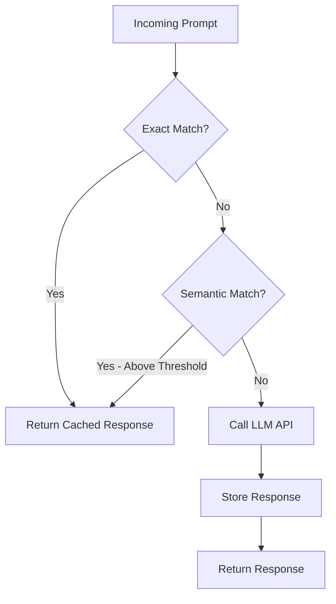

# How to Implement Prompt Caching

Author: [nawazdhandala](https://www.github.com/nawazdhandala)

Tags: LLM, Caching, AI, Performance, Cost Optimization

Description: Implement prompt caching strategies for LLM applications to reduce latency, cut costs, and improve response times with semantic similarity.

---

> Every time you send the same prompt to an LLM, you pay twice: once in latency and once in API costs. Prompt caching solves both problems by storing and reusing responses intelligently. This guide walks through practical implementations that can cut your LLM costs by 50-90% while dramatically improving response times.

The economics of LLM APIs make caching essential for production applications. A single GPT-4 request can cost $0.03-0.06 for input tokens alone. When you have thousands of users asking similar questions, those costs add up fast. More importantly, cached responses return in milliseconds instead of seconds.

---

## Understanding Prompt Caching

Prompt caching stores LLM responses and serves them for identical or semantically similar requests. Unlike traditional caching where exact matches are straightforward, LLM caching requires handling variations in how users phrase the same question.

There are three main approaches:

1. **Exact Match Caching** - Hash the prompt, store the response
2. **Semantic Caching** - Use embeddings to find similar prompts
3. **Prefix Caching** - Cache shared prompt prefixes (system prompts)



---

## Basic Exact Match Cache

The simplest approach hashes the prompt and stores the response. This works well for applications where users ask identical questions, such as FAQ bots or documentation assistants.

```python
# exact_cache.py
# Simple exact-match prompt cache using Redis
import hashlib
import json
import redis
from typing import Optional
from openai import OpenAI

class ExactMatchCache:
    """
    Cache LLM responses based on exact prompt matches.
    Uses SHA-256 hashing for consistent cache keys.
    """

    def __init__(self, redis_url: str = "redis://localhost:6379"):
        # Initialize Redis connection for persistent caching
        self.redis = redis.from_url(redis_url)
        self.client = OpenAI()
        # Default TTL of 24 hours - adjust based on content freshness needs
        self.default_ttl = 86400

    def _hash_prompt(self, prompt: str, model: str) -> str:
        """
        Create a unique cache key from prompt and model.
        Including the model ensures different models don't share cached responses.
        """
        content = f"{model}:{prompt}"
        return hashlib.sha256(content.encode()).hexdigest()

    def get(self, prompt: str, model: str) -> Optional[str]:
        """
        Retrieve a cached response if it exists.
        Returns None on cache miss.
        """
        cache_key = self._hash_prompt(prompt, model)
        cached = self.redis.get(cache_key)

        if cached:
            # Track cache hits for monitoring
            self.redis.incr("cache:hits")
            return json.loads(cached)["response"]

        self.redis.incr("cache:misses")
        return None

    def set(self, prompt: str, model: str, response: str, ttl: int = None):
        """
        Store a response in the cache.
        TTL controls how long the response remains valid.
        """
        cache_key = self._hash_prompt(prompt, model)
        data = {
            "prompt": prompt,
            "model": model,
            "response": response
        }
        # Use provided TTL or fall back to default
        self.redis.setex(cache_key, ttl or self.default_ttl, json.dumps(data))

    def query(self, prompt: str, model: str = "gpt-4") -> str:
        """
        Query with automatic caching.
        Checks cache first, calls API on miss, then stores result.
        """
        # Check cache before making expensive API call
        cached = self.get(prompt, model)
        if cached:
            return cached

        # Cache miss - call the LLM API
        response = self.client.chat.completions.create(
            model=model,
            messages=[{"role": "user", "content": prompt}]
        )

        result = response.choices[0].message.content

        # Store for future requests
        self.set(prompt, model, result)

        return result


# Usage example
cache = ExactMatchCache()

# First call hits the API
response = cache.query("What is the capital of France?")

# Second identical call returns cached response instantly
response = cache.query("What is the capital of France?")
```

---

## Semantic Caching with Embeddings

Exact match caching misses opportunities when users phrase the same question differently. Semantic caching uses vector embeddings to find similar prompts, dramatically improving cache hit rates.

```python
# semantic_cache.py
# Semantic prompt cache using embeddings for similarity matching
import numpy as np
import json
import redis
from typing import Optional, Tuple
from openai import OpenAI

class SemanticCache:
    """
    Cache that finds similar prompts using vector embeddings.
    Returns cached responses for semantically equivalent questions.
    """

    def __init__(
        self,
        redis_url: str = "redis://localhost:6379",
        similarity_threshold: float = 0.92
    ):
        self.redis = redis.from_url(redis_url)
        self.client = OpenAI()
        # Threshold controls how similar prompts must be to match
        # 0.92 works well for most use cases - tune based on your data
        self.similarity_threshold = similarity_threshold
        self.embedding_model = "text-embedding-3-small"
        # Redis key prefix for storing embeddings
        self.embedding_key = "embeddings"

    def _get_embedding(self, text: str) -> list[float]:
        """
        Generate embedding vector for a text string.
        Uses OpenAI's embedding model for semantic representation.
        """
        response = self.client.embeddings.create(
            model=self.embedding_model,
            input=text
        )
        return response.data[0].embedding

    def _cosine_similarity(self, vec1: list, vec2: list) -> float:
        """
        Calculate cosine similarity between two vectors.
        Returns value between -1 and 1, where 1 means identical.
        """
        a = np.array(vec1)
        b = np.array(vec2)
        return np.dot(a, b) / (np.linalg.norm(a) * np.linalg.norm(b))

    def _find_similar(self, embedding: list) -> Optional[Tuple[str, float]]:
        """
        Search cache for semantically similar prompts.
        Returns the cached response and similarity score if found.
        """
        # Get all cached embeddings
        cached_keys = self.redis.keys(f"{self.embedding_key}:*")

        best_match = None
        best_similarity = 0.0

        for key in cached_keys:
            cached_data = json.loads(self.redis.get(key))
            cached_embedding = cached_data["embedding"]

            similarity = self._cosine_similarity(embedding, cached_embedding)

            # Track the best match above threshold
            if similarity > best_similarity and similarity >= self.similarity_threshold:
                best_similarity = similarity
                best_match = cached_data["response"]

        if best_match:
            return best_match, best_similarity
        return None

    def query(self, prompt: str, model: str = "gpt-4") -> dict:
        """
        Query with semantic caching.
        Returns response along with cache status and similarity score.
        """
        # Generate embedding for the incoming prompt
        embedding = self._get_embedding(prompt)

        # Search for semantically similar cached prompts
        similar = self._find_similar(embedding)

        if similar:
            response, similarity = similar
            return {
                "response": response,
                "cached": True,
                "similarity": similarity
            }

        # No similar prompt found - call the API
        llm_response = self.client.chat.completions.create(
            model=model,
            messages=[{"role": "user", "content": prompt}]
        )

        result = llm_response.choices[0].message.content

        # Store prompt embedding and response for future matches
        cache_key = f"{self.embedding_key}:{hash(prompt)}"
        self.redis.setex(
            cache_key,
            86400,  # 24 hour TTL
            json.dumps({
                "prompt": prompt,
                "embedding": embedding,
                "response": result
            })
        )

        return {
            "response": result,
            "cached": False,
            "similarity": 1.0
        }


# Usage - these similar questions will hit the same cache entry
cache = SemanticCache(similarity_threshold=0.90)

# First query caches the response
result1 = cache.query("What is the capital of France?")

# These variations will match semantically
result2 = cache.query("What city is the capital of France?")
result3 = cache.query("Tell me France's capital city")
```

---

## Vector Database for Production Scale

For production applications with millions of cached prompts, linear search through embeddings becomes too slow. Vector databases like Pinecone, Weaviate, or pgvector provide efficient similarity search.

```python
# vector_cache.py
# Production-grade semantic cache using pgvector for fast similarity search
import psycopg2
from pgvector.psycopg2 import register_vector
from openai import OpenAI
from typing import Optional
import numpy as np

class VectorCache:
    """
    High-performance semantic cache using PostgreSQL with pgvector.
    Scales to millions of cached prompts with sub-millisecond lookups.
    """

    def __init__(self, database_url: str, similarity_threshold: float = 0.92):
        self.conn = psycopg2.connect(database_url)
        self.client = OpenAI()
        self.similarity_threshold = similarity_threshold

        # Register pgvector extension
        register_vector(self.conn)

        # Create table if it doesn't exist
        self._init_schema()

    def _init_schema(self):
        """
        Initialize the database schema with vector column.
        Uses cosine distance index for fast similarity search.
        """
        with self.conn.cursor() as cur:
            # Enable pgvector extension
            cur.execute("CREATE EXTENSION IF NOT EXISTS vector")

            # Create cache table with embedding column
            cur.execute("""
                CREATE TABLE IF NOT EXISTS prompt_cache (
                    id SERIAL PRIMARY KEY,
                    prompt TEXT NOT NULL,
                    prompt_hash TEXT UNIQUE NOT NULL,
                    embedding vector(1536),
                    response TEXT NOT NULL,
                    model TEXT NOT NULL,
                    created_at TIMESTAMP DEFAULT CURRENT_TIMESTAMP,
                    hit_count INTEGER DEFAULT 0
                )
            """)

            # Create index for fast cosine similarity search
            # IVFFlat index with 100 lists works well for millions of vectors
            cur.execute("""
                CREATE INDEX IF NOT EXISTS prompt_cache_embedding_idx
                ON prompt_cache
                USING ivfflat (embedding vector_cosine_ops)
                WITH (lists = 100)
            """)

            self.conn.commit()

    def _get_embedding(self, text: str) -> list[float]:
        """Generate embedding for semantic matching."""
        response = self.client.embeddings.create(
            model="text-embedding-3-small",
            input=text
        )
        return response.data[0].embedding

    def query(self, prompt: str, model: str = "gpt-4") -> dict:
        """
        Query with vector similarity search.
        Uses pgvector's native cosine distance operator for fast matching.
        """
        embedding = self._get_embedding(prompt)

        with self.conn.cursor() as cur:
            # Search for similar prompts using cosine distance
            # The <=> operator computes cosine distance (1 - similarity)
            cur.execute("""
                SELECT
                    response,
                    1 - (embedding <=> %s::vector) as similarity,
                    id
                FROM prompt_cache
                WHERE model = %s
                AND 1 - (embedding <=> %s::vector) >= %s
                ORDER BY embedding <=> %s::vector
                LIMIT 1
            """, (embedding, model, embedding, self.similarity_threshold, embedding))

            result = cur.fetchone()

            if result:
                response, similarity, cache_id = result

                # Increment hit counter for analytics
                cur.execute(
                    "UPDATE prompt_cache SET hit_count = hit_count + 1 WHERE id = %s",
                    (cache_id,)
                )
                self.conn.commit()

                return {
                    "response": response,
                    "cached": True,
                    "similarity": float(similarity)
                }

        # Cache miss - call LLM and store result
        llm_response = self.client.chat.completions.create(
            model=model,
            messages=[{"role": "user", "content": prompt}]
        )

        result = llm_response.choices[0].message.content

        # Store new entry
        with self.conn.cursor() as cur:
            cur.execute("""
                INSERT INTO prompt_cache (prompt, prompt_hash, embedding, response, model)
                VALUES (%s, %s, %s::vector, %s, %s)
                ON CONFLICT (prompt_hash) DO NOTHING
            """, (prompt, hash(prompt), embedding, result, model))
            self.conn.commit()

        return {
            "response": result,
            "cached": False,
            "similarity": 1.0
        }
```

---

## Prefix Caching for System Prompts

Many LLM applications use lengthy system prompts that remain constant across requests. Prefix caching stores the processed state of these prompts, reducing both latency and costs. Some providers like Anthropic offer this natively.

```python
# prefix_cache.py
# Optimize repeated system prompts with prefix caching
from anthropic import Anthropic
from typing import Optional
import hashlib

class PrefixCache:
    """
    Cache system prompt prefixes to reduce costs and latency.
    Particularly effective for long system prompts used across many requests.
    """

    def __init__(self):
        self.client = Anthropic()
        # Store mapping of system prompt hashes to cache tokens
        self.prefix_cache = {}

    def _hash_content(self, content: str) -> str:
        """Generate hash for system prompt identification."""
        return hashlib.sha256(content.encode()).hexdigest()[:16]

    def query_with_cached_prefix(
        self,
        system_prompt: str,
        user_message: str,
        model: str = "claude-sonnet-4-20250514"
    ) -> str:
        """
        Query with prefix caching enabled.
        The system prompt is cached and reused across requests.
        """
        # Mark the system prompt for caching with cache_control
        # This tells the API to cache the processed prefix
        response = self.client.messages.create(
            model=model,
            max_tokens=1024,
            system=[
                {
                    "type": "text",
                    "text": system_prompt,
                    # Enable caching for this content block
                    "cache_control": {"type": "ephemeral"}
                }
            ],
            messages=[
                {"role": "user", "content": user_message}
            ]
        )

        return response.content[0].text


# Example: Caching a long system prompt for a coding assistant
cache = PrefixCache()

# This lengthy system prompt will be cached after the first call
CODING_SYSTEM_PROMPT = """
You are an expert software engineer assistant. You help with:
- Code review and optimization
- Debugging and troubleshooting
- Architecture design
- Best practices and patterns
... (imagine 2000+ tokens of detailed instructions)
"""

# First call processes the full system prompt
response1 = cache.query_with_cached_prefix(
    CODING_SYSTEM_PROMPT,
    "Review this Python function for performance issues"
)

# Subsequent calls reuse the cached prefix - faster and cheaper
response2 = cache.query_with_cached_prefix(
    CODING_SYSTEM_PROMPT,
    "How do I implement a binary search tree?"
)
```

---

## Cache Invalidation Strategies

Knowing when to invalidate cached responses is crucial. Stale responses can provide outdated information, while aggressive invalidation reduces cache effectiveness.

```python
# invalidation.py
# Smart cache invalidation strategies
import time
from typing import Optional, Callable
from dataclasses import dataclass

@dataclass
class CacheEntry:
    """Cache entry with metadata for invalidation decisions."""
    response: str
    created_at: float
    prompt_hash: str
    version: str  # Track model or content version
    hit_count: int = 0

class SmartCache:
    """
    Cache with multiple invalidation strategies.
    Combines TTL, version-based, and confidence-based invalidation.
    """

    def __init__(
        self,
        default_ttl: int = 86400,
        version: str = "1.0"
    ):
        self.cache = {}
        self.default_ttl = default_ttl
        self.version = version

    def get(
        self,
        key: str,
        ttl: Optional[int] = None,
        validator: Optional[Callable[[str], bool]] = None
    ) -> Optional[str]:
        """
        Get cached value with validation.

        Args:
            key: Cache key
            ttl: Override default TTL for this lookup
            validator: Custom function to validate cached content
        """
        if key not in self.cache:
            return None

        entry = self.cache[key]
        effective_ttl = ttl or self.default_ttl

        # Check TTL expiration
        if time.time() - entry.created_at > effective_ttl:
            del self.cache[key]
            return None

        # Check version - invalidate if model or system changed
        if entry.version != self.version:
            del self.cache[key]
            return None

        # Run custom validator if provided
        if validator and not validator(entry.response):
            del self.cache[key]
            return None

        entry.hit_count += 1
        return entry.response

    def set(self, key: str, response: str):
        """Store response with current timestamp and version."""
        self.cache[key] = CacheEntry(
            response=response,
            created_at=time.time(),
            prompt_hash=key,
            version=self.version
        )

    def invalidate_by_pattern(self, pattern: str):
        """Remove all entries matching a pattern."""
        keys_to_remove = [k for k in self.cache if pattern in k]
        for key in keys_to_remove:
            del self.cache[key]

    def bump_version(self, new_version: str):
        """
        Update version to invalidate all old entries.
        Useful when updating system prompts or switching models.
        """
        self.version = new_version


# Example: Invalidate when model changes
cache = SmartCache(version="gpt-4-0125")

# Later, when upgrading to a new model version
cache.bump_version("gpt-4-0513")
# All old cached responses will be invalidated on next access
```

---

## Monitoring Cache Performance

Track cache hit rates, latency improvements, and cost savings to validate your caching strategy.

```python
# monitoring.py
# Cache performance metrics
import time
from dataclasses import dataclass, field
from typing import Dict

@dataclass
class CacheMetrics:
    """Track cache performance for optimization."""
    hits: int = 0
    misses: int = 0
    total_latency_saved_ms: float = 0
    total_cost_saved: float = 0
    latencies: Dict[str, list] = field(default_factory=dict)

    @property
    def hit_rate(self) -> float:
        """Calculate cache hit rate percentage."""
        total = self.hits + self.misses
        return (self.hits / total * 100) if total > 0 else 0

    def record_hit(self, latency_saved_ms: float, cost_saved: float):
        """Record a cache hit with savings."""
        self.hits += 1
        self.total_latency_saved_ms += latency_saved_ms
        self.total_cost_saved += cost_saved

    def record_miss(self):
        """Record a cache miss."""
        self.misses += 1

    def summary(self) -> dict:
        """Generate performance summary."""
        return {
            "hit_rate": f"{self.hit_rate:.1f}%",
            "total_hits": self.hits,
            "total_misses": self.misses,
            "latency_saved_seconds": self.total_latency_saved_ms / 1000,
            "cost_saved_usd": f"${self.total_cost_saved:.2f}"
        }


# Usage with caching layer
metrics = CacheMetrics()

# On cache hit
metrics.record_hit(
    latency_saved_ms=1500,  # Typical API call takes 1-2 seconds
    cost_saved=0.03  # Cost per request
)

# On cache miss
metrics.record_miss()

print(metrics.summary())
# {'hit_rate': '50.0%', 'total_hits': 1, 'total_misses': 1, ...}
```

---

## Best Practices Summary

1. **Start with exact match caching** - It handles a surprising number of cases and has zero false positives

2. **Tune similarity thresholds carefully** - Too low causes false matches, too high misses valid cache hits. Start at 0.92 and adjust based on your data

3. **Use TTL based on content type** - Factual content can cache longer than time-sensitive information

4. **Monitor hit rates** - Target 60-80% hit rate for most applications. Lower suggests threshold issues, higher might indicate overly aggressive caching

5. **Consider response quality** - Cache high-quality responses and potentially re-query for better answers if quality degrades

6. **Separate caches by model** - Different models produce different outputs for the same prompts

7. **Plan for invalidation** - Version your cache entries so you can invalidate when prompts or models change

---

*Looking to monitor your LLM applications in production? [OneUptime](https://oneuptime.com) provides comprehensive observability for AI workloads, including latency tracking, error monitoring, and cost analysis with native OpenTelemetry support.*

**Related Reading:**
- [How to Build AI Agent Architecture](https://oneuptime.com/blog/post/2026-01-30-ai-agent-architecture/view)
- [Monitoring LLM Applications with OpenLit and OneUptime](https://oneuptime.com/blog/post/2024-09-13-monitoring-llm-with-openlit-and-oneuptime/view)
