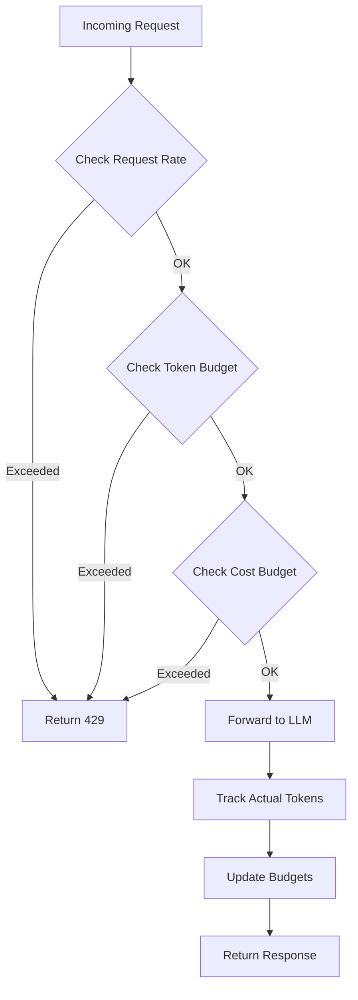

# How to Implement LLM Rate Limiting

Author: [nawazdhandala](https://github.com/nawazdhandala)

Tags: LLM, API, Rate Limiting, AI, OpenAI, Performance

Description: Learn to implement effective rate limiting for LLM APIs to control costs, prevent abuse, and ensure fair usage across your AI-powered applications.

---

Large Language Models are expensive. A single runaway script or malicious user can burn through thousands of dollars in API credits within hours. Rate limiting for LLM APIs requires different strategies than traditional web APIs because you're dealing with token-based pricing, variable request costs, and longer response times.

This guide covers practical implementations for rate limiting LLM APIs in production.

## Why LLM Rate Limiting Is Different

| Traditional API | LLM API |
|-----------------|---------|
| Fixed cost per request | Variable cost based on tokens |
| Fast responses (ms) | Slow responses (seconds) |
| Predictable resource usage | Unpredictable context windows |
| Simple request counting | Token counting required |
| Uniform rate limits | Per-model rate limits |

## Rate Limiting Strategies for LLMs



## Token-Based Rate Limiter

Unlike traditional rate limiters that count requests, LLM rate limiters need to track tokens. Here's a token-aware implementation.

```python
# token_rate_limiter.py
import time
from collections import defaultdict
from dataclasses import dataclass, field
from typing import Dict, Optional
import tiktoken

@dataclass
class TokenBucket:
    """Tracks token usage for a single user/key"""
    tokens_used: int = 0
    requests_made: int = 0
    window_start: float = field(default_factory=time.time)

@dataclass
class TokenUsageResult:
    """Result of a rate limit check"""
    allowed: bool
    tokens_remaining: int
    requests_remaining: int
    retry_after: Optional[float] = None
    reason: Optional[str] = None

class LLMRateLimiter:
    """
    Rate limiter designed for LLM APIs.
    Tracks both request count and token usage.
    """

    def __init__(
        self,
        tokens_per_minute: int = 100000,
        requests_per_minute: int = 100,
        model: str = "gpt-4"
    ):
        self.tokens_per_minute = tokens_per_minute
        self.requests_per_minute = requests_per_minute
        self.window_seconds = 60
        self.buckets: Dict[str, TokenBucket] = defaultdict(TokenBucket)

        # Initialize tokenizer for accurate counting
        try:
            self.encoding = tiktoken.encoding_for_model(model)
        except KeyError:
            self.encoding = tiktoken.get_encoding("cl100k_base")

    def count_tokens(self, text: str) -> int:
        """Count tokens in a string using the model's tokenizer"""
        return len(self.encoding.encode(text))

    def estimate_request_tokens(
        self,
        messages: list,
        max_tokens: int = 1000
    ) -> int:
        """
        Estimate total tokens for a request.
        Includes input tokens and expected output tokens.
        """
        input_tokens = 0

        for message in messages:
            # Count message content
            input_tokens += self.count_tokens(message.get("content", ""))
            # Add overhead for message structure
            input_tokens += 4  # role, content markers

        # Add base overhead
        input_tokens += 3  # assistant reply priming

        # Total estimate includes max possible output
        return input_tokens + max_tokens

    def _get_bucket(self, key: str) -> TokenBucket:
        """Get or reset bucket for a key"""
        bucket = self.buckets[key]
        now = time.time()

        # Reset if window has passed
        if now - bucket.window_start >= self.window_seconds:
            bucket.tokens_used = 0
            bucket.requests_made = 0
            bucket.window_start = now

        return bucket

    def check_limit(
        self,
        key: str,
        estimated_tokens: int
    ) -> TokenUsageResult:
        """
        Check if a request should be allowed.
        Call this BEFORE making the LLM API call.
        """
        bucket = self._get_bucket(key)

        tokens_remaining = self.tokens_per_minute - bucket.tokens_used
        requests_remaining = self.requests_per_minute - bucket.requests_made

        # Check request limit
        if bucket.requests_made >= self.requests_per_minute:
            retry_after = self.window_seconds - (time.time() - bucket.window_start)
            return TokenUsageResult(
                allowed=False,
                tokens_remaining=tokens_remaining,
                requests_remaining=0,
                retry_after=retry_after,
                reason="Request rate limit exceeded"
            )

        # Check token limit
        if bucket.tokens_used + estimated_tokens > self.tokens_per_minute:
            retry_after = self.window_seconds - (time.time() - bucket.window_start)
            return TokenUsageResult(
                allowed=False,
                tokens_remaining=tokens_remaining,
                requests_remaining=requests_remaining,
                retry_after=retry_after,
                reason="Token rate limit exceeded"
            )

        return TokenUsageResult(
            allowed=True,
            tokens_remaining=tokens_remaining - estimated_tokens,
            requests_remaining=requests_remaining - 1
        )

    def record_usage(
        self,
        key: str,
        prompt_tokens: int,
        completion_tokens: int
    ) -> None:
        """
        Record actual token usage after LLM response.
        Call this AFTER receiving the response.
        """
        bucket = self._get_bucket(key)
        bucket.tokens_used += prompt_tokens + completion_tokens
        bucket.requests_made += 1
```

## Cost-Based Rate Limiter

When you need to enforce spending limits rather than just token counts, use a cost-based limiter.

```python
# cost_rate_limiter.py
import time
from dataclasses import dataclass, field
from typing import Dict, Optional
from enum import Enum

class LLMModel(Enum):
    """LLM models with their pricing (per 1K tokens)"""
    GPT4_TURBO = ("gpt-4-turbo", 0.01, 0.03)
    GPT4 = ("gpt-4", 0.03, 0.06)
    GPT35_TURBO = ("gpt-3.5-turbo", 0.0005, 0.0015)
    CLAUDE_3_OPUS = ("claude-3-opus", 0.015, 0.075)
    CLAUDE_3_SONNET = ("claude-3-sonnet", 0.003, 0.015)
    CLAUDE_3_HAIKU = ("claude-3-haiku", 0.00025, 0.00125)

    def __init__(self, model_id: str, input_price: float, output_price: float):
        self.model_id = model_id
        self.input_price = input_price    # per 1K tokens
        self.output_price = output_price  # per 1K tokens

@dataclass
class CostBucket:
    """Tracks cost usage for a user"""
    total_cost: float = 0.0
    daily_cost: float = 0.0
    monthly_cost: float = 0.0
    day_start: float = field(default_factory=time.time)
    month_start: float = field(default_factory=time.time)

@dataclass
class CostCheckResult:
    """Result of a cost limit check"""
    allowed: bool
    daily_remaining: float
    monthly_remaining: float
    estimated_cost: float
    reason: Optional[str] = None

class CostBasedRateLimiter:
    """
    Rate limiter based on spending limits.
    Useful for controlling API costs per user or organization.
    """

    def __init__(
        self,
        daily_limit_usd: float = 10.0,
        monthly_limit_usd: float = 100.0
    ):
        self.daily_limit = daily_limit_usd
        self.monthly_limit = monthly_limit_usd
        self.buckets: Dict[str, CostBucket] = {}

    def _get_bucket(self, key: str) -> CostBucket:
        """Get or initialize bucket, resetting periods as needed"""
        now = time.time()

        if key not in self.buckets:
            self.buckets[key] = CostBucket(day_start=now, month_start=now)

        bucket = self.buckets[key]

        # Reset daily counter (86400 seconds = 1 day)
        if now - bucket.day_start >= 86400:
            bucket.daily_cost = 0.0
            bucket.day_start = now

        # Reset monthly counter (2592000 seconds = 30 days)
        if now - bucket.month_start >= 2592000:
            bucket.monthly_cost = 0.0
            bucket.month_start = now

        return bucket

    def estimate_cost(
        self,
        model: LLMModel,
        input_tokens: int,
        max_output_tokens: int
    ) -> float:
        """Estimate the maximum cost of a request"""
        input_cost = (input_tokens / 1000) * model.input_price
        output_cost = (max_output_tokens / 1000) * model.output_price
        return input_cost + output_cost

    def check_limit(
        self,
        key: str,
        model: LLMModel,
        input_tokens: int,
        max_output_tokens: int
    ) -> CostCheckResult:
        """Check if request is within cost limits"""
        bucket = self._get_bucket(key)
        estimated_cost = self.estimate_cost(model, input_tokens, max_output_tokens)

        daily_remaining = self.daily_limit - bucket.daily_cost
        monthly_remaining = self.monthly_limit - bucket.monthly_cost

        # Check daily limit
        if bucket.daily_cost + estimated_cost > self.daily_limit:
            return CostCheckResult(
                allowed=False,
                daily_remaining=daily_remaining,
                monthly_remaining=monthly_remaining,
                estimated_cost=estimated_cost,
                reason=f"Daily spending limit (${self.daily_limit}) exceeded"
            )

        # Check monthly limit
        if bucket.monthly_cost + estimated_cost > self.monthly_limit:
            return CostCheckResult(
                allowed=False,
                daily_remaining=daily_remaining,
                monthly_remaining=monthly_remaining,
                estimated_cost=estimated_cost,
                reason=f"Monthly spending limit (${self.monthly_limit}) exceeded"
            )

        return CostCheckResult(
            allowed=True,
            daily_remaining=daily_remaining - estimated_cost,
            monthly_remaining=monthly_remaining - estimated_cost,
            estimated_cost=estimated_cost
        )

    def record_cost(
        self,
        key: str,
        model: LLMModel,
        input_tokens: int,
        output_tokens: int
    ) -> float:
        """Record actual cost after receiving response"""
        bucket = self._get_bucket(key)

        actual_cost = (
            (input_tokens / 1000) * model.input_price +
            (output_tokens / 1000) * model.output_price
        )

        bucket.daily_cost += actual_cost
        bucket.monthly_cost += actual_cost
        bucket.total_cost += actual_cost

        return actual_cost
```

## Tiered Rate Limiting for LLM APIs

Different users often need different limits based on their subscription tier.

```mermaid
flowchart LR
    subgraph Free Tier
        F1[10K tokens/day]
        F2[GPT-3.5 only]
        F3[100 req/hour]
    end

    subgraph Pro Tier
        P1[100K tokens/day]
        P2[GPT-4 access]
        P3[1000 req/hour]
    end

    subgraph Enterprise
        E1[Unlimited tokens]
        E2[All models]
        E3[Custom limits]
    end

    User --> Auth{Auth Check}
    Auth --> Free Tier
    Auth --> Pro Tier
    Auth --> Enterprise
```

Here's the implementation for tiered rate limiting.

```python
# tiered_llm_limiter.py
from dataclasses import dataclass
from typing import Dict, List, Optional, Set
from enum import Enum
import time

class UserTier(Enum):
    FREE = "free"
    PRO = "pro"
    ENTERPRISE = "enterprise"

@dataclass
class TierConfig:
    """Configuration for a subscription tier"""
    tokens_per_day: int
    tokens_per_minute: int
    requests_per_hour: int
    allowed_models: Set[str]
    max_context_length: int
    priority: int  # Higher = more priority in queues

# Define tier configurations
TIER_CONFIGS: Dict[UserTier, TierConfig] = {
    UserTier.FREE: TierConfig(
        tokens_per_day=10000,
        tokens_per_minute=1000,
        requests_per_hour=100,
        allowed_models={"gpt-3.5-turbo"},
        max_context_length=4096,
        priority=1
    ),
    UserTier.PRO: TierConfig(
        tokens_per_day=100000,
        tokens_per_minute=10000,
        requests_per_hour=1000,
        allowed_models={"gpt-3.5-turbo", "gpt-4", "gpt-4-turbo"},
        max_context_length=8192,
        priority=5
    ),
    UserTier.ENTERPRISE: TierConfig(
        tokens_per_day=1000000,
        tokens_per_minute=100000,
        requests_per_hour=10000,
        allowed_models={"gpt-3.5-turbo", "gpt-4", "gpt-4-turbo", "gpt-4-32k"},
        max_context_length=32768,
        priority=10
    )
}

@dataclass
class UserUsage:
    """Tracks usage for a user"""
    tokens_today: int = 0
    tokens_this_minute: int = 0
    requests_this_hour: int = 0
    day_start: float = 0
    minute_start: float = 0
    hour_start: float = 0

@dataclass
class LimitCheckResult:
    """Result of limit check with detailed info"""
    allowed: bool
    reason: Optional[str] = None
    tokens_remaining_today: int = 0
    tokens_remaining_minute: int = 0
    requests_remaining_hour: int = 0
    retry_after: Optional[float] = None

class TieredLLMRateLimiter:
    """
    Multi-tier rate limiter for LLM APIs.
    Supports different limits per subscription tier.
    """

    def __init__(self):
        self.usage: Dict[str, UserUsage] = {}
        self.user_tiers: Dict[str, UserTier] = {}

    def set_user_tier(self, user_id: str, tier: UserTier) -> None:
        """Set the tier for a user"""
        self.user_tiers[user_id] = tier

    def get_tier(self, user_id: str) -> UserTier:
        """Get user's tier, default to FREE"""
        return self.user_tiers.get(user_id, UserTier.FREE)

    def _get_usage(self, user_id: str) -> UserUsage:
        """Get or initialize usage tracking for a user"""
        now = time.time()

        if user_id not in self.usage:
            self.usage[user_id] = UserUsage(
                day_start=now,
                minute_start=now,
                hour_start=now
            )

        usage = self.usage[user_id]

        # Reset daily counter
        if now - usage.day_start >= 86400:
            usage.tokens_today = 0
            usage.day_start = now

        # Reset minute counter
        if now - usage.minute_start >= 60:
            usage.tokens_this_minute = 0
            usage.minute_start = now

        # Reset hourly counter
        if now - usage.hour_start >= 3600:
            usage.requests_this_hour = 0
            usage.hour_start = now

        return usage

    def check_limit(
        self,
        user_id: str,
        model: str,
        estimated_tokens: int
    ) -> LimitCheckResult:
        """Check if request is within user's tier limits"""
        tier = self.get_tier(user_id)
        config = TIER_CONFIGS[tier]
        usage = self._get_usage(user_id)
        now = time.time()

        # Check if model is allowed
        if model not in config.allowed_models:
            return LimitCheckResult(
                allowed=False,
                reason=f"Model '{model}' not available on {tier.value} tier"
            )

        # Check request rate
        if usage.requests_this_hour >= config.requests_per_hour:
            retry_after = 3600 - (now - usage.hour_start)
            return LimitCheckResult(
                allowed=False,
                reason="Hourly request limit exceeded",
                retry_after=retry_after
            )

        # Check minute token limit
        if usage.tokens_this_minute + estimated_tokens > config.tokens_per_minute:
            retry_after = 60 - (now - usage.minute_start)
            return LimitCheckResult(
                allowed=False,
                reason="Per-minute token limit exceeded",
                retry_after=retry_after
            )

        # Check daily token limit
        if usage.tokens_today + estimated_tokens > config.tokens_per_day:
            retry_after = 86400 - (now - usage.day_start)
            return LimitCheckResult(
                allowed=False,
                reason="Daily token limit exceeded",
                retry_after=retry_after
            )

        return LimitCheckResult(
            allowed=True,
            tokens_remaining_today=config.tokens_per_day - usage.tokens_today - estimated_tokens,
            tokens_remaining_minute=config.tokens_per_minute - usage.tokens_this_minute - estimated_tokens,
            requests_remaining_hour=config.requests_per_hour - usage.requests_this_hour - 1
        )

    def record_usage(
        self,
        user_id: str,
        tokens_used: int
    ) -> None:
        """Record actual token usage"""
        usage = self._get_usage(user_id)
        usage.tokens_today += tokens_used
        usage.tokens_this_minute += tokens_used
        usage.requests_this_hour += 1
```

## FastAPI Integration

Here's a complete FastAPI integration that combines token and cost limiting.

```python
# fastapi_llm_limiter.py
from fastapi import FastAPI, Request, HTTPException, Depends
from fastapi.responses import JSONResponse
from pydantic import BaseModel
from typing import List, Optional
import openai
import time

app = FastAPI()

# Initialize limiters
token_limiter = LLMRateLimiter(
    tokens_per_minute=100000,
    requests_per_minute=100,
    model="gpt-4"
)

cost_limiter = CostBasedRateLimiter(
    daily_limit_usd=50.0,
    monthly_limit_usd=500.0
)

tiered_limiter = TieredLLMRateLimiter()

class ChatMessage(BaseModel):
    role: str
    content: str

class ChatRequest(BaseModel):
    messages: List[ChatMessage]
    model: str = "gpt-4"
    max_tokens: int = 1000
    user_id: Optional[str] = None

class ChatResponse(BaseModel):
    content: str
    usage: dict
    rate_limit_info: dict

def get_user_id(request: Request) -> str:
    """Extract user ID from request (API key, JWT, etc.)"""
    # In production, extract from auth header
    api_key = request.headers.get("X-API-Key", "anonymous")
    return api_key

@app.post("/v1/chat/completions", response_model=ChatResponse)
async def chat_completion(
    chat_request: ChatRequest,
    request: Request,
    user_id: str = Depends(get_user_id)
):
    """
    LLM chat endpoint with comprehensive rate limiting.
    """
    # Estimate tokens for this request
    messages_text = [m.dict() for m in chat_request.messages]
    estimated_tokens = token_limiter.estimate_request_tokens(
        messages_text,
        chat_request.max_tokens
    )

    # Check token rate limit
    token_check = token_limiter.check_limit(user_id, estimated_tokens)
    if not token_check.allowed:
        raise HTTPException(
            status_code=429,
            detail={
                "error": "rate_limit_exceeded",
                "message": token_check.reason,
                "retry_after": token_check.retry_after
            },
            headers={
                "Retry-After": str(int(token_check.retry_after or 60)),
                "X-RateLimit-Remaining-Tokens": str(token_check.tokens_remaining),
                "X-RateLimit-Remaining-Requests": str(token_check.requests_remaining)
            }
        )

    # Check cost limit
    model_enum = LLMModel.GPT4 if "gpt-4" in chat_request.model else LLMModel.GPT35_TURBO
    cost_check = cost_limiter.check_limit(
        user_id,
        model_enum,
        estimated_tokens - chat_request.max_tokens,  # input tokens
        chat_request.max_tokens
    )

    if not cost_check.allowed:
        raise HTTPException(
            status_code=429,
            detail={
                "error": "spending_limit_exceeded",
                "message": cost_check.reason,
                "daily_remaining": f"${cost_check.daily_remaining:.4f}",
                "monthly_remaining": f"${cost_check.monthly_remaining:.4f}"
            }
        )

    # Check tiered limits
    tier_check = tiered_limiter.check_limit(
        user_id,
        chat_request.model,
        estimated_tokens
    )

    if not tier_check.allowed:
        raise HTTPException(
            status_code=429,
            detail={
                "error": "tier_limit_exceeded",
                "message": tier_check.reason,
                "retry_after": tier_check.retry_after
            }
        )

    # Make the actual API call
    try:
        response = openai.ChatCompletion.create(
            model=chat_request.model,
            messages=messages_text,
            max_tokens=chat_request.max_tokens
        )
    except openai.error.RateLimitError:
        # Handle upstream rate limit
        raise HTTPException(
            status_code=503,
            detail="Upstream rate limit reached. Please retry later."
        )

    # Record actual usage
    prompt_tokens = response["usage"]["prompt_tokens"]
    completion_tokens = response["usage"]["completion_tokens"]
    total_tokens = prompt_tokens + completion_tokens

    token_limiter.record_usage(user_id, prompt_tokens, completion_tokens)
    cost_limiter.record_cost(user_id, model_enum, prompt_tokens, completion_tokens)
    tiered_limiter.record_usage(user_id, total_tokens)

    return ChatResponse(
        content=response["choices"][0]["message"]["content"],
        usage={
            "prompt_tokens": prompt_tokens,
            "completion_tokens": completion_tokens,
            "total_tokens": total_tokens
        },
        rate_limit_info={
            "tokens_remaining_minute": token_check.tokens_remaining - total_tokens,
            "requests_remaining_minute": token_check.requests_remaining,
            "daily_cost_remaining": f"${cost_check.daily_remaining - cost_check.estimated_cost:.4f}"
        }
    )
```

## Request Queue with Priority

For high-traffic LLM applications, implement a priority queue to handle requests fairly.

```python
# priority_queue_limiter.py
import asyncio
import heapq
import time
from dataclasses import dataclass, field
from typing import Dict, Any, Optional, Callable, Awaitable
from enum import IntEnum

class Priority(IntEnum):
    LOW = 3
    NORMAL = 2
    HIGH = 1
    CRITICAL = 0

@dataclass(order=True)
class QueuedRequest:
    """A request waiting in the queue"""
    priority: int
    timestamp: float = field(compare=False)
    request_id: str = field(compare=False)
    callback: Callable[[], Awaitable[Any]] = field(compare=False)
    future: asyncio.Future = field(compare=False)

class LLMRequestQueue:
    """
    Priority queue for LLM requests.
    Ensures fair processing while respecting rate limits.
    """

    def __init__(
        self,
        max_concurrent: int = 10,
        requests_per_second: float = 5.0
    ):
        self.max_concurrent = max_concurrent
        self.min_interval = 1.0 / requests_per_second
        self.queue: list = []
        self.active_requests = 0
        self.last_request_time = 0
        self._lock = asyncio.Lock()
        self._processing = False

    async def submit(
        self,
        request_id: str,
        callback: Callable[[], Awaitable[Any]],
        priority: Priority = Priority.NORMAL
    ) -> Any:
        """
        Submit a request to the queue.
        Returns the result when the request is processed.
        """
        future = asyncio.Future()

        queued = QueuedRequest(
            priority=priority.value,
            timestamp=time.time(),
            request_id=request_id,
            callback=callback,
            future=future
        )

        async with self._lock:
            heapq.heappush(self.queue, queued)

        # Start processing if not already running
        if not self._processing:
            asyncio.create_task(self._process_queue())

        return await future

    async def _process_queue(self):
        """Process queued requests respecting rate limits"""
        self._processing = True

        while True:
            async with self._lock:
                if not self.queue:
                    self._processing = False
                    return

                # Check concurrent limit
                if self.active_requests >= self.max_concurrent:
                    await asyncio.sleep(0.1)
                    continue

                # Check rate limit
                now = time.time()
                time_since_last = now - self.last_request_time
                if time_since_last < self.min_interval:
                    await asyncio.sleep(self.min_interval - time_since_last)
                    continue

                # Get next request
                request = heapq.heappop(self.queue)
                self.active_requests += 1
                self.last_request_time = time.time()

            # Process request
            asyncio.create_task(self._execute_request(request))

    async def _execute_request(self, request: QueuedRequest):
        """Execute a single request"""
        try:
            result = await request.callback()
            request.future.set_result(result)
        except Exception as e:
            request.future.set_exception(e)
        finally:
            async with self._lock:
                self.active_requests -= 1

    def get_queue_status(self) -> Dict[str, Any]:
        """Get current queue status"""
        return {
            "queued": len(self.queue),
            "active": self.active_requests,
            "max_concurrent": self.max_concurrent
        }
```

## Handling Upstream Rate Limits

LLM providers have their own rate limits. Here's how to handle them gracefully with exponential backoff.

```python
# upstream_handler.py
import asyncio
import random
from typing import Any, Callable, TypeVar
from dataclasses import dataclass

T = TypeVar('T')

@dataclass
class RetryConfig:
    """Configuration for retry behavior"""
    max_retries: int = 5
    base_delay: float = 1.0
    max_delay: float = 60.0
    exponential_base: float = 2.0
    jitter: bool = True

class UpstreamRateLimitHandler:
    """
    Handles rate limits from upstream LLM providers.
    Implements exponential backoff with jitter.
    """

    def __init__(self, config: RetryConfig = None):
        self.config = config or RetryConfig()

    def _calculate_delay(self, attempt: int) -> float:
        """Calculate delay for a given retry attempt"""
        delay = self.config.base_delay * (
            self.config.exponential_base ** attempt
        )
        delay = min(delay, self.config.max_delay)

        if self.config.jitter:
            # Add random jitter (0.5x to 1.5x)
            delay = delay * (0.5 + random.random())

        return delay

    async def execute_with_retry(
        self,
        func: Callable[[], Any],
        is_rate_limit_error: Callable[[Exception], bool]
    ) -> Any:
        """
        Execute a function with automatic retry on rate limits.

        Args:
            func: The async function to execute
            is_rate_limit_error: Function to check if an exception is a rate limit
        """
        last_exception = None

        for attempt in range(self.config.max_retries + 1):
            try:
                return await func()
            except Exception as e:
                last_exception = e

                if not is_rate_limit_error(e):
                    raise

                if attempt == self.config.max_retries:
                    raise

                delay = self._calculate_delay(attempt)
                await asyncio.sleep(delay)

        raise last_exception

# Usage with OpenAI
def is_openai_rate_limit(e: Exception) -> bool:
    """Check if exception is an OpenAI rate limit error"""
    error_type = type(e).__name__
    return error_type in ("RateLimitError", "APIError") and "rate" in str(e).lower()

# Example usage
async def call_openai_with_retry(messages: list, model: str):
    handler = UpstreamRateLimitHandler()

    async def make_request():
        # Your OpenAI call here
        return await openai.ChatCompletion.acreate(
            model=model,
            messages=messages
        )

    return await handler.execute_with_retry(
        make_request,
        is_openai_rate_limit
    )
```

## Monitoring and Observability

Track your rate limiting metrics to understand usage patterns and tune limits.

```python
# rate_limit_metrics.py
import time
from collections import defaultdict
from dataclasses import dataclass, field
from typing import Dict, List
import json

@dataclass
class RateLimitEvent:
    """A single rate limit event"""
    timestamp: float
    user_id: str
    event_type: str  # "allowed", "denied", "upstream_retry"
    tokens: int
    model: str
    reason: str = ""

class RateLimitMetrics:
    """
    Collects and reports rate limiting metrics.
    Useful for monitoring and tuning limits.
    """

    def __init__(self, retention_hours: int = 24):
        self.retention_seconds = retention_hours * 3600
        self.events: List[RateLimitEvent] = []
        self.counters: Dict[str, int] = defaultdict(int)

    def record_event(self, event: RateLimitEvent) -> None:
        """Record a rate limit event"""
        self.events.append(event)

        # Update counters
        self.counters[f"total_{event.event_type}"] += 1
        self.counters[f"user_{event.user_id}_{event.event_type}"] += 1
        self.counters[f"model_{event.model}_{event.event_type}"] += 1

        # Cleanup old events
        self._cleanup()

    def _cleanup(self) -> None:
        """Remove events older than retention period"""
        cutoff = time.time() - self.retention_seconds
        self.events = [e for e in self.events if e.timestamp > cutoff]

    def get_summary(self, window_minutes: int = 60) -> Dict:
        """Get summary metrics for recent period"""
        cutoff = time.time() - (window_minutes * 60)
        recent = [e for e in self.events if e.timestamp > cutoff]

        allowed = [e for e in recent if e.event_type == "allowed"]
        denied = [e for e in recent if e.event_type == "denied"]

        return {
            "window_minutes": window_minutes,
            "total_requests": len(recent),
            "allowed": len(allowed),
            "denied": len(denied),
            "denial_rate": len(denied) / max(len(recent), 1),
            "tokens_used": sum(e.tokens for e in allowed),
            "top_denied_users": self._get_top_users(denied, 5),
            "denial_reasons": self._count_reasons(denied)
        }

    def _get_top_users(self, events: List[RateLimitEvent], n: int) -> List[Dict]:
        """Get top N users by event count"""
        user_counts: Dict[str, int] = defaultdict(int)
        for e in events:
            user_counts[e.user_id] += 1

        sorted_users = sorted(user_counts.items(), key=lambda x: -x[1])
        return [{"user_id": u, "count": c} for u, c in sorted_users[:n]]

    def _count_reasons(self, events: List[RateLimitEvent]) -> Dict[str, int]:
        """Count denial reasons"""
        reasons: Dict[str, int] = defaultdict(int)
        for e in events:
            reasons[e.reason] += 1
        return dict(reasons)

    def export_prometheus(self) -> str:
        """Export metrics in Prometheus format"""
        lines = []

        for key, value in self.counters.items():
            metric_name = f"llm_rate_limit_{key}".replace("-", "_")
            lines.append(f"{metric_name} {value}")

        return "\n".join(lines)
```

## Best Practices

| Practice | Description |
|----------|-------------|
| **Estimate before, record after** | Check limits with estimated tokens, then record actual usage |
| **Include all token types** | Count input, output, and system prompt tokens |
| **Set multiple limit types** | Combine request, token, and cost limits |
| **Implement graceful degradation** | Fall back to smaller models when limits are reached |
| **Cache responses** | Reduce API calls by caching common queries |
| **Use queuing** | Smooth out burst traffic with request queues |
| **Monitor denial rates** | High denial rates indicate limits are too tight |
| **Provide clear feedback** | Return detailed rate limit headers to clients |

## Common Mistakes to Avoid

1. **Counting only requests, not tokens**: A single request can use 100,000 tokens
2. **Ignoring output tokens**: Completion tokens are often more expensive than input
3. **Not handling upstream limits**: LLM providers have their own limits
4. **Fixed limits for all users**: Implement tiered limits based on usage patterns
5. **No monitoring**: You can't tune what you don't measure
6. **Blocking instead of queuing**: Use queues for better user experience

## Conclusion

LLM rate limiting requires a multi-layered approach. Start with basic token rate limiting, add cost-based limits for budget control, and implement tiered limits for different user classes. Always monitor your rate limiting metrics to tune limits based on real usage patterns.

The key difference from traditional API rate limiting is the variable cost per request. A single LLM request can range from a fraction of a cent to several dollars depending on the model and context size. Your rate limiting strategy needs to account for this variability.

---

*Need to monitor your LLM API usage in production? [OneUptime](https://oneuptime.com) provides comprehensive API monitoring with custom metrics, alerting, and dashboards for tracking your AI infrastructure.*
