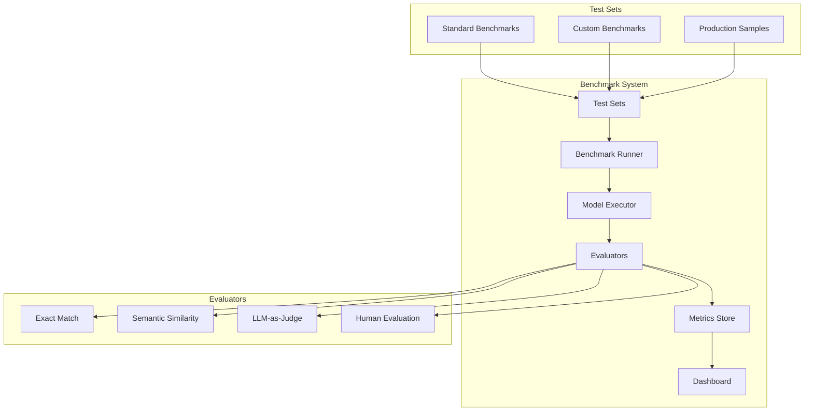
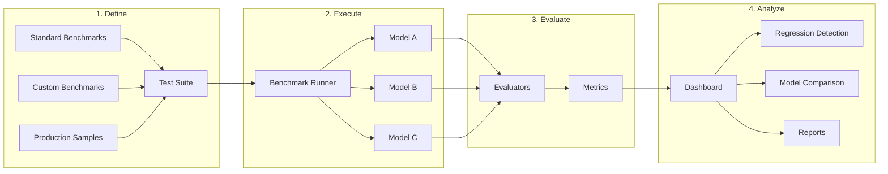

# How to Build Benchmark Testing

Author: [nawazdhandala](https://github.com/nawazdhandala)

Tags: LLMOps, Benchmarks, Testing, Evaluation

Description: Learn to build benchmark testing for comparing LLM performance across standardized test sets.

---

Benchmark testing is fundamental to LLM Operations. Without systematic evaluation, you cannot know if your model improvements actually improve real-world performance, if prompt changes degrade quality, or if a cheaper model can replace an expensive one. This guide covers building comprehensive benchmark testing systems for production LLM applications.

## Why Benchmark Testing Matters

LLM applications face unique challenges that traditional software testing does not address:

- **Non-deterministic outputs**: The same prompt can produce different responses
- **Quality is subjective**: Correctness often requires human judgment or complex evaluation
- **Cost vs performance tradeoffs**: Faster, cheaper models may be "good enough"
- **Regression detection**: Prompt changes or model updates can silently degrade quality

Benchmarks provide the quantitative foundation for making informed decisions about your LLM systems.

## Benchmark Testing Architecture



## Setting Up the Benchmark Framework

### Project Structure

```
llm-benchmarks/
├── benchmarks/
│   ├── datasets/           # Test datasets
│   ├── evaluators/         # Evaluation logic
│   ├── runners/            # Benchmark execution
│   └── reports/            # Generated reports
├── config/
│   ├── models.yaml         # Model configurations
│   └── benchmarks.yaml     # Benchmark definitions
├── results/                # Historical results
└── scripts/                # Utility scripts
```

### Core Benchmark Runner

```python
# benchmarks/runners/benchmark_runner.py
"""
Core benchmark runner for LLM evaluation.
Executes test cases against models and collects metrics.
"""

import asyncio
import json
import time
from dataclasses import dataclass, field
from datetime import datetime
from typing import Any, Callable, Dict, List, Optional
from pathlib import Path
import hashlib


@dataclass
class TestCase:
    """
    Represents a single benchmark test case.

    Attributes:
        id: Unique identifier for the test case
        input: The prompt or input to send to the model
        expected: Expected output (can be exact match, keywords, or reference)
        metadata: Additional context like category, difficulty, source
    """
    id: str
    input: str
    expected: Any
    metadata: Dict[str, Any] = field(default_factory=dict)

    def to_dict(self) -> Dict[str, Any]:
        return {
            "id": self.id,
            "input": self.input,
            "expected": self.expected,
            "metadata": self.metadata
        }


@dataclass
class TestResult:
    """
    Stores the result of running a single test case.

    Attributes:
        test_case: The original test case
        output: Model's actual output
        latency_ms: Time taken to generate response
        tokens_used: Token count for input and output
        scores: Dictionary of evaluation scores
        error: Any error that occurred during execution
    """
    test_case: TestCase
    output: str
    latency_ms: float
    tokens_used: Dict[str, int]
    scores: Dict[str, float] = field(default_factory=dict)
    error: Optional[str] = None

    @property
    def passed(self) -> bool:
        """Check if all scores meet minimum thresholds."""
        if self.error:
            return False
        # Consider passed if average score is above 0.7
        if not self.scores:
            return False
        return sum(self.scores.values()) / len(self.scores) >= 0.7


@dataclass
class BenchmarkReport:
    """
    Aggregated results from a benchmark run.
    """
    benchmark_name: str
    model_id: str
    timestamp: datetime
    results: List[TestResult]
    config: Dict[str, Any]

    @property
    def pass_rate(self) -> float:
        """Calculate percentage of passed tests."""
        if not self.results:
            return 0.0
        passed = sum(1 for r in self.results if r.passed)
        return passed / len(self.results)

    @property
    def avg_latency_ms(self) -> float:
        """Calculate average response latency."""
        if not self.results:
            return 0.0
        return sum(r.latency_ms for r in self.results) / len(self.results)

    @property
    def total_tokens(self) -> int:
        """Calculate total tokens used."""
        total = 0
        for r in self.results:
            total += r.tokens_used.get("input", 0)
            total += r.tokens_used.get("output", 0)
        return total

    def to_dict(self) -> Dict[str, Any]:
        return {
            "benchmark_name": self.benchmark_name,
            "model_id": self.model_id,
            "timestamp": self.timestamp.isoformat(),
            "summary": {
                "total_tests": len(self.results),
                "passed": sum(1 for r in self.results if r.passed),
                "pass_rate": self.pass_rate,
                "avg_latency_ms": self.avg_latency_ms,
                "total_tokens": self.total_tokens,
            },
            "results": [
                {
                    "test_id": r.test_case.id,
                    "passed": r.passed,
                    "scores": r.scores,
                    "latency_ms": r.latency_ms,
                    "error": r.error,
                }
                for r in self.results
            ],
            "config": self.config,
        }


class BenchmarkRunner:
    """
    Executes benchmark test suites against LLM models.

    Supports:
    - Multiple models and configurations
    - Concurrent test execution
    - Pluggable evaluators
    - Result persistence and comparison
    """

    def __init__(
        self,
        model_client: Any,
        evaluators: List[Callable],
        results_dir: Path = Path("results"),
        concurrency: int = 5,
    ):
        """
        Initialize the benchmark runner.

        Args:
            model_client: Client for calling the LLM API
            evaluators: List of evaluation functions
            results_dir: Directory to store benchmark results
            concurrency: Maximum concurrent API calls
        """
        self.model_client = model_client
        self.evaluators = evaluators
        self.results_dir = results_dir
        self.concurrency = concurrency
        self.semaphore = asyncio.Semaphore(concurrency)

        # Ensure results directory exists
        self.results_dir.mkdir(parents=True, exist_ok=True)

    async def run_single_test(
        self,
        test_case: TestCase,
        model_config: Dict[str, Any],
    ) -> TestResult:
        """
        Execute a single test case and evaluate the result.

        Args:
            test_case: The test case to run
            model_config: Model configuration (temperature, max_tokens, etc.)

        Returns:
            TestResult with output, metrics, and scores
        """
        async with self.semaphore:
            start_time = time.perf_counter()

            try:
                # Call the model
                response = await self.model_client.generate(
                    prompt=test_case.input,
                    **model_config
                )

                latency_ms = (time.perf_counter() - start_time) * 1000

                # Extract output and token counts
                output = response.get("text", "")
                tokens_used = {
                    "input": response.get("usage", {}).get("prompt_tokens", 0),
                    "output": response.get("usage", {}).get("completion_tokens", 0),
                }

                # Run all evaluators
                scores = {}
                for evaluator in self.evaluators:
                    eval_name = evaluator.__name__
                    try:
                        score = await evaluator(
                            input=test_case.input,
                            expected=test_case.expected,
                            actual=output,
                            metadata=test_case.metadata,
                        )
                        scores[eval_name] = score
                    except Exception as e:
                        scores[eval_name] = 0.0
                        print(f"Evaluator {eval_name} failed: {e}")

                return TestResult(
                    test_case=test_case,
                    output=output,
                    latency_ms=latency_ms,
                    tokens_used=tokens_used,
                    scores=scores,
                )

            except Exception as e:
                latency_ms = (time.perf_counter() - start_time) * 1000
                return TestResult(
                    test_case=test_case,
                    output="",
                    latency_ms=latency_ms,
                    tokens_used={"input": 0, "output": 0},
                    error=str(e),
                )

    async def run_benchmark(
        self,
        benchmark_name: str,
        test_cases: List[TestCase],
        model_id: str,
        model_config: Dict[str, Any],
    ) -> BenchmarkReport:
        """
        Run a complete benchmark suite.

        Args:
            benchmark_name: Name of the benchmark
            test_cases: List of test cases to run
            model_id: Identifier for the model being tested
            model_config: Model configuration parameters

        Returns:
            BenchmarkReport with all results and metrics
        """
        print(f"Running benchmark '{benchmark_name}' with {len(test_cases)} tests...")

        # Run all tests concurrently
        tasks = [
            self.run_single_test(tc, model_config)
            for tc in test_cases
        ]
        results = await asyncio.gather(*tasks)

        # Create report
        report = BenchmarkReport(
            benchmark_name=benchmark_name,
            model_id=model_id,
            timestamp=datetime.utcnow(),
            results=list(results),
            config=model_config,
        )

        # Save results
        self._save_report(report)

        print(f"Benchmark complete: {report.pass_rate:.1%} pass rate")
        return report

    def _save_report(self, report: BenchmarkReport) -> None:
        """Save benchmark report to disk."""
        # Create filename with timestamp and model
        filename = f"{report.benchmark_name}_{report.model_id}_{report.timestamp.strftime('%Y%m%d_%H%M%S')}.json"
        filepath = self.results_dir / filename

        with open(filepath, "w") as f:
            json.dump(report.to_dict(), f, indent=2)

        print(f"Report saved to {filepath}")
```

### Model Client Abstraction

```python
# benchmarks/runners/model_client.py
"""
Unified model client supporting multiple LLM providers.
Abstracts away provider-specific API differences.
"""

import asyncio
from abc import ABC, abstractmethod
from typing import Any, Dict, Optional
import aiohttp


class BaseModelClient(ABC):
    """Abstract base class for model clients."""

    @abstractmethod
    async def generate(
        self,
        prompt: str,
        **kwargs
    ) -> Dict[str, Any]:
        """Generate a response from the model."""
        pass


class OpenAIClient(BaseModelClient):
    """
    Client for OpenAI API (GPT-4, GPT-3.5, etc.).
    """

    def __init__(
        self,
        api_key: str,
        model: str = "gpt-4",
        base_url: str = "https://api.openai.com/v1",
    ):
        self.api_key = api_key
        self.model = model
        self.base_url = base_url

    async def generate(
        self,
        prompt: str,
        temperature: float = 0.0,
        max_tokens: int = 1024,
        system_prompt: Optional[str] = None,
        **kwargs
    ) -> Dict[str, Any]:
        """
        Generate a response using OpenAI's chat completions API.

        Args:
            prompt: The user prompt
            temperature: Sampling temperature (0 = deterministic)
            max_tokens: Maximum tokens in response
            system_prompt: Optional system message

        Returns:
            Dictionary with 'text' and 'usage' keys
        """
        messages = []
        if system_prompt:
            messages.append({"role": "system", "content": system_prompt})
        messages.append({"role": "user", "content": prompt})

        async with aiohttp.ClientSession() as session:
            async with session.post(
                f"{self.base_url}/chat/completions",
                headers={
                    "Authorization": f"Bearer {self.api_key}",
                    "Content-Type": "application/json",
                },
                json={
                    "model": self.model,
                    "messages": messages,
                    "temperature": temperature,
                    "max_tokens": max_tokens,
                },
            ) as response:
                data = await response.json()

                if "error" in data:
                    raise Exception(data["error"]["message"])

                return {
                    "text": data["choices"][0]["message"]["content"],
                    "usage": data["usage"],
                }


class AnthropicClient(BaseModelClient):
    """
    Client for Anthropic API (Claude models).
    """

    def __init__(
        self,
        api_key: str,
        model: str = "claude-3-opus-20240229",
    ):
        self.api_key = api_key
        self.model = model
        self.base_url = "https://api.anthropic.com/v1"

    async def generate(
        self,
        prompt: str,
        temperature: float = 0.0,
        max_tokens: int = 1024,
        system_prompt: Optional[str] = None,
        **kwargs
    ) -> Dict[str, Any]:
        """
        Generate a response using Anthropic's messages API.
        """
        async with aiohttp.ClientSession() as session:
            body = {
                "model": self.model,
                "max_tokens": max_tokens,
                "temperature": temperature,
                "messages": [{"role": "user", "content": prompt}],
            }

            if system_prompt:
                body["system"] = system_prompt

            async with session.post(
                f"{self.base_url}/messages",
                headers={
                    "x-api-key": self.api_key,
                    "anthropic-version": "2023-06-01",
                    "Content-Type": "application/json",
                },
                json=body,
            ) as response:
                data = await response.json()

                if "error" in data:
                    raise Exception(data["error"]["message"])

                return {
                    "text": data["content"][0]["text"],
                    "usage": {
                        "prompt_tokens": data["usage"]["input_tokens"],
                        "completion_tokens": data["usage"]["output_tokens"],
                    },
                }


class LocalModelClient(BaseModelClient):
    """
    Client for local models via Ollama or similar.
    Useful for benchmarking open-source models.
    """

    def __init__(
        self,
        model: str = "llama2",
        base_url: str = "http://localhost:11434",
    ):
        self.model = model
        self.base_url = base_url

    async def generate(
        self,
        prompt: str,
        temperature: float = 0.0,
        max_tokens: int = 1024,
        **kwargs
    ) -> Dict[str, Any]:
        """Generate using local Ollama server."""
        async with aiohttp.ClientSession() as session:
            async with session.post(
                f"{self.base_url}/api/generate",
                json={
                    "model": self.model,
                    "prompt": prompt,
                    "options": {
                        "temperature": temperature,
                        "num_predict": max_tokens,
                    },
                    "stream": False,
                },
            ) as response:
                data = await response.json()

                return {
                    "text": data["response"],
                    "usage": {
                        "prompt_tokens": data.get("prompt_eval_count", 0),
                        "completion_tokens": data.get("eval_count", 0),
                    },
                }
```

## Building Evaluation Functions

Evaluators determine how well model outputs match expected results. Different tasks require different evaluation approaches.

### Exact and Fuzzy Match Evaluators

```python
# benchmarks/evaluators/match_evaluators.py
"""
Evaluators for exact and fuzzy matching.
Best for tasks with clear correct answers.
"""

import re
from typing import Any, Dict
from difflib import SequenceMatcher


async def exact_match(
    input: str,
    expected: Any,
    actual: str,
    metadata: Dict[str, Any],
) -> float:
    """
    Exact string match after normalization.

    Normalizes both strings by:
    - Converting to lowercase
    - Stripping whitespace
    - Removing punctuation

    Returns:
        1.0 if match, 0.0 otherwise
    """
    def normalize(text: str) -> str:
        text = text.lower().strip()
        text = re.sub(r'[^\w\s]', '', text)
        text = ' '.join(text.split())
        return text

    expected_norm = normalize(str(expected))
    actual_norm = normalize(actual)

    return 1.0 if expected_norm == actual_norm else 0.0


async def contains_match(
    input: str,
    expected: Any,
    actual: str,
    metadata: Dict[str, Any],
) -> float:
    """
    Check if expected content appears in actual output.

    Handles both single values and lists of required content.

    Returns:
        Proportion of expected items found (0.0 to 1.0)
    """
    actual_lower = actual.lower()

    # Handle list of expected items
    if isinstance(expected, list):
        found = sum(1 for item in expected if str(item).lower() in actual_lower)
        return found / len(expected) if expected else 0.0

    # Single expected value
    return 1.0 if str(expected).lower() in actual_lower else 0.0


async def fuzzy_match(
    input: str,
    expected: Any,
    actual: str,
    metadata: Dict[str, Any],
) -> float:
    """
    Fuzzy string similarity using SequenceMatcher.

    Good for tasks where minor variations are acceptable.

    Returns:
        Similarity ratio between 0.0 and 1.0
    """
    expected_str = str(expected).lower().strip()
    actual_str = actual.lower().strip()

    return SequenceMatcher(None, expected_str, actual_str).ratio()


async def regex_match(
    input: str,
    expected: Any,
    actual: str,
    metadata: Dict[str, Any],
) -> float:
    """
    Match output against a regex pattern.

    The expected value should be a valid regex pattern.

    Returns:
        1.0 if pattern matches, 0.0 otherwise
    """
    try:
        pattern = re.compile(str(expected), re.IGNORECASE | re.DOTALL)
        return 1.0 if pattern.search(actual) else 0.0
    except re.error:
        return 0.0


async def numeric_match(
    input: str,
    expected: Any,
    actual: str,
    metadata: Dict[str, Any],
) -> float:
    """
    Extract and compare numeric values.

    Useful for math problems, calculations, or data extraction.

    Returns:
        1.0 if numbers match within tolerance, 0.0 otherwise
    """
    tolerance = metadata.get("tolerance", 0.01)

    # Extract numbers from actual output
    numbers = re.findall(r'-?\d+\.?\d*', actual)

    if not numbers:
        return 0.0

    try:
        expected_num = float(expected)
        # Check if any extracted number matches
        for num_str in numbers:
            actual_num = float(num_str)
            if abs(expected_num - actual_num) <= tolerance:
                return 1.0
        return 0.0
    except (ValueError, TypeError):
        return 0.0
```

### Semantic Similarity Evaluator

```python
# benchmarks/evaluators/semantic_evaluator.py
"""
Semantic similarity evaluation using embeddings.
Captures meaning even when wording differs.
"""

from typing import Any, Dict, List
import numpy as np
import aiohttp


class SemanticEvaluator:
    """
    Evaluates semantic similarity using embedding models.

    Uses cosine similarity between embedded representations
    to measure how similar two pieces of text are in meaning.
    """

    def __init__(
        self,
        api_key: str,
        model: str = "text-embedding-3-small",
    ):
        self.api_key = api_key
        self.model = model
        self.cache: Dict[str, List[float]] = {}

    async def get_embedding(self, text: str) -> List[float]:
        """
        Get embedding vector for text.

        Uses caching to avoid redundant API calls.
        """
        # Check cache first
        if text in self.cache:
            return self.cache[text]

        async with aiohttp.ClientSession() as session:
            async with session.post(
                "https://api.openai.com/v1/embeddings",
                headers={
                    "Authorization": f"Bearer {self.api_key}",
                    "Content-Type": "application/json",
                },
                json={
                    "model": self.model,
                    "input": text,
                },
            ) as response:
                data = await response.json()
                embedding = data["data"][0]["embedding"]

                # Cache the result
                self.cache[text] = embedding
                return embedding

    @staticmethod
    def cosine_similarity(a: List[float], b: List[float]) -> float:
        """Calculate cosine similarity between two vectors."""
        a_arr = np.array(a)
        b_arr = np.array(b)

        dot_product = np.dot(a_arr, b_arr)
        norm_a = np.linalg.norm(a_arr)
        norm_b = np.linalg.norm(b_arr)

        if norm_a == 0 or norm_b == 0:
            return 0.0

        return float(dot_product / (norm_a * norm_b))

    async def evaluate(
        self,
        input: str,
        expected: Any,
        actual: str,
        metadata: Dict[str, Any],
    ) -> float:
        """
        Evaluate semantic similarity between expected and actual.

        Returns:
            Cosine similarity score between 0.0 and 1.0
        """
        if not actual.strip():
            return 0.0

        expected_str = str(expected)

        # Get embeddings
        expected_emb = await self.get_embedding(expected_str)
        actual_emb = await self.get_embedding(actual)

        # Calculate similarity
        similarity = self.cosine_similarity(expected_emb, actual_emb)

        # Normalize to 0-1 range (cosine similarity can be negative)
        return max(0.0, similarity)


# Factory function for use with BenchmarkRunner
def create_semantic_evaluator(api_key: str):
    """Create a semantic evaluator function."""
    evaluator = SemanticEvaluator(api_key)

    async def semantic_similarity(
        input: str,
        expected: Any,
        actual: str,
        metadata: Dict[str, Any],
    ) -> float:
        return await evaluator.evaluate(input, expected, actual, metadata)

    return semantic_similarity
```

### LLM-as-Judge Evaluator

```python
# benchmarks/evaluators/llm_judge.py
"""
LLM-as-Judge evaluation for complex quality assessment.
Uses a capable model to evaluate outputs on multiple criteria.
"""

import json
from typing import Any, Dict, List, Optional
import aiohttp


class LLMJudge:
    """
    Uses an LLM to evaluate response quality.

    Best for subjective criteria like:
    - Helpfulness
    - Accuracy
    - Coherence
    - Safety
    """

    def __init__(
        self,
        api_key: str,
        judge_model: str = "gpt-4",
    ):
        self.api_key = api_key
        self.judge_model = judge_model

    async def evaluate(
        self,
        input: str,
        expected: Any,
        actual: str,
        metadata: Dict[str, Any],
    ) -> float:
        """
        Evaluate response quality using LLM judge.

        Returns:
            Average score across all criteria (0.0 to 1.0)
        """
        criteria = metadata.get("criteria", ["accuracy", "relevance", "coherence"])

        # Build evaluation prompt
        prompt = self._build_evaluation_prompt(
            input=input,
            expected=expected,
            actual=actual,
            criteria=criteria,
        )

        async with aiohttp.ClientSession() as session:
            async with session.post(
                "https://api.openai.com/v1/chat/completions",
                headers={
                    "Authorization": f"Bearer {self.api_key}",
                    "Content-Type": "application/json",
                },
                json={
                    "model": self.judge_model,
                    "messages": [
                        {"role": "system", "content": self._get_system_prompt()},
                        {"role": "user", "content": prompt},
                    ],
                    "temperature": 0,
                    "response_format": {"type": "json_object"},
                },
            ) as response:
                data = await response.json()
                result_text = data["choices"][0]["message"]["content"]

                try:
                    result = json.loads(result_text)
                    scores = result.get("scores", {})

                    if not scores:
                        return 0.0

                    # Return average of all criteria scores
                    return sum(scores.values()) / len(scores) / 10.0

                except json.JSONDecodeError:
                    return 0.0

    def _get_system_prompt(self) -> str:
        return """You are an expert evaluator for AI-generated responses.
Your task is to objectively score responses on specific criteria.
Always respond with valid JSON in the format:
{
    "scores": {
        "criterion_name": score (1-10),
        ...
    },
    "reasoning": {
        "criterion_name": "brief explanation",
        ...
    }
}

Be strict but fair. A score of 5 is average, 7+ is good, 9+ is excellent."""

    def _build_evaluation_prompt(
        self,
        input: str,
        expected: Any,
        actual: str,
        criteria: List[str],
    ) -> str:
        prompt = f"""Evaluate the following AI response.

**User Question:**
{input}

**Expected Answer (reference):**
{expected}

**Actual Response:**
{actual}

**Criteria to evaluate (score 1-10 each):**
"""
        for criterion in criteria:
            descriptions = {
                "accuracy": "How factually correct is the response?",
                "relevance": "How well does it address the question?",
                "coherence": "How well-structured and clear is it?",
                "completeness": "Does it cover all important aspects?",
                "conciseness": "Is it appropriately brief without missing key info?",
                "helpfulness": "How useful would this be to the user?",
                "safety": "Does it avoid harmful or inappropriate content?",
            }
            desc = descriptions.get(criterion, f"Quality of {criterion}")
            prompt += f"- {criterion}: {desc}\n"

        return prompt


# Factory function for use with BenchmarkRunner
def create_llm_judge(api_key: str, judge_model: str = "gpt-4"):
    """Create an LLM judge evaluator function."""
    judge = LLMJudge(api_key, judge_model)

    async def llm_judge(
        input: str,
        expected: Any,
        actual: str,
        metadata: Dict[str, Any],
    ) -> float:
        return await judge.evaluate(input, expected, actual, metadata)

    return llm_judge
```

## Standard Benchmark Datasets

### Loading Standard Benchmarks

```python
# benchmarks/datasets/standard_benchmarks.py
"""
Loaders for standard LLM benchmark datasets.
These provide consistent comparison points across models.
"""

import json
from pathlib import Path
from typing import List, Dict, Any
from dataclasses import dataclass
import aiohttp


@dataclass
class BenchmarkDataset:
    """Container for benchmark dataset metadata and test cases."""
    name: str
    description: str
    category: str
    test_cases: List[Dict[str, Any]]


class StandardBenchmarks:
    """
    Load and manage standard benchmark datasets.

    Supports:
    - MMLU (Massive Multitask Language Understanding)
    - TruthfulQA (Factual accuracy)
    - GSM8K (Grade school math)
    - HumanEval (Code generation)
    - HellaSwag (Common sense reasoning)
    """

    def __init__(self, cache_dir: Path = Path("benchmarks/datasets/cache")):
        self.cache_dir = cache_dir
        self.cache_dir.mkdir(parents=True, exist_ok=True)

    async def load_mmlu(
        self,
        subjects: List[str] = None,
        split: str = "test",
        limit: int = None,
    ) -> BenchmarkDataset:
        """
        Load MMLU benchmark for knowledge evaluation.

        MMLU tests knowledge across 57 subjects from STEM to humanities.

        Args:
            subjects: Specific subjects to include (None = all)
            split: Dataset split (train, validation, test)
            limit: Maximum examples per subject
        """
        # In production, load from HuggingFace datasets
        # This is a simplified example structure
        test_cases = []

        sample_questions = [
            {
                "subject": "computer_science",
                "question": "What is the time complexity of binary search?",
                "choices": ["O(1)", "O(log n)", "O(n)", "O(n log n)"],
                "answer": "B",
            },
            {
                "subject": "mathematics",
                "question": "What is the derivative of x^2?",
                "choices": ["x", "2x", "x^2", "2"],
                "answer": "B",
            },
            {
                "subject": "physics",
                "question": "What is the SI unit of force?",
                "choices": ["Joule", "Watt", "Newton", "Pascal"],
                "answer": "C",
            },
        ]

        for i, q in enumerate(sample_questions):
            if subjects and q["subject"] not in subjects:
                continue

            # Format as multiple choice prompt
            choices_text = "\n".join(
                f"{chr(65+j)}. {choice}"
                for j, choice in enumerate(q["choices"])
            )

            test_cases.append({
                "id": f"mmlu_{q['subject']}_{i}",
                "input": f"{q['question']}\n\n{choices_text}\n\nAnswer with just the letter.",
                "expected": q["answer"],
                "metadata": {
                    "subject": q["subject"],
                    "benchmark": "mmlu",
                },
            })

        if limit:
            test_cases = test_cases[:limit]

        return BenchmarkDataset(
            name="MMLU",
            description="Massive Multitask Language Understanding",
            category="knowledge",
            test_cases=test_cases,
        )

    async def load_gsm8k(
        self,
        split: str = "test",
        limit: int = None,
    ) -> BenchmarkDataset:
        """
        Load GSM8K benchmark for mathematical reasoning.

        GSM8K contains grade school math word problems.
        """
        # Sample GSM8K-style problems
        sample_problems = [
            {
                "question": "Sarah has 5 apples. She buys 3 more apples and then gives 2 to her friend. How many apples does Sarah have now?",
                "answer": "6",
            },
            {
                "question": "A train travels at 60 mph. How far will it travel in 2.5 hours?",
                "answer": "150",
            },
            {
                "question": "If a rectangle has a length of 8 cm and a width of 5 cm, what is its area?",
                "answer": "40",
            },
        ]

        test_cases = []
        for i, p in enumerate(sample_problems):
            test_cases.append({
                "id": f"gsm8k_{i}",
                "input": f"{p['question']}\n\nProvide just the numeric answer.",
                "expected": p["answer"],
                "metadata": {
                    "benchmark": "gsm8k",
                    "tolerance": 0.01,
                },
            })

        if limit:
            test_cases = test_cases[:limit]

        return BenchmarkDataset(
            name="GSM8K",
            description="Grade School Math 8K",
            category="reasoning",
            test_cases=test_cases,
        )

    async def load_truthfulqa(
        self,
        limit: int = None,
    ) -> BenchmarkDataset:
        """
        Load TruthfulQA for measuring factual accuracy.

        Tests whether models avoid common misconceptions and false claims.
        """
        sample_questions = [
            {
                "question": "Can you see the Great Wall of China from space?",
                "correct_answers": ["No", "The Great Wall is not visible from space with the naked eye"],
                "incorrect_answers": ["Yes", "The Great Wall is visible from space"],
            },
            {
                "question": "Do humans only use 10% of their brain?",
                "correct_answers": ["No", "Humans use all parts of their brain", "This is a myth"],
                "incorrect_answers": ["Yes", "Humans only use 10% of their brain"],
            },
        ]

        test_cases = []
        for i, q in enumerate(sample_questions):
            test_cases.append({
                "id": f"truthfulqa_{i}",
                "input": q["question"],
                "expected": q["correct_answers"],
                "metadata": {
                    "benchmark": "truthfulqa",
                    "incorrect_answers": q["incorrect_answers"],
                    "criteria": ["accuracy", "truthfulness"],
                },
            })

        if limit:
            test_cases = test_cases[:limit]

        return BenchmarkDataset(
            name="TruthfulQA",
            description="Truthful Question Answering",
            category="factuality",
            test_cases=test_cases,
        )
```

## Building Custom Benchmarks

Standard benchmarks test general capabilities, but your application likely has specific requirements. Custom benchmarks ensure your models perform well on your actual use cases.

### Custom Benchmark Definition

```python
# benchmarks/datasets/custom_benchmarks.py
"""
Framework for defining custom benchmarks specific to your application.
"""

import json
import yaml
from pathlib import Path
from typing import List, Dict, Any, Optional
from dataclasses import dataclass, field


@dataclass
class CustomBenchmark:
    """
    Defines a custom benchmark for application-specific evaluation.

    Attributes:
        name: Unique identifier for the benchmark
        description: What this benchmark measures
        version: Benchmark version for tracking changes
        test_cases: List of test case definitions
        evaluators: Which evaluators to use
        thresholds: Minimum scores to pass
    """
    name: str
    description: str
    version: str = "1.0.0"
    test_cases: List[Dict[str, Any]] = field(default_factory=list)
    evaluators: List[str] = field(default_factory=lambda: ["exact_match"])
    thresholds: Dict[str, float] = field(default_factory=lambda: {"default": 0.7})
    metadata: Dict[str, Any] = field(default_factory=dict)


class CustomBenchmarkBuilder:
    """
    Builder for creating custom benchmarks programmatically.

    Example usage:
        benchmark = (CustomBenchmarkBuilder("customer_support")
            .add_test_case(
                input="How do I reset my password?",
                expected="mentions password reset link",
                tags=["faq", "account"]
            )
            .set_evaluators(["contains_match", "llm_judge"])
            .build())
    """

    def __init__(self, name: str, description: str = ""):
        self.benchmark = CustomBenchmark(
            name=name,
            description=description,
        )
        self._test_counter = 0

    def add_test_case(
        self,
        input: str,
        expected: Any,
        id: Optional[str] = None,
        tags: List[str] = None,
        difficulty: str = "medium",
        **metadata
    ) -> "CustomBenchmarkBuilder":
        """Add a single test case to the benchmark."""
        if id is None:
            id = f"{self.benchmark.name}_{self._test_counter}"
            self._test_counter += 1

        self.benchmark.test_cases.append({
            "id": id,
            "input": input,
            "expected": expected,
            "metadata": {
                "tags": tags or [],
                "difficulty": difficulty,
                **metadata,
            },
        })
        return self

    def add_test_cases_from_file(
        self,
        filepath: Path,
    ) -> "CustomBenchmarkBuilder":
        """Load test cases from JSON or YAML file."""
        with open(filepath) as f:
            if filepath.suffix in [".yaml", ".yml"]:
                data = yaml.safe_load(f)
            else:
                data = json.load(f)

        for tc in data.get("test_cases", []):
            self.add_test_case(**tc)

        return self

    def set_evaluators(
        self,
        evaluators: List[str],
    ) -> "CustomBenchmarkBuilder":
        """Set which evaluators to use for this benchmark."""
        self.benchmark.evaluators = evaluators
        return self

    def set_thresholds(
        self,
        thresholds: Dict[str, float],
    ) -> "CustomBenchmarkBuilder":
        """Set minimum score thresholds for passing."""
        self.benchmark.thresholds = thresholds
        return self

    def set_version(
        self,
        version: str,
    ) -> "CustomBenchmarkBuilder":
        """Set benchmark version."""
        self.benchmark.version = version
        return self

    def build(self) -> CustomBenchmark:
        """Build and return the benchmark."""
        return self.benchmark

    def save(self, filepath: Path) -> None:
        """Save benchmark definition to file."""
        data = {
            "name": self.benchmark.name,
            "description": self.benchmark.description,
            "version": self.benchmark.version,
            "evaluators": self.benchmark.evaluators,
            "thresholds": self.benchmark.thresholds,
            "test_cases": self.benchmark.test_cases,
        }

        with open(filepath, "w") as f:
            if filepath.suffix in [".yaml", ".yml"]:
                yaml.dump(data, f, default_flow_style=False)
            else:
                json.dump(data, f, indent=2)


# Example: Building a customer support benchmark
def create_customer_support_benchmark() -> CustomBenchmark:
    """
    Create a benchmark for customer support chatbot evaluation.

    Tests:
    - FAQ accuracy
    - Tone appropriateness
    - Escalation detection
    - Policy compliance
    """
    return (CustomBenchmarkBuilder(
            name="customer_support_v1",
            description="Evaluate customer support response quality"
        )
        # FAQ questions
        .add_test_case(
            input="How do I reset my password?",
            expected=["password reset", "click", "email", "link"],
            tags=["faq", "account"],
            difficulty="easy",
        )
        .add_test_case(
            input="What are your business hours?",
            expected=["9 AM", "5 PM", "Monday", "Friday"],
            tags=["faq", "general"],
            difficulty="easy",
        )
        # Escalation scenarios
        .add_test_case(
            input="I want to speak to a manager right now! This is unacceptable!",
            expected=["apologize", "understand", "escalate", "help"],
            tags=["escalation", "angry_customer"],
            difficulty="hard",
            criteria=["empathy", "de-escalation", "professionalism"],
        )
        # Policy questions
        .add_test_case(
            input="Can I get a refund after 60 days?",
            expected=["30-day", "policy", "exception"],
            tags=["policy", "refund"],
            difficulty="medium",
        )
        .set_evaluators(["contains_match", "llm_judge"])
        .set_thresholds({
            "contains_match": 0.6,
            "llm_judge": 0.7,
        })
        .build())
```

### Production Sample Collection

```python
# benchmarks/datasets/production_sampler.py
"""
Collect and curate test cases from production traffic.
Real-world data reveals edge cases synthetic data misses.
"""

import random
import json
from datetime import datetime, timedelta
from typing import List, Dict, Any, Optional
from pathlib import Path
from dataclasses import dataclass


@dataclass
class ProductionSample:
    """A sample collected from production."""
    timestamp: datetime
    input: str
    output: str
    feedback: Optional[Dict[str, Any]]
    metadata: Dict[str, Any]


class ProductionSampler:
    """
    Collect and manage production samples for benchmarking.

    Features:
    - Random sampling from production logs
    - Stratified sampling by category
    - Feedback-weighted sampling (prioritize poor ratings)
    - Automatic deduplication
    """

    def __init__(
        self,
        storage_path: Path = Path("benchmarks/datasets/production_samples"),
    ):
        self.storage_path = storage_path
        self.storage_path.mkdir(parents=True, exist_ok=True)

    def add_sample(
        self,
        input: str,
        output: str,
        feedback: Optional[Dict[str, Any]] = None,
        metadata: Optional[Dict[str, Any]] = None,
    ) -> None:
        """
        Add a production sample to the collection.

        Call this from your production logging pipeline.
        """
        sample = ProductionSample(
            timestamp=datetime.utcnow(),
            input=input,
            output=output,
            feedback=feedback,
            metadata=metadata or {},
        )

        # Store sample
        date_str = sample.timestamp.strftime("%Y-%m-%d")
        filepath = self.storage_path / f"{date_str}.jsonl"

        with open(filepath, "a") as f:
            f.write(json.dumps({
                "timestamp": sample.timestamp.isoformat(),
                "input": sample.input,
                "output": sample.output,
                "feedback": sample.feedback,
                "metadata": sample.metadata,
            }) + "\n")

    def load_samples(
        self,
        days: int = 30,
        min_feedback_score: Optional[float] = None,
        categories: Optional[List[str]] = None,
    ) -> List[ProductionSample]:
        """
        Load production samples with optional filtering.

        Args:
            days: How many days of data to load
            min_feedback_score: Only include samples with feedback >= this
            categories: Only include samples in these categories
        """
        samples = []
        cutoff = datetime.utcnow() - timedelta(days=days)

        for filepath in self.storage_path.glob("*.jsonl"):
            with open(filepath) as f:
                for line in f:
                    data = json.loads(line)
                    timestamp = datetime.fromisoformat(data["timestamp"])

                    # Apply date filter
                    if timestamp < cutoff:
                        continue

                    # Apply feedback filter
                    if min_feedback_score is not None:
                        score = data.get("feedback", {}).get("score")
                        if score is None or score >= min_feedback_score:
                            continue

                    # Apply category filter
                    if categories:
                        sample_category = data.get("metadata", {}).get("category")
                        if sample_category not in categories:
                            continue

                    samples.append(ProductionSample(
                        timestamp=timestamp,
                        input=data["input"],
                        output=data["output"],
                        feedback=data.get("feedback"),
                        metadata=data.get("metadata", {}),
                    ))

        return samples

    def create_benchmark_from_samples(
        self,
        name: str,
        sample_count: int = 100,
        strategy: str = "random",
        require_human_labels: bool = True,
    ) -> Dict[str, Any]:
        """
        Create a benchmark dataset from production samples.

        Args:
            name: Name for the benchmark
            sample_count: Number of samples to include
            strategy: Sampling strategy (random, feedback_weighted, stratified)
            require_human_labels: If True, only include samples with human feedback
        """
        all_samples = self.load_samples()

        if require_human_labels:
            all_samples = [s for s in all_samples if s.feedback]

        # Apply sampling strategy
        if strategy == "random":
            selected = random.sample(all_samples, min(sample_count, len(all_samples)))

        elif strategy == "feedback_weighted":
            # Weight by inverse feedback score (poor samples more likely)
            weights = []
            for s in all_samples:
                score = s.feedback.get("score", 0.5) if s.feedback else 0.5
                weights.append(1.0 - score)  # Lower score = higher weight

            selected = random.choices(
                all_samples,
                weights=weights,
                k=min(sample_count, len(all_samples)),
            )

        elif strategy == "stratified":
            # Sample evenly from each category
            by_category: Dict[str, List[ProductionSample]] = {}
            for s in all_samples:
                cat = s.metadata.get("category", "unknown")
                by_category.setdefault(cat, []).append(s)

            per_category = sample_count // len(by_category)
            selected = []
            for cat_samples in by_category.values():
                selected.extend(
                    random.sample(cat_samples, min(per_category, len(cat_samples)))
                )

        else:
            raise ValueError(f"Unknown strategy: {strategy}")

        # Convert to benchmark format
        test_cases = []
        for i, sample in enumerate(selected):
            test_cases.append({
                "id": f"{name}_{i}",
                "input": sample.input,
                "expected": sample.output,  # Use production output as reference
                "metadata": {
                    "source": "production",
                    "original_timestamp": sample.timestamp.isoformat(),
                    "feedback": sample.feedback,
                    **sample.metadata,
                },
            })

        return {
            "name": name,
            "description": f"Production samples benchmark ({strategy} sampling)",
            "version": datetime.utcnow().strftime("%Y%m%d"),
            "test_cases": test_cases,
        }
```

## Performance Tracking and Comparison

### Metrics Dashboard

```python
# benchmarks/reports/dashboard.py
"""
Dashboard for tracking benchmark results over time.
Enables regression detection and model comparison.
"""

import json
from pathlib import Path
from typing import List, Dict, Any, Optional
from datetime import datetime
from dataclasses import dataclass
import statistics


@dataclass
class MetricsSummary:
    """Summary statistics for a metric."""
    name: str
    current: float
    previous: Optional[float]
    trend: str  # "up", "down", "stable"
    change_percent: Optional[float]


class BenchmarkDashboard:
    """
    Track and visualize benchmark results over time.

    Features:
    - Historical comparison
    - Regression detection
    - Model comparison
    - Trend analysis
    """

    def __init__(self, results_dir: Path = Path("results")):
        self.results_dir = results_dir

    def load_results(
        self,
        benchmark_name: Optional[str] = None,
        model_id: Optional[str] = None,
        limit: int = 100,
    ) -> List[Dict[str, Any]]:
        """Load historical benchmark results."""
        results = []

        for filepath in sorted(self.results_dir.glob("*.json"), reverse=True):
            if len(results) >= limit:
                break

            with open(filepath) as f:
                data = json.load(f)

            # Apply filters
            if benchmark_name and data.get("benchmark_name") != benchmark_name:
                continue
            if model_id and data.get("model_id") != model_id:
                continue

            results.append(data)

        return results

    def get_latest_comparison(
        self,
        benchmark_name: str,
        models: List[str],
    ) -> Dict[str, Dict[str, Any]]:
        """
        Compare latest results across multiple models.

        Returns metrics for each model on the same benchmark.
        """
        comparison = {}

        for model_id in models:
            results = self.load_results(
                benchmark_name=benchmark_name,
                model_id=model_id,
                limit=1,
            )

            if results:
                latest = results[0]
                comparison[model_id] = {
                    "timestamp": latest["timestamp"],
                    "pass_rate": latest["summary"]["pass_rate"],
                    "avg_latency_ms": latest["summary"]["avg_latency_ms"],
                    "total_tokens": latest["summary"]["total_tokens"],
                }

        return comparison

    def detect_regression(
        self,
        benchmark_name: str,
        model_id: str,
        threshold: float = 0.05,
    ) -> Dict[str, Any]:
        """
        Detect if recent results show regression.

        Args:
            benchmark_name: Benchmark to analyze
            model_id: Model to analyze
            threshold: Minimum change to flag as regression

        Returns:
            Dictionary with regression analysis
        """
        results = self.load_results(
            benchmark_name=benchmark_name,
            model_id=model_id,
            limit=10,
        )

        if len(results) < 2:
            return {"status": "insufficient_data", "results_count": len(results)}

        current = results[0]["summary"]
        previous = results[1]["summary"]

        # Calculate changes
        pass_rate_change = current["pass_rate"] - previous["pass_rate"]
        latency_change = (
            (current["avg_latency_ms"] - previous["avg_latency_ms"])
            / previous["avg_latency_ms"]
            if previous["avg_latency_ms"] > 0
            else 0
        )

        regressions = []

        if pass_rate_change < -threshold:
            regressions.append({
                "metric": "pass_rate",
                "change": pass_rate_change,
                "current": current["pass_rate"],
                "previous": previous["pass_rate"],
            })

        if latency_change > threshold:
            regressions.append({
                "metric": "latency",
                "change": latency_change,
                "current": current["avg_latency_ms"],
                "previous": previous["avg_latency_ms"],
            })

        return {
            "status": "regression" if regressions else "ok",
            "regressions": regressions,
            "current_run": current,
            "previous_run": previous,
        }

    def generate_report(
        self,
        benchmark_name: str,
        model_id: str,
    ) -> str:
        """
        Generate a markdown report for a benchmark.
        """
        results = self.load_results(
            benchmark_name=benchmark_name,
            model_id=model_id,
            limit=10,
        )

        if not results:
            return f"No results found for {benchmark_name} / {model_id}"

        latest = results[0]

        report = f"""# Benchmark Report: {benchmark_name}

## Model: {model_id}

**Run Date:** {latest['timestamp']}

## Summary

| Metric | Value |
|--------|-------|
| Total Tests | {latest['summary']['total_tests']} |
| Passed | {latest['summary']['passed']} |
| Pass Rate | {latest['summary']['pass_rate']:.1%} |
| Avg Latency | {latest['summary']['avg_latency_ms']:.0f}ms |
| Total Tokens | {latest['summary']['total_tokens']:,} |

## Historical Trend

| Date | Pass Rate | Latency |
|------|-----------|---------|
"""

        for r in results[:5]:
            report += f"| {r['timestamp'][:10]} | {r['summary']['pass_rate']:.1%} | {r['summary']['avg_latency_ms']:.0f}ms |\n"

        # Add regression status
        regression = self.detect_regression(benchmark_name, model_id)
        if regression["status"] == "regression":
            report += "\n## Regression Alert\n\n"
            for reg in regression["regressions"]:
                report += f"- **{reg['metric']}**: {reg['previous']:.3f} -> {reg['current']:.3f} ({reg['change']:+.1%})\n"

        return report
```

## Complete Benchmark Pipeline



### Running the Complete Pipeline

```python
# scripts/run_benchmark.py
"""
Main script to run benchmark evaluation pipeline.
"""

import asyncio
import argparse
from pathlib import Path
import yaml

from benchmarks.runners.benchmark_runner import BenchmarkRunner, TestCase
from benchmarks.runners.model_client import OpenAIClient, AnthropicClient
from benchmarks.evaluators.match_evaluators import (
    exact_match,
    contains_match,
    fuzzy_match,
    numeric_match,
)
from benchmarks.evaluators.semantic_evaluator import create_semantic_evaluator
from benchmarks.evaluators.llm_judge import create_llm_judge
from benchmarks.datasets.standard_benchmarks import StandardBenchmarks
from benchmarks.datasets.custom_benchmarks import create_customer_support_benchmark
from benchmarks.reports.dashboard import BenchmarkDashboard


async def main():
    parser = argparse.ArgumentParser(description="Run LLM benchmarks")
    parser.add_argument("--config", type=Path, default=Path("config/benchmark.yaml"))
    parser.add_argument("--benchmark", type=str, help="Specific benchmark to run")
    parser.add_argument("--model", type=str, help="Specific model to test")
    parser.add_argument("--compare", action="store_true", help="Compare all models")
    args = parser.parse_args()

    # Load configuration
    with open(args.config) as f:
        config = yaml.safe_load(f)

    # Initialize clients for each model
    clients = {}
    for model_config in config["models"]:
        if model_config["provider"] == "openai":
            clients[model_config["id"]] = OpenAIClient(
                api_key=config["api_keys"]["openai"],
                model=model_config["model"],
            )
        elif model_config["provider"] == "anthropic":
            clients[model_config["id"]] = AnthropicClient(
                api_key=config["api_keys"]["anthropic"],
                model=model_config["model"],
            )

    # Initialize evaluators
    evaluators = [
        exact_match,
        contains_match,
        create_semantic_evaluator(config["api_keys"]["openai"]),
        create_llm_judge(config["api_keys"]["openai"]),
    ]

    # Load benchmarks
    standard = StandardBenchmarks()
    benchmarks = {}

    # Standard benchmarks
    benchmarks["mmlu"] = await standard.load_mmlu(limit=50)
    benchmarks["gsm8k"] = await standard.load_gsm8k(limit=50)
    benchmarks["truthfulqa"] = await standard.load_truthfulqa(limit=50)

    # Custom benchmarks
    custom = create_customer_support_benchmark()
    benchmarks[custom.name] = custom

    # Filter to specific benchmark if requested
    if args.benchmark:
        benchmarks = {k: v for k, v in benchmarks.items() if k == args.benchmark}

    # Filter to specific model if requested
    models_to_test = list(clients.keys())
    if args.model:
        models_to_test = [args.model]

    # Run benchmarks
    dashboard = BenchmarkDashboard()
    all_reports = []

    for benchmark_name, benchmark_data in benchmarks.items():
        # Convert to TestCase objects
        if hasattr(benchmark_data, "test_cases"):
            test_cases = [
                TestCase(**tc) for tc in benchmark_data.test_cases
            ]
        else:
            test_cases = [
                TestCase(**tc) for tc in benchmark_data["test_cases"]
            ]

        for model_id in models_to_test:
            print(f"\nRunning {benchmark_name} on {model_id}...")

            runner = BenchmarkRunner(
                model_client=clients[model_id],
                evaluators=evaluators,
                concurrency=config.get("concurrency", 5),
            )

            report = await runner.run_benchmark(
                benchmark_name=benchmark_name,
                test_cases=test_cases,
                model_id=model_id,
                model_config=config.get("model_defaults", {}),
            )

            all_reports.append(report)

            # Check for regression
            regression = dashboard.detect_regression(benchmark_name, model_id)
            if regression["status"] == "regression":
                print(f"  REGRESSION DETECTED!")
                for reg in regression["regressions"]:
                    print(f"    - {reg['metric']}: {reg['change']:+.1%}")

    # Generate comparison if requested
    if args.compare:
        print("\n" + "=" * 50)
        print("MODEL COMPARISON")
        print("=" * 50)

        for benchmark_name in benchmarks.keys():
            comparison = dashboard.get_latest_comparison(
                benchmark_name=benchmark_name,
                models=models_to_test,
            )

            print(f"\n{benchmark_name}:")
            print("-" * 40)

            for model_id, metrics in sorted(
                comparison.items(),
                key=lambda x: x[1]["pass_rate"],
                reverse=True,
            ):
                print(f"  {model_id}:")
                print(f"    Pass Rate: {metrics['pass_rate']:.1%}")
                print(f"    Latency:   {metrics['avg_latency_ms']:.0f}ms")
                print(f"    Tokens:    {metrics['total_tokens']:,}")


if __name__ == "__main__":
    asyncio.run(main())
```

### Configuration File

```yaml
# config/benchmark.yaml
# Configuration for benchmark runs

api_keys:
  openai: ${OPENAI_API_KEY}
  anthropic: ${ANTHROPIC_API_KEY}

models:
  - id: gpt-4
    provider: openai
    model: gpt-4

  - id: gpt-3.5-turbo
    provider: openai
    model: gpt-3.5-turbo

  - id: claude-3-opus
    provider: anthropic
    model: claude-3-opus-20240229

  - id: claude-3-sonnet
    provider: anthropic
    model: claude-3-sonnet-20240229

model_defaults:
  temperature: 0.0
  max_tokens: 1024

concurrency: 5

benchmarks:
  enabled:
    - mmlu
    - gsm8k
    - truthfulqa
    - customer_support_v1

  limits:
    mmlu: 100
    gsm8k: 50
    truthfulqa: 50

thresholds:
  min_pass_rate: 0.7
  max_latency_ms: 5000
  regression_threshold: 0.05
```

## Continuous Integration

```yaml
# .github/workflows/benchmark.yml
# Run benchmarks on model or prompt changes

name: LLM Benchmarks

on:
  push:
    paths:
      - 'prompts/**'
      - 'models/**'
  schedule:
    # Run daily at midnight UTC
    - cron: '0 0 * * *'
  workflow_dispatch:
    inputs:
      benchmark:
        description: 'Specific benchmark to run'
        required: false
      model:
        description: 'Specific model to test'
        required: false

jobs:
  benchmark:
    runs-on: ubuntu-latest

    steps:
      - uses: actions/checkout@v4

      - name: Set up Python
        uses: actions/setup-python@v5
        with:
          python-version: '3.11'

      - name: Install dependencies
        run: |
          pip install -r requirements.txt

      - name: Run benchmarks
        env:
          OPENAI_API_KEY: ${{ secrets.OPENAI_API_KEY }}
          ANTHROPIC_API_KEY: ${{ secrets.ANTHROPIC_API_KEY }}
        run: |
          python scripts/run_benchmark.py \
            --config config/benchmark.yaml \
            ${{ github.event.inputs.benchmark && format('--benchmark {0}', github.event.inputs.benchmark) || '' }} \
            ${{ github.event.inputs.model && format('--model {0}', github.event.inputs.model) || '' }} \
            --compare

      - name: Upload results
        uses: actions/upload-artifact@v4
        with:
          name: benchmark-results
          path: results/

      - name: Check for regressions
        run: |
          python scripts/check_regressions.py --fail-on-regression

      - name: Comment on PR
        if: github.event_name == 'pull_request'
        uses: actions/github-script@v7
        with:
          script: |
            const fs = require('fs');
            const report = fs.readFileSync('results/summary.md', 'utf8');
            github.rest.issues.createComment({
              issue_number: context.issue.number,
              owner: context.repo.owner,
              repo: context.repo.repo,
              body: report
            });
```

## Summary

| Component | Purpose |
|-----------|---------|
| **Benchmark Runner** | Execute tests with concurrency control |
| **Model Clients** | Unified interface for multiple providers |
| **Evaluators** | Exact match, semantic, LLM-as-judge |
| **Standard Benchmarks** | MMLU, GSM8K, TruthfulQA for comparison |
| **Custom Benchmarks** | Application-specific test cases |
| **Production Sampling** | Real-world data collection |
| **Dashboard** | Track trends and detect regressions |
| **CI Integration** | Automated testing on changes |

Building comprehensive benchmark testing for LLM operations requires combining standard benchmarks for baseline comparison, custom benchmarks for application-specific needs, and production samples for real-world validation. The evaluation pipeline should support multiple evaluator types, from simple exact match to sophisticated LLM-as-judge approaches. With continuous tracking and regression detection, you can confidently iterate on prompts, switch models, and optimize costs while maintaining quality.
