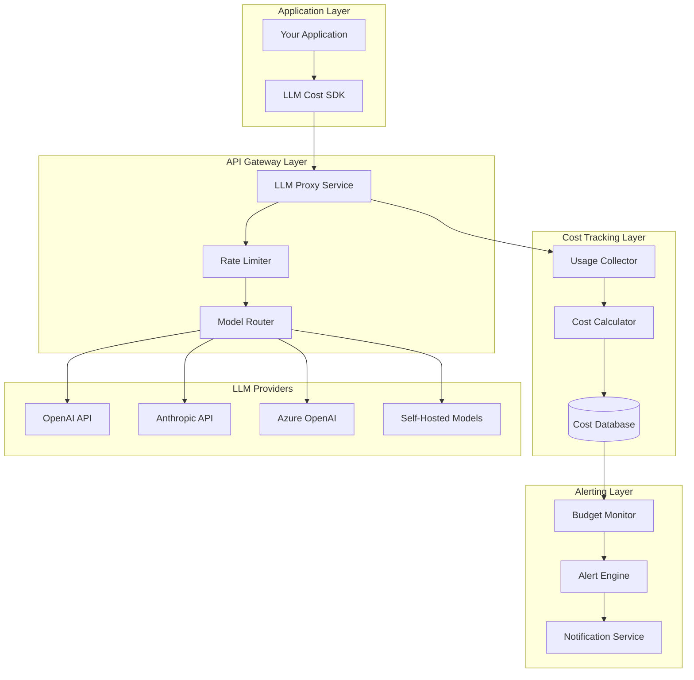
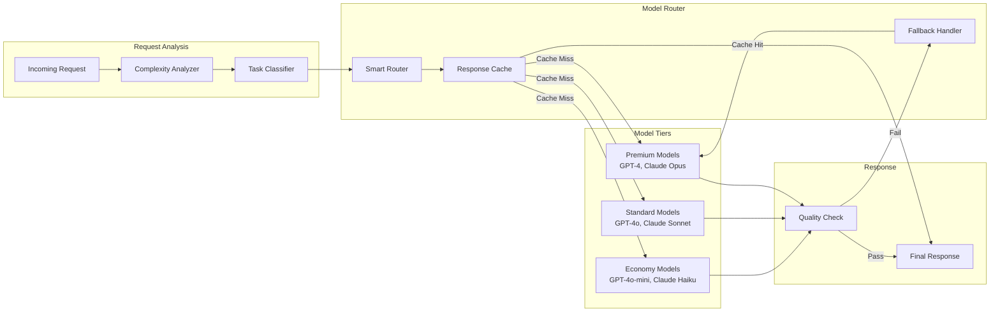
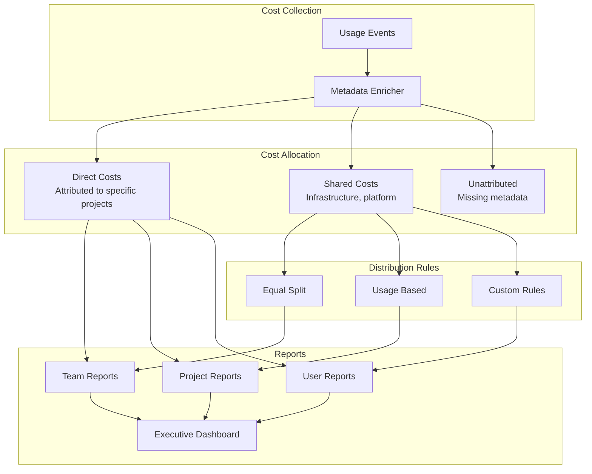

# How to Build Cost Management for LLM Operations

Author: [nawazdhandala](https://github.com/nawazdhandala)

Tags: LLMOps, Cost Management, Budgeting, FinOps

Description: Learn to build cost management for controlling and optimizing LLM infrastructure and API expenses.

---

Large Language Models have transformed how we build applications, but they come with a significant cost challenge. Unlike traditional compute resources where costs scale predictably, LLM expenses can spike unexpectedly based on usage patterns, token consumption, and model selection. This guide walks you through building a comprehensive cost management system for your LLM operations.

## Understanding LLM Cost Drivers

Before building cost controls, you need to understand what drives LLM expenses. The primary cost factors include:

### Token-Based Pricing

Most LLM providers charge per token, with different rates for input (prompt) and output (completion) tokens. A single API call's cost depends on:

- **Input tokens**: The length of your prompt, including system messages and context
- **Output tokens**: The length of the generated response
- **Model tier**: Premium models like GPT-4 or Claude Opus cost significantly more than smaller models

```python
# Example: Token cost calculation for different models
# Prices shown are illustrative and may vary

LLM_PRICING = {
    # Model name: (input_price_per_1k_tokens, output_price_per_1k_tokens)
    "gpt-4-turbo": (0.01, 0.03),
    "gpt-4o": (0.005, 0.015),
    "gpt-3.5-turbo": (0.0005, 0.0015),
    "claude-3-opus": (0.015, 0.075),
    "claude-3-sonnet": (0.003, 0.015),
    "claude-3-haiku": (0.00025, 0.00125),
}

def calculate_cost(model: str, input_tokens: int, output_tokens: int) -> float:
    """
    Calculate the cost of a single LLM API call.

    Args:
        model: The model identifier string
        input_tokens: Number of tokens in the prompt
        output_tokens: Number of tokens in the completion

    Returns:
        Total cost in USD for this API call
    """
    if model not in LLM_PRICING:
        raise ValueError(f"Unknown model: {model}")

    input_price, output_price = LLM_PRICING[model]

    # Calculate cost per thousand tokens
    input_cost = (input_tokens / 1000) * input_price
    output_cost = (output_tokens / 1000) * output_price

    return input_cost + output_cost


# Example usage demonstrating cost differences
def compare_model_costs():
    """Compare costs across models for the same task."""
    # Typical prompt: 500 input tokens, 200 output tokens
    input_tokens = 500
    output_tokens = 200

    print("Cost comparison for 500 input / 200 output tokens:")
    print("-" * 50)

    for model in LLM_PRICING:
        cost = calculate_cost(model, input_tokens, output_tokens)
        print(f"{model:20} ${cost:.6f}")
```

## Architecture of an LLM Cost Management System

A robust cost management system requires multiple components working together. Here is the high-level architecture:



## Building the Cost Tracking Foundation

The foundation of cost management is accurate tracking. Let's build a usage tracking system that captures every LLM interaction.

### Usage Event Schema

First, define a schema for tracking LLM usage events:

```python
from dataclasses import dataclass, field
from datetime import datetime
from typing import Optional
import uuid
import json


@dataclass
class LLMUsageEvent:
    """
    Represents a single LLM API call for cost tracking.

    This event captures all information needed to calculate costs,
    attribute usage to specific projects/users, and analyze patterns.
    """
    # Unique identifier for this event
    event_id: str = field(default_factory=lambda: str(uuid.uuid4()))

    # Timestamp when the API call was made
    timestamp: datetime = field(default_factory=datetime.utcnow)

    # Model information
    model: str = ""
    provider: str = ""  # openai, anthropic, azure, etc.

    # Token counts
    input_tokens: int = 0
    output_tokens: int = 0
    total_tokens: int = 0

    # Cost in USD (calculated after the call)
    cost_usd: float = 0.0

    # Attribution fields for cost allocation
    project_id: str = ""
    team_id: str = ""
    user_id: str = ""
    environment: str = "production"  # production, staging, development

    # Request metadata
    request_type: str = ""  # chat, completion, embedding, etc.
    endpoint: str = ""

    # Performance metrics
    latency_ms: int = 0
    success: bool = True
    error_code: Optional[str] = None

    # Optional: prompt hash for deduplication analysis
    prompt_hash: Optional[str] = None

    def to_dict(self) -> dict:
        """Convert event to dictionary for storage."""
        return {
            "event_id": self.event_id,
            "timestamp": self.timestamp.isoformat(),
            "model": self.model,
            "provider": self.provider,
            "input_tokens": self.input_tokens,
            "output_tokens": self.output_tokens,
            "total_tokens": self.total_tokens,
            "cost_usd": self.cost_usd,
            "project_id": self.project_id,
            "team_id": self.team_id,
            "user_id": self.user_id,
            "environment": self.environment,
            "request_type": self.request_type,
            "endpoint": self.endpoint,
            "latency_ms": self.latency_ms,
            "success": self.success,
            "error_code": self.error_code,
            "prompt_hash": self.prompt_hash,
        }

    def to_json(self) -> str:
        """Serialize event to JSON string."""
        return json.dumps(self.to_dict())
```

### Cost Calculator Service

Build a service that calculates costs based on current pricing:

```python
from typing import Dict, Tuple
from datetime import datetime, date
import threading


class LLMPricingService:
    """
    Service for calculating LLM API costs.

    Maintains pricing tables for different providers and models,
    supporting price changes over time and custom enterprise pricing.
    """

    def __init__(self):
        # Thread-safe pricing updates
        self._lock = threading.RLock()

        # Default pricing (USD per 1000 tokens)
        # Structure: {provider: {model: (input_price, output_price)}}
        self._pricing: Dict[str, Dict[str, Tuple[float, float]]] = {
            "openai": {
                "gpt-4-turbo": (0.01, 0.03),
                "gpt-4o": (0.005, 0.015),
                "gpt-4o-mini": (0.00015, 0.0006),
                "gpt-3.5-turbo": (0.0005, 0.0015),
                "text-embedding-3-small": (0.00002, 0.0),
                "text-embedding-3-large": (0.00013, 0.0),
            },
            "anthropic": {
                "claude-3-opus": (0.015, 0.075),
                "claude-3-sonnet": (0.003, 0.015),
                "claude-3-haiku": (0.00025, 0.00125),
                "claude-3-5-sonnet": (0.003, 0.015),
            },
            "azure": {
                # Azure OpenAI typically matches OpenAI pricing
                "gpt-4-turbo": (0.01, 0.03),
                "gpt-4o": (0.005, 0.015),
                "gpt-35-turbo": (0.0005, 0.0015),
            },
        }

        # Custom enterprise pricing overrides
        self._custom_pricing: Dict[str, Dict[str, Tuple[float, float]]] = {}

        # Historical pricing for accurate retrospective calculations
        self._pricing_history: Dict[date, Dict[str, Dict[str, Tuple[float, float]]]] = {}

    def calculate_cost(
        self,
        provider: str,
        model: str,
        input_tokens: int,
        output_tokens: int,
        use_custom_pricing: bool = True
    ) -> float:
        """
        Calculate the cost of an LLM API call.

        Args:
            provider: The LLM provider (openai, anthropic, azure)
            model: The specific model used
            input_tokens: Number of input/prompt tokens
            output_tokens: Number of output/completion tokens
            use_custom_pricing: Whether to check for custom enterprise pricing

        Returns:
            Cost in USD

        Raises:
            ValueError: If provider or model is unknown
        """
        with self._lock:
            # Check custom pricing first if enabled
            if use_custom_pricing and provider in self._custom_pricing:
                if model in self._custom_pricing[provider]:
                    input_price, output_price = self._custom_pricing[provider][model]
                    return self._compute_cost(
                        input_tokens, output_tokens, input_price, output_price
                    )

            # Fall back to default pricing
            if provider not in self._pricing:
                raise ValueError(f"Unknown provider: {provider}")

            if model not in self._pricing[provider]:
                # Try to find a matching model prefix
                for known_model in self._pricing[provider]:
                    if model.startswith(known_model):
                        input_price, output_price = self._pricing[provider][known_model]
                        return self._compute_cost(
                            input_tokens, output_tokens, input_price, output_price
                        )
                raise ValueError(f"Unknown model: {model} for provider: {provider}")

            input_price, output_price = self._pricing[provider][model]
            return self._compute_cost(
                input_tokens, output_tokens, input_price, output_price
            )

    def _compute_cost(
        self,
        input_tokens: int,
        output_tokens: int,
        input_price: float,
        output_price: float
    ) -> float:
        """Compute cost from token counts and prices."""
        input_cost = (input_tokens / 1000) * input_price
        output_cost = (output_tokens / 1000) * output_price
        return round(input_cost + output_cost, 8)

    def update_pricing(
        self,
        provider: str,
        model: str,
        input_price: float,
        output_price: float,
        is_custom: bool = False
    ) -> None:
        """
        Update pricing for a specific model.

        Args:
            provider: The LLM provider
            model: The model identifier
            input_price: Price per 1000 input tokens
            output_price: Price per 1000 output tokens
            is_custom: If True, store as custom/enterprise pricing
        """
        with self._lock:
            target = self._custom_pricing if is_custom else self._pricing

            if provider not in target:
                target[provider] = {}

            target[provider][model] = (input_price, output_price)

    def get_pricing_table(self) -> Dict[str, Dict[str, Tuple[float, float]]]:
        """Return a copy of the current pricing table."""
        with self._lock:
            return {
                provider: dict(models)
                for provider, models in self._pricing.items()
            }
```

### Usage Collector with OpenTelemetry Integration

Integrate cost tracking with OpenTelemetry for comprehensive observability:

```python
from opentelemetry import trace
from opentelemetry.trace import Span
from opentelemetry import metrics
from typing import Optional, Callable
import functools
import time
import hashlib


class LLMCostCollector:
    """
    Collects LLM usage data and integrates with OpenTelemetry.

    This collector wraps LLM API calls to automatically track:
    - Token usage and costs
    - Latency metrics
    - Error rates
    - Cost attribution by project/team/user
    """

    def __init__(
        self,
        pricing_service: LLMPricingService,
        service_name: str = "llm-cost-tracker"
    ):
        self.pricing_service = pricing_service
        self.service_name = service_name

        # Initialize OpenTelemetry tracer
        self.tracer = trace.get_tracer(service_name)

        # Initialize OpenTelemetry metrics
        meter = metrics.get_meter(service_name)

        # Cost metrics
        self.cost_counter = meter.create_counter(
            name="llm.cost.total",
            description="Total cost of LLM API calls in USD",
            unit="USD"
        )

        # Token metrics
        self.input_token_counter = meter.create_counter(
            name="llm.tokens.input",
            description="Total input tokens consumed"
        )

        self.output_token_counter = meter.create_counter(
            name="llm.tokens.output",
            description="Total output tokens generated"
        )

        # Latency histogram
        self.latency_histogram = meter.create_histogram(
            name="llm.request.latency",
            description="LLM API request latency in milliseconds",
            unit="ms"
        )

        # Request counter
        self.request_counter = meter.create_counter(
            name="llm.requests.total",
            description="Total number of LLM API requests"
        )

        # Error counter
        self.error_counter = meter.create_counter(
            name="llm.errors.total",
            description="Total number of LLM API errors"
        )

    def track_usage(
        self,
        provider: str,
        model: str,
        input_tokens: int,
        output_tokens: int,
        latency_ms: int,
        success: bool = True,
        error_code: Optional[str] = None,
        project_id: str = "",
        team_id: str = "",
        user_id: str = "",
        environment: str = "production",
        prompt_text: Optional[str] = None
    ) -> LLMUsageEvent:
        """
        Track a single LLM API call.

        Args:
            provider: LLM provider name
            model: Model identifier
            input_tokens: Number of input tokens
            output_tokens: Number of output tokens
            latency_ms: Request latency in milliseconds
            success: Whether the request succeeded
            error_code: Error code if request failed
            project_id: Project for cost attribution
            team_id: Team for cost attribution
            user_id: User for cost attribution
            environment: Deployment environment
            prompt_text: Optional prompt text for hash calculation

        Returns:
            LLMUsageEvent with all tracking data
        """
        # Calculate cost
        cost_usd = 0.0
        if success:
            try:
                cost_usd = self.pricing_service.calculate_cost(
                    provider, model, input_tokens, output_tokens
                )
            except ValueError:
                # Unknown model, log warning but continue
                cost_usd = 0.0

        # Create usage event
        event = LLMUsageEvent(
            model=model,
            provider=provider,
            input_tokens=input_tokens,
            output_tokens=output_tokens,
            total_tokens=input_tokens + output_tokens,
            cost_usd=cost_usd,
            project_id=project_id,
            team_id=team_id,
            user_id=user_id,
            environment=environment,
            latency_ms=latency_ms,
            success=success,
            error_code=error_code,
            prompt_hash=self._hash_prompt(prompt_text) if prompt_text else None
        )

        # Common attributes for all metrics
        attributes = {
            "provider": provider,
            "model": model,
            "project_id": project_id,
            "team_id": team_id,
            "environment": environment,
        }

        # Record OpenTelemetry metrics
        self.request_counter.add(1, attributes)

        if success:
            self.cost_counter.add(cost_usd, attributes)
            self.input_token_counter.add(input_tokens, attributes)
            self.output_token_counter.add(output_tokens, attributes)
            self.latency_histogram.record(latency_ms, attributes)
        else:
            error_attrs = {**attributes, "error_code": error_code or "unknown"}
            self.error_counter.add(1, error_attrs)

        return event

    def _hash_prompt(self, prompt_text: str) -> str:
        """Create a hash of the prompt for deduplication analysis."""
        return hashlib.sha256(prompt_text.encode()).hexdigest()[:16]

    def wrap_openai_client(self, client, default_project_id: str = ""):
        """
        Wrap an OpenAI client to automatically track usage.

        This is a simplified example. In production, you would wrap
        all relevant methods (chat.completions.create, embeddings.create, etc.)
        """
        original_create = client.chat.completions.create
        collector = self

        @functools.wraps(original_create)
        def tracked_create(*args, **kwargs):
            start_time = time.time()
            error_code = None
            success = True
            response = None

            try:
                response = original_create(*args, **kwargs)
                return response
            except Exception as e:
                success = False
                error_code = type(e).__name__
                raise
            finally:
                latency_ms = int((time.time() - start_time) * 1000)

                # Extract token usage from response
                input_tokens = 0
                output_tokens = 0
                model = kwargs.get("model", "unknown")

                if response and hasattr(response, "usage"):
                    input_tokens = response.usage.prompt_tokens
                    output_tokens = response.usage.completion_tokens

                # Track the usage
                collector.track_usage(
                    provider="openai",
                    model=model,
                    input_tokens=input_tokens,
                    output_tokens=output_tokens,
                    latency_ms=latency_ms,
                    success=success,
                    error_code=error_code,
                    project_id=default_project_id,
                )

        client.chat.completions.create = tracked_create
        return client
```

## Implementing Budget Controls

With tracking in place, implement budget controls to prevent cost overruns.

### Budget Definition and Storage

```python
from dataclasses import dataclass
from datetime import datetime, timedelta
from enum import Enum
from typing import List, Optional, Dict
import json


class BudgetPeriod(Enum):
    """Time periods for budget allocation."""
    HOURLY = "hourly"
    DAILY = "daily"
    WEEKLY = "weekly"
    MONTHLY = "monthly"


class BudgetAction(Enum):
    """Actions to take when budget thresholds are reached."""
    ALERT = "alert"           # Send notification only
    THROTTLE = "throttle"     # Reduce request rate
    DOWNGRADE = "downgrade"   # Switch to cheaper models
    BLOCK = "block"           # Block all requests


@dataclass
class BudgetThreshold:
    """
    Defines a threshold within a budget and the action to take.

    Multiple thresholds allow graduated responses:
    - 50%: Send warning
    - 80%: Throttle requests
    - 95%: Downgrade to cheaper models
    - 100%: Block requests
    """
    percentage: float         # Percentage of budget (0-100)
    action: BudgetAction
    notification_channels: List[str] = None  # email, slack, pagerduty

    def __post_init__(self):
        if self.notification_channels is None:
            self.notification_channels = ["email"]


@dataclass
class LLMBudget:
    """
    Defines a budget for LLM spending.

    Budgets can be set at different scopes:
    - Organization-wide
    - Per team
    - Per project
    - Per user
    """
    budget_id: str
    name: str

    # Budget amount and period
    amount_usd: float
    period: BudgetPeriod

    # Scope (at least one must be set)
    organization_id: Optional[str] = None
    team_id: Optional[str] = None
    project_id: Optional[str] = None
    user_id: Optional[str] = None

    # Optional: limit to specific models or providers
    allowed_providers: Optional[List[str]] = None
    allowed_models: Optional[List[str]] = None

    # Thresholds and actions
    thresholds: List[BudgetThreshold] = None

    # Metadata
    created_at: datetime = None
    updated_at: datetime = None
    is_active: bool = True

    def __post_init__(self):
        if self.created_at is None:
            self.created_at = datetime.utcnow()
        if self.updated_at is None:
            self.updated_at = datetime.utcnow()
        if self.thresholds is None:
            # Default thresholds
            self.thresholds = [
                BudgetThreshold(50, BudgetAction.ALERT),
                BudgetThreshold(80, BudgetAction.ALERT, ["email", "slack"]),
                BudgetThreshold(95, BudgetAction.THROTTLE, ["email", "slack"]),
                BudgetThreshold(100, BudgetAction.BLOCK, ["email", "slack", "pagerduty"]),
            ]

    def get_period_start(self) -> datetime:
        """Calculate the start of the current budget period."""
        now = datetime.utcnow()

        if self.period == BudgetPeriod.HOURLY:
            return now.replace(minute=0, second=0, microsecond=0)
        elif self.period == BudgetPeriod.DAILY:
            return now.replace(hour=0, minute=0, second=0, microsecond=0)
        elif self.period == BudgetPeriod.WEEKLY:
            start = now.replace(hour=0, minute=0, second=0, microsecond=0)
            return start - timedelta(days=start.weekday())
        elif self.period == BudgetPeriod.MONTHLY:
            return now.replace(day=1, hour=0, minute=0, second=0, microsecond=0)

        return now

    def get_period_end(self) -> datetime:
        """Calculate the end of the current budget period."""
        start = self.get_period_start()

        if self.period == BudgetPeriod.HOURLY:
            return start + timedelta(hours=1)
        elif self.period == BudgetPeriod.DAILY:
            return start + timedelta(days=1)
        elif self.period == BudgetPeriod.WEEKLY:
            return start + timedelta(weeks=1)
        elif self.period == BudgetPeriod.MONTHLY:
            # Move to next month
            if start.month == 12:
                return start.replace(year=start.year + 1, month=1)
            return start.replace(month=start.month + 1)

        return start + timedelta(days=1)
```

### Budget Enforcement Service

```python
from typing import Tuple, Optional
import asyncio
from collections import defaultdict
import threading


class BudgetEnforcementService:
    """
    Enforces budget limits on LLM API calls.

    This service:
    - Tracks spending against budgets in real-time
    - Determines which action to take based on current spend
    - Handles model downgrade routing
    - Manages rate limiting when throttling
    """

    # Model downgrade paths: premium model -> cheaper alternative
    MODEL_DOWNGRADES = {
        "gpt-4-turbo": "gpt-4o-mini",
        "gpt-4o": "gpt-4o-mini",
        "gpt-4o-mini": "gpt-3.5-turbo",
        "claude-3-opus": "claude-3-sonnet",
        "claude-3-sonnet": "claude-3-haiku",
        "claude-3-5-sonnet": "claude-3-haiku",
    }

    def __init__(self, cost_store):
        """
        Initialize the budget enforcement service.

        Args:
            cost_store: Storage backend for cost data (database, cache, etc.)
        """
        self.cost_store = cost_store
        self._budgets: Dict[str, LLMBudget] = {}
        self._lock = threading.RLock()

        # Track triggered thresholds to avoid duplicate alerts
        self._triggered_thresholds: Dict[str, set] = defaultdict(set)

    def register_budget(self, budget: LLMBudget) -> None:
        """Register a budget for enforcement."""
        with self._lock:
            self._budgets[budget.budget_id] = budget

    def check_budget(
        self,
        project_id: str = "",
        team_id: str = "",
        user_id: str = "",
        requested_model: str = ""
    ) -> Tuple[bool, Optional[str], Optional[BudgetAction]]:
        """
        Check if a request should be allowed based on budget constraints.

        Args:
            project_id: Project making the request
            team_id: Team making the request
            user_id: User making the request
            requested_model: The model being requested

        Returns:
            Tuple of:
            - allowed: Whether the request should proceed
            - model_override: Alternative model to use (if downgrading)
            - action: The budget action being taken
        """
        applicable_budgets = self._find_applicable_budgets(
            project_id, team_id, user_id
        )

        if not applicable_budgets:
            # No budgets configured, allow request
            return True, None, None

        # Check each applicable budget
        for budget in applicable_budgets:
            if not budget.is_active:
                continue

            # Get current spend for this budget period
            current_spend = self._get_current_spend(budget)
            spend_percentage = (current_spend / budget.amount_usd) * 100

            # Find the highest triggered threshold
            triggered_action = None
            for threshold in sorted(budget.thresholds, key=lambda t: t.percentage, reverse=True):
                if spend_percentage >= threshold.percentage:
                    triggered_action = threshold.action

                    # Send alerts if this threshold is newly triggered
                    threshold_key = f"{budget.budget_id}:{threshold.percentage}"
                    if threshold_key not in self._triggered_thresholds[budget.budget_id]:
                        self._triggered_thresholds[budget.budget_id].add(threshold_key)
                        self._send_alert(budget, threshold, current_spend, spend_percentage)

                    break

            if triggered_action == BudgetAction.BLOCK:
                return False, None, BudgetAction.BLOCK

            if triggered_action == BudgetAction.DOWNGRADE:
                downgraded_model = self._get_downgraded_model(requested_model)
                if downgraded_model:
                    return True, downgraded_model, BudgetAction.DOWNGRADE
                # If no downgrade available, block
                return False, None, BudgetAction.BLOCK

            if triggered_action == BudgetAction.THROTTLE:
                # Implement rate limiting logic here
                # For simplicity, we'll still allow the request
                return True, None, BudgetAction.THROTTLE

        return True, None, None

    def _find_applicable_budgets(
        self,
        project_id: str,
        team_id: str,
        user_id: str
    ) -> List[LLMBudget]:
        """Find all budgets that apply to this request."""
        applicable = []

        with self._lock:
            for budget in self._budgets.values():
                # Check if budget scope matches the request
                if budget.user_id and budget.user_id == user_id:
                    applicable.append(budget)
                elif budget.project_id and budget.project_id == project_id:
                    applicable.append(budget)
                elif budget.team_id and budget.team_id == team_id:
                    applicable.append(budget)
                elif budget.organization_id:
                    # Organization-wide budget applies to all
                    applicable.append(budget)

        return applicable

    def _get_current_spend(self, budget: LLMBudget) -> float:
        """Get the current spend for a budget's current period."""
        period_start = budget.get_period_start()
        period_end = budget.get_period_end()

        # Query the cost store for spend in this period
        # This would typically be a database query
        filters = {
            "timestamp_gte": period_start,
            "timestamp_lt": period_end,
        }

        if budget.project_id:
            filters["project_id"] = budget.project_id
        if budget.team_id:
            filters["team_id"] = budget.team_id
        if budget.user_id:
            filters["user_id"] = budget.user_id

        return self.cost_store.get_total_cost(**filters)

    def _get_downgraded_model(self, model: str) -> Optional[str]:
        """Get a cheaper alternative model."""
        return self.MODEL_DOWNGRADES.get(model)

    def _send_alert(
        self,
        budget: LLMBudget,
        threshold: BudgetThreshold,
        current_spend: float,
        percentage: float
    ) -> None:
        """Send alert notifications for a triggered threshold."""
        alert_message = {
            "budget_name": budget.name,
            "budget_id": budget.budget_id,
            "threshold_percentage": threshold.percentage,
            "current_spend": current_spend,
            "budget_amount": budget.amount_usd,
            "spend_percentage": round(percentage, 2),
            "action_taken": threshold.action.value,
            "period": budget.period.value,
        }

        # Send to configured notification channels
        for channel in threshold.notification_channels:
            self._dispatch_notification(channel, alert_message)

    def _dispatch_notification(self, channel: str, message: dict) -> None:
        """Dispatch notification to a specific channel."""
        # Implementation would integrate with:
        # - Email service (SendGrid, SES)
        # - Slack webhooks
        # - PagerDuty API
        # - Other notification services
        print(f"[{channel.upper()}] Budget Alert: {json.dumps(message, indent=2)}")

    def reset_period_tracking(self, budget_id: str) -> None:
        """Reset threshold tracking for a new budget period."""
        with self._lock:
            self._triggered_thresholds[budget_id].clear()
```

## Model Selection Optimization

Intelligent model selection can dramatically reduce costs while maintaining quality. Here is an architecture for automatic model routing:



### Intelligent Model Router

```python
from enum import Enum
from typing import Optional, Callable
import re


class TaskComplexity(Enum):
    """Classification of task complexity for model routing."""
    SIMPLE = "simple"       # Basic Q&A, formatting, simple extraction
    MODERATE = "moderate"   # Summarization, translation, structured output
    COMPLEX = "complex"     # Reasoning, analysis, creative tasks
    CRITICAL = "critical"   # High-stakes decisions, requires best model


class ModelTier(Enum):
    """Model tiers by capability and cost."""
    ECONOMY = "economy"     # Cheapest, good for simple tasks
    STANDARD = "standard"   # Balanced cost/capability
    PREMIUM = "premium"     # Best capability, highest cost


class IntelligentModelRouter:
    """
    Routes requests to appropriate models based on task complexity.

    This router analyzes incoming requests and selects the most
    cost-effective model that can handle the task adequately.
    """

    # Default model assignments by tier and provider
    TIER_MODELS = {
        "openai": {
            ModelTier.ECONOMY: "gpt-4o-mini",
            ModelTier.STANDARD: "gpt-4o",
            ModelTier.PREMIUM: "gpt-4-turbo",
        },
        "anthropic": {
            ModelTier.ECONOMY: "claude-3-haiku",
            ModelTier.STANDARD: "claude-3-5-sonnet",
            ModelTier.PREMIUM: "claude-3-opus",
        },
    }

    # Complexity to tier mapping
    COMPLEXITY_TIERS = {
        TaskComplexity.SIMPLE: ModelTier.ECONOMY,
        TaskComplexity.MODERATE: ModelTier.STANDARD,
        TaskComplexity.COMPLEX: ModelTier.STANDARD,
        TaskComplexity.CRITICAL: ModelTier.PREMIUM,
    }

    # Keywords and patterns that suggest task complexity
    COMPLEXITY_PATTERNS = {
        TaskComplexity.SIMPLE: [
            r"\b(format|convert|extract|list|count)\b",
            r"\b(yes|no|true|false)\s*\?",
            r"\b(what is|define|meaning of)\b",
        ],
        TaskComplexity.MODERATE: [
            r"\b(summarize|translate|rewrite|paraphrase)\b",
            r"\b(compare|contrast|differences?)\b",
            r"\b(json|xml|yaml|csv)\b.*\b(output|format)\b",
        ],
        TaskComplexity.COMPLEX: [
            r"\b(analyze|evaluate|assess|critique)\b",
            r"\b(explain why|reason|because)\b",
            r"\b(create|generate|write|compose)\b.*(story|essay|article)",
            r"\b(code|program|function|algorithm)\b",
        ],
        TaskComplexity.CRITICAL: [
            r"\b(legal|medical|financial)\s+(advice|decision)",
            r"\b(safety|security|compliance)\b",
            r"\b(critical|important|urgent)\b.*\b(decision|choice)\b",
        ],
    }

    def __init__(
        self,
        default_provider: str = "openai",
        quality_threshold: float = 0.8,
        enable_caching: bool = True
    ):
        """
        Initialize the model router.

        Args:
            default_provider: Default LLM provider to use
            quality_threshold: Minimum quality score to accept a response
            enable_caching: Whether to cache responses for identical prompts
        """
        self.default_provider = default_provider
        self.quality_threshold = quality_threshold
        self.enable_caching = enable_caching

        # Response cache (would use Redis in production)
        self._cache: Dict[str, str] = {}

        # Custom routing rules
        self._custom_rules: List[Callable] = []

    def classify_complexity(self, prompt: str, system_message: str = "") -> TaskComplexity:
        """
        Classify the complexity of a task based on the prompt.

        Args:
            prompt: The user's prompt/question
            system_message: Optional system message for context

        Returns:
            TaskComplexity classification
        """
        combined_text = f"{system_message} {prompt}".lower()

        # Check patterns from most to least complex
        for complexity in [TaskComplexity.CRITICAL, TaskComplexity.COMPLEX,
                          TaskComplexity.MODERATE, TaskComplexity.SIMPLE]:
            for pattern in self.COMPLEXITY_PATTERNS[complexity]:
                if re.search(pattern, combined_text, re.IGNORECASE):
                    return complexity

        # Default to moderate if no patterns match
        return TaskComplexity.MODERATE

    def select_model(
        self,
        prompt: str,
        system_message: str = "",
        provider: Optional[str] = None,
        force_tier: Optional[ModelTier] = None,
        max_tier: Optional[ModelTier] = None
    ) -> Tuple[str, str, TaskComplexity]:
        """
        Select the optimal model for a request.

        Args:
            prompt: The user's prompt
            system_message: Optional system message
            provider: LLM provider (defaults to self.default_provider)
            force_tier: Force a specific tier (overrides auto-selection)
            max_tier: Maximum tier allowed (for budget constraints)

        Returns:
            Tuple of (provider, model, complexity)
        """
        provider = provider or self.default_provider

        # Apply custom routing rules first
        for rule in self._custom_rules:
            result = rule(prompt, system_message, provider)
            if result:
                return result

        # Classify task complexity
        complexity = self.classify_complexity(prompt, system_message)

        # Determine tier
        if force_tier:
            tier = force_tier
        else:
            tier = self.COMPLEXITY_TIERS[complexity]

        # Apply max tier constraint
        if max_tier:
            tier_order = [ModelTier.ECONOMY, ModelTier.STANDARD, ModelTier.PREMIUM]
            max_index = tier_order.index(max_tier)
            current_index = tier_order.index(tier)
            if current_index > max_index:
                tier = max_tier

        # Get model for provider and tier
        if provider not in self.TIER_MODELS:
            raise ValueError(f"Unknown provider: {provider}")

        model = self.TIER_MODELS[provider][tier]

        return provider, model, complexity

    def add_routing_rule(self, rule: Callable) -> None:
        """
        Add a custom routing rule.

        Rules are functions that take (prompt, system_message, provider)
        and return either (provider, model, complexity) or None to skip.
        """
        self._custom_rules.append(rule)

    def estimate_cost_savings(
        self,
        prompts: List[str],
        baseline_model: str = "gpt-4-turbo",
        provider: str = "openai"
    ) -> dict:
        """
        Estimate cost savings from intelligent routing.

        Args:
            prompts: List of sample prompts to analyze
            baseline_model: Model to compare against (assumed without routing)
            provider: LLM provider

        Returns:
            Dictionary with cost analysis
        """
        pricing_service = LLMPricingService()

        # Assume average token counts for estimation
        avg_input_tokens = 500
        avg_output_tokens = 200

        baseline_cost_per_request = pricing_service.calculate_cost(
            provider, baseline_model, avg_input_tokens, avg_output_tokens
        )

        routed_costs = []
        tier_distribution = {tier: 0 for tier in ModelTier}

        for prompt in prompts:
            _, model, complexity = self.select_model(prompt, provider=provider)
            tier = self.COMPLEXITY_TIERS.get(complexity, ModelTier.STANDARD)
            tier_distribution[tier] += 1

            cost = pricing_service.calculate_cost(
                provider, model, avg_input_tokens, avg_output_tokens
            )
            routed_costs.append(cost)

        total_baseline = baseline_cost_per_request * len(prompts)
        total_routed = sum(routed_costs)
        savings = total_baseline - total_routed
        savings_percentage = (savings / total_baseline) * 100 if total_baseline > 0 else 0

        return {
            "total_requests": len(prompts),
            "baseline_cost": round(total_baseline, 4),
            "routed_cost": round(total_routed, 4),
            "savings": round(savings, 4),
            "savings_percentage": round(savings_percentage, 2),
            "tier_distribution": {
                tier.value: count for tier, count in tier_distribution.items()
            },
        }
```

## Cost Allocation and Chargeback

For organizations with multiple teams or projects, cost allocation is essential for accountability.



### Cost Allocation Service

```python
from typing import List, Dict
from dataclasses import dataclass
from datetime import datetime, date
from collections import defaultdict


@dataclass
class CostAllocationReport:
    """Report showing cost allocation for a time period."""
    period_start: date
    period_end: date
    total_cost: float
    direct_costs: Dict[str, float]      # entity_id -> cost
    shared_costs: Dict[str, float]      # entity_id -> allocated cost
    unattributed_cost: float
    breakdown_by_model: Dict[str, float]
    breakdown_by_provider: Dict[str, float]


class CostAllocationService:
    """
    Allocates LLM costs to teams, projects, and users.

    Supports multiple allocation strategies:
    - Direct: Costs with clear attribution go directly to that entity
    - Shared: Platform/infrastructure costs split among users
    - Proportional: Unattributed costs split based on usage patterns
    """

    def __init__(self, cost_store):
        """
        Initialize the cost allocation service.

        Args:
            cost_store: Storage backend for cost data
        """
        self.cost_store = cost_store

        # Allocation rules for shared costs
        self._shared_cost_pools: Dict[str, List[str]] = {
            "platform": [],  # List of entity IDs that share platform costs
        }

    def generate_team_report(
        self,
        team_id: str,
        start_date: date,
        end_date: date
    ) -> CostAllocationReport:
        """
        Generate a cost allocation report for a team.

        Args:
            team_id: The team to generate the report for
            start_date: Start of the reporting period
            end_date: End of the reporting period

        Returns:
            CostAllocationReport with detailed breakdown
        """
        # Get all usage events for this team in the period
        events = self.cost_store.get_events(
            team_id=team_id,
            start_date=start_date,
            end_date=end_date
        )

        # Calculate direct costs
        direct_costs = defaultdict(float)
        model_breakdown = defaultdict(float)
        provider_breakdown = defaultdict(float)

        for event in events:
            # Attribute to most specific entity
            if event.project_id:
                direct_costs[f"project:{event.project_id}"] += event.cost_usd
            elif event.user_id:
                direct_costs[f"user:{event.user_id}"] += event.cost_usd

            model_breakdown[event.model] += event.cost_usd
            provider_breakdown[event.provider] += event.cost_usd

        total_direct = sum(direct_costs.values())

        # Calculate shared costs allocation for this team
        shared_costs = self._allocate_shared_costs(team_id, start_date, end_date)

        # Any unattributed costs
        unattributed = self._get_unattributed_costs(team_id, start_date, end_date)

        return CostAllocationReport(
            period_start=start_date,
            period_end=end_date,
            total_cost=total_direct + sum(shared_costs.values()) + unattributed,
            direct_costs=dict(direct_costs),
            shared_costs=shared_costs,
            unattributed_cost=unattributed,
            breakdown_by_model=dict(model_breakdown),
            breakdown_by_provider=dict(provider_breakdown),
        )

    def generate_project_report(
        self,
        project_id: str,
        start_date: date,
        end_date: date
    ) -> CostAllocationReport:
        """Generate a cost allocation report for a specific project."""
        events = self.cost_store.get_events(
            project_id=project_id,
            start_date=start_date,
            end_date=end_date
        )

        # Attribute costs to users within the project
        user_costs = defaultdict(float)
        model_breakdown = defaultdict(float)
        provider_breakdown = defaultdict(float)

        for event in events:
            if event.user_id:
                user_costs[event.user_id] += event.cost_usd
            model_breakdown[event.model] += event.cost_usd
            provider_breakdown[event.provider] += event.cost_usd

        return CostAllocationReport(
            period_start=start_date,
            period_end=end_date,
            total_cost=sum(user_costs.values()),
            direct_costs=dict(user_costs),
            shared_costs={},
            unattributed_cost=0.0,
            breakdown_by_model=dict(model_breakdown),
            breakdown_by_provider=dict(provider_breakdown),
        )

    def _allocate_shared_costs(
        self,
        team_id: str,
        start_date: date,
        end_date: date
    ) -> Dict[str, float]:
        """Allocate shared platform costs to a team."""
        # Get total shared costs for the period
        total_shared = self.cost_store.get_shared_costs(start_date, end_date)

        if total_shared == 0:
            return {}

        # Get this team's usage as a proportion of total usage
        team_usage = self.cost_store.get_total_tokens(
            team_id=team_id,
            start_date=start_date,
            end_date=end_date
        )

        total_usage = self.cost_store.get_total_tokens(
            start_date=start_date,
            end_date=end_date
        )

        if total_usage == 0:
            return {}

        # Proportional allocation based on token usage
        allocation_ratio = team_usage / total_usage
        allocated_amount = total_shared * allocation_ratio

        return {"shared_platform_costs": allocated_amount}

    def _get_unattributed_costs(
        self,
        team_id: str,
        start_date: date,
        end_date: date
    ) -> float:
        """Get costs that could not be attributed to specific entities."""
        return self.cost_store.get_unattributed_costs(
            team_id=team_id,
            start_date=start_date,
            end_date=end_date
        )

    def generate_chargeback_invoice(
        self,
        team_id: str,
        month: int,
        year: int
    ) -> dict:
        """
        Generate a chargeback invoice for internal billing.

        Args:
            team_id: Team to invoice
            month: Month number (1-12)
            year: Year

        Returns:
            Invoice data structure
        """
        start_date = date(year, month, 1)
        if month == 12:
            end_date = date(year + 1, 1, 1)
        else:
            end_date = date(year, month + 1, 1)

        report = self.generate_team_report(team_id, start_date, end_date)

        # Build line items
        line_items = []

        # Direct costs by project
        for entity_id, cost in report.direct_costs.items():
            line_items.append({
                "description": f"LLM Usage - {entity_id}",
                "amount": round(cost, 2),
                "category": "direct",
            })

        # Shared costs
        for cost_type, amount in report.shared_costs.items():
            line_items.append({
                "description": f"Shared Infrastructure - {cost_type}",
                "amount": round(amount, 2),
                "category": "shared",
            })

        # Unattributed costs
        if report.unattributed_cost > 0:
            line_items.append({
                "description": "Unattributed Usage",
                "amount": round(report.unattributed_cost, 2),
                "category": "unattributed",
            })

        return {
            "invoice_id": f"LLM-{team_id}-{year}{month:02d}",
            "team_id": team_id,
            "period": f"{year}-{month:02d}",
            "generated_at": datetime.utcnow().isoformat(),
            "line_items": line_items,
            "subtotals": {
                "direct": sum(item["amount"] for item in line_items if item["category"] == "direct"),
                "shared": sum(item["amount"] for item in line_items if item["category"] == "shared"),
                "unattributed": report.unattributed_cost,
            },
            "total": round(report.total_cost, 2),
            "breakdown_by_model": report.breakdown_by_model,
            "breakdown_by_provider": report.breakdown_by_provider,
        }
```

## Implementing Real-Time Cost Dashboards

Visibility into costs requires real-time dashboards. Here is how to structure metrics for dashboard consumption:

```python
from typing import Dict, List
from datetime import datetime, timedelta
from dataclasses import dataclass


@dataclass
class DashboardMetrics:
    """Metrics structure for cost management dashboards."""
    # Current period metrics
    current_spend: float
    budget_remaining: float
    budget_utilization_percentage: float

    # Comparison metrics
    previous_period_spend: float
    spend_change_percentage: float

    # Breakdown metrics
    spend_by_model: Dict[str, float]
    spend_by_team: Dict[str, float]
    spend_by_project: Dict[str, float]

    # Trend data (for charts)
    daily_spend_trend: List[Dict]  # [{date, amount}, ...]

    # Efficiency metrics
    avg_cost_per_request: float
    avg_tokens_per_request: float
    cache_hit_rate: float

    # Alerts
    active_alerts: List[Dict]


class CostDashboardService:
    """
    Provides metrics and data for cost management dashboards.

    Aggregates data from the cost store and presents it in
    formats suitable for visualization.
    """

    def __init__(self, cost_store, budget_service: BudgetEnforcementService):
        """
        Initialize the dashboard service.

        Args:
            cost_store: Storage backend for cost data
            budget_service: Budget enforcement service for budget data
        """
        self.cost_store = cost_store
        self.budget_service = budget_service

    def get_organization_dashboard(
        self,
        organization_id: str,
        period_days: int = 30
    ) -> DashboardMetrics:
        """
        Get dashboard metrics for an organization.

        Args:
            organization_id: Organization to get metrics for
            period_days: Number of days to include in current period

        Returns:
            DashboardMetrics with all dashboard data
        """
        now = datetime.utcnow()
        period_start = now - timedelta(days=period_days)
        previous_period_start = period_start - timedelta(days=period_days)

        # Current period spend
        current_spend = self.cost_store.get_total_cost(
            organization_id=organization_id,
            start_date=period_start,
            end_date=now
        )

        # Previous period spend for comparison
        previous_spend = self.cost_store.get_total_cost(
            organization_id=organization_id,
            start_date=previous_period_start,
            end_date=period_start
        )

        # Calculate change percentage
        if previous_spend > 0:
            change_percentage = ((current_spend - previous_spend) / previous_spend) * 100
        else:
            change_percentage = 0.0

        # Get budget information
        budget = self._get_organization_budget(organization_id)
        budget_remaining = budget.amount_usd - current_spend if budget else 0.0
        budget_utilization = (current_spend / budget.amount_usd * 100) if budget else 0.0

        # Breakdowns
        spend_by_model = self.cost_store.get_cost_by_dimension(
            organization_id=organization_id,
            dimension="model",
            start_date=period_start,
            end_date=now
        )

        spend_by_team = self.cost_store.get_cost_by_dimension(
            organization_id=organization_id,
            dimension="team_id",
            start_date=period_start,
            end_date=now
        )

        spend_by_project = self.cost_store.get_cost_by_dimension(
            organization_id=organization_id,
            dimension="project_id",
            start_date=period_start,
            end_date=now
        )

        # Daily trend
        daily_trend = self.cost_store.get_daily_costs(
            organization_id=organization_id,
            start_date=period_start,
            end_date=now
        )

        # Efficiency metrics
        total_requests = self.cost_store.get_request_count(
            organization_id=organization_id,
            start_date=period_start,
            end_date=now
        )

        total_tokens = self.cost_store.get_total_tokens(
            organization_id=organization_id,
            start_date=period_start,
            end_date=now
        )

        avg_cost = current_spend / total_requests if total_requests > 0 else 0.0
        avg_tokens = total_tokens / total_requests if total_requests > 0 else 0.0

        # Cache metrics
        cache_hits = self.cost_store.get_cache_hits(
            organization_id=organization_id,
            start_date=period_start,
            end_date=now
        )
        cache_hit_rate = cache_hits / total_requests if total_requests > 0 else 0.0

        # Active alerts
        alerts = self._get_active_alerts(organization_id)

        return DashboardMetrics(
            current_spend=round(current_spend, 2),
            budget_remaining=round(budget_remaining, 2),
            budget_utilization_percentage=round(budget_utilization, 2),
            previous_period_spend=round(previous_spend, 2),
            spend_change_percentage=round(change_percentage, 2),
            spend_by_model=spend_by_model,
            spend_by_team=spend_by_team,
            spend_by_project=spend_by_project,
            daily_spend_trend=daily_trend,
            avg_cost_per_request=round(avg_cost, 6),
            avg_tokens_per_request=round(avg_tokens, 2),
            cache_hit_rate=round(cache_hit_rate, 4),
            active_alerts=alerts,
        )

    def _get_organization_budget(self, organization_id: str) -> Optional[LLMBudget]:
        """Get the primary budget for an organization."""
        for budget in self.budget_service._budgets.values():
            if budget.organization_id == organization_id and budget.is_active:
                return budget
        return None

    def _get_active_alerts(self, organization_id: str) -> List[Dict]:
        """Get currently active budget alerts."""
        alerts = []

        for budget in self.budget_service._budgets.values():
            if budget.organization_id != organization_id:
                continue

            current_spend = self.budget_service._get_current_spend(budget)
            utilization = (current_spend / budget.amount_usd) * 100

            for threshold in budget.thresholds:
                if utilization >= threshold.percentage:
                    alerts.append({
                        "budget_name": budget.name,
                        "threshold": threshold.percentage,
                        "utilization": round(utilization, 2),
                        "action": threshold.action.value,
                        "severity": "critical" if threshold.percentage >= 90 else "warning",
                    })

        return alerts

    def export_cost_report(
        self,
        organization_id: str,
        start_date: date,
        end_date: date,
        format: str = "csv"
    ) -> str:
        """
        Export detailed cost data for a period.

        Args:
            organization_id: Organization to export data for
            start_date: Start of export period
            end_date: End of export period
            format: Export format (csv, json)

        Returns:
            Exported data as string
        """
        events = self.cost_store.get_events(
            organization_id=organization_id,
            start_date=start_date,
            end_date=end_date
        )

        if format == "csv":
            return self._events_to_csv(events)
        elif format == "json":
            return json.dumps([e.to_dict() for e in events], indent=2)
        else:
            raise ValueError(f"Unsupported format: {format}")

    def _events_to_csv(self, events: List[LLMUsageEvent]) -> str:
        """Convert events to CSV format."""
        if not events:
            return ""

        headers = [
            "event_id", "timestamp", "provider", "model",
            "input_tokens", "output_tokens", "cost_usd",
            "project_id", "team_id", "user_id", "environment"
        ]

        lines = [",".join(headers)]

        for event in events:
            row = [
                event.event_id,
                event.timestamp.isoformat(),
                event.provider,
                event.model,
                str(event.input_tokens),
                str(event.output_tokens),
                str(event.cost_usd),
                event.project_id,
                event.team_id,
                event.user_id,
                event.environment,
            ]
            lines.append(",".join(row))

        return "\n".join(lines)
```

## Cost Optimization Strategies

Beyond tracking and budgeting, implement active cost optimization.

### Prompt Caching

Caching identical or similar prompts can significantly reduce costs:

```python
import hashlib
from typing import Optional, Tuple
import time


class PromptCache:
    """
    Cache for LLM responses to avoid redundant API calls.

    Implements multiple caching strategies:
    - Exact match: Cache responses for identical prompts
    - Semantic similarity: Cache for semantically similar prompts
    - TTL-based expiration: Responses expire after a configurable time
    """

    def __init__(
        self,
        ttl_seconds: int = 3600,
        max_entries: int = 10000
    ):
        """
        Initialize the prompt cache.

        Args:
            ttl_seconds: Time-to-live for cache entries
            max_entries: Maximum number of entries to cache
        """
        self.ttl_seconds = ttl_seconds
        self.max_entries = max_entries

        # Simple in-memory cache (use Redis in production)
        self._cache: Dict[str, Tuple[str, float, dict]] = {}  # hash -> (response, timestamp, metadata)
        self._access_order: List[str] = []  # For LRU eviction

    def _hash_prompt(self, prompt: str, model: str, temperature: float) -> str:
        """
        Create a unique hash for a prompt configuration.

        The hash includes the model and temperature because
        different settings produce different outputs.
        """
        content = f"{model}:{temperature}:{prompt}"
        return hashlib.sha256(content.encode()).hexdigest()

    def get(
        self,
        prompt: str,
        model: str,
        temperature: float = 0.0
    ) -> Optional[Tuple[str, dict]]:
        """
        Retrieve a cached response if available.

        Args:
            prompt: The prompt to look up
            model: Model that would be used
            temperature: Temperature setting

        Returns:
            Tuple of (response, metadata) if cached, None otherwise
        """
        # Only cache deterministic responses (temperature = 0)
        if temperature > 0:
            return None

        cache_key = self._hash_prompt(prompt, model, temperature)

        if cache_key not in self._cache:
            return None

        response, timestamp, metadata = self._cache[cache_key]

        # Check TTL
        if time.time() - timestamp > self.ttl_seconds:
            del self._cache[cache_key]
            self._access_order.remove(cache_key)
            return None

        # Update access order for LRU
        self._access_order.remove(cache_key)
        self._access_order.append(cache_key)

        return response, metadata

    def set(
        self,
        prompt: str,
        model: str,
        temperature: float,
        response: str,
        metadata: dict = None
    ) -> None:
        """
        Cache a response.

        Args:
            prompt: The prompt that generated this response
            model: Model used
            temperature: Temperature setting
            response: The response to cache
            metadata: Optional metadata (tokens used, etc.)
        """
        if temperature > 0:
            return

        cache_key = self._hash_prompt(prompt, model, temperature)

        # Evict oldest entry if cache is full
        while len(self._cache) >= self.max_entries:
            oldest_key = self._access_order.pop(0)
            del self._cache[oldest_key]

        self._cache[cache_key] = (response, time.time(), metadata or {})
        self._access_order.append(cache_key)

    def get_stats(self) -> dict:
        """Get cache statistics."""
        return {
            "entries": len(self._cache),
            "max_entries": self.max_entries,
            "ttl_seconds": self.ttl_seconds,
        }

    def clear(self) -> None:
        """Clear all cached entries."""
        self._cache.clear()
        self._access_order.clear()
```

### Token Optimization

Reduce token usage without sacrificing quality:

```python
import re
from typing import List


class TokenOptimizer:
    """
    Optimizes prompts to reduce token usage.

    Implements various strategies to reduce prompt size
    while maintaining the same semantic meaning.
    """

    def __init__(self):
        # Common verbose phrases and their concise replacements
        self._replacements = {
            "in order to": "to",
            "due to the fact that": "because",
            "at this point in time": "now",
            "in the event that": "if",
            "for the purpose of": "to",
            "with regard to": "about",
            "in spite of the fact that": "although",
            "at the present time": "now",
            "in the near future": "soon",
            "on a daily basis": "daily",
        }

    def optimize_prompt(
        self,
        prompt: str,
        aggressive: bool = False
    ) -> Tuple[str, dict]:
        """
        Optimize a prompt to reduce token count.

        Args:
            prompt: The original prompt
            aggressive: If True, apply more aggressive optimization

        Returns:
            Tuple of (optimized_prompt, optimization_stats)
        """
        original_length = len(prompt)
        optimized = prompt

        # Remove extra whitespace
        optimized = re.sub(r'\s+', ' ', optimized).strip()

        # Replace verbose phrases
        for verbose, concise in self._replacements.items():
            optimized = re.sub(
                rf'\b{re.escape(verbose)}\b',
                concise,
                optimized,
                flags=re.IGNORECASE
            )

        # Remove unnecessary filler words if aggressive
        if aggressive:
            filler_words = [
                r'\bvery\b', r'\breally\b', r'\bjust\b',
                r'\bbasically\b', r'\bactually\b', r'\bliterally\b'
            ]
            for filler in filler_words:
                optimized = re.sub(filler, '', optimized, flags=re.IGNORECASE)

            # Clean up double spaces after removal
            optimized = re.sub(r'\s+', ' ', optimized).strip()

        new_length = len(optimized)
        reduction = original_length - new_length
        reduction_percentage = (reduction / original_length * 100) if original_length > 0 else 0

        return optimized, {
            "original_length": original_length,
            "optimized_length": new_length,
            "characters_saved": reduction,
            "reduction_percentage": round(reduction_percentage, 2),
        }

    def truncate_context(
        self,
        context: str,
        max_tokens: int,
        preserve_recent: bool = True
    ) -> str:
        """
        Truncate context to fit within token limits.

        Args:
            context: The context to truncate
            max_tokens: Maximum tokens allowed
            preserve_recent: If True, keep most recent content

        Returns:
            Truncated context
        """
        # Rough estimation: 1 token is about 4 characters
        max_chars = max_tokens * 4

        if len(context) <= max_chars:
            return context

        if preserve_recent:
            # Keep the end of the context (most recent)
            return "..." + context[-(max_chars - 3):]
        else:
            # Keep the beginning of the context
            return context[:max_chars - 3] + "..."

    def compress_examples(
        self,
        examples: List[dict],
        max_examples: int = 3
    ) -> List[dict]:
        """
        Reduce the number of few-shot examples to save tokens.

        Args:
            examples: List of example dictionaries
            max_examples: Maximum examples to keep

        Returns:
            Compressed list of examples
        """
        if len(examples) <= max_examples:
            return examples

        # Keep diverse examples (first, middle, last)
        if max_examples >= 3:
            indices = [
                0,
                len(examples) // 2,
                len(examples) - 1
            ]
            # Fill remaining slots
            for i in range(max_examples - 3):
                idx = (i + 1) * len(examples) // (max_examples - 2)
                if idx not in indices:
                    indices.append(idx)
            indices = sorted(indices)[:max_examples]
        else:
            indices = list(range(max_examples))

        return [examples[i] for i in indices]
```

## Putting It All Together

Here is a complete example showing how all components work together:

```python
# Example: Complete LLM Cost Management Setup

from datetime import date


def setup_cost_management():
    """
    Set up a complete LLM cost management system.

    This example shows how to wire together all the components
    for a production-ready cost management solution.
    """

    # 1. Initialize core services
    pricing_service = LLMPricingService()

    # 2. Create a cost store (would be a database in production)
    # cost_store = PostgresCostStore(connection_string)
    cost_store = InMemoryCostStore()  # For demo purposes

    # 3. Initialize the cost collector with OpenTelemetry
    collector = LLMCostCollector(
        pricing_service=pricing_service,
        service_name="my-llm-app"
    )

    # 4. Set up budget enforcement
    budget_service = BudgetEnforcementService(cost_store)

    # Define budgets
    org_budget = LLMBudget(
        budget_id="org-monthly",
        name="Organization Monthly Budget",
        amount_usd=10000.0,
        period=BudgetPeriod.MONTHLY,
        organization_id="org-123",
        thresholds=[
            BudgetThreshold(50, BudgetAction.ALERT, ["email"]),
            BudgetThreshold(75, BudgetAction.ALERT, ["email", "slack"]),
            BudgetThreshold(90, BudgetAction.THROTTLE, ["email", "slack"]),
            BudgetThreshold(100, BudgetAction.DOWNGRADE, ["email", "slack", "pagerduty"]),
        ]
    )
    budget_service.register_budget(org_budget)

    team_budget = LLMBudget(
        budget_id="team-ml-daily",
        name="ML Team Daily Budget",
        amount_usd=500.0,
        period=BudgetPeriod.DAILY,
        team_id="team-ml",
        thresholds=[
            BudgetThreshold(80, BudgetAction.ALERT),
            BudgetThreshold(95, BudgetAction.THROTTLE),
            BudgetThreshold(100, BudgetAction.BLOCK),
        ]
    )
    budget_service.register_budget(team_budget)

    # 5. Set up intelligent model routing
    router = IntelligentModelRouter(
        default_provider="openai",
        enable_caching=True
    )

    # Add custom routing rule for specific use cases
    def route_embeddings_to_cheap_model(prompt, system_msg, provider):
        if "embed" in system_msg.lower() or "embedding" in prompt.lower():
            return provider, "text-embedding-3-small", TaskComplexity.SIMPLE
        return None

    router.add_routing_rule(route_embeddings_to_cheap_model)

    # 6. Initialize prompt cache
    cache = PromptCache(ttl_seconds=3600, max_entries=10000)

    # 7. Set up cost allocation
    allocation_service = CostAllocationService(cost_store)

    # 8. Initialize dashboard service
    dashboard_service = CostDashboardService(cost_store, budget_service)

    return {
        "collector": collector,
        "budget_service": budget_service,
        "router": router,
        "cache": cache,
        "allocation_service": allocation_service,
        "dashboard_service": dashboard_service,
    }


def make_cost_aware_llm_call(
    services: dict,
    prompt: str,
    system_message: str = "",
    project_id: str = "",
    team_id: str = "",
    user_id: str = ""
):
    """
    Make an LLM API call with full cost management.

    This function demonstrates the complete flow of a cost-managed
    LLM request, including caching, routing, budget checks, and tracking.
    """
    cache = services["cache"]
    router = services["router"]
    budget_service = services["budget_service"]
    collector = services["collector"]

    # Step 1: Check cache first
    provider, model, complexity = router.select_model(prompt, system_message)

    cached = cache.get(prompt, model, temperature=0.0)
    if cached:
        response, metadata = cached
        print(f"Cache hit! Saved ~{metadata.get('cost_usd', 0):.4f} USD")
        return response

    # Step 2: Check budget before making the call
    allowed, model_override, action = budget_service.check_budget(
        project_id=project_id,
        team_id=team_id,
        user_id=user_id,
        requested_model=model
    )

    if not allowed:
        raise Exception(f"Request blocked: Budget exceeded. Action: {action}")

    if model_override:
        print(f"Model downgraded from {model} to {model_override} due to budget constraints")
        model = model_override

    # Step 3: Make the actual API call
    # (In production, this would call the actual LLM API)
    start_time = time.time()

    # Simulated response for demo
    response = f"This is a simulated response for: {prompt[:50]}..."
    input_tokens = len(prompt.split()) * 2  # Rough estimation
    output_tokens = len(response.split()) * 2

    latency_ms = int((time.time() - start_time) * 1000)

    # Step 4: Track the usage
    event = collector.track_usage(
        provider=provider,
        model=model,
        input_tokens=input_tokens,
        output_tokens=output_tokens,
        latency_ms=latency_ms,
        success=True,
        project_id=project_id,
        team_id=team_id,
        user_id=user_id,
        prompt_text=prompt
    )

    print(f"Request cost: ${event.cost_usd:.6f} ({input_tokens} in / {output_tokens} out tokens)")

    # Step 5: Cache the response
    cache.set(
        prompt=prompt,
        model=model,
        temperature=0.0,
        response=response,
        metadata={"cost_usd": event.cost_usd, "tokens": event.total_tokens}
    )

    return response


# Example usage
if __name__ == "__main__":
    # Set up the cost management system
    services = setup_cost_management()

    # Make some cost-aware API calls
    prompts = [
        "What is the capital of France?",
        "Write a detailed analysis of climate change impacts on agriculture",
        "Translate 'Hello, world' to Spanish",
        "What is the capital of France?",  # Will hit cache
    ]

    for prompt in prompts:
        print(f"\nPrompt: {prompt[:50]}...")
        response = make_cost_aware_llm_call(
            services=services,
            prompt=prompt,
            project_id="project-demo",
            team_id="team-ml",
            user_id="user-123"
        )
        print(f"Response: {response[:100]}...")

    # Generate a cost report
    dashboard = services["dashboard_service"]
    # metrics = dashboard.get_organization_dashboard("org-123")
    # print(f"\nTotal spend: ${metrics.current_spend}")
```

## Best Practices for LLM Cost Management

### 1. Start with Visibility

Before implementing controls, ensure you have complete visibility into your LLM spending. Track every API call, attribute costs to specific teams and projects, and establish baseline metrics.

### 2. Set Budgets at Multiple Levels

Implement budgets at organization, team, project, and user levels. This creates accountability and prevents any single entity from consuming disproportionate resources.

### 3. Use Graduated Responses

Do not jump straight to blocking requests when budgets are approached. Use graduated responses: alerts at 50%, throttling at 80%, model downgrades at 90%, and blocking only as a last resort at 100%.

### 4. Optimize Before Cutting

Before restricting usage, look for optimization opportunities. Prompt caching, intelligent model routing, and token optimization can often reduce costs by 30-50% without impacting functionality.

### 5. Review and Adjust Regularly

LLM pricing changes frequently, and usage patterns evolve. Review your cost management configuration monthly and adjust budgets, routing rules, and thresholds based on actual usage data.

## Conclusion

Building cost management for LLM operations requires a multi-layered approach: tracking every API call with detailed attribution, implementing budget controls with graduated responses, optimizing model selection based on task complexity, and providing visibility through dashboards and reports.

The code examples in this guide provide a foundation you can adapt to your specific needs. Remember that cost management is not about restricting LLM usage but about using LLMs efficiently. With proper cost controls in place, teams can innovate with confidence, knowing that their experiments will not result in unexpected bills.

**Related Reading:**

- [Monitoring LLM Applications with OpenLIT and OneUptime](https://oneuptime.com/blog/post/2024-09-13-monitoring-llm-with-openlit-and-oneuptime/view)
- [Datadog Dollars: Why Monitoring Is Breaking the Bank](https://oneuptime.com/blog/post/2025-02-01-datadog-dollars-why-monitoring-is-breaking-the-bank/view)
- [Three Pillars of Observability: Logs, Metrics, Traces](https://oneuptime.com/blog/post/2025-08-20-three-pillars-of-observability-logs-metrics-traces/view)
