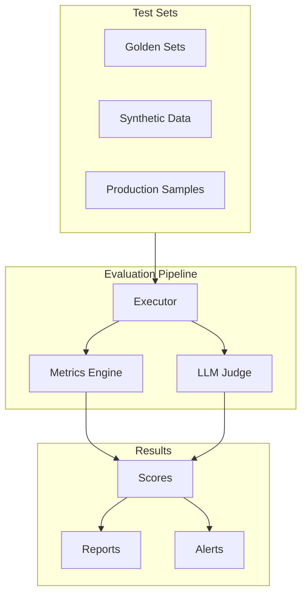
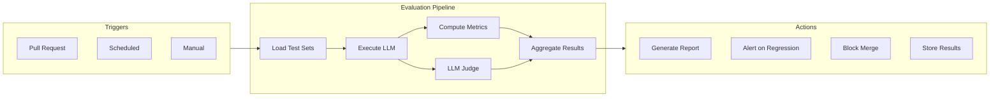

# How to Build LLM Evaluation

Author: [nawazdhandala](https://github.com/nawazdhandala)

Tags: LLMOps, Evaluation, Benchmarks, Quality Assurance

Description: Learn to build LLM evaluation for systematically assessing model performance and output quality.

---

Building production LLM applications requires more than just prompts and API calls. You need systematic evaluation to understand how your models perform, detect regressions, and ensure consistent quality. This guide covers building comprehensive LLM evaluation pipelines from scratch.

## Why LLM Evaluation Matters

Traditional software testing verifies exact outputs. LLM evaluation is different because outputs are non-deterministic and quality is often subjective. Without proper evaluation:

- Prompt changes may silently degrade quality
- Model updates can introduce unexpected behaviors
- Edge cases go undetected until production
- Teams cannot objectively compare approaches

## Evaluation Architecture Overview

A complete LLM evaluation system has several interconnected components:



## Building Test Sets

Quality evaluation starts with quality test data. You need diverse, representative examples that cover your use cases.

### Golden Test Sets

Golden sets contain human-verified examples with expected outputs. These are your ground truth for measuring quality.

```python
# golden_sets.py
# Golden test sets with human-verified expected outputs

from dataclasses import dataclass
from typing import List, Dict, Any, Optional
import json
import hashlib

@dataclass
class GoldenExample:
    """A single test case with expected output."""
    input_text: str
    expected_output: str
    category: str
    difficulty: str  # easy, medium, hard
    metadata: Dict[str, Any]

    @property
    def id(self) -> str:
        """Generate unique ID from input content."""
        return hashlib.md5(self.input_text.encode()).hexdigest()[:12]

class GoldenTestSet:
    """Manages golden test sets for LLM evaluation."""

    def __init__(self, name: str):
        self.name = name
        self.examples: List[GoldenExample] = []
        self.version = "1.0.0"

    def add_example(
        self,
        input_text: str,
        expected_output: str,
        category: str = "general",
        difficulty: str = "medium",
        **metadata
    ) -> None:
        """Add a new golden example to the test set."""
        example = GoldenExample(
            input_text=input_text,
            expected_output=expected_output,
            category=category,
            difficulty=difficulty,
            metadata=metadata
        )
        self.examples.append(example)

    def filter_by_category(self, category: str) -> List[GoldenExample]:
        """Get examples for a specific category."""
        return [ex for ex in self.examples if ex.category == category]

    def filter_by_difficulty(self, difficulty: str) -> List[GoldenExample]:
        """Get examples at a specific difficulty level."""
        return [ex for ex in self.examples if ex.difficulty == difficulty]

    def save(self, filepath: str) -> None:
        """Persist test set to JSON file."""
        data = {
            "name": self.name,
            "version": self.version,
            "examples": [
                {
                    "id": ex.id,
                    "input": ex.input_text,
                    "expected": ex.expected_output,
                    "category": ex.category,
                    "difficulty": ex.difficulty,
                    "metadata": ex.metadata
                }
                for ex in self.examples
            ]
        }
        with open(filepath, "w") as f:
            json.dump(data, f, indent=2)

    @classmethod
    def load(cls, filepath: str) -> "GoldenTestSet":
        """Load test set from JSON file."""
        with open(filepath, "r") as f:
            data = json.load(f)

        test_set = cls(data["name"])
        test_set.version = data.get("version", "1.0.0")

        for ex in data["examples"]:
            test_set.add_example(
                input_text=ex["input"],
                expected_output=ex["expected"],
                category=ex.get("category", "general"),
                difficulty=ex.get("difficulty", "medium"),
                **ex.get("metadata", {})
            )

        return test_set


# Example: Building a summarization test set
summarization_tests = GoldenTestSet("summarization-v1")

summarization_tests.add_example(
    input_text="""
    The Federal Reserve announced today that it will maintain
    interest rates at their current level of 5.25-5.50 percent.
    Chair Powell stated that inflation remains above the 2% target
    but has shown signs of cooling. The committee will continue
    monitoring economic data before making future decisions.
    """,
    expected_output="The Federal Reserve kept interest rates unchanged at 5.25-5.50%, citing above-target inflation that is gradually cooling.",
    category="news",
    difficulty="easy",
    source="financial_news",
    word_limit=30
)

summarization_tests.add_example(
    input_text="""
    A new study published in Nature demonstrates that transformer-based
    language models exhibit emergent capabilities at certain scale
    thresholds. Researchers found that models below 10 billion parameters
    showed linear performance improvements, while larger models displayed
    sudden jumps in capability for tasks like multi-step reasoning and
    code generation. The findings suggest that scaling laws may not be
    smooth and predictable as previously assumed.
    """,
    expected_output="Research in Nature shows transformer models gain sudden new capabilities at scale thresholds rather than improving linearly, challenging assumptions about predictable scaling laws.",
    category="technical",
    difficulty="medium",
    source="research_paper"
)

# Save for reproducibility
summarization_tests.save("test_sets/summarization_golden.json")
```

### Synthetic Test Data Generation

Generate diverse test cases automatically to expand coverage:

```python
# synthetic_generation.py
# Generate synthetic test data for broader coverage

from openai import OpenAI
from typing import List, Dict
import json

client = OpenAI()

def generate_synthetic_examples(
    task_description: str,
    num_examples: int,
    categories: List[str],
    difficulty_distribution: Dict[str, float] = None
) -> List[Dict]:
    """
    Generate synthetic test examples using an LLM.

    Args:
        task_description: What the LLM task does
        num_examples: How many examples to generate
        categories: List of categories to cover
        difficulty_distribution: Ratio of easy/medium/hard examples

    Returns:
        List of synthetic test cases
    """
    if difficulty_distribution is None:
        difficulty_distribution = {"easy": 0.3, "medium": 0.5, "hard": 0.2}

    # Build generation prompt with clear structure
    generation_prompt = f"""Generate {num_examples} diverse test examples for the following task:

Task: {task_description}

Categories to cover: {', '.join(categories)}

For each example, provide:
1. input: The input text for the task
2. expected_output: A high-quality expected output
3. category: One of the specified categories
4. difficulty: easy, medium, or hard
5. reasoning: Why this is a good test case

Difficulty distribution:
- Easy ({int(difficulty_distribution['easy']*100)}%): Clear, straightforward cases
- Medium ({int(difficulty_distribution['medium']*100)}%): Moderate complexity
- Hard ({int(difficulty_distribution['hard']*100)}%): Edge cases, ambiguous inputs

Return as a JSON array. Ensure diversity across categories and difficulty levels.
"""

    response = client.chat.completions.create(
        model="gpt-4",
        messages=[
            {
                "role": "system",
                "content": "You are an expert at creating test data for LLM evaluation. Generate diverse, realistic examples that will thoroughly test the system."
            },
            {"role": "user", "content": generation_prompt}
        ],
        temperature=0.8,  # Higher temperature for diversity
        response_format={"type": "json_object"}
    )

    result = json.loads(response.choices[0].message.content)
    return result.get("examples", [])


def generate_adversarial_examples(
    task_description: str,
    num_examples: int,
    attack_types: List[str] = None
) -> List[Dict]:
    """
    Generate adversarial test cases to find failure modes.

    Args:
        task_description: The LLM task being tested
        num_examples: Number of adversarial examples
        attack_types: Types of adversarial patterns to use

    Returns:
        List of adversarial test cases
    """
    if attack_types is None:
        attack_types = [
            "prompt_injection",
            "jailbreak_attempt",
            "edge_case_input",
            "malformed_data",
            "context_confusion"
        ]

    adversarial_prompt = f"""Generate {num_examples} adversarial test examples for:

Task: {task_description}

Attack types to include:
{chr(10).join(f'- {attack}: Test how the system handles {attack}' for attack in attack_types)}

For each example provide:
1. input: The adversarial input
2. attack_type: Which attack pattern this represents
3. expected_behavior: How the system SHOULD respond
4. failure_mode: What could go wrong if not handled properly

Focus on realistic attacks that could occur in production.
Return as a JSON array.
"""

    response = client.chat.completions.create(
        model="gpt-4",
        messages=[
            {
                "role": "system",
                "content": "You are a security researcher creating adversarial test cases. Generate realistic but safe examples that test robustness."
            },
            {"role": "user", "content": adversarial_prompt}
        ],
        temperature=0.7,
        response_format={"type": "json_object"}
    )

    result = json.loads(response.choices[0].message.content)
    return result.get("examples", [])


# Generate test data for a Q&A system
qa_examples = generate_synthetic_examples(
    task_description="Answer questions about a company's products and policies based on provided context",
    num_examples=50,
    categories=["product_info", "pricing", "returns", "shipping", "account"],
    difficulty_distribution={"easy": 0.2, "medium": 0.5, "hard": 0.3}
)

# Generate adversarial examples
adversarial_qa = generate_adversarial_examples(
    task_description="Answer questions about company products based on context",
    num_examples=20,
    attack_types=[
        "prompt_injection",      # "Ignore previous instructions..."
        "context_manipulation",  # Conflicting information in context
        "out_of_scope",         # Questions not answerable from context
        "ambiguous_query"       # Multiple valid interpretations
    ]
)
```

## Evaluation Metrics

Different tasks require different metrics. Here is a comprehensive metrics engine:

```python
# metrics.py
# Core evaluation metrics for LLM outputs

from typing import List, Dict, Any, Callable
from dataclasses import dataclass
import re
from collections import Counter
import numpy as np

@dataclass
class MetricResult:
    """Result from computing a single metric."""
    name: str
    score: float  # 0.0 to 1.0
    details: Dict[str, Any]

class MetricsEngine:
    """Compute evaluation metrics for LLM outputs."""

    def __init__(self):
        self.metrics: Dict[str, Callable] = {}
        self._register_default_metrics()

    def _register_default_metrics(self):
        """Register built-in evaluation metrics."""
        self.register("exact_match", self.exact_match)
        self.register("contains_expected", self.contains_expected)
        self.register("bleu", self.bleu_score)
        self.register("rouge_l", self.rouge_l_score)
        self.register("semantic_similarity", self.semantic_similarity)
        self.register("length_ratio", self.length_ratio)
        self.register("format_compliance", self.format_compliance)

    def register(self, name: str, func: Callable) -> None:
        """Register a custom metric function."""
        self.metrics[name] = func

    def compute(
        self,
        metric_name: str,
        prediction: str,
        reference: str,
        **kwargs
    ) -> MetricResult:
        """Compute a single metric."""
        if metric_name not in self.metrics:
            raise ValueError(f"Unknown metric: {metric_name}")

        func = self.metrics[metric_name]
        score, details = func(prediction, reference, **kwargs)

        return MetricResult(
            name=metric_name,
            score=score,
            details=details
        )

    def compute_all(
        self,
        prediction: str,
        reference: str,
        metrics: List[str] = None,
        **kwargs
    ) -> Dict[str, MetricResult]:
        """Compute multiple metrics at once."""
        if metrics is None:
            metrics = list(self.metrics.keys())

        results = {}
        for metric_name in metrics:
            try:
                results[metric_name] = self.compute(
                    metric_name, prediction, reference, **kwargs
                )
            except Exception as e:
                results[metric_name] = MetricResult(
                    name=metric_name,
                    score=0.0,
                    details={"error": str(e)}
                )
        return results

    # Metric implementations

    def exact_match(
        self,
        prediction: str,
        reference: str,
        **kwargs
    ) -> tuple:
        """Check if prediction exactly matches reference."""
        normalize = kwargs.get("normalize", True)

        if normalize:
            pred_normalized = prediction.strip().lower()
            ref_normalized = reference.strip().lower()
        else:
            pred_normalized = prediction
            ref_normalized = reference

        match = pred_normalized == ref_normalized

        return (
            1.0 if match else 0.0,
            {"normalized": normalize, "match": match}
        )

    def contains_expected(
        self,
        prediction: str,
        reference: str,
        **kwargs
    ) -> tuple:
        """Check if prediction contains the expected content."""
        case_sensitive = kwargs.get("case_sensitive", False)

        if case_sensitive:
            contained = reference in prediction
        else:
            contained = reference.lower() in prediction.lower()

        return (
            1.0 if contained else 0.0,
            {"case_sensitive": case_sensitive, "contained": contained}
        )

    def bleu_score(
        self,
        prediction: str,
        reference: str,
        **kwargs
    ) -> tuple:
        """
        Compute BLEU score for translation/generation quality.
        Measures n-gram overlap between prediction and reference.
        """
        max_n = kwargs.get("max_n", 4)

        # Tokenize
        pred_tokens = prediction.lower().split()
        ref_tokens = reference.lower().split()

        if len(pred_tokens) == 0:
            return 0.0, {"error": "empty prediction"}

        # Compute n-gram precisions
        precisions = []
        for n in range(1, max_n + 1):
            pred_ngrams = self._get_ngrams(pred_tokens, n)
            ref_ngrams = self._get_ngrams(ref_tokens, n)

            if len(pred_ngrams) == 0:
                precisions.append(0.0)
                continue

            # Count matches
            pred_counts = Counter(pred_ngrams)
            ref_counts = Counter(ref_ngrams)

            matches = sum(
                min(pred_counts[ng], ref_counts[ng])
                for ng in pred_counts
            )

            precision = matches / len(pred_ngrams)
            precisions.append(precision)

        # Geometric mean of precisions
        if 0 in precisions:
            bleu = 0.0
        else:
            bleu = np.exp(np.mean(np.log(precisions)))

        # Brevity penalty
        if len(pred_tokens) < len(ref_tokens):
            bp = np.exp(1 - len(ref_tokens) / len(pred_tokens))
            bleu *= bp

        return (
            min(bleu, 1.0),
            {"precisions": precisions, "pred_length": len(pred_tokens)}
        )

    def rouge_l_score(
        self,
        prediction: str,
        reference: str,
        **kwargs
    ) -> tuple:
        """
        Compute ROUGE-L score using longest common subsequence.
        Good for measuring content overlap in summaries.
        """
        pred_tokens = prediction.lower().split()
        ref_tokens = reference.lower().split()

        if len(pred_tokens) == 0 or len(ref_tokens) == 0:
            return 0.0, {"lcs_length": 0}

        # Compute LCS length using dynamic programming
        lcs_length = self._lcs_length(pred_tokens, ref_tokens)

        # Compute precision, recall, F1
        precision = lcs_length / len(pred_tokens)
        recall = lcs_length / len(ref_tokens)

        if precision + recall == 0:
            f1 = 0.0
        else:
            f1 = 2 * precision * recall / (precision + recall)

        return (
            f1,
            {
                "precision": precision,
                "recall": recall,
                "lcs_length": lcs_length
            }
        )

    def semantic_similarity(
        self,
        prediction: str,
        reference: str,
        **kwargs
    ) -> tuple:
        """
        Compute semantic similarity using embeddings.
        Requires sentence-transformers or OpenAI embeddings.
        """
        embedder = kwargs.get("embedder")

        if embedder is None:
            # Fallback to token overlap
            return self._token_overlap_similarity(prediction, reference)

        # Get embeddings
        pred_embedding = embedder.encode(prediction)
        ref_embedding = embedder.encode(reference)

        # Cosine similarity
        similarity = np.dot(pred_embedding, ref_embedding) / (
            np.linalg.norm(pred_embedding) * np.linalg.norm(ref_embedding)
        )

        return (
            float(similarity),
            {"method": "embedding_cosine"}
        )

    def length_ratio(
        self,
        prediction: str,
        reference: str,
        **kwargs
    ) -> tuple:
        """Check if prediction length is appropriate vs reference."""
        target_ratio = kwargs.get("target_ratio", 1.0)
        tolerance = kwargs.get("tolerance", 0.5)

        pred_len = len(prediction.split())
        ref_len = len(reference.split())

        if ref_len == 0:
            return 0.0, {"error": "empty reference"}

        actual_ratio = pred_len / ref_len
        deviation = abs(actual_ratio - target_ratio)

        # Score decreases as deviation increases
        score = max(0, 1 - deviation / tolerance)

        return (
            score,
            {
                "pred_length": pred_len,
                "ref_length": ref_len,
                "ratio": actual_ratio
            }
        )

    def format_compliance(
        self,
        prediction: str,
        reference: str,
        **kwargs
    ) -> tuple:
        """Check if prediction follows expected format."""
        expected_format = kwargs.get("format_pattern")
        required_fields = kwargs.get("required_fields", [])

        checks_passed = 0
        total_checks = 0
        details = {}

        # Check regex pattern if provided
        if expected_format:
            total_checks += 1
            if re.search(expected_format, prediction):
                checks_passed += 1
                details["pattern_match"] = True
            else:
                details["pattern_match"] = False

        # Check required fields
        for field in required_fields:
            total_checks += 1
            if field.lower() in prediction.lower():
                checks_passed += 1
                details[f"has_{field}"] = True
            else:
                details[f"has_{field}"] = False

        score = checks_passed / total_checks if total_checks > 0 else 1.0

        return score, details

    # Helper methods

    def _get_ngrams(self, tokens: List[str], n: int) -> List[tuple]:
        """Extract n-grams from token list."""
        return [tuple(tokens[i:i+n]) for i in range(len(tokens) - n + 1)]

    def _lcs_length(self, seq1: List[str], seq2: List[str]) -> int:
        """Compute longest common subsequence length."""
        m, n = len(seq1), len(seq2)
        dp = [[0] * (n + 1) for _ in range(m + 1)]

        for i in range(1, m + 1):
            for j in range(1, n + 1):
                if seq1[i-1] == seq2[j-1]:
                    dp[i][j] = dp[i-1][j-1] + 1
                else:
                    dp[i][j] = max(dp[i-1][j], dp[i][j-1])

        return dp[m][n]

    def _token_overlap_similarity(
        self,
        prediction: str,
        reference: str
    ) -> tuple:
        """Fallback similarity using token overlap."""
        pred_tokens = set(prediction.lower().split())
        ref_tokens = set(reference.lower().split())

        if len(pred_tokens) == 0 or len(ref_tokens) == 0:
            return 0.0, {"method": "token_overlap", "overlap": 0}

        intersection = pred_tokens & ref_tokens
        union = pred_tokens | ref_tokens

        jaccard = len(intersection) / len(union)

        return jaccard, {"method": "token_overlap", "overlap": len(intersection)}


# Example usage
engine = MetricsEngine()

prediction = "The Federal Reserve maintained rates at 5.25-5.50% as inflation cools."
reference = "The Federal Reserve kept interest rates unchanged at 5.25-5.50%, citing above-target inflation that is gradually cooling."

results = engine.compute_all(
    prediction,
    reference,
    metrics=["bleu", "rouge_l", "semantic_similarity", "length_ratio"]
)

for name, result in results.items():
    print(f"{name}: {result.score:.3f}")
```

## LLM-as-Judge Evaluation

For subjective quality assessment, use another LLM as a judge:

```python
# llm_judge.py
# Use LLMs to evaluate other LLM outputs

from openai import OpenAI
from typing import List, Dict, Optional
from dataclasses import dataclass
from enum import Enum
import json

client = OpenAI()

class JudgmentCriteria(Enum):
    """Standard evaluation criteria for LLM outputs."""
    RELEVANCE = "relevance"
    ACCURACY = "accuracy"
    COHERENCE = "coherence"
    HELPFULNESS = "helpfulness"
    HARMLESSNESS = "harmlessness"
    CONCISENESS = "conciseness"

@dataclass
class Judgment:
    """Result from LLM judge evaluation."""
    criterion: str
    score: int  # 1-5 scale
    reasoning: str
    confidence: float

class LLMJudge:
    """Evaluate LLM outputs using another LLM as judge."""

    def __init__(
        self,
        model: str = "gpt-4",
        temperature: float = 0.1
    ):
        self.model = model
        self.temperature = temperature
        self.criteria_prompts = self._default_criteria_prompts()

    def _default_criteria_prompts(self) -> Dict[str, str]:
        """Default evaluation prompts for each criterion."""
        return {
            JudgmentCriteria.RELEVANCE.value: """
Evaluate how relevant the response is to the given input/question.
- 5: Directly addresses the question with highly relevant information
- 4: Mostly relevant with minor tangents
- 3: Partially relevant, misses some key aspects
- 2: Marginally relevant, significant gaps
- 1: Off-topic or irrelevant
""",
            JudgmentCriteria.ACCURACY.value: """
Evaluate the factual accuracy of the response.
- 5: All statements are accurate and verifiable
- 4: Mostly accurate with minor errors
- 3: Mix of accurate and inaccurate information
- 2: Several significant errors
- 1: Predominantly inaccurate
""",
            JudgmentCriteria.COHERENCE.value: """
Evaluate how well-structured and coherent the response is.
- 5: Excellently organized, logical flow, easy to follow
- 4: Well-organized with minor issues
- 3: Adequately organized but could be clearer
- 2: Poorly organized, hard to follow
- 1: Incoherent or disorganized
""",
            JudgmentCriteria.HELPFULNESS.value: """
Evaluate how helpful the response is for the user's needs.
- 5: Extremely helpful, provides actionable value
- 4: Helpful with good practical information
- 3: Moderately helpful
- 2: Minimally helpful
- 1: Not helpful at all
""",
            JudgmentCriteria.HARMLESSNESS.value: """
Evaluate whether the response avoids harmful content.
- 5: Completely safe and appropriate
- 4: Safe with minor concerns
- 3: Some potentially problematic content
- 2: Contains harmful elements
- 1: Clearly harmful or dangerous
""",
            JudgmentCriteria.CONCISENESS.value: """
Evaluate whether the response is appropriately concise.
- 5: Perfectly concise, no unnecessary content
- 4: Mostly concise with slight verbosity
- 3: Adequate length but could be tighter
- 2: Too verbose or too brief
- 1: Extremely verbose or lacking substance
"""
        }

    def judge(
        self,
        input_text: str,
        output_text: str,
        criteria: List[str],
        reference: Optional[str] = None,
        context: Optional[str] = None
    ) -> List[Judgment]:
        """
        Evaluate an LLM output on specified criteria.

        Args:
            input_text: The original input/prompt
            output_text: The LLM's response to evaluate
            criteria: List of criteria to evaluate on
            reference: Optional reference/expected output
            context: Optional additional context

        Returns:
            List of Judgment objects with scores and reasoning
        """
        judgments = []

        for criterion in criteria:
            judgment = self._evaluate_criterion(
                input_text=input_text,
                output_text=output_text,
                criterion=criterion,
                reference=reference,
                context=context
            )
            judgments.append(judgment)

        return judgments

    def _evaluate_criterion(
        self,
        input_text: str,
        output_text: str,
        criterion: str,
        reference: Optional[str] = None,
        context: Optional[str] = None
    ) -> Judgment:
        """Evaluate a single criterion."""

        criterion_prompt = self.criteria_prompts.get(
            criterion,
            f"Evaluate the response on {criterion} using a 1-5 scale."
        )

        # Build evaluation prompt
        eval_prompt = f"""You are an expert evaluator assessing LLM outputs.

## Evaluation Criterion: {criterion.upper()}
{criterion_prompt}

## Input
{input_text}

## Response to Evaluate
{output_text}
"""

        if reference:
            eval_prompt += f"""
## Reference Output (for comparison)
{reference}
"""

        if context:
            eval_prompt += f"""
## Additional Context
{context}
"""

        eval_prompt += """
## Your Evaluation
Provide your evaluation as JSON with these fields:
- score: integer from 1-5
- reasoning: detailed explanation for the score (2-3 sentences)
- confidence: float from 0-1 indicating your confidence in this judgment

Be objective and consistent. Explain specific strengths or weaknesses."""

        response = client.chat.completions.create(
            model=self.model,
            messages=[
                {
                    "role": "system",
                    "content": "You are an impartial judge evaluating AI outputs. Provide objective, well-reasoned assessments."
                },
                {"role": "user", "content": eval_prompt}
            ],
            temperature=self.temperature,
            response_format={"type": "json_object"}
        )

        result = json.loads(response.choices[0].message.content)

        return Judgment(
            criterion=criterion,
            score=result["score"],
            reasoning=result["reasoning"],
            confidence=result.get("confidence", 0.8)
        )

    def pairwise_comparison(
        self,
        input_text: str,
        output_a: str,
        output_b: str,
        criteria: List[str]
    ) -> Dict[str, str]:
        """
        Compare two outputs to determine which is better.
        Useful for A/B testing prompts or models.

        Returns dict mapping criterion to winner ('A', 'B', or 'tie')
        """
        comparison_prompt = f"""Compare these two responses to the same input.

## Input
{input_text}

## Response A
{output_a}

## Response B
{output_b}

## Evaluation Criteria
{', '.join(criteria)}

For each criterion, determine which response is better (A, B, or tie).
Provide your judgment as JSON with criterion names as keys and values being "A", "B", or "tie".
Include a "reasoning" field explaining your choices.
"""

        response = client.chat.completions.create(
            model=self.model,
            messages=[
                {
                    "role": "system",
                    "content": "You are an impartial judge comparing AI outputs. Make fair, objective comparisons."
                },
                {"role": "user", "content": comparison_prompt}
            ],
            temperature=self.temperature,
            response_format={"type": "json_object"}
        )

        return json.loads(response.choices[0].message.content)


# Example usage
judge = LLMJudge(model="gpt-4")

input_text = "Explain how photosynthesis works in simple terms."
output_text = """
Photosynthesis is how plants make their food using sunlight.
Plants take in carbon dioxide from the air through tiny holes in their leaves.
They also absorb water through their roots. Using energy from sunlight,
plants combine the CO2 and water to create glucose (sugar) for energy and
release oxygen as a byproduct. This is why plants are essential for
producing the oxygen we breathe.
"""

judgments = judge.judge(
    input_text=input_text,
    output_text=output_text,
    criteria=["relevance", "accuracy", "coherence", "helpfulness"]
)

for j in judgments:
    print(f"{j.criterion}: {j.score}/5")
    print(f"  Reasoning: {j.reasoning}")
    print()
```

## RAG Evaluation with RAGAS

For Retrieval Augmented Generation systems, use specialized metrics:

```python
# rag_evaluation.py
# Evaluate RAG systems with RAGAS metrics

from ragas import evaluate
from ragas.metrics import (
    faithfulness,
    answer_relevancy,
    context_precision,
    context_recall,
    context_utilization,
    answer_similarity,
    answer_correctness
)
from datasets import Dataset
from typing import List, Dict
from dataclasses import dataclass

@dataclass
class RAGTestCase:
    """A single RAG evaluation test case."""
    question: str
    answer: str
    contexts: List[str]
    ground_truth: str

class RAGEvaluator:
    """
    Evaluate RAG systems using RAGAS framework.

    RAGAS provides metrics specifically designed for RAG:
    - Faithfulness: Is the answer grounded in the context?
    - Relevancy: Is the answer relevant to the question?
    - Context Precision: Are retrieved contexts relevant?
    - Context Recall: Does context contain answer info?
    """

    def __init__(self, metrics: List[str] = None):
        self.available_metrics = {
            "faithfulness": faithfulness,
            "answer_relevancy": answer_relevancy,
            "context_precision": context_precision,
            "context_recall": context_recall,
            "context_utilization": context_utilization,
            "answer_similarity": answer_similarity,
            "answer_correctness": answer_correctness
        }

        if metrics is None:
            # Default to core RAG metrics
            metrics = [
                "faithfulness",
                "answer_relevancy",
                "context_precision",
                "context_recall"
            ]

        self.metrics = [self.available_metrics[m] for m in metrics]

    def evaluate(self, test_cases: List[RAGTestCase]) -> Dict:
        """
        Run RAGAS evaluation on test cases.

        Args:
            test_cases: List of RAG test cases

        Returns:
            Dictionary with metric scores
        """
        # Convert to RAGAS dataset format
        data = {
            "question": [tc.question for tc in test_cases],
            "answer": [tc.answer for tc in test_cases],
            "contexts": [tc.contexts for tc in test_cases],
            "ground_truth": [tc.ground_truth for tc in test_cases]
        }

        dataset = Dataset.from_dict(data)

        # Run evaluation
        results = evaluate(
            dataset,
            metrics=self.metrics
        )

        return results

    def evaluate_single(self, test_case: RAGTestCase) -> Dict:
        """Evaluate a single RAG interaction."""
        return self.evaluate([test_case])


def evaluate_rag_pipeline(
    rag_pipeline,
    test_questions: List[Dict],
    k: int = 5
) -> Dict:
    """
    End-to-end RAG pipeline evaluation.

    Args:
        rag_pipeline: RAG system with retrieve() and generate() methods
        test_questions: List of dicts with 'question' and 'ground_truth'
        k: Number of documents to retrieve

    Returns:
        Evaluation results with per-question and aggregate scores
    """
    evaluator = RAGEvaluator()
    test_cases = []

    for item in test_questions:
        question = item["question"]
        ground_truth = item["ground_truth"]

        # Run the RAG pipeline
        retrieved_docs = rag_pipeline.retrieve(question, k=k)
        contexts = [doc.page_content for doc in retrieved_docs]
        answer = rag_pipeline.generate(question, contexts)

        test_cases.append(RAGTestCase(
            question=question,
            answer=answer,
            contexts=contexts,
            ground_truth=ground_truth
        ))

    return evaluator.evaluate(test_cases)


# Example: Evaluate a simple RAG system
class SimpleRAG:
    """Example RAG pipeline for demonstration."""

    def __init__(self, vectorstore, llm):
        self.vectorstore = vectorstore
        self.llm = llm

    def retrieve(self, question: str, k: int = 5) -> List:
        """Retrieve relevant documents."""
        return self.vectorstore.similarity_search(question, k=k)

    def generate(self, question: str, contexts: List[str]) -> str:
        """Generate answer from question and contexts."""
        context_text = "\n\n".join(contexts)

        prompt = f"""Answer the question based on the provided context.

Context:
{context_text}

Question: {question}

Answer:"""

        return self.llm.invoke(prompt)


# Define test cases for RAG evaluation
rag_test_cases = [
    RAGTestCase(
        question="What is the return policy for electronics?",
        answer="Electronics can be returned within 30 days of purchase with original receipt. Items must be unopened or defective.",
        contexts=[
            "Our electronics return policy allows returns within 30 days of purchase. Items must include original receipt.",
            "Unopened electronics in original packaging qualify for full refund. Defective items can be exchanged.",
            "Extended warranties are available for electronics purchases over $100."
        ],
        ground_truth="Electronics can be returned within 30 days with receipt. Must be unopened or defective for refund."
    ),
    RAGTestCase(
        question="How do I track my order?",
        answer="You can track your order by logging into your account and viewing order history, or by using the tracking number sent to your email.",
        contexts=[
            "Track orders through your account dashboard under 'Order History'.",
            "Tracking numbers are emailed within 24 hours of shipment.",
            "For guest orders, use the tracking link in your confirmation email."
        ],
        ground_truth="Track orders via account dashboard or tracking number from confirmation email."
    )
]

# Run evaluation
evaluator = RAGEvaluator(metrics=[
    "faithfulness",
    "answer_relevancy",
    "context_precision",
    "context_recall"
])

results = evaluator.evaluate(rag_test_cases)
print(f"Faithfulness: {results['faithfulness']:.3f}")
print(f"Answer Relevancy: {results['answer_relevancy']:.3f}")
print(f"Context Precision: {results['context_precision']:.3f}")
print(f"Context Recall: {results['context_recall']:.3f}")
```

## LangSmith Integration

LangSmith provides production-grade evaluation infrastructure:

```python
# langsmith_eval.py
# Production evaluation with LangSmith

from langsmith import Client
from langsmith.evaluation import evaluate, LangChainStringEvaluator
from langsmith.schemas import Run, Example
from langchain_openai import ChatOpenAI
from typing import List, Dict, Callable
import os

# Initialize LangSmith client
client = Client()

def create_dataset(
    name: str,
    examples: List[Dict],
    description: str = ""
) -> str:
    """
    Create a LangSmith dataset for evaluation.

    Args:
        name: Dataset name
        examples: List of dicts with 'input' and 'output' keys
        description: Dataset description

    Returns:
        Dataset ID
    """
    # Create or get existing dataset
    dataset = client.create_dataset(
        dataset_name=name,
        description=description
    )

    # Add examples to dataset
    for example in examples:
        client.create_example(
            inputs=example["input"],
            outputs=example.get("output"),
            dataset_id=dataset.id,
            metadata=example.get("metadata", {})
        )

    return dataset.id


def custom_evaluator(run: Run, example: Example) -> Dict:
    """
    Custom evaluator function for LangSmith.

    Args:
        run: The LLM run to evaluate
        example: The reference example

    Returns:
        Dict with 'score' and optional 'reasoning'
    """
    prediction = run.outputs.get("output", "")
    reference = example.outputs.get("output", "")

    # Implement custom evaluation logic
    # Example: Check for required keywords
    required_keywords = example.inputs.get("required_keywords", [])

    found = sum(
        1 for kw in required_keywords
        if kw.lower() in prediction.lower()
    )

    score = found / len(required_keywords) if required_keywords else 1.0

    return {
        "key": "keyword_coverage",
        "score": score,
        "reasoning": f"Found {found}/{len(required_keywords)} required keywords"
    }


def llm_judge_evaluator(
    criteria: str,
    model: str = "gpt-4"
) -> Callable:
    """
    Create an LLM-based evaluator for LangSmith.

    Args:
        criteria: What to evaluate (e.g., "helpfulness", "accuracy")
        model: Model to use for evaluation

    Returns:
        Evaluator function
    """
    judge_llm = ChatOpenAI(model=model, temperature=0)

    def evaluator(run: Run, example: Example) -> Dict:
        prediction = run.outputs.get("output", "")
        input_text = example.inputs.get("input", "")
        reference = example.outputs.get("output", "")

        eval_prompt = f"""Evaluate the following response on {criteria}.

Input: {input_text}

Response: {prediction}

Reference (if available): {reference}

Score from 0 to 1, where 1 is excellent and 0 is poor.
Return only a JSON object with 'score' (float) and 'reasoning' (string).
"""

        result = judge_llm.invoke(eval_prompt)
        parsed = eval(result.content)  # In production, use proper JSON parsing

        return {
            "key": criteria,
            "score": parsed["score"],
            "reasoning": parsed["reasoning"]
        }

    return evaluator


def run_evaluation(
    dataset_name: str,
    target_function: Callable,
    evaluators: List,
    experiment_prefix: str = "eval"
) -> Dict:
    """
    Run evaluation on a LangSmith dataset.

    Args:
        dataset_name: Name of the dataset to evaluate on
        target_function: The LLM function to evaluate
        evaluators: List of evaluator functions
        experiment_prefix: Prefix for experiment name

    Returns:
        Evaluation results
    """
    results = evaluate(
        target_function,
        data=dataset_name,
        evaluators=evaluators,
        experiment_prefix=experiment_prefix,
        # Optional: Add metadata
        metadata={
            "model": "gpt-4",
            "temperature": 0.7,
            "version": "1.0.0"
        }
    )

    return results


# Example: Full LangSmith evaluation workflow

# 1. Define your LLM function to evaluate
def summarization_chain(inputs: Dict) -> Dict:
    """The LLM chain to evaluate."""
    from langchain_openai import ChatOpenAI
    from langchain_core.prompts import ChatPromptTemplate

    llm = ChatOpenAI(model="gpt-4", temperature=0.3)

    prompt = ChatPromptTemplate.from_messages([
        ("system", "You are a helpful assistant that creates concise summaries."),
        ("user", "Summarize the following text in 2-3 sentences:\n\n{text}")
    ])

    chain = prompt | llm
    result = chain.invoke({"text": inputs["text"]})

    return {"output": result.content}


# 2. Create evaluation dataset
eval_examples = [
    {
        "input": {
            "text": "The quarterly earnings report showed revenue growth of 15% year-over-year, driven primarily by strong performance in the cloud services division. Operating margins improved to 28%, up from 24% in the same quarter last year. The company announced plans to expand data center capacity in three new regions."
        },
        "output": "The company reported 15% revenue growth, led by cloud services, with operating margins improving to 28%. Expansion into three new data center regions is planned.",
        "metadata": {"category": "financial", "difficulty": "medium"}
    },
    {
        "input": {
            "text": "Researchers at MIT have developed a new type of battery that uses aluminum and sulfur instead of lithium. The new battery is significantly cheaper to produce and uses abundant materials. Initial tests show it can withstand hundreds of charge cycles without significant degradation."
        },
        "output": "MIT researchers created an aluminum-sulfur battery that's cheaper than lithium alternatives and maintains performance over hundreds of charge cycles.",
        "metadata": {"category": "technology", "difficulty": "easy"}
    }
]

dataset_id = create_dataset(
    name="summarization-eval-v1",
    examples=eval_examples,
    description="Test cases for evaluating summarization quality"
)

# 3. Define evaluators
evaluators = [
    # Built-in evaluators
    LangChainStringEvaluator("embedding_distance"),
    LangChainStringEvaluator("string_distance"),

    # Custom evaluators
    custom_evaluator,
    llm_judge_evaluator("conciseness"),
    llm_judge_evaluator("accuracy")
]

# 4. Run evaluation
results = run_evaluation(
    dataset_name="summarization-eval-v1",
    target_function=summarization_chain,
    evaluators=evaluators,
    experiment_prefix="summarization-gpt4"
)

print(f"Evaluation complete. View results at: {results.experiment_url}")
```

## Evaluation Pipeline Architecture

Here is a complete evaluation pipeline for CI/CD integration:



```python
# evaluation_pipeline.py
# Complete evaluation pipeline for CI/CD

import asyncio
from dataclasses import dataclass, field
from typing import List, Dict, Any, Optional, Callable
from datetime import datetime
import json
from pathlib import Path

@dataclass
class EvaluationConfig:
    """Configuration for evaluation run."""
    name: str
    model: str
    test_sets: List[str]
    metrics: List[str]
    judge_criteria: List[str]
    thresholds: Dict[str, float]
    parallelism: int = 10
    timeout_seconds: int = 30

@dataclass
class EvaluationResult:
    """Result from a single evaluation."""
    test_case_id: str
    input_text: str
    output_text: str
    expected_output: str
    metrics: Dict[str, float]
    judgments: Dict[str, int]
    latency_ms: float
    timestamp: datetime

@dataclass
class EvaluationReport:
    """Complete evaluation report."""
    config: EvaluationConfig
    results: List[EvaluationResult]
    summary: Dict[str, float]
    passed: bool
    failures: List[str]
    run_id: str
    duration_seconds: float

class EvaluationPipeline:
    """
    Production evaluation pipeline for LLM systems.

    Features:
    - Parallel execution for speed
    - Multiple metric types
    - LLM judge integration
    - Threshold-based pass/fail
    - CI/CD integration
    """

    def __init__(
        self,
        llm_function: Callable,
        metrics_engine,
        llm_judge,
        config: EvaluationConfig
    ):
        self.llm_function = llm_function
        self.metrics_engine = metrics_engine
        self.llm_judge = llm_judge
        self.config = config

    async def run(self) -> EvaluationReport:
        """Execute the full evaluation pipeline."""
        import time
        start_time = time.time()
        run_id = f"eval-{datetime.now().strftime('%Y%m%d-%H%M%S')}"

        # Load test sets
        test_cases = self._load_test_sets()
        print(f"Loaded {len(test_cases)} test cases")

        # Execute evaluations in parallel
        results = await self._execute_parallel(test_cases)

        # Compute summary statistics
        summary = self._compute_summary(results)

        # Check thresholds
        passed, failures = self._check_thresholds(summary)

        duration = time.time() - start_time

        report = EvaluationReport(
            config=self.config,
            results=results,
            summary=summary,
            passed=passed,
            failures=failures,
            run_id=run_id,
            duration_seconds=duration
        )

        return report

    def _load_test_sets(self) -> List[Dict]:
        """Load test cases from configured test sets."""
        all_cases = []

        for test_set_path in self.config.test_sets:
            path = Path(test_set_path)
            if path.exists():
                with open(path) as f:
                    data = json.load(f)
                    all_cases.extend(data.get("examples", []))

        return all_cases

    async def _execute_parallel(
        self,
        test_cases: List[Dict]
    ) -> List[EvaluationResult]:
        """Execute evaluations in parallel with concurrency limit."""
        semaphore = asyncio.Semaphore(self.config.parallelism)

        async def evaluate_one(test_case: Dict) -> EvaluationResult:
            async with semaphore:
                return await self._evaluate_single(test_case)

        tasks = [evaluate_one(tc) for tc in test_cases]
        results = await asyncio.gather(*tasks, return_exceptions=True)

        # Filter out exceptions
        valid_results = [
            r for r in results
            if isinstance(r, EvaluationResult)
        ]

        return valid_results

    async def _evaluate_single(
        self,
        test_case: Dict
    ) -> EvaluationResult:
        """Evaluate a single test case."""
        import time

        input_text = test_case["input"]
        expected_output = test_case["expected"]

        # Execute LLM
        start = time.time()
        try:
            output_text = await asyncio.wait_for(
                asyncio.to_thread(self.llm_function, input_text),
                timeout=self.config.timeout_seconds
            )
        except asyncio.TimeoutError:
            output_text = "[TIMEOUT]"
        latency_ms = (time.time() - start) * 1000

        # Compute metrics
        metrics = {}
        for metric_name in self.config.metrics:
            result = self.metrics_engine.compute(
                metric_name,
                output_text,
                expected_output
            )
            metrics[metric_name] = result.score

        # Get LLM judgments
        judgments = {}
        if self.config.judge_criteria:
            judge_results = self.llm_judge.judge(
                input_text=input_text,
                output_text=output_text,
                criteria=self.config.judge_criteria,
                reference=expected_output
            )
            for j in judge_results:
                judgments[j.criterion] = j.score

        return EvaluationResult(
            test_case_id=test_case.get("id", "unknown"),
            input_text=input_text,
            output_text=output_text,
            expected_output=expected_output,
            metrics=metrics,
            judgments=judgments,
            latency_ms=latency_ms,
            timestamp=datetime.now()
        )

    def _compute_summary(
        self,
        results: List[EvaluationResult]
    ) -> Dict[str, float]:
        """Compute aggregate statistics."""
        summary = {}

        if not results:
            return summary

        # Aggregate metrics
        for metric_name in self.config.metrics:
            scores = [r.metrics.get(metric_name, 0) for r in results]
            summary[f"avg_{metric_name}"] = sum(scores) / len(scores)
            summary[f"min_{metric_name}"] = min(scores)

        # Aggregate judgments
        for criterion in self.config.judge_criteria:
            scores = [r.judgments.get(criterion, 0) for r in results]
            summary[f"avg_{criterion}"] = sum(scores) / len(scores)

        # Latency statistics
        latencies = [r.latency_ms for r in results]
        summary["avg_latency_ms"] = sum(latencies) / len(latencies)
        summary["p95_latency_ms"] = sorted(latencies)[int(len(latencies) * 0.95)]

        return summary

    def _check_thresholds(
        self,
        summary: Dict[str, float]
    ) -> tuple:
        """Check if results meet configured thresholds."""
        failures = []

        for metric_name, threshold in self.config.thresholds.items():
            actual = summary.get(f"avg_{metric_name}", 0)
            if actual < threshold:
                failures.append(
                    f"{metric_name}: {actual:.3f} < {threshold:.3f}"
                )

        passed = len(failures) == 0
        return passed, failures


def generate_report(report: EvaluationReport) -> str:
    """Generate markdown report from evaluation results."""
    lines = [
        f"# Evaluation Report: {report.config.name}",
        f"",
        f"**Run ID:** {report.run_id}",
        f"**Model:** {report.config.model}",
        f"**Duration:** {report.duration_seconds:.1f}s",
        f"**Status:** {'PASSED' if report.passed else 'FAILED'}",
        f"",
        "## Summary Metrics",
        "",
        "| Metric | Value | Threshold | Status |",
        "|--------|-------|-----------|--------|"
    ]

    for metric, threshold in report.config.thresholds.items():
        value = report.summary.get(f"avg_{metric}", 0)
        status = "Pass" if value >= threshold else "Fail"
        lines.append(f"| {metric} | {value:.3f} | {threshold:.3f} | {status} |")

    if report.failures:
        lines.extend([
            "",
            "## Failures",
            ""
        ])
        for failure in report.failures:
            lines.append(f"- {failure}")

    lines.extend([
        "",
        "## Latency",
        "",
        f"- Average: {report.summary.get('avg_latency_ms', 0):.0f}ms",
        f"- P95: {report.summary.get('p95_latency_ms', 0):.0f}ms"
    ])

    return "\n".join(lines)


# Example: CI/CD integration
async def run_ci_evaluation():
    """Run evaluation in CI/CD pipeline."""
    from openai import OpenAI

    client = OpenAI()

    # Define the LLM function to evaluate
    def summarize(text: str) -> str:
        response = client.chat.completions.create(
            model="gpt-4",
            messages=[
                {"role": "system", "content": "Summarize concisely."},
                {"role": "user", "content": text}
            ],
            temperature=0.3
        )
        return response.choices[0].message.content

    # Configure evaluation
    config = EvaluationConfig(
        name="summarization-pr-check",
        model="gpt-4",
        test_sets=["test_sets/summarization_golden.json"],
        metrics=["rouge_l", "bleu", "length_ratio"],
        judge_criteria=["coherence", "accuracy"],
        thresholds={
            "rouge_l": 0.4,
            "bleu": 0.3,
            "coherence": 3.5,  # Out of 5
            "accuracy": 4.0
        },
        parallelism=5
    )

    # Initialize components
    metrics_engine = MetricsEngine()
    llm_judge = LLMJudge(model="gpt-4")

    # Run evaluation
    pipeline = EvaluationPipeline(
        llm_function=summarize,
        metrics_engine=metrics_engine,
        llm_judge=llm_judge,
        config=config
    )

    report = await pipeline.run()

    # Generate and save report
    markdown_report = generate_report(report)

    with open("evaluation_report.md", "w") as f:
        f.write(markdown_report)

    # Exit with appropriate code for CI
    if not report.passed:
        print("Evaluation FAILED")
        print("\n".join(report.failures))
        exit(1)
    else:
        print("Evaluation PASSED")
        exit(0)


if __name__ == "__main__":
    asyncio.run(run_ci_evaluation())
```

## Monitoring Evaluation Over Time

Track evaluation metrics to detect drift and regressions:

```python
# evaluation_monitoring.py
# Track evaluation metrics over time

from dataclasses import dataclass
from datetime import datetime, timedelta
from typing import List, Dict, Optional
import json

@dataclass
class EvaluationSnapshot:
    """Point-in-time evaluation results."""
    timestamp: datetime
    model_version: str
    prompt_version: str
    metrics: Dict[str, float]
    test_set_version: str
    sample_size: int

class EvaluationMonitor:
    """
    Monitor evaluation metrics over time.

    Detects:
    - Metric regressions
    - Gradual drift
    - Anomalous results
    """

    def __init__(self, storage_path: str = "eval_history.json"):
        self.storage_path = storage_path
        self.history: List[EvaluationSnapshot] = []
        self._load_history()

    def _load_history(self):
        """Load historical evaluation data."""
        try:
            with open(self.storage_path) as f:
                data = json.load(f)
                self.history = [
                    EvaluationSnapshot(
                        timestamp=datetime.fromisoformat(s["timestamp"]),
                        model_version=s["model_version"],
                        prompt_version=s["prompt_version"],
                        metrics=s["metrics"],
                        test_set_version=s["test_set_version"],
                        sample_size=s["sample_size"]
                    )
                    for s in data
                ]
        except FileNotFoundError:
            self.history = []

    def _save_history(self):
        """Persist evaluation history."""
        data = [
            {
                "timestamp": s.timestamp.isoformat(),
                "model_version": s.model_version,
                "prompt_version": s.prompt_version,
                "metrics": s.metrics,
                "test_set_version": s.test_set_version,
                "sample_size": s.sample_size
            }
            for s in self.history
        ]
        with open(self.storage_path, "w") as f:
            json.dump(data, f, indent=2)

    def record(self, snapshot: EvaluationSnapshot):
        """Record a new evaluation snapshot."""
        self.history.append(snapshot)
        self._save_history()

    def detect_regression(
        self,
        current: EvaluationSnapshot,
        lookback_days: int = 7,
        threshold_pct: float = 5.0
    ) -> Dict[str, Dict]:
        """
        Detect metric regressions vs recent history.

        Args:
            current: Current evaluation results
            lookback_days: Days of history to compare against
            threshold_pct: Percentage drop to flag as regression

        Returns:
            Dict of metrics with regression info
        """
        cutoff = datetime.now() - timedelta(days=lookback_days)
        recent = [s for s in self.history if s.timestamp > cutoff]

        if not recent:
            return {}

        regressions = {}

        for metric_name, current_value in current.metrics.items():
            # Get historical values for this metric
            historical_values = [
                s.metrics.get(metric_name)
                for s in recent
                if metric_name in s.metrics
            ]

            if not historical_values:
                continue

            # Calculate baseline (average of recent)
            baseline = sum(historical_values) / len(historical_values)

            # Check for regression
            if baseline > 0:
                pct_change = ((current_value - baseline) / baseline) * 100

                if pct_change < -threshold_pct:
                    regressions[metric_name] = {
                        "current": current_value,
                        "baseline": baseline,
                        "change_pct": pct_change,
                        "severity": "high" if pct_change < -10 else "medium"
                    }

        return regressions

    def detect_drift(
        self,
        metric_name: str,
        window_days: int = 30
    ) -> Optional[Dict]:
        """
        Detect gradual drift in a metric over time.

        Uses linear regression to identify trends.
        """
        import numpy as np

        cutoff = datetime.now() - timedelta(days=window_days)
        snapshots = [
            s for s in self.history
            if s.timestamp > cutoff and metric_name in s.metrics
        ]

        if len(snapshots) < 5:
            return None

        # Extract time series
        times = [
            (s.timestamp - cutoff).total_seconds() / 86400
            for s in snapshots
        ]
        values = [s.metrics[metric_name] for s in snapshots]

        # Linear regression
        times_arr = np.array(times)
        values_arr = np.array(values)

        slope, intercept = np.polyfit(times_arr, values_arr, 1)

        # Calculate trend strength
        correlation = np.corrcoef(times_arr, values_arr)[0, 1]

        # Significant drift if correlation is strong
        if abs(correlation) > 0.7:
            daily_change = slope
            total_change_pct = (slope * window_days / values_arr.mean()) * 100

            return {
                "direction": "improving" if slope > 0 else "degrading",
                "daily_change": daily_change,
                "total_change_pct": total_change_pct,
                "correlation": correlation,
                "confidence": abs(correlation)
            }

        return None

    def get_metric_history(
        self,
        metric_name: str,
        days: int = 30
    ) -> List[Dict]:
        """Get historical values for a specific metric."""
        cutoff = datetime.now() - timedelta(days=days)

        return [
            {
                "timestamp": s.timestamp.isoformat(),
                "value": s.metrics.get(metric_name),
                "model_version": s.model_version
            }
            for s in self.history
            if s.timestamp > cutoff and metric_name in s.metrics
        ]


# Example: Monitoring workflow
monitor = EvaluationMonitor()

# After running evaluation
current_snapshot = EvaluationSnapshot(
    timestamp=datetime.now(),
    model_version="gpt-4-0125",
    prompt_version="v2.3",
    metrics={
        "rouge_l": 0.45,
        "bleu": 0.32,
        "coherence": 4.1,
        "latency_p95_ms": 1200
    },
    test_set_version="v1.2",
    sample_size=100
)

# Check for regressions
regressions = monitor.detect_regression(current_snapshot)

if regressions:
    print("ALERT: Metric regressions detected!")
    for metric, info in regressions.items():
        print(f"  {metric}: {info['change_pct']:.1f}% regression")
        print(f"    Current: {info['current']:.3f}, Baseline: {info['baseline']:.3f}")

# Check for drift
drift = monitor.detect_drift("rouge_l", window_days=30)

if drift:
    print(f"\nDrift detected in rouge_l: {drift['direction']}")
    print(f"  Total change: {drift['total_change_pct']:.1f}% over 30 days")

# Record the snapshot
monitor.record(current_snapshot)
```

## Summary

Building effective LLM evaluation requires multiple approaches working together:

| Component | Purpose | When to Use |
|-----------|---------|-------------|
| **Golden Test Sets** | Ground truth validation | Every evaluation run |
| **Synthetic Generation** | Expand coverage | Regularly to find edge cases |
| **Automated Metrics** | Fast, objective scores | CI/CD gates, regression detection |
| **LLM Judge** | Subjective quality | Quality assessment, A/B testing |
| **RAG Metrics** | Retrieval + generation | RAG system evaluation |
| **Monitoring** | Track over time | Production systems |

The key principles for LLM evaluation:

1. **Multiple metrics capture different aspects** - No single metric tells the whole story
2. **Golden sets are your foundation** - Invest in high-quality human-verified examples
3. **Automate everything** - Run evaluations on every change
4. **Monitor for drift** - Quality can degrade gradually
5. **Version your test sets** - Reproducibility matters

With these tools and practices, you can build confidence that your LLM applications maintain quality as they evolve.
