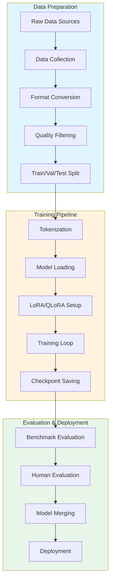
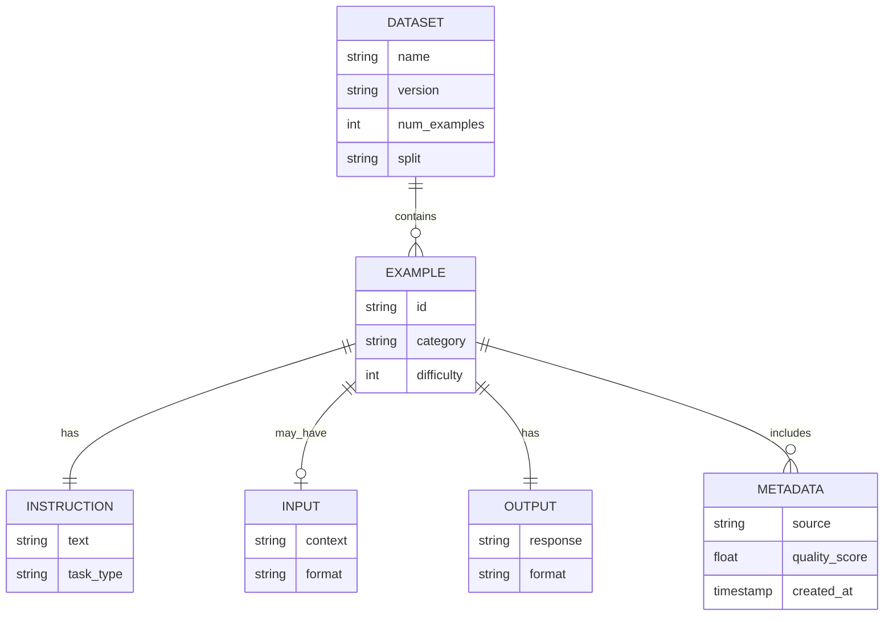
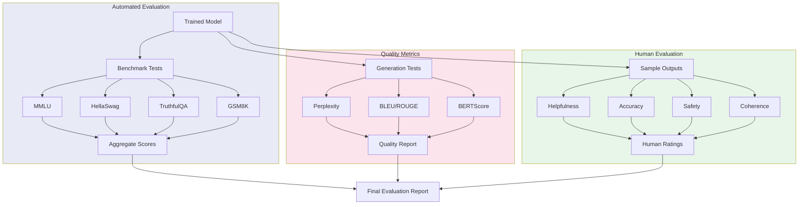
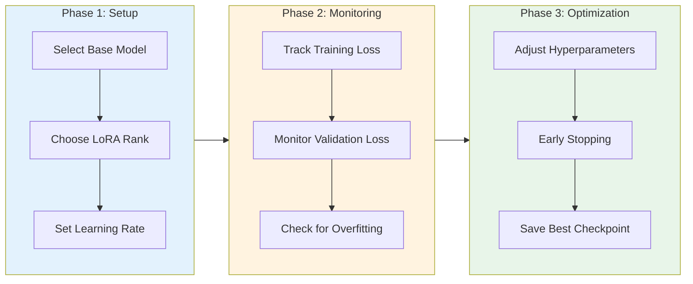
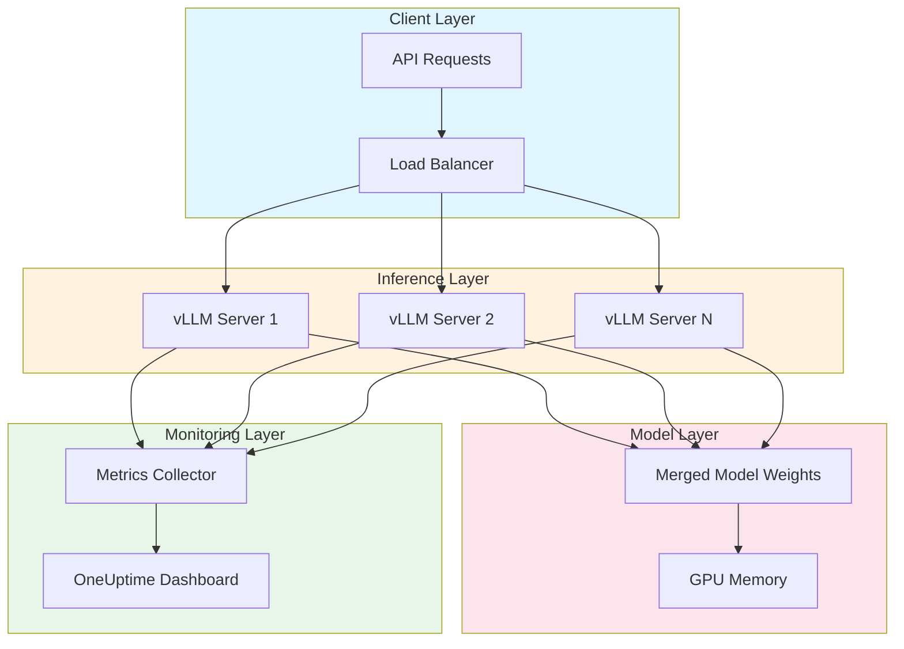

# How to Create Instruction Tuning

Author: [nawazdhandala](https://github.com/nawazdhandala)

Tags: LLMOps, Instruction Tuning, Fine-Tuning, Chat Models

Description: Learn to create instruction tuning for training LLMs to follow instructions and respond to prompts.

---

# Overview

Instruction tuning is a technique for fine-tuning large language models (LLMs) to follow natural language instructions and produce helpful, accurate responses. Unlike standard pre-training, which focuses on predicting the next token, instruction tuning teaches models to understand and execute specific tasks described in plain language.

This guide covers the complete workflow for creating instruction-tuned models, from dataset preparation to evaluation, with practical code examples and best practices for LLMOps.

## Why Instruction Tuning Matters

Pre-trained language models are powerful but often fail to follow specific instructions reliably. They might:

- Generate irrelevant continuations instead of answering questions
- Ignore formatting requirements
- Produce unsafe or unhelpful content
- Struggle with multi-step reasoning tasks

Instruction tuning addresses these limitations by explicitly training models on instruction-response pairs, resulting in models that are more controllable, helpful, and aligned with user intent.

## Architecture Overview

The instruction tuning pipeline consists of several interconnected stages:



# Dataset Formats

## Standard Instruction Format

The most common format for instruction tuning uses three fields: instruction, input, and output.

```json
{
  "instruction": "Summarize the following text in three bullet points.",
  "input": "Machine learning is a subset of artificial intelligence that enables systems to learn and improve from experience without being explicitly programmed. It focuses on developing computer programs that can access data and use it to learn for themselves. The process begins with observations or data, such as examples, direct experience, or instruction, to look for patterns in data and make better decisions in the future.",
  "output": "- Machine learning is a branch of AI that allows systems to learn from experience automatically\n- It develops programs that can access and learn from data independently\n- The learning process involves finding patterns in data to improve future decision-making"
}
```

## Chat/Conversation Format

For chat models, use a multi-turn conversation format that preserves context:

```json
{
  "conversations": [
    {
      "role": "system",
      "content": "You are a helpful coding assistant specializing in Python."
    },
    {
      "role": "user",
      "content": "How do I read a CSV file in Python?"
    },
    {
      "role": "assistant",
      "content": "You can use the pandas library to read CSV files easily. Here's how:\n\n```python\nimport pandas as pd\n\n# Read CSV file into a DataFrame\ndf = pd.read_csv('your_file.csv')\n\n# Display first few rows\nprint(df.head())\n```\n\nAlternatively, you can use Python's built-in csv module for simpler cases."
    },
    {
      "role": "user",
      "content": "How do I handle missing values?"
    },
    {
      "role": "assistant",
      "content": "Pandas provides several methods to handle missing values:\n\n```python\n# Check for missing values\nprint(df.isnull().sum())\n\n# Drop rows with missing values\ndf_clean = df.dropna()\n\n# Fill missing values with a specific value\ndf_filled = df.fillna(0)\n\n# Fill with column mean\ndf['column'] = df['column'].fillna(df['column'].mean())\n```"
    }
  ]
}
```

## ShareGPT Format

Popular for training chat models, this format is used by many open-source datasets:

```json
{
  "id": "conversation_001",
  "conversations": [
    {"from": "human", "value": "Explain quantum computing in simple terms."},
    {"from": "gpt", "value": "Quantum computing uses quantum mechanics principles to process information differently than classical computers. Instead of bits (0 or 1), it uses qubits that can be both 0 and 1 simultaneously through superposition. This allows quantum computers to explore many possibilities at once, making them potentially much faster for certain problems like cryptography and drug discovery."},
    {"from": "human", "value": "What are the main challenges?"},
    {"from": "gpt", "value": "The main challenges include:\n\n1. **Decoherence**: Qubits are extremely sensitive to environmental interference\n2. **Error rates**: Quantum operations have higher error rates than classical ones\n3. **Scaling**: Building systems with many stable qubits is difficult\n4. **Cooling**: Most quantum computers need near absolute zero temperatures\n5. **Programming**: Quantum algorithms require fundamentally different thinking"}
  ]
}
```

# Data Pipeline

## Dataset Structure Diagram



## Data Collection and Processing Script

```python
"""
Instruction Tuning Data Pipeline

This module provides utilities for collecting, processing, and validating
instruction tuning datasets for LLM fine-tuning.
"""

import json
import hashlib
from pathlib import Path
from typing import List, Dict, Optional, Union
from dataclasses import dataclass, field, asdict
from concurrent.futures import ThreadPoolExecutor, as_completed
import logging

# Configure logging for the data pipeline
logging.basicConfig(
    level=logging.INFO,
    format='%(asctime)s - %(levelname)s - %(message)s'
)
logger = logging.getLogger(__name__)


@dataclass
class InstructionExample:
    """
    Represents a single instruction-tuning example.

    Attributes:
        instruction: The task description or question
        input: Optional context or additional information
        output: The expected response
        category: Task category for stratified sampling
        metadata: Additional information about the example
    """
    instruction: str
    output: str
    input: str = ""
    category: str = "general"
    metadata: Dict = field(default_factory=dict)

    def __post_init__(self):
        """Validate and clean the example after initialization."""
        # Remove leading/trailing whitespace
        self.instruction = self.instruction.strip()
        self.output = self.output.strip()
        self.input = self.input.strip()

        # Generate unique ID based on content hash
        content = f"{self.instruction}{self.input}{self.output}"
        self.metadata['id'] = hashlib.md5(content.encode()).hexdigest()[:12]

    def to_prompt(self, template: str = "alpaca") -> str:
        """
        Convert example to a formatted prompt string.

        Args:
            template: The prompt template to use ('alpaca', 'chatml', 'llama')

        Returns:
            Formatted prompt string ready for tokenization
        """
        templates = {
            "alpaca": self._alpaca_template,
            "chatml": self._chatml_template,
            "llama": self._llama_template,
        }

        if template not in templates:
            raise ValueError(f"Unknown template: {template}. Choose from {list(templates.keys())}")

        return templates[template]()

    def _alpaca_template(self) -> str:
        """Format using the Alpaca prompt template."""
        if self.input:
            return (
                f"### Instruction:\n{self.instruction}\n\n"
                f"### Input:\n{self.input}\n\n"
                f"### Response:\n{self.output}"
            )
        return (
            f"### Instruction:\n{self.instruction}\n\n"
            f"### Response:\n{self.output}"
        )

    def _chatml_template(self) -> str:
        """Format using the ChatML template for chat models."""
        user_content = self.instruction
        if self.input:
            user_content = f"{self.instruction}\n\nContext:\n{self.input}"

        return (
            f"<|im_start|>user\n{user_content}<|im_end|>\n"
            f"<|im_start|>assistant\n{self.output}<|im_end|>"
        )

    def _llama_template(self) -> str:
        """Format using the Llama 2/3 chat template."""
        user_content = self.instruction
        if self.input:
            user_content = f"{self.instruction}\n\n{self.input}"

        return (
            f"<|begin_of_text|><|start_header_id|>user<|end_header_id|>\n\n"
            f"{user_content}<|eot_id|><|start_header_id|>assistant<|end_header_id|>\n\n"
            f"{self.output}<|eot_id|>"
        )


class DatasetProcessor:
    """
    Processes and validates instruction tuning datasets.

    This class handles loading, cleaning, deduplication, and quality
    filtering of instruction-tuning examples.
    """

    def __init__(
        self,
        min_instruction_length: int = 10,
        max_instruction_length: int = 2048,
        min_output_length: int = 5,
        max_output_length: int = 4096,
    ):
        """
        Initialize the dataset processor with validation parameters.

        Args:
            min_instruction_length: Minimum characters for instructions
            max_instruction_length: Maximum characters for instructions
            min_output_length: Minimum characters for outputs
            max_output_length: Maximum characters for outputs
        """
        self.min_instruction_length = min_instruction_length
        self.max_instruction_length = max_instruction_length
        self.min_output_length = min_output_length
        self.max_output_length = max_output_length

        # Track processing statistics
        self.stats = {
            "total_loaded": 0,
            "passed_validation": 0,
            "duplicates_removed": 0,
            "too_short": 0,
            "too_long": 0,
        }

    def load_jsonl(self, file_path: Union[str, Path]) -> List[InstructionExample]:
        """
        Load examples from a JSONL file.

        Args:
            file_path: Path to the JSONL file

        Returns:
            List of InstructionExample objects
        """
        examples = []
        file_path = Path(file_path)

        logger.info(f"Loading dataset from {file_path}")

        with open(file_path, 'r', encoding='utf-8') as f:
            for line_num, line in enumerate(f, 1):
                try:
                    data = json.loads(line.strip())
                    example = InstructionExample(
                        instruction=data.get('instruction', ''),
                        input=data.get('input', ''),
                        output=data.get('output', ''),
                        category=data.get('category', 'general'),
                        metadata=data.get('metadata', {})
                    )
                    examples.append(example)
                except json.JSONDecodeError as e:
                    logger.warning(f"Skipping line {line_num}: JSON decode error - {e}")
                except KeyError as e:
                    logger.warning(f"Skipping line {line_num}: Missing required field - {e}")

        self.stats["total_loaded"] = len(examples)
        logger.info(f"Loaded {len(examples)} examples")

        return examples

    def validate_example(self, example: InstructionExample) -> bool:
        """
        Validate a single example against quality criteria.

        Args:
            example: The example to validate

        Returns:
            True if the example passes all validation checks
        """
        # Check instruction length
        if len(example.instruction) < self.min_instruction_length:
            self.stats["too_short"] += 1
            return False

        if len(example.instruction) > self.max_instruction_length:
            self.stats["too_long"] += 1
            return False

        # Check output length
        if len(example.output) < self.min_output_length:
            self.stats["too_short"] += 1
            return False

        if len(example.output) > self.max_output_length:
            self.stats["too_long"] += 1
            return False

        # Check for placeholder or template text
        placeholder_patterns = [
            "[insert",
            "lorem ipsum",
            "example text here",
            "TODO",
            "FIXME",
        ]

        combined_text = (example.instruction + example.output).lower()
        for pattern in placeholder_patterns:
            if pattern.lower() in combined_text:
                return False

        return True

    def deduplicate(
        self,
        examples: List[InstructionExample],
        similarity_threshold: float = 0.95
    ) -> List[InstructionExample]:
        """
        Remove duplicate and near-duplicate examples.

        Uses content hashing for exact duplicates and optional
        similarity checking for near-duplicates.

        Args:
            examples: List of examples to deduplicate
            similarity_threshold: Threshold for near-duplicate detection

        Returns:
            Deduplicated list of examples
        """
        seen_hashes = set()
        unique_examples = []

        for example in examples:
            # Create hash of instruction + output for deduplication
            content_hash = hashlib.sha256(
                (example.instruction + example.output).encode()
            ).hexdigest()

            if content_hash not in seen_hashes:
                seen_hashes.add(content_hash)
                unique_examples.append(example)
            else:
                self.stats["duplicates_removed"] += 1

        logger.info(
            f"Deduplication: {len(examples)} -> {len(unique_examples)} "
            f"({self.stats['duplicates_removed']} duplicates removed)"
        )

        return unique_examples

    def process(self, examples: List[InstructionExample]) -> List[InstructionExample]:
        """
        Run the complete processing pipeline on a list of examples.

        Args:
            examples: Raw examples to process

        Returns:
            Processed and validated examples
        """
        logger.info("Starting dataset processing pipeline")

        # Step 1: Validate examples
        validated = [ex for ex in examples if self.validate_example(ex)]
        self.stats["passed_validation"] = len(validated)
        logger.info(f"Validation: {len(examples)} -> {len(validated)} examples")

        # Step 2: Deduplicate
        deduplicated = self.deduplicate(validated)

        # Step 3: Log final statistics
        logger.info(f"Processing complete. Final dataset size: {len(deduplicated)}")
        logger.info(f"Statistics: {self.stats}")

        return deduplicated

    def save_jsonl(
        self,
        examples: List[InstructionExample],
        output_path: Union[str, Path]
    ) -> None:
        """
        Save processed examples to a JSONL file.

        Args:
            examples: Examples to save
            output_path: Path for the output file
        """
        output_path = Path(output_path)
        output_path.parent.mkdir(parents=True, exist_ok=True)

        with open(output_path, 'w', encoding='utf-8') as f:
            for example in examples:
                # Convert dataclass to dict, excluding metadata with None values
                data = {
                    'instruction': example.instruction,
                    'input': example.input,
                    'output': example.output,
                    'category': example.category,
                }
                f.write(json.dumps(data, ensure_ascii=False) + '\n')

        logger.info(f"Saved {len(examples)} examples to {output_path}")


def create_train_val_test_split(
    examples: List[InstructionExample],
    train_ratio: float = 0.8,
    val_ratio: float = 0.1,
    test_ratio: float = 0.1,
    seed: int = 42,
    stratify_by_category: bool = True
) -> Dict[str, List[InstructionExample]]:
    """
    Split examples into train, validation, and test sets.

    Args:
        examples: List of examples to split
        train_ratio: Proportion for training set
        val_ratio: Proportion for validation set
        test_ratio: Proportion for test set
        seed: Random seed for reproducibility
        stratify_by_category: Whether to stratify split by category

    Returns:
        Dictionary with 'train', 'val', and 'test' keys
    """
    import random
    random.seed(seed)

    # Validate ratios
    assert abs(train_ratio + val_ratio + test_ratio - 1.0) < 1e-6, \
        "Ratios must sum to 1.0"

    if stratify_by_category:
        # Group examples by category
        categories = {}
        for example in examples:
            cat = example.category
            if cat not in categories:
                categories[cat] = []
            categories[cat].append(example)

        train, val, test = [], [], []

        for cat, cat_examples in categories.items():
            random.shuffle(cat_examples)
            n = len(cat_examples)
            train_end = int(n * train_ratio)
            val_end = train_end + int(n * val_ratio)

            train.extend(cat_examples[:train_end])
            val.extend(cat_examples[train_end:val_end])
            test.extend(cat_examples[val_end:])
    else:
        shuffled = examples.copy()
        random.shuffle(shuffled)

        n = len(shuffled)
        train_end = int(n * train_ratio)
        val_end = train_end + int(n * val_ratio)

        train = shuffled[:train_end]
        val = shuffled[train_end:val_end]
        test = shuffled[val_end:]

    logger.info(f"Split sizes - Train: {len(train)}, Val: {len(val)}, Test: {len(test)}")

    return {
        'train': train,
        'val': val,
        'test': test
    }


# Example usage
if __name__ == "__main__":
    # Initialize processor with custom parameters
    processor = DatasetProcessor(
        min_instruction_length=15,
        max_instruction_length=1024,
        min_output_length=10,
        max_output_length=2048
    )

    # Load and process dataset
    examples = processor.load_jsonl("raw_instructions.jsonl")
    processed = processor.process(examples)

    # Split into train/val/test
    splits = create_train_val_test_split(processed)

    # Save each split
    for split_name, split_examples in splits.items():
        processor.save_jsonl(split_examples, f"data/{split_name}.jsonl")
```

# Training Pipeline

## Training Architecture

```mermaid
flowchart LR
    subgraph Input["Input Processing"]
        A[Dataset] --> B[Tokenizer]
        B --> C[Padding/Truncation]
        C --> D[Attention Masks]
    end

    subgraph Model["Model Architecture"]
        D --> E[Base LLM]
        E --> F[LoRA Adapters]
        F --> G[Output Logits]
    end

    subgraph Loss["Loss Computation"]
        G --> H[Cross-Entropy Loss]
        H --> I[Response-Only Masking]
        I --> J[Gradient Computation]
    end

    subgraph Optimization["Optimization"]
        J --> K[Gradient Accumulation]
        K --> L[Optimizer Step]
        L --> M[Learning Rate Scheduler]
        M --> N[Checkpoint]
    end

    N -.-> E

    style Input fill:#e3f2fd
    style Model fill:#fce4ec
    style Loss fill:#fff8e1
    style Optimization fill:#e8f5e9
```



## Complete Training Script

```python
"""
Instruction Tuning Training Script

This script provides a complete training pipeline for instruction-tuning
LLMs using LoRA (Low-Rank Adaptation) for efficient fine-tuning.
"""

import os
import json
import torch
from pathlib import Path
from typing import Dict, List, Optional, Any
from dataclasses import dataclass, field
from datetime import datetime

# Hugging Face libraries
from transformers import (
    AutoModelForCausalLM,
    AutoTokenizer,
    TrainingArguments,
    Trainer,
    DataCollatorForSeq2Seq,
    BitsAndBytesConfig,
)
from datasets import Dataset, load_dataset
from peft import (
    LoraConfig,
    get_peft_model,
    prepare_model_for_kbit_training,
    TaskType,
)

# For logging and monitoring
import wandb
from tqdm import tqdm

import logging
logging.basicConfig(level=logging.INFO)
logger = logging.getLogger(__name__)


@dataclass
class ModelConfig:
    """Configuration for the base model and tokenizer."""

    # Model identifier from Hugging Face Hub or local path
    model_name_or_path: str = "meta-llama/Llama-3.2-3B-Instruct"

    # Whether to use 4-bit quantization (QLoRA)
    use_4bit: bool = True

    # Quantization configuration
    bnb_4bit_compute_dtype: str = "bfloat16"
    bnb_4bit_quant_type: str = "nf4"
    use_double_quant: bool = True

    # Model loading options
    trust_remote_code: bool = False
    use_flash_attention: bool = True

    def get_quantization_config(self) -> Optional[BitsAndBytesConfig]:
        """Create BitsAndBytes configuration for quantized training."""
        if not self.use_4bit:
            return None

        compute_dtype = getattr(torch, self.bnb_4bit_compute_dtype)

        return BitsAndBytesConfig(
            load_in_4bit=True,
            bnb_4bit_quant_type=self.bnb_4bit_quant_type,
            bnb_4bit_compute_dtype=compute_dtype,
            bnb_4bit_use_double_quant=self.use_double_quant,
        )


@dataclass
class LoRAConfig:
    """Configuration for LoRA adaptation."""

    # LoRA hyperparameters
    r: int = 64  # Rank of the low-rank matrices
    lora_alpha: int = 128  # Scaling factor
    lora_dropout: float = 0.05  # Dropout probability

    # Target modules to apply LoRA
    # Common choices: q_proj, k_proj, v_proj, o_proj, gate_proj, up_proj, down_proj
    target_modules: List[str] = field(default_factory=lambda: [
        "q_proj", "k_proj", "v_proj", "o_proj",
        "gate_proj", "up_proj", "down_proj"
    ])

    # Additional configuration
    bias: str = "none"  # Whether to train bias parameters
    task_type: str = "CAUSAL_LM"

    def to_peft_config(self) -> LoraConfig:
        """Convert to PEFT LoraConfig object."""
        return LoraConfig(
            r=self.r,
            lora_alpha=self.lora_alpha,
            lora_dropout=self.lora_dropout,
            target_modules=self.target_modules,
            bias=self.bias,
            task_type=TaskType.CAUSAL_LM,
        )


@dataclass
class TrainConfig:
    """Configuration for training hyperparameters."""

    # Output and logging
    output_dir: str = "./outputs"
    run_name: str = field(default_factory=lambda: f"instruction-tuning-{datetime.now().strftime('%Y%m%d-%H%M%S')}")

    # Training hyperparameters
    num_train_epochs: int = 3
    per_device_train_batch_size: int = 4
    per_device_eval_batch_size: int = 4
    gradient_accumulation_steps: int = 8

    # Optimizer settings
    learning_rate: float = 2e-4
    weight_decay: float = 0.01
    warmup_ratio: float = 0.03
    lr_scheduler_type: str = "cosine"

    # Memory optimization
    gradient_checkpointing: bool = True
    optim: str = "paged_adamw_32bit"

    # Precision
    bf16: bool = True
    fp16: bool = False

    # Logging and saving
    logging_steps: int = 10
    save_steps: int = 100
    eval_steps: int = 100
    save_total_limit: int = 3

    # Sequence length
    max_seq_length: int = 2048

    # Evaluation
    evaluation_strategy: str = "steps"
    load_best_model_at_end: bool = True
    metric_for_best_model: str = "eval_loss"


class InstructionTuningTrainer:
    """
    Main class for instruction tuning training.

    Handles model loading, dataset preparation, and training orchestration.
    """

    def __init__(
        self,
        model_config: ModelConfig,
        lora_config: LoRAConfig,
        train_config: TrainConfig,
    ):
        """
        Initialize the trainer with configurations.

        Args:
            model_config: Configuration for the base model
            lora_config: Configuration for LoRA adaptation
            train_config: Configuration for training
        """
        self.model_config = model_config
        self.lora_config = lora_config
        self.train_config = train_config

        self.model = None
        self.tokenizer = None
        self.trainer = None

    def load_model_and_tokenizer(self) -> None:
        """Load the base model and tokenizer with specified configurations."""
        logger.info(f"Loading model: {self.model_config.model_name_or_path}")

        # Load tokenizer
        self.tokenizer = AutoTokenizer.from_pretrained(
            self.model_config.model_name_or_path,
            trust_remote_code=self.model_config.trust_remote_code,
            padding_side="right",  # Required for correct loss computation
        )

        # Set pad token if not present
        if self.tokenizer.pad_token is None:
            self.tokenizer.pad_token = self.tokenizer.eos_token
            self.tokenizer.pad_token_id = self.tokenizer.eos_token_id

        # Prepare model loading arguments
        model_kwargs = {
            "pretrained_model_name_or_path": self.model_config.model_name_or_path,
            "trust_remote_code": self.model_config.trust_remote_code,
            "device_map": "auto",
        }

        # Add quantization config if using 4-bit
        quant_config = self.model_config.get_quantization_config()
        if quant_config:
            model_kwargs["quantization_config"] = quant_config

        # Enable flash attention if supported and requested
        if self.model_config.use_flash_attention:
            model_kwargs["attn_implementation"] = "flash_attention_2"

        # Load the model
        self.model = AutoModelForCausalLM.from_pretrained(**model_kwargs)

        # Prepare for k-bit training if using quantization
        if self.model_config.use_4bit:
            self.model = prepare_model_for_kbit_training(
                self.model,
                use_gradient_checkpointing=self.train_config.gradient_checkpointing
            )

        # Apply LoRA
        peft_config = self.lora_config.to_peft_config()
        self.model = get_peft_model(self.model, peft_config)

        # Log trainable parameters
        self.model.print_trainable_parameters()

        logger.info("Model and tokenizer loaded successfully")

    def prepare_dataset(
        self,
        train_path: str,
        val_path: Optional[str] = None,
        prompt_template: str = "chatml"
    ) -> Dict[str, Dataset]:
        """
        Load and prepare datasets for training.

        Args:
            train_path: Path to training data (JSONL format)
            val_path: Optional path to validation data
            prompt_template: Template for formatting prompts

        Returns:
            Dictionary with 'train' and optionally 'validation' datasets
        """
        logger.info("Preparing datasets")

        def format_example(example: Dict[str, Any]) -> Dict[str, str]:
            """Format a single example into the prompt template."""
            instruction = example.get('instruction', '')
            input_text = example.get('input', '')
            output = example.get('output', '')

            # Build user content
            if input_text:
                user_content = f"{instruction}\n\n{input_text}"
            else:
                user_content = instruction

            # Format based on template
            if prompt_template == "chatml":
                formatted = (
                    f"<|im_start|>user\n{user_content}<|im_end|>\n"
                    f"<|im_start|>assistant\n{output}<|im_end|>"
                )
            elif prompt_template == "llama":
                formatted = (
                    f"<|begin_of_text|><|start_header_id|>user<|end_header_id|>\n\n"
                    f"{user_content}<|eot_id|><|start_header_id|>assistant<|end_header_id|>\n\n"
                    f"{output}<|eot_id|>"
                )
            else:  # alpaca format
                if input_text:
                    formatted = (
                        f"### Instruction:\n{instruction}\n\n"
                        f"### Input:\n{input_text}\n\n"
                        f"### Response:\n{output}"
                    )
                else:
                    formatted = (
                        f"### Instruction:\n{instruction}\n\n"
                        f"### Response:\n{output}"
                    )

            return {"text": formatted}

        def tokenize_function(examples: Dict[str, List]) -> Dict[str, List]:
            """Tokenize examples for training."""
            # Format all examples
            texts = []
            for i in range(len(examples['instruction'])):
                example = {
                    'instruction': examples['instruction'][i],
                    'input': examples.get('input', [''] * len(examples['instruction']))[i],
                    'output': examples['output'][i],
                }
                formatted = format_example(example)
                texts.append(formatted['text'])

            # Tokenize with truncation
            tokenized = self.tokenizer(
                texts,
                truncation=True,
                max_length=self.train_config.max_seq_length,
                padding=False,
                return_tensors=None,
            )

            # For causal LM, labels are the same as input_ids
            tokenized["labels"] = tokenized["input_ids"].copy()

            return tokenized

        # Load datasets
        datasets = {}

        train_dataset = load_dataset('json', data_files=train_path, split='train')
        train_dataset = train_dataset.map(
            tokenize_function,
            batched=True,
            remove_columns=train_dataset.column_names,
            desc="Tokenizing training data"
        )
        datasets['train'] = train_dataset

        if val_path:
            val_dataset = load_dataset('json', data_files=val_path, split='train')
            val_dataset = val_dataset.map(
                tokenize_function,
                batched=True,
                remove_columns=val_dataset.column_names,
                desc="Tokenizing validation data"
            )
            datasets['validation'] = val_dataset

        logger.info(f"Dataset sizes - Train: {len(datasets['train'])}")
        if 'validation' in datasets:
            logger.info(f"                Val: {len(datasets['validation'])}")

        return datasets

    def train(
        self,
        train_path: str,
        val_path: Optional[str] = None,
        resume_from_checkpoint: Optional[str] = None,
    ) -> None:
        """
        Execute the training loop.

        Args:
            train_path: Path to training data
            val_path: Optional path to validation data
            resume_from_checkpoint: Optional checkpoint path to resume from
        """
        # Load model if not already loaded
        if self.model is None:
            self.load_model_and_tokenizer()

        # Prepare datasets
        datasets = self.prepare_dataset(train_path, val_path)

        # Create data collator
        data_collator = DataCollatorForSeq2Seq(
            tokenizer=self.tokenizer,
            model=self.model,
            padding=True,
            pad_to_multiple_of=8,  # Optimize for tensor cores
        )

        # Create training arguments
        training_args = TrainingArguments(
            output_dir=self.train_config.output_dir,
            run_name=self.train_config.run_name,
            num_train_epochs=self.train_config.num_train_epochs,
            per_device_train_batch_size=self.train_config.per_device_train_batch_size,
            per_device_eval_batch_size=self.train_config.per_device_eval_batch_size,
            gradient_accumulation_steps=self.train_config.gradient_accumulation_steps,
            learning_rate=self.train_config.learning_rate,
            weight_decay=self.train_config.weight_decay,
            warmup_ratio=self.train_config.warmup_ratio,
            lr_scheduler_type=self.train_config.lr_scheduler_type,
            gradient_checkpointing=self.train_config.gradient_checkpointing,
            optim=self.train_config.optim,
            bf16=self.train_config.bf16,
            fp16=self.train_config.fp16,
            logging_steps=self.train_config.logging_steps,
            save_steps=self.train_config.save_steps,
            eval_steps=self.train_config.eval_steps if val_path else None,
            evaluation_strategy=self.train_config.evaluation_strategy if val_path else "no",
            save_total_limit=self.train_config.save_total_limit,
            load_best_model_at_end=self.train_config.load_best_model_at_end if val_path else False,
            metric_for_best_model=self.train_config.metric_for_best_model,
            report_to="wandb",
            ddp_find_unused_parameters=False,
            group_by_length=True,  # Efficient batching
        )

        # Initialize trainer
        self.trainer = Trainer(
            model=self.model,
            args=training_args,
            train_dataset=datasets['train'],
            eval_dataset=datasets.get('validation'),
            data_collator=data_collator,
            tokenizer=self.tokenizer,
        )

        # Start training
        logger.info("Starting training")
        self.trainer.train(resume_from_checkpoint=resume_from_checkpoint)

        # Save final model
        final_model_path = os.path.join(self.train_config.output_dir, "final_model")
        self.trainer.save_model(final_model_path)
        self.tokenizer.save_pretrained(final_model_path)

        logger.info(f"Training complete. Model saved to {final_model_path}")

    def merge_and_save(self, output_path: str) -> None:
        """
        Merge LoRA weights with base model and save.

        Args:
            output_path: Path to save the merged model
        """
        logger.info("Merging LoRA weights with base model")

        # Merge LoRA weights
        merged_model = self.model.merge_and_unload()

        # Save merged model
        merged_model.save_pretrained(output_path)
        self.tokenizer.save_pretrained(output_path)

        logger.info(f"Merged model saved to {output_path}")


def main():
    """Main entry point for training."""
    # Initialize configurations
    model_config = ModelConfig(
        model_name_or_path="meta-llama/Llama-3.2-3B-Instruct",
        use_4bit=True,
        use_flash_attention=True,
    )

    lora_config = LoRAConfig(
        r=64,
        lora_alpha=128,
        lora_dropout=0.05,
    )

    train_config = TrainConfig(
        output_dir="./outputs/instruction-tuning",
        num_train_epochs=3,
        per_device_train_batch_size=4,
        gradient_accumulation_steps=8,
        learning_rate=2e-4,
        max_seq_length=2048,
    )

    # Initialize W&B for experiment tracking
    wandb.init(
        project="instruction-tuning",
        name=train_config.run_name,
        config={
            "model": model_config.__dict__,
            "lora": lora_config.__dict__,
            "training": train_config.__dict__,
        }
    )

    # Create trainer and run training
    trainer = InstructionTuningTrainer(
        model_config=model_config,
        lora_config=lora_config,
        train_config=train_config,
    )

    trainer.train(
        train_path="data/train.jsonl",
        val_path="data/val.jsonl",
    )

    # Merge and save final model
    trainer.merge_and_save("./outputs/merged_model")

    wandb.finish()


if __name__ == "__main__":
    main()
```

# Evaluation Framework

## Evaluation Workflow



## Evaluation Script

```python
"""
Instruction Tuning Evaluation Framework

This module provides comprehensive evaluation tools for instruction-tuned
models, including automated benchmarks, quality metrics, and generation tests.
"""

import json
import torch
import numpy as np
from pathlib import Path
from typing import Dict, List, Optional, Tuple, Any
from dataclasses import dataclass, field
from collections import defaultdict
from tqdm import tqdm
import logging

from transformers import (
    AutoModelForCausalLM,
    AutoTokenizer,
    GenerationConfig,
)
from datasets import load_dataset

# Evaluation metrics
from evaluate import load as load_metric

logging.basicConfig(level=logging.INFO)
logger = logging.getLogger(__name__)


@dataclass
class EvaluationConfig:
    """Configuration for model evaluation."""

    # Model settings
    model_path: str = "./outputs/final_model"
    device: str = "cuda"
    torch_dtype: str = "bfloat16"

    # Generation settings
    max_new_tokens: int = 512
    temperature: float = 0.7
    top_p: float = 0.9
    do_sample: bool = True

    # Evaluation settings
    num_samples: int = 100
    batch_size: int = 8
    seed: int = 42


class InstructionEvaluator:
    """
    Comprehensive evaluator for instruction-tuned models.

    Provides automated benchmarks, quality metrics, and generation testing
    to assess model performance across multiple dimensions.
    """

    def __init__(self, config: EvaluationConfig):
        """
        Initialize the evaluator.

        Args:
            config: Evaluation configuration
        """
        self.config = config
        self.model = None
        self.tokenizer = None
        self.results = defaultdict(dict)

        # Set random seed for reproducibility
        torch.manual_seed(config.seed)
        np.random.seed(config.seed)

    def load_model(self) -> None:
        """Load the model and tokenizer for evaluation."""
        logger.info(f"Loading model from {self.config.model_path}")

        dtype = getattr(torch, self.config.torch_dtype)

        self.tokenizer = AutoTokenizer.from_pretrained(self.config.model_path)
        self.model = AutoModelForCausalLM.from_pretrained(
            self.config.model_path,
            torch_dtype=dtype,
            device_map="auto",
        )
        self.model.eval()

        logger.info("Model loaded successfully")

    def generate_response(
        self,
        instruction: str,
        input_text: str = "",
        system_prompt: Optional[str] = None
    ) -> str:
        """
        Generate a response for a given instruction.

        Args:
            instruction: The instruction or question
            input_text: Optional additional context
            system_prompt: Optional system prompt

        Returns:
            Generated response text
        """
        # Build the prompt
        if input_text:
            user_content = f"{instruction}\n\n{input_text}"
        else:
            user_content = instruction

        # Format as chat message
        messages = []
        if system_prompt:
            messages.append({"role": "system", "content": system_prompt})
        messages.append({"role": "user", "content": user_content})

        # Apply chat template if available
        if hasattr(self.tokenizer, 'apply_chat_template'):
            prompt = self.tokenizer.apply_chat_template(
                messages,
                tokenize=False,
                add_generation_prompt=True
            )
        else:
            # Fallback to simple formatting
            prompt = f"### Instruction:\n{user_content}\n\n### Response:\n"

        # Tokenize
        inputs = self.tokenizer(
            prompt,
            return_tensors="pt",
            truncation=True,
            max_length=2048
        ).to(self.model.device)

        # Generate
        with torch.no_grad():
            outputs = self.model.generate(
                **inputs,
                max_new_tokens=self.config.max_new_tokens,
                temperature=self.config.temperature,
                top_p=self.config.top_p,
                do_sample=self.config.do_sample,
                pad_token_id=self.tokenizer.pad_token_id,
            )

        # Decode and extract response
        full_response = self.tokenizer.decode(outputs[0], skip_special_tokens=True)

        # Remove the prompt from the response
        response = full_response[len(prompt):].strip()

        return response

    def evaluate_instruction_following(
        self,
        test_cases: List[Dict[str, Any]]
    ) -> Dict[str, float]:
        """
        Evaluate the model's ability to follow instructions.

        Args:
            test_cases: List of test cases with expected outputs

        Returns:
            Dictionary of evaluation metrics
        """
        logger.info("Evaluating instruction following capability")

        # Load evaluation metrics
        bleu_metric = load_metric("bleu")
        rouge_metric = load_metric("rouge")

        predictions = []
        references = []

        for case in tqdm(test_cases, desc="Generating responses"):
            response = self.generate_response(
                instruction=case['instruction'],
                input_text=case.get('input', '')
            )
            predictions.append(response)
            references.append(case['output'])

        # Calculate BLEU score
        bleu_results = bleu_metric.compute(
            predictions=predictions,
            references=[[ref] for ref in references]
        )

        # Calculate ROUGE scores
        rouge_results = rouge_metric.compute(
            predictions=predictions,
            references=references
        )

        results = {
            "bleu": bleu_results["bleu"],
            "rouge1": rouge_results["rouge1"],
            "rouge2": rouge_results["rouge2"],
            "rougeL": rouge_results["rougeL"],
        }

        self.results["instruction_following"] = results
        return results

    def evaluate_task_categories(
        self,
        test_data: List[Dict[str, Any]]
    ) -> Dict[str, Dict[str, float]]:
        """
        Evaluate performance across different task categories.

        Args:
            test_data: Test examples with category labels

        Returns:
            Per-category performance metrics
        """
        logger.info("Evaluating performance by task category")

        # Group by category
        categories = defaultdict(list)
        for example in test_data:
            category = example.get('category', 'general')
            categories[category].append(example)

        category_results = {}

        for category, examples in categories.items():
            logger.info(f"Evaluating category: {category} ({len(examples)} examples)")

            correct = 0
            total = len(examples)

            for example in tqdm(examples, desc=f"Category: {category}"):
                response = self.generate_response(
                    instruction=example['instruction'],
                    input_text=example.get('input', '')
                )

                # Simple exact match or substring check
                expected = example['output'].lower().strip()
                generated = response.lower().strip()

                if expected in generated or generated in expected:
                    correct += 1

            accuracy = correct / total if total > 0 else 0.0
            category_results[category] = {
                "accuracy": accuracy,
                "num_examples": total,
                "correct": correct,
            }

        self.results["category_performance"] = category_results
        return category_results

    def calculate_perplexity(
        self,
        test_texts: List[str]
    ) -> float:
        """
        Calculate perplexity on test texts.

        Args:
            test_texts: List of text samples

        Returns:
            Average perplexity score
        """
        logger.info("Calculating perplexity")

        total_loss = 0.0
        total_tokens = 0

        for text in tqdm(test_texts, desc="Computing perplexity"):
            inputs = self.tokenizer(
                text,
                return_tensors="pt",
                truncation=True,
                max_length=2048
            ).to(self.model.device)

            with torch.no_grad():
                outputs = self.model(**inputs, labels=inputs["input_ids"])
                loss = outputs.loss.item()
                num_tokens = inputs["input_ids"].size(1)

                total_loss += loss * num_tokens
                total_tokens += num_tokens

        avg_loss = total_loss / total_tokens
        perplexity = np.exp(avg_loss)

        self.results["perplexity"] = perplexity
        return perplexity

    def run_benchmark_suite(
        self,
        benchmarks: List[str] = ["truthfulqa", "hellaswag"]
    ) -> Dict[str, float]:
        """
        Run standard benchmarks using lm-evaluation-harness.

        Args:
            benchmarks: List of benchmark names to run

        Returns:
            Dictionary of benchmark scores
        """
        logger.info(f"Running benchmarks: {benchmarks}")

        # Note: This requires lm-evaluation-harness to be installed
        # pip install lm-eval
        try:
            from lm_eval import evaluator
            from lm_eval.models.huggingface import HFLM

            # Wrap model for lm-eval
            lm = HFLM(
                pretrained=self.config.model_path,
                device="cuda",
                batch_size=self.config.batch_size,
            )

            # Run evaluation
            results = evaluator.simple_evaluate(
                model=lm,
                tasks=benchmarks,
                num_fewshot=0,
                batch_size=self.config.batch_size,
            )

            # Extract scores
            benchmark_results = {}
            for task, task_results in results["results"].items():
                benchmark_results[task] = task_results.get("acc", task_results.get("acc_norm", 0.0))

            self.results["benchmarks"] = benchmark_results
            return benchmark_results

        except ImportError:
            logger.warning("lm-evaluation-harness not installed. Skipping benchmarks.")
            return {}

    def generate_evaluation_report(self) -> str:
        """
        Generate a comprehensive evaluation report.

        Returns:
            Formatted report string
        """
        report_lines = [
            "=" * 60,
            "INSTRUCTION TUNING EVALUATION REPORT",
            "=" * 60,
            f"\nModel: {self.config.model_path}\n",
        ]

        # Instruction Following Results
        if "instruction_following" in self.results:
            report_lines.append("\n--- Instruction Following Metrics ---")
            for metric, value in self.results["instruction_following"].items():
                report_lines.append(f"  {metric}: {value:.4f}")

        # Category Performance
        if "category_performance" in self.results:
            report_lines.append("\n--- Performance by Category ---")
            for category, metrics in self.results["category_performance"].items():
                report_lines.append(
                    f"  {category}: {metrics['accuracy']:.2%} "
                    f"({metrics['correct']}/{metrics['num_examples']})"
                )

        # Perplexity
        if "perplexity" in self.results:
            report_lines.append(f"\n--- Language Model Quality ---")
            report_lines.append(f"  Perplexity: {self.results['perplexity']:.2f}")

        # Benchmarks
        if "benchmarks" in self.results:
            report_lines.append("\n--- Standard Benchmarks ---")
            for benchmark, score in self.results["benchmarks"].items():
                report_lines.append(f"  {benchmark}: {score:.2%}")

        report_lines.append("\n" + "=" * 60)

        report = "\n".join(report_lines)
        return report

    def save_results(self, output_path: str) -> None:
        """
        Save evaluation results to a JSON file.

        Args:
            output_path: Path to save the results
        """
        output_path = Path(output_path)
        output_path.parent.mkdir(parents=True, exist_ok=True)

        with open(output_path, 'w') as f:
            json.dump(dict(self.results), f, indent=2, default=float)

        logger.info(f"Results saved to {output_path}")


def main():
    """Run evaluation on an instruction-tuned model."""
    config = EvaluationConfig(
        model_path="./outputs/final_model",
        num_samples=100,
    )

    evaluator = InstructionEvaluator(config)
    evaluator.load_model()

    # Load test data
    with open("data/test.jsonl", 'r') as f:
        test_data = [json.loads(line) for line in f]

    # Run evaluations
    evaluator.evaluate_instruction_following(test_data[:config.num_samples])
    evaluator.evaluate_task_categories(test_data)

    # Calculate perplexity
    test_texts = [f"{ex['instruction']} {ex['output']}" for ex in test_data[:50]]
    evaluator.calculate_perplexity(test_texts)

    # Generate and print report
    report = evaluator.generate_evaluation_report()
    print(report)

    # Save results
    evaluator.save_results("./outputs/evaluation_results.json")


if __name__ == "__main__":
    main()
```

# Best Practices for Instruction Tuning

## Dataset Quality Guidelines

1. **Diversity**: Include examples from multiple task categories (QA, summarization, coding, reasoning, creative writing)

2. **Quality over Quantity**: A smaller dataset of high-quality examples often outperforms larger noisy datasets

3. **Balanced Distribution**: Ensure roughly equal representation across categories to prevent bias

4. **Clear Instructions**: Instructions should be unambiguous and self-contained

5. **Accurate Outputs**: Responses should be factually correct and follow the instruction precisely

## Training Recommendations



| Hyperparameter | Recommended Range | Notes |
|----------------|-------------------|-------|
| Learning Rate | 1e-4 to 3e-4 | Lower for larger models |
| LoRA Rank (r) | 32 to 128 | Higher for complex tasks |
| LoRA Alpha | 2x rank | Typical scaling factor |
| Batch Size | 4 to 32 | Depends on GPU memory |
| Epochs | 1 to 5 | Watch for overfitting |
| Warmup Ratio | 0.03 to 0.1 | Stabilizes early training |

## Common Pitfalls to Avoid

1. **Catastrophic Forgetting**: The model loses general capabilities. Mitigate by mixing in general-purpose examples.

2. **Overfitting to Format**: Model only works with exact prompt format used in training. Include format variations.

3. **Repetition Issues**: Model generates repetitive text. Adjust temperature and repetition penalties during inference.

4. **Safety Regression**: Fine-tuning can reduce safety guardrails. Include safety-focused examples in training data.

# Deployment Considerations

## Model Serving Architecture



## Quick Deployment with vLLM

```python
"""
Deploy instruction-tuned model with vLLM for high-performance inference.
"""

from vllm import LLM, SamplingParams

# Initialize the model
# vLLM handles batching and GPU memory optimization automatically
llm = LLM(
    model="./outputs/merged_model",
    tensor_parallel_size=1,  # Increase for multi-GPU
    gpu_memory_utilization=0.9,
    max_model_len=4096,
)

# Configure sampling parameters
sampling_params = SamplingParams(
    temperature=0.7,
    top_p=0.9,
    max_tokens=512,
    stop=["<|im_end|>", "<|eot_id|>"],
)

# Example inference
prompts = [
    "<|im_start|>user\nExplain machine learning in simple terms.<|im_end|>\n<|im_start|>assistant\n",
    "<|im_start|>user\nWrite a Python function to sort a list.<|im_end|>\n<|im_start|>assistant\n",
]

# Generate responses (automatically batched)
outputs = llm.generate(prompts, sampling_params)

for output in outputs:
    print(f"Prompt: {output.prompt[:50]}...")
    print(f"Response: {output.outputs[0].text}\n")
```

# Conclusion

Instruction tuning transforms pre-trained language models into helpful assistants that reliably follow user instructions. The key components for success are:

1. **High-quality datasets** with diverse, well-formatted instruction-response pairs
2. **Efficient training** using LoRA/QLoRA to reduce computational requirements
3. **Comprehensive evaluation** across multiple dimensions including benchmarks and human assessment
4. **Proper deployment** with optimized inference servers and monitoring

By following the practices and code examples in this guide, you can create instruction-tuned models that are helpful, accurate, and production-ready.

**Related Reading:**

- [Monitoring LLM Applications with OpenLIT and OneUptime](https://oneuptime.com/blog/post/2024-09-13-monitoring-llm-with-openlit-and-oneuptime/view)
- [Why build open-source DataDog?](https://oneuptime.com/blog/post/2024-08-14-why-build-open-source-datadog/view)
- [Instrument Python Applications with OpenTelemetry](https://oneuptime.com/blog/post/2025-01-06-instrument-python-opentelemetry/view)
