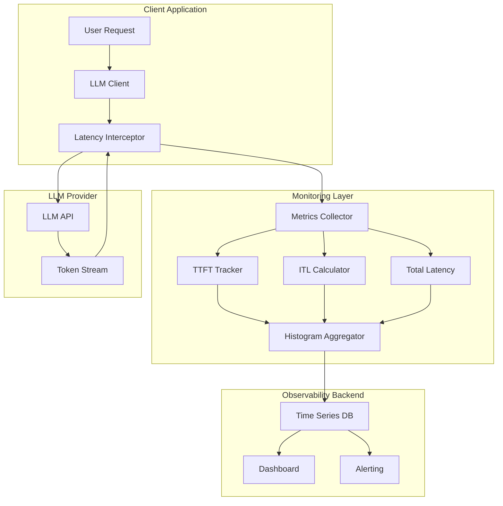
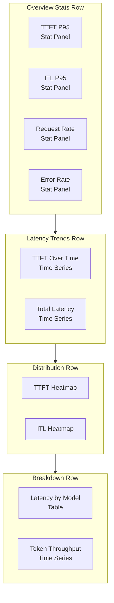
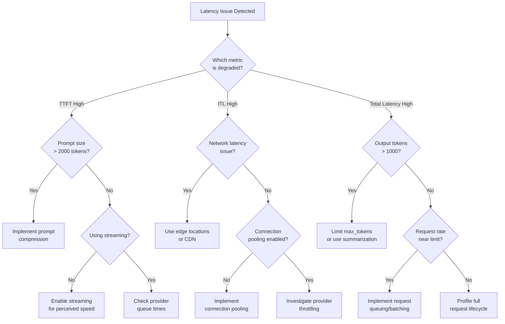

# How to Create Latency Monitoring

Author: [nawazdhandala](https://github.com/nawazdhandala)

Tags: LLMOps, Latency, Performance, Monitoring

Description: Learn to create latency monitoring for tracking and optimizing LLM response times.

---

> In LLM operations, latency is not just a performance metric. It directly impacts user experience, cost efficiency, and system reliability. A 2-second delay in response can mean the difference between a helpful assistant and an abandoned session.

Large Language Model (LLM) applications have unique latency characteristics that traditional monitoring tools often miss. Unlike standard API calls with predictable response times, LLM requests involve tokenization, model inference, and often streaming responses that require specialized measurement approaches.

This guide walks through building comprehensive latency monitoring for LLM operations, from capturing Time to First Byte (TTFB) through streaming token delivery, to implementing percentile tracking and optimization strategies.

---

## Table of Contents

1. Understanding LLM Latency Components
2. Latency Breakdown Architecture
3. Setting Up the Monitoring Infrastructure
4. Capturing TTFB and Streaming Metrics
5. Implementing Percentile Tracking
6. Building a Latency Dashboard
7. Alerting on Latency Anomalies
8. Optimization Strategies
9. Production Best Practices
10. Putting It All Together

---

## 1. Understanding LLM Latency Components

LLM request latency is not a single number. It breaks down into several distinct phases:

| Phase | Description | Typical Range |
|-------|-------------|---------------|
| Network Round Trip | Time for request to reach the LLM provider | 10-100ms |
| Queue Wait | Time spent waiting in provider queue | 0-5000ms |
| Time to First Token (TTFT) | From request sent to first token received | 200-2000ms |
| Inter-Token Latency (ITL) | Time between consecutive tokens | 10-50ms |
| Total Generation Time | Full time from request to completion | 500ms-60s+ |

```
Request Timeline (Streaming Response)
|------ TTFT ------|
|                  |---- Token 1 ----|- Token 2 -|- Token 3 -|... |- Token N -|
|                  |                                                          |
Request Sent    First Token                                              Last Token
                Received                                                 Received
                                   |<-------- Streaming Duration -------->|
|<----------------------- Total Latency ---------------------------------->|
```

Understanding these components is critical because:
- **TTFT** affects perceived responsiveness (users see "thinking" indicators)
- **ITL** determines smooth streaming experience
- **Total latency** impacts throughput and cost (longer requests hold connections)

---

## 2. Latency Breakdown Architecture

Here is how a comprehensive latency monitoring system fits into your LLM application:



The key insight is that we intercept at the client layer, measuring real user-experienced latency rather than relying solely on provider-reported metrics.

---

## 3. Setting Up the Monitoring Infrastructure

Let us build a latency monitoring system using TypeScript and OpenTelemetry. First, install the dependencies:

```bash
npm install @opentelemetry/api \
            @opentelemetry/sdk-node \
            @opentelemetry/sdk-metrics \
            @opentelemetry/exporter-metrics-otlp-http \
            openai
```

### Core Metrics Configuration

```typescript
// metrics-config.ts
// Configure OpenTelemetry metrics for LLM latency monitoring

import { MeterProvider, PeriodicExportingMetricReader } from '@opentelemetry/sdk-metrics';
import { OTLPMetricExporter } from '@opentelemetry/exporter-metrics-otlp-http';
import { Resource } from '@opentelemetry/resources';
import { SemanticResourceAttributes } from '@opentelemetry/semantic-conventions';

// Create the OTLP exporter for metrics
// This sends metrics to your observability backend (OneUptime, Prometheus, etc.)
const metricExporter = new OTLPMetricExporter({
    url: process.env.OTLP_METRICS_ENDPOINT || 'https://oneuptime.com/otlp/v1/metrics',
    headers: {
        'x-oneuptime-token': process.env.ONEUPTIME_TOKEN || '',
    },
});

// Configure the metric reader with a 10-second export interval
// Shorter intervals give faster feedback but increase network overhead
const metricReader = new PeriodicExportingMetricReader({
    exporter: metricExporter,
    exportIntervalMillis: 10000, // Export every 10 seconds
});

// Create the meter provider with service identification
export const meterProvider = new MeterProvider({
    resource: new Resource({
        [SemanticResourceAttributes.SERVICE_NAME]: 'llm-application',
        [SemanticResourceAttributes.SERVICE_VERSION]: '1.0.0',
        [SemanticResourceAttributes.DEPLOYMENT_ENVIRONMENT]: process.env.NODE_ENV || 'development',
    }),
    readers: [metricReader],
});

// Get a meter instance for creating instruments
export const meter = meterProvider.getMeter('llm-latency-metrics', '1.0.0');
```

### Define Latency Metrics Instruments

```typescript
// latency-instruments.ts
// Define all the metric instruments for LLM latency tracking

import { meter } from './metrics-config';
import { ValueType } from '@opentelemetry/api';

// Histogram for Time to First Token (TTFT)
// Uses exponential bucket boundaries optimized for LLM response times
export const ttftHistogram = meter.createHistogram('llm.ttft.duration', {
    description: 'Time to First Token latency in milliseconds',
    unit: 'ms',
    valueType: ValueType.DOUBLE,
    // Bucket boundaries: 50, 100, 200, 500, 1000, 2000, 5000, 10000ms
    advice: {
        explicitBucketBoundaries: [50, 100, 200, 500, 1000, 2000, 5000, 10000],
    },
});

// Histogram for Inter-Token Latency (ITL)
// Smaller buckets since token delivery is faster
export const itlHistogram = meter.createHistogram('llm.itl.duration', {
    description: 'Inter-Token Latency in milliseconds',
    unit: 'ms',
    valueType: ValueType.DOUBLE,
    advice: {
        explicitBucketBoundaries: [5, 10, 20, 30, 50, 75, 100, 150, 200],
    },
});

// Histogram for total request latency
export const totalLatencyHistogram = meter.createHistogram('llm.request.duration', {
    description: 'Total LLM request latency in milliseconds',
    unit: 'ms',
    valueType: ValueType.DOUBLE,
    advice: {
        explicitBucketBoundaries: [500, 1000, 2000, 5000, 10000, 20000, 30000, 60000],
    },
});

// Counter for total tokens generated (for throughput calculations)
export const tokenCounter = meter.createCounter('llm.tokens.generated', {
    description: 'Total number of tokens generated',
    unit: 'tokens',
    valueType: ValueType.INT,
});

// Gauge for tokens per second (streaming throughput)
export const tokenRateGauge = meter.createObservableGauge('llm.tokens.rate', {
    description: 'Current token generation rate',
    unit: 'tokens/s',
    valueType: ValueType.DOUBLE,
});

// Counter for request outcomes (success, timeout, error)
export const requestOutcomeCounter = meter.createCounter('llm.request.outcome', {
    description: 'Count of LLM request outcomes',
    unit: 'requests',
    valueType: ValueType.INT,
});
```

---

## 4. Capturing TTFB and Streaming Metrics

Now let us build the core monitoring wrapper that captures all latency components:

```typescript
// llm-latency-monitor.ts
// Comprehensive latency monitoring for LLM API calls

import OpenAI from 'openai';
import {
    ttftHistogram,
    itlHistogram,
    totalLatencyHistogram,
    tokenCounter,
    requestOutcomeCounter,
} from './latency-instruments';

// Structure to hold timing data for a single request
interface LatencyMetrics {
    requestStartTime: number;      // When we sent the request
    firstTokenTime: number | null; // When first token arrived
    lastTokenTime: number | null;  // When last token arrived
    tokenTimestamps: number[];     // Timestamp of each token
    tokenCount: number;            // Total tokens received
    model: string;                 // Model identifier
    promptTokens: number;          // Input token count
}

// Attributes attached to all metrics for filtering and grouping
interface MetricAttributes {
    model: string;
    endpoint: string;
    streaming: boolean;
    prompt_tokens_bucket: string; // Bucketed to avoid high cardinality
}

// Helper to bucket prompt tokens into ranges for metric labels
function bucketPromptTokens(count: number): string {
    if (count < 100) return '0-99';
    if (count < 500) return '100-499';
    if (count < 1000) return '500-999';
    if (count < 2000) return '1000-1999';
    return '2000+';
}

// Main class for monitoring LLM latencies
export class LLMLatencyMonitor {
    private client: OpenAI;
    private endpoint: string;

    constructor(apiKey: string, endpoint: string = 'openai') {
        this.client = new OpenAI({ apiKey });
        this.endpoint = endpoint;
    }

    // Create a chat completion with full latency monitoring
    async createChatCompletion(
        messages: OpenAI.Chat.ChatCompletionMessageParam[],
        options: {
            model?: string;
            maxTokens?: number;
            temperature?: number;
            stream?: boolean;
        } = {}
    ): Promise<{
        content: string;
        metrics: LatencyMetrics;
    }> {
        const model = options.model || 'gpt-4';
        const streaming = options.stream ?? true;

        // Initialize metrics tracking
        const metrics: LatencyMetrics = {
            requestStartTime: performance.now(),
            firstTokenTime: null,
            lastTokenTime: null,
            tokenTimestamps: [],
            tokenCount: 0,
            model,
            promptTokens: 0, // Will be updated from response
        };

        // Prepare metric attributes (known before request completes)
        const baseAttributes: Partial<MetricAttributes> = {
            model,
            endpoint: this.endpoint,
            streaming,
        };

        try {
            if (streaming) {
                return await this.handleStreamingRequest(messages, options, metrics, baseAttributes);
            } else {
                return await this.handleNonStreamingRequest(messages, options, metrics, baseAttributes);
            }
        } catch (error) {
            // Record failed request
            requestOutcomeCounter.add(1, {
                ...baseAttributes,
                outcome: 'error',
                error_type: error instanceof Error ? error.name : 'unknown',
            });
            throw error;
        }
    }

    // Handle streaming responses with token-by-token latency tracking
    private async handleStreamingRequest(
        messages: OpenAI.Chat.ChatCompletionMessageParam[],
        options: any,
        metrics: LatencyMetrics,
        baseAttributes: Partial<MetricAttributes>
    ): Promise<{ content: string; metrics: LatencyMetrics }> {
        const stream = await this.client.chat.completions.create({
            model: metrics.model,
            messages,
            max_tokens: options.maxTokens,
            temperature: options.temperature,
            stream: true,
            stream_options: { include_usage: true }, // Get token counts
        });

        let content = '';

        // Process each chunk from the stream
        for await (const chunk of stream) {
            const now = performance.now();

            // Record timestamp for first token (TTFT)
            if (metrics.firstTokenTime === null && chunk.choices[0]?.delta?.content) {
                metrics.firstTokenTime = now;

                // Calculate and record TTFT
                const ttft = metrics.firstTokenTime - metrics.requestStartTime;
                ttftHistogram.record(ttft, {
                    ...baseAttributes,
                    prompt_tokens_bucket: bucketPromptTokens(metrics.promptTokens),
                });
            }

            // Process content tokens
            const tokenContent = chunk.choices[0]?.delta?.content;
            if (tokenContent) {
                content += tokenContent;
                metrics.tokenTimestamps.push(now);
                metrics.tokenCount++;
                metrics.lastTokenTime = now;
            }

            // Capture usage info if present (usually in final chunk)
            if (chunk.usage) {
                metrics.promptTokens = chunk.usage.prompt_tokens;
            }
        }

        // Calculate and record inter-token latencies
        this.recordInterTokenLatencies(metrics, baseAttributes);

        // Record total latency and token count
        this.recordFinalMetrics(metrics, baseAttributes);

        return { content, metrics };
    }

    // Handle non-streaming responses
    private async handleNonStreamingRequest(
        messages: OpenAI.Chat.ChatCompletionMessageParam[],
        options: any,
        metrics: LatencyMetrics,
        baseAttributes: Partial<MetricAttributes>
    ): Promise<{ content: string; metrics: LatencyMetrics }> {
        const response = await this.client.chat.completions.create({
            model: metrics.model,
            messages,
            max_tokens: options.maxTokens,
            temperature: options.temperature,
            stream: false,
        });

        const now = performance.now();

        // For non-streaming, TTFT equals total latency
        metrics.firstTokenTime = now;
        metrics.lastTokenTime = now;
        metrics.promptTokens = response.usage?.prompt_tokens || 0;
        metrics.tokenCount = response.usage?.completion_tokens || 0;

        const content = response.choices[0]?.message?.content || '';

        // Record TTFT (same as total for non-streaming)
        const ttft = now - metrics.requestStartTime;
        ttftHistogram.record(ttft, {
            ...baseAttributes,
            prompt_tokens_bucket: bucketPromptTokens(metrics.promptTokens),
        });

        // Record final metrics
        this.recordFinalMetrics(metrics, baseAttributes);

        return { content, metrics };
    }

    // Calculate and record inter-token latencies from timestamp array
    private recordInterTokenLatencies(
        metrics: LatencyMetrics,
        attributes: Partial<MetricAttributes>
    ): void {
        const timestamps = metrics.tokenTimestamps;

        if (timestamps.length < 2) {
            return; // Need at least 2 tokens to calculate ITL
        }

        // Calculate latency between each consecutive pair of tokens
        for (let i = 1; i < timestamps.length; i++) {
            const itl = timestamps[i] - timestamps[i - 1];
            itlHistogram.record(itl, attributes);
        }
    }

    // Record final aggregated metrics after request completes
    private recordFinalMetrics(
        metrics: LatencyMetrics,
        attributes: Partial<MetricAttributes>
    ): void {
        const totalLatency = (metrics.lastTokenTime || performance.now()) - metrics.requestStartTime;

        // Record total request latency
        totalLatencyHistogram.record(totalLatency, {
            ...attributes,
            prompt_tokens_bucket: bucketPromptTokens(metrics.promptTokens),
        });

        // Record token count
        tokenCounter.add(metrics.tokenCount, attributes);

        // Record successful outcome
        requestOutcomeCounter.add(1, {
            ...attributes,
            outcome: 'success',
        });
    }
}
```

---

## 5. Implementing Percentile Tracking

Histograms give us raw distributions, but for alerting and SLOs we need percentiles. Here is how to calculate and track them:

```typescript
// percentile-tracker.ts
// Track and calculate latency percentiles for LLM requests

import { meter } from './metrics-config';
import { ValueType } from '@opentelemetry/api';

// Circular buffer for storing recent latency values
class LatencyBuffer {
    private buffer: number[];
    private index: number;
    private count: number;
    private readonly capacity: number;

    constructor(capacity: number = 1000) {
        this.capacity = capacity;
        this.buffer = new Array(capacity).fill(0);
        this.index = 0;
        this.count = 0;
    }

    // Add a new latency value to the buffer
    add(value: number): void {
        this.buffer[this.index] = value;
        this.index = (this.index + 1) % this.capacity;
        if (this.count < this.capacity) {
            this.count++;
        }
    }

    // Get sorted array of current values (for percentile calculation)
    getSortedValues(): number[] {
        const values = this.buffer.slice(0, this.count);
        return values.sort((a, b) => a - b);
    }

    // Calculate a specific percentile (0-100)
    getPercentile(p: number): number {
        if (this.count === 0) return 0;

        const sorted = this.getSortedValues();
        const rank = (p / 100) * (sorted.length - 1);
        const lower = Math.floor(rank);
        const upper = Math.ceil(rank);
        const weight = rank - lower;

        // Linear interpolation between surrounding values
        if (upper >= sorted.length) {
            return sorted[sorted.length - 1];
        }
        return sorted[lower] * (1 - weight) + sorted[upper] * weight;
    }

    // Get multiple common percentiles at once
    getPercentiles(): { p50: number; p90: number; p95: number; p99: number } {
        return {
            p50: this.getPercentile(50),
            p90: this.getPercentile(90),
            p95: this.getPercentile(95),
            p99: this.getPercentile(99),
        };
    }

    // Get basic statistics
    getStats(): { min: number; max: number; avg: number; count: number } {
        if (this.count === 0) {
            return { min: 0, max: 0, avg: 0, count: 0 };
        }

        const values = this.buffer.slice(0, this.count);
        const sum = values.reduce((a, b) => a + b, 0);

        return {
            min: Math.min(...values),
            max: Math.max(...values),
            avg: sum / this.count,
            count: this.count,
        };
    }
}

// Percentile tracker with multiple metric dimensions
export class PercentileTracker {
    private ttftBuffers: Map<string, LatencyBuffer> = new Map();
    private itlBuffers: Map<string, LatencyBuffer> = new Map();
    private totalLatencyBuffers: Map<string, LatencyBuffer> = new Map();

    // Observable gauges for percentile metrics
    private p50TtftGauge = meter.createObservableGauge('llm.ttft.p50', {
        description: 'TTFT 50th percentile',
        unit: 'ms',
        valueType: ValueType.DOUBLE,
    });

    private p95TtftGauge = meter.createObservableGauge('llm.ttft.p95', {
        description: 'TTFT 95th percentile',
        unit: 'ms',
        valueType: ValueType.DOUBLE,
    });

    private p99TtftGauge = meter.createObservableGauge('llm.ttft.p99', {
        description: 'TTFT 99th percentile',
        unit: 'ms',
        valueType: ValueType.DOUBLE,
    });

    constructor() {
        // Register callback to export percentile metrics periodically
        this.registerPercentileCallbacks();
    }

    // Get or create a buffer for a specific model
    private getBuffer(
        buffers: Map<string, LatencyBuffer>,
        model: string
    ): LatencyBuffer {
        if (!buffers.has(model)) {
            buffers.set(model, new LatencyBuffer(1000));
        }
        return buffers.get(model)!;
    }

    // Record TTFT value
    recordTTFT(model: string, value: number): void {
        this.getBuffer(this.ttftBuffers, model).add(value);
    }

    // Record ITL value
    recordITL(model: string, value: number): void {
        this.getBuffer(this.itlBuffers, model).add(value);
    }

    // Record total latency value
    recordTotalLatency(model: string, value: number): void {
        this.getBuffer(this.totalLatencyBuffers, model).add(value);
    }

    // Register observable gauge callbacks for percentile export
    private registerPercentileCallbacks(): void {
        // TTFT percentiles callback
        meter.addBatchObservableCallback(
            (observableResult) => {
                for (const [model, buffer] of this.ttftBuffers) {
                    const percentiles = buffer.getPercentiles();
                    const attributes = { model };

                    observableResult.observe(this.p50TtftGauge, percentiles.p50, attributes);
                    observableResult.observe(this.p95TtftGauge, percentiles.p95, attributes);
                    observableResult.observe(this.p99TtftGauge, percentiles.p99, attributes);
                }
            },
            [this.p50TtftGauge, this.p95TtftGauge, this.p99TtftGauge]
        );
    }

    // Get current percentiles for a specific model and metric type
    getPercentiles(
        type: 'ttft' | 'itl' | 'total',
        model: string
    ): { p50: number; p90: number; p95: number; p99: number } | null {
        let buffers: Map<string, LatencyBuffer>;

        switch (type) {
            case 'ttft':
                buffers = this.ttftBuffers;
                break;
            case 'itl':
                buffers = this.itlBuffers;
                break;
            case 'total':
                buffers = this.totalLatencyBuffers;
                break;
        }

        const buffer = buffers.get(model);
        if (!buffer) return null;

        return buffer.getPercentiles();
    }

    // Generate a summary report of all tracked metrics
    generateReport(): string {
        const lines: string[] = ['LLM Latency Percentile Report', '='.repeat(50)];

        for (const [model, buffer] of this.ttftBuffers) {
            const ttftPercentiles = buffer.getPercentiles();
            const ttftStats = buffer.getStats();

            lines.push(`\nModel: ${model}`);
            lines.push('-'.repeat(30));
            lines.push(`TTFT (ms):`);
            lines.push(`  P50: ${ttftPercentiles.p50.toFixed(2)}`);
            lines.push(`  P90: ${ttftPercentiles.p90.toFixed(2)}`);
            lines.push(`  P95: ${ttftPercentiles.p95.toFixed(2)}`);
            lines.push(`  P99: ${ttftPercentiles.p99.toFixed(2)}`);
            lines.push(`  Min: ${ttftStats.min.toFixed(2)}`);
            lines.push(`  Max: ${ttftStats.max.toFixed(2)}`);
            lines.push(`  Avg: ${ttftStats.avg.toFixed(2)}`);
            lines.push(`  Count: ${ttftStats.count}`);
        }

        return lines.join('\n');
    }
}
```

---

## 6. Building a Latency Dashboard

Here is a configuration for a comprehensive latency monitoring dashboard:

```typescript
// dashboard-config.ts
// Dashboard configuration for LLM latency monitoring

export interface DashboardPanel {
    title: string;
    type: 'timeseries' | 'stat' | 'heatmap' | 'table';
    metrics: string[];
    description: string;
}

export interface DashboardConfig {
    title: string;
    panels: DashboardPanel[];
}

// Define the main LLM latency dashboard
export const llmLatencyDashboard: DashboardConfig = {
    title: 'LLM Operations Latency Dashboard',
    panels: [
        // Overview row
        {
            title: 'Current TTFT P95',
            type: 'stat',
            metrics: ['llm.ttft.p95'],
            description: 'Time to First Token at 95th percentile',
        },
        {
            title: 'Current ITL P95',
            type: 'stat',
            metrics: ['llm.itl.p95'],
            description: 'Inter-Token Latency at 95th percentile',
        },
        {
            title: 'Request Rate',
            type: 'stat',
            metrics: ['rate(llm.request.outcome{outcome="success"})'],
            description: 'Successful requests per second',
        },
        {
            title: 'Error Rate',
            type: 'stat',
            metrics: ['rate(llm.request.outcome{outcome="error"})'],
            description: 'Failed requests per second',
        },

        // Latency trends row
        {
            title: 'TTFT Over Time',
            type: 'timeseries',
            metrics: [
                'llm.ttft.p50',
                'llm.ttft.p95',
                'llm.ttft.p99',
            ],
            description: 'Time to First Token percentiles over time',
        },
        {
            title: 'Total Latency Over Time',
            type: 'timeseries',
            metrics: [
                'histogram_quantile(0.5, llm.request.duration)',
                'histogram_quantile(0.95, llm.request.duration)',
                'histogram_quantile(0.99, llm.request.duration)',
            ],
            description: 'Total request latency percentiles over time',
        },

        // Distribution row
        {
            title: 'TTFT Distribution Heatmap',
            type: 'heatmap',
            metrics: ['llm.ttft.duration'],
            description: 'Distribution of TTFT values over time',
        },
        {
            title: 'ITL Distribution Heatmap',
            type: 'heatmap',
            metrics: ['llm.itl.duration'],
            description: 'Distribution of Inter-Token Latency values',
        },

        // Breakdown row
        {
            title: 'Latency by Model',
            type: 'table',
            metrics: [
                'avg(llm.ttft.duration) by model',
                'avg(llm.request.duration) by model',
            ],
            description: 'Average latencies broken down by model',
        },
        {
            title: 'Token Throughput',
            type: 'timeseries',
            metrics: ['rate(llm.tokens.generated)'],
            description: 'Tokens generated per second',
        },
    ],
};
```

Here is a visual representation of the dashboard layout:



---

## 7. Alerting on Latency Anomalies

Set up intelligent alerts that catch real issues without alert fatigue:

```typescript
// alerting.ts
// Alert configuration for LLM latency monitoring

import { meter } from './metrics-config';

// Alert rule configuration
export interface AlertRule {
    name: string;
    description: string;
    metric: string;
    condition: 'gt' | 'lt' | 'eq';
    threshold: number;
    duration: string;        // How long condition must persist
    severity: 'warning' | 'critical';
    labels: Record<string, string>;
}

// Define alert rules for LLM latency
export const latencyAlertRules: AlertRule[] = [
    // TTFT alerts
    {
        name: 'llm_ttft_high_p95',
        description: 'TTFT P95 is above acceptable threshold',
        metric: 'llm.ttft.p95',
        condition: 'gt',
        threshold: 2000, // 2 seconds
        duration: '5m',
        severity: 'warning',
        labels: { team: 'llm-platform', component: 'inference' },
    },
    {
        name: 'llm_ttft_critical_p99',
        description: 'TTFT P99 is critically high',
        metric: 'llm.ttft.p99',
        condition: 'gt',
        threshold: 5000, // 5 seconds
        duration: '2m',
        severity: 'critical',
        labels: { team: 'llm-platform', component: 'inference' },
    },

    // ITL alerts
    {
        name: 'llm_itl_degraded',
        description: 'Inter-Token Latency is degraded',
        metric: 'llm.itl.p95',
        condition: 'gt',
        threshold: 100, // 100ms between tokens
        duration: '5m',
        severity: 'warning',
        labels: { team: 'llm-platform', component: 'streaming' },
    },

    // Total latency alerts
    {
        name: 'llm_total_latency_high',
        description: 'Total request latency P95 is above SLO',
        metric: 'histogram_quantile(0.95, llm.request.duration)',
        condition: 'gt',
        threshold: 10000, // 10 seconds
        duration: '5m',
        severity: 'warning',
        labels: { team: 'llm-platform', component: 'api' },
    },

    // Error rate alerts
    {
        name: 'llm_error_rate_elevated',
        description: 'LLM request error rate is elevated',
        metric: 'rate(llm.request.outcome{outcome="error"}[5m]) / rate(llm.request.outcome[5m])',
        condition: 'gt',
        threshold: 0.05, // 5% error rate
        duration: '5m',
        severity: 'warning',
        labels: { team: 'llm-platform', component: 'api' },
    },
    {
        name: 'llm_error_rate_critical',
        description: 'LLM request error rate is critically high',
        metric: 'rate(llm.request.outcome{outcome="error"}[5m]) / rate(llm.request.outcome[5m])',
        condition: 'gt',
        threshold: 0.15, // 15% error rate
        duration: '2m',
        severity: 'critical',
        labels: { team: 'llm-platform', component: 'api' },
    },

    // Throughput alerts
    {
        name: 'llm_throughput_low',
        description: 'Token generation throughput is below expected',
        metric: 'rate(llm.tokens.generated[5m])',
        condition: 'lt',
        threshold: 100, // Tokens per second
        duration: '10m',
        severity: 'warning',
        labels: { team: 'llm-platform', component: 'inference' },
    },
];

// Alert evaluator class for runtime checking
export class AlertEvaluator {
    private activeAlerts: Map<string, { rule: AlertRule; triggeredAt: Date }> = new Map();

    // Evaluate a metric value against all applicable rules
    evaluate(metricName: string, value: number, labels: Record<string, string> = {}): AlertRule[] {
        const triggeredRules: AlertRule[] = [];

        for (const rule of latencyAlertRules) {
            if (!rule.metric.includes(metricName)) continue;

            let triggered = false;
            switch (rule.condition) {
                case 'gt':
                    triggered = value > rule.threshold;
                    break;
                case 'lt':
                    triggered = value < rule.threshold;
                    break;
                case 'eq':
                    triggered = value === rule.threshold;
                    break;
            }

            if (triggered) {
                triggeredRules.push(rule);

                if (!this.activeAlerts.has(rule.name)) {
                    this.activeAlerts.set(rule.name, {
                        rule,
                        triggeredAt: new Date(),
                    });
                    console.log(`[ALERT] ${rule.severity.toUpperCase()}: ${rule.description}`);
                    console.log(`  Metric: ${metricName} = ${value} (threshold: ${rule.threshold})`);
                }
            } else {
                if (this.activeAlerts.has(rule.name)) {
                    const alert = this.activeAlerts.get(rule.name)!;
                    console.log(`[RESOLVED] ${rule.name} after ${this.formatDuration(alert.triggeredAt)}`);
                    this.activeAlerts.delete(rule.name);
                }
            }
        }

        return triggeredRules;
    }

    private formatDuration(since: Date): string {
        const seconds = Math.floor((Date.now() - since.getTime()) / 1000);
        if (seconds < 60) return `${seconds}s`;
        const minutes = Math.floor(seconds / 60);
        return `${minutes}m ${seconds % 60}s`;
    }
}
```

---

## 8. Optimization Strategies

Based on the latency data collected, here are strategies to optimize each component:

```typescript
// optimization-strategies.ts
// Strategies for optimizing LLM latency based on monitoring data

export interface OptimizationStrategy {
    targetMetric: string;
    condition: string;
    strategy: string;
    expectedImprovement: string;
    implementationNotes: string;
}

export const optimizationStrategies: OptimizationStrategy[] = [
    // TTFT Optimizations
    {
        targetMetric: 'TTFT',
        condition: 'P95 > 2000ms',
        strategy: 'Reduce prompt size',
        expectedImprovement: '20-50% reduction',
        implementationNotes: `
            - Implement prompt compression techniques
            - Use system prompts efficiently
            - Cache common prompt prefixes
            - Consider RAG to reduce context window
        `,
    },
    {
        targetMetric: 'TTFT',
        condition: 'High variance across requests',
        strategy: 'Implement request routing',
        expectedImprovement: '30-60% reduction in P99',
        implementationNotes: `
            - Route smaller requests to faster models
            - Use model selection based on complexity
            - Implement priority queuing for time-sensitive requests
        `,
    },

    // ITL Optimizations
    {
        targetMetric: 'ITL',
        condition: 'P95 > 50ms',
        strategy: 'Optimize streaming infrastructure',
        expectedImprovement: '20-40% reduction',
        implementationNotes: `
            - Use edge locations closer to users
            - Implement connection pooling
            - Enable HTTP/2 or HTTP/3
            - Consider WebSocket for persistent connections
        `,
    },

    // Total Latency Optimizations
    {
        targetMetric: 'Total Latency',
        condition: 'P95 > 10000ms',
        strategy: 'Implement response caching',
        expectedImprovement: '50-90% for cached requests',
        implementationNotes: `
            - Cache common query responses
            - Implement semantic caching
            - Use approximate matching for similar queries
        `,
    },
];

// Practical implementation: Streaming optimization wrapper
export class OptimizedLLMClient {
    private connectionPool: Map<string, any> = new Map();
    private cache: Map<string, { response: string; timestamp: number }> = new Map();
    private readonly cacheTTL = 60000; // 1 minute cache

    // Check cache before making request
    async getCachedOrFetch(
        prompt: string,
        fetchFn: () => Promise<string>
    ): Promise<{ response: string; cached: boolean; latency: number }> {
        const cacheKey = this.hashPrompt(prompt);
        const cached = this.cache.get(cacheKey);

        const startTime = performance.now();

        if (cached && Date.now() - cached.timestamp < this.cacheTTL) {
            return {
                response: cached.response,
                cached: true,
                latency: performance.now() - startTime,
            };
        }

        const response = await fetchFn();

        this.cache.set(cacheKey, {
            response,
            timestamp: Date.now(),
        });

        return {
            response,
            cached: false,
            latency: performance.now() - startTime,
        };
    }

    // Simple hash function for cache keys
    private hashPrompt(prompt: string): string {
        let hash = 0;
        for (let i = 0; i < prompt.length; i++) {
            const char = prompt.charCodeAt(i);
            hash = ((hash << 5) - hash) + char;
            hash = hash & hash;
        }
        return hash.toString(36);
    }
}
```

Here is a decision tree for optimization strategies:



---

## 9. Production Best Practices

### Sampling Strategy

For high-traffic applications, sample intelligently:

```typescript
// sampling-strategy.ts
// Intelligent sampling for high-traffic LLM monitoring

interface SamplingConfig {
    baseRate: number;          // Default sampling rate (0-1)
    errorRate: number;         // Rate for error conditions
    slowRequestRate: number;   // Rate for slow requests
    slowThresholdMs: number;   // What constitutes "slow"
}

export class AdaptiveSampler {
    private config: SamplingConfig;
    private requestCount = 0;
    private sampledCount = 0;

    constructor(config: Partial<SamplingConfig> = {}) {
        this.config = {
            baseRate: config.baseRate ?? 0.1,        // 10% baseline
            errorRate: config.errorRate ?? 1.0,       // 100% of errors
            slowRequestRate: config.slowRequestRate ?? 0.5,  // 50% of slow requests
            slowThresholdMs: config.slowThresholdMs ?? 5000, // 5 second threshold
        };
    }

    // Determine if a completed request should be sampled
    shouldSample(latencyMs: number, isError: boolean): boolean {
        this.requestCount++;

        // Always sample errors
        if (isError) {
            this.sampledCount++;
            return true;
        }

        // Higher sampling rate for slow requests
        if (latencyMs > this.config.slowThresholdMs) {
            if (Math.random() < this.config.slowRequestRate) {
                this.sampledCount++;
                return true;
            }
        }

        // Base rate sampling for normal requests
        if (Math.random() < this.config.baseRate) {
            this.sampledCount++;
            return true;
        }

        return false;
    }

    // Get current sampling statistics
    getStats(): { requestCount: number; sampledCount: number; effectiveRate: number } {
        return {
            requestCount: this.requestCount,
            sampledCount: this.sampledCount,
            effectiveRate: this.requestCount > 0 ? this.sampledCount / this.requestCount : 0,
        };
    }
}
```

### Graceful Degradation

Handle monitoring failures without impacting the main application:

```typescript
// graceful-monitoring.ts
// Monitoring wrapper that degrades gracefully on failures

export class ResilientLatencyMonitor {
    private monitoringEnabled = true;
    private consecutiveFailures = 0;
    private readonly maxFailures = 3;
    private readonly backoffMs = 60000; // 1 minute
    private disabledUntil = 0;

    // Wrap monitoring calls with error handling
    async recordMetric(
        recordFn: () => void,
        metricName: string
    ): Promise<void> {
        // Check if monitoring is temporarily disabled
        if (!this.monitoringEnabled) {
            if (Date.now() > this.disabledUntil) {
                this.monitoringEnabled = true;
                this.consecutiveFailures = 0;
                console.log('[Monitoring] Re-enabling after backoff period');
            } else {
                return; // Still in backoff, skip recording
            }
        }

        try {
            recordFn();
            this.consecutiveFailures = 0;
        } catch (error) {
            this.consecutiveFailures++;
            console.warn(`[Monitoring] Failed to record ${metricName}: ${error}`);

            if (this.consecutiveFailures >= this.maxFailures) {
                this.monitoringEnabled = false;
                this.disabledUntil = Date.now() + this.backoffMs;
                console.error(
                    `[Monitoring] Disabled for ${this.backoffMs}ms after ${this.maxFailures} failures`
                );
            }
        }
    }
}
```

---

## 10. Putting It All Together

Here is a complete example integrating all components:

```typescript
// complete-example.ts
// Complete LLM latency monitoring implementation

import OpenAI from 'openai';
import { LLMLatencyMonitor } from './llm-latency-monitor';
import { PercentileTracker } from './percentile-tracker';
import { AlertEvaluator } from './alerting';
import { AdaptiveSampler } from './sampling-strategy';
import { ResilientLatencyMonitor } from './graceful-monitoring';
import { meterProvider } from './metrics-config';

// Initialize all monitoring components
const latencyMonitor = new LLMLatencyMonitor(
    process.env.OPENAI_API_KEY || '',
    'openai'
);
const percentileTracker = new PercentileTracker();
const alertEvaluator = new AlertEvaluator();
const sampler = new AdaptiveSampler({ baseRate: 0.1 });
const resilientMonitor = new ResilientLatencyMonitor();

// Main application function demonstrating the complete flow
async function main() {
    console.log('Starting LLM Latency Monitoring Demo\n');

    // Example requests to demonstrate monitoring
    const prompts = [
        'What is the capital of France?',
        'Explain quantum computing in simple terms.',
        'Write a haiku about monitoring.',
    ];

    for (const prompt of prompts) {
        try {
            console.log(`\nProcessing: "${prompt.substring(0, 50)}..."`);

            // Make the monitored LLM call
            const { content, metrics } = await latencyMonitor.createChatCompletion(
                [{ role: 'user', content: prompt }],
                { model: 'gpt-4', stream: true }
            );

            // Calculate latencies
            const ttft = metrics.firstTokenTime! - metrics.requestStartTime;
            const totalLatency = metrics.lastTokenTime! - metrics.requestStartTime;

            // Record in percentile tracker (with sampling)
            if (sampler.shouldSample(totalLatency, false)) {
                await resilientMonitor.recordMetric(() => {
                    percentileTracker.recordTTFT('gpt-4', ttft);
                    percentileTracker.recordTotalLatency('gpt-4', totalLatency);

                    // Record ITL values
                    for (let i = 1; i < metrics.tokenTimestamps.length; i++) {
                        const itl = metrics.tokenTimestamps[i] - metrics.tokenTimestamps[i - 1];
                        percentileTracker.recordITL('gpt-4', itl);
                    }
                }, 'latency-recording');
            }

            // Evaluate alerts
            alertEvaluator.evaluate('llm.ttft', ttft);
            alertEvaluator.evaluate('llm.request.duration', totalLatency);

            // Log results
            console.log(`  TTFT: ${ttft.toFixed(2)}ms`);
            console.log(`  Total Latency: ${totalLatency.toFixed(2)}ms`);
            console.log(`  Tokens: ${metrics.tokenCount}`);
            console.log(`  Response: ${content.substring(0, 100)}...`);

        } catch (error) {
            console.error(`  Error: ${error}`);
        }
    }

    // Print final percentile report
    console.log('\n' + percentileTracker.generateReport());

    // Print sampling statistics
    const samplingStats = sampler.getStats();
    console.log(`\nSampling Stats:`);
    console.log(`  Total Requests: ${samplingStats.requestCount}`);
    console.log(`  Sampled: ${samplingStats.sampledCount}`);
    console.log(`  Effective Rate: ${(samplingStats.effectiveRate * 100).toFixed(1)}%`);

    // Graceful shutdown
    await meterProvider.shutdown();
}

// Run the demo
main().catch(console.error);
```

### SLO Configuration

Define your latency SLOs:

```typescript
// slo-config.ts
// Service Level Objectives for LLM latency

export interface SLO {
    name: string;
    description: string;
    metric: string;
    target: number;
    window: string;
}

export const llmLatencySLOs: SLO[] = [
    {
        name: 'ttft_p95',
        description: 'Time to First Token should be under 2s for 95% of requests',
        metric: 'llm.ttft.p95',
        target: 2000,
        window: '30d',
    },
    {
        name: 'total_latency_p99',
        description: 'Total latency should be under 30s for 99% of requests',
        metric: 'histogram_quantile(0.99, llm.request.duration)',
        target: 30000,
        window: '30d',
    },
    {
        name: 'availability',
        description: 'Success rate should be above 99.5%',
        metric: '1 - (rate(llm.request.outcome{outcome="error"}) / rate(llm.request.outcome))',
        target: 0.995,
        window: '30d',
    },
];
```

---

## Summary

| Metric | What It Measures | Why It Matters |
|--------|------------------|----------------|
| TTFT (Time to First Token) | Initial response latency | User perception of speed |
| ITL (Inter-Token Latency) | Streaming smoothness | Reading experience quality |
| Total Latency | End-to-end request time | Resource utilization and cost |
| Token Throughput | Generation speed | Capacity planning |
| Error Rate | Request failures | Reliability monitoring |

Key takeaways for LLM latency monitoring:

1. **Measure all phases**: TTFT, ITL, and total latency each tell a different story
2. **Use histograms for distributions**: Averages hide important tail latency issues
3. **Track percentiles**: P95 and P99 catch user-impacting outliers
4. **Implement adaptive sampling**: Capture errors and slow requests at higher rates
5. **Build graceful degradation**: Monitoring failures should not impact your application
6. **Define clear SLOs**: Set targets before you need them for incident response

---

*Ready to implement comprehensive LLM latency monitoring? [OneUptime](https://oneuptime.com) provides native OpenTelemetry support for ingesting these metrics and building real-time dashboards with intelligent alerting.*

---

### Related Reading

- [What are Traces and Spans in OpenTelemetry](/blog/post/2025-08-27-traces-and-spans-in-opentelemetry)
- [How to Structure Logs Properly in OpenTelemetry](/blog/post/2025-08-28-how-to-structure-logs-properly-in-opentelemetry)
- [The Three Pillars of Observability: Logs, Metrics, Traces](/blog/post/2025-08-20-three-pillars-of-observability-logs-metrics-traces)
