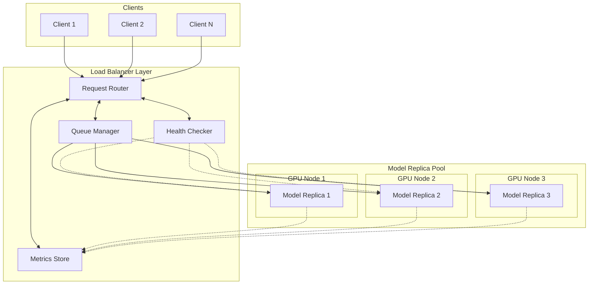
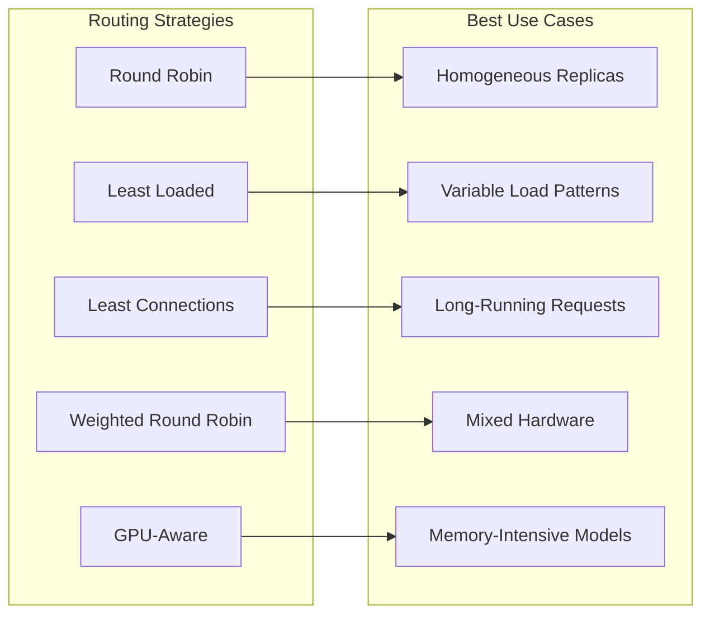
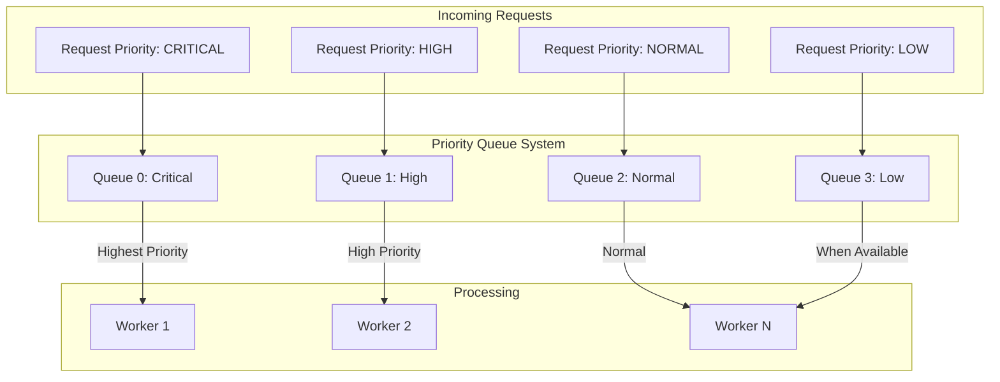
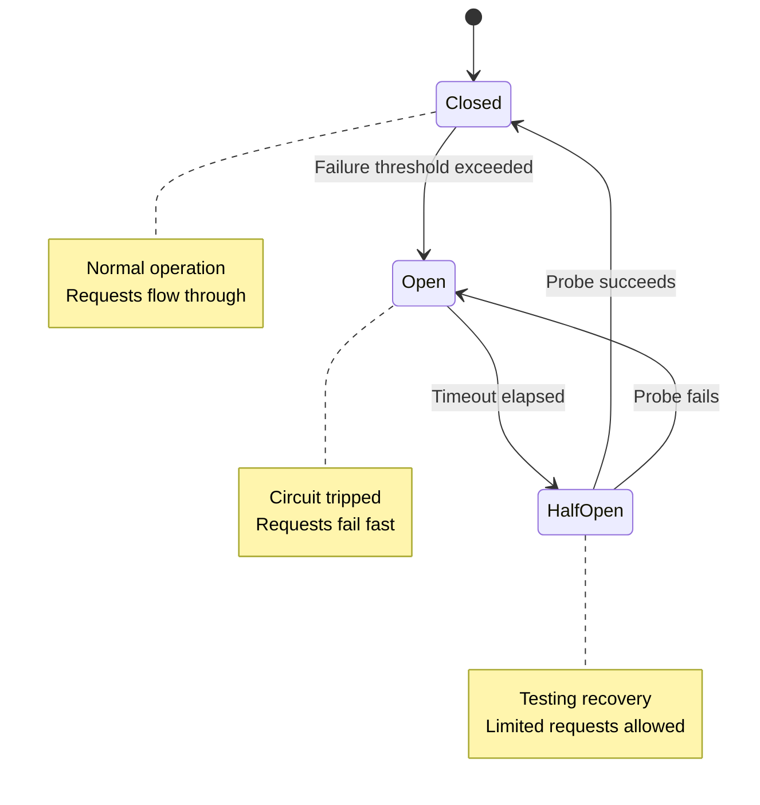

# How to Create LLM Load Balancing

Author: [nawazdhandala](https://github.com/nawazdhandala)

Tags: LLMOps, Load Balancing, Scalability, Inference

Description: Learn to create LLM load balancing for distributing inference requests across multiple model replicas.

---

Large Language Model (LLM) inference at scale presents unique challenges. Unlike traditional web services, LLM requests can vary dramatically in processing time, memory consumption, and GPU utilization. A simple chat completion might take 100ms, while a complex reasoning task could require 30 seconds. This variability makes effective load balancing critical for maintaining consistent performance and maximizing resource utilization.

In this guide, we will build a production-ready LLM load balancer from scratch, covering routing strategies, GPU-aware scheduling, queue management, and health monitoring.

## Architecture Overview

Before diving into code, let us understand the high-level architecture of an LLM load balancing system.



The architecture consists of four main components:

1. **Request Router**: Receives incoming requests and determines optimal routing
2. **Queue Manager**: Handles request queuing and priority management
3. **Health Checker**: Monitors model replica health and availability
4. **Metrics Store**: Collects performance data for intelligent routing decisions

## Core Data Structures

Let us start by defining the core data structures that will power our load balancer.

```python
# llm_load_balancer/models.py
"""
Core data models for the LLM load balancer.
These classes define the structure for replicas, requests, and metrics.
"""

from dataclasses import dataclass, field
from enum import Enum
from typing import Optional, Dict, Any
from datetime import datetime
import uuid


class ReplicaStatus(Enum):
    """
    Possible states for a model replica.
    HEALTHY: Ready to accept requests
    BUSY: Currently processing, can still queue
    OVERLOADED: Queue full, reject new requests
    UNHEALTHY: Failed health checks, do not route
    DRAINING: Finishing current requests before shutdown
    """
    HEALTHY = "healthy"
    BUSY = "busy"
    OVERLOADED = "overloaded"
    UNHEALTHY = "unhealthy"
    DRAINING = "draining"


class RequestPriority(Enum):
    """
    Priority levels for incoming requests.
    Higher priority requests are processed first.
    """
    CRITICAL = 0   # System-level requests
    HIGH = 1       # Premium tier customers
    NORMAL = 2     # Standard requests
    LOW = 3        # Background tasks
    BATCH = 4      # Batch processing jobs


@dataclass
class GPUMetrics:
    """
    Real-time GPU utilization metrics for a replica.
    Used for GPU-aware scheduling decisions.
    """
    gpu_id: int
    utilization_percent: float      # Current GPU compute utilization (0-100)
    memory_used_gb: float           # VRAM currently in use
    memory_total_gb: float          # Total VRAM available
    temperature_celsius: float      # GPU temperature
    power_usage_watts: float        # Current power consumption

    @property
    def memory_free_gb(self) -> float:
        """Calculate available GPU memory."""
        return self.memory_total_gb - self.memory_used_gb

    @property
    def memory_utilization_percent(self) -> float:
        """Calculate memory utilization as a percentage."""
        return (self.memory_used_gb / self.memory_total_gb) * 100


@dataclass
class ModelReplica:
    """
    Represents a single model replica instance.
    Contains connection info, current state, and performance metrics.
    """
    replica_id: str
    host: str
    port: int
    model_name: str
    status: ReplicaStatus = ReplicaStatus.HEALTHY

    # Performance tracking
    current_requests: int = 0           # Active requests being processed
    queued_requests: int = 0            # Requests waiting in queue
    max_concurrent_requests: int = 8    # Maximum parallel requests
    max_queue_size: int = 100           # Maximum queue depth

    # Metrics for intelligent routing
    avg_latency_ms: float = 0.0         # Rolling average latency
    requests_processed: int = 0          # Total requests handled
    error_count: int = 0                 # Total errors encountered
    last_health_check: Optional[datetime] = None

    # GPU information
    gpu_metrics: Optional[GPUMetrics] = None

    @property
    def load_score(self) -> float:
        """
        Calculate a normalized load score (0-1).
        Lower is better. Used for least-loaded routing.
        """
        # Weight current requests more heavily than queued
        active_weight = 0.7
        queue_weight = 0.3

        active_ratio = self.current_requests / self.max_concurrent_requests
        queue_ratio = self.queued_requests / self.max_queue_size

        return (active_weight * active_ratio) + (queue_weight * queue_ratio)

    @property
    def can_accept_request(self) -> bool:
        """Check if this replica can accept new requests."""
        if self.status in (ReplicaStatus.UNHEALTHY, ReplicaStatus.DRAINING):
            return False
        if self.status == ReplicaStatus.OVERLOADED:
            return False
        return self.queued_requests < self.max_queue_size

    @property
    def endpoint_url(self) -> str:
        """Construct the API endpoint URL."""
        return f"http://{self.host}:{self.port}/v1/completions"


@dataclass
class InferenceRequest:
    """
    Represents an incoming inference request.
    Contains the prompt, parameters, and routing metadata.
    """
    request_id: str = field(default_factory=lambda: str(uuid.uuid4()))
    prompt: str = ""
    max_tokens: int = 256
    temperature: float = 0.7
    priority: RequestPriority = RequestPriority.NORMAL

    # Routing hints
    preferred_replica: Optional[str] = None  # Sticky session support
    timeout_seconds: float = 30.0

    # Tracking
    created_at: datetime = field(default_factory=datetime.utcnow)
    started_at: Optional[datetime] = None
    completed_at: Optional[datetime] = None
    assigned_replica: Optional[str] = None

    # Request characteristics for smart routing
    estimated_tokens: Optional[int] = None  # Estimated total tokens

    @property
    def queue_time_ms(self) -> Optional[float]:
        """Calculate time spent waiting in queue."""
        if self.started_at:
            delta = self.started_at - self.created_at
            return delta.total_seconds() * 1000
        return None

    @property
    def processing_time_ms(self) -> Optional[float]:
        """Calculate actual inference time."""
        if self.started_at and self.completed_at:
            delta = self.completed_at - self.started_at
            return delta.total_seconds() * 1000
        return None
```

## Routing Strategies

Different routing strategies are suitable for different scenarios. Let us implement several approaches.



```python
# llm_load_balancer/routing.py
"""
Routing strategies for distributing requests across model replicas.
Each strategy implements a different algorithm for replica selection.
"""

from abc import ABC, abstractmethod
from typing import List, Optional, Dict
import random
from collections import defaultdict
import threading

from .models import ModelReplica, InferenceRequest, ReplicaStatus


class RoutingStrategy(ABC):
    """
    Abstract base class for routing strategies.
    All strategies must implement the select_replica method.
    """

    @abstractmethod
    def select_replica(
        self,
        request: InferenceRequest,
        replicas: List[ModelReplica]
    ) -> Optional[ModelReplica]:
        """
        Select the best replica for the given request.
        Returns None if no suitable replica is available.
        """
        pass

    def get_available_replicas(
        self,
        replicas: List[ModelReplica]
    ) -> List[ModelReplica]:
        """Filter replicas to only those that can accept requests."""
        return [r for r in replicas if r.can_accept_request]


class RoundRobinStrategy(RoutingStrategy):
    """
    Simple round-robin distribution.

    Pros:
    - Simple and predictable
    - Even distribution over time
    - No state to track beyond counter

    Cons:
    - Ignores actual replica load
    - Poor for variable request complexity
    - Can overload slow replicas

    Best for: Homogeneous replicas with similar request patterns.
    """

    def __init__(self):
        self._counter = 0
        self._lock = threading.Lock()

    def select_replica(
        self,
        request: InferenceRequest,
        replicas: List[ModelReplica]
    ) -> Optional[ModelReplica]:
        available = self.get_available_replicas(replicas)
        if not available:
            return None

        with self._lock:
            # Select replica at current counter position
            selected = available[self._counter % len(available)]
            self._counter += 1

        return selected


class LeastConnectionsStrategy(RoutingStrategy):
    """
    Route to the replica with fewest active connections.

    Pros:
    - Adapts to varying request durations
    - Naturally balances long vs short requests
    - Simple to understand and debug

    Cons:
    - Does not consider queue depth
    - May not reflect actual GPU load

    Best for: Requests with highly variable processing times.
    """

    def select_replica(
        self,
        request: InferenceRequest,
        replicas: List[ModelReplica]
    ) -> Optional[ModelReplica]:
        available = self.get_available_replicas(replicas)
        if not available:
            return None

        # Find replica with minimum current requests
        # Use replica_id as tiebreaker for deterministic behavior
        return min(
            available,
            key=lambda r: (r.current_requests, r.replica_id)
        )


class LeastLoadedStrategy(RoutingStrategy):
    """
    Route to the replica with lowest overall load score.

    The load score considers both active requests and queue depth,
    providing a more complete picture of replica capacity.

    Pros:
    - Considers multiple load factors
    - Better than simple connection counting
    - Configurable weighting

    Cons:
    - Slightly more complex calculation
    - May oscillate under rapid request bursts

    Best for: Production systems with varying load patterns.
    """

    def select_replica(
        self,
        request: InferenceRequest,
        replicas: List[ModelReplica]
    ) -> Optional[ModelReplica]:
        available = self.get_available_replicas(replicas)
        if not available:
            return None

        # Select replica with lowest load score
        return min(available, key=lambda r: r.load_score)


class WeightedRoundRobinStrategy(RoutingStrategy):
    """
    Round-robin with weights based on replica capacity.

    Replicas with higher max_concurrent_requests get proportionally
    more traffic. Useful when replicas have different hardware.

    Pros:
    - Accounts for heterogeneous hardware
    - Predictable distribution ratios
    - Easy to tune weights

    Cons:
    - Weights are static
    - Does not adapt to runtime conditions

    Best for: Mixed hardware environments with known capacity ratios.
    """

    def __init__(self):
        self._weights: Dict[str, int] = {}
        self._current_weights: Dict[str, int] = defaultdict(int)
        self._lock = threading.Lock()

    def select_replica(
        self,
        request: InferenceRequest,
        replicas: List[ModelReplica]
    ) -> Optional[ModelReplica]:
        available = self.get_available_replicas(replicas)
        if not available:
            return None

        with self._lock:
            # Update weights for available replicas
            for replica in available:
                # Weight is proportional to max concurrent capacity
                weight = replica.max_concurrent_requests
                self._current_weights[replica.replica_id] += weight

            # Select replica with highest accumulated weight
            selected = max(
                available,
                key=lambda r: self._current_weights[r.replica_id]
            )

            # Reduce selected replica's weight by total weight
            total_weight = sum(r.max_concurrent_requests for r in available)
            self._current_weights[selected.replica_id] -= total_weight

        return selected


class GPUAwareStrategy(RoutingStrategy):
    """
    Route based on GPU utilization and memory availability.

    This strategy considers actual GPU metrics to make routing
    decisions, ensuring requests go to replicas with sufficient
    resources available.

    Pros:
    - Optimal GPU utilization
    - Prevents OOM errors
    - Considers thermal throttling

    Cons:
    - Requires GPU metrics collection
    - More complex implementation
    - Metrics may be slightly stale

    Best for: Large models requiring significant GPU memory.
    """

    def __init__(
        self,
        max_gpu_utilization: float = 85.0,  # Threshold percentage
        max_memory_utilization: float = 90.0,
        max_temperature: float = 80.0
    ):
        self.max_gpu_utilization = max_gpu_utilization
        self.max_memory_utilization = max_memory_utilization
        self.max_temperature = max_temperature

    def _calculate_gpu_score(self, replica: ModelReplica) -> float:
        """
        Calculate a score based on GPU metrics.
        Lower score is better (more available capacity).
        Returns infinity if replica should be avoided.
        """
        gpu = replica.gpu_metrics
        if gpu is None:
            # No GPU metrics available, use load score as fallback
            return replica.load_score

        # Check hard limits - return infinity to exclude replica
        if gpu.utilization_percent > self.max_gpu_utilization:
            return float('inf')
        if gpu.memory_utilization_percent > self.max_memory_utilization:
            return float('inf')
        if gpu.temperature_celsius > self.max_temperature:
            return float('inf')

        # Calculate weighted score from GPU metrics
        # Lower utilization = lower score = better
        util_score = gpu.utilization_percent / 100.0
        mem_score = gpu.memory_utilization_percent / 100.0

        # Temperature penalty (starts at 70C)
        temp_score = max(0, (gpu.temperature_celsius - 70) / 20.0)

        # Combine with weights
        return (0.4 * util_score) + (0.4 * mem_score) + (0.2 * temp_score)

    def select_replica(
        self,
        request: InferenceRequest,
        replicas: List[ModelReplica]
    ) -> Optional[ModelReplica]:
        available = self.get_available_replicas(replicas)
        if not available:
            return None

        # Calculate GPU scores for all replicas
        scored_replicas = [
            (replica, self._calculate_gpu_score(replica))
            for replica in available
        ]

        # Filter out replicas with infinity score
        valid_replicas = [
            (r, s) for r, s in scored_replicas
            if s != float('inf')
        ]

        if not valid_replicas:
            # All replicas are over limits, fall back to least loaded
            return min(available, key=lambda r: r.load_score)

        # Return replica with lowest GPU score
        return min(valid_replicas, key=lambda x: x[1])[0]


class AdaptiveStrategy(RoutingStrategy):
    """
    Adaptive strategy that combines multiple signals.

    Uses a scoring function that considers:
    - Current load and queue depth
    - Recent latency performance
    - Error rate
    - GPU metrics (if available)

    The strategy adapts to changing conditions by weighting
    recent performance more heavily.

    Best for: Production systems requiring robust, adaptive routing.
    """

    def __init__(
        self,
        load_weight: float = 0.3,
        latency_weight: float = 0.3,
        error_weight: float = 0.2,
        gpu_weight: float = 0.2
    ):
        self.load_weight = load_weight
        self.latency_weight = latency_weight
        self.error_weight = error_weight
        self.gpu_weight = gpu_weight

    def _calculate_composite_score(self, replica: ModelReplica) -> float:
        """
        Calculate a composite score from all available metrics.
        Lower score is better.
        """
        # Load score (0-1, lower is better)
        load_score = replica.load_score

        # Latency score (normalized, lower is better)
        # Assume 1000ms is the reference point for normalization
        latency_score = min(1.0, replica.avg_latency_ms / 1000.0)

        # Error rate score (lower is better)
        if replica.requests_processed > 0:
            error_rate = replica.error_count / replica.requests_processed
            error_score = min(1.0, error_rate * 10)  # Scale up small rates
        else:
            error_score = 0.0  # No history, assume good

        # GPU score (if available)
        if replica.gpu_metrics:
            gpu_score = replica.gpu_metrics.utilization_percent / 100.0
        else:
            gpu_score = load_score  # Fallback to load score

        # Weighted combination
        return (
            self.load_weight * load_score +
            self.latency_weight * latency_score +
            self.error_weight * error_score +
            self.gpu_weight * gpu_score
        )

    def select_replica(
        self,
        request: InferenceRequest,
        replicas: List[ModelReplica]
    ) -> Optional[ModelReplica]:
        available = self.get_available_replicas(replicas)
        if not available:
            return None

        # Handle sticky sessions if requested
        if request.preferred_replica:
            preferred = next(
                (r for r in available if r.replica_id == request.preferred_replica),
                None
            )
            if preferred:
                return preferred

        # Score all replicas and select best
        return min(available, key=self._calculate_composite_score)
```

## Queue Management

Effective queue management is essential for handling traffic spikes and ensuring fair request processing.



```python
# llm_load_balancer/queue.py
"""
Queue management for LLM inference requests.
Implements priority queuing with rate limiting and overflow handling.
"""

import asyncio
from typing import Dict, Optional, List, Callable, Awaitable
from datetime import datetime, timedelta
from collections import defaultdict
import heapq
import threading
import logging

from .models import InferenceRequest, RequestPriority, ModelReplica

logger = logging.getLogger(__name__)


class PriorityQueue:
    """
    Thread-safe priority queue for inference requests.

    Requests are ordered by:
    1. Priority level (CRITICAL > HIGH > NORMAL > LOW > BATCH)
    2. Arrival time (FIFO within same priority)

    Supports:
    - Maximum queue size limits
    - Priority-based overflow policies
    - Request timeout and expiration
    """

    def __init__(
        self,
        max_size: int = 10000,
        priority_limits: Optional[Dict[RequestPriority, int]] = None
    ):
        """
        Initialize the priority queue.

        Args:
            max_size: Maximum total queue size
            priority_limits: Optional per-priority limits
        """
        self.max_size = max_size
        self.priority_limits = priority_limits or {}

        # Internal heap storage
        # Entries are tuples: (priority_value, timestamp, request)
        self._heap: List[tuple] = []
        self._lock = threading.Lock()

        # Track counts per priority for limit enforcement
        self._priority_counts: Dict[RequestPriority, int] = defaultdict(int)

        # Condition for blocking wait
        self._not_empty = threading.Condition(self._lock)

        # Track request IDs to prevent duplicates
        self._request_ids: set = set()

    def put(
        self,
        request: InferenceRequest,
        block: bool = True,
        timeout: Optional[float] = None
    ) -> bool:
        """
        Add a request to the queue.

        Args:
            request: The inference request to queue
            block: Whether to block if queue is full
            timeout: Maximum time to wait if blocking

        Returns:
            True if request was queued, False if rejected
        """
        deadline = None
        if timeout is not None:
            deadline = datetime.utcnow() + timedelta(seconds=timeout)

        with self._lock:
            while True:
                # Check for duplicate
                if request.request_id in self._request_ids:
                    logger.warning(
                        f"Duplicate request ID: {request.request_id}"
                    )
                    return False

                # Check total size limit
                if len(self._heap) >= self.max_size:
                    if not block:
                        return False
                    if deadline and datetime.utcnow() >= deadline:
                        return False
                    # Wait for space
                    self._not_empty.wait(timeout=0.1)
                    continue

                # Check priority-specific limit
                priority_limit = self.priority_limits.get(request.priority)
                if priority_limit is not None:
                    if self._priority_counts[request.priority] >= priority_limit:
                        if not block:
                            return False
                        if deadline and datetime.utcnow() >= deadline:
                            return False
                        self._not_empty.wait(timeout=0.1)
                        continue

                # Add to queue
                entry = (
                    request.priority.value,  # Lower value = higher priority
                    request.created_at.timestamp(),  # FIFO within priority
                    request
                )
                heapq.heappush(self._heap, entry)
                self._request_ids.add(request.request_id)
                self._priority_counts[request.priority] += 1

                # Signal waiters
                self._not_empty.notify()
                return True

    def get(
        self,
        block: bool = True,
        timeout: Optional[float] = None
    ) -> Optional[InferenceRequest]:
        """
        Remove and return the highest priority request.

        Args:
            block: Whether to block if queue is empty
            timeout: Maximum time to wait if blocking

        Returns:
            The next request, or None if timeout/non-blocking and empty
        """
        deadline = None
        if timeout is not None:
            deadline = datetime.utcnow() + timedelta(seconds=timeout)

        with self._not_empty:
            while True:
                # Remove expired requests from front of queue
                self._cleanup_expired()

                if self._heap:
                    _, _, request = heapq.heappop(self._heap)
                    self._request_ids.discard(request.request_id)
                    self._priority_counts[request.priority] -= 1
                    return request

                if not block:
                    return None

                if deadline:
                    remaining = (deadline - datetime.utcnow()).total_seconds()
                    if remaining <= 0:
                        return None
                    self._not_empty.wait(timeout=remaining)
                else:
                    self._not_empty.wait()

    def _cleanup_expired(self) -> int:
        """
        Remove requests that have exceeded their timeout.
        Returns the count of removed requests.
        """
        now = datetime.utcnow()
        removed = 0

        # Build new heap without expired entries
        new_heap = []
        for entry in self._heap:
            priority_val, timestamp, request = entry
            age = (now - request.created_at).total_seconds()

            if age < request.timeout_seconds:
                new_heap.append(entry)
            else:
                self._request_ids.discard(request.request_id)
                self._priority_counts[request.priority] -= 1
                removed += 1
                logger.info(
                    f"Request {request.request_id} expired after {age:.1f}s"
                )

        if removed > 0:
            heapq.heapify(new_heap)
            self._heap = new_heap

        return removed

    def peek(self) -> Optional[InferenceRequest]:
        """Return the next request without removing it."""
        with self._lock:
            if self._heap:
                return self._heap[0][2]
            return None

    def size(self) -> int:
        """Return current queue size."""
        with self._lock:
            return len(self._heap)

    def size_by_priority(self) -> Dict[RequestPriority, int]:
        """Return queue size breakdown by priority."""
        with self._lock:
            return dict(self._priority_counts)

    def clear(self) -> int:
        """Clear all requests from the queue. Returns count cleared."""
        with self._lock:
            count = len(self._heap)
            self._heap.clear()
            self._request_ids.clear()
            self._priority_counts.clear()
            return count


class QueueManager:
    """
    Manages request queuing and dispatch to model replicas.

    Features:
    - Per-replica queue management
    - Global priority queue for overflow
    - Rate limiting per client/API key
    - Automatic request retry on failure
    """

    def __init__(
        self,
        global_queue_size: int = 10000,
        per_replica_queue_size: int = 100,
        max_retries: int = 3,
        rate_limit_per_second: float = 100.0
    ):
        # Global queue for incoming requests
        self.global_queue = PriorityQueue(max_size=global_queue_size)

        # Per-replica queues
        self.replica_queues: Dict[str, PriorityQueue] = {}
        self.per_replica_queue_size = per_replica_queue_size

        # Retry tracking
        self.max_retries = max_retries
        self._retry_counts: Dict[str, int] = defaultdict(int)

        # Rate limiting
        self.rate_limit = rate_limit_per_second
        self._rate_limit_tokens: Dict[str, float] = defaultdict(float)
        self._rate_limit_last_update: Dict[str, datetime] = {}

        # Running state
        self._running = False
        self._dispatch_task: Optional[asyncio.Task] = None

        # Metrics
        self.requests_queued = 0
        self.requests_dispatched = 0
        self.requests_rejected = 0
        self.requests_timed_out = 0

    def register_replica(self, replica: ModelReplica) -> None:
        """Register a new model replica with its own queue."""
        if replica.replica_id not in self.replica_queues:
            self.replica_queues[replica.replica_id] = PriorityQueue(
                max_size=self.per_replica_queue_size
            )
            logger.info(f"Registered replica queue: {replica.replica_id}")

    def unregister_replica(self, replica_id: str) -> None:
        """Remove a replica and its queue."""
        if replica_id in self.replica_queues:
            queue = self.replica_queues.pop(replica_id)
            remaining = queue.clear()
            if remaining > 0:
                logger.warning(
                    f"Cleared {remaining} requests from removed replica {replica_id}"
                )

    def check_rate_limit(self, client_id: str) -> bool:
        """
        Check if a client has exceeded their rate limit.
        Uses token bucket algorithm.

        Returns True if request is allowed, False if rate limited.
        """
        now = datetime.utcnow()

        # Initialize or update token bucket
        if client_id not in self._rate_limit_last_update:
            self._rate_limit_tokens[client_id] = self.rate_limit
            self._rate_limit_last_update[client_id] = now
        else:
            # Add tokens based on elapsed time
            elapsed = (now - self._rate_limit_last_update[client_id]).total_seconds()
            self._rate_limit_tokens[client_id] = min(
                self.rate_limit,  # Max tokens = rate limit
                self._rate_limit_tokens[client_id] + (elapsed * self.rate_limit)
            )
            self._rate_limit_last_update[client_id] = now

        # Check if we have tokens available
        if self._rate_limit_tokens[client_id] >= 1.0:
            self._rate_limit_tokens[client_id] -= 1.0
            return True

        return False

    async def enqueue(
        self,
        request: InferenceRequest,
        client_id: Optional[str] = None
    ) -> bool:
        """
        Add a request to the global queue.

        Args:
            request: The inference request
            client_id: Optional client identifier for rate limiting

        Returns:
            True if queued successfully, False if rejected
        """
        # Check rate limit if client_id provided
        if client_id and not self.check_rate_limit(client_id):
            logger.warning(f"Rate limit exceeded for client: {client_id}")
            self.requests_rejected += 1
            return False

        # Attempt to queue
        if self.global_queue.put(request, block=False):
            self.requests_queued += 1
            logger.debug(f"Queued request: {request.request_id}")
            return True

        # Queue full
        logger.warning(
            f"Global queue full, rejecting request: {request.request_id}"
        )
        self.requests_rejected += 1
        return False

    async def dispatch_to_replica(
        self,
        request: InferenceRequest,
        replica: ModelReplica
    ) -> bool:
        """
        Dispatch a request to a specific replica's queue.

        Returns True if dispatched, False if replica queue is full.
        """
        if replica.replica_id not in self.replica_queues:
            self.register_replica(replica)

        queue = self.replica_queues[replica.replica_id]

        if queue.put(request, block=False):
            request.assigned_replica = replica.replica_id
            self.requests_dispatched += 1
            logger.debug(
                f"Dispatched {request.request_id} to {replica.replica_id}"
            )
            return True

        return False

    def get_queue_stats(self) -> Dict:
        """Get current queue statistics."""
        return {
            "global_queue_size": self.global_queue.size(),
            "global_queue_by_priority": self.global_queue.size_by_priority(),
            "replica_queues": {
                rid: q.size()
                for rid, q in self.replica_queues.items()
            },
            "total_queued": self.requests_queued,
            "total_dispatched": self.requests_dispatched,
            "total_rejected": self.requests_rejected,
            "total_timed_out": self.requests_timed_out
        }
```

## GPU-Aware Scheduling

For LLM workloads, GPU utilization is a critical factor. Let us implement GPU metrics collection and scheduling.

```python
# llm_load_balancer/gpu_scheduler.py
"""
GPU-aware scheduling for LLM inference.
Monitors GPU metrics and makes intelligent placement decisions.
"""

import asyncio
from typing import Dict, List, Optional, Tuple
from dataclasses import dataclass
from datetime import datetime, timedelta
import logging

from .models import ModelReplica, GPUMetrics, InferenceRequest

logger = logging.getLogger(__name__)


@dataclass
class GPUNode:
    """
    Represents a GPU node with multiple GPUs.
    Tracks all GPUs on a single machine.
    """
    node_id: str
    hostname: str
    gpus: List[GPUMetrics]
    last_updated: datetime

    @property
    def total_memory_gb(self) -> float:
        """Total GPU memory across all GPUs."""
        return sum(gpu.memory_total_gb for gpu in self.gpus)

    @property
    def free_memory_gb(self) -> float:
        """Total free GPU memory across all GPUs."""
        return sum(gpu.memory_free_gb for gpu in self.gpus)

    @property
    def avg_utilization(self) -> float:
        """Average GPU utilization across all GPUs."""
        if not self.gpus:
            return 0.0
        return sum(gpu.utilization_percent for gpu in self.gpus) / len(self.gpus)


class GPUMetricsCollector:
    """
    Collects GPU metrics from model replicas.

    Uses NVIDIA Management Library (pynvml) or nvidia-smi
    for metrics collection. Can also receive metrics pushed
    from replicas.
    """

    def __init__(
        self,
        collection_interval_seconds: float = 5.0,
        stale_threshold_seconds: float = 30.0
    ):
        self.collection_interval = collection_interval_seconds
        self.stale_threshold = stale_threshold_seconds

        # Cached metrics per replica
        self._metrics_cache: Dict[str, GPUMetrics] = {}
        self._last_collection: Dict[str, datetime] = {}

        # Background collection task
        self._running = False
        self._collection_task: Optional[asyncio.Task] = None

    async def collect_metrics_nvidia_smi(self, host: str) -> Optional[GPUMetrics]:
        """
        Collect GPU metrics using nvidia-smi over SSH.

        This is a fallback method when pynvml is not available.
        In production, you would use the nvidia-ml-py package directly.
        """
        # Example nvidia-smi command output parsing
        # In practice, this would SSH to the host and run nvidia-smi

        # Simulated metrics for demonstration
        # Replace with actual nvidia-smi parsing or pynvml calls
        return GPUMetrics(
            gpu_id=0,
            utilization_percent=45.0,
            memory_used_gb=12.5,
            memory_total_gb=24.0,
            temperature_celsius=65.0,
            power_usage_watts=180.0
        )

    async def collect_metrics_api(
        self,
        replica: ModelReplica
    ) -> Optional[GPUMetrics]:
        """
        Collect GPU metrics via replica's metrics API endpoint.

        Many LLM serving frameworks expose a /metrics endpoint
        that includes GPU utilization information.
        """
        import aiohttp

        metrics_url = f"http://{replica.host}:{replica.port}/metrics"

        try:
            async with aiohttp.ClientSession() as session:
                async with session.get(
                    metrics_url,
                    timeout=aiohttp.ClientTimeout(total=5.0)
                ) as response:
                    if response.status != 200:
                        return None

                    data = await response.json()

                    # Parse metrics from response
                    # Format depends on serving framework
                    return GPUMetrics(
                        gpu_id=data.get("gpu_id", 0),
                        utilization_percent=data.get("gpu_utilization", 0),
                        memory_used_gb=data.get("memory_used_gb", 0),
                        memory_total_gb=data.get("memory_total_gb", 24),
                        temperature_celsius=data.get("temperature", 50),
                        power_usage_watts=data.get("power_watts", 100)
                    )
        except Exception as e:
            logger.warning(
                f"Failed to collect GPU metrics from {replica.replica_id}: {e}"
            )
            return None

    def update_metrics(
        self,
        replica_id: str,
        metrics: GPUMetrics
    ) -> None:
        """
        Update cached metrics for a replica.
        Called when metrics are pushed from replicas.
        """
        self._metrics_cache[replica_id] = metrics
        self._last_collection[replica_id] = datetime.utcnow()

    def get_metrics(self, replica_id: str) -> Optional[GPUMetrics]:
        """
        Get cached metrics for a replica.
        Returns None if metrics are stale or unavailable.
        """
        if replica_id not in self._metrics_cache:
            return None

        last_update = self._last_collection.get(replica_id)
        if last_update is None:
            return None

        age = (datetime.utcnow() - last_update).total_seconds()
        if age > self.stale_threshold:
            logger.debug(f"Stale GPU metrics for {replica_id} (age: {age}s)")
            return None

        return self._metrics_cache[replica_id]

    def is_metrics_fresh(self, replica_id: str) -> bool:
        """Check if metrics for a replica are fresh."""
        return self.get_metrics(replica_id) is not None


class GPUAwareScheduler:
    """
    Scheduler that considers GPU resources when placing requests.

    Features:
    - Memory estimation based on request parameters
    - Bin packing for efficient GPU utilization
    - Thermal throttling avoidance
    - Multi-GPU support
    """

    def __init__(
        self,
        metrics_collector: GPUMetricsCollector,
        memory_per_token_mb: float = 0.5,  # Estimated memory per token
        base_memory_mb: float = 2000,       # Base memory for model
        target_utilization: float = 80.0,   # Target GPU utilization %
        max_temperature: float = 83.0       # Max safe temperature
    ):
        self.metrics = metrics_collector
        self.memory_per_token_mb = memory_per_token_mb
        self.base_memory_mb = base_memory_mb
        self.target_utilization = target_utilization
        self.max_temperature = max_temperature

    def estimate_memory_requirement(
        self,
        request: InferenceRequest
    ) -> float:
        """
        Estimate GPU memory required for a request in MB.

        The estimation considers:
        - Input prompt length (estimated tokens)
        - Maximum output tokens requested
        - KV cache memory requirements
        """
        # Estimate input tokens (rough: 4 chars per token)
        input_tokens = len(request.prompt) / 4

        # Total tokens = input + max output
        total_tokens = input_tokens + request.max_tokens

        # Memory = base + per-token overhead
        # KV cache grows with sequence length
        kv_cache_memory = total_tokens * self.memory_per_token_mb

        return self.base_memory_mb + kv_cache_memory

    def can_fit_request(
        self,
        replica: ModelReplica,
        request: InferenceRequest
    ) -> Tuple[bool, str]:
        """
        Check if a replica can accommodate a request.

        Returns:
            Tuple of (can_fit, reason)
        """
        gpu_metrics = self.metrics.get_metrics(replica.replica_id)

        if gpu_metrics is None:
            # No metrics available, check basic capacity
            if replica.can_accept_request:
                return True, "No GPU metrics, using basic capacity check"
            return False, "Replica cannot accept requests"

        # Check temperature
        if gpu_metrics.temperature_celsius > self.max_temperature:
            return False, f"GPU temperature too high: {gpu_metrics.temperature_celsius}C"

        # Check utilization headroom
        utilization_headroom = self.target_utilization - gpu_metrics.utilization_percent
        if utilization_headroom < 5:  # Need at least 5% headroom
            return False, f"GPU utilization too high: {gpu_metrics.utilization_percent}%"

        # Check memory
        required_memory_mb = self.estimate_memory_requirement(request)
        available_memory_mb = gpu_metrics.memory_free_gb * 1024

        if required_memory_mb > available_memory_mb:
            return (
                False,
                f"Insufficient GPU memory: need {required_memory_mb:.0f}MB, "
                f"have {available_memory_mb:.0f}MB"
            )

        return True, "Request can be accommodated"

    def score_replica(
        self,
        replica: ModelReplica,
        request: InferenceRequest
    ) -> float:
        """
        Score a replica for request placement.
        Lower score is better.

        The score balances:
        - Available capacity (prefer replicas with headroom)
        - Efficient packing (don't waste resources on small requests)
        - Thermal state (prefer cooler GPUs)
        """
        gpu_metrics = self.metrics.get_metrics(replica.replica_id)

        if gpu_metrics is None:
            # Fallback to load-based scoring
            return replica.load_score * 100

        # Memory efficiency score
        # Prefer replicas where request fits well (not too much waste)
        required_memory = self.estimate_memory_requirement(request)
        available_memory = gpu_metrics.memory_free_gb * 1024
        memory_fit_ratio = required_memory / available_memory
        # Best fit is around 0.5 to 0.8 (some headroom but not wasteful)
        memory_score = abs(memory_fit_ratio - 0.6) * 50

        # Utilization score (prefer moderately loaded)
        # Target is around 60-70% for best throughput
        util_distance = abs(gpu_metrics.utilization_percent - 65)
        util_score = util_distance

        # Temperature score (prefer cooler)
        temp_score = max(0, gpu_metrics.temperature_celsius - 60)

        # Queue depth score
        queue_score = replica.queued_requests * 2

        return memory_score + util_score + temp_score + queue_score

    def select_best_replica(
        self,
        request: InferenceRequest,
        replicas: List[ModelReplica]
    ) -> Optional[ModelReplica]:
        """
        Select the best replica for a request using GPU-aware scoring.
        """
        # Filter to replicas that can fit the request
        candidates = []
        for replica in replicas:
            can_fit, reason = self.can_fit_request(replica, request)
            if can_fit:
                score = self.score_replica(replica, request)
                candidates.append((replica, score, reason))
                logger.debug(
                    f"Replica {replica.replica_id}: score={score:.2f}, {reason}"
                )
            else:
                logger.debug(
                    f"Replica {replica.replica_id} excluded: {reason}"
                )

        if not candidates:
            logger.warning("No suitable replica found for request")
            return None

        # Sort by score and return best
        candidates.sort(key=lambda x: x[1])
        best_replica, best_score, _ = candidates[0]

        logger.info(
            f"Selected replica {best_replica.replica_id} with score {best_score:.2f}"
        )
        return best_replica
```

## Health Checking and Circuit Breaker

Robust health checking ensures requests are only sent to healthy replicas.



```python
# llm_load_balancer/health.py
"""
Health checking and circuit breaker implementation.
Ensures requests are only routed to healthy replicas.
"""

import asyncio
from typing import Dict, Optional, Callable, Awaitable
from datetime import datetime, timedelta
from enum import Enum
from dataclasses import dataclass, field
import logging
import aiohttp

from .models import ModelReplica, ReplicaStatus

logger = logging.getLogger(__name__)


class CircuitState(Enum):
    """Circuit breaker states."""
    CLOSED = "closed"       # Normal operation
    OPEN = "open"           # Failing, reject requests
    HALF_OPEN = "half_open" # Testing recovery


@dataclass
class CircuitBreaker:
    """
    Circuit breaker for a single replica.

    Prevents cascading failures by failing fast when a replica
    is known to be unhealthy.
    """
    replica_id: str
    failure_threshold: int = 5          # Failures before opening
    success_threshold: int = 3          # Successes to close from half-open
    timeout_seconds: float = 30.0       # Time before half-open

    # State tracking
    state: CircuitState = CircuitState.CLOSED
    failure_count: int = 0
    success_count: int = 0
    last_failure_time: Optional[datetime] = None
    last_state_change: datetime = field(default_factory=datetime.utcnow)

    def record_success(self) -> None:
        """Record a successful request."""
        if self.state == CircuitState.HALF_OPEN:
            self.success_count += 1
            if self.success_count >= self.success_threshold:
                self._transition_to(CircuitState.CLOSED)
        elif self.state == CircuitState.CLOSED:
            # Reset failure count on success
            self.failure_count = 0

    def record_failure(self) -> None:
        """Record a failed request."""
        self.last_failure_time = datetime.utcnow()

        if self.state == CircuitState.HALF_OPEN:
            # Failure during probe, back to open
            self._transition_to(CircuitState.OPEN)
        elif self.state == CircuitState.CLOSED:
            self.failure_count += 1
            if self.failure_count >= self.failure_threshold:
                self._transition_to(CircuitState.OPEN)

    def can_execute(self) -> bool:
        """Check if requests can be sent through this circuit."""
        if self.state == CircuitState.CLOSED:
            return True

        if self.state == CircuitState.OPEN:
            # Check if timeout has elapsed
            elapsed = (datetime.utcnow() - self.last_state_change).total_seconds()
            if elapsed >= self.timeout_seconds:
                self._transition_to(CircuitState.HALF_OPEN)
                return True  # Allow probe request
            return False

        # Half-open: allow limited requests for probing
        return True

    def _transition_to(self, new_state: CircuitState) -> None:
        """Transition to a new state."""
        old_state = self.state
        self.state = new_state
        self.last_state_change = datetime.utcnow()

        if new_state == CircuitState.CLOSED:
            self.failure_count = 0
            self.success_count = 0
        elif new_state == CircuitState.HALF_OPEN:
            self.success_count = 0

        logger.info(
            f"Circuit breaker {self.replica_id}: {old_state.value} -> {new_state.value}"
        )


class HealthChecker:
    """
    Performs health checks on model replicas.

    Features:
    - Configurable health check endpoints
    - Liveness and readiness probes
    - Automatic status updates
    - Circuit breaker integration
    """

    def __init__(
        self,
        check_interval_seconds: float = 10.0,
        timeout_seconds: float = 5.0,
        unhealthy_threshold: int = 3,
        healthy_threshold: int = 2
    ):
        self.check_interval = check_interval_seconds
        self.timeout = timeout_seconds
        self.unhealthy_threshold = unhealthy_threshold
        self.healthy_threshold = healthy_threshold

        # Track consecutive check results
        self._consecutive_failures: Dict[str, int] = {}
        self._consecutive_successes: Dict[str, int] = {}

        # Circuit breakers per replica
        self._circuit_breakers: Dict[str, CircuitBreaker] = {}

        # Background task
        self._running = False
        self._check_task: Optional[asyncio.Task] = None

        # Registered replicas
        self._replicas: Dict[str, ModelReplica] = {}

    def register_replica(self, replica: ModelReplica) -> None:
        """Register a replica for health checking."""
        self._replicas[replica.replica_id] = replica
        self._consecutive_failures[replica.replica_id] = 0
        self._consecutive_successes[replica.replica_id] = 0
        self._circuit_breakers[replica.replica_id] = CircuitBreaker(
            replica_id=replica.replica_id
        )
        logger.info(f"Registered replica for health checking: {replica.replica_id}")

    def unregister_replica(self, replica_id: str) -> None:
        """Remove a replica from health checking."""
        self._replicas.pop(replica_id, None)
        self._consecutive_failures.pop(replica_id, None)
        self._consecutive_successes.pop(replica_id, None)
        self._circuit_breakers.pop(replica_id, None)

    async def check_health(self, replica: ModelReplica) -> bool:
        """
        Perform a health check on a single replica.

        Checks:
        1. HTTP connectivity to health endpoint
        2. Response contains expected fields
        3. Response time is acceptable
        """
        health_url = f"http://{replica.host}:{replica.port}/health"

        try:
            start_time = datetime.utcnow()

            async with aiohttp.ClientSession() as session:
                async with session.get(
                    health_url,
                    timeout=aiohttp.ClientTimeout(total=self.timeout)
                ) as response:
                    elapsed = (datetime.utcnow() - start_time).total_seconds()

                    if response.status != 200:
                        logger.warning(
                            f"Health check failed for {replica.replica_id}: "
                            f"status {response.status}"
                        )
                        return False

                    # Parse response
                    data = await response.json()

                    # Check for required fields
                    if not data.get("status") == "healthy":
                        logger.warning(
                            f"Replica {replica.replica_id} reports unhealthy status"
                        )
                        return False

                    # Update latency tracking
                    replica.avg_latency_ms = (
                        replica.avg_latency_ms * 0.9 + elapsed * 1000 * 0.1
                    )

                    logger.debug(
                        f"Health check passed for {replica.replica_id} "
                        f"in {elapsed*1000:.0f}ms"
                    )
                    return True

        except asyncio.TimeoutError:
            logger.warning(
                f"Health check timeout for {replica.replica_id}"
            )
            return False
        except Exception as e:
            logger.warning(
                f"Health check error for {replica.replica_id}: {e}"
            )
            return False

    async def check_readiness(self, replica: ModelReplica) -> bool:
        """
        Check if a replica is ready to accept inference requests.

        This is separate from liveness - a replica might be alive
        but not ready (e.g., model still loading).
        """
        ready_url = f"http://{replica.host}:{replica.port}/ready"

        try:
            async with aiohttp.ClientSession() as session:
                async with session.get(
                    ready_url,
                    timeout=aiohttp.ClientTimeout(total=self.timeout)
                ) as response:
                    if response.status == 200:
                        data = await response.json()
                        return data.get("ready", False)
                    return False
        except Exception:
            return False

    def update_replica_status(
        self,
        replica: ModelReplica,
        health_check_passed: bool
    ) -> None:
        """
        Update replica status based on health check result.
        Uses consecutive check thresholds to prevent flapping.
        """
        replica_id = replica.replica_id

        if health_check_passed:
            self._consecutive_failures[replica_id] = 0
            self._consecutive_successes[replica_id] += 1

            # Update circuit breaker
            self._circuit_breakers[replica_id].record_success()

            # Transition to healthy if threshold met
            if (replica.status == ReplicaStatus.UNHEALTHY and
                self._consecutive_successes[replica_id] >= self.healthy_threshold):
                replica.status = ReplicaStatus.HEALTHY
                replica.last_health_check = datetime.utcnow()
                logger.info(f"Replica {replica_id} is now HEALTHY")
        else:
            self._consecutive_successes[replica_id] = 0
            self._consecutive_failures[replica_id] += 1

            # Update circuit breaker
            self._circuit_breakers[replica_id].record_failure()

            # Transition to unhealthy if threshold met
            if (replica.status != ReplicaStatus.UNHEALTHY and
                self._consecutive_failures[replica_id] >= self.unhealthy_threshold):
                replica.status = ReplicaStatus.UNHEALTHY
                replica.error_count += 1
                logger.warning(f"Replica {replica_id} is now UNHEALTHY")

    def get_circuit_breaker(self, replica_id: str) -> Optional[CircuitBreaker]:
        """Get the circuit breaker for a replica."""
        return self._circuit_breakers.get(replica_id)

    async def start(self) -> None:
        """Start the background health checking task."""
        self._running = True
        self._check_task = asyncio.create_task(self._health_check_loop())
        logger.info("Health checker started")

    async def stop(self) -> None:
        """Stop the health checker."""
        self._running = False
        if self._check_task:
            self._check_task.cancel()
            try:
                await self._check_task
            except asyncio.CancelledError:
                pass
        logger.info("Health checker stopped")

    async def _health_check_loop(self) -> None:
        """Background loop that performs periodic health checks."""
        while self._running:
            # Check all replicas in parallel
            tasks = [
                self._check_single_replica(replica)
                for replica in self._replicas.values()
            ]

            if tasks:
                await asyncio.gather(*tasks, return_exceptions=True)

            await asyncio.sleep(self.check_interval)

    async def _check_single_replica(self, replica: ModelReplica) -> None:
        """Perform health check for a single replica."""
        is_healthy = await self.check_health(replica)
        self.update_replica_status(replica, is_healthy)
```

## Putting It All Together: The Load Balancer

Now let us combine all components into a complete load balancer implementation.

```python
# llm_load_balancer/balancer.py
"""
Main load balancer implementation.
Orchestrates routing, queuing, health checking, and metrics.
"""

import asyncio
from typing import Dict, List, Optional, Any
from datetime import datetime
import logging
import aiohttp

from .models import (
    ModelReplica,
    InferenceRequest,
    ReplicaStatus,
    RequestPriority
)
from .routing import (
    RoutingStrategy,
    AdaptiveStrategy,
    GPUAwareStrategy
)
from .queue import QueueManager, PriorityQueue
from .health import HealthChecker
from .gpu_scheduler import GPUMetricsCollector, GPUAwareScheduler

logger = logging.getLogger(__name__)


class LLMLoadBalancer:
    """
    Production-ready LLM load balancer.

    Features:
    - Multiple routing strategies
    - Priority queue management
    - GPU-aware scheduling
    - Health checking with circuit breakers
    - Automatic retry and failover
    - Comprehensive metrics
    """

    def __init__(
        self,
        routing_strategy: Optional[RoutingStrategy] = None,
        enable_gpu_aware_scheduling: bool = True,
        max_retries: int = 3,
        retry_delay_seconds: float = 1.0
    ):
        # Routing
        self.routing_strategy = routing_strategy or AdaptiveStrategy()
        self.enable_gpu_aware = enable_gpu_aware_scheduling

        # Retry configuration
        self.max_retries = max_retries
        self.retry_delay = retry_delay_seconds

        # Components
        self.queue_manager = QueueManager()
        self.health_checker = HealthChecker()
        self.gpu_collector = GPUMetricsCollector()
        self.gpu_scheduler = GPUAwareScheduler(self.gpu_collector)

        # Replica registry
        self._replicas: Dict[str, ModelReplica] = {}

        # Metrics tracking
        self._metrics = {
            "requests_received": 0,
            "requests_completed": 0,
            "requests_failed": 0,
            "total_latency_ms": 0.0,
            "retries": 0
        }

        # Running state
        self._running = False
        self._dispatch_task: Optional[asyncio.Task] = None

    def add_replica(self, replica: ModelReplica) -> None:
        """
        Register a new model replica with the load balancer.
        """
        self._replicas[replica.replica_id] = replica
        self.health_checker.register_replica(replica)
        self.queue_manager.register_replica(replica)
        logger.info(f"Added replica: {replica.replica_id} at {replica.endpoint_url}")

    def remove_replica(self, replica_id: str) -> None:
        """
        Remove a replica from the load balancer.
        Sets replica to draining state first to complete in-flight requests.
        """
        if replica_id in self._replicas:
            replica = self._replicas[replica_id]
            replica.status = ReplicaStatus.DRAINING

            # Schedule actual removal after drain period
            asyncio.create_task(self._drain_and_remove(replica_id))
            logger.info(f"Replica {replica_id} set to draining")

    async def _drain_and_remove(
        self,
        replica_id: str,
        timeout: float = 30.0
    ) -> None:
        """Wait for replica to drain, then remove it."""
        start = datetime.utcnow()

        while (datetime.utcnow() - start).total_seconds() < timeout:
            replica = self._replicas.get(replica_id)
            if replica and replica.current_requests == 0:
                break
            await asyncio.sleep(1.0)

        # Remove from all components
        self._replicas.pop(replica_id, None)
        self.health_checker.unregister_replica(replica_id)
        self.queue_manager.unregister_replica(replica_id)
        logger.info(f"Replica {replica_id} removed")

    def get_replicas(self) -> List[ModelReplica]:
        """Get all registered replicas."""
        return list(self._replicas.values())

    def get_healthy_replicas(self) -> List[ModelReplica]:
        """Get only healthy replicas that can accept requests."""
        return [
            r for r in self._replicas.values()
            if r.status in (ReplicaStatus.HEALTHY, ReplicaStatus.BUSY)
            and r.can_accept_request
        ]

    async def submit_request(
        self,
        request: InferenceRequest,
        client_id: Optional[str] = None
    ) -> Dict[str, Any]:
        """
        Submit an inference request to the load balancer.

        Returns the inference result or raises an exception.
        """
        self._metrics["requests_received"] += 1

        # Try to route and execute with retries
        last_error = None
        attempts = 0

        while attempts <= self.max_retries:
            try:
                result = await self._execute_request(request)

                # Update metrics
                self._metrics["requests_completed"] += 1
                if request.processing_time_ms:
                    self._metrics["total_latency_ms"] += request.processing_time_ms

                return result

            except Exception as e:
                last_error = e
                attempts += 1
                self._metrics["retries"] += 1

                if attempts <= self.max_retries:
                    logger.warning(
                        f"Request {request.request_id} failed (attempt {attempts}), "
                        f"retrying in {self.retry_delay}s: {e}"
                    )
                    await asyncio.sleep(self.retry_delay)
                    # Exponential backoff
                    self.retry_delay *= 1.5

        # All retries exhausted
        self._metrics["requests_failed"] += 1
        logger.error(
            f"Request {request.request_id} failed after {self.max_retries} retries"
        )
        raise last_error or Exception("Request failed")

    async def _execute_request(
        self,
        request: InferenceRequest
    ) -> Dict[str, Any]:
        """
        Execute a single request attempt.
        Selects a replica and sends the inference request.
        """
        # Get healthy replicas
        healthy_replicas = self.get_healthy_replicas()

        if not healthy_replicas:
            raise Exception("No healthy replicas available")

        # Select replica using configured strategy
        if self.enable_gpu_aware:
            # Update GPU metrics on replicas
            for replica in healthy_replicas:
                metrics = self.gpu_collector.get_metrics(replica.replica_id)
                if metrics:
                    replica.gpu_metrics = metrics

            # Use GPU-aware selection
            selected = self.gpu_scheduler.select_best_replica(
                request,
                healthy_replicas
            )
        else:
            # Use configured routing strategy
            selected = self.routing_strategy.select_replica(
                request,
                healthy_replicas
            )

        if selected is None:
            raise Exception("No suitable replica found")

        # Check circuit breaker
        circuit = self.health_checker.get_circuit_breaker(selected.replica_id)
        if circuit and not circuit.can_execute():
            raise Exception(f"Circuit breaker open for {selected.replica_id}")

        # Execute the request
        request.assigned_replica = selected.replica_id
        request.started_at = datetime.utcnow()
        selected.current_requests += 1

        try:
            result = await self._send_inference_request(selected, request)
            request.completed_at = datetime.utcnow()

            # Update replica metrics
            selected.requests_processed += 1
            if request.processing_time_ms:
                # Exponential moving average for latency
                alpha = 0.1
                selected.avg_latency_ms = (
                    selected.avg_latency_ms * (1 - alpha) +
                    request.processing_time_ms * alpha
                )

            # Record success in circuit breaker
            if circuit:
                circuit.record_success()

            return result

        except Exception as e:
            selected.error_count += 1

            # Record failure in circuit breaker
            if circuit:
                circuit.record_failure()

            raise

        finally:
            selected.current_requests -= 1

    async def _send_inference_request(
        self,
        replica: ModelReplica,
        request: InferenceRequest
    ) -> Dict[str, Any]:
        """
        Send the actual HTTP request to the model replica.
        """
        payload = {
            "prompt": request.prompt,
            "max_tokens": request.max_tokens,
            "temperature": request.temperature
        }

        async with aiohttp.ClientSession() as session:
            async with session.post(
                replica.endpoint_url,
                json=payload,
                timeout=aiohttp.ClientTimeout(total=request.timeout_seconds)
            ) as response:
                if response.status != 200:
                    error_text = await response.text()
                    raise Exception(
                        f"Inference failed with status {response.status}: {error_text}"
                    )

                return await response.json()

    async def start(self) -> None:
        """Start the load balancer and all background tasks."""
        self._running = True

        # Start health checker
        await self.health_checker.start()

        # Start dispatch loop
        self._dispatch_task = asyncio.create_task(self._dispatch_loop())

        logger.info("LLM Load Balancer started")

    async def stop(self) -> None:
        """Stop the load balancer gracefully."""
        self._running = False

        # Stop health checker
        await self.health_checker.stop()

        # Cancel dispatch task
        if self._dispatch_task:
            self._dispatch_task.cancel()
            try:
                await self._dispatch_task
            except asyncio.CancelledError:
                pass

        logger.info("LLM Load Balancer stopped")

    async def _dispatch_loop(self) -> None:
        """
        Background loop that dispatches queued requests to replicas.
        """
        while self._running:
            # Get next request from global queue
            request = self.queue_manager.global_queue.get(
                block=False,
                timeout=0.1
            )

            if request:
                # Dispatch asynchronously
                asyncio.create_task(self._process_queued_request(request))
            else:
                await asyncio.sleep(0.01)  # Small sleep to prevent busy loop

    async def _process_queued_request(
        self,
        request: InferenceRequest
    ) -> None:
        """Process a request from the queue."""
        try:
            await self._execute_request(request)
        except Exception as e:
            logger.error(f"Failed to process queued request: {e}")

    def get_metrics(self) -> Dict[str, Any]:
        """Get current load balancer metrics."""
        avg_latency = 0.0
        if self._metrics["requests_completed"] > 0:
            avg_latency = (
                self._metrics["total_latency_ms"] /
                self._metrics["requests_completed"]
            )

        return {
            **self._metrics,
            "average_latency_ms": avg_latency,
            "replica_count": len(self._replicas),
            "healthy_replica_count": len(self.get_healthy_replicas()),
            "queue_stats": self.queue_manager.get_queue_stats()
        }
```

## Example Usage

Here is how to use the load balancer in a production setting.

```python
# example_usage.py
"""
Example usage of the LLM load balancer.
"""

import asyncio
import logging
from llm_load_balancer import (
    LLMLoadBalancer,
    ModelReplica,
    InferenceRequest,
    RequestPriority,
    GPUAwareStrategy,
    AdaptiveStrategy
)

# Configure logging
logging.basicConfig(
    level=logging.INFO,
    format='%(asctime)s - %(name)s - %(levelname)s - %(message)s'
)

async def main():
    """
    Demonstrate LLM load balancer usage.
    """

    # Create load balancer with GPU-aware routing
    balancer = LLMLoadBalancer(
        routing_strategy=AdaptiveStrategy(
            load_weight=0.3,
            latency_weight=0.3,
            error_weight=0.2,
            gpu_weight=0.2
        ),
        enable_gpu_aware_scheduling=True,
        max_retries=3
    )

    # Register model replicas
    # In production, these would be discovered via service registry
    replicas = [
        ModelReplica(
            replica_id="replica-1",
            host="gpu-node-1.internal",
            port=8080,
            model_name="llama-70b",
            max_concurrent_requests=8,
            max_queue_size=100
        ),
        ModelReplica(
            replica_id="replica-2",
            host="gpu-node-2.internal",
            port=8080,
            model_name="llama-70b",
            max_concurrent_requests=8,
            max_queue_size=100
        ),
        ModelReplica(
            replica_id="replica-3",
            host="gpu-node-3.internal",
            port=8080,
            model_name="llama-70b",
            max_concurrent_requests=4,  # Smaller GPU
            max_queue_size=50
        ),
    ]

    for replica in replicas:
        balancer.add_replica(replica)

    # Start the load balancer
    await balancer.start()

    try:
        # Submit some inference requests
        requests = [
            InferenceRequest(
                prompt="Explain quantum computing in simple terms.",
                max_tokens=500,
                temperature=0.7,
                priority=RequestPriority.NORMAL
            ),
            InferenceRequest(
                prompt="Write a haiku about programming.",
                max_tokens=50,
                temperature=0.9,
                priority=RequestPriority.LOW
            ),
            InferenceRequest(
                prompt="URGENT: Summarize this document...",
                max_tokens=200,
                temperature=0.3,
                priority=RequestPriority.HIGH
            ),
        ]

        # Submit requests concurrently
        tasks = [
            balancer.submit_request(req, client_id="client-123")
            for req in requests
        ]

        results = await asyncio.gather(*tasks, return_exceptions=True)

        # Process results
        for req, result in zip(requests, results):
            if isinstance(result, Exception):
                print(f"Request failed: {result}")
            else:
                print(f"Request {req.request_id}: {result.get('text', '')[:100]}...")

        # Print metrics
        metrics = balancer.get_metrics()
        print("\nLoad Balancer Metrics:")
        print(f"  Requests completed: {metrics['requests_completed']}")
        print(f"  Average latency: {metrics['average_latency_ms']:.2f}ms")
        print(f"  Healthy replicas: {metrics['healthy_replica_count']}")

    finally:
        # Clean shutdown
        await balancer.stop()


if __name__ == "__main__":
    asyncio.run(main())
```

## Kubernetes Deployment

For production deployments, here is a Kubernetes configuration for the load balancer.

```yaml
# kubernetes/llm-load-balancer.yaml
apiVersion: apps/v1
kind: Deployment
metadata:
  name: llm-load-balancer
  labels:
    app: llm-load-balancer
spec:
  replicas: 3  # Multiple instances for HA
  selector:
    matchLabels:
      app: llm-load-balancer
  template:
    metadata:
      labels:
        app: llm-load-balancer
    spec:
      containers:
      - name: load-balancer
        image: your-registry/llm-load-balancer:latest
        ports:
        - containerPort: 8080
          name: http
        - containerPort: 9090
          name: metrics
        env:
        - name: ROUTING_STRATEGY
          value: "adaptive"
        - name: ENABLE_GPU_AWARE
          value: "true"
        - name: MAX_RETRIES
          value: "3"
        - name: HEALTH_CHECK_INTERVAL
          value: "10"
        resources:
          requests:
            cpu: "500m"
            memory: "512Mi"
          limits:
            cpu: "2000m"
            memory: "2Gi"
        livenessProbe:
          httpGet:
            path: /health
            port: 8080
          initialDelaySeconds: 10
          periodSeconds: 10
        readinessProbe:
          httpGet:
            path: /ready
            port: 8080
          initialDelaySeconds: 5
          periodSeconds: 5
---
apiVersion: v1
kind: Service
metadata:
  name: llm-load-balancer
spec:
  selector:
    app: llm-load-balancer
  ports:
  - name: http
    port: 80
    targetPort: 8080
  - name: metrics
    port: 9090
    targetPort: 9090
  type: ClusterIP
---
# HorizontalPodAutoscaler for the load balancer itself
apiVersion: autoscaling/v2
kind: HorizontalPodAutoscaler
metadata:
  name: llm-load-balancer-hpa
spec:
  scaleTargetRef:
    apiVersion: apps/v1
    kind: Deployment
    name: llm-load-balancer
  minReplicas: 2
  maxReplicas: 10
  metrics:
  - type: Resource
    resource:
      name: cpu
      target:
        type: Utilization
        averageUtilization: 70
  - type: Pods
    pods:
      metric:
        name: requests_per_second
      target:
        type: AverageValue
        averageValue: "1000"
```

## Monitoring and Observability

Effective monitoring is crucial for operating LLM load balancers at scale.

```python
# llm_load_balancer/metrics.py
"""
Prometheus metrics for the LLM load balancer.
"""

from prometheus_client import (
    Counter,
    Histogram,
    Gauge,
    Info,
    generate_latest
)

# Request metrics
REQUESTS_TOTAL = Counter(
    'llm_lb_requests_total',
    'Total number of inference requests',
    ['priority', 'status']
)

REQUEST_LATENCY = Histogram(
    'llm_lb_request_latency_seconds',
    'Request latency in seconds',
    ['replica_id'],
    buckets=[0.1, 0.25, 0.5, 1.0, 2.5, 5.0, 10.0, 30.0, 60.0]
)

QUEUE_TIME = Histogram(
    'llm_lb_queue_time_seconds',
    'Time spent in queue',
    ['priority'],
    buckets=[0.01, 0.05, 0.1, 0.5, 1.0, 5.0, 10.0]
)

# Replica metrics
REPLICA_CURRENT_REQUESTS = Gauge(
    'llm_lb_replica_current_requests',
    'Current active requests per replica',
    ['replica_id']
)

REPLICA_QUEUE_DEPTH = Gauge(
    'llm_lb_replica_queue_depth',
    'Queue depth per replica',
    ['replica_id']
)

REPLICA_STATUS = Gauge(
    'llm_lb_replica_status',
    'Replica health status (1=healthy, 0=unhealthy)',
    ['replica_id']
)

# GPU metrics
GPU_UTILIZATION = Gauge(
    'llm_lb_gpu_utilization_percent',
    'GPU utilization percentage',
    ['replica_id', 'gpu_id']
)

GPU_MEMORY_USED = Gauge(
    'llm_lb_gpu_memory_used_bytes',
    'GPU memory used in bytes',
    ['replica_id', 'gpu_id']
)

GPU_TEMPERATURE = Gauge(
    'llm_lb_gpu_temperature_celsius',
    'GPU temperature in Celsius',
    ['replica_id', 'gpu_id']
)

# Circuit breaker metrics
CIRCUIT_BREAKER_STATE = Gauge(
    'llm_lb_circuit_breaker_state',
    'Circuit breaker state (0=closed, 1=open, 2=half-open)',
    ['replica_id']
)

# Queue metrics
GLOBAL_QUEUE_SIZE = Gauge(
    'llm_lb_global_queue_size',
    'Global queue size'
)

QUEUE_SIZE_BY_PRIORITY = Gauge(
    'llm_lb_queue_size_by_priority',
    'Queue size by priority level',
    ['priority']
)


def update_metrics(balancer) -> None:
    """
    Update all Prometheus metrics from load balancer state.
    Call this periodically (e.g., every 5 seconds).
    """
    # Update replica metrics
    for replica in balancer.get_replicas():
        REPLICA_CURRENT_REQUESTS.labels(
            replica_id=replica.replica_id
        ).set(replica.current_requests)

        REPLICA_QUEUE_DEPTH.labels(
            replica_id=replica.replica_id
        ).set(replica.queued_requests)

        REPLICA_STATUS.labels(
            replica_id=replica.replica_id
        ).set(1 if replica.status.value == "healthy" else 0)

        # GPU metrics
        if replica.gpu_metrics:
            gpu = replica.gpu_metrics
            GPU_UTILIZATION.labels(
                replica_id=replica.replica_id,
                gpu_id=str(gpu.gpu_id)
            ).set(gpu.utilization_percent)

            GPU_MEMORY_USED.labels(
                replica_id=replica.replica_id,
                gpu_id=str(gpu.gpu_id)
            ).set(gpu.memory_used_gb * 1024 * 1024 * 1024)

            GPU_TEMPERATURE.labels(
                replica_id=replica.replica_id,
                gpu_id=str(gpu.gpu_id)
            ).set(gpu.temperature_celsius)

        # Circuit breaker
        circuit = balancer.health_checker.get_circuit_breaker(replica.replica_id)
        if circuit:
            state_value = {
                "closed": 0,
                "open": 1,
                "half_open": 2
            }.get(circuit.state.value, 0)
            CIRCUIT_BREAKER_STATE.labels(
                replica_id=replica.replica_id
            ).set(state_value)

    # Queue metrics
    queue_stats = balancer.queue_manager.get_queue_stats()
    GLOBAL_QUEUE_SIZE.set(queue_stats["global_queue_size"])

    for priority, count in queue_stats["global_queue_by_priority"].items():
        QUEUE_SIZE_BY_PRIORITY.labels(
            priority=priority.value
        ).set(count)
```

## Performance Optimization Tips

Here are key optimizations to maximize throughput and minimize latency:

### 1. Connection Pooling

Reuse HTTP connections to replicas to avoid connection setup overhead.

```python
# Use a shared session with connection pooling
connector = aiohttp.TCPConnector(
    limit=100,              # Total connection pool size
    limit_per_host=20,      # Connections per replica
    keepalive_timeout=30,   # Keep connections alive
    enable_cleanup_closed=True
)
session = aiohttp.ClientSession(connector=connector)
```

### 2. Request Batching

Group small requests together when possible.

```python
async def batch_requests(
    requests: List[InferenceRequest],
    max_batch_size: int = 8,
    max_wait_ms: float = 50.0
) -> List[Dict]:
    """
    Batch multiple requests for efficient processing.
    """
    # Group requests by compatible parameters
    # Send as batch to replica supporting batching
    pass
```

### 3. Predictive Scaling

Use metrics to predict load and scale proactively.

```python
def predict_required_replicas(
    current_qps: float,
    avg_latency_ms: float,
    target_latency_ms: float = 500.0
) -> int:
    """
    Predict required replica count based on current metrics.
    """
    # Simple model: replicas needed proportional to qps * latency
    current_capacity = 1000.0 / avg_latency_ms  # Requests per second per replica
    required = int(current_qps / current_capacity) + 1

    # Add headroom
    return int(required * 1.2)
```

## Conclusion

Building an effective LLM load balancer requires careful consideration of the unique characteristics of LLM inference workloads. Unlike traditional web services, LLM requests have highly variable latency, significant GPU memory requirements, and can benefit from intelligent scheduling based on request characteristics.

Key takeaways from this guide:

1. **Choose the right routing strategy** for your workload. GPU-aware routing is essential for large models, while simpler strategies may suffice for smaller deployments.

2. **Implement robust health checking** with circuit breakers to prevent cascading failures and ensure fast failover.

3. **Use priority queues** to ensure critical requests are processed first during high load periods.

4. **Monitor GPU metrics** to make intelligent scheduling decisions and prevent out-of-memory errors.

5. **Plan for graceful degradation** with retry logic, timeouts, and queue limits.

The code provided in this guide gives you a foundation to build upon. Adapt the components to your specific infrastructure, whether that is Kubernetes, bare metal, or cloud-managed services.

For production deployments, consider integrating with service meshes like Istio for additional traffic management capabilities, and use distributed tracing to debug latency issues across your inference pipeline.
