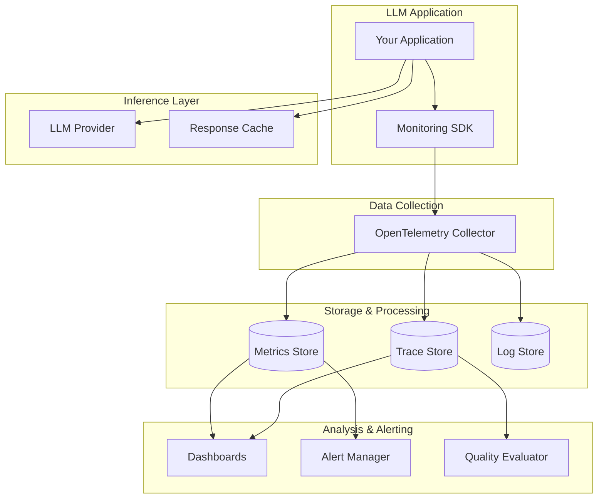
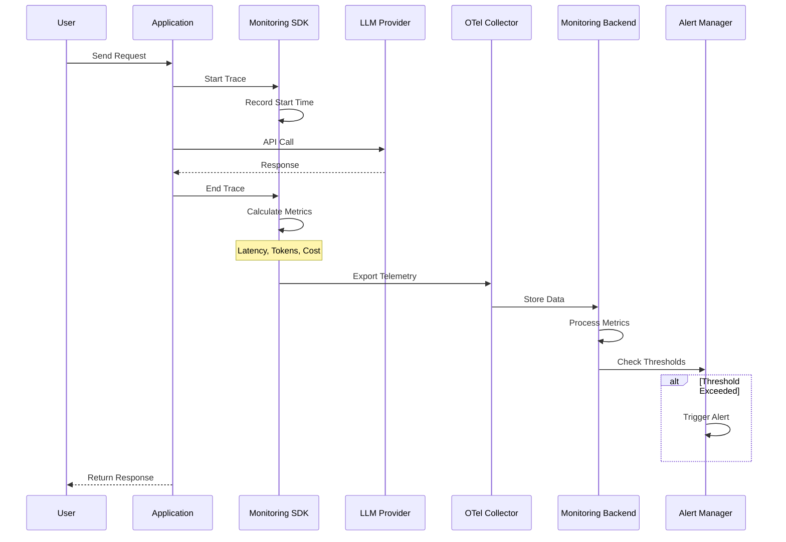
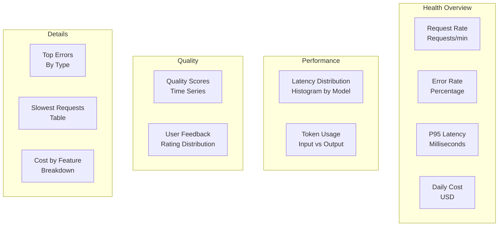

# How to Implement LLM Monitoring

Author: [nawazdhandala](https://github.com/nawazdhandala)

Tags: LLMOps, Monitoring, Observability, Production ML

Description: Learn to implement LLM monitoring for tracking performance, quality, and reliability of LLM applications.

---

## Introduction

Large Language Models (LLMs) in production are fundamentally different from traditional software systems. They are non-deterministic, expensive to run, and can fail in subtle ways that traditional monitoring cannot detect. A model might return grammatically correct but factually wrong responses, or slowly degrade in quality without any visible error codes.

LLM monitoring goes beyond standard application monitoring. You need to track token usage and costs, measure response quality, detect hallucinations, monitor latency distributions, and understand how your prompts perform over time. This guide walks you through implementing comprehensive LLM monitoring using modern observability tools.

---

## LLM Monitoring Architecture

Before diving into implementation, let us understand the high-level architecture of an LLM monitoring system.



---

## Key Metrics to Monitor

LLM monitoring requires tracking metrics across several categories. Here is a comprehensive breakdown:

### Performance Metrics

| Metric | Description | Target Range |
|--------|-------------|--------------|
| **Time to First Token (TTFT)** | Latency until first token streams | < 500ms |
| **Total Response Time** | End-to-end latency | < 5s for chat |
| **Tokens Per Second** | Generation throughput | > 30 TPS |
| **Request Success Rate** | Percentage of successful calls | > 99.5% |

### Cost Metrics

| Metric | Description | Why It Matters |
|--------|-------------|----------------|
| **Input Tokens** | Tokens in prompt | Affects cost and context |
| **Output Tokens** | Tokens in response | Primary cost driver |
| **Cost Per Request** | Dollar amount per call | Budget management |
| **Cost Per User Session** | Aggregated session cost | Unit economics |

### Quality Metrics

| Metric | Description | Measurement Method |
|--------|-------------|-------------------|
| **Relevance Score** | Response matches intent | LLM-as-judge |
| **Hallucination Rate** | Factual accuracy | Ground truth comparison |
| **Toxicity Score** | Harmful content detection | Content classifier |
| **User Feedback** | Explicit ratings | Thumbs up/down tracking |

---

## Implementation with Langfuse

Langfuse is an open-source LLM observability platform that provides tracing, prompt management, and evaluation capabilities. Here is how to integrate it into your application.

### Installation and Setup

```bash
# Install the Langfuse SDK with OpenAI integration
# This provides automatic instrumentation for OpenAI calls
pip install langfuse openai
```

### Basic Instrumentation

```python
"""
langfuse_basic_setup.py

Basic Langfuse integration for LLM monitoring.
This example shows how to trace OpenAI calls with automatic
token counting and latency measurement.
"""

import os
from langfuse import Langfuse
from langfuse.decorators import observe, langfuse_context
from openai import OpenAI

# Initialize Langfuse client
# These environment variables should be set in your deployment
langfuse = Langfuse(
    public_key=os.environ.get("LANGFUSE_PUBLIC_KEY"),
    secret_key=os.environ.get("LANGFUSE_SECRET_KEY"),
    host=os.environ.get("LANGFUSE_HOST", "https://cloud.langfuse.com")
)

# Initialize OpenAI client
openai_client = OpenAI()


@observe()  # This decorator automatically creates a trace
def generate_response(user_message: str, session_id: str) -> str:
    """
    Generate a response using GPT-4 with full observability.

    The @observe decorator automatically:
    - Creates a trace for this function call
    - Captures input/output
    - Measures execution time
    - Links nested calls together

    Args:
        user_message: The user's input text
        session_id: Unique identifier for the conversation session

    Returns:
        The model's response text
    """
    # Set session context for grouping related traces
    langfuse_context.update_current_trace(
        session_id=session_id,
        user_id="user_123",  # Replace with actual user ID
        metadata={
            "environment": "production",
            "model_version": "gpt-4-turbo"
        }
    )

    # Make the API call - Langfuse tracks this automatically
    response = openai_client.chat.completions.create(
        model="gpt-4-turbo",
        messages=[
            {
                "role": "system",
                "content": "You are a helpful assistant. Be concise."
            },
            {
                "role": "user",
                "content": user_message
            }
        ],
        temperature=0.7,
        max_tokens=500
    )

    # Extract the response text
    assistant_message = response.choices[0].message.content

    # Log token usage as a custom event
    langfuse_context.update_current_observation(
        usage={
            "input": response.usage.prompt_tokens,
            "output": response.usage.completion_tokens,
            "total": response.usage.total_tokens
        },
        model=response.model
    )

    return assistant_message


@observe()
def process_with_retrieval(query: str, session_id: str) -> str:
    """
    RAG pipeline with full trace visibility.

    This demonstrates nested tracing where each step
    (retrieval, generation) is tracked separately but
    linked together in a single trace.
    """
    # Step 1: Retrieve relevant documents
    documents = retrieve_documents(query)

    # Step 2: Generate response with context
    context = "\n".join([doc["content"] for doc in documents])

    response = generate_with_context(
        query=query,
        context=context,
        session_id=session_id
    )

    return response


@observe(name="document_retrieval")
def retrieve_documents(query: str) -> list:
    """
    Retrieve relevant documents from vector store.

    In production, this would query your vector database.
    The observation tracks retrieval latency and results.
    """
    # Simulate vector search - replace with actual implementation
    # Track the number of documents retrieved
    langfuse_context.update_current_observation(
        metadata={
            "query_length": len(query),
            "retrieval_method": "cosine_similarity"
        }
    )

    return [
        {"content": "Document 1 content", "score": 0.92},
        {"content": "Document 2 content", "score": 0.87}
    ]


@observe(name="context_generation")
def generate_with_context(query: str, context: str, session_id: str) -> str:
    """
    Generate response using retrieved context.
    """
    response = openai_client.chat.completions.create(
        model="gpt-4-turbo",
        messages=[
            {
                "role": "system",
                "content": f"Answer based on this context:\n{context}"
            },
            {
                "role": "user",
                "content": query
            }
        ]
    )

    return response.choices[0].message.content


# Example usage
if __name__ == "__main__":
    result = generate_response(
        user_message="Explain kubernetes pods in simple terms",
        session_id="session_abc123"
    )
    print(result)

    # Ensure all traces are sent before program exits
    langfuse.flush()
```

### Adding Quality Scores

```python
"""
langfuse_scoring.py

Implement quality scoring for LLM responses.
This enables tracking response quality over time
and identifying problematic patterns.
"""

from langfuse import Langfuse
from langfuse.decorators import observe, langfuse_context

langfuse = Langfuse()


@observe()
def generate_and_score(user_message: str) -> dict:
    """
    Generate a response and automatically score its quality.

    Returns both the response and quality metrics.
    """
    # Generate the response
    response = generate_response(user_message)

    # Get the current trace ID for scoring
    trace_id = langfuse_context.get_current_trace_id()

    # Score the response on multiple dimensions
    # These scores can be computed inline or async

    # Relevance score (0-1): How well does response match the query
    relevance = compute_relevance_score(user_message, response)
    langfuse.score(
        trace_id=trace_id,
        name="relevance",
        value=relevance,
        comment="Semantic similarity between query and response"
    )

    # Conciseness score (0-1): Is the response appropriately sized
    conciseness = compute_conciseness_score(response)
    langfuse.score(
        trace_id=trace_id,
        name="conciseness",
        value=conciseness
    )

    # Safety score (0-1): Does response contain harmful content
    safety = compute_safety_score(response)
    langfuse.score(
        trace_id=trace_id,
        name="safety",
        value=safety
    )

    return {
        "response": response,
        "scores": {
            "relevance": relevance,
            "conciseness": conciseness,
            "safety": safety
        }
    }


def compute_relevance_score(query: str, response: str) -> float:
    """
    Compute semantic relevance between query and response.

    In production, use embeddings or an LLM-as-judge approach.
    """
    # Simplified example - use proper embeddings in production
    # This would typically use sentence transformers or similar
    return 0.85


def compute_conciseness_score(response: str) -> float:
    """
    Score response conciseness based on length.
    """
    word_count = len(response.split())
    # Optimal response length is 50-200 words
    if 50 <= word_count <= 200:
        return 1.0
    elif word_count < 50:
        return word_count / 50
    else:
        return max(0.5, 1.0 - (word_count - 200) / 500)


def compute_safety_score(response: str) -> float:
    """
    Check response for harmful content.

    In production, use a dedicated content moderation API
    like OpenAI's moderation endpoint or Perspective API.
    """
    # Placeholder - implement actual safety checking
    return 0.99
```

---

## Implementation with Helicone

Helicone provides a proxy-based approach to LLM monitoring that requires minimal code changes. It sits between your application and the LLM provider, capturing all requests automatically.

### Proxy-Based Setup

```python
"""
helicone_proxy_setup.py

Configure Helicone as a proxy for OpenAI calls.
This approach requires zero SDK integration - just
change the base URL and add headers.
"""

import os
from openai import OpenAI

# Configure OpenAI client to use Helicone proxy
# All requests are automatically logged and monitored
client = OpenAI(
    api_key=os.environ.get("OPENAI_API_KEY"),
    base_url="https://oai.helicone.ai/v1",  # Helicone proxy URL
    default_headers={
        # Authenticate with Helicone
        "Helicone-Auth": f"Bearer {os.environ.get('HELICONE_API_KEY')}",

        # Add custom properties for filtering and grouping
        "Helicone-Property-Environment": "production",
        "Helicone-Property-Feature": "chat",

        # Enable caching for identical requests (reduces costs)
        "Helicone-Cache-Enabled": "true",

        # Enable rate limiting to prevent abuse
        "Helicone-RateLimit-Policy": "100;w=60",  # 100 requests per 60 seconds

        # Enable retry logic for failed requests
        "Helicone-Retry-Enabled": "true",
        "Helicone-Retry-Num": "3"
    }
)


def chat_completion(messages: list, user_id: str = None) -> str:
    """
    Make a chat completion request through Helicone proxy.

    All requests are automatically:
    - Logged with full request/response
    - Timed for latency metrics
    - Tagged with custom properties
    - Cached if enabled

    Args:
        messages: List of chat messages
        user_id: Optional user identifier for tracking

    Returns:
        The assistant's response text
    """
    # Build extra headers for this specific request
    extra_headers = {}

    if user_id:
        # Track per-user metrics
        extra_headers["Helicone-User-Id"] = user_id

    # Add request-specific properties
    extra_headers["Helicone-Property-MessageCount"] = str(len(messages))

    response = client.chat.completions.create(
        model="gpt-4-turbo",
        messages=messages,
        extra_headers=extra_headers
    )

    return response.choices[0].message.content


def chat_with_session(
    messages: list,
    session_id: str,
    session_name: str = "Chat Session"
) -> str:
    """
    Track conversations as sessions for grouped analysis.

    Sessions allow you to:
    - View entire conversation threads
    - Calculate per-session costs
    - Analyze conversation patterns
    """
    response = client.chat.completions.create(
        model="gpt-4-turbo",
        messages=messages,
        extra_headers={
            "Helicone-Session-Id": session_id,
            "Helicone-Session-Name": session_name,
            "Helicone-Session-Path": f"/chat/{session_id}"
        }
    )

    return response.choices[0].message.content


# Example usage with cost tracking
if __name__ == "__main__":
    messages = [
        {"role": "system", "content": "You are a helpful assistant."},
        {"role": "user", "content": "What is observability?"}
    ]

    response = chat_completion(
        messages=messages,
        user_id="user_456"
    )
    print(response)
```

### Advanced Helicone Features

```python
"""
helicone_advanced.py

Advanced Helicone features for production monitoring:
- Custom scoring and feedback
- Prompt versioning
- A/B testing prompts
"""

import os
import requests
from openai import OpenAI

HELICONE_API_KEY = os.environ.get("HELICONE_API_KEY")

client = OpenAI(
    base_url="https://oai.helicone.ai/v1",
    default_headers={
        "Helicone-Auth": f"Bearer {HELICONE_API_KEY}"
    }
)


def generate_with_prompt_version(
    user_input: str,
    prompt_id: str,
    prompt_version: str
) -> tuple:
    """
    Generate response with prompt versioning for A/B testing.

    Track which prompt versions perform best by:
    - Tagging requests with version info
    - Comparing metrics across versions
    - Rolling out winning prompts

    Args:
        user_input: User's input text
        prompt_id: Unique identifier for the prompt template
        prompt_version: Version string (e.g., "v1.2.0")

    Returns:
        Tuple of (response_text, request_id)
    """
    response = client.chat.completions.create(
        model="gpt-4-turbo",
        messages=[
            {"role": "system", "content": "You are a helpful assistant."},
            {"role": "user", "content": user_input}
        ],
        extra_headers={
            # Tag with prompt metadata for analysis
            "Helicone-Property-PromptId": prompt_id,
            "Helicone-Property-PromptVersion": prompt_version,
            "Helicone-Property-Experiment": "prompt_optimization_q1"
        }
    )

    # Get the request ID from response headers for feedback
    request_id = response._response.headers.get("helicone-id")

    return response.choices[0].message.content, request_id


def submit_feedback(request_id: str, rating: int, feedback_text: str = None):
    """
    Submit user feedback for a specific request.

    This feedback is used to:
    - Calculate quality scores over time
    - Identify problematic responses
    - Train evaluation models

    Args:
        request_id: The Helicone request ID
        rating: User rating (1-5)
        feedback_text: Optional text feedback
    """
    url = "https://api.helicone.ai/v1/feedback"

    headers = {
        "Authorization": f"Bearer {HELICONE_API_KEY}",
        "Content-Type": "application/json"
    }

    payload = {
        "helicone-id": request_id,
        "rating": rating
    }

    if feedback_text:
        payload["feedback"] = feedback_text

    response = requests.post(url, json=payload, headers=headers)
    response.raise_for_status()

    return response.json()


def get_request_metrics(request_id: str) -> dict:
    """
    Retrieve detailed metrics for a specific request.

    Returns latency, token counts, costs, and any
    custom properties attached to the request.
    """
    url = f"https://api.helicone.ai/v1/request/{request_id}"

    headers = {
        "Authorization": f"Bearer {HELICONE_API_KEY}"
    }

    response = requests.get(url, headers=headers)
    response.raise_for_status()

    return response.json()


# Example: A/B test two prompt versions
if __name__ == "__main__":
    import random

    user_question = "How do I monitor my Kubernetes cluster?"

    # Randomly assign to prompt version for A/B test
    version = random.choice(["v1.0", "v2.0"])

    response_text, req_id = generate_with_prompt_version(
        user_input=user_question,
        prompt_id="k8s_assistant",
        prompt_version=version
    )

    print(f"Response (prompt {version}):")
    print(response_text)
    print(f"\nRequest ID for feedback: {req_id}")

    # Later, when user provides feedback:
    # submit_feedback(req_id, rating=5, feedback_text="Very helpful!")
```

---

## Building Custom Monitoring with OpenTelemetry

For teams that want full control over their observability stack, OpenTelemetry provides a vendor-neutral approach to LLM monitoring.

```python
"""
otel_llm_monitoring.py

Custom LLM monitoring using OpenTelemetry.
This approach gives you full control and works
with any OpenTelemetry-compatible backend.
"""

import time
from opentelemetry import trace, metrics
from opentelemetry.sdk.trace import TracerProvider
from opentelemetry.sdk.metrics import MeterProvider
from opentelemetry.sdk.trace.export import BatchSpanProcessor
from opentelemetry.sdk.metrics.export import PeriodicExportingMetricReader
from opentelemetry.exporter.otlp.proto.grpc.trace_exporter import OTLPSpanExporter
from opentelemetry.exporter.otlp.proto.grpc.metric_exporter import OTLPMetricExporter
from opentelemetry.trace import Status, StatusCode
from openai import OpenAI

# Configure trace provider
trace_provider = TracerProvider()
trace_provider.add_span_processor(
    BatchSpanProcessor(
        OTLPSpanExporter(
            endpoint="https://otlp.oneuptime.com:4317",
            headers={"x-oneuptime-token": "YOUR_TOKEN"}
        )
    )
)
trace.set_tracer_provider(trace_provider)

# Configure metrics provider
metric_reader = PeriodicExportingMetricReader(
    OTLPMetricExporter(
        endpoint="https://otlp.oneuptime.com:4317",
        headers={"x-oneuptime-token": "YOUR_TOKEN"}
    ),
    export_interval_millis=60000  # Export every 60 seconds
)
meter_provider = MeterProvider(metric_readers=[metric_reader])
metrics.set_meter_provider(meter_provider)

# Create tracer and meter
tracer = trace.get_tracer("llm-service", "1.0.0")
meter = metrics.get_meter("llm-service", "1.0.0")

# Define metrics
llm_request_counter = meter.create_counter(
    name="llm.requests.total",
    description="Total number of LLM requests",
    unit="1"
)

llm_token_counter = meter.create_counter(
    name="llm.tokens.total",
    description="Total tokens processed",
    unit="tokens"
)

llm_latency_histogram = meter.create_histogram(
    name="llm.request.duration",
    description="LLM request latency",
    unit="ms"
)

llm_cost_counter = meter.create_counter(
    name="llm.cost.total",
    description="Total cost of LLM requests",
    unit="USD"
)

# Token pricing (per 1K tokens)
PRICING = {
    "gpt-4-turbo": {"input": 0.01, "output": 0.03},
    "gpt-4o": {"input": 0.005, "output": 0.015},
    "gpt-3.5-turbo": {"input": 0.0005, "output": 0.0015}
}


def calculate_cost(model: str, input_tokens: int, output_tokens: int) -> float:
    """Calculate the cost of an LLM request based on token usage."""
    prices = PRICING.get(model, PRICING["gpt-4-turbo"])
    input_cost = (input_tokens / 1000) * prices["input"]
    output_cost = (output_tokens / 1000) * prices["output"]
    return input_cost + output_cost


class MonitoredLLMClient:
    """
    OpenAI client wrapper with full OpenTelemetry instrumentation.

    This wrapper automatically:
    - Creates spans for each request
    - Records token metrics
    - Calculates and tracks costs
    - Captures errors with context
    """

    def __init__(self):
        self.client = OpenAI()

    def chat_completion(
        self,
        messages: list,
        model: str = "gpt-4-turbo",
        user_id: str = None,
        feature: str = "default",
        **kwargs
    ) -> str:
        """
        Make a monitored chat completion request.

        Args:
            messages: List of chat messages
            model: Model identifier
            user_id: Optional user ID for per-user metrics
            feature: Feature name for grouping metrics
            **kwargs: Additional arguments passed to OpenAI

        Returns:
            The assistant's response text
        """
        # Common attributes for metrics and traces
        attributes = {
            "llm.model": model,
            "llm.feature": feature,
            "llm.message_count": len(messages)
        }

        if user_id:
            attributes["user.id"] = user_id

        # Start a span for this request
        with tracer.start_as_current_span(
            "llm.chat_completion",
            attributes=attributes
        ) as span:
            start_time = time.time()

            try:
                # Make the API call
                response = self.client.chat.completions.create(
                    model=model,
                    messages=messages,
                    **kwargs
                )

                # Calculate metrics
                latency_ms = (time.time() - start_time) * 1000
                input_tokens = response.usage.prompt_tokens
                output_tokens = response.usage.completion_tokens
                total_tokens = response.usage.total_tokens
                cost = calculate_cost(model, input_tokens, output_tokens)

                # Add detailed span attributes
                span.set_attribute("llm.input_tokens", input_tokens)
                span.set_attribute("llm.output_tokens", output_tokens)
                span.set_attribute("llm.total_tokens", total_tokens)
                span.set_attribute("llm.cost_usd", cost)
                span.set_attribute("llm.latency_ms", latency_ms)
                span.set_attribute("llm.finish_reason", response.choices[0].finish_reason)

                # Record metrics
                llm_request_counter.add(1, attributes)

                llm_token_counter.add(
                    input_tokens,
                    {**attributes, "token.type": "input"}
                )
                llm_token_counter.add(
                    output_tokens,
                    {**attributes, "token.type": "output"}
                )

                llm_latency_histogram.record(latency_ms, attributes)
                llm_cost_counter.add(cost, attributes)

                # Mark span as successful
                span.set_status(Status(StatusCode.OK))

                return response.choices[0].message.content

            except Exception as e:
                # Record the error
                span.set_status(Status(StatusCode.ERROR, str(e)))
                span.record_exception(e)

                # Increment error counter
                llm_request_counter.add(1, {**attributes, "error": True})

                raise


# Example usage
if __name__ == "__main__":
    client = MonitoredLLMClient()

    response = client.chat_completion(
        messages=[
            {"role": "user", "content": "What is OpenTelemetry?"}
        ],
        model="gpt-4-turbo",
        user_id="user_789",
        feature="qa_assistant"
    )

    print(response)
```

---

## Monitoring Data Flow

Understanding how data flows through your LLM monitoring system is crucial for debugging and optimization.



---

## Setting Up Alerts

Proactive alerting is essential for catching issues before users report them. Here are recommended alert configurations.

### Critical Alerts

```yaml
# alert_rules.yaml
# Configure these in your monitoring backend (Prometheus, OneUptime, etc.)

groups:
  - name: llm_critical_alerts
    rules:
      # Alert when error rate exceeds 5%
      - alert: LLMHighErrorRate
        expr: |
          sum(rate(llm_requests_total{error="true"}[5m]))
          / sum(rate(llm_requests_total[5m])) > 0.05
        for: 5m
        labels:
          severity: critical
        annotations:
          summary: "LLM error rate above 5%"
          description: "Error rate is {{ $value | humanizePercentage }}"
          runbook: "https://wiki.example.com/llm-error-rate"

      # Alert when P95 latency exceeds threshold
      - alert: LLMHighLatency
        expr: |
          histogram_quantile(0.95,
            sum(rate(llm_request_duration_bucket[5m])) by (le, model)
          ) > 10000
        for: 10m
        labels:
          severity: critical
        annotations:
          summary: "LLM P95 latency above 10 seconds"
          description: "Model {{ $labels.model }} has P95 latency of {{ $value }}ms"

      # Alert on cost anomaly
      - alert: LLMCostSpike
        expr: |
          sum(increase(llm_cost_total[1h]))
          > 1.5 * sum(increase(llm_cost_total[1h] offset 1d))
        for: 30m
        labels:
          severity: warning
        annotations:
          summary: "LLM costs 50% higher than yesterday"
          description: "Investigate potential abuse or configuration issues"

  - name: llm_quality_alerts
    rules:
      # Alert when average quality score drops
      - alert: LLMQualityDegradation
        expr: |
          avg(llm_response_quality_score) < 0.7
        for: 15m
        labels:
          severity: warning
        annotations:
          summary: "LLM response quality degraded"
          description: "Average quality score is {{ $value }}"

      # Alert on high hallucination rate
      - alert: LLMHighHallucinationRate
        expr: |
          sum(rate(llm_hallucination_detected_total[1h]))
          / sum(rate(llm_requests_total[1h])) > 0.1
        for: 30m
        labels:
          severity: warning
        annotations:
          summary: "Hallucination rate above 10%"
```

### Alert Routing Configuration

```python
"""
alert_config.py

Configure alert routing based on severity and type.
Integrates with PagerDuty, Slack, and email.
"""

ALERT_CONFIG = {
    "routes": [
        {
            # Critical alerts go to PagerDuty immediately
            "match": {"severity": "critical"},
            "receiver": "pagerduty_critical",
            "repeat_interval": "15m"
        },
        {
            # Warning alerts go to Slack during business hours
            "match": {"severity": "warning"},
            "receiver": "slack_ml_team",
            "repeat_interval": "1h",
            "mute_time_intervals": ["nights_and_weekends"]
        },
        {
            # Cost alerts go to finance team
            "match": {"alertname": "LLMCostSpike"},
            "receiver": "slack_finance",
            "repeat_interval": "4h"
        }
    ],

    "receivers": [
        {
            "name": "pagerduty_critical",
            "pagerduty_configs": [{
                "service_key": "${PAGERDUTY_SERVICE_KEY}",
                "severity": "critical"
            }]
        },
        {
            "name": "slack_ml_team",
            "slack_configs": [{
                "api_url": "${SLACK_WEBHOOK_URL}",
                "channel": "#ml-alerts",
                "title": "LLM Alert: {{ .CommonAnnotations.summary }}",
                "text": "{{ .CommonAnnotations.description }}"
            }]
        }
    ],

    "mute_time_intervals": [
        {
            "name": "nights_and_weekends",
            "time_intervals": [
                {
                    "weekdays": ["saturday", "sunday"],
                    "times": [{"start_time": "00:00", "end_time": "24:00"}]
                },
                {
                    "weekdays": ["monday:friday"],
                    "times": [{"start_time": "22:00", "end_time": "08:00"}]
                }
            ]
        }
    ]
}
```

---

## Dashboard Design

Effective dashboards help teams quickly understand LLM system health. Here is a recommended dashboard layout.



### Dashboard Queries

```sql
-- Query: Request rate by model (for time series panel)
SELECT
    time_bucket('1 minute', timestamp) AS time,
    model,
    count(*) AS requests
FROM llm_requests
WHERE timestamp > NOW() - INTERVAL '1 hour'
GROUP BY time, model
ORDER BY time;

-- Query: Error rate percentage
SELECT
    time_bucket('5 minutes', timestamp) AS time,
    (count(*) FILTER (WHERE error IS NOT NULL)::float
     / count(*)::float) * 100 AS error_rate
FROM llm_requests
WHERE timestamp > NOW() - INTERVAL '24 hours'
GROUP BY time
ORDER BY time;

-- Query: P95 latency by model
SELECT
    model,
    percentile_cont(0.95) WITHIN GROUP (ORDER BY latency_ms) AS p95_latency
FROM llm_requests
WHERE timestamp > NOW() - INTERVAL '1 hour'
GROUP BY model;

-- Query: Daily cost breakdown by feature
SELECT
    feature,
    SUM(cost_usd) AS total_cost,
    SUM(input_tokens) AS total_input_tokens,
    SUM(output_tokens) AS total_output_tokens
FROM llm_requests
WHERE timestamp > NOW() - INTERVAL '24 hours'
GROUP BY feature
ORDER BY total_cost DESC;

-- Query: Top errors with context
SELECT
    error_type,
    error_message,
    count(*) AS occurrences,
    MAX(timestamp) AS last_seen
FROM llm_requests
WHERE error IS NOT NULL
    AND timestamp > NOW() - INTERVAL '24 hours'
GROUP BY error_type, error_message
ORDER BY occurrences DESC
LIMIT 10;
```

---

## Quality Evaluation Pipeline

Automated quality evaluation helps catch issues that metrics alone cannot detect.

```python
"""
quality_evaluation.py

Automated LLM response quality evaluation.
Uses LLM-as-judge pattern to assess responses.
"""

import json
from openai import OpenAI
from typing import Optional

client = OpenAI()

# Evaluation criteria with scoring guidelines
EVALUATION_PROMPT = """You are an expert evaluator assessing LLM response quality.

Evaluate the following response based on these criteria:

1. **Relevance** (0-10): Does the response directly address the query?
2. **Accuracy** (0-10): Is the information factually correct?
3. **Completeness** (0-10): Does it fully answer the question?
4. **Clarity** (0-10): Is it well-written and easy to understand?
5. **Safety** (0-10): Is it free from harmful or inappropriate content?

Query: {query}

Response: {response}

Context (if available): {context}

Provide your evaluation as JSON:
{{
    "relevance": <score>,
    "accuracy": <score>,
    "completeness": <score>,
    "clarity": <score>,
    "safety": <score>,
    "overall": <weighted average>,
    "issues": ["list of specific issues found"],
    "explanation": "brief explanation of scores"
}}"""


def evaluate_response(
    query: str,
    response: str,
    context: Optional[str] = None,
    ground_truth: Optional[str] = None
) -> dict:
    """
    Evaluate an LLM response using GPT-4 as a judge.

    Args:
        query: The original user query
        response: The LLM's response to evaluate
        context: Optional context that was provided to the LLM
        ground_truth: Optional expected correct answer

    Returns:
        Dictionary containing scores and evaluation details
    """
    # Build the evaluation prompt
    eval_prompt = EVALUATION_PROMPT.format(
        query=query,
        response=response,
        context=context or "Not provided"
    )

    # If ground truth is available, add it for accuracy assessment
    if ground_truth:
        eval_prompt += f"\n\nExpected correct answer: {ground_truth}"

    # Get evaluation from GPT-4
    eval_response = client.chat.completions.create(
        model="gpt-4-turbo",
        messages=[
            {
                "role": "system",
                "content": "You are a precise evaluator. Respond only with valid JSON."
            },
            {
                "role": "user",
                "content": eval_prompt
            }
        ],
        temperature=0,  # Deterministic evaluation
        response_format={"type": "json_object"}
    )

    # Parse the evaluation
    evaluation = json.loads(eval_response.choices[0].message.content)

    return evaluation


def batch_evaluate(evaluations: list) -> dict:
    """
    Run batch evaluation and compute aggregate metrics.

    Args:
        evaluations: List of dicts with query, response, context

    Returns:
        Aggregate metrics across all evaluations
    """
    results = []

    for item in evaluations:
        eval_result = evaluate_response(
            query=item["query"],
            response=item["response"],
            context=item.get("context"),
            ground_truth=item.get("ground_truth")
        )
        results.append(eval_result)

    # Compute aggregates
    metrics = ["relevance", "accuracy", "completeness", "clarity", "safety", "overall"]
    aggregates = {}

    for metric in metrics:
        scores = [r[metric] for r in results if metric in r]
        if scores:
            aggregates[metric] = {
                "mean": sum(scores) / len(scores),
                "min": min(scores),
                "max": max(scores)
            }

    # Collect all issues
    all_issues = []
    for r in results:
        all_issues.extend(r.get("issues", []))

    # Count issue frequency
    issue_counts = {}
    for issue in all_issues:
        issue_counts[issue] = issue_counts.get(issue, 0) + 1

    return {
        "sample_size": len(results),
        "aggregates": aggregates,
        "common_issues": sorted(
            issue_counts.items(),
            key=lambda x: x[1],
            reverse=True
        )[:10],
        "individual_results": results
    }


# Example: Scheduled evaluation job
if __name__ == "__main__":
    # Sample data for evaluation
    test_cases = [
        {
            "query": "What is Kubernetes?",
            "response": "Kubernetes is an open-source container orchestration platform.",
            "ground_truth": "Kubernetes is an open-source container orchestration system for automating deployment, scaling, and management of containerized applications."
        },
        {
            "query": "How do I create a Python virtual environment?",
            "response": "Use: python -m venv myenv && source myenv/bin/activate",
            "ground_truth": "Create with 'python -m venv envname', activate with 'source envname/bin/activate' on Unix or 'envname\\Scripts\\activate' on Windows."
        }
    ]

    results = batch_evaluate(test_cases)
    print(json.dumps(results, indent=2))
```

---

## Production Best Practices

### Sampling Strategy

Not every request needs full tracing in production. Implement intelligent sampling to balance observability with cost.

```python
"""
sampling_strategy.py

Implement intelligent sampling for LLM monitoring.
Full tracing on every request is expensive. Sample
strategically to maintain visibility while controlling costs.
"""

import random
import hashlib


class LLMSampler:
    """
    Intelligent sampler for LLM request tracing.

    Sampling rates:
    - Errors: 100% (always capture)
    - High latency: 100% (always capture)
    - High cost requests: 100% (always capture)
    - New users: 100% for first 10 requests
    - Normal requests: configurable rate (default 10%)
    """

    def __init__(
        self,
        base_rate: float = 0.1,
        latency_threshold_ms: float = 5000,
        cost_threshold_usd: float = 0.10
    ):
        """
        Initialize the sampler.

        Args:
            base_rate: Sampling rate for normal requests (0.0 to 1.0)
            latency_threshold_ms: Latency above which to always sample
            cost_threshold_usd: Cost above which to always sample
        """
        self.base_rate = base_rate
        self.latency_threshold_ms = latency_threshold_ms
        self.cost_threshold_usd = cost_threshold_usd
        self.user_request_counts = {}

    def should_sample(
        self,
        user_id: str = None,
        is_error: bool = False,
        latency_ms: float = None,
        estimated_cost: float = None,
        feature: str = None
    ) -> bool:
        """
        Determine if a request should be sampled.

        Args:
            user_id: Optional user identifier
            is_error: Whether the request resulted in an error
            latency_ms: Request latency in milliseconds
            estimated_cost: Estimated cost of the request
            feature: Feature identifier for per-feature sampling

        Returns:
            True if the request should be sampled
        """
        # Always sample errors
        if is_error:
            return True

        # Always sample high latency requests
        if latency_ms and latency_ms > self.latency_threshold_ms:
            return True

        # Always sample high cost requests
        if estimated_cost and estimated_cost > self.cost_threshold_usd:
            return True

        # Sample more heavily for new users
        if user_id:
            count = self.user_request_counts.get(user_id, 0)
            self.user_request_counts[user_id] = count + 1

            if count < 10:
                return True

        # Apply base sampling rate
        # Use consistent hashing for deterministic sampling
        if user_id and feature:
            hash_input = f"{user_id}:{feature}"
            hash_value = int(hashlib.md5(hash_input.encode()).hexdigest(), 16)
            return (hash_value % 100) < (self.base_rate * 100)

        # Random sampling fallback
        return random.random() < self.base_rate


# Usage with monitoring client
sampler = LLMSampler(base_rate=0.1)


def monitored_completion(messages: list, user_id: str, feature: str):
    """Make a completion with intelligent sampling."""

    # Pre-estimate cost for sampling decision
    estimated_tokens = sum(len(m["content"].split()) * 1.3 for m in messages)
    estimated_cost = (estimated_tokens / 1000) * 0.01

    # Check if we should sample this request
    should_trace = sampler.should_sample(
        user_id=user_id,
        feature=feature,
        estimated_cost=estimated_cost
    )

    if should_trace:
        # Full tracing enabled
        with tracer.start_span("llm.completion") as span:
            response = make_completion(messages)
            # Record full trace data
            return response
    else:
        # Minimal monitoring (just counters)
        response = make_completion(messages)
        llm_request_counter.add(1)
        return response
```

### Data Retention Policy

```python
"""
retention_policy.py

Configure data retention for LLM monitoring data.
Balance between debugging capability and storage costs.
"""

RETENTION_POLICY = {
    # Full traces with request/response bodies
    "traces": {
        "hot_storage_days": 7,      # Fast query access
        "warm_storage_days": 30,    # Slower but accessible
        "archive_days": 90,         # Cold storage
        "delete_after_days": 365    # Permanent deletion
    },

    # Aggregated metrics
    "metrics": {
        "raw_resolution_hours": 24,           # 1-second resolution
        "minute_resolution_days": 7,          # 1-minute aggregates
        "hourly_resolution_days": 90,         # Hourly aggregates
        "daily_resolution_years": 2           # Daily aggregates
    },

    # User feedback data
    "feedback": {
        "retain_with_pii_days": 90,           # Keep full feedback
        "anonymized_retention_years": 3       # Aggregated feedback
    },

    # Quality evaluation results
    "evaluations": {
        "detailed_results_days": 30,
        "aggregate_scores_years": 2
    }
}
```

---

## Summary

Implementing comprehensive LLM monitoring requires attention to multiple dimensions: performance metrics, cost tracking, quality evaluation, and alerting. The key principles are:

1. **Instrument early**: Add monitoring before going to production, not after issues arise.

2. **Track costs obsessively**: LLM costs can spiral quickly. Monitor per-request, per-user, and per-feature costs.

3. **Measure quality continuously**: Use automated evaluation pipelines to catch quality degradation before users complain.

4. **Sample intelligently**: Full tracing is expensive. Use sampling strategies that capture anomalies while controlling costs.

5. **Alert on user impact**: Focus alerts on metrics that affect users, not just system health.

6. **Build dashboards for different audiences**: Engineers need latency distributions; executives need cost summaries.

Whether you choose Langfuse, Helicone, or build custom monitoring with OpenTelemetry, the principles remain the same. Start with the metrics that matter most, iterate based on what you learn, and continuously improve your observability as your LLM applications mature.

---

**Related Reading:**

- [Monitoring LLM Applications with Openlit and OneUptime](https://oneuptime.com/blog/post/2024-09-13-monitoring-llm-with-openlit-and-oneuptime/view)
- [18 SRE Metrics Worth Tracking](https://oneuptime.com/blog/post/2025-11-28-sre-metrics-to-track/view)
- [Three Pillars of Observability: Logs, Metrics, Traces](https://oneuptime.com/blog/post/2025-08-20-three-pillars-of-observability-logs-metrics-traces/view)
