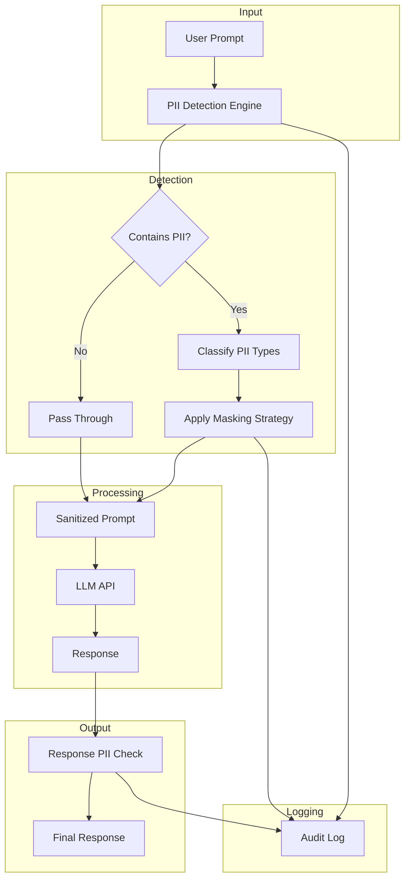
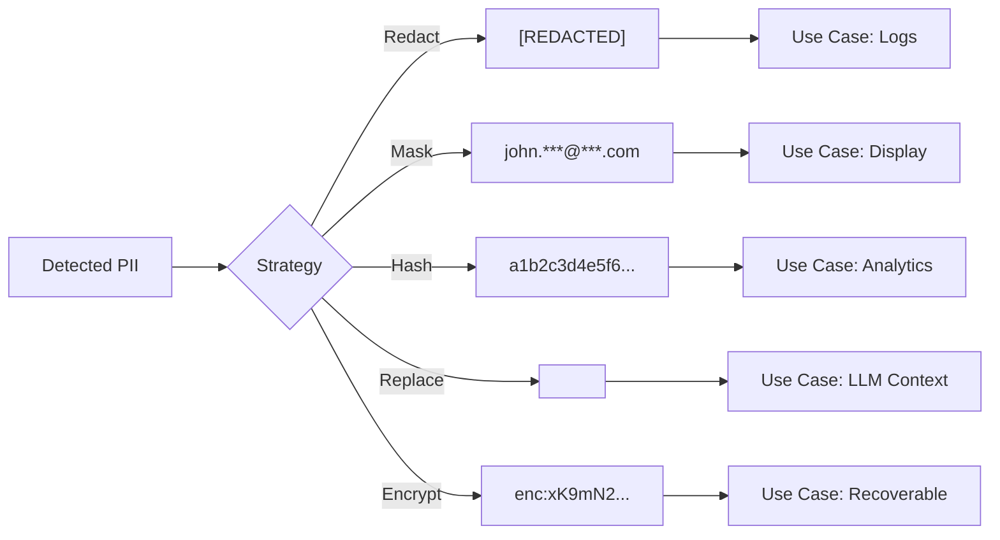
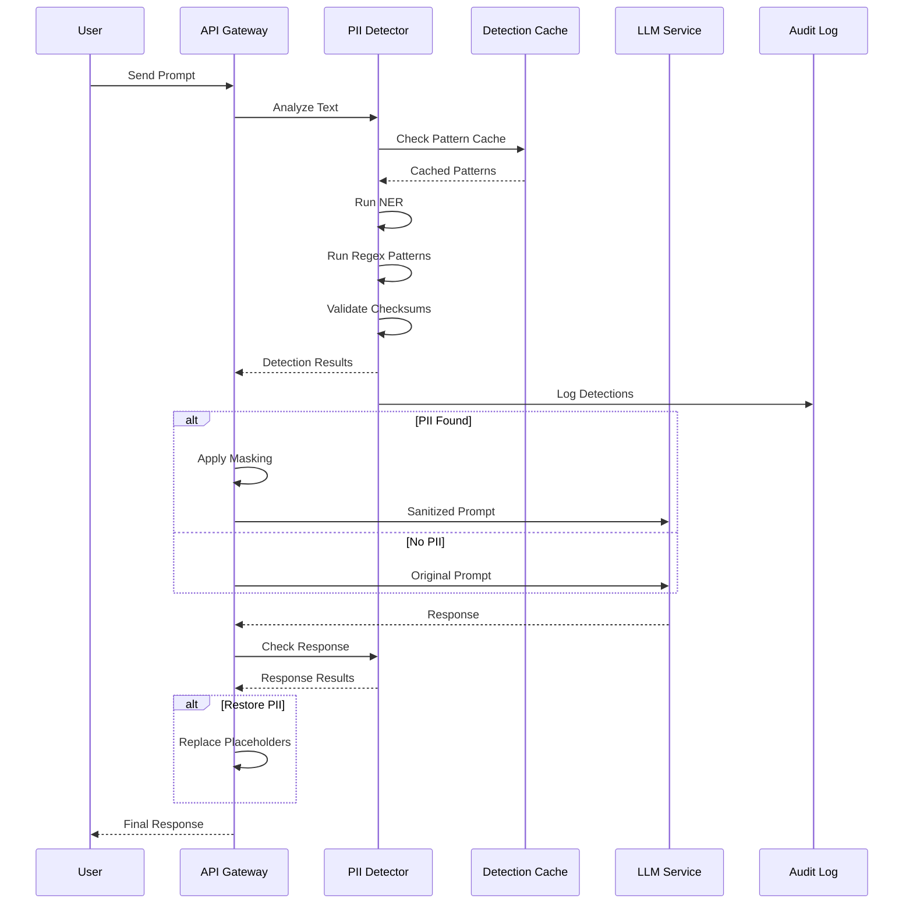

# How to Build PII Detection

Author: [nawazdhandala](https://github.com/nawazdhandala)

Tags: LLMOps, PII Detection, Privacy, Data Protection

Description: Learn to build PII detection for identifying and protecting personally identifiable information in LLM pipelines.

---

Large Language Models process vast amounts of text, and that text often contains personally identifiable information (PII). Whether you are building a customer support chatbot, a document summarization service, or a code assistant, you need mechanisms to detect and handle sensitive data before it reaches your models or gets logged in your telemetry.

This guide walks you through building a production-ready PII detection system for LLM operations using Microsoft Presidio, custom patterns, and practical masking strategies.

---

## Why PII Detection Matters in LLMOps

LLM pipelines introduce unique privacy challenges:

- **Prompts contain user data**: Users paste emails, phone numbers, addresses, and even credentials into chat interfaces.
- **Context windows are large**: Modern LLMs accept thousands of tokens, increasing the surface area for accidental PII exposure.
- **Logs and traces capture everything**: Observability tools may inadvertently store sensitive information.
- **Fine-tuning risks**: Training on user data without sanitization can embed PII into model weights.
- **Third-party API calls**: Sending prompts to external LLM providers means PII leaves your infrastructure.

A robust PII detection pipeline lets you identify sensitive data, mask or redact it before processing, and maintain compliance with GDPR, HIPAA, CCPA, and other regulations.

---

## Architecture Overview



The pipeline intercepts text at multiple points: before sending to the LLM, and optionally after receiving responses. Each detection event gets logged for compliance auditing.

---

## Setting Up Microsoft Presidio

Presidio is an open-source PII detection and anonymization framework. It uses a combination of named entity recognition (NER), regular expressions, and checksum validation to identify sensitive data.

### Installation

```bash
# Install Presidio analyzer and anonymizer
pip install presidio-analyzer presidio-anonymizer

# Download the spaCy model for NER
python -m spacy download en_core_web_lg
```

### Basic Detection Example

```python
"""
pii_detector.py - Basic PII detection using Presidio

This module provides a simple interface to detect PII in text.
Presidio combines multiple detection methods:
1. Named Entity Recognition (NER) using spaCy
2. Pattern matching with regular expressions
3. Checksum validation for structured data (credit cards, SSNs)
"""

from presidio_analyzer import AnalyzerEngine, PatternRecognizer, Pattern
from presidio_anonymizer import AnonymizerEngine
from typing import List, Dict, Any


def create_analyzer() -> AnalyzerEngine:
    """
    Initialize the Presidio analyzer with default recognizers.

    The analyzer comes pre-configured with recognizers for:
    - PERSON: Names detected via NER
    - EMAIL_ADDRESS: Email patterns
    - PHONE_NUMBER: Various phone formats
    - CREDIT_CARD: Card numbers with Luhn validation
    - US_SSN: Social Security Numbers
    - And many more entity types
    """
    analyzer = AnalyzerEngine()
    return analyzer


def detect_pii(text: str, analyzer: AnalyzerEngine) -> List[Dict[str, Any]]:
    """
    Detect PII entities in the given text.

    Args:
        text: The input text to analyze
        analyzer: Presidio AnalyzerEngine instance

    Returns:
        List of detected entities with type, location, and confidence
    """
    # Analyze text for all supported entity types
    results = analyzer.analyze(
        text=text,
        language="en",
        # You can specify entities to look for, or omit for all
        # entities=["EMAIL_ADDRESS", "PHONE_NUMBER", "PERSON"]
    )

    # Convert results to a more usable format
    detections = []
    for result in results:
        detections.append({
            "entity_type": result.entity_type,
            "start": result.start,
            "end": result.end,
            "score": result.score,
            "text": text[result.start:result.end]
        })

    return detections


# Example usage
if __name__ == "__main__":
    analyzer = create_analyzer()

    sample_text = """
    Please update the account for John Smith. His email is
    john.smith@example.com and phone number is 555-123-4567.
    The credit card on file is 4532015112830366.
    """

    detections = detect_pii(sample_text, analyzer)

    for detection in detections:
        print(f"Found {detection['entity_type']}: '{detection['text']}' "
              f"(confidence: {detection['score']:.2f})")
```

Running this produces:

```
Found PERSON: 'John Smith' (confidence: 0.85)
Found EMAIL_ADDRESS: 'john.smith@example.com' (confidence: 1.00)
Found PHONE_NUMBER: '555-123-4567' (confidence: 0.75)
Found CREDIT_CARD: '4532015112830366' (confidence: 1.00)
```

---

## Custom Pattern Recognizers

Presidio's built-in recognizers cover common PII types, but your domain may have specific patterns. Here is how to add custom recognizers for API keys, internal IDs, and other sensitive formats.

```python
"""
custom_recognizers.py - Domain-specific PII pattern recognizers

Add custom recognizers for patterns specific to your organization:
- API keys and tokens
- Internal user/account IDs
- Custom reference numbers
- Healthcare identifiers (MRN, NPI)
"""

from presidio_analyzer import PatternRecognizer, Pattern, AnalyzerEngine
from typing import List


def create_api_key_recognizer() -> PatternRecognizer:
    """
    Recognizer for common API key formats.

    Matches patterns like:
    - sk-xxxxxxxxxxxx (OpenAI style)
    - AKIA[A-Z0-9]{16} (AWS access keys)
    - ghp_[a-zA-Z0-9]{36} (GitHub personal tokens)
    """
    patterns = [
        # OpenAI API keys
        Pattern(
            name="openai_api_key",
            regex=r"sk-[a-zA-Z0-9]{32,}",
            score=0.95
        ),
        # AWS Access Key IDs
        Pattern(
            name="aws_access_key",
            regex=r"AKIA[A-Z0-9]{16}",
            score=0.95
        ),
        # GitHub personal access tokens
        Pattern(
            name="github_token",
            regex=r"ghp_[a-zA-Z0-9]{36}",
            score=0.95
        ),
        # Generic API key pattern (key=value or Bearer tokens)
        Pattern(
            name="generic_api_key",
            regex=r"(?i)(api[_-]?key|token|bearer)\s*[:=]\s*['\"]?([a-zA-Z0-9_\-]{20,})['\"]?",
            score=0.80
        ),
    ]

    return PatternRecognizer(
        supported_entity="API_KEY",
        patterns=patterns,
        name="ApiKeyRecognizer"
    )


def create_internal_id_recognizer() -> PatternRecognizer:
    """
    Recognizer for internal identifier formats.

    Customize these patterns for your organization's ID schemes.
    Examples:
    - USR-12345678 (user IDs)
    - ACC-87654321 (account IDs)
    - ORD-XXXXXXXX (order IDs)
    """
    patterns = [
        Pattern(
            name="user_id",
            regex=r"USR-[0-9]{8}",
            score=0.90
        ),
        Pattern(
            name="account_id",
            regex=r"ACC-[0-9]{8}",
            score=0.90
        ),
        Pattern(
            name="order_id",
            regex=r"ORD-[A-Z0-9]{8}",
            score=0.85
        ),
    ]

    return PatternRecognizer(
        supported_entity="INTERNAL_ID",
        patterns=patterns,
        name="InternalIdRecognizer"
    )


def create_healthcare_recognizer() -> PatternRecognizer:
    """
    Recognizer for healthcare-specific identifiers.

    Patterns for:
    - Medical Record Numbers (MRN)
    - National Provider Identifiers (NPI)
    - DEA numbers
    """
    patterns = [
        # MRN patterns vary by institution, this is a common format
        Pattern(
            name="mrn",
            regex=r"MRN[:\s]*[0-9]{6,10}",
            score=0.85
        ),
        # NPI is a 10-digit identifier
        Pattern(
            name="npi",
            regex=r"NPI[:\s]*[0-9]{10}",
            score=0.90
        ),
    ]

    return PatternRecognizer(
        supported_entity="HEALTHCARE_ID",
        patterns=patterns,
        name="HealthcareIdRecognizer"
    )


def create_enhanced_analyzer() -> AnalyzerEngine:
    """
    Create an analyzer with both default and custom recognizers.
    """
    analyzer = AnalyzerEngine()

    # Register custom recognizers
    analyzer.registry.add_recognizer(create_api_key_recognizer())
    analyzer.registry.add_recognizer(create_internal_id_recognizer())
    analyzer.registry.add_recognizer(create_healthcare_recognizer())

    return analyzer


# Demonstrate custom recognizers
if __name__ == "__main__":
    analyzer = create_enhanced_analyzer()

    test_text = """
    User USR-12345678 reported an issue with their account ACC-87654321.
    Their API key is sk-abc123def456ghi789jkl012mno345pqr.
    Contact them at user@example.com or call 555-987-6543.
    Medical record MRN: 1234567890 shows patient history.
    """

    results = analyzer.analyze(text=test_text, language="en")

    for result in sorted(results, key=lambda x: x.start):
        print(f"{result.entity_type}: '{test_text[result.start:result.end]}' "
              f"(score: {result.score:.2f})")
```

---

## Masking Strategies

Once you detect PII, you need to decide how to handle it. Different use cases require different strategies.



### Implementing Masking Strategies

```python
"""
masking_strategies.py - PII masking and anonymization strategies

Different use cases require different approaches:
1. REDACT: Replace with generic placeholder (for logs)
2. MASK: Partial hiding (for display)
3. HASH: One-way transformation (for analytics)
4. REPLACE: Entity placeholders (for LLM context)
5. ENCRYPT: Reversible transformation (for recovery)
"""

from presidio_anonymizer import AnonymizerEngine, DeanonymizeEngine
from presidio_anonymizer.entities import (
    OperatorConfig,
    OperatorResult,
    RecognizerResult
)
from presidio_analyzer import AnalyzerEngine
import hashlib
from typing import Dict, List, Tuple
from cryptography.fernet import Fernet


class PIIMasker:
    """
    Unified interface for various PII masking strategies.
    """

    def __init__(self):
        self.analyzer = AnalyzerEngine()
        self.anonymizer = AnonymizerEngine()
        # Generate or load encryption key for reversible masking
        self.encryption_key = Fernet.generate_key()
        self.cipher = Fernet(self.encryption_key)
        # Track entity mappings for placeholder strategy
        self.entity_map: Dict[str, str] = {}
        self.entity_counter: Dict[str, int] = {}

    def redact(self, text: str) -> str:
        """
        Replace all PII with [REDACTED].

        Best for: Log files, error messages, debug output
        Pros: Simple, no information leakage
        Cons: Loses all context about the data
        """
        results = self.analyzer.analyze(text=text, language="en")

        # Create operator config for redaction
        operators = {
            "DEFAULT": OperatorConfig("replace", {"new_value": "[REDACTED]"})
        }

        anonymized = self.anonymizer.anonymize(
            text=text,
            analyzer_results=results,
            operators=operators
        )

        return anonymized.text

    def mask_partial(self, text: str) -> str:
        """
        Partially mask PII while keeping some characters visible.

        Best for: User interfaces, confirmation screens
        Pros: User can verify their data, some context preserved
        Cons: Partial information still visible
        """
        results = self.analyzer.analyze(text=text, language="en")

        # Custom masking based on entity type
        operators = {
            "EMAIL_ADDRESS": OperatorConfig("mask", {
                "chars_to_mask": 8,
                "masking_char": "*",
                "from_end": False
            }),
            "PHONE_NUMBER": OperatorConfig("mask", {
                "chars_to_mask": 6,
                "masking_char": "*",
                "from_end": False
            }),
            "CREDIT_CARD": OperatorConfig("mask", {
                "chars_to_mask": 12,
                "masking_char": "*",
                "from_end": False
            }),
            "DEFAULT": OperatorConfig("mask", {
                "chars_to_mask": 4,
                "masking_char": "*",
                "from_end": False
            })
        }

        anonymized = self.anonymizer.anonymize(
            text=text,
            analyzer_results=results,
            operators=operators
        )

        return anonymized.text

    def hash_pii(self, text: str) -> Tuple[str, Dict[str, str]]:
        """
        Replace PII with deterministic hashes.

        Best for: Analytics, aggregation, joining datasets
        Pros: Same input always produces same hash, enables analysis
        Cons: Cannot recover original values
        """
        results = self.analyzer.analyze(text=text, language="en")

        # Sort by position (descending) to replace from end
        sorted_results = sorted(results, key=lambda x: x.start, reverse=True)

        hash_map = {}
        modified_text = text

        for result in sorted_results:
            original = text[result.start:result.end]
            # Create deterministic hash
            hash_value = hashlib.sha256(original.encode()).hexdigest()[:16]
            hash_placeholder = f"[HASH:{hash_value}]"
            hash_map[hash_placeholder] = original

            modified_text = (
                modified_text[:result.start] +
                hash_placeholder +
                modified_text[result.end:]
            )

        return modified_text, hash_map

    def replace_with_placeholders(self, text: str) -> Tuple[str, Dict[str, str]]:
        """
        Replace PII with typed, numbered placeholders.

        Best for: LLM prompts where you want to preserve structure
        Pros: Model understands entity types, consistent replacement
        Cons: Requires mapping to restore original

        Example: "John Smith" becomes "<PERSON_1>"
        """
        results = self.analyzer.analyze(text=text, language="en")
        sorted_results = sorted(results, key=lambda x: x.start, reverse=True)

        modified_text = text

        for result in sorted_results:
            original = text[result.start:result.end]
            entity_type = result.entity_type

            # Check if we have seen this exact value before
            if original in self.entity_map:
                placeholder = self.entity_map[original]
            else:
                # Create new placeholder
                if entity_type not in self.entity_counter:
                    self.entity_counter[entity_type] = 0
                self.entity_counter[entity_type] += 1

                placeholder = f"<{entity_type}_{self.entity_counter[entity_type]}>"
                self.entity_map[original] = placeholder

            modified_text = (
                modified_text[:result.start] +
                placeholder +
                modified_text[result.end:]
            )

        # Return reverse mapping for de-anonymization
        reverse_map = {v: k for k, v in self.entity_map.items()}
        return modified_text, reverse_map

    def encrypt_pii(self, text: str) -> Tuple[str, Dict[str, str]]:
        """
        Encrypt PII values for later recovery.

        Best for: Cases where you need to restore original values
        Pros: Reversible, secure storage
        Cons: Requires key management
        """
        results = self.analyzer.analyze(text=text, language="en")
        sorted_results = sorted(results, key=lambda x: x.start, reverse=True)

        encrypted_map = {}
        modified_text = text

        for result in sorted_results:
            original = text[result.start:result.end]
            # Encrypt the value
            encrypted = self.cipher.encrypt(original.encode()).decode()
            # Use shortened reference in text
            ref_id = hashlib.sha256(encrypted.encode()).hexdigest()[:8]
            placeholder = f"[ENC:{ref_id}]"
            encrypted_map[ref_id] = encrypted

            modified_text = (
                modified_text[:result.start] +
                placeholder +
                modified_text[result.end:]
            )

        return modified_text, encrypted_map

    def decrypt_pii(self, text: str, encrypted_map: Dict[str, str]) -> str:
        """
        Restore encrypted PII values.
        """
        result = text
        for ref_id, encrypted_value in encrypted_map.items():
            decrypted = self.cipher.decrypt(encrypted_value.encode()).decode()
            result = result.replace(f"[ENC:{ref_id}]", decrypted)
        return result


# Demonstrate all strategies
if __name__ == "__main__":
    masker = PIIMasker()

    sample = "Contact John Smith at john.smith@example.com or 555-123-4567."

    print("Original:", sample)
    print()
    print("Redacted:", masker.redact(sample))
    print()
    print("Masked:", masker.mask_partial(sample))
    print()

    hashed, hash_map = masker.hash_pii(sample)
    print("Hashed:", hashed)
    print()

    replaced, reverse_map = masker.replace_with_placeholders(sample)
    print("Placeholders:", replaced)
    print("Mapping:", reverse_map)
    print()

    encrypted, enc_map = masker.encrypt_pii(sample)
    print("Encrypted:", encrypted)
    decrypted = masker.decrypt_pii(encrypted, enc_map)
    print("Decrypted:", decrypted)
```

---

## LLM Pipeline Integration

Here is a complete implementation of a PII-aware LLM pipeline that processes prompts safely.

```python
"""
llm_pipeline.py - PII-safe LLM inference pipeline

This module demonstrates how to integrate PII detection into
an LLM inference pipeline. Key features:
1. Pre-processing: Detect and mask PII before sending to LLM
2. Context preservation: Use placeholders to maintain semantics
3. Post-processing: Restore original values in responses
4. Audit logging: Track all PII detections
"""

import json
import logging
from dataclasses import dataclass, field
from datetime import datetime
from typing import Optional, Dict, List, Any
from presidio_analyzer import AnalyzerEngine
from presidio_anonymizer import AnonymizerEngine

# Configure audit logging
logging.basicConfig(level=logging.INFO)
audit_logger = logging.getLogger("pii_audit")


@dataclass
class PIIDetection:
    """Record of a single PII detection event."""
    entity_type: str
    start: int
    end: int
    score: float
    masked_value: str  # Never store the original in logs


@dataclass
class ProcessedPrompt:
    """Result of PII processing on a prompt."""
    original_length: int
    sanitized_text: str
    detections: List[PIIDetection]
    entity_mapping: Dict[str, str]  # placeholder -> original
    timestamp: str = field(default_factory=lambda: datetime.utcnow().isoformat())


class PIISafeLLMPipeline:
    """
    A pipeline wrapper that ensures PII is handled safely
    throughout the LLM inference process.
    """

    def __init__(
        self,
        llm_client: Any,  # Your LLM client (OpenAI, Anthropic, etc.)
        detection_threshold: float = 0.7,
        mask_in_prompts: bool = True,
        mask_in_responses: bool = True,
        audit_enabled: bool = True
    ):
        """
        Initialize the PII-safe pipeline.

        Args:
            llm_client: The underlying LLM API client
            detection_threshold: Minimum confidence to consider a detection valid
            mask_in_prompts: Whether to mask PII in prompts before sending
            mask_in_responses: Whether to check/mask PII in responses
            audit_enabled: Whether to log PII detection events
        """
        self.llm_client = llm_client
        self.threshold = detection_threshold
        self.mask_prompts = mask_in_prompts
        self.mask_responses = mask_in_responses
        self.audit_enabled = audit_enabled

        self.analyzer = AnalyzerEngine()
        self.anonymizer = AnonymizerEngine()

        # Entity counters for consistent placeholder naming
        self._entity_counters: Dict[str, int] = {}
        self._session_mapping: Dict[str, str] = {}

    def _get_placeholder(self, entity_type: str, original: str) -> str:
        """
        Get or create a placeholder for a PII value.

        Uses consistent naming within a session so the same
        value always maps to the same placeholder.
        """
        if original in self._session_mapping:
            return self._session_mapping[original]

        if entity_type not in self._entity_counters:
            self._entity_counters[entity_type] = 0

        self._entity_counters[entity_type] += 1
        placeholder = f"<{entity_type}_{self._entity_counters[entity_type]}>"
        self._session_mapping[original] = placeholder

        return placeholder

    def _process_text(self, text: str) -> ProcessedPrompt:
        """
        Analyze text and replace PII with placeholders.
        """
        # Detect PII
        results = self.analyzer.analyze(
            text=text,
            language="en",
            score_threshold=self.threshold
        )

        # Sort by position (descending) for safe replacement
        sorted_results = sorted(results, key=lambda x: x.start, reverse=True)

        detections = []
        entity_mapping = {}
        modified_text = text

        for result in sorted_results:
            original = text[result.start:result.end]
            placeholder = self._get_placeholder(result.entity_type, original)

            # Record detection (without original value for audit safety)
            detections.append(PIIDetection(
                entity_type=result.entity_type,
                start=result.start,
                end=result.end,
                score=result.score,
                masked_value=placeholder
            ))

            # Store mapping for potential restoration
            entity_mapping[placeholder] = original

            # Replace in text
            modified_text = (
                modified_text[:result.start] +
                placeholder +
                modified_text[result.end:]
            )

        return ProcessedPrompt(
            original_length=len(text),
            sanitized_text=modified_text,
            detections=detections,
            entity_mapping=entity_mapping
        )

    def _restore_pii(self, text: str, mapping: Dict[str, str]) -> str:
        """
        Restore original PII values from placeholders.
        """
        result = text
        for placeholder, original in mapping.items():
            result = result.replace(placeholder, original)
        return result

    def _audit_log(self, event_type: str, data: Dict[str, Any]) -> None:
        """
        Log PII detection events for compliance auditing.
        """
        if not self.audit_enabled:
            return

        audit_entry = {
            "timestamp": datetime.utcnow().isoformat(),
            "event_type": event_type,
            **data
        }

        # Log without any original PII values
        audit_logger.info(json.dumps(audit_entry))

    def process_prompt(
        self,
        prompt: str,
        restore_in_response: bool = True
    ) -> Dict[str, Any]:
        """
        Process a prompt through the PII-safe pipeline.

        Args:
            prompt: The user's input prompt
            restore_in_response: Whether to restore PII in the LLM response

        Returns:
            Dictionary containing:
            - response: The LLM's response (with or without PII restored)
            - pii_detected: Whether any PII was found
            - detection_count: Number of PII entities found
            - entity_types: List of detected entity types
        """
        # Step 1: Process prompt for PII
        processed = self._process_text(prompt)

        # Audit log the detection event
        self._audit_log("prompt_processed", {
            "detection_count": len(processed.detections),
            "entity_types": list(set(d.entity_type for d in processed.detections)),
            "prompt_length": processed.original_length
        })

        # Step 2: Send sanitized prompt to LLM
        if self.mask_prompts and processed.detections:
            llm_input = processed.sanitized_text
        else:
            llm_input = prompt

        # Call the LLM (this is where you would use your actual client)
        # For example with OpenAI:
        # response = self.llm_client.chat.completions.create(
        #     model="gpt-4",
        #     messages=[{"role": "user", "content": llm_input}]
        # )
        # llm_output = response.choices[0].message.content

        # Placeholder for demonstration
        llm_output = f"[LLM Response to: {llm_input[:50]}...]"

        # Step 3: Check response for PII
        if self.mask_responses:
            response_processed = self._process_text(llm_output)
            if response_processed.detections:
                self._audit_log("response_pii_detected", {
                    "detection_count": len(response_processed.detections),
                    "entity_types": list(set(
                        d.entity_type for d in response_processed.detections
                    ))
                })

        # Step 4: Optionally restore PII in response
        final_response = llm_output
        if restore_in_response and processed.entity_mapping:
            final_response = self._restore_pii(llm_output, processed.entity_mapping)

        return {
            "response": final_response,
            "pii_detected": len(processed.detections) > 0,
            "detection_count": len(processed.detections),
            "entity_types": list(set(d.entity_type for d in processed.detections))
        }

    def reset_session(self) -> None:
        """
        Reset entity mappings for a new session.

        Call this when starting a new conversation to ensure
        placeholder numbering starts fresh.
        """
        self._entity_counters.clear()
        self._session_mapping.clear()


# Example usage
if __name__ == "__main__":
    # Mock LLM client for demonstration
    class MockLLMClient:
        pass

    pipeline = PIISafeLLMPipeline(
        llm_client=MockLLMClient(),
        detection_threshold=0.7,
        mask_in_prompts=True,
        audit_enabled=True
    )

    # Test prompt with PII
    test_prompt = """
    I need help with my account. My name is Sarah Johnson and
    my email is sarah.j@company.com. My phone number is
    (555) 234-5678 and my account number is ACC-12345678.
    """

    result = pipeline.process_prompt(test_prompt)

    print("PII Detected:", result["pii_detected"])
    print("Detection Count:", result["detection_count"])
    print("Entity Types:", result["entity_types"])
```

---

## Detection Pipeline Flow



---

## Performance Optimization

PII detection can add latency to your pipeline. Here are strategies to minimize the impact.

```python
"""
optimized_detector.py - Performance-optimized PII detection

Techniques for reducing detection latency:
1. Caching compiled regex patterns
2. Parallel entity detection
3. Early termination for known-safe content
4. Batch processing for multiple texts
"""

import re
import asyncio
from functools import lru_cache
from concurrent.futures import ThreadPoolExecutor
from typing import List, Dict, Set, Tuple
from presidio_analyzer import AnalyzerEngine, RecognizerResult


class OptimizedPIIDetector:
    """
    High-performance PII detector with caching and parallelization.
    """

    def __init__(self, max_workers: int = 4):
        self.analyzer = AnalyzerEngine()
        self.executor = ThreadPoolExecutor(max_workers=max_workers)

        # Pre-compile common patterns
        self._compiled_patterns = self._compile_quick_check_patterns()

        # Cache for repeated texts
        self._result_cache: Dict[str, List[RecognizerResult]] = {}
        self._cache_max_size = 1000

    @staticmethod
    @lru_cache(maxsize=100)
    def _compile_pattern(pattern: str) -> re.Pattern:
        """Cache compiled regex patterns."""
        return re.compile(pattern, re.IGNORECASE)

    def _compile_quick_check_patterns(self) -> Dict[str, re.Pattern]:
        """
        Compile patterns for quick preliminary checks.

        These patterns are fast to evaluate and can quickly
        determine if full analysis is needed.
        """
        return {
            "email": self._compile_pattern(r"[a-zA-Z0-9._%+-]+@[a-zA-Z0-9.-]+\.[a-zA-Z]{2,}"),
            "phone": self._compile_pattern(r"\b\d{3}[-.]?\d{3}[-.]?\d{4}\b"),
            "ssn": self._compile_pattern(r"\b\d{3}-\d{2}-\d{4}\b"),
            "credit_card": self._compile_pattern(r"\b\d{4}[-\s]?\d{4}[-\s]?\d{4}[-\s]?\d{4}\b"),
            "api_key": self._compile_pattern(r"(sk-|AKIA|ghp_)[a-zA-Z0-9]{16,}"),
        }

    def quick_check(self, text: str) -> Set[str]:
        """
        Fast preliminary check for potential PII.

        Returns set of entity types that might be present.
        Use this to decide if full analysis is needed.
        """
        potential_types = set()

        for entity_type, pattern in self._compiled_patterns.items():
            if pattern.search(text):
                potential_types.add(entity_type)

        return potential_types

    def _get_cache_key(self, text: str) -> str:
        """Generate cache key for text."""
        # Use hash for large texts
        if len(text) > 1000:
            import hashlib
            return hashlib.sha256(text.encode()).hexdigest()
        return text

    def analyze(self, text: str, use_cache: bool = True) -> List[RecognizerResult]:
        """
        Analyze text for PII with caching.
        """
        if use_cache:
            cache_key = self._get_cache_key(text)
            if cache_key in self._result_cache:
                return self._result_cache[cache_key]

        # Quick check first
        potential_pii = self.quick_check(text)

        if not potential_pii:
            # No potential PII found, skip full analysis
            return []

        # Full analysis
        results = self.analyzer.analyze(text=text, language="en")

        # Cache results
        if use_cache and len(self._result_cache) < self._cache_max_size:
            self._result_cache[cache_key] = results

        return results

    def analyze_batch(
        self,
        texts: List[str],
        use_cache: bool = True
    ) -> List[List[RecognizerResult]]:
        """
        Analyze multiple texts in parallel.

        Useful for batch processing prompts or documents.
        """
        def analyze_single(text: str) -> List[RecognizerResult]:
            return self.analyze(text, use_cache)

        # Submit all tasks
        futures = [
            self.executor.submit(analyze_single, text)
            for text in texts
        ]

        # Collect results in order
        return [future.result() for future in futures]

    async def analyze_async(self, text: str) -> List[RecognizerResult]:
        """
        Async version of analyze for integration with async frameworks.
        """
        loop = asyncio.get_event_loop()
        return await loop.run_in_executor(
            self.executor,
            self.analyze,
            text
        )

    def clear_cache(self) -> None:
        """Clear the result cache."""
        self._result_cache.clear()


# Benchmark demonstration
if __name__ == "__main__":
    import time

    detector = OptimizedPIIDetector()

    # Test texts
    texts = [
        "Contact john@example.com for details.",
        "Call me at 555-123-4567 tomorrow.",
        "This text contains no PII whatsoever.",
        "SSN: 123-45-6789, Card: 4532 0151 1283 0366",
    ] * 25  # 100 texts

    # Benchmark batch processing
    start = time.perf_counter()
    results = detector.analyze_batch(texts)
    elapsed = time.perf_counter() - start

    print(f"Processed {len(texts)} texts in {elapsed:.3f}s")
    print(f"Average: {elapsed/len(texts)*1000:.2f}ms per text")

    # Count detections
    total_detections = sum(len(r) for r in results)
    print(f"Total PII detections: {total_detections}")
```

---

## Compliance Considerations

Different regulations have specific requirements for handling PII.

| Regulation | Key Requirements | Detection Focus |
|------------|------------------|-----------------|
| **GDPR** | Right to erasure, data minimization | Names, emails, addresses, IP addresses |
| **HIPAA** | Protected Health Information (PHI) | Medical records, health data, patient IDs |
| **CCPA** | Consumer rights, sale disclosure | Personal data, financial info, browsing history |
| **PCI DSS** | Cardholder data protection | Credit card numbers, CVVs, expiration dates |
| **SOC 2** | Security and availability | All PII, access logs, authentication data |

### Compliance-Aware Configuration

```python
"""
compliance_config.py - Regulation-specific PII detection configurations

Configure detection rules based on compliance requirements.
Each configuration specifies:
1. Entity types to detect
2. Minimum confidence thresholds
3. Required masking strategies
4. Retention policies
"""

from dataclasses import dataclass
from typing import List, Dict, Optional
from enum import Enum


class MaskingStrategy(Enum):
    REDACT = "redact"
    HASH = "hash"
    ENCRYPT = "encrypt"
    TOKENIZE = "tokenize"


@dataclass
class EntityConfig:
    """Configuration for a single entity type."""
    entity_type: str
    min_confidence: float
    masking_strategy: MaskingStrategy
    retain_in_logs: bool
    retention_days: Optional[int]


@dataclass
class ComplianceProfile:
    """Complete compliance configuration."""
    name: str
    entities: List[EntityConfig]
    log_detections: bool
    require_encryption_at_rest: bool
    audit_retention_days: int


# GDPR compliance profile
GDPR_PROFILE = ComplianceProfile(
    name="GDPR",
    entities=[
        EntityConfig(
            entity_type="PERSON",
            min_confidence=0.7,
            masking_strategy=MaskingStrategy.REDACT,
            retain_in_logs=False,
            retention_days=30
        ),
        EntityConfig(
            entity_type="EMAIL_ADDRESS",
            min_confidence=0.9,
            masking_strategy=MaskingStrategy.HASH,
            retain_in_logs=False,
            retention_days=30
        ),
        EntityConfig(
            entity_type="PHONE_NUMBER",
            min_confidence=0.8,
            masking_strategy=MaskingStrategy.REDACT,
            retain_in_logs=False,
            retention_days=30
        ),
        EntityConfig(
            entity_type="LOCATION",
            min_confidence=0.7,
            masking_strategy=MaskingStrategy.REDACT,
            retain_in_logs=False,
            retention_days=30
        ),
        EntityConfig(
            entity_type="IP_ADDRESS",
            min_confidence=0.95,
            masking_strategy=MaskingStrategy.HASH,
            retain_in_logs=False,
            retention_days=30
        ),
    ],
    log_detections=True,
    require_encryption_at_rest=True,
    audit_retention_days=365
)


# HIPAA compliance profile
HIPAA_PROFILE = ComplianceProfile(
    name="HIPAA",
    entities=[
        EntityConfig(
            entity_type="PERSON",
            min_confidence=0.6,  # Lower threshold for healthcare
            masking_strategy=MaskingStrategy.ENCRYPT,
            retain_in_logs=False,
            retention_days=None  # Follow healthcare retention rules
        ),
        EntityConfig(
            entity_type="DATE_TIME",
            min_confidence=0.8,
            masking_strategy=MaskingStrategy.REDACT,
            retain_in_logs=False,
            retention_days=None
        ),
        EntityConfig(
            entity_type="HEALTHCARE_ID",
            min_confidence=0.85,
            masking_strategy=MaskingStrategy.ENCRYPT,
            retain_in_logs=False,
            retention_days=None
        ),
        EntityConfig(
            entity_type="US_SSN",
            min_confidence=0.9,
            masking_strategy=MaskingStrategy.ENCRYPT,
            retain_in_logs=False,
            retention_days=None
        ),
    ],
    log_detections=True,
    require_encryption_at_rest=True,
    audit_retention_days=2190  # 6 years for HIPAA
)


# PCI DSS compliance profile
PCI_DSS_PROFILE = ComplianceProfile(
    name="PCI_DSS",
    entities=[
        EntityConfig(
            entity_type="CREDIT_CARD",
            min_confidence=0.95,  # High confidence required
            masking_strategy=MaskingStrategy.TOKENIZE,
            retain_in_logs=False,
            retention_days=0  # Never retain
        ),
        EntityConfig(
            entity_type="US_BANK_NUMBER",
            min_confidence=0.9,
            masking_strategy=MaskingStrategy.TOKENIZE,
            retain_in_logs=False,
            retention_days=0
        ),
    ],
    log_detections=True,
    require_encryption_at_rest=True,
    audit_retention_days=365
)


def get_profile(regulation: str) -> ComplianceProfile:
    """Get the compliance profile for a regulation."""
    profiles = {
        "GDPR": GDPR_PROFILE,
        "HIPAA": HIPAA_PROFILE,
        "PCI_DSS": PCI_DSS_PROFILE,
    }

    if regulation not in profiles:
        raise ValueError(f"Unknown regulation: {regulation}")

    return profiles[regulation]


def merge_profiles(regulations: List[str]) -> ComplianceProfile:
    """
    Merge multiple compliance profiles.

    Uses the strictest settings from each profile.
    """
    profiles = [get_profile(r) for r in regulations]

    # Merge entities, keeping strictest settings
    entity_map: Dict[str, EntityConfig] = {}

    for profile in profiles:
        for entity in profile.entities:
            if entity.entity_type in entity_map:
                existing = entity_map[entity.entity_type]
                # Use lower confidence threshold (more sensitive)
                entity_map[entity.entity_type] = EntityConfig(
                    entity_type=entity.entity_type,
                    min_confidence=min(existing.min_confidence, entity.min_confidence),
                    # Prefer encryption over other strategies
                    masking_strategy=MaskingStrategy.ENCRYPT
                        if MaskingStrategy.ENCRYPT in [existing.masking_strategy, entity.masking_strategy]
                        else existing.masking_strategy,
                    retain_in_logs=existing.retain_in_logs and entity.retain_in_logs,
                    retention_days=min(
                        existing.retention_days or 0,
                        entity.retention_days or 0
                    ) or None
                )
            else:
                entity_map[entity.entity_type] = entity

    return ComplianceProfile(
        name="+".join(regulations),
        entities=list(entity_map.values()),
        log_detections=any(p.log_detections for p in profiles),
        require_encryption_at_rest=any(p.require_encryption_at_rest for p in profiles),
        audit_retention_days=max(p.audit_retention_days for p in profiles)
    )
```

---

## Testing Your PII Detection

Comprehensive testing ensures your detection system works correctly.

```python
"""
test_pii_detection.py - Test suite for PII detection

Test categories:
1. True positives: PII that should be detected
2. True negatives: Non-PII that should not be flagged
3. Edge cases: Ambiguous patterns
4. Performance: Latency requirements
"""

import pytest
from typing import List, Tuple


# Test data: (text, expected_entity_types)
TRUE_POSITIVE_CASES: List[Tuple[str, List[str]]] = [
    # Email addresses
    ("Contact me at john.doe@example.com", ["EMAIL_ADDRESS"]),
    ("Emails: test@test.co.uk, user123@domain.org", ["EMAIL_ADDRESS", "EMAIL_ADDRESS"]),

    # Phone numbers
    ("Call 555-123-4567 for support", ["PHONE_NUMBER"]),
    ("Phone: (555) 123-4567", ["PHONE_NUMBER"]),
    ("Intl: +1-555-123-4567", ["PHONE_NUMBER"]),

    # Names
    ("John Smith placed an order", ["PERSON"]),
    ("Contact Dr. Jane Doe", ["PERSON"]),

    # Credit cards
    ("Card: 4532015112830366", ["CREDIT_CARD"]),
    ("Payment with 4532-0151-1283-0366", ["CREDIT_CARD"]),

    # SSN
    ("SSN: 123-45-6789", ["US_SSN"]),

    # Multiple types
    (
        "John Smith (john@example.com, 555-123-4567)",
        ["PERSON", "EMAIL_ADDRESS", "PHONE_NUMBER"]
    ),
]

TRUE_NEGATIVE_CASES: List[str] = [
    # Product codes that look like SSN
    "Product code: 123-45-6789X",

    # Version numbers
    "Version 1.2.3.4567",

    # Technical identifiers
    "UUID: 550e8400-e29b-41d4-a716-446655440000",

    # Generic text
    "The quick brown fox jumps over the lazy dog",

    # Numbers that are not PII
    "Order total: $1,234.56",

    # Code snippets
    "if (x > 0) { return true; }",
]

EDGE_CASES: List[Tuple[str, str, bool]] = [
    # (text, entity_type, should_detect)

    # Partial emails
    ("Contact user@ for info", "EMAIL_ADDRESS", False),

    # Internal references that look like IDs
    ("See ticket JIRA-12345", "INTERNAL_ID", False),

    # Dates that could be birthdates
    ("DOB: 01/15/1990", "DATE_TIME", True),

    # Masked data
    ("Email: j***@***.com", "EMAIL_ADDRESS", False),
]


class TestPIIDetection:
    """Test suite for PII detection accuracy."""

    @pytest.fixture
    def detector(self):
        """Create detector instance."""
        from presidio_analyzer import AnalyzerEngine
        return AnalyzerEngine()

    @pytest.mark.parametrize("text,expected_types", TRUE_POSITIVE_CASES)
    def test_true_positives(self, detector, text: str, expected_types: List[str]):
        """Test that known PII is detected."""
        results = detector.analyze(text=text, language="en")
        detected_types = [r.entity_type for r in results]

        for expected in expected_types:
            assert expected in detected_types, (
                f"Expected {expected} in {text}, got {detected_types}"
            )

    @pytest.mark.parametrize("text", TRUE_NEGATIVE_CASES)
    def test_true_negatives(self, detector, text: str):
        """Test that non-PII is not flagged."""
        results = detector.analyze(
            text=text,
            language="en",
            score_threshold=0.7  # Reasonable threshold
        )

        # Allow some detections but with low confidence
        high_confidence = [r for r in results if r.score > 0.8]
        assert len(high_confidence) == 0, (
            f"Unexpected high-confidence detection in: {text}"
        )

    @pytest.mark.parametrize("text,entity_type,should_detect", EDGE_CASES)
    def test_edge_cases(
        self,
        detector,
        text: str,
        entity_type: str,
        should_detect: bool
    ):
        """Test edge cases and ambiguous patterns."""
        results = detector.analyze(text=text, language="en")
        detected_types = [r.entity_type for r in results if r.score > 0.7]

        if should_detect:
            assert entity_type in detected_types
        else:
            assert entity_type not in detected_types

    def test_performance(self, detector):
        """Test detection latency."""
        import time

        # Typical prompt length
        text = "Please help me with my account. " * 50  # ~1600 chars

        iterations = 100
        start = time.perf_counter()

        for _ in range(iterations):
            detector.analyze(text=text, language="en")

        elapsed = time.perf_counter() - start
        avg_ms = (elapsed / iterations) * 1000

        # Should complete in under 50ms per analysis
        assert avg_ms < 50, f"Detection too slow: {avg_ms:.2f}ms"

    def test_consistency(self, detector):
        """Test that same input produces same output."""
        text = "Contact john@example.com or call 555-123-4567"

        results1 = detector.analyze(text=text, language="en")
        results2 = detector.analyze(text=text, language="en")

        # Same detections
        assert len(results1) == len(results2)

        for r1, r2 in zip(results1, results2):
            assert r1.entity_type == r2.entity_type
            assert r1.start == r2.start
            assert r1.end == r2.end


if __name__ == "__main__":
    pytest.main([__file__, "-v"])
```

---

## Monitoring PII Detection in Production

Track your PII detection system with observability metrics.

```python
"""
pii_metrics.py - Observability for PII detection pipelines

Track key metrics:
1. Detection rates by entity type
2. Processing latency
3. Cache hit rates
4. False positive feedback
"""

from opentelemetry import trace, metrics
from opentelemetry.sdk.metrics import MeterProvider
from opentelemetry.sdk.trace import TracerProvider
from typing import List, Dict
import time


# Initialize OpenTelemetry
trace.set_tracer_provider(TracerProvider())
metrics.set_meter_provider(MeterProvider())

tracer = trace.get_tracer("pii_detection")
meter = metrics.get_meter("pii_detection")

# Define metrics
pii_detections = meter.create_counter(
    name="pii_detections_total",
    description="Total PII detections by entity type",
    unit="1"
)

detection_latency = meter.create_histogram(
    name="pii_detection_latency_ms",
    description="PII detection processing time",
    unit="ms"
)

cache_hits = meter.create_counter(
    name="pii_cache_hits_total",
    description="Detection cache hits",
    unit="1"
)

cache_misses = meter.create_counter(
    name="pii_cache_misses_total",
    description="Detection cache misses",
    unit="1"
)

texts_processed = meter.create_counter(
    name="pii_texts_processed_total",
    description="Total texts processed for PII",
    unit="1"
)


class InstrumentedPIIDetector:
    """
    PII detector with OpenTelemetry instrumentation.
    """

    def __init__(self, base_detector):
        self.detector = base_detector
        self._cache: Dict[str, List] = {}

    def analyze(self, text: str) -> List:
        """Analyze with metrics collection."""
        with tracer.start_as_current_span("pii_analyze") as span:
            span.set_attribute("text.length", len(text))

            start_time = time.perf_counter()

            # Check cache
            cache_key = hash(text)
            if cache_key in self._cache:
                cache_hits.add(1)
                span.set_attribute("cache.hit", True)
                results = self._cache[cache_key]
            else:
                cache_misses.add(1)
                span.set_attribute("cache.hit", False)

                # Actual detection
                results = self.detector.analyze(text=text, language="en")
                self._cache[cache_key] = results

            # Record latency
            latency_ms = (time.perf_counter() - start_time) * 1000
            detection_latency.record(latency_ms)
            span.set_attribute("latency_ms", latency_ms)

            # Record detections
            texts_processed.add(1)
            span.set_attribute("detection.count", len(results))

            for result in results:
                pii_detections.add(
                    1,
                    attributes={
                        "entity_type": result.entity_type,
                        "confidence_bucket": self._bucket_confidence(result.score)
                    }
                )

            return results

    @staticmethod
    def _bucket_confidence(score: float) -> str:
        """Bucket confidence scores for metric cardinality."""
        if score >= 0.9:
            return "high"
        elif score >= 0.7:
            return "medium"
        else:
            return "low"
```

---

## Summary

Building PII detection for LLM operations requires:

1. **Detection Engine**: Use Presidio or similar tools to identify PII using NER, patterns, and validation.

2. **Custom Recognizers**: Add domain-specific patterns for API keys, internal IDs, and industry-specific identifiers.

3. **Masking Strategies**: Choose the right approach (redact, mask, hash, replace, encrypt) based on your use case.

4. **Pipeline Integration**: Intercept text before and after LLM processing to ensure comprehensive coverage.

5. **Performance Optimization**: Use caching, quick checks, and parallel processing to minimize latency.

6. **Compliance Configuration**: Tailor detection rules to meet GDPR, HIPAA, PCI DSS, and other regulatory requirements.

7. **Testing and Monitoring**: Validate detection accuracy and track metrics in production.

PII detection is not a one-time implementation. As your LLM applications evolve and regulations change, continue refining your detection patterns and masking strategies to maintain user trust and regulatory compliance.

---

## Related Reading

- [Keep PII Out of Your Telemetry](https://oneuptime.com/blog/post/2025-11-13-keep-pii-out-of-observability-telemetry/view) - Sanitizing logs, traces, and metrics
- [How to Structure Logs Properly in OpenTelemetry](https://oneuptime.com/blog/post/2025-08-28-how-to-structure-logs-properly-in-opentelemetry/view) - Log structure best practices
- [How to Reduce Noise in OpenTelemetry](https://oneuptime.com/blog/post/2025-08-25-how-to-reduce-noise-in-opentelemetry/view) - Filtering and sampling strategies
