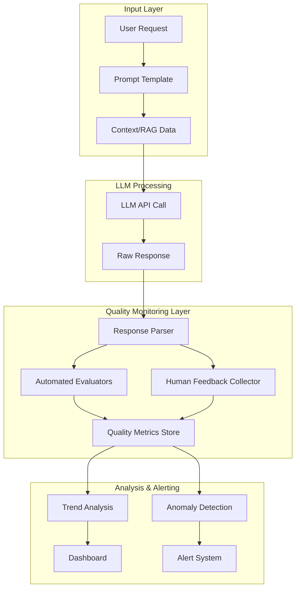
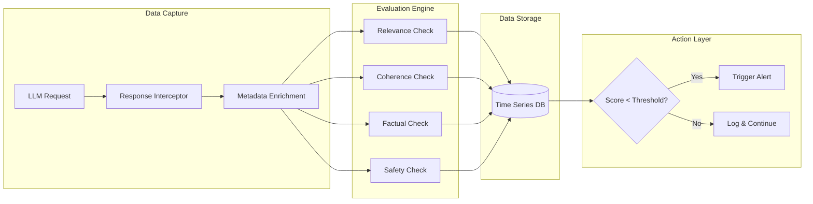
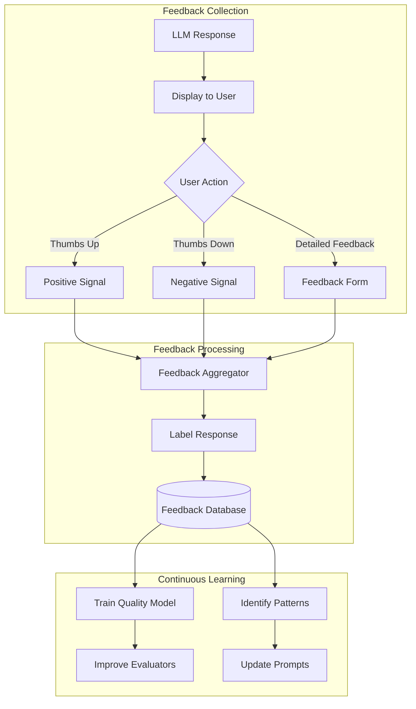
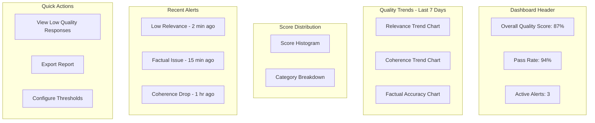
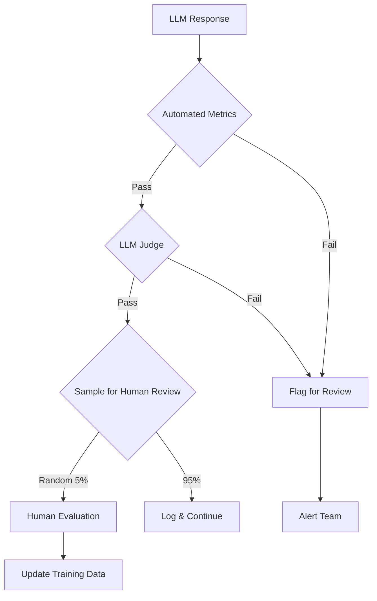

# How to Implement Quality Monitoring

Author: [nawazdhandala](https://github.com/nawazdhandala)

Tags: LLMOps, Quality, Evaluation, Monitoring

Description: Learn to implement quality monitoring for tracking LLM output quality and relevance over time.

---

As Large Language Models become integral to production applications, the need for robust quality monitoring has never been more critical. Unlike traditional software where outputs are deterministic, LLM outputs are probabilistic and can drift in quality over time. This guide walks you through implementing a comprehensive quality monitoring system for your LLM operations.

## Why Quality Monitoring Matters for LLMs

LLM quality degradation can occur silently. Model updates, prompt changes, or shifting user patterns can all impact output quality without triggering traditional error alerts. Quality monitoring helps you:

- Detect output quality degradation before users notice
- Track the effectiveness of prompt engineering changes
- Ensure compliance with content policies
- Build confidence in your LLM applications

## Quality Monitoring Architecture

Before diving into implementation, let us understand the high-level architecture of an LLM quality monitoring system.



## Core Quality Metrics

Quality monitoring for LLMs requires tracking multiple dimensions. Here are the essential metrics you should implement:

### 1. Relevance Score

Measures how well the response addresses the user's query.

```python
# relevance_evaluator.py
# Evaluates how relevant an LLM response is to the original query
# Uses embedding similarity and keyword matching for comprehensive scoring

from typing import Dict, Any
import numpy as np
from sentence_transformers import SentenceTransformer

class RelevanceEvaluator:
    """
    Evaluates the relevance of LLM responses to user queries.
    Combines semantic similarity with keyword overlap for robust scoring.
    """

    def __init__(self, model_name: str = "all-MiniLM-L6-v2"):
        # Load a lightweight but effective sentence embedding model
        self.embedding_model = SentenceTransformer(model_name)

    def calculate_relevance(
        self,
        query: str,
        response: str,
        context: str = None
    ) -> Dict[str, Any]:
        """
        Calculate relevance score between query and response.

        Args:
            query: The original user query
            response: The LLM generated response
            context: Optional context provided to the LLM

        Returns:
            Dictionary containing relevance metrics
        """
        # Generate embeddings for semantic similarity
        query_embedding = self.embedding_model.encode(query)
        response_embedding = self.embedding_model.encode(response)

        # Calculate cosine similarity between query and response
        semantic_similarity = float(np.dot(query_embedding, response_embedding) / (
            np.linalg.norm(query_embedding) * np.linalg.norm(response_embedding)
        ))

        # Calculate keyword overlap for additional signal
        query_keywords = set(query.lower().split())
        response_keywords = set(response.lower().split())

        # Jaccard similarity for keyword overlap
        keyword_overlap = len(query_keywords & response_keywords) / len(
            query_keywords | response_keywords
        ) if query_keywords | response_keywords else 0

        # Weighted combination of both metrics
        # Semantic similarity is weighted higher as it captures meaning
        relevance_score = (0.7 * semantic_similarity) + (0.3 * keyword_overlap)

        return {
            "relevance_score": round(relevance_score, 4),
            "semantic_similarity": round(semantic_similarity, 4),
            "keyword_overlap": round(keyword_overlap, 4),
            "query_length": len(query),
            "response_length": len(response)
        }
```

### 2. Coherence Score

Evaluates the logical flow and consistency of the response.

```python
# coherence_evaluator.py
# Measures the internal consistency and logical flow of LLM responses
# Uses sentence-level analysis to detect incoherent passages

from typing import Dict, List, Any
import numpy as np
from sentence_transformers import SentenceTransformer
import re

class CoherenceEvaluator:
    """
    Evaluates the coherence of LLM responses by analyzing
    sentence-to-sentence transitions and overall consistency.
    """

    def __init__(self, model_name: str = "all-MiniLM-L6-v2"):
        self.embedding_model = SentenceTransformer(model_name)

    def split_into_sentences(self, text: str) -> List[str]:
        """Split text into sentences for analysis."""
        # Simple sentence splitting on common delimiters
        sentences = re.split(r'[.!?]+', text)
        # Filter out empty strings and strip whitespace
        return [s.strip() for s in sentences if s.strip()]

    def calculate_coherence(self, response: str) -> Dict[str, Any]:
        """
        Calculate coherence metrics for a response.

        Coherence is measured by:
        1. Adjacent sentence similarity (local coherence)
        2. Overall topic consistency (global coherence)

        Args:
            response: The LLM generated response

        Returns:
            Dictionary containing coherence metrics
        """
        sentences = self.split_into_sentences(response)

        # Need at least 2 sentences to measure coherence
        if len(sentences) < 2:
            return {
                "coherence_score": 1.0,
                "local_coherence": 1.0,
                "global_coherence": 1.0,
                "sentence_count": len(sentences),
                "low_coherence_transitions": []
            }

        # Generate embeddings for all sentences
        embeddings = self.embedding_model.encode(sentences)

        # Calculate local coherence (adjacent sentence similarity)
        local_scores = []
        low_coherence_transitions = []

        for i in range(len(embeddings) - 1):
            # Cosine similarity between adjacent sentences
            similarity = float(np.dot(embeddings[i], embeddings[i + 1]) / (
                np.linalg.norm(embeddings[i]) * np.linalg.norm(embeddings[i + 1])
            ))
            local_scores.append(similarity)

            # Flag transitions with low coherence for review
            if similarity < 0.3:
                low_coherence_transitions.append({
                    "position": i,
                    "sentence_1": sentences[i][:100],
                    "sentence_2": sentences[i + 1][:100],
                    "similarity": round(similarity, 4)
                })

        local_coherence = np.mean(local_scores)

        # Calculate global coherence (consistency with overall topic)
        # Compare each sentence to the mean embedding of all sentences
        mean_embedding = np.mean(embeddings, axis=0)
        global_scores = []

        for embedding in embeddings:
            similarity = float(np.dot(embedding, mean_embedding) / (
                np.linalg.norm(embedding) * np.linalg.norm(mean_embedding)
            ))
            global_scores.append(similarity)

        global_coherence = np.mean(global_scores)

        # Combined coherence score
        coherence_score = (0.6 * local_coherence) + (0.4 * global_coherence)

        return {
            "coherence_score": round(coherence_score, 4),
            "local_coherence": round(local_coherence, 4),
            "global_coherence": round(global_coherence, 4),
            "sentence_count": len(sentences),
            "low_coherence_transitions": low_coherence_transitions
        }
```

### 3. Factual Consistency Score

For RAG applications, verifies that responses align with provided context.

```python
# factual_consistency_evaluator.py
# Verifies that LLM responses are grounded in the provided context
# Critical for RAG applications to prevent hallucinations

from typing import Dict, List, Any
import numpy as np
from sentence_transformers import SentenceTransformer

class FactualConsistencyEvaluator:
    """
    Evaluates whether LLM responses are factually consistent
    with the provided source context. Essential for RAG systems.
    """

    def __init__(
        self,
        model_name: str = "all-MiniLM-L6-v2",
        similarity_threshold: float = 0.5
    ):
        self.embedding_model = SentenceTransformer(model_name)
        self.similarity_threshold = similarity_threshold

    def extract_claims(self, text: str) -> List[str]:
        """
        Extract individual claims from text for verification.
        Each sentence is treated as a potential claim.
        """
        import re
        sentences = re.split(r'[.!?]+', text)
        # Filter sentences that look like factual claims
        claims = []
        for sentence in sentences:
            sentence = sentence.strip()
            # Skip very short sentences or questions
            if len(sentence) > 20 and not sentence.endswith('?'):
                claims.append(sentence)
        return claims

    def calculate_factual_consistency(
        self,
        response: str,
        context: str
    ) -> Dict[str, Any]:
        """
        Calculate how well the response aligns with the source context.

        Args:
            response: The LLM generated response
            context: The source context/documents provided to the LLM

        Returns:
            Dictionary containing factual consistency metrics
        """
        # Extract claims from the response
        response_claims = self.extract_claims(response)

        if not response_claims:
            return {
                "factual_consistency_score": 1.0,
                "supported_claims": 0,
                "unsupported_claims": 0,
                "claim_details": []
            }

        # Split context into chunks for comparison
        context_chunks = self.extract_claims(context)

        if not context_chunks:
            # No context to verify against
            return {
                "factual_consistency_score": 0.5,
                "supported_claims": 0,
                "unsupported_claims": len(response_claims),
                "claim_details": [],
                "warning": "No context provided for verification"
            }

        # Generate embeddings
        claim_embeddings = self.embedding_model.encode(response_claims)
        context_embeddings = self.embedding_model.encode(context_chunks)

        # Check each claim against context
        supported_claims = 0
        claim_details = []

        for i, (claim, claim_emb) in enumerate(zip(response_claims, claim_embeddings)):
            # Find the most similar context chunk
            similarities = []
            for ctx_emb in context_embeddings:
                sim = float(np.dot(claim_emb, ctx_emb) / (
                    np.linalg.norm(claim_emb) * np.linalg.norm(ctx_emb)
                ))
                similarities.append(sim)

            max_similarity = max(similarities)
            best_match_idx = similarities.index(max_similarity)

            is_supported = max_similarity >= self.similarity_threshold
            if is_supported:
                supported_claims += 1

            claim_details.append({
                "claim": claim[:200],
                "is_supported": is_supported,
                "confidence": round(max_similarity, 4),
                "best_matching_context": context_chunks[best_match_idx][:200]
            })

        # Calculate overall score
        factual_consistency_score = supported_claims / len(response_claims)

        return {
            "factual_consistency_score": round(factual_consistency_score, 4),
            "supported_claims": supported_claims,
            "unsupported_claims": len(response_claims) - supported_claims,
            "total_claims": len(response_claims),
            "claim_details": claim_details
        }
```

## The Quality Monitoring Pipeline

Now let us build a complete quality monitoring pipeline that combines all evaluators.



### Complete Quality Monitor Implementation

```python
# quality_monitor.py
# Comprehensive quality monitoring system for LLM operations
# Combines multiple evaluators with storage and alerting

from typing import Dict, Any, Optional, Callable
from dataclasses import dataclass, field
from datetime import datetime
import json
import logging

# Import our evaluators (defined above)
from relevance_evaluator import RelevanceEvaluator
from coherence_evaluator import CoherenceEvaluator
from factual_consistency_evaluator import FactualConsistencyEvaluator

# Configure logging for the quality monitor
logging.basicConfig(level=logging.INFO)
logger = logging.getLogger("quality_monitor")

@dataclass
class QualityThresholds:
    """
    Configurable thresholds for quality metrics.
    Scores below these thresholds will trigger alerts.
    """
    relevance: float = 0.6
    coherence: float = 0.5
    factual_consistency: float = 0.7
    min_response_length: int = 10
    max_response_length: int = 10000

@dataclass
class QualityReport:
    """
    Complete quality assessment report for an LLM interaction.
    Contains all metrics and metadata for analysis.
    """
    request_id: str
    timestamp: datetime
    query: str
    response: str
    relevance_metrics: Dict[str, Any]
    coherence_metrics: Dict[str, Any]
    factual_metrics: Dict[str, Any]
    overall_score: float
    passed_thresholds: bool
    alerts: list = field(default_factory=list)
    metadata: Dict[str, Any] = field(default_factory=dict)

class LLMQualityMonitor:
    """
    Main quality monitoring class that orchestrates all evaluators
    and handles metric storage and alerting.
    """

    def __init__(
        self,
        thresholds: Optional[QualityThresholds] = None,
        alert_callback: Optional[Callable[[QualityReport], None]] = None,
        storage_backend: Optional[Any] = None
    ):
        """
        Initialize the quality monitor.

        Args:
            thresholds: Custom quality thresholds (uses defaults if None)
            alert_callback: Function to call when quality is below threshold
            storage_backend: Backend for storing quality metrics
        """
        self.thresholds = thresholds or QualityThresholds()
        self.alert_callback = alert_callback
        self.storage = storage_backend

        # Initialize all evaluators
        self.relevance_evaluator = RelevanceEvaluator()
        self.coherence_evaluator = CoherenceEvaluator()
        self.factual_evaluator = FactualConsistencyEvaluator()

        logger.info("Quality monitor initialized with thresholds: %s", self.thresholds)

    def evaluate(
        self,
        request_id: str,
        query: str,
        response: str,
        context: Optional[str] = None,
        metadata: Optional[Dict[str, Any]] = None
    ) -> QualityReport:
        """
        Perform complete quality evaluation on an LLM interaction.

        Args:
            request_id: Unique identifier for this request
            query: The original user query
            response: The LLM generated response
            context: Optional context provided to the LLM (for RAG)
            metadata: Additional metadata to include in the report

        Returns:
            QualityReport with all metrics and alerts
        """
        timestamp = datetime.utcnow()
        alerts = []

        # Run relevance evaluation
        logger.debug("Evaluating relevance for request %s", request_id)
        relevance_metrics = self.relevance_evaluator.calculate_relevance(
            query=query,
            response=response,
            context=context
        )

        # Check relevance threshold
        if relevance_metrics["relevance_score"] < self.thresholds.relevance:
            alerts.append({
                "type": "low_relevance",
                "score": relevance_metrics["relevance_score"],
                "threshold": self.thresholds.relevance,
                "message": "Response relevance is below threshold"
            })

        # Run coherence evaluation
        logger.debug("Evaluating coherence for request %s", request_id)
        coherence_metrics = self.coherence_evaluator.calculate_coherence(response)

        # Check coherence threshold
        if coherence_metrics["coherence_score"] < self.thresholds.coherence:
            alerts.append({
                "type": "low_coherence",
                "score": coherence_metrics["coherence_score"],
                "threshold": self.thresholds.coherence,
                "message": "Response coherence is below threshold"
            })

        # Run factual consistency evaluation (if context provided)
        if context:
            logger.debug("Evaluating factual consistency for request %s", request_id)
            factual_metrics = self.factual_evaluator.calculate_factual_consistency(
                response=response,
                context=context
            )

            # Check factual consistency threshold
            if factual_metrics["factual_consistency_score"] < self.thresholds.factual_consistency:
                alerts.append({
                    "type": "low_factual_consistency",
                    "score": factual_metrics["factual_consistency_score"],
                    "threshold": self.thresholds.factual_consistency,
                    "message": "Response may contain unsupported claims"
                })
        else:
            factual_metrics = {"factual_consistency_score": None, "note": "No context provided"}

        # Check response length
        if len(response) < self.thresholds.min_response_length:
            alerts.append({
                "type": "response_too_short",
                "length": len(response),
                "threshold": self.thresholds.min_response_length,
                "message": "Response is unusually short"
            })
        elif len(response) > self.thresholds.max_response_length:
            alerts.append({
                "type": "response_too_long",
                "length": len(response),
                "threshold": self.thresholds.max_response_length,
                "message": "Response exceeds maximum length"
            })

        # Calculate overall quality score
        scores = [relevance_metrics["relevance_score"], coherence_metrics["coherence_score"]]
        if factual_metrics.get("factual_consistency_score") is not None:
            scores.append(factual_metrics["factual_consistency_score"])

        overall_score = sum(scores) / len(scores)
        passed_thresholds = len(alerts) == 0

        # Create the quality report
        report = QualityReport(
            request_id=request_id,
            timestamp=timestamp,
            query=query,
            response=response,
            relevance_metrics=relevance_metrics,
            coherence_metrics=coherence_metrics,
            factual_metrics=factual_metrics,
            overall_score=round(overall_score, 4),
            passed_thresholds=passed_thresholds,
            alerts=alerts,
            metadata=metadata or {}
        )

        # Store the report if storage backend is configured
        if self.storage:
            self._store_report(report)

        # Trigger alert callback if there are alerts
        if alerts and self.alert_callback:
            logger.warning("Quality alerts triggered for request %s: %s", request_id, alerts)
            self.alert_callback(report)

        return report

    def _store_report(self, report: QualityReport) -> None:
        """Store the quality report in the configured backend."""
        try:
            # Convert report to dictionary for storage
            report_dict = {
                "request_id": report.request_id,
                "timestamp": report.timestamp.isoformat(),
                "overall_score": report.overall_score,
                "relevance_score": report.relevance_metrics["relevance_score"],
                "coherence_score": report.coherence_metrics["coherence_score"],
                "factual_score": report.factual_metrics.get("factual_consistency_score"),
                "passed_thresholds": report.passed_thresholds,
                "alert_count": len(report.alerts),
                "metadata": report.metadata
            }
            self.storage.store(report_dict)
            logger.debug("Stored quality report for request %s", report.request_id)
        except Exception as e:
            logger.error("Failed to store quality report: %s", e)

    def get_quality_summary(
        self,
        start_time: datetime,
        end_time: datetime
    ) -> Dict[str, Any]:
        """
        Get aggregated quality metrics for a time period.

        Args:
            start_time: Start of the analysis period
            end_time: End of the analysis period

        Returns:
            Dictionary with aggregated quality statistics
        """
        if not self.storage:
            raise ValueError("Storage backend not configured")

        # Query stored reports
        reports = self.storage.query(start_time, end_time)

        if not reports:
            return {"message": "No data available for the specified period"}

        # Calculate aggregated metrics
        return {
            "period": {
                "start": start_time.isoformat(),
                "end": end_time.isoformat()
            },
            "total_evaluations": len(reports),
            "average_overall_score": round(
                sum(r["overall_score"] for r in reports) / len(reports), 4
            ),
            "average_relevance_score": round(
                sum(r["relevance_score"] for r in reports) / len(reports), 4
            ),
            "average_coherence_score": round(
                sum(r["coherence_score"] for r in reports) / len(reports), 4
            ),
            "pass_rate": round(
                sum(1 for r in reports if r["passed_thresholds"]) / len(reports), 4
            ),
            "total_alerts": sum(r["alert_count"] for r in reports)
        }
```

## Automated Evaluation with LLM-as-Judge

For more nuanced quality assessment, you can use another LLM as an evaluator. This is particularly useful for subjective metrics like helpfulness and tone.

```python
# llm_judge_evaluator.py
# Uses an LLM to evaluate the quality of another LLM's responses
# Provides nuanced assessment of subjective quality criteria

from typing import Dict, Any, List
import json
from openai import OpenAI

class LLMJudgeEvaluator:
    """
    Uses GPT-4 or similar model to evaluate LLM responses
    on subjective criteria like helpfulness and tone.
    """

    def __init__(self, api_key: str, model: str = "gpt-4"):
        self.client = OpenAI(api_key=api_key)
        self.model = model

        # Define the evaluation criteria
        self.evaluation_criteria = {
            "helpfulness": "Does the response directly address the user's need?",
            "accuracy": "Is the information provided accurate and reliable?",
            "completeness": "Does the response cover all aspects of the query?",
            "clarity": "Is the response easy to understand?",
            "tone": "Is the tone appropriate for the context?"
        }

    def create_evaluation_prompt(
        self,
        query: str,
        response: str,
        context: str = None
    ) -> str:
        """
        Create a structured prompt for the LLM judge.
        """
        criteria_text = "\n".join([
            f"- {name}: {description}"
            for name, description in self.evaluation_criteria.items()
        ])

        context_section = ""
        if context:
            context_section = f"""
Reference Context (the response should be based on this):
{context}
"""

        return f"""You are an expert evaluator assessing the quality of an AI assistant's response.

User Query:
{query}
{context_section}
AI Response:
{response}

Evaluate the response on these criteria (score 1-5, where 5 is excellent):
{criteria_text}

Provide your evaluation in the following JSON format:
{{
    "helpfulness": {{"score": <1-5>, "explanation": "<brief explanation>"}},
    "accuracy": {{"score": <1-5>, "explanation": "<brief explanation>"}},
    "completeness": {{"score": <1-5>, "explanation": "<brief explanation>"}},
    "clarity": {{"score": <1-5>, "explanation": "<brief explanation>"}},
    "tone": {{"score": <1-5>, "explanation": "<brief explanation>"}},
    "overall_assessment": "<one sentence summary>",
    "suggestions": ["<improvement suggestion 1>", "<improvement suggestion 2>"]
}}

Return only the JSON, no additional text."""

    def evaluate(
        self,
        query: str,
        response: str,
        context: str = None
    ) -> Dict[str, Any]:
        """
        Evaluate a response using the LLM judge.

        Args:
            query: The original user query
            response: The LLM generated response
            context: Optional context provided to the LLM

        Returns:
            Dictionary containing evaluation results
        """
        prompt = self.create_evaluation_prompt(query, response, context)

        try:
            # Call the LLM judge
            completion = self.client.chat.completions.create(
                model=self.model,
                messages=[
                    {
                        "role": "system",
                        "content": "You are an expert AI response evaluator. "
                                   "Provide objective, constructive assessments."
                    },
                    {"role": "user", "content": prompt}
                ],
                temperature=0.1  # Low temperature for consistent evaluations
            )

            # Parse the response
            result_text = completion.choices[0].message.content
            evaluation = json.loads(result_text)

            # Calculate aggregate score
            scores = [
                evaluation[criterion]["score"]
                for criterion in self.evaluation_criteria.keys()
            ]
            evaluation["aggregate_score"] = round(sum(scores) / len(scores), 2)
            evaluation["normalized_score"] = round(
                (evaluation["aggregate_score"] - 1) / 4, 4  # Normalize to 0-1
            )

            return {
                "status": "success",
                "evaluation": evaluation
            }

        except json.JSONDecodeError as e:
            return {
                "status": "error",
                "error": f"Failed to parse evaluation response: {e}"
            }
        except Exception as e:
            return {
                "status": "error",
                "error": f"Evaluation failed: {e}"
            }
```

## Human Feedback Collection

Automated metrics are valuable, but human feedback provides ground truth. Here is how to implement a feedback collection system.



### Feedback Collection Implementation

```python
# feedback_collector.py
# Collects and processes human feedback on LLM responses
# Supports multiple feedback types from simple ratings to detailed reviews

from typing import Dict, Any, Optional, List
from dataclasses import dataclass, field
from datetime import datetime
from enum import Enum
import uuid

class FeedbackType(Enum):
    """Types of feedback that can be collected."""
    THUMBS_UP = "thumbs_up"
    THUMBS_DOWN = "thumbs_down"
    RATING = "rating"
    DETAILED = "detailed"

class FeedbackCategory(Enum):
    """Categories for negative feedback."""
    INCORRECT = "incorrect_information"
    IRRELEVANT = "not_relevant"
    INCOMPLETE = "incomplete_answer"
    UNCLEAR = "unclear_response"
    INAPPROPRIATE = "inappropriate_content"
    OTHER = "other"

@dataclass
class UserFeedback:
    """
    Represents a single piece of user feedback.
    """
    feedback_id: str
    request_id: str
    timestamp: datetime
    feedback_type: FeedbackType
    is_positive: bool
    rating: Optional[int] = None  # 1-5 scale
    categories: List[FeedbackCategory] = field(default_factory=list)
    comment: Optional[str] = None
    user_id: Optional[str] = None
    metadata: Dict[str, Any] = field(default_factory=dict)

class FeedbackCollector:
    """
    Handles collection, validation, and storage of user feedback.
    """

    def __init__(self, storage_backend: Any = None):
        """
        Initialize the feedback collector.

        Args:
            storage_backend: Backend for storing feedback data
        """
        self.storage = storage_backend
        self.feedback_buffer = []  # Buffer for batch processing

    def collect_thumbs_feedback(
        self,
        request_id: str,
        is_positive: bool,
        user_id: Optional[str] = None
    ) -> UserFeedback:
        """
        Collect simple thumbs up/down feedback.

        Args:
            request_id: ID of the LLM request being rated
            is_positive: True for thumbs up, False for thumbs down
            user_id: Optional user identifier

        Returns:
            UserFeedback object
        """
        feedback = UserFeedback(
            feedback_id=str(uuid.uuid4()),
            request_id=request_id,
            timestamp=datetime.utcnow(),
            feedback_type=FeedbackType.THUMBS_UP if is_positive else FeedbackType.THUMBS_DOWN,
            is_positive=is_positive,
            user_id=user_id
        )

        self._store_feedback(feedback)
        return feedback

    def collect_rating_feedback(
        self,
        request_id: str,
        rating: int,
        user_id: Optional[str] = None
    ) -> UserFeedback:
        """
        Collect numeric rating feedback (1-5 scale).

        Args:
            request_id: ID of the LLM request being rated
            rating: Rating from 1 to 5
            user_id: Optional user identifier

        Returns:
            UserFeedback object
        """
        # Validate rating
        if not 1 <= rating <= 5:
            raise ValueError("Rating must be between 1 and 5")

        feedback = UserFeedback(
            feedback_id=str(uuid.uuid4()),
            request_id=request_id,
            timestamp=datetime.utcnow(),
            feedback_type=FeedbackType.RATING,
            is_positive=rating >= 4,
            rating=rating,
            user_id=user_id
        )

        self._store_feedback(feedback)
        return feedback

    def collect_detailed_feedback(
        self,
        request_id: str,
        rating: int,
        categories: List[str],
        comment: str,
        user_id: Optional[str] = None
    ) -> UserFeedback:
        """
        Collect detailed feedback with categories and comments.

        Args:
            request_id: ID of the LLM request being rated
            rating: Rating from 1 to 5
            categories: List of feedback category strings
            comment: User's detailed comment
            user_id: Optional user identifier

        Returns:
            UserFeedback object
        """
        # Convert category strings to enum values
        feedback_categories = []
        for cat in categories:
            try:
                feedback_categories.append(FeedbackCategory(cat))
            except ValueError:
                feedback_categories.append(FeedbackCategory.OTHER)

        feedback = UserFeedback(
            feedback_id=str(uuid.uuid4()),
            request_id=request_id,
            timestamp=datetime.utcnow(),
            feedback_type=FeedbackType.DETAILED,
            is_positive=rating >= 4,
            rating=rating,
            categories=feedback_categories,
            comment=comment,
            user_id=user_id
        )

        self._store_feedback(feedback)
        return feedback

    def _store_feedback(self, feedback: UserFeedback) -> None:
        """Store feedback in the configured backend."""
        self.feedback_buffer.append(feedback)

        # Flush buffer when it reaches a threshold
        if len(self.feedback_buffer) >= 10:
            self._flush_buffer()

    def _flush_buffer(self) -> None:
        """Flush the feedback buffer to storage."""
        if self.storage and self.feedback_buffer:
            for feedback in self.feedback_buffer:
                self.storage.store(self._feedback_to_dict(feedback))
            self.feedback_buffer = []

    def _feedback_to_dict(self, feedback: UserFeedback) -> Dict[str, Any]:
        """Convert feedback to dictionary for storage."""
        return {
            "feedback_id": feedback.feedback_id,
            "request_id": feedback.request_id,
            "timestamp": feedback.timestamp.isoformat(),
            "feedback_type": feedback.feedback_type.value,
            "is_positive": feedback.is_positive,
            "rating": feedback.rating,
            "categories": [c.value for c in feedback.categories],
            "comment": feedback.comment,
            "user_id": feedback.user_id,
            "metadata": feedback.metadata
        }

    def get_feedback_summary(
        self,
        start_time: datetime,
        end_time: datetime
    ) -> Dict[str, Any]:
        """
        Get aggregated feedback metrics for a time period.
        """
        if not self.storage:
            raise ValueError("Storage backend not configured")

        feedback_items = self.storage.query(start_time, end_time)

        if not feedback_items:
            return {"message": "No feedback data available"}

        # Calculate metrics
        positive_count = sum(1 for f in feedback_items if f["is_positive"])
        ratings = [f["rating"] for f in feedback_items if f["rating"] is not None]

        # Count feedback categories
        category_counts = {}
        for item in feedback_items:
            for cat in item.get("categories", []):
                category_counts[cat] = category_counts.get(cat, 0) + 1

        return {
            "period": {
                "start": start_time.isoformat(),
                "end": end_time.isoformat()
            },
            "total_feedback": len(feedback_items),
            "positive_rate": round(positive_count / len(feedback_items), 4),
            "average_rating": round(sum(ratings) / len(ratings), 2) if ratings else None,
            "category_distribution": category_counts,
            "feedback_by_type": {
                ft.value: sum(1 for f in feedback_items if f["feedback_type"] == ft.value)
                for ft in FeedbackType
            }
        }
```

## Real-Time Quality Dashboard

Visualizing quality metrics helps teams identify trends and issues quickly. Here is how to structure your quality dashboard.



### Dashboard Data Provider

```python
# dashboard_provider.py
# Provides aggregated data for the quality monitoring dashboard
# Supports real-time metrics and historical trend analysis

from typing import Dict, Any, List
from datetime import datetime, timedelta
from dataclasses import dataclass
import statistics

@dataclass
class DashboardConfig:
    """Configuration for dashboard data provider."""
    default_time_window_hours: int = 24
    trend_window_days: int = 7
    alert_retention_hours: int = 48
    score_buckets: List[float] = None

    def __post_init__(self):
        if self.score_buckets is None:
            self.score_buckets = [0.0, 0.2, 0.4, 0.6, 0.8, 1.0]

class QualityDashboardProvider:
    """
    Provides aggregated quality metrics for dashboard visualization.
    """

    def __init__(
        self,
        quality_storage: Any,
        feedback_storage: Any,
        config: DashboardConfig = None
    ):
        self.quality_storage = quality_storage
        self.feedback_storage = feedback_storage
        self.config = config or DashboardConfig()

    def get_overview_metrics(self) -> Dict[str, Any]:
        """
        Get high-level overview metrics for the dashboard header.
        """
        now = datetime.utcnow()
        start_time = now - timedelta(hours=self.config.default_time_window_hours)

        # Query quality reports
        reports = self.quality_storage.query(start_time, now)

        if not reports:
            return {
                "status": "no_data",
                "time_window": f"Last {self.config.default_time_window_hours} hours"
            }

        # Calculate overview metrics
        scores = [r["overall_score"] for r in reports]
        pass_count = sum(1 for r in reports if r["passed_thresholds"])
        total_alerts = sum(r["alert_count"] for r in reports)

        return {
            "time_window": f"Last {self.config.default_time_window_hours} hours",
            "total_evaluations": len(reports),
            "overall_quality_score": round(statistics.mean(scores) * 100, 1),
            "pass_rate": round((pass_count / len(reports)) * 100, 1),
            "active_alerts": total_alerts,
            "score_std_dev": round(statistics.stdev(scores), 4) if len(scores) > 1 else 0
        }

    def get_trend_data(self) -> Dict[str, Any]:
        """
        Get quality trend data for time series charts.
        """
        now = datetime.utcnow()
        start_time = now - timedelta(days=self.config.trend_window_days)

        reports = self.quality_storage.query(start_time, now)

        if not reports:
            return {"status": "no_data"}

        # Group reports by day
        daily_metrics = {}
        for report in reports:
            # Parse timestamp and get date key
            ts = datetime.fromisoformat(report["timestamp"])
            date_key = ts.strftime("%Y-%m-%d")

            if date_key not in daily_metrics:
                daily_metrics[date_key] = {
                    "relevance_scores": [],
                    "coherence_scores": [],
                    "factual_scores": [],
                    "overall_scores": [],
                    "pass_count": 0,
                    "total_count": 0
                }

            metrics = daily_metrics[date_key]
            metrics["relevance_scores"].append(report["relevance_score"])
            metrics["coherence_scores"].append(report["coherence_score"])
            if report.get("factual_score") is not None:
                metrics["factual_scores"].append(report["factual_score"])
            metrics["overall_scores"].append(report["overall_score"])
            metrics["pass_count"] += 1 if report["passed_thresholds"] else 0
            metrics["total_count"] += 1

        # Calculate daily averages
        trend_data = []
        for date_key in sorted(daily_metrics.keys()):
            metrics = daily_metrics[date_key]
            trend_data.append({
                "date": date_key,
                "avg_relevance": round(statistics.mean(metrics["relevance_scores"]), 4),
                "avg_coherence": round(statistics.mean(metrics["coherence_scores"]), 4),
                "avg_factual": round(
                    statistics.mean(metrics["factual_scores"]), 4
                ) if metrics["factual_scores"] else None,
                "avg_overall": round(statistics.mean(metrics["overall_scores"]), 4),
                "pass_rate": round(metrics["pass_count"] / metrics["total_count"], 4),
                "evaluation_count": metrics["total_count"]
            })

        return {
            "window_days": self.config.trend_window_days,
            "data_points": trend_data
        }

    def get_score_distribution(self) -> Dict[str, Any]:
        """
        Get distribution of quality scores for histogram display.
        """
        now = datetime.utcnow()
        start_time = now - timedelta(hours=self.config.default_time_window_hours)

        reports = self.quality_storage.query(start_time, now)

        if not reports:
            return {"status": "no_data"}

        # Create histogram buckets
        buckets = self.config.score_buckets
        distribution = {
            f"{buckets[i]:.1f}-{buckets[i+1]:.1f}": 0
            for i in range(len(buckets) - 1)
        }

        # Categorize scores into buckets
        for report in reports:
            score = report["overall_score"]
            for i in range(len(buckets) - 1):
                if buckets[i] <= score < buckets[i + 1]:
                    bucket_key = f"{buckets[i]:.1f}-{buckets[i+1]:.1f}"
                    distribution[bucket_key] += 1
                    break
            # Handle score of exactly 1.0
            if score == 1.0:
                distribution["0.8-1.0"] += 1

        return {
            "time_window": f"Last {self.config.default_time_window_hours} hours",
            "total_evaluations": len(reports),
            "distribution": distribution,
            "percentiles": {
                "p50": round(statistics.median([r["overall_score"] for r in reports]), 4),
                "p90": round(
                    sorted([r["overall_score"] for r in reports])[
                        int(len(reports) * 0.9)
                    ], 4
                ),
                "p99": round(
                    sorted([r["overall_score"] for r in reports])[
                        int(len(reports) * 0.99)
                    ], 4
                )
            }
        }

    def get_recent_alerts(self, limit: int = 10) -> List[Dict[str, Any]]:
        """
        Get recent quality alerts for the dashboard.
        """
        now = datetime.utcnow()
        start_time = now - timedelta(hours=self.config.alert_retention_hours)

        reports = self.quality_storage.query(start_time, now)

        # Filter reports with alerts and flatten
        alerts = []
        for report in reports:
            if report["alert_count"] > 0:
                # Get the actual alert details from the full report
                full_report = self.quality_storage.get_by_id(report["request_id"])
                if full_report and "alerts" in full_report:
                    for alert in full_report["alerts"]:
                        alerts.append({
                            "request_id": report["request_id"],
                            "timestamp": report["timestamp"],
                            "alert_type": alert["type"],
                            "score": alert.get("score"),
                            "threshold": alert.get("threshold"),
                            "message": alert.get("message")
                        })

        # Sort by timestamp descending and limit
        alerts.sort(key=lambda x: x["timestamp"], reverse=True)
        return alerts[:limit]
```

## Integration with OpenTelemetry

For comprehensive observability, integrate quality metrics with your existing telemetry stack.

```python
# otel_integration.py
# Exports LLM quality metrics to OpenTelemetry for unified observability
# Integrates with existing monitoring infrastructure

from typing import Dict, Any
from opentelemetry import metrics
from opentelemetry.sdk.metrics import MeterProvider
from opentelemetry.sdk.metrics.export import PeriodicExportingMetricReader
from opentelemetry.exporter.otlp.proto.grpc.metric_exporter import OTLPMetricExporter

class QualityMetricsExporter:
    """
    Exports LLM quality metrics to OpenTelemetry.
    Enables integration with existing observability platforms.
    """

    def __init__(self, otlp_endpoint: str = "localhost:4317"):
        """
        Initialize the OpenTelemetry metrics exporter.

        Args:
            otlp_endpoint: OTLP collector endpoint
        """
        # Configure OTLP exporter
        exporter = OTLPMetricExporter(endpoint=otlp_endpoint, insecure=True)
        reader = PeriodicExportingMetricReader(exporter, export_interval_millis=60000)

        # Set up meter provider
        provider = MeterProvider(metric_readers=[reader])
        metrics.set_meter_provider(provider)

        # Create meter for LLM quality metrics
        self.meter = metrics.get_meter("llm.quality")

        # Define metrics
        self._setup_metrics()

    def _setup_metrics(self):
        """Set up all quality metrics."""
        # Histogram for quality scores
        self.relevance_histogram = self.meter.create_histogram(
            name="llm.quality.relevance_score",
            description="Distribution of relevance scores",
            unit="score"
        )

        self.coherence_histogram = self.meter.create_histogram(
            name="llm.quality.coherence_score",
            description="Distribution of coherence scores",
            unit="score"
        )

        self.factual_histogram = self.meter.create_histogram(
            name="llm.quality.factual_score",
            description="Distribution of factual consistency scores",
            unit="score"
        )

        self.overall_histogram = self.meter.create_histogram(
            name="llm.quality.overall_score",
            description="Distribution of overall quality scores",
            unit="score"
        )

        # Counter for evaluations
        self.evaluation_counter = self.meter.create_counter(
            name="llm.quality.evaluations_total",
            description="Total number of quality evaluations",
            unit="1"
        )

        # Counter for alerts
        self.alert_counter = self.meter.create_counter(
            name="llm.quality.alerts_total",
            description="Total number of quality alerts",
            unit="1"
        )

        # Gauge for current pass rate
        self.pass_rate_gauge = self.meter.create_observable_gauge(
            name="llm.quality.pass_rate",
            description="Current quality pass rate",
            callbacks=[self._get_pass_rate]
        )

        self._recent_pass_rate = 0.0

    def _get_pass_rate(self, options):
        """Callback for pass rate gauge."""
        yield metrics.Observation(self._recent_pass_rate)

    def record_quality_report(
        self,
        report: Dict[str, Any],
        attributes: Dict[str, str] = None
    ):
        """
        Record quality metrics from a quality report.

        Args:
            report: Quality report dictionary
            attributes: Additional attributes for the metrics
        """
        attrs = attributes or {}
        attrs.update({
            "model": report.get("metadata", {}).get("model", "unknown"),
            "prompt_template": report.get("metadata", {}).get("template", "default")
        })

        # Record score histograms
        self.relevance_histogram.record(
            report["relevance_score"],
            attrs
        )

        self.coherence_histogram.record(
            report["coherence_score"],
            attrs
        )

        if report.get("factual_score") is not None:
            self.factual_histogram.record(
                report["factual_score"],
                attrs
            )

        self.overall_histogram.record(
            report["overall_score"],
            attrs
        )

        # Increment evaluation counter
        self.evaluation_counter.add(1, attrs)

        # Record alerts
        if report.get("alert_count", 0) > 0:
            alert_attrs = attrs.copy()
            for alert in report.get("alerts", []):
                alert_attrs["alert_type"] = alert.get("type", "unknown")
                self.alert_counter.add(1, alert_attrs)

    def update_pass_rate(self, pass_rate: float):
        """Update the current pass rate gauge."""
        self._recent_pass_rate = pass_rate
```

## Best Practices for LLM Quality Monitoring

### 1. Start with Baseline Measurements

Before implementing changes, establish baseline quality metrics to measure improvements against.

### 2. Layer Your Evaluation Strategy

Combine automated metrics, LLM-based evaluation, and human feedback for comprehensive coverage.



### 3. Set Appropriate Thresholds

Quality thresholds should balance strictness with practicality:

| Metric | Warning Threshold | Critical Threshold |
|--------|------------------|-------------------|
| Relevance | 0.6 | 0.4 |
| Coherence | 0.5 | 0.3 |
| Factual Consistency | 0.7 | 0.5 |
| Overall Score | 0.6 | 0.4 |

### 4. Monitor Quality Trends

Quality issues often manifest as gradual degradation rather than sudden drops. Track week-over-week trends.

### 5. Close the Feedback Loop

Use quality data to improve your system continuously:

- Update prompts based on low-scoring patterns
- Add examples to address common failure modes
- Adjust retrieval strategies for factual accuracy issues

## Conclusion

Implementing quality monitoring for LLM operations is essential for maintaining reliable AI-powered applications. By combining automated evaluation metrics, LLM-based judges, and human feedback, you can build a comprehensive quality assurance system that catches issues early and drives continuous improvement.

Start with the core metrics outlined in this guide, then expand your monitoring based on your specific use cases and requirements. Remember that quality monitoring is an iterative process, and your system should evolve as you learn more about your application's behavior in production.

---

**Related Reading:**

- [Monitoring LLM Applications with Openlit and OneUptime](https://oneuptime.com/blog/post/2024-09-13-monitoring-llm-with-openlit-and-oneuptime/view)
- [The Three Pillars of Observability: Logs, Metrics, and Traces](https://oneuptime.com/blog/post/2025-08-20-three-pillars-of-observability-logs-metrics-traces/view)
- [How to Structure Logs Properly in OpenTelemetry](https://oneuptime.com/blog/post/2025-08-28-how-to-structure-logs-properly-in-opentelemetry/view)
