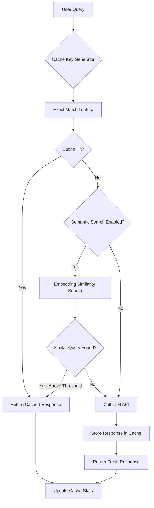
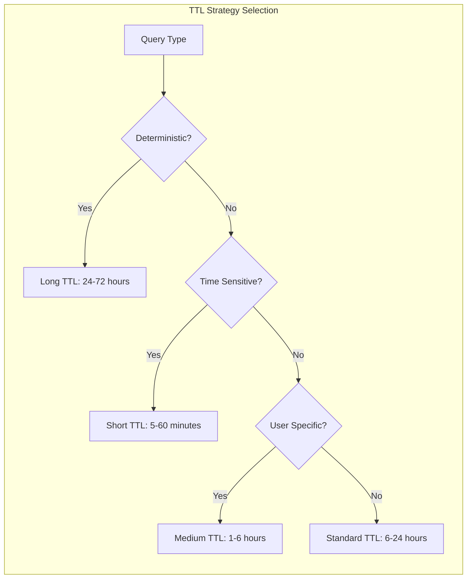
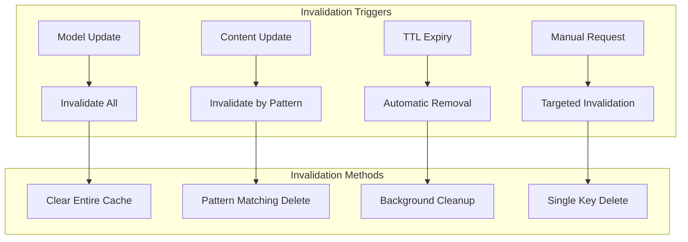

# How to Create Response Caching

Author: [nawazdhandala](https://github.com/nawazdhandala)

Tags: LLMOps, Caching, Performance, Cost Optimization

Description: Learn to create response caching for reducing LLM costs and latency by caching frequent responses.

---

LLM API calls are expensive and slow. A single GPT-4 request can cost $0.03-0.12 and take 2-10 seconds. When users ask similar questions repeatedly, you pay for the same computation over and over. Response caching solves this by storing LLM outputs and returning cached results for semantically similar queries.

## Why Cache LLM Responses?

| Benefit | Impact |
|---------|--------|
| Cost reduction | 40-80% savings on repeat queries |
| Latency improvement | Sub-millisecond vs 2-10 seconds |
| Rate limit mitigation | Fewer API calls to provider |
| Reliability | Cached responses work during outages |
| Consistency | Same input produces same output |

## Cache Architecture Overview



## Cache Key Strategies

Choosing the right cache key is critical for hit rates. Here are the main strategies:

### 1. Exact Match Keys

The simplest approach uses a hash of the exact prompt:

```python
import hashlib
import json
from typing import Any, Dict, Optional

class ExactMatchCacheKey:
    """
    Generates cache keys based on exact prompt matching.
    Best for: Deterministic queries, structured inputs, API endpoints.
    """

    @staticmethod
    def generate(
        prompt: str,
        model: str,
        temperature: float = 0.0,
        system_prompt: Optional[str] = None,
        **kwargs: Any
    ) -> str:
        """
        Generate a deterministic cache key from input parameters.

        Args:
            prompt: The user prompt or query
            model: Model identifier (e.g., 'gpt-4', 'claude-3')
            temperature: Sampling temperature (affects output randomness)
            system_prompt: Optional system instructions
            **kwargs: Additional parameters that affect output

        Returns:
            A SHA-256 hash string as the cache key
        """
        # Build a canonical representation of all inputs
        key_components = {
            'prompt': prompt.strip().lower(),  # Normalize whitespace and case
            'model': model,
            'temperature': temperature,
            'system_prompt': system_prompt or '',
        }

        # Include any additional parameters that affect output
        for k, v in sorted(kwargs.items()):
            if v is not None:
                key_components[k] = v

        # Create deterministic JSON string
        canonical = json.dumps(key_components, sort_keys=True, ensure_ascii=True)

        # Return SHA-256 hash
        return hashlib.sha256(canonical.encode('utf-8')).hexdigest()

    @staticmethod
    def generate_with_namespace(
        namespace: str,
        prompt: str,
        **kwargs: Any
    ) -> str:
        """
        Generate key with namespace prefix for multi-tenant systems.

        Args:
            namespace: Tenant or application identifier
            prompt: The user prompt
            **kwargs: Additional parameters

        Returns:
            Namespaced cache key
        """
        base_key = ExactMatchCacheKey.generate(prompt, **kwargs)
        return f"{namespace}:{base_key}"


# Usage example
cache_key = ExactMatchCacheKey.generate(
    prompt="What is the capital of France?",
    model="gpt-4",
    temperature=0.0
)
print(f"Cache key: {cache_key}")
# Output: Cache key: 7a8b9c...
```

### 2. Normalized Keys

Handle minor variations in queries:

```python
import re
import unicodedata
from typing import List

class NormalizedCacheKey:
    """
    Generates cache keys with text normalization to improve hit rates.
    Handles: whitespace, punctuation, case, unicode normalization.
    """

    # Common stop words to optionally remove
    STOP_WORDS = {
        'a', 'an', 'the', 'is', 'are', 'was', 'were', 'be', 'been',
        'being', 'have', 'has', 'had', 'do', 'does', 'did', 'will',
        'would', 'could', 'should', 'may', 'might', 'must', 'can'
    }

    @staticmethod
    def normalize_text(
        text: str,
        remove_punctuation: bool = True,
        remove_stop_words: bool = False,
        stem_words: bool = False
    ) -> str:
        """
        Normalize text for consistent cache key generation.

        Args:
            text: Input text to normalize
            remove_punctuation: Strip punctuation marks
            remove_stop_words: Remove common stop words
            stem_words: Apply basic word stemming

        Returns:
            Normalized text string
        """
        # Unicode normalization (handle accents, etc.)
        text = unicodedata.normalize('NFKD', text)
        text = text.encode('ASCII', 'ignore').decode('ASCII')

        # Convert to lowercase
        text = text.lower()

        # Remove extra whitespace
        text = ' '.join(text.split())

        # Optionally remove punctuation
        if remove_punctuation:
            text = re.sub(r'[^\w\s]', '', text)

        # Optionally remove stop words
        if remove_stop_words:
            words = text.split()
            words = [w for w in words if w not in NormalizedCacheKey.STOP_WORDS]
            text = ' '.join(words)

        return text.strip()

    @staticmethod
    def generate(
        prompt: str,
        model: str,
        normalize_options: dict = None,
        **kwargs
    ) -> str:
        """
        Generate normalized cache key.

        Args:
            prompt: User prompt
            model: Model identifier
            normalize_options: Dict of normalization options
            **kwargs: Additional parameters

        Returns:
            Cache key string
        """
        options = normalize_options or {}
        normalized_prompt = NormalizedCacheKey.normalize_text(prompt, **options)

        return ExactMatchCacheKey.generate(
            prompt=normalized_prompt,
            model=model,
            **kwargs
        )


# Example: These will produce the same cache key
queries = [
    "What is the capital of France?",
    "what is the capital of france",
    "  What   is  the   capital  of  France?  ",
    "What's the capital of France?"
]

for query in queries:
    key = NormalizedCacheKey.generate(
        prompt=query,
        model="gpt-4",
        normalize_options={'remove_punctuation': True}
    )
    print(f"Query: '{query}' -> Key: {key[:16]}...")
```

### 3. Semantic Keys with Embeddings

For highest hit rates, use embeddings to find semantically similar queries:

```python
import numpy as np
from typing import List, Tuple, Optional
import hashlib

class SemanticCacheKey:
    """
    Uses embeddings for semantic similarity matching.
    Best for: Natural language queries, chatbots, search applications.
    """

    def __init__(
        self,
        embedding_model: str = "text-embedding-3-small",
        similarity_threshold: float = 0.95
    ):
        """
        Initialize semantic cache key generator.

        Args:
            embedding_model: Model to use for embeddings
            similarity_threshold: Cosine similarity threshold for cache hits
        """
        self.embedding_model = embedding_model
        self.similarity_threshold = similarity_threshold
        self.embedding_cache = {}  # Cache embeddings to avoid recomputation

    def get_embedding(self, text: str) -> np.ndarray:
        """
        Get embedding for text, using cache if available.

        Args:
            text: Input text

        Returns:
            Embedding vector as numpy array
        """
        # Check embedding cache first
        text_hash = hashlib.md5(text.encode()).hexdigest()
        if text_hash in self.embedding_cache:
            return self.embedding_cache[text_hash]

        # Call embedding API (replace with your provider)
        embedding = self._call_embedding_api(text)

        # Cache the embedding
        self.embedding_cache[text_hash] = embedding

        return embedding

    def _call_embedding_api(self, text: str) -> np.ndarray:
        """
        Call embedding API. Replace with actual implementation.

        Args:
            text: Input text

        Returns:
            Embedding vector
        """
        # Example using OpenAI
        # from openai import OpenAI
        # client = OpenAI()
        # response = client.embeddings.create(
        #     input=text,
        #     model=self.embedding_model
        # )
        # return np.array(response.data[0].embedding)

        # Placeholder: return random embedding for demonstration
        np.random.seed(hash(text) % 2**32)
        return np.random.randn(1536)

    def cosine_similarity(
        self,
        embedding1: np.ndarray,
        embedding2: np.ndarray
    ) -> float:
        """
        Calculate cosine similarity between two embeddings.

        Args:
            embedding1: First embedding vector
            embedding2: Second embedding vector

        Returns:
            Cosine similarity score (0 to 1)
        """
        # Normalize vectors
        norm1 = np.linalg.norm(embedding1)
        norm2 = np.linalg.norm(embedding2)

        if norm1 == 0 or norm2 == 0:
            return 0.0

        return np.dot(embedding1, embedding2) / (norm1 * norm2)

    def find_similar(
        self,
        query: str,
        stored_embeddings: List[Tuple[str, np.ndarray]]
    ) -> Optional[Tuple[str, float]]:
        """
        Find most similar cached query.

        Args:
            query: Input query
            stored_embeddings: List of (cache_key, embedding) tuples

        Returns:
            Tuple of (cache_key, similarity_score) if found, else None
        """
        query_embedding = self.get_embedding(query)

        best_match = None
        best_score = 0.0

        for cache_key, stored_embedding in stored_embeddings:
            score = self.cosine_similarity(query_embedding, stored_embedding)

            if score > best_score and score >= self.similarity_threshold:
                best_score = score
                best_match = cache_key

        if best_match:
            return (best_match, best_score)

        return None


# Usage example
semantic_cache = SemanticCacheKey(similarity_threshold=0.92)

# These semantically similar queries could share cached responses
similar_queries = [
    "What is the capital of France?",
    "What's France's capital city?",
    "Tell me the capital of France",
    "Capital of France?"
]
```

## Cache Storage Implementations

### In-Memory Cache with LRU Eviction

```python
from collections import OrderedDict
from threading import Lock
from typing import Any, Optional
import time

class LRUCache:
    """
    Thread-safe LRU cache with TTL support.
    Best for: Single-instance applications, development, testing.
    """

    def __init__(
        self,
        max_size: int = 1000,
        default_ttl: int = 3600  # 1 hour default
    ):
        """
        Initialize LRU cache.

        Args:
            max_size: Maximum number of entries
            default_ttl: Default time-to-live in seconds
        """
        self.max_size = max_size
        self.default_ttl = default_ttl
        self.cache = OrderedDict()  # {key: (value, expiry_time)}
        self.lock = Lock()

        # Cache statistics
        self.hits = 0
        self.misses = 0

    def get(self, key: str) -> Optional[Any]:
        """
        Retrieve value from cache.

        Args:
            key: Cache key

        Returns:
            Cached value or None if not found/expired
        """
        with self.lock:
            if key not in self.cache:
                self.misses += 1
                return None

            value, expiry = self.cache[key]

            # Check if expired
            if expiry and time.time() > expiry:
                del self.cache[key]
                self.misses += 1
                return None

            # Move to end (most recently used)
            self.cache.move_to_end(key)
            self.hits += 1

            return value

    def set(
        self,
        key: str,
        value: Any,
        ttl: Optional[int] = None
    ) -> None:
        """
        Store value in cache.

        Args:
            key: Cache key
            value: Value to store
            ttl: Time-to-live in seconds (uses default if None)
        """
        ttl = ttl if ttl is not None else self.default_ttl
        expiry = time.time() + ttl if ttl > 0 else None

        with self.lock:
            # If key exists, update and move to end
            if key in self.cache:
                self.cache[key] = (value, expiry)
                self.cache.move_to_end(key)
                return

            # Evict oldest entries if at capacity
            while len(self.cache) >= self.max_size:
                self.cache.popitem(last=False)

            self.cache[key] = (value, expiry)

    def delete(self, key: str) -> bool:
        """
        Remove entry from cache.

        Args:
            key: Cache key

        Returns:
            True if key existed, False otherwise
        """
        with self.lock:
            if key in self.cache:
                del self.cache[key]
                return True
            return False

    def clear(self) -> None:
        """Clear all cache entries."""
        with self.lock:
            self.cache.clear()
            self.hits = 0
            self.misses = 0

    def get_stats(self) -> dict:
        """
        Get cache statistics.

        Returns:
            Dict with hit rate, size, and other stats
        """
        with self.lock:
            total = self.hits + self.misses
            hit_rate = (self.hits / total * 100) if total > 0 else 0

            return {
                'hits': self.hits,
                'misses': self.misses,
                'hit_rate': f"{hit_rate:.2f}%",
                'size': len(self.cache),
                'max_size': self.max_size
            }


# Usage
cache = LRUCache(max_size=10000, default_ttl=3600)

# Store a response
cache.set(
    key="abc123",
    value={"response": "Paris is the capital of France.", "tokens": 8},
    ttl=7200  # 2 hours
)

# Retrieve later
result = cache.get("abc123")
if result:
    print(f"Cache hit: {result['response']}")
else:
    print("Cache miss, calling LLM...")

# Check statistics
print(cache.get_stats())
```

### Redis Cache for Distributed Systems

```python
import redis
import json
from typing import Any, Optional
import pickle

class RedisLLMCache:
    """
    Redis-based cache for distributed LLM response caching.
    Best for: Production systems, multi-instance deployments.
    """

    def __init__(
        self,
        host: str = "localhost",
        port: int = 6379,
        db: int = 0,
        password: Optional[str] = None,
        prefix: str = "llm_cache",
        default_ttl: int = 3600
    ):
        """
        Initialize Redis cache connection.

        Args:
            host: Redis host
            port: Redis port
            db: Redis database number
            password: Redis password (if required)
            prefix: Key prefix for namespacing
            default_ttl: Default TTL in seconds
        """
        self.redis = redis.Redis(
            host=host,
            port=port,
            db=db,
            password=password,
            decode_responses=False  # Handle binary data
        )
        self.prefix = prefix
        self.default_ttl = default_ttl

        # Verify connection
        self.redis.ping()

    def _make_key(self, key: str) -> str:
        """Add prefix to key for namespacing."""
        return f"{self.prefix}:{key}"

    def get(self, key: str) -> Optional[Any]:
        """
        Retrieve value from Redis cache.

        Args:
            key: Cache key

        Returns:
            Cached value or None if not found
        """
        redis_key = self._make_key(key)

        try:
            data = self.redis.get(redis_key)
            if data is None:
                return None

            # Deserialize the cached data
            return pickle.loads(data)
        except Exception as e:
            print(f"Cache get error: {e}")
            return None

    def set(
        self,
        key: str,
        value: Any,
        ttl: Optional[int] = None
    ) -> bool:
        """
        Store value in Redis cache.

        Args:
            key: Cache key
            value: Value to store
            ttl: Time-to-live in seconds

        Returns:
            True if successful, False otherwise
        """
        redis_key = self._make_key(key)
        ttl = ttl if ttl is not None else self.default_ttl

        try:
            # Serialize the data
            data = pickle.dumps(value)

            if ttl > 0:
                self.redis.setex(redis_key, ttl, data)
            else:
                self.redis.set(redis_key, data)

            return True
        except Exception as e:
            print(f"Cache set error: {e}")
            return False

    def delete(self, key: str) -> bool:
        """Delete key from cache."""
        redis_key = self._make_key(key)
        return self.redis.delete(redis_key) > 0

    def exists(self, key: str) -> bool:
        """Check if key exists in cache."""
        redis_key = self._make_key(key)
        return self.redis.exists(redis_key) > 0

    def get_ttl(self, key: str) -> int:
        """Get remaining TTL for a key in seconds."""
        redis_key = self._make_key(key)
        return self.redis.ttl(redis_key)

    def increment_counter(self, key: str, field: str = "hits") -> int:
        """
        Increment a counter for cache statistics.

        Args:
            key: Stats key
            field: Field to increment

        Returns:
            New counter value
        """
        stats_key = f"{self.prefix}:stats:{key}"
        return self.redis.hincrby(stats_key, field, 1)

    def get_stats(self) -> dict:
        """Get cache statistics from Redis."""
        stats_key = f"{self.prefix}:stats:global"
        stats = self.redis.hgetall(stats_key)

        # Decode bytes to strings
        decoded = {k.decode(): int(v) for k, v in stats.items()}

        total = decoded.get('hits', 0) + decoded.get('misses', 0)
        hit_rate = (decoded.get('hits', 0) / total * 100) if total > 0 else 0

        return {
            'hits': decoded.get('hits', 0),
            'misses': decoded.get('misses', 0),
            'hit_rate': f"{hit_rate:.2f}%"
        }


# Usage with connection pooling for production
from redis import ConnectionPool

pool = ConnectionPool(
    host='localhost',
    port=6379,
    db=0,
    max_connections=50
)

# In your application
# cache = RedisLLMCache(connection_pool=pool)
```

## Complete LLM Caching System

Here is a production-ready caching wrapper for LLM calls:

```python
import time
import hashlib
import json
from typing import Any, Callable, Dict, Optional, List
from dataclasses import dataclass
from enum import Enum
import logging

# Configure logging
logging.basicConfig(level=logging.INFO)
logger = logging.getLogger(__name__)


class CacheStrategy(Enum):
    """Cache key generation strategies."""
    EXACT = "exact"           # Exact string match
    NORMALIZED = "normalized" # Normalized text match
    SEMANTIC = "semantic"     # Embedding-based similarity


@dataclass
class CacheEntry:
    """Structure for cached LLM responses."""
    response: str
    model: str
    created_at: float
    tokens_used: int
    latency_ms: float
    metadata: Dict[str, Any]


@dataclass
class CacheConfig:
    """Configuration for LLM cache."""
    strategy: CacheStrategy = CacheStrategy.NORMALIZED
    ttl: int = 3600                    # 1 hour default
    max_size: int = 10000              # Maximum cache entries
    similarity_threshold: float = 0.93 # For semantic matching
    cache_errors: bool = False         # Cache error responses
    log_hits: bool = True              # Log cache hits


class LLMCache:
    """
    Complete LLM response caching system.

    Features:
    - Multiple cache key strategies
    - TTL-based expiration
    - Cache statistics and monitoring
    - Graceful degradation on cache failures
    """

    def __init__(
        self,
        cache_backend: Any,  # LRUCache or RedisLLMCache
        config: Optional[CacheConfig] = None
    ):
        """
        Initialize LLM cache.

        Args:
            cache_backend: Cache storage backend
            config: Cache configuration
        """
        self.cache = cache_backend
        self.config = config or CacheConfig()

        # For semantic caching
        self.embeddings_store: List[tuple] = []

        logger.info(
            f"LLM Cache initialized with strategy: {self.config.strategy.value}"
        )

    def generate_cache_key(
        self,
        prompt: str,
        model: str,
        **kwargs
    ) -> str:
        """
        Generate cache key based on configured strategy.

        Args:
            prompt: User prompt
            model: Model identifier
            **kwargs: Additional parameters

        Returns:
            Cache key string
        """
        if self.config.strategy == CacheStrategy.EXACT:
            return ExactMatchCacheKey.generate(prompt, model, **kwargs)

        elif self.config.strategy == CacheStrategy.NORMALIZED:
            return NormalizedCacheKey.generate(
                prompt,
                model,
                normalize_options={
                    'remove_punctuation': True,
                    'remove_stop_words': False
                },
                **kwargs
            )

        else:  # SEMANTIC - key is still hash, but lookup uses similarity
            return ExactMatchCacheKey.generate(prompt, model, **kwargs)

    def get(
        self,
        prompt: str,
        model: str,
        **kwargs
    ) -> Optional[CacheEntry]:
        """
        Retrieve cached response.

        Args:
            prompt: User prompt
            model: Model identifier
            **kwargs: Additional parameters

        Returns:
            CacheEntry if found, None otherwise
        """
        try:
            cache_key = self.generate_cache_key(prompt, model, **kwargs)

            # Try exact/normalized match first
            cached = self.cache.get(cache_key)

            if cached:
                if self.config.log_hits:
                    logger.info(f"Cache HIT for key: {cache_key[:16]}...")
                return cached

            # For semantic strategy, try similarity search
            if self.config.strategy == CacheStrategy.SEMANTIC:
                similar = self._semantic_lookup(prompt)
                if similar:
                    if self.config.log_hits:
                        logger.info(
                            f"Semantic cache HIT with similarity: {similar[1]:.3f}"
                        )
                    return self.cache.get(similar[0])

            logger.debug(f"Cache MISS for key: {cache_key[:16]}...")
            return None

        except Exception as e:
            logger.error(f"Cache get error: {e}")
            return None

    def set(
        self,
        prompt: str,
        model: str,
        response: str,
        tokens_used: int = 0,
        latency_ms: float = 0,
        metadata: Optional[Dict] = None,
        ttl: Optional[int] = None,
        **kwargs
    ) -> bool:
        """
        Store LLM response in cache.

        Args:
            prompt: User prompt
            model: Model identifier
            response: LLM response text
            tokens_used: Token count for this response
            latency_ms: Response latency in milliseconds
            metadata: Additional metadata to store
            ttl: Custom TTL (uses config default if None)
            **kwargs: Additional key parameters

        Returns:
            True if stored successfully
        """
        try:
            cache_key = self.generate_cache_key(prompt, model, **kwargs)

            entry = CacheEntry(
                response=response,
                model=model,
                created_at=time.time(),
                tokens_used=tokens_used,
                latency_ms=latency_ms,
                metadata=metadata or {}
            )

            self.cache.set(
                cache_key,
                entry,
                ttl=ttl or self.config.ttl
            )

            # For semantic caching, store embedding
            if self.config.strategy == CacheStrategy.SEMANTIC:
                self._store_embedding(cache_key, prompt)

            logger.debug(f"Cached response for key: {cache_key[:16]}...")
            return True

        except Exception as e:
            logger.error(f"Cache set error: {e}")
            return False

    def _semantic_lookup(self, prompt: str) -> Optional[tuple]:
        """Find semantically similar cached query."""
        if not self.embeddings_store:
            return None

        semantic_cache = SemanticCacheKey(
            similarity_threshold=self.config.similarity_threshold
        )
        return semantic_cache.find_similar(prompt, self.embeddings_store)

    def _store_embedding(self, cache_key: str, prompt: str) -> None:
        """Store embedding for semantic lookup."""
        semantic_cache = SemanticCacheKey()
        embedding = semantic_cache.get_embedding(prompt)

        # Remove old embedding for same key if exists
        self.embeddings_store = [
            (k, e) for k, e in self.embeddings_store if k != cache_key
        ]

        # Add new embedding
        self.embeddings_store.append((cache_key, embedding))

        # Limit stored embeddings
        if len(self.embeddings_store) > self.config.max_size:
            self.embeddings_store = self.embeddings_store[-self.config.max_size:]

    def invalidate(
        self,
        prompt: str,
        model: str,
        **kwargs
    ) -> bool:
        """
        Invalidate a specific cache entry.

        Args:
            prompt: User prompt
            model: Model identifier
            **kwargs: Additional key parameters

        Returns:
            True if entry was invalidated
        """
        cache_key = self.generate_cache_key(prompt, model, **kwargs)
        return self.cache.delete(cache_key)

    def invalidate_by_pattern(self, pattern: str) -> int:
        """
        Invalidate all entries matching a pattern.
        Requires Redis backend with SCAN support.

        Args:
            pattern: Key pattern to match

        Returns:
            Number of entries invalidated
        """
        if hasattr(self.cache, 'redis'):
            count = 0
            for key in self.cache.redis.scan_iter(
                f"{self.cache.prefix}:{pattern}"
            ):
                self.cache.redis.delete(key)
                count += 1
            return count

        return 0

    def get_stats(self) -> Dict[str, Any]:
        """Get cache statistics."""
        base_stats = self.cache.get_stats()

        return {
            **base_stats,
            'strategy': self.config.strategy.value,
            'ttl': self.config.ttl,
            'embeddings_stored': len(self.embeddings_store)
        }


def cached_llm_call(
    llm_cache: LLMCache,
    llm_function: Callable,
    prompt: str,
    model: str,
    **kwargs
) -> Dict[str, Any]:
    """
    Wrapper function for cached LLM calls.

    Args:
        llm_cache: LLMCache instance
        llm_function: Function that calls the LLM API
        prompt: User prompt
        model: Model identifier
        **kwargs: Additional parameters for LLM call

    Returns:
        Dict with response and cache metadata
    """
    # Try cache first
    cached = llm_cache.get(prompt, model, **kwargs)

    if cached:
        return {
            'response': cached.response,
            'cached': True,
            'original_latency_ms': cached.latency_ms,
            'tokens_used': cached.tokens_used,
            'cache_age_seconds': time.time() - cached.created_at
        }

    # Cache miss - call LLM
    start_time = time.time()

    try:
        result = llm_function(prompt=prompt, model=model, **kwargs)
        latency_ms = (time.time() - start_time) * 1000

        # Store in cache
        llm_cache.set(
            prompt=prompt,
            model=model,
            response=result['response'],
            tokens_used=result.get('tokens_used', 0),
            latency_ms=latency_ms,
            **kwargs
        )

        return {
            'response': result['response'],
            'cached': False,
            'latency_ms': latency_ms,
            'tokens_used': result.get('tokens_used', 0)
        }

    except Exception as e:
        logger.error(f"LLM call failed: {e}")
        raise
```

## TTL Policies



Here are recommended TTL values for different scenarios:

```python
class TTLPolicy:
    """
    TTL policies for different types of LLM responses.
    Adjust based on your specific use case.
    """

    # Factual queries that rarely change
    STATIC_FACTS = 86400 * 7    # 7 days
    # Example: "What is the chemical formula for water?"

    # General knowledge that may be updated
    GENERAL_KNOWLEDGE = 86400   # 24 hours
    # Example: "Who is the CEO of Apple?"

    # Code generation and explanations
    CODE_GENERATION = 3600 * 6  # 6 hours
    # Example: "Write a Python function to sort a list"

    # Conversational responses
    CONVERSATIONAL = 3600       # 1 hour
    # Example: "How should I approach this problem?"

    # Time-sensitive content
    CURRENT_EVENTS = 300        # 5 minutes
    # Example: "What's happening in the stock market?"

    # User-specific personalized content
    PERSONALIZED = 1800         # 30 minutes
    # Example: "Based on my preferences..."

    # No caching
    NO_CACHE = 0
    # Example: Random generation, creative writing with high temperature

    @staticmethod
    def get_ttl_for_query(
        prompt: str,
        temperature: float = 0.0,
        is_personalized: bool = False
    ) -> int:
        """
        Determine appropriate TTL based on query characteristics.

        Args:
            prompt: The user prompt
            temperature: LLM temperature setting
            is_personalized: Whether response is user-specific

        Returns:
            TTL in seconds
        """
        # High temperature = more randomness = don't cache
        if temperature > 0.8:
            return TTLPolicy.NO_CACHE

        # Personalized content
        if is_personalized:
            return TTLPolicy.PERSONALIZED

        # Check for time-sensitive keywords
        time_keywords = [
            'today', 'now', 'current', 'latest', 'recent',
            'this week', 'this month', 'breaking'
        ]
        prompt_lower = prompt.lower()

        if any(kw in prompt_lower for kw in time_keywords):
            return TTLPolicy.CURRENT_EVENTS

        # Check for code-related queries
        code_keywords = [
            'code', 'function', 'program', 'script', 'implement',
            'write a', 'create a', 'python', 'javascript', 'sql'
        ]

        if any(kw in prompt_lower for kw in code_keywords):
            return TTLPolicy.CODE_GENERATION

        # Check for factual queries
        fact_keywords = [
            'what is', 'define', 'explain', 'how does',
            'formula', 'equation', 'definition'
        ]

        if any(kw in prompt_lower for kw in fact_keywords):
            return TTLPolicy.GENERAL_KNOWLEDGE

        # Default to conversational
        return TTLPolicy.CONVERSATIONAL
```

## Cache Invalidation Strategies



```python
import re
from typing import List, Set
from datetime import datetime

class CacheInvalidator:
    """
    Handles cache invalidation for LLM responses.
    """

    def __init__(self, cache_backend: Any):
        """
        Initialize invalidator with cache backend.

        Args:
            cache_backend: Cache storage backend
        """
        self.cache = cache_backend
        self.invalidation_log: List[dict] = []

    def invalidate_by_model(self, model: str) -> int:
        """
        Invalidate all cached responses for a specific model.
        Use when model is updated or deprecated.

        Args:
            model: Model identifier to invalidate

        Returns:
            Number of entries invalidated
        """
        count = self._invalidate_pattern(f"*model:{model}*")

        self._log_invalidation(
            reason="model_update",
            model=model,
            count=count
        )

        return count

    def invalidate_by_age(self, max_age_seconds: int) -> int:
        """
        Invalidate entries older than specified age.
        Use for periodic cache refresh.

        Args:
            max_age_seconds: Maximum age in seconds

        Returns:
            Number of entries invalidated
        """
        count = 0
        cutoff_time = datetime.now().timestamp() - max_age_seconds

        # This requires iterating through cache
        # Implementation depends on backend
        if hasattr(self.cache, 'cache'):  # LRUCache
            keys_to_delete = []

            for key, (entry, _) in self.cache.cache.items():
                if hasattr(entry, 'created_at'):
                    if entry.created_at < cutoff_time:
                        keys_to_delete.append(key)

            for key in keys_to_delete:
                self.cache.delete(key)
                count += 1

        self._log_invalidation(
            reason="age_based",
            max_age=max_age_seconds,
            count=count
        )

        return count

    def invalidate_by_keywords(self, keywords: List[str]) -> int:
        """
        Invalidate entries containing specific keywords.
        Use when underlying data changes.

        Args:
            keywords: List of keywords to match

        Returns:
            Number of entries invalidated
        """
        # This is expensive - consider using search index
        count = 0

        self._log_invalidation(
            reason="keyword_match",
            keywords=keywords,
            count=count
        )

        return count

    def invalidate_all(self) -> None:
        """
        Clear entire cache.
        Use during deployments or major updates.
        """
        self.cache.clear()

        self._log_invalidation(
            reason="full_clear",
            count=-1
        )

    def _invalidate_pattern(self, pattern: str) -> int:
        """Invalidate keys matching pattern (Redis only)."""
        if hasattr(self.cache, 'redis'):
            count = 0
            for key in self.cache.redis.scan_iter(pattern):
                self.cache.redis.delete(key)
                count += 1
            return count
        return 0

    def _log_invalidation(self, **kwargs) -> None:
        """Log invalidation event for auditing."""
        self.invalidation_log.append({
            'timestamp': datetime.now().isoformat(),
            **kwargs
        })

        # Keep only last 1000 events
        if len(self.invalidation_log) > 1000:
            self.invalidation_log = self.invalidation_log[-1000:]

    def get_invalidation_history(self) -> List[dict]:
        """Get recent invalidation events."""
        return self.invalidation_log.copy()


# Scheduled invalidation with background job
import asyncio

async def scheduled_cache_maintenance(
    invalidator: CacheInvalidator,
    interval_minutes: int = 60
):
    """
    Background task for periodic cache maintenance.

    Args:
        invalidator: CacheInvalidator instance
        interval_minutes: Minutes between maintenance runs
    """
    while True:
        try:
            # Remove entries older than 7 days
            aged_out = invalidator.invalidate_by_age(86400 * 7)
            logger.info(f"Maintenance: removed {aged_out} aged entries")

        except Exception as e:
            logger.error(f"Cache maintenance error: {e}")

        await asyncio.sleep(interval_minutes * 60)
```

## Monitoring and Observability

```python
from dataclasses import dataclass, field
from typing import Dict, List
import time
from collections import defaultdict

@dataclass
class CacheMetrics:
    """Metrics for cache monitoring."""

    # Counters
    total_requests: int = 0
    cache_hits: int = 0
    cache_misses: int = 0

    # Latency tracking
    hit_latencies: List[float] = field(default_factory=list)
    miss_latencies: List[float] = field(default_factory=list)

    # Cost tracking (estimated)
    tokens_saved: int = 0
    api_calls_saved: int = 0

    # Per-model metrics
    model_stats: Dict[str, dict] = field(default_factory=lambda: defaultdict(
        lambda: {'hits': 0, 'misses': 0}
    ))

    def record_hit(
        self,
        model: str,
        latency_ms: float,
        tokens_saved: int = 0
    ):
        """Record a cache hit."""
        self.total_requests += 1
        self.cache_hits += 1
        self.hit_latencies.append(latency_ms)
        self.tokens_saved += tokens_saved
        self.api_calls_saved += 1
        self.model_stats[model]['hits'] += 1

        # Keep only last 10000 latencies
        if len(self.hit_latencies) > 10000:
            self.hit_latencies = self.hit_latencies[-10000:]

    def record_miss(self, model: str, latency_ms: float):
        """Record a cache miss."""
        self.total_requests += 1
        self.cache_misses += 1
        self.miss_latencies.append(latency_ms)
        self.model_stats[model]['misses'] += 1

        if len(self.miss_latencies) > 10000:
            self.miss_latencies = self.miss_latencies[-10000:]

    def get_summary(self) -> dict:
        """Get metrics summary."""
        hit_rate = (
            self.cache_hits / self.total_requests * 100
            if self.total_requests > 0 else 0
        )

        avg_hit_latency = (
            sum(self.hit_latencies) / len(self.hit_latencies)
            if self.hit_latencies else 0
        )

        avg_miss_latency = (
            sum(self.miss_latencies) / len(self.miss_latencies)
            if self.miss_latencies else 0
        )

        # Estimate cost savings (rough estimate)
        # Assuming $0.03 per 1K tokens and avg 500 tokens per request
        cost_saved = (self.tokens_saved / 1000) * 0.03

        return {
            'total_requests': self.total_requests,
            'cache_hits': self.cache_hits,
            'cache_misses': self.cache_misses,
            'hit_rate': f"{hit_rate:.2f}%",
            'avg_hit_latency_ms': round(avg_hit_latency, 2),
            'avg_miss_latency_ms': round(avg_miss_latency, 2),
            'latency_improvement': f"{(1 - avg_hit_latency/avg_miss_latency)*100:.1f}%" if avg_miss_latency > 0 else "N/A",
            'tokens_saved': self.tokens_saved,
            'api_calls_saved': self.api_calls_saved,
            'estimated_cost_saved': f"${cost_saved:.2f}",
            'per_model_stats': dict(self.model_stats)
        }


# Prometheus metrics export
def export_prometheus_metrics(metrics: CacheMetrics) -> str:
    """
    Export metrics in Prometheus format.

    Args:
        metrics: CacheMetrics instance

    Returns:
        Prometheus-formatted metrics string
    """
    summary = metrics.get_summary()

    lines = [
        "# HELP llm_cache_requests_total Total LLM cache requests",
        "# TYPE llm_cache_requests_total counter",
        f"llm_cache_requests_total {summary['total_requests']}",
        "",
        "# HELP llm_cache_hits_total Total cache hits",
        "# TYPE llm_cache_hits_total counter",
        f"llm_cache_hits_total {summary['cache_hits']}",
        "",
        "# HELP llm_cache_misses_total Total cache misses",
        "# TYPE llm_cache_misses_total counter",
        f"llm_cache_misses_total {summary['cache_misses']}",
        "",
        "# HELP llm_cache_tokens_saved_total Tokens saved by caching",
        "# TYPE llm_cache_tokens_saved_total counter",
        f"llm_cache_tokens_saved_total {summary['tokens_saved']}",
        "",
        "# HELP llm_cache_hit_latency_ms Average cache hit latency",
        "# TYPE llm_cache_hit_latency_ms gauge",
        f"llm_cache_hit_latency_ms {summary['avg_hit_latency_ms']}",
    ]

    return "\n".join(lines)
```

## Integration Example

Here is a complete integration with OpenAI:

```python
from openai import OpenAI
import os

# Initialize components
cache_backend = LRUCache(max_size=10000, default_ttl=3600)
cache_config = CacheConfig(
    strategy=CacheStrategy.NORMALIZED,
    ttl=3600,
    similarity_threshold=0.93
)
llm_cache = LLMCache(cache_backend, cache_config)
metrics = CacheMetrics()


def call_openai(
    prompt: str,
    model: str = "gpt-4",
    temperature: float = 0.0,
    max_tokens: int = 1000,
    **kwargs
) -> dict:
    """
    Call OpenAI API with caching.

    Args:
        prompt: User prompt
        model: Model to use
        temperature: Sampling temperature
        max_tokens: Maximum response tokens
        **kwargs: Additional parameters

    Returns:
        Response dict with caching metadata
    """
    start_time = time.time()

    # Determine TTL based on query type
    ttl = TTLPolicy.get_ttl_for_query(
        prompt,
        temperature=temperature,
        is_personalized=kwargs.get('is_personalized', False)
    )

    # Skip cache for high temperature or explicit no-cache
    if ttl == 0 or kwargs.get('skip_cache', False):
        return _direct_openai_call(prompt, model, temperature, max_tokens)

    # Try cache
    cached = llm_cache.get(
        prompt=prompt,
        model=model,
        temperature=temperature
    )

    if cached:
        latency = (time.time() - start_time) * 1000
        metrics.record_hit(model, latency, cached.tokens_used)

        return {
            'response': cached.response,
            'model': model,
            'cached': True,
            'cache_age_seconds': time.time() - cached.created_at,
            'original_tokens': cached.tokens_used,
            'original_latency_ms': cached.latency_ms,
            'actual_latency_ms': latency
        }

    # Cache miss - call API
    result = _direct_openai_call(prompt, model, temperature, max_tokens)
    latency = (time.time() - start_time) * 1000

    # Store in cache
    llm_cache.set(
        prompt=prompt,
        model=model,
        temperature=temperature,
        response=result['response'],
        tokens_used=result['tokens_used'],
        latency_ms=latency,
        ttl=ttl
    )

    metrics.record_miss(model, latency)

    return {
        **result,
        'cached': False,
        'latency_ms': latency
    }


def _direct_openai_call(
    prompt: str,
    model: str,
    temperature: float,
    max_tokens: int
) -> dict:
    """Make direct API call to OpenAI."""
    client = OpenAI(api_key=os.environ.get('OPENAI_API_KEY'))

    response = client.chat.completions.create(
        model=model,
        messages=[{"role": "user", "content": prompt}],
        temperature=temperature,
        max_tokens=max_tokens
    )

    return {
        'response': response.choices[0].message.content,
        'model': model,
        'tokens_used': response.usage.total_tokens,
        'finish_reason': response.choices[0].finish_reason
    }


# Usage example
if __name__ == "__main__":
    # First call - cache miss
    result1 = call_openai(
        prompt="What is the capital of France?",
        model="gpt-4",
        temperature=0.0
    )
    print(f"First call (cached: {result1['cached']}): {result1['response']}")

    # Second call - cache hit
    result2 = call_openai(
        prompt="what is the capital of france",  # Different case, same meaning
        model="gpt-4",
        temperature=0.0
    )
    print(f"Second call (cached: {result2['cached']}): {result2['response']}")

    # Check metrics
    print("\nCache Metrics:")
    print(json.dumps(metrics.get_summary(), indent=2))
```

## Summary

| Strategy | Best For | Hit Rate | Complexity |
|----------|----------|----------|------------|
| Exact Match | APIs, structured queries | Low | Low |
| Normalized | General queries | Medium | Low |
| Semantic | Natural language, chatbots | High | High |

Key takeaways for LLM response caching:

1. **Start simple** - Begin with normalized exact matching before adding semantic search
2. **Choose TTL wisely** - Match TTL to content volatility and accuracy requirements
3. **Monitor hit rates** - Target 40-60% hit rate for most applications
4. **Plan for invalidation** - Build invalidation into your cache strategy from day one
5. **Track cost savings** - Measure tokens saved and API calls avoided to justify cache infrastructure
