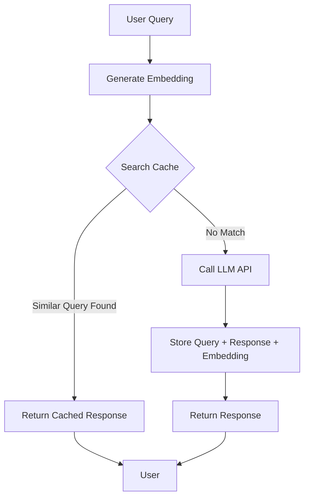
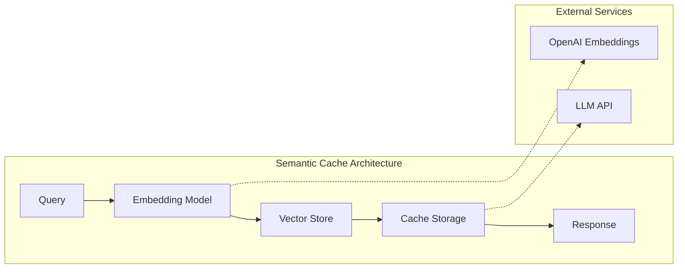
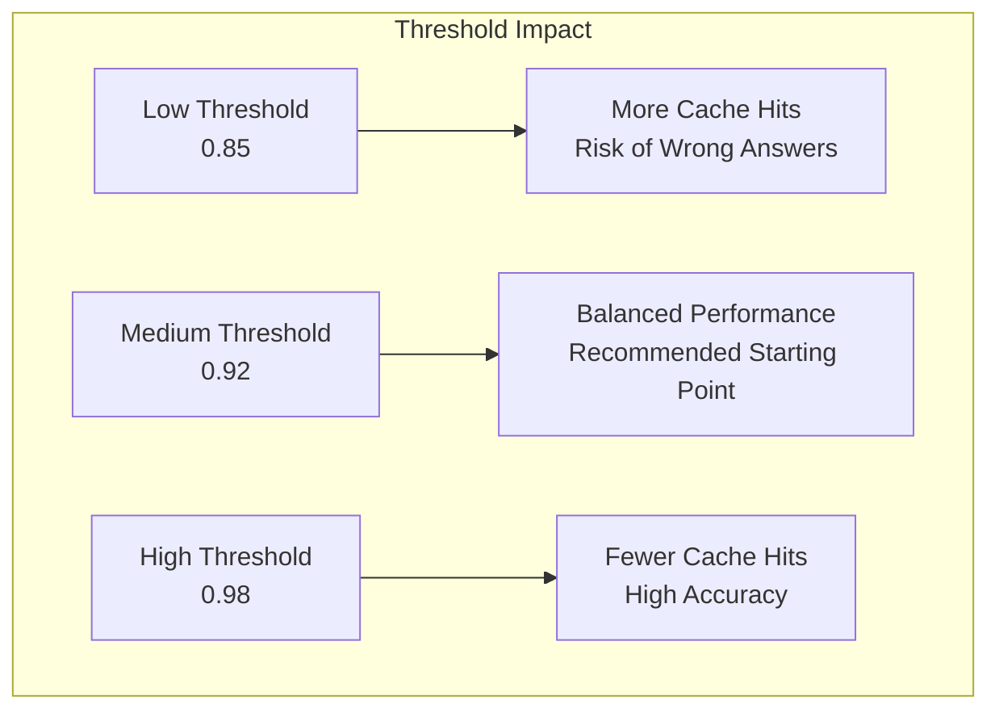
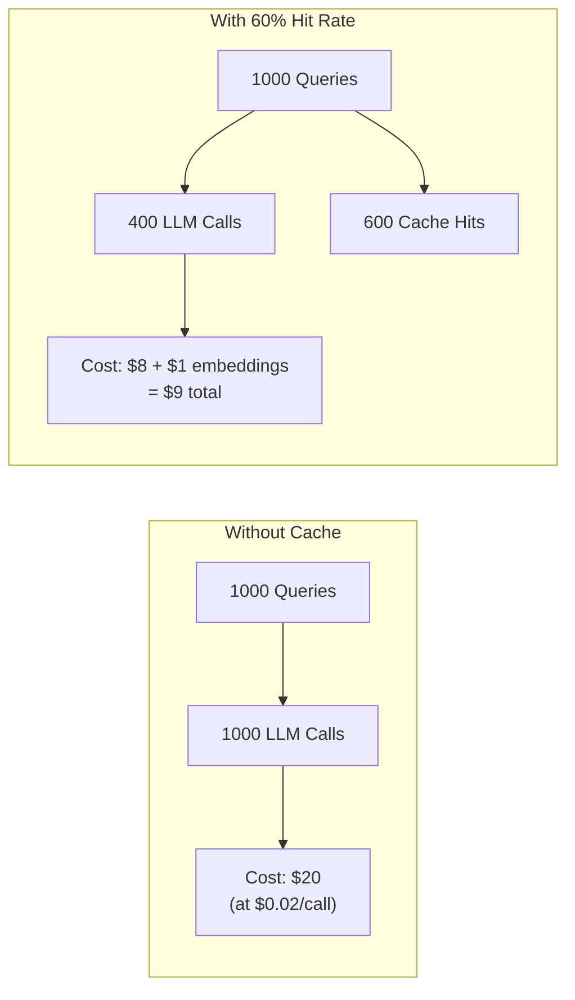

# How to Build Semantic Caching

Author: [nawazdhandala](https://github.com/nawazdhandala)

Tags: LLMOps, Semantic Caching, Embeddings, Cost Optimization

Description: Learn to build semantic caching for matching semantically similar queries to cached responses.

---

Large Language Model (LLM) API calls are expensive and slow. Every time a user asks a question that is semantically similar to one you have already answered, you are wasting money and time. Semantic caching solves this problem by storing responses and matching new queries based on meaning rather than exact text matches.

In this guide, we will build a production-ready semantic caching system from scratch. You will learn how embeddings work, how to measure semantic similarity, and how to optimize cache hit rates for real-world applications.

## What is Semantic Caching?

Traditional caching uses exact string matching. If a user asks "What is Python?" and later asks "What's Python?", a traditional cache would miss the second query despite both questions having the same intent.

Semantic caching uses vector embeddings to represent queries as points in high-dimensional space. Similar queries cluster together, allowing us to find matches based on meaning rather than exact text.



## Core Components

A semantic caching system requires four main components:

1. **Embedding Model**: Converts text queries into vector representations
2. **Vector Store**: Stores and searches embeddings efficiently
3. **Similarity Threshold**: Determines when two queries are "close enough"
4. **Cache Storage**: Stores the actual query-response pairs



## Building the Embedding Layer

Let us start by creating a class that handles embedding generation. We will use OpenAI's embedding model, but you can substitute any embedding provider.

```python
# embedding_service.py
# This module handles the conversion of text queries into vector embeddings.
# Embeddings are numerical representations that capture semantic meaning.

import openai
from typing import List
import numpy as np

class EmbeddingService:
    """
    Service for generating text embeddings using OpenAI's API.

    The embedding model converts text into a 1536-dimensional vector
    where semantically similar texts have vectors that are close together.
    """

    def __init__(self, api_key: str, model: str = "text-embedding-3-small"):
        # Initialize the OpenAI client with your API key
        self.client = openai.OpenAI(api_key=api_key)

        # The embedding model to use. Options include:
        # - text-embedding-3-small: Faster, cheaper, 1536 dimensions
        # - text-embedding-3-large: More accurate, 3072 dimensions
        self.model = model

    def get_embedding(self, text: str) -> List[float]:
        """
        Generate an embedding vector for a single text string.

        Args:
            text: The input text to embed (e.g., a user query)

        Returns:
            A list of floats representing the embedding vector
        """
        # Normalize the text by removing extra whitespace
        # This helps ensure consistent embeddings for similar queries
        normalized_text = " ".join(text.split())

        # Call the OpenAI API to generate the embedding
        response = self.client.embeddings.create(
            input=normalized_text,
            model=self.model
        )

        # Extract and return the embedding vector from the response
        return response.data[0].embedding

    def get_embeddings_batch(self, texts: List[str]) -> List[List[float]]:
        """
        Generate embeddings for multiple texts in a single API call.
        This is more efficient than calling get_embedding() multiple times.

        Args:
            texts: A list of text strings to embed

        Returns:
            A list of embedding vectors, one for each input text
        """
        # Normalize all texts
        normalized_texts = [" ".join(t.split()) for t in texts]

        # Batch API call is more cost-effective for multiple embeddings
        response = self.client.embeddings.create(
            input=normalized_texts,
            model=self.model
        )

        # Return embeddings in the same order as the input texts
        return [item.embedding for item in response.data]
```

## Implementing Similarity Search

The heart of semantic caching is the similarity calculation. We use cosine similarity to measure how close two embeddings are in vector space.

```python
# similarity.py
# This module provides functions for calculating semantic similarity
# between embedding vectors using cosine similarity.

import numpy as np
from typing import List, Tuple

def cosine_similarity(vec_a: List[float], vec_b: List[float]) -> float:
    """
    Calculate the cosine similarity between two vectors.

    Cosine similarity measures the angle between two vectors.
    A value of 1.0 means identical direction (same meaning).
    A value of 0.0 means perpendicular (unrelated meaning).
    A value of -1.0 means opposite direction (opposite meaning).

    Args:
        vec_a: First embedding vector
        vec_b: Second embedding vector

    Returns:
        Similarity score between -1.0 and 1.0
    """
    # Convert lists to numpy arrays for efficient computation
    a = np.array(vec_a)
    b = np.array(vec_b)

    # Calculate the dot product of the two vectors
    dot_product = np.dot(a, b)

    # Calculate the magnitude (length) of each vector
    magnitude_a = np.linalg.norm(a)
    magnitude_b = np.linalg.norm(b)

    # Avoid division by zero for zero vectors
    if magnitude_a == 0 or magnitude_b == 0:
        return 0.0

    # Cosine similarity formula: dot(a,b) / (|a| * |b|)
    return dot_product / (magnitude_a * magnitude_b)


def find_most_similar(
    query_embedding: List[float],
    cached_embeddings: List[Tuple[str, List[float]]],
    threshold: float = 0.92
) -> Tuple[str, float] | None:
    """
    Find the most similar cached embedding above the threshold.

    Args:
        query_embedding: The embedding of the new query
        cached_embeddings: List of (cache_key, embedding) tuples
        threshold: Minimum similarity score to consider a match

    Returns:
        Tuple of (cache_key, similarity_score) if match found, else None
    """
    best_match = None
    best_score = 0.0

    # Compare the query against all cached embeddings
    for cache_key, cached_embedding in cached_embeddings:
        score = cosine_similarity(query_embedding, cached_embedding)

        # Track the best match that exceeds the threshold
        if score > best_score and score >= threshold:
            best_match = cache_key
            best_score = score

    if best_match:
        return (best_match, best_score)

    return None
```

## Choosing the Right Similarity Threshold

The similarity threshold is critical for balancing cache hits against accuracy. A threshold that is too low will return irrelevant cached responses. A threshold that is too high will rarely hit the cache.



Here is a guide for selecting thresholds based on use case:

| Use Case | Recommended Threshold | Rationale |
|----------|----------------------|-----------|
| FAQ Systems | 0.90 - 0.92 | Questions are often rephrased |
| Code Assistance | 0.94 - 0.96 | Technical precision matters |
| Customer Support | 0.91 - 0.93 | Balance speed and accuracy |
| Search Queries | 0.88 - 0.90 | Users accept varied results |

```python
# threshold_config.py
# Configuration for similarity thresholds based on use case.
# Adjust these values based on your specific requirements.

from enum import Enum
from dataclasses import dataclass

class UseCaseType(Enum):
    """Predefined use cases with optimized threshold settings."""
    FAQ = "faq"
    CODE_ASSISTANT = "code_assistant"
    CUSTOMER_SUPPORT = "customer_support"
    SEARCH = "search"
    CUSTOM = "custom"

@dataclass
class ThresholdConfig:
    """
    Configuration for semantic similarity thresholds.

    Attributes:
        similarity_threshold: Minimum cosine similarity for cache hit
        confidence_threshold: Minimum confidence to skip LLM validation
        max_cache_age_hours: Maximum age of cached entries to consider
    """
    similarity_threshold: float
    confidence_threshold: float
    max_cache_age_hours: int

# Predefined configurations for common use cases
THRESHOLD_PRESETS = {
    UseCaseType.FAQ: ThresholdConfig(
        similarity_threshold=0.91,
        confidence_threshold=0.95,
        max_cache_age_hours=168  # 1 week
    ),
    UseCaseType.CODE_ASSISTANT: ThresholdConfig(
        similarity_threshold=0.95,
        confidence_threshold=0.98,
        max_cache_age_hours=24  # 1 day, code changes frequently
    ),
    UseCaseType.CUSTOMER_SUPPORT: ThresholdConfig(
        similarity_threshold=0.92,
        confidence_threshold=0.96,
        max_cache_age_hours=72  # 3 days
    ),
    UseCaseType.SEARCH: ThresholdConfig(
        similarity_threshold=0.89,
        confidence_threshold=0.93,
        max_cache_age_hours=48  # 2 days
    ),
}

def get_threshold_config(use_case: UseCaseType) -> ThresholdConfig:
    """
    Get the recommended threshold configuration for a use case.

    Args:
        use_case: The type of application using semantic caching

    Returns:
        ThresholdConfig with optimized settings
    """
    return THRESHOLD_PRESETS.get(use_case, THRESHOLD_PRESETS[UseCaseType.FAQ])
```

## Building the Vector Store

For production use, you need an efficient way to search through embeddings. Here is an implementation using FAISS, a library optimized for similarity search.

```python
# vector_store.py
# This module implements a vector store for efficient similarity search.
# We use FAISS (Facebook AI Similarity Search) for fast nearest neighbor lookup.

import faiss
import numpy as np
from typing import List, Tuple, Optional
from dataclasses import dataclass
from datetime import datetime
import pickle

@dataclass
class CacheEntry:
    """
    Represents a single entry in the semantic cache.

    Attributes:
        cache_id: Unique identifier for this cache entry
        query: The original query text
        response: The cached LLM response
        embedding: Vector representation of the query
        created_at: Timestamp when the entry was created
        hit_count: Number of times this cache entry was used
    """
    cache_id: str
    query: str
    response: str
    embedding: List[float]
    created_at: datetime
    hit_count: int = 0


class VectorStore:
    """
    A vector store that enables fast similarity search over embeddings.

    Uses FAISS IndexFlatIP (Inner Product) for exact similarity search.
    For larger datasets, consider using IndexIVFFlat for approximate
    search with better performance.
    """

    def __init__(self, dimension: int = 1536):
        """
        Initialize the vector store.

        Args:
            dimension: The dimension of the embedding vectors.
                      1536 for text-embedding-3-small
                      3072 for text-embedding-3-large
        """
        self.dimension = dimension

        # Create a FAISS index using inner product similarity
        # For normalized vectors, inner product equals cosine similarity
        self.index = faiss.IndexFlatIP(dimension)

        # Store metadata separately since FAISS only handles vectors
        self.entries: List[CacheEntry] = []

        # Map from cache_id to index position for quick lookup
        self.id_to_index: dict[str, int] = {}

    def add_entry(self, entry: CacheEntry) -> None:
        """
        Add a new cache entry to the vector store.

        Args:
            entry: The CacheEntry to add
        """
        # Convert embedding to numpy array and normalize it
        # Normalization ensures cosine similarity via inner product
        embedding = np.array([entry.embedding], dtype=np.float32)
        faiss.normalize_L2(embedding)

        # Add the normalized vector to the FAISS index
        self.index.add(embedding)

        # Store the entry metadata
        self.entries.append(entry)
        self.id_to_index[entry.cache_id] = len(self.entries) - 1

    def search(
        self,
        query_embedding: List[float],
        threshold: float = 0.92,
        top_k: int = 1
    ) -> List[Tuple[CacheEntry, float]]:
        """
        Search for similar entries in the vector store.

        Args:
            query_embedding: The embedding vector to search for
            threshold: Minimum similarity score to return
            top_k: Maximum number of results to return

        Returns:
            List of (CacheEntry, similarity_score) tuples
        """
        if self.index.ntotal == 0:
            # No entries in the cache yet
            return []

        # Prepare and normalize the query vector
        query_vector = np.array([query_embedding], dtype=np.float32)
        faiss.normalize_L2(query_vector)

        # Search the FAISS index for nearest neighbors
        # D contains distances (similarity scores)
        # I contains indices of the nearest neighbors
        scores, indices = self.index.search(query_vector, min(top_k, self.index.ntotal))

        results = []
        for score, idx in zip(scores[0], indices[0]):
            # FAISS may return -1 for indices when fewer results exist
            if idx >= 0 and score >= threshold:
                entry = self.entries[idx]
                results.append((entry, float(score)))

        return results

    def remove_entry(self, cache_id: str) -> bool:
        """
        Remove an entry from the vector store by its cache_id.

        Note: FAISS IndexFlatIP does not support direct removal.
        This method marks the entry as removed and rebuilds periodically.

        Args:
            cache_id: The ID of the cache entry to remove

        Returns:
            True if the entry was found and marked for removal
        """
        if cache_id not in self.id_to_index:
            return False

        idx = self.id_to_index[cache_id]
        self.entries[idx] = None  # Mark as removed
        del self.id_to_index[cache_id]
        return True

    def rebuild_index(self) -> None:
        """
        Rebuild the FAISS index, removing any entries marked as None.
        Call this periodically to reclaim space from removed entries.
        """
        # Filter out removed entries
        active_entries = [e for e in self.entries if e is not None]

        # Reset the index and mappings
        self.index = faiss.IndexFlatIP(self.dimension)
        self.entries = []
        self.id_to_index = {}

        # Re-add all active entries
        for entry in active_entries:
            self.add_entry(entry)

    def save(self, path: str) -> None:
        """
        Save the vector store to disk for persistence.

        Args:
            path: Directory path to save the store
        """
        # Save the FAISS index
        faiss.write_index(self.index, f"{path}/faiss.index")

        # Save the metadata
        with open(f"{path}/metadata.pkl", "wb") as f:
            pickle.dump({
                "entries": self.entries,
                "id_to_index": self.id_to_index,
                "dimension": self.dimension
            }, f)

    @classmethod
    def load(cls, path: str) -> "VectorStore":
        """
        Load a vector store from disk.

        Args:
            path: Directory path where the store was saved

        Returns:
            A VectorStore instance with the loaded data
        """
        # Load the metadata first to get the dimension
        with open(f"{path}/metadata.pkl", "rb") as f:
            metadata = pickle.load(f)

        # Create a new instance
        store = cls(dimension=metadata["dimension"])
        store.entries = metadata["entries"]
        store.id_to_index = metadata["id_to_index"]

        # Load the FAISS index
        store.index = faiss.read_index(f"{path}/faiss.index")

        return store
```

## The Complete Semantic Cache

Now let us put all the pieces together into a complete semantic caching system.

```python
# semantic_cache.py
# The main semantic caching implementation that combines all components.
# This is the primary interface for applications to use.

import uuid
import hashlib
from datetime import datetime, timedelta
from typing import Optional, Callable
from dataclasses import dataclass

from embedding_service import EmbeddingService
from vector_store import VectorStore, CacheEntry
from threshold_config import ThresholdConfig, UseCaseType, get_threshold_config

@dataclass
class CacheResult:
    """
    Result returned from a cache lookup or LLM call.

    Attributes:
        response: The response text
        cache_hit: Whether this came from cache
        similarity_score: Similarity score if cache hit, else None
        cache_id: ID of the cache entry used or created
        latency_ms: Time taken to get the response
    """
    response: str
    cache_hit: bool
    similarity_score: Optional[float]
    cache_id: str
    latency_ms: float


class SemanticCache:
    """
    A semantic caching layer for LLM applications.

    This cache stores query-response pairs and uses embedding similarity
    to match new queries against cached responses. When a sufficiently
    similar query is found, the cached response is returned, saving
    both time and API costs.
    """

    def __init__(
        self,
        embedding_service: EmbeddingService,
        llm_function: Callable[[str], str],
        config: Optional[ThresholdConfig] = None,
        use_case: UseCaseType = UseCaseType.FAQ
    ):
        """
        Initialize the semantic cache.

        Args:
            embedding_service: Service for generating embeddings
            llm_function: Function that calls your LLM and returns response
            config: Custom threshold configuration (optional)
            use_case: Predefined use case for automatic configuration
        """
        self.embedding_service = embedding_service
        self.llm_function = llm_function

        # Use custom config or get preset based on use case
        self.config = config or get_threshold_config(use_case)

        # Initialize the vector store for similarity search
        self.vector_store = VectorStore()

        # Track cache statistics
        self.stats = {
            "total_requests": 0,
            "cache_hits": 0,
            "cache_misses": 0,
            "total_savings_ms": 0
        }

    def _generate_cache_id(self, query: str) -> str:
        """
        Generate a unique cache ID for a query.
        Uses a hash of the query combined with a UUID for uniqueness.
        """
        query_hash = hashlib.md5(query.encode()).hexdigest()[:8]
        unique_id = str(uuid.uuid4())[:8]
        return f"cache_{query_hash}_{unique_id}"

    def _is_entry_expired(self, entry: CacheEntry) -> bool:
        """
        Check if a cache entry has exceeded its maximum age.
        """
        max_age = timedelta(hours=self.config.max_cache_age_hours)
        return datetime.now() - entry.created_at > max_age

    def query(self, user_query: str) -> CacheResult:
        """
        Process a user query through the semantic cache.

        This method:
        1. Generates an embedding for the query
        2. Searches for similar cached queries
        3. Returns cached response if match found
        4. Calls LLM and caches result if no match

        Args:
            user_query: The user's input query

        Returns:
            CacheResult containing the response and metadata
        """
        import time
        start_time = time.time()

        self.stats["total_requests"] += 1

        # Step 1: Generate embedding for the incoming query
        query_embedding = self.embedding_service.get_embedding(user_query)

        # Step 2: Search for similar queries in the cache
        matches = self.vector_store.search(
            query_embedding=query_embedding,
            threshold=self.config.similarity_threshold,
            top_k=1
        )

        # Step 3: Check if we have a valid cache hit
        if matches:
            entry, similarity_score = matches[0]

            # Verify the entry has not expired
            if not self._is_entry_expired(entry):
                # Cache hit! Update statistics and return
                entry.hit_count += 1
                self.stats["cache_hits"] += 1

                latency_ms = (time.time() - start_time) * 1000

                return CacheResult(
                    response=entry.response,
                    cache_hit=True,
                    similarity_score=similarity_score,
                    cache_id=entry.cache_id,
                    latency_ms=latency_ms
                )

        # Step 4: Cache miss - call the LLM
        self.stats["cache_misses"] += 1
        llm_response = self.llm_function(user_query)

        # Step 5: Store the new query-response pair in cache
        cache_id = self._generate_cache_id(user_query)
        new_entry = CacheEntry(
            cache_id=cache_id,
            query=user_query,
            response=llm_response,
            embedding=query_embedding,
            created_at=datetime.now()
        )
        self.vector_store.add_entry(new_entry)

        latency_ms = (time.time() - start_time) * 1000

        return CacheResult(
            response=llm_response,
            cache_hit=False,
            similarity_score=None,
            cache_id=cache_id,
            latency_ms=latency_ms
        )

    def get_stats(self) -> dict:
        """
        Get cache performance statistics.

        Returns:
            Dictionary containing hit rate and other metrics
        """
        total = self.stats["total_requests"]
        hits = self.stats["cache_hits"]

        return {
            "total_requests": total,
            "cache_hits": hits,
            "cache_misses": self.stats["cache_misses"],
            "hit_rate": hits / total if total > 0 else 0,
            "entries_in_cache": len(self.vector_store.entries)
        }

    def invalidate(self, cache_id: str) -> bool:
        """
        Manually invalidate a cache entry.

        Use this when you know a cached response is outdated.

        Args:
            cache_id: The ID of the cache entry to invalidate

        Returns:
            True if the entry was found and removed
        """
        return self.vector_store.remove_entry(cache_id)

    def clear_expired(self) -> int:
        """
        Remove all expired entries from the cache.

        Returns:
            Number of entries removed
        """
        removed_count = 0
        for entry in self.vector_store.entries:
            if entry and self._is_entry_expired(entry):
                self.vector_store.remove_entry(entry.cache_id)
                removed_count += 1

        # Rebuild the index to reclaim space
        if removed_count > 0:
            self.vector_store.rebuild_index()

        return removed_count
```

## Usage Example

Here is how to use the semantic cache in a real application:

```python
# example_usage.py
# Demonstrates how to integrate semantic caching into your application.

import openai
from semantic_cache import SemanticCache
from embedding_service import EmbeddingService
from threshold_config import UseCaseType

# Initialize the OpenAI client for LLM calls
openai_client = openai.OpenAI(api_key="your-api-key")

# Define the function that calls your LLM
def call_llm(query: str) -> str:
    """
    Make a call to the LLM API.
    This function will be called on cache misses.
    """
    response = openai_client.chat.completions.create(
        model="gpt-4",
        messages=[
            {"role": "system", "content": "You are a helpful assistant."},
            {"role": "user", "content": query}
        ]
    )
    return response.choices[0].message.content

# Initialize the embedding service
embedding_service = EmbeddingService(api_key="your-api-key")

# Create the semantic cache for a customer support use case
cache = SemanticCache(
    embedding_service=embedding_service,
    llm_function=call_llm,
    use_case=UseCaseType.CUSTOMER_SUPPORT
)

# Example queries demonstrating semantic matching
queries = [
    "How do I reset my password?",
    "I forgot my password, how can I reset it?",  # Similar to first
    "What are your business hours?",
    "When is your store open?",  # Similar to third
    "How do I reset my password?"  # Exact match to first
]

for query in queries:
    result = cache.query(query)

    status = "HIT" if result.cache_hit else "MISS"
    similarity = f" (similarity: {result.similarity_score:.3f})" if result.similarity_score else ""

    print(f"[{status}]{similarity} {query[:50]}...")

# Print final statistics
print("\nCache Statistics:")
stats = cache.get_stats()
print(f"  Total requests: {stats['total_requests']}")
print(f"  Cache hits: {stats['cache_hits']}")
print(f"  Hit rate: {stats['hit_rate']:.1%}")
```

## Optimizing Cache Hit Rates

To maximize the effectiveness of your semantic cache, consider these optimization strategies:

### 1. Query Normalization

Preprocess queries to improve embedding consistency:

```python
# query_normalizer.py
# Utilities for normalizing queries before embedding.

import re
from typing import Optional

class QueryNormalizer:
    """
    Normalizes user queries to improve cache hit rates.

    Normalization helps ensure that semantically identical queries
    produce similar embeddings even when they differ in formatting.
    """

    @staticmethod
    def normalize(query: str, lowercase: bool = True) -> str:
        """
        Apply standard normalization to a query.

        Args:
            query: The raw user query
            lowercase: Whether to convert to lowercase

        Returns:
            Normalized query string
        """
        # Remove extra whitespace
        normalized = " ".join(query.split())

        # Optionally convert to lowercase
        # Note: This may affect case-sensitive queries
        if lowercase:
            normalized = normalized.lower()

        # Remove common filler words that do not affect meaning
        filler_patterns = [
            r'\bplease\b',
            r'\bkindly\b',
            r'\bcan you\b',
            r'\bcould you\b',
            r'\bi want to\b',
            r'\bi need to\b',
        ]

        for pattern in filler_patterns:
            normalized = re.sub(pattern, '', normalized, flags=re.IGNORECASE)

        # Remove extra whitespace again after removals
        normalized = " ".join(normalized.split())

        # Remove trailing punctuation that does not affect meaning
        normalized = normalized.rstrip('?!.')

        return normalized

    @staticmethod
    def extract_intent(query: str) -> Optional[str]:
        """
        Extract the core intent from a query for better matching.

        This is useful for identifying common query patterns.
        """
        # Common intent patterns
        intent_patterns = {
            r'\bhow\s+(do|can|to)\b': 'how_to',
            r'\bwhat\s+is\b': 'definition',
            r'\bwhy\b': 'explanation',
            r'\bwhen\b': 'timing',
            r'\bwhere\b': 'location',
            r'\bprice|cost|how\s+much\b': 'pricing',
            r'\bcancel|refund\b': 'cancellation',
        }

        query_lower = query.lower()
        for pattern, intent in intent_patterns.items():
            if re.search(pattern, query_lower):
                return intent

        return None
```

### 2. Adaptive Thresholds

Adjust thresholds dynamically based on query characteristics:

```python
# adaptive_threshold.py
# Implements dynamic threshold adjustment based on query analysis.

from typing import List
import numpy as np

class AdaptiveThreshold:
    """
    Dynamically adjusts similarity thresholds based on query characteristics.

    Short queries often need higher thresholds because small changes
    in wording can significantly affect meaning. Long queries can
    tolerate lower thresholds since they provide more context.
    """

    def __init__(
        self,
        base_threshold: float = 0.92,
        min_threshold: float = 0.88,
        max_threshold: float = 0.98
    ):
        self.base_threshold = base_threshold
        self.min_threshold = min_threshold
        self.max_threshold = max_threshold

    def calculate_threshold(self, query: str) -> float:
        """
        Calculate the appropriate threshold for a given query.

        Args:
            query: The user query

        Returns:
            Adjusted similarity threshold
        """
        word_count = len(query.split())

        # Short queries (< 5 words) need higher thresholds
        # Long queries (> 20 words) can use lower thresholds
        if word_count < 5:
            # Increase threshold for short queries
            adjustment = 0.03
        elif word_count > 20:
            # Decrease threshold for long queries
            adjustment = -0.02
        else:
            # Linear interpolation for medium queries
            adjustment = 0.02 - (word_count - 5) * 0.003

        threshold = self.base_threshold + adjustment

        # Clamp to valid range
        return max(self.min_threshold, min(self.max_threshold, threshold))

    def calculate_from_embedding_density(
        self,
        query_embedding: List[float],
        cached_embeddings: List[List[float]]
    ) -> float:
        """
        Adjust threshold based on the density of nearby cached embeddings.

        In dense regions (many similar queries), use higher thresholds
        to be more precise. In sparse regions, use lower thresholds.
        """
        if not cached_embeddings:
            return self.base_threshold

        # Calculate average similarity to all cached embeddings
        query_vec = np.array(query_embedding)
        similarities = []

        for cached in cached_embeddings:
            cached_vec = np.array(cached)
            similarity = np.dot(query_vec, cached_vec) / (
                np.linalg.norm(query_vec) * np.linalg.norm(cached_vec)
            )
            similarities.append(similarity)

        avg_similarity = np.mean(similarities)

        # High average similarity means dense region, need higher threshold
        if avg_similarity > 0.7:
            return min(self.max_threshold, self.base_threshold + 0.03)
        elif avg_similarity < 0.4:
            return max(self.min_threshold, self.base_threshold - 0.02)

        return self.base_threshold
```

### 3. Cache Warming

Pre-populate the cache with common queries to improve initial hit rates:

```python
# cache_warmer.py
# Utilities for pre-populating the semantic cache.

from typing import List, Dict
from semantic_cache import SemanticCache

class CacheWarmer:
    """
    Pre-populates the semantic cache with common queries.

    Cache warming is essential for production deployments.
    It ensures that frequently asked questions are already
    cached when real users start making requests.
    """

    def __init__(self, cache: SemanticCache):
        self.cache = cache

    def warm_from_list(self, query_response_pairs: List[Dict[str, str]]) -> int:
        """
        Warm the cache with a list of query-response pairs.

        Args:
            query_response_pairs: List of dicts with 'query' and 'response' keys

        Returns:
            Number of entries added to cache
        """
        added = 0

        for pair in query_response_pairs:
            query = pair["query"]
            response = pair["response"]

            # Generate embedding for the query
            embedding = self.cache.embedding_service.get_embedding(query)

            # Create and add the cache entry directly
            from vector_store import CacheEntry
            from datetime import datetime

            entry = CacheEntry(
                cache_id=self.cache._generate_cache_id(query),
                query=query,
                response=response,
                embedding=embedding,
                created_at=datetime.now()
            )

            self.cache.vector_store.add_entry(entry)
            added += 1

        return added

    def warm_from_logs(
        self,
        query_logs: List[str],
        min_frequency: int = 3
    ) -> int:
        """
        Warm cache using historical query logs.

        Analyzes logs to find frequently asked queries and
        processes them through the full cache pipeline.

        Args:
            query_logs: List of historical queries
            min_frequency: Minimum occurrences to include

        Returns:
            Number of entries added
        """
        # Count query frequencies
        from collections import Counter

        # Normalize queries for counting
        from query_normalizer import QueryNormalizer
        normalizer = QueryNormalizer()

        normalized_queries = [normalizer.normalize(q) for q in query_logs]
        frequency = Counter(normalized_queries)

        # Process queries that meet minimum frequency
        added = 0
        for query, count in frequency.items():
            if count >= min_frequency:
                # Use the cache's normal query method to populate
                self.cache.query(query)
                added += 1

        return added
```

## Monitoring and Metrics

Track these key metrics to ensure your cache is performing well:

```python
# metrics.py
# Metrics collection for monitoring semantic cache performance.

from dataclasses import dataclass, field
from datetime import datetime
from typing import List, Optional
import statistics

@dataclass
class CacheMetrics:
    """
    Comprehensive metrics for semantic cache monitoring.
    """
    # Request counters
    total_requests: int = 0
    cache_hits: int = 0
    cache_misses: int = 0

    # Latency tracking (in milliseconds)
    hit_latencies: List[float] = field(default_factory=list)
    miss_latencies: List[float] = field(default_factory=list)

    # Similarity score distribution for hits
    similarity_scores: List[float] = field(default_factory=list)

    # Cost tracking
    embedding_api_calls: int = 0
    llm_api_calls: int = 0

    def record_hit(self, latency_ms: float, similarity: float) -> None:
        """Record a cache hit with its metrics."""
        self.total_requests += 1
        self.cache_hits += 1
        self.hit_latencies.append(latency_ms)
        self.similarity_scores.append(similarity)
        self.embedding_api_calls += 1

    def record_miss(self, latency_ms: float) -> None:
        """Record a cache miss with its metrics."""
        self.total_requests += 1
        self.cache_misses += 1
        self.miss_latencies.append(latency_ms)
        self.embedding_api_calls += 1
        self.llm_api_calls += 1

    @property
    def hit_rate(self) -> float:
        """Calculate the cache hit rate."""
        if self.total_requests == 0:
            return 0.0
        return self.cache_hits / self.total_requests

    @property
    def avg_hit_latency(self) -> float:
        """Calculate average latency for cache hits."""
        if not self.hit_latencies:
            return 0.0
        return statistics.mean(self.hit_latencies)

    @property
    def avg_miss_latency(self) -> float:
        """Calculate average latency for cache misses."""
        if not self.miss_latencies:
            return 0.0
        return statistics.mean(self.miss_latencies)

    @property
    def latency_improvement(self) -> float:
        """Calculate the latency improvement ratio from caching."""
        if self.avg_hit_latency == 0:
            return 0.0
        return self.avg_miss_latency / self.avg_hit_latency

    @property
    def avg_similarity_score(self) -> float:
        """Calculate average similarity score for cache hits."""
        if not self.similarity_scores:
            return 0.0
        return statistics.mean(self.similarity_scores)

    def get_summary(self) -> dict:
        """Generate a summary report of all metrics."""
        return {
            "total_requests": self.total_requests,
            "cache_hits": self.cache_hits,
            "cache_misses": self.cache_misses,
            "hit_rate": f"{self.hit_rate:.1%}",
            "avg_hit_latency_ms": round(self.avg_hit_latency, 2),
            "avg_miss_latency_ms": round(self.avg_miss_latency, 2),
            "latency_improvement": f"{self.latency_improvement:.1f}x",
            "avg_similarity_score": round(self.avg_similarity_score, 3),
            "embedding_api_calls": self.embedding_api_calls,
            "llm_api_calls": self.llm_api_calls,
            "llm_calls_saved": self.cache_hits
        }
```

## Cost Savings Analysis

Here is how to calculate the cost savings from semantic caching:



```python
# cost_calculator.py
# Calculate cost savings from semantic caching.

@dataclass
class CostConfig:
    """Pricing configuration for API calls."""
    llm_cost_per_1k_tokens: float = 0.03  # GPT-4 input pricing
    embedding_cost_per_1k_tokens: float = 0.0001  # text-embedding-3-small
    avg_query_tokens: int = 50
    avg_response_tokens: int = 200

def calculate_savings(
    total_queries: int,
    hit_rate: float,
    config: CostConfig = CostConfig()
) -> dict:
    """
    Calculate the cost savings from semantic caching.

    Args:
        total_queries: Total number of queries processed
        hit_rate: Cache hit rate (0.0 to 1.0)
        config: Pricing configuration

    Returns:
        Dictionary with cost breakdown and savings
    """
    cache_hits = int(total_queries * hit_rate)
    cache_misses = total_queries - cache_hits

    # Cost without caching (all queries go to LLM)
    tokens_per_query = config.avg_query_tokens + config.avg_response_tokens
    cost_without_cache = (
        total_queries * tokens_per_query / 1000 * config.llm_cost_per_1k_tokens
    )

    # Cost with caching
    # - All queries need embeddings
    embedding_cost = (
        total_queries * config.avg_query_tokens / 1000 *
        config.embedding_cost_per_1k_tokens
    )

    # - Only cache misses need LLM calls
    llm_cost = (
        cache_misses * tokens_per_query / 1000 * config.llm_cost_per_1k_tokens
    )

    cost_with_cache = embedding_cost + llm_cost
    savings = cost_without_cache - cost_with_cache

    return {
        "total_queries": total_queries,
        "cache_hits": cache_hits,
        "cache_misses": cache_misses,
        "hit_rate": f"{hit_rate:.1%}",
        "cost_without_cache": f"${cost_without_cache:.2f}",
        "cost_with_cache": f"${cost_with_cache:.2f}",
        "savings": f"${savings:.2f}",
        "savings_percentage": f"{(savings/cost_without_cache)*100:.1f}%"
    }
```

## Production Considerations

When deploying semantic caching to production, keep these factors in mind:

### Persistence and High Availability

```python
# redis_vector_store.py
# Production-ready vector store using Redis for persistence.

import redis
import json
import numpy as np
from typing import List, Tuple, Optional

class RedisVectorStore:
    """
    A Redis-backed vector store for production deployments.

    Uses Redis for persistence and enables horizontal scaling
    across multiple application instances.
    """

    def __init__(
        self,
        redis_url: str = "redis://localhost:6379",
        key_prefix: str = "semantic_cache:",
        dimension: int = 1536
    ):
        self.redis_client = redis.from_url(redis_url)
        self.key_prefix = key_prefix
        self.dimension = dimension

    def add_entry(self, cache_id: str, query: str, response: str,
                  embedding: List[float]) -> None:
        """Store a cache entry in Redis."""
        key = f"{self.key_prefix}{cache_id}"

        data = {
            "query": query,
            "response": response,
            "embedding": json.dumps(embedding),
            "created_at": datetime.now().isoformat(),
            "hit_count": 0
        }

        self.redis_client.hset(key, mapping=data)

        # Add to the index set for iteration
        self.redis_client.sadd(f"{self.key_prefix}index", cache_id)

    def search(
        self,
        query_embedding: List[float],
        threshold: float = 0.92
    ) -> Optional[Tuple[str, str, float]]:
        """
        Search for similar entries.

        Note: For large-scale deployments, consider using
        Redis Stack with vector similarity search or
        a dedicated vector database like Pinecone or Weaviate.
        """
        query_vec = np.array(query_embedding)
        best_match = None
        best_score = 0.0

        # Iterate through all cache entries
        cache_ids = self.redis_client.smembers(f"{self.key_prefix}index")

        for cache_id in cache_ids:
            key = f"{self.key_prefix}{cache_id.decode()}"
            data = self.redis_client.hgetall(key)

            if not data:
                continue

            cached_embedding = json.loads(data[b"embedding"])
            cached_vec = np.array(cached_embedding)

            # Calculate cosine similarity
            score = np.dot(query_vec, cached_vec) / (
                np.linalg.norm(query_vec) * np.linalg.norm(cached_vec)
            )

            if score > best_score and score >= threshold:
                best_score = score
                best_match = (
                    cache_id.decode(),
                    data[b"response"].decode(),
                    score
                )

        return best_match
```

### Cache Invalidation Strategies

Implement TTL-based expiration and event-driven invalidation:

```python
# invalidation.py
# Strategies for cache invalidation.

from enum import Enum
from typing import Callable, List
from datetime import datetime, timedelta

class InvalidationStrategy(Enum):
    TTL = "ttl"  # Time-based expiration
    LRU = "lru"  # Least recently used
    EVENT = "event"  # Event-driven invalidation

class CacheInvalidator:
    """
    Manages cache invalidation with multiple strategies.
    """

    def __init__(self, cache: "SemanticCache"):
        self.cache = cache
        self.invalidation_hooks: List[Callable] = []

    def register_hook(self, hook: Callable[[str], None]) -> None:
        """Register a callback for invalidation events."""
        self.invalidation_hooks.append(hook)

    def invalidate_by_ttl(self, max_age_hours: int) -> int:
        """Remove entries older than max_age_hours."""
        cutoff = datetime.now() - timedelta(hours=max_age_hours)
        removed = 0

        for entry in self.cache.vector_store.entries:
            if entry and entry.created_at < cutoff:
                self.cache.invalidate(entry.cache_id)
                removed += 1

                # Notify hooks
                for hook in self.invalidation_hooks:
                    hook(entry.cache_id)

        return removed

    def invalidate_by_pattern(self, query_pattern: str) -> int:
        """Remove entries matching a query pattern."""
        import re
        removed = 0

        for entry in self.cache.vector_store.entries:
            if entry and re.search(query_pattern, entry.query, re.IGNORECASE):
                self.cache.invalidate(entry.cache_id)
                removed += 1

        return removed
```

## Conclusion

Semantic caching is a powerful technique for reducing LLM costs and latency. By storing responses and matching queries based on semantic similarity rather than exact text, you can achieve significant savings while maintaining response quality.

Key takeaways:

1. **Choose the right threshold**: Start with 0.92 and adjust based on your use case
2. **Normalize queries**: Preprocessing improves cache hit rates
3. **Monitor metrics**: Track hit rates and similarity scores to tune performance
4. **Plan for production**: Use persistent storage and implement proper invalidation

With a well-tuned semantic cache, you can typically achieve 40-60% hit rates for conversational applications, translating to significant cost savings and faster response times for your users.

## Further Reading

- OpenAI Embeddings Documentation
- FAISS Library Documentation
- Vector Database Comparison Guide
- LLMOps Best Practices
