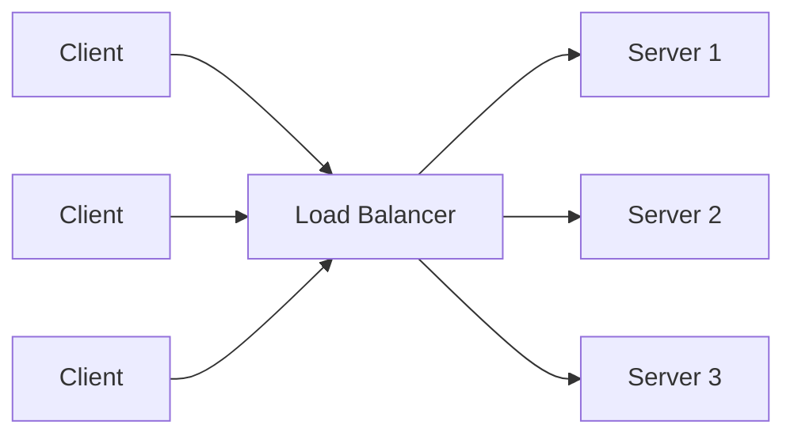
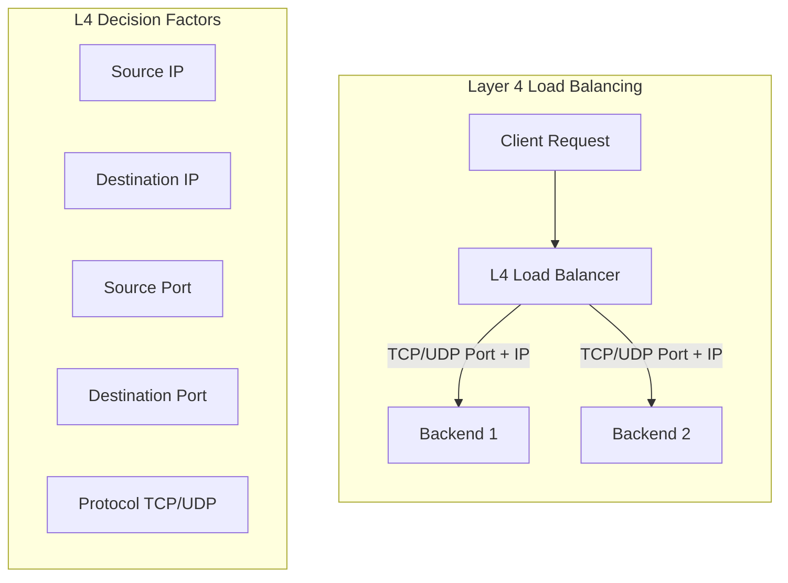
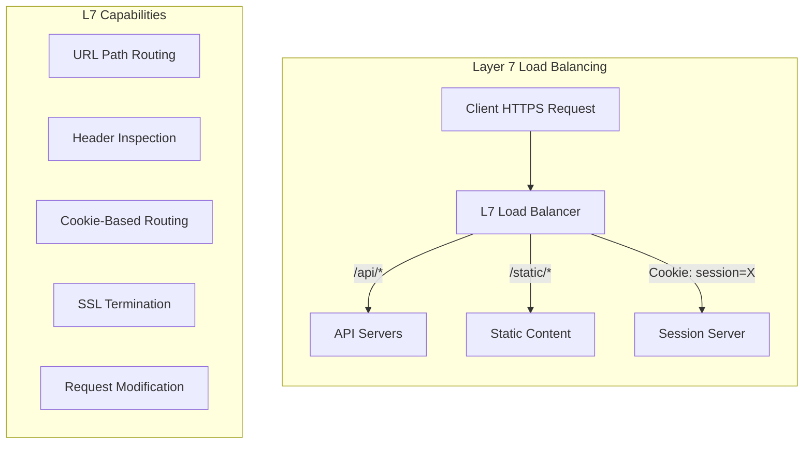
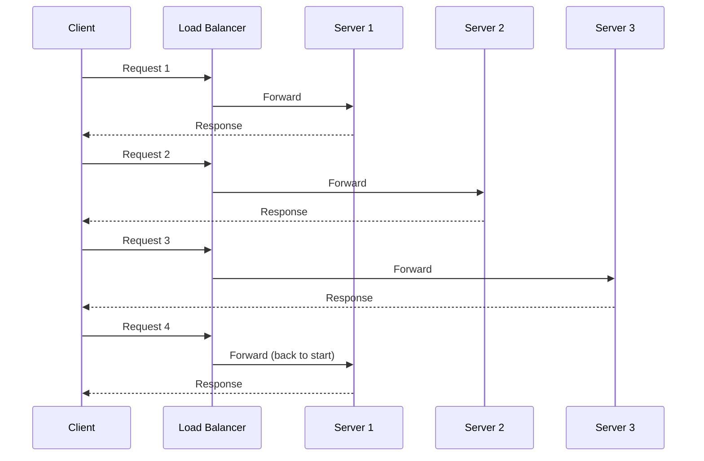
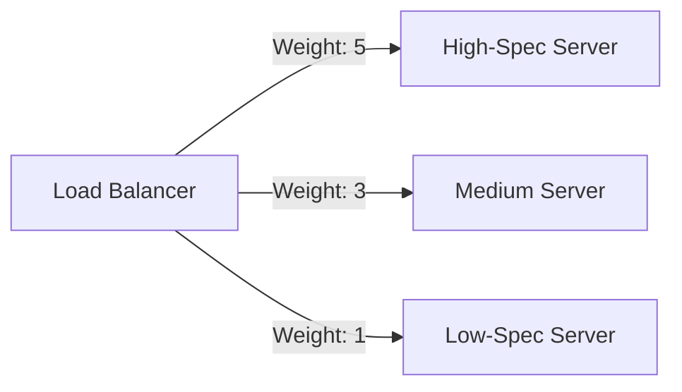
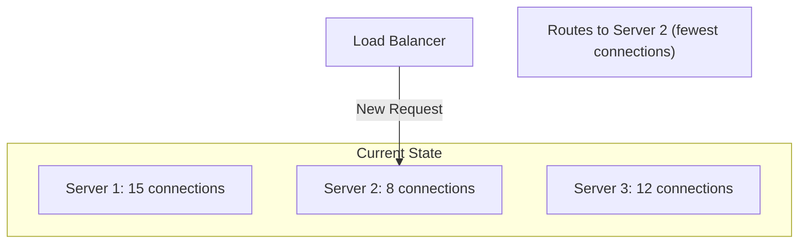
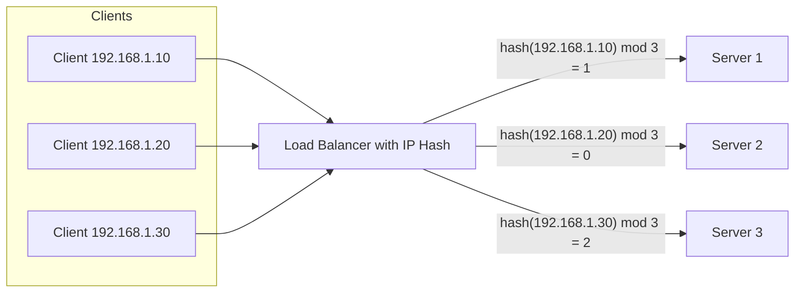
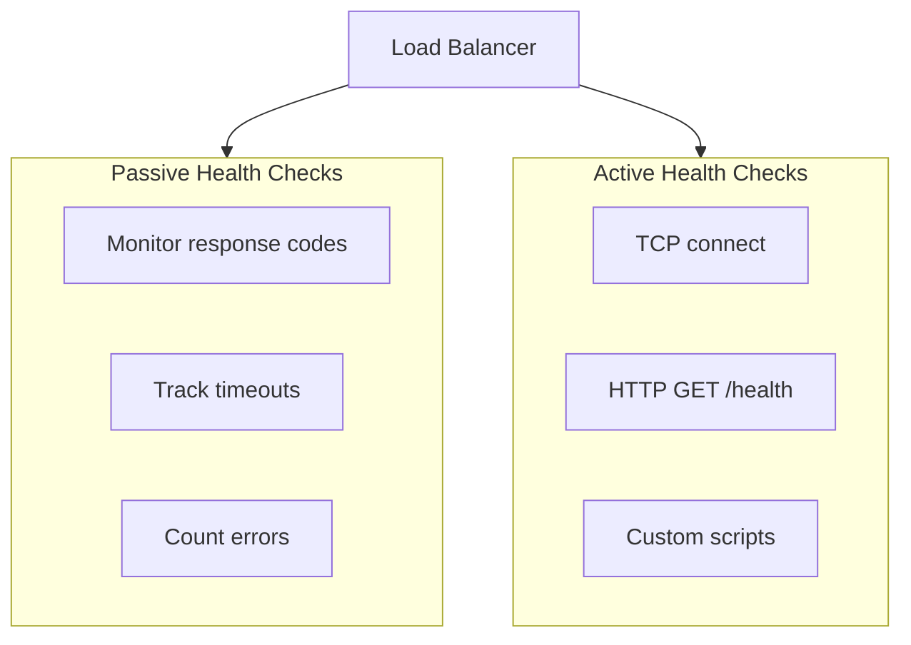
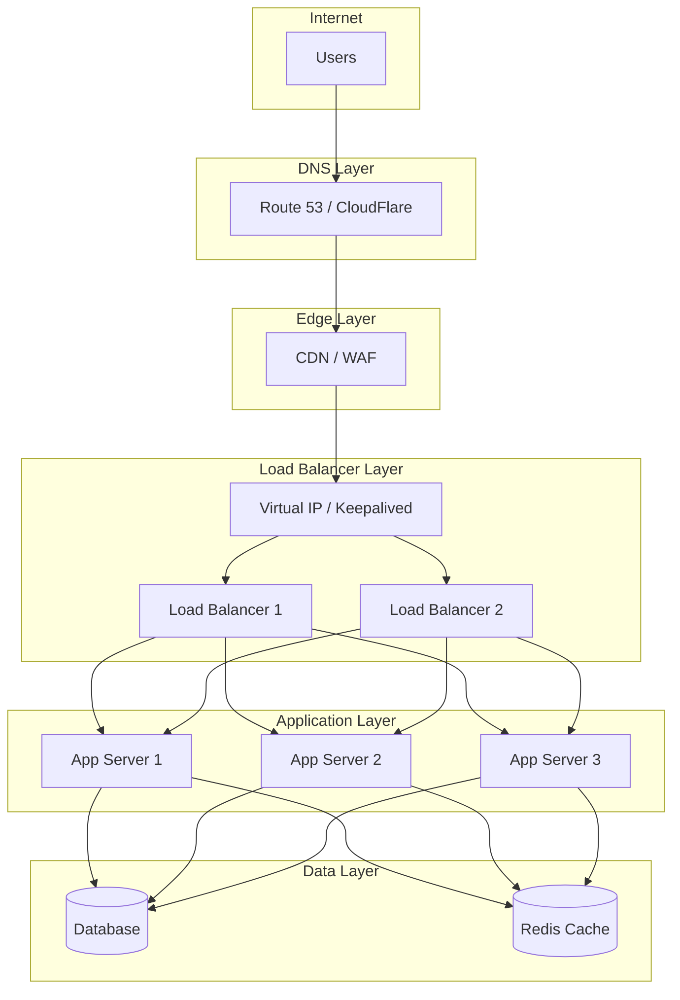

# How to Build Load Balancer Architecture

Author: [nawazdhandala](https://github.com/nawazdhandala)

Tags: Load Balancing, Architecture, Infrastructure, SRE

Description: Learn how to design load balancer architecture for scalability and high availability.

---

Load balancing is the backbone of scalable web infrastructure. Whether you are serving thousands or millions of requests, understanding how to design and implement load balancer architecture is essential for building systems that stay up under pressure.

## What is Load Balancing?

Load balancing distributes incoming network traffic across multiple backend servers. This prevents any single server from becoming overwhelmed, improves response times, and ensures high availability when servers fail.



## Layer 4 vs Layer 7 Load Balancing

The OSI model determines where load balancing decisions happen. Understanding L4 vs L7 is crucial for picking the right approach.

### Layer 4 (Transport Layer)

L4 load balancers route traffic based on IP addresses and TCP/UDP ports. They do not inspect packet contents, making them extremely fast but less flexible.



**Pros:**
- Extremely fast (no payload inspection)
- Protocol agnostic
- Lower resource usage
- Simple to configure

**Cons:**
- Cannot route based on content
- No SSL termination
- Limited health check options

### Layer 7 (Application Layer)

L7 load balancers inspect HTTP headers, URLs, cookies, and request body. This enables content-based routing, SSL termination, and advanced traffic management.



**Pros:**
- Content-based routing
- SSL termination
- Request/response modification
- Advanced health checks
- Web Application Firewall integration

**Cons:**
- Higher latency
- More resource intensive
- Complex configuration

### When to Use L4 vs L7

| Use Case | L4 | L7 |
|----------|----|----|
| Raw TCP/UDP traffic | Yes | No |
| Database connections | Yes | No |
| HTTP microservices | Possible | Recommended |
| SSL termination | No | Yes |
| Content-based routing | No | Yes |
| WebSocket | Yes | Yes |
| gRPC | Yes | Yes (better) |

## Load Balancing Algorithms

Choosing the right algorithm determines how traffic is distributed. Here are the most common algorithms with their use cases.

### Round Robin

Requests are distributed sequentially across servers. Simple and effective when servers have equal capacity.



### Weighted Round Robin

Servers with higher capacity receive proportionally more traffic. Use when backend servers have different specifications.



### Least Connections

Routes requests to the server with fewest active connections. Ideal for varying request processing times.



### IP Hash

Client IP determines the backend server. Provides session persistence without cookies.



### Least Response Time

Combines connection count and response time. Routes to the server that responds fastest with fewest connections.

### Algorithm Selection Guide

| Algorithm | Best For | Avoid When |
|-----------|----------|------------|
| Round Robin | Homogeneous servers, stateless apps | Servers have different capacity |
| Weighted Round Robin | Mixed server capacity | All servers equal |
| Least Connections | Long-lived connections | Very short requests |
| IP Hash | Session persistence needed | Clients behind NAT |
| Least Response Time | Performance-critical apps | Simple setups |

## Health Checks

Health checks determine if backend servers can receive traffic. Without proper health checks, load balancers will send requests to failed servers.

### Types of Health Checks



### TCP Health Check

Simple port connectivity test. Fast but only confirms the port is open.

```nginx
# NGINX TCP health check configuration
# This verifies that backend servers are accepting TCP connections
# on the specified port at regular intervals

upstream backend {
    # Zone directive enables shared memory for health check state
    # Required for NGINX Plus health checks
    zone backend_zone 64k;

    # Backend server pool
    server 10.0.0.1:8080;
    server 10.0.0.2:8080;
    server 10.0.0.3:8080;
}

server {
    listen 80;

    location / {
        proxy_pass http://backend;

        # Health check configuration (NGINX Plus)
        # interval: check every 5 seconds
        # fails: mark unhealthy after 3 consecutive failures
        # passes: mark healthy after 2 consecutive successes
        health_check interval=5s
                     fails=3
                     passes=2;
    }
}
```

### HTTP Health Check

Verifies the application responds correctly to HTTP requests.

```nginx
# NGINX HTTP health check with response validation
# This performs application-level health verification

upstream api_servers {
    # Shared memory zone for health check state
    zone api_zone 64k;

    # Backend API servers
    server 10.0.0.1:8080;
    server 10.0.0.2:8080;
    server 10.0.0.3:8080;
}

server {
    listen 80;

    location / {
        proxy_pass http://api_servers;

        # HTTP health check configuration
        # uri: the endpoint to check
        # match: reference to response validation block
        health_check interval=5s
                     fails=3
                     passes=2
                     uri=/health
                     match=health_ok;
    }
}

# Define what a healthy response looks like
# All conditions must match for the check to pass
match health_ok {
    # Response must return HTTP 200
    status 200;

    # Content-Type header must be JSON
    header Content-Type = application/json;

    # Response body must contain this JSON field
    body ~ "\"status\":\"healthy\"";
}
```

### Application Health Endpoint

Your application should expose a meaningful health endpoint.

```javascript
// Node.js Express health check endpoint
// Provides detailed health information for load balancer integration

const express = require('express');
const app = express();

// Main health check endpoint for load balancer
// Returns 200 if healthy, 503 if any critical check fails
app.get('/health', async (req, res) => {
    try {
        // Check database connectivity
        // This ensures the app can serve requests requiring data
        await db.query('SELECT 1');

        // Check Redis connectivity
        // Critical for session storage and caching
        await redis.ping();

        // Check external dependencies
        // Verify third-party services are reachable
        const dependencyStatus = await checkDependencies();

        // Return detailed health status
        // Load balancer uses this to make routing decisions
        res.json({
            status: 'healthy',
            timestamp: new Date().toISOString(),
            checks: {
                database: 'ok',
                redis: 'ok',
                dependencies: dependencyStatus
            }
        });
    } catch (error) {
        // Return unhealthy status with error details
        // 503 tells the load balancer to stop sending traffic
        res.status(503).json({
            status: 'unhealthy',
            timestamp: new Date().toISOString(),
            error: error.message
        });
    }
});

// Liveness probe: "Is the process running?"
// Used by Kubernetes to restart dead containers
app.get('/live', (req, res) => {
    res.status(200).send('OK');
});

// Readiness probe: "Can I accept traffic?"
// Used by Kubernetes to control traffic routing
app.get('/ready', async (req, res) => {
    const ready = await isReadyToServeTraffic();
    if (ready) {
        res.status(200).send('Ready');
    } else {
        res.status(503).send('Not Ready');
    }
});
```

## NGINX Load Balancer Configuration

NGINX is one of the most popular load balancers. Here is a comprehensive configuration for production use.

### Basic HTTP Load Balancing

```nginx
# /etc/nginx/nginx.conf
# Production-ready NGINX load balancer configuration

# Worker processes: auto-detect CPU cores for optimal performance
worker_processes auto;

# Maximum open file descriptors per worker
# Set high enough to handle expected connections
worker_rlimit_nofile 65535;

events {
    # Maximum simultaneous connections per worker
    # Total capacity = worker_processes * worker_connections
    worker_connections 4096;

    # Use epoll for Linux (most efficient event handling)
    use epoll;

    # Accept multiple connections per event loop iteration
    multi_accept on;
}

http {
    # Custom log format with upstream timing information
    # Useful for debugging latency issues
    log_format lb_format '$remote_addr - $upstream_addr '
                         '[$time_local] "$request" '
                         '$status $body_bytes_sent '
                         '"$http_referer" "$http_user_agent" '
                         'rt=$request_time uct=$upstream_connect_time '
                         'uht=$upstream_header_time urt=$upstream_response_time';

    access_log /var/log/nginx/access.log lb_format;

    # Keep-alive settings for client connections
    # Reduces connection overhead for repeat requests
    keepalive_timeout 65;
    keepalive_requests 1000;

    # Upstream server pool definition
    upstream web_backend {
        # Shared memory zone for health check state (NGINX Plus)
        zone web_backend_zone 64k;

        # Load balancing algorithm
        # least_conn: route to server with fewest active connections
        # Other options: round_robin (default), ip_hash, hash
        least_conn;

        # Backend servers with configuration parameters
        # weight: relative traffic share (higher = more traffic)
        # max_fails: failures before marking server down
        # fail_timeout: how long to wait before retrying failed server
        server 10.0.0.1:8080 weight=5 max_fails=3 fail_timeout=30s;
        server 10.0.0.2:8080 weight=3 max_fails=3 fail_timeout=30s;
        server 10.0.0.3:8080 weight=2 max_fails=3 fail_timeout=30s;

        # Backup server: only used when all primary servers fail
        server 10.0.0.4:8080 backup;

        # Persistent connections to upstream servers
        # Reduces connection establishment overhead
        keepalive 32;
        keepalive_requests 100;
        keepalive_timeout 60s;
    }

    server {
        # Listen on HTTP and HTTPS with HTTP/2 support
        listen 80;
        listen 443 ssl http2;
        server_name example.com;

        # SSL configuration for secure connections
        ssl_certificate /etc/nginx/ssl/example.com.crt;
        ssl_certificate_key /etc/nginx/ssl/example.com.key;
        ssl_protocols TLSv1.2 TLSv1.3;
        ssl_ciphers ECDHE-ECDSA-AES128-GCM-SHA256:ECDHE-RSA-AES128-GCM-SHA256;
        ssl_prefer_server_ciphers on;
        ssl_session_cache shared:SSL:10m;
        ssl_session_timeout 1d;

        # Proxy configuration for backend communication
        location / {
            proxy_pass http://web_backend;

            # Use HTTP/1.1 for upstream connections
            # Required for keepalive connections
            proxy_http_version 1.1;
            proxy_set_header Connection "";

            # Forward original client information to backends
            # Critical for logging and security checks
            proxy_set_header Host $host;
            proxy_set_header X-Real-IP $remote_addr;
            proxy_set_header X-Forwarded-For $proxy_add_x_forwarded_for;
            proxy_set_header X-Forwarded-Proto $scheme;

            # Timeout settings for upstream communication
            proxy_connect_timeout 10s;
            proxy_send_timeout 60s;
            proxy_read_timeout 60s;

            # Response buffering settings
            # Helps handle slow clients without blocking upstream
            proxy_buffering on;
            proxy_buffer_size 4k;
            proxy_buffers 8 16k;
            proxy_busy_buffers_size 24k;

            # Automatic retry on upstream failure
            # Retries request on different server if current fails
            proxy_next_upstream error timeout http_500 http_502 http_503;
            proxy_next_upstream_tries 3;
            proxy_next_upstream_timeout 10s;
        }

        # Health check endpoint for external monitoring
        location /nginx-health {
            access_log off;
            return 200 "healthy\n";
            add_header Content-Type text/plain;
        }
    }
}
```

### NGINX L4 (TCP/UDP) Load Balancing

```nginx
# /etc/nginx/nginx.conf
# Layer 4 load balancing for TCP and UDP protocols

stream {
    # Log format for stream (L4) connections
    log_format stream_format '$remote_addr [$time_local] '
                             '$protocol $status $bytes_sent $bytes_received '
                             '$session_time "$upstream_addr"';

    access_log /var/log/nginx/stream.log stream_format;

    # TCP load balancing for MySQL database connections
    # Distributes database connections across cluster nodes
    upstream mysql_cluster {
        # Use least_conn for database connections
        # Helps balance query load across replicas
        least_conn;

        # MySQL server pool with weights
        server 10.0.0.10:3306 weight=5;
        server 10.0.0.11:3306 weight=5;
        server 10.0.0.12:3306 weight=3;
    }

    server {
        # Listen on standard MySQL port
        listen 3306;

        # Forward to MySQL cluster
        proxy_pass mysql_cluster;

        # Connection timeout for initial connect
        proxy_connect_timeout 10s;

        # Idle timeout: close connection after 5 minutes of inactivity
        proxy_timeout 300s;

        # Enable TCP keep-alive to detect dead connections
        proxy_socket_keepalive on;
    }

    # UDP load balancing for DNS servers
    upstream dns_servers {
        server 10.0.0.20:53;
        server 10.0.0.21:53;
    }

    server {
        # Listen for UDP DNS queries
        listen 53 udp;

        proxy_pass dns_servers;

        # Short timeout for DNS (typically fast)
        proxy_timeout 1s;

        # Expect single response per request
        proxy_responses 1;
    }
}
```

## HAProxy Configuration

HAProxy excels at high-performance load balancing with extensive health check options.

### Basic HAProxy Setup

```haproxy
# /etc/haproxy/haproxy.cfg
# Production HAProxy configuration with L7 load balancing

# Global settings apply to all sections
global
    # Maximum concurrent connections across all frontends
    maxconn 50000

    # Logging configuration: send logs to syslog
    log /dev/log local0
    log /dev/log local1 notice

    # Run as daemon in background
    daemon

    # Runtime API socket for dynamic configuration
    # Allows changing settings without restart
    stats socket /var/run/haproxy.sock mode 660 level admin
    stats timeout 30s

    # SSL/TLS security settings
    ssl-default-bind-ciphers ECDHE-ECDSA-AES128-GCM-SHA256:ECDHE-RSA-AES128-GCM-SHA256
    ssl-default-bind-options ssl-min-ver TLSv1.2 no-tls-tickets

# Default settings inherited by frontends and backends
defaults
    # Mode: http for Layer 7, tcp for Layer 4
    mode http

    # Enable logging with HTTP-specific format
    log global
    option httplog
    option dontlognull

    # Timeout settings
    timeout connect 10s     # Time to establish connection to backend
    timeout client 30s      # Inactivity timeout for client side
    timeout server 30s      # Inactivity timeout for server side
    timeout http-request 10s    # Time to receive complete HTTP request
    timeout http-keep-alive 10s # Keep-alive timeout
    timeout queue 30s       # Time request can wait in queue

    # Retry settings
    retries 3               # Number of connection retries
    option redispatch       # Retry on different server if connection fails

    # Health check defaults for all backends
    default-server inter 3s fall 3 rise 2

# Statistics dashboard for monitoring
listen stats
    bind *:8404
    stats enable
    stats uri /stats
    stats refresh 10s
    stats admin if LOCALHOST

# Frontend: entry point for incoming connections
frontend http_front
    # Listen on HTTP and HTTPS
    bind *:80
    bind *:443 ssl crt /etc/haproxy/certs/example.com.pem

    # Redirect HTTP to HTTPS for security
    http-request redirect scheme https unless { ssl_fc }

    # Add security headers to all responses
    http-response set-header Strict-Transport-Security "max-age=31536000"
    http-response set-header X-Content-Type-Options nosniff

    # ACLs for routing decisions
    # Match requests based on path prefix
    acl is_api path_beg /api
    acl is_static path_beg /static
    acl is_websocket hdr(Upgrade) -i websocket

    # Route to different backends based on ACLs
    use_backend api_backend if is_api
    use_backend static_backend if is_static
    use_backend websocket_backend if is_websocket
    default_backend web_backend

# Backend: web application servers
backend web_backend
    # Round robin load balancing
    balance roundrobin

    # Cookie-based session persistence
    # Inserts cookie to stick client to same server
    cookie SERVERID insert indirect nocache

    # HTTP health check configuration
    # Checks /health endpoint and expects HTTP 200
    option httpchk GET /health HTTP/1.1\r\nHost:\ localhost
    http-check expect status 200

    # Backend servers with cookie identifiers
    server web1 10.0.0.1:8080 check cookie web1
    server web2 10.0.0.2:8080 check cookie web2
    server web3 10.0.0.3:8080 check cookie web3

# Backend: API servers
backend api_backend
    # Least connections for varying response times
    balance leastconn

    # HTTP health check with body validation
    option httpchk GET /api/health HTTP/1.1\r\nHost:\ localhost
    http-check expect string "status":"healthy"

    # Enable gzip compression for API responses
    compression algo gzip
    compression type application/json

    # Backend servers with weights
    # api1 and api2 handle more traffic than api3
    server api1 10.0.0.10:8080 check weight 100
    server api2 10.0.0.11:8080 check weight 100
    server api3 10.0.0.12:8080 check weight 50

# Backend: static content servers
backend static_backend
    # Round robin is fine for static content
    balance roundrobin

    # Simple HEAD request health check
    option httpchk HEAD /

    # Add cache headers for static content
    http-response set-header Cache-Control "public, max-age=31536000"

    server static1 10.0.0.20:80 check
    server static2 10.0.0.21:80 check

# Backend: WebSocket servers
backend websocket_backend
    # Source IP persistence for WebSocket connections
    # Ensures client stays connected to same server
    balance source

    # Long timeout for persistent WebSocket connections
    timeout tunnel 1h

    # HTTP health check for WebSocket endpoint
    option httpchk GET /ws/health HTTP/1.1\r\nHost:\ localhost

    server ws1 10.0.0.30:8080 check
    server ws2 10.0.0.31:8080 check
```

### HAProxy L4 Load Balancing

```haproxy
# Layer 4 (TCP) load balancing configuration
# Used for database connections and other TCP protocols

# MySQL database load balancing
frontend mysql_front
    mode tcp
    bind *:3306

    # TCP-specific logging
    option tcplog

    default_backend mysql_backend

backend mysql_backend
    mode tcp

    # Least connections for database queries
    # Distributes load based on active connections
    balance leastconn

    # MySQL-specific health check
    # Verifies MySQL protocol response
    option mysql-check user haproxy

    # Connection limits per server
    # Prevents overwhelming database servers
    server mysql1 10.0.0.40:3306 check maxconn 100
    server mysql2 10.0.0.41:3306 check maxconn 100
    server mysql3 10.0.0.42:3306 check maxconn 100 backup

# Redis load balancing
frontend redis_front
    mode tcp
    bind *:6379
    default_backend redis_backend

backend redis_backend
    mode tcp

    # Route to first available server
    # Good for Redis primary/replica setup
    balance first

    # Redis PING/PONG health check
    option tcp-check
    tcp-check send PING\r\n
    tcp-check expect string +PONG

    server redis1 10.0.0.50:6379 check
    server redis2 10.0.0.51:6379 check
```

## Cloud Load Balancer Examples

Cloud providers offer managed load balancers with built-in high availability.

### AWS Application Load Balancer (Terraform)

```hcl
# AWS ALB configuration using Terraform
# Creates a production-ready Application Load Balancer

# Application Load Balancer resource
resource "aws_lb" "main" {
  name               = "main-alb"
  internal           = false                    # Internet-facing
  load_balancer_type = "application"            # Layer 7 load balancer
  security_groups    = [aws_security_group.alb.id]
  subnets            = var.public_subnet_ids    # Deploy across AZs

  # Prevent accidental deletion in production
  enable_deletion_protection = true

  # Access logging to S3 for audit and debugging
  access_logs {
    bucket  = aws_s3_bucket.alb_logs.id
    prefix  = "alb-logs"
    enabled = true
  }

  tags = {
    Environment = "production"
  }
}

# Target group for web application servers
resource "aws_lb_target_group" "web" {
  name        = "web-targets"
  port        = 8080
  protocol    = "HTTP"
  vpc_id      = var.vpc_id
  target_type = "ip"                            # For ECS/Fargate compatibility

  # Health check configuration
  # Determines when to route traffic to targets
  health_check {
    enabled             = true
    healthy_threshold   = 2                     # Healthy after 2 successes
    unhealthy_threshold = 3                     # Unhealthy after 3 failures
    timeout             = 5                     # Seconds to wait for response
    interval            = 30                    # Seconds between checks
    path                = "/health"             # Health check endpoint
    port                = "traffic-port"        # Use same port as traffic
    protocol            = "HTTP"
    matcher             = "200"                 # Expected response code
  }

  # Session stickiness using ALB-generated cookie
  stickiness {
    enabled         = true
    type            = "lb_cookie"
    cookie_duration = 86400                     # 24 hours
  }

  # Connection draining timeout
  # Allows in-flight requests to complete during deregistration
  deregistration_delay = 30
}

# Target group for API servers (different health check)
resource "aws_lb_target_group" "api" {
  name        = "api-targets"
  port        = 8080
  protocol    = "HTTP"
  vpc_id      = var.vpc_id
  target_type = "ip"

  # More aggressive health checks for API
  health_check {
    enabled             = true
    healthy_threshold   = 2
    unhealthy_threshold = 2                     # Faster failure detection
    timeout             = 3
    interval            = 10                    # More frequent checks
    path                = "/api/health"
    port                = "traffic-port"
    protocol            = "HTTP"
    matcher             = "200"
  }
}

# HTTPS listener for secure traffic
resource "aws_lb_listener" "https" {
  load_balancer_arn = aws_lb.main.arn
  port              = "443"
  protocol          = "HTTPS"
  ssl_policy        = "ELBSecurityPolicy-TLS13-1-2-2021-06"  # TLS 1.3 preferred
  certificate_arn   = var.certificate_arn

  # Default action: forward to web backend
  default_action {
    type             = "forward"
    target_group_arn = aws_lb_target_group.web.arn
  }
}

# HTTP listener: redirect all traffic to HTTPS
resource "aws_lb_listener" "http" {
  load_balancer_arn = aws_lb.main.arn
  port              = "80"
  protocol          = "HTTP"

  default_action {
    type = "redirect"
    redirect {
      port        = "443"
      protocol    = "HTTPS"
      status_code = "HTTP_301"                  # Permanent redirect
    }
  }
}

# Listener rule for API path-based routing
resource "aws_lb_listener_rule" "api" {
  listener_arn = aws_lb_listener.https.arn
  priority     = 100                            # Lower number = higher priority

  action {
    type             = "forward"
    target_group_arn = aws_lb_target_group.api.arn
  }

  # Match requests starting with /api/
  condition {
    path_pattern {
      values = ["/api/*"]
    }
  }
}

# Security group for ALB
resource "aws_security_group" "alb" {
  name        = "alb-security-group"
  description = "Security group for Application Load Balancer"
  vpc_id      = var.vpc_id

  # Allow HTTP from anywhere
  ingress {
    from_port   = 80
    to_port     = 80
    protocol    = "tcp"
    cidr_blocks = ["0.0.0.0/0"]
  }

  # Allow HTTPS from anywhere
  ingress {
    from_port   = 443
    to_port     = 443
    protocol    = "tcp"
    cidr_blocks = ["0.0.0.0/0"]
  }

  # Allow all outbound traffic to backends
  egress {
    from_port   = 0
    to_port     = 0
    protocol    = "-1"
    cidr_blocks = ["0.0.0.0/0"]
  }
}
```

### Google Cloud Load Balancer (Terraform)

```hcl
# GCP Global HTTP(S) Load Balancer configuration
# Provides global anycast IP with regional backends

# Reserve a global static IP address
resource "google_compute_global_address" "default" {
  name = "lb-global-ip"
}

# Backend service configuration
resource "google_compute_backend_service" "default" {
  name                  = "web-backend-service"
  protocol              = "HTTP"
  port_name             = "http"
  timeout_sec           = 30
  load_balancing_scheme = "EXTERNAL"            # Internet-facing

  # Enable Cloud CDN for static content caching
  enable_cdn = true

  cdn_policy {
    cache_mode  = "CACHE_ALL_STATIC"            # Cache static content
    default_ttl = 3600                          # 1 hour default
    max_ttl     = 86400                         # 24 hour maximum
  }

  # Reference to health check
  health_checks = [google_compute_health_check.default.id]

  # Backend instance group configuration
  backend {
    group           = google_compute_instance_group_manager.web.instance_group
    balancing_mode  = "UTILIZATION"             # Balance by CPU utilization
    max_utilization = 0.8                       # Target 80% utilization
    capacity_scaler = 1.0                       # Full capacity
  }

  # Graceful shutdown: drain connections before removing instances
  connection_draining_timeout_sec = 30

  # Enable request logging
  log_config {
    enable      = true
    sample_rate = 1.0                           # Log all requests
  }
}

# Health check configuration
resource "google_compute_health_check" "default" {
  name               = "http-health-check"
  check_interval_sec = 10                       # Check every 10 seconds
  timeout_sec        = 5                        # 5 second timeout
  healthy_threshold  = 2                        # Healthy after 2 successes
  unhealthy_threshold = 3                       # Unhealthy after 3 failures

  http_health_check {
    port         = 8080
    request_path = "/health"
  }
}

# URL map for path-based routing
resource "google_compute_url_map" "default" {
  name            = "web-url-map"
  default_service = google_compute_backend_service.default.id

  # Host-based routing rules
  host_rule {
    hosts        = ["example.com"]
    path_matcher = "api-paths"
  }

  # Path-based routing configuration
  path_matcher {
    name            = "api-paths"
    default_service = google_compute_backend_service.default.id

    # Route /api/* to API backend
    path_rule {
      paths   = ["/api/*"]
      service = google_compute_backend_service.api.id
    }

    # Route /static/* to storage bucket
    path_rule {
      paths   = ["/static/*"]
      service = google_compute_backend_bucket.static.id
    }
  }
}

# HTTPS proxy terminates SSL
resource "google_compute_target_https_proxy" "default" {
  name             = "https-proxy"
  url_map          = google_compute_url_map.default.id
  ssl_certificates = [google_compute_managed_ssl_certificate.default.id]
}

# Google-managed SSL certificate
# Automatically provisions and renews certificates
resource "google_compute_managed_ssl_certificate" "default" {
  name = "example-cert"

  managed {
    domains = ["example.com", "www.example.com"]
  }
}

# Global forwarding rule for HTTPS traffic
resource "google_compute_global_forwarding_rule" "https" {
  name                  = "https-forwarding-rule"
  target                = google_compute_target_https_proxy.default.id
  port_range            = "443"
  ip_address            = google_compute_global_address.default.address
  load_balancing_scheme = "EXTERNAL"
}

# HTTP to HTTPS redirect
resource "google_compute_url_map" "https_redirect" {
  name = "https-redirect"

  # Redirect all HTTP requests to HTTPS
  default_url_redirect {
    https_redirect         = true
    strip_query            = false              # Preserve query parameters
    redirect_response_code = "MOVED_PERMANENTLY_DEFAULT"
  }
}

resource "google_compute_target_http_proxy" "redirect" {
  name    = "http-redirect-proxy"
  url_map = google_compute_url_map.https_redirect.id
}

resource "google_compute_global_forwarding_rule" "http" {
  name                  = "http-forwarding-rule"
  target                = google_compute_target_http_proxy.redirect.id
  port_range            = "80"
  ip_address            = google_compute_global_address.default.address
  load_balancing_scheme = "EXTERNAL"
}
```

### Kubernetes Ingress with Load Balancing

```yaml
# Kubernetes Ingress configuration with NGINX Ingress Controller
# Provides L7 load balancing for Kubernetes services

# NGINX Ingress Controller ConfigMap
# Customizes the ingress controller behavior
apiVersion: v1
kind: ConfigMap
metadata:
  name: nginx-configuration
  namespace: ingress-nginx
data:
  # Enable proxy protocol for real client IP preservation
  use-proxy-protocol: "true"

  # Connection keep-alive settings
  keep-alive: "75"
  keep-alive-requests: "1000"

  # Upstream connection pooling
  upstream-keepalive-connections: "32"
  upstream-keepalive-timeout: "60"

  # Load balancing algorithm
  # ewma: Exponentially Weighted Moving Average (latency-based)
  load-balance: "ewma"

  # Rate limiting response code
  limit-req-status-code: "429"

  # SSL/TLS settings
  ssl-protocols: "TLSv1.2 TLSv1.3"
  ssl-prefer-server-ciphers: "true"

---
# Ingress resource defining routing rules
apiVersion: networking.k8s.io/v1
kind: Ingress
metadata:
  name: main-ingress
  annotations:
    # Specify ingress controller
    kubernetes.io/ingress.class: nginx

    # Force HTTPS redirect
    nginx.ingress.kubernetes.io/ssl-redirect: "true"

    # Rate limiting: 100 requests per second per client
    nginx.ingress.kubernetes.io/limit-rps: "100"
    nginx.ingress.kubernetes.io/limit-connections: "10"

    # Proxy settings for backend communication
    nginx.ingress.kubernetes.io/proxy-body-size: "50m"
    nginx.ingress.kubernetes.io/proxy-read-timeout: "60"
    nginx.ingress.kubernetes.io/proxy-send-timeout: "60"

    # Session persistence using URI hash
    nginx.ingress.kubernetes.io/upstream-hash-by: "$request_uri"

    # Custom health check path
    nginx.ingress.kubernetes.io/health-check-path: "/health"
spec:
  # TLS configuration
  tls:
    - hosts:
        - example.com
        - api.example.com
      secretName: tls-secret
  rules:
    # Main website routing
    - host: example.com
      http:
        paths:
          # Default route to web service
          - path: /
            pathType: Prefix
            backend:
              service:
                name: web-service
                port:
                  number: 80
          # API routes to API service
          - path: /api
            pathType: Prefix
            backend:
              service:
                name: api-service
                port:
                  number: 8080
    # API subdomain routing
    - host: api.example.com
      http:
        paths:
          - path: /
            pathType: Prefix
            backend:
              service:
                name: api-service
                port:
                  number: 8080

---
# ClusterIP Service for internal load balancing
apiVersion: v1
kind: Service
metadata:
  name: web-service
spec:
  selector:
    app: web
  ports:
    - port: 80
      targetPort: 8080
  # ClusterIP provides internal load balancing
  type: ClusterIP

---
# HorizontalPodAutoscaler for automatic scaling
# Scales pods based on resource utilization
apiVersion: autoscaling/v2
kind: HorizontalPodAutoscaler
metadata:
  name: web-hpa
spec:
  scaleTargetRef:
    apiVersion: apps/v1
    kind: Deployment
    name: web-deployment
  minReplicas: 3
  maxReplicas: 50
  metrics:
    # Scale based on CPU utilization
    - type: Resource
      resource:
        name: cpu
        target:
          type: Utilization
          averageUtilization: 70
    # Scale based on memory utilization
    - type: Resource
      resource:
        name: memory
        target:
          type: Utilization
          averageUtilization: 80
  behavior:
    # Scale down slowly to prevent thrashing
    scaleDown:
      stabilizationWindowSeconds: 300
      policies:
        - type: Percent
          value: 10
          periodSeconds: 60
    # Scale up quickly to handle traffic spikes
    scaleUp:
      stabilizationWindowSeconds: 0
      policies:
        - type: Percent
          value: 100
          periodSeconds: 15
        - type: Pods
          value: 4
          periodSeconds: 15
      selectPolicy: Max
```

## High Availability Architecture

A production load balancer setup requires redundancy at every layer.



### Active-Active Load Balancers with Keepalived

```bash
# /etc/keepalived/keepalived.conf on LB1 (MASTER)
# Keepalived provides VRRP-based failover between load balancers

# Script to check if NGINX is running
# If this fails, Keepalived reduces priority
vrrp_script check_nginx {
    script "/usr/bin/pgrep nginx"
    interval 2                      # Check every 2 seconds
    weight 50                       # Reduce priority by 50 on failure
}

# VRRP instance for virtual IP management
vrrp_instance VI_1 {
    state MASTER                    # This node starts as master
    interface eth0                  # Network interface for VRRP
    virtual_router_id 51           # Must match between master/backup
    priority 101                    # Higher priority wins election
    advert_int 1                    # Advertisement interval in seconds

    # Authentication between VRRP peers
    authentication {
        auth_type PASS
        auth_pass secret123
    }

    # Virtual IP that floats between nodes
    virtual_ipaddress {
        192.168.1.100/24 dev eth0
    }

    # Track NGINX health
    track_script {
        check_nginx
    }

    # Notification scripts for state changes
    notify_master "/etc/keepalived/scripts/notify_master.sh"
    notify_backup "/etc/keepalived/scripts/notify_backup.sh"
    notify_fault "/etc/keepalived/scripts/notify_fault.sh"
}
```

```bash
# /etc/keepalived/keepalived.conf on LB2 (BACKUP)
# Backup node configuration - takes over when master fails

vrrp_script check_nginx {
    script "/usr/bin/pgrep nginx"
    interval 2
    weight 50
}

vrrp_instance VI_1 {
    state BACKUP                    # This node starts as backup
    interface eth0
    virtual_router_id 51           # Must match master
    priority 100                    # Lower than master (101)
    advert_int 1

    authentication {
        auth_type PASS
        auth_pass secret123
    }

    virtual_ipaddress {
        192.168.1.100/24 dev eth0
    }

    track_script {
        check_nginx
    }
}
```

## Monitoring and Observability

Track these metrics to ensure your load balancer is healthy.

### Key Metrics to Monitor

| Metric | Description | Alert Threshold |
|--------|-------------|-----------------|
| Request Rate | Requests per second | Sudden drops |
| Error Rate | 4xx/5xx responses | > 1% |
| Latency p50/p95/p99 | Response time | p99 > 500ms |
| Active Connections | Current connections | > 80% capacity |
| Backend Health | Healthy backends | < 50% healthy |
| Bandwidth | Throughput | Near limits |

### Prometheus Metrics for HAProxy

```yaml
# Prometheus scrape configuration for HAProxy metrics
# Add to prometheus.yml scrape_configs section

scrape_configs:
  - job_name: 'haproxy'
    static_configs:
      - targets: ['haproxy:8404']
    metrics_path: /metrics

# AlertManager rules for HAProxy monitoring
# Save as haproxy-alerts.yaml
groups:
  - name: haproxy_alerts
    rules:
      # Alert when any backend is completely down
      - alert: HAProxyBackendDown
        expr: haproxy_backend_up == 0
        for: 1m
        labels:
          severity: critical
        annotations:
          summary: "HAProxy backend {{ $labels.backend }} is down"

      # Alert on high error rate (> 5% 5xx responses)
      - alert: HAProxyHighErrorRate
        expr: |
          sum(rate(haproxy_backend_http_responses_total{code=~"5.."}[5m]))
          / sum(rate(haproxy_backend_http_responses_total[5m])) > 0.05
        for: 5m
        labels:
          severity: warning
        annotations:
          summary: "High error rate on HAProxy backend"

      # Alert on high latency (p99 > 1 second)
      - alert: HAProxyHighLatency
        expr: |
          histogram_quantile(0.99,
            sum(rate(haproxy_backend_response_time_seconds_bucket[5m])) by (le, backend)
          ) > 1
        for: 5m
        labels:
          severity: warning
        annotations:
          summary: "High latency on backend {{ $labels.backend }}"
```

## Best Practices Checklist

1. **Redundancy**: Always deploy load balancers in pairs minimum
2. **Health Checks**: Use application-level health checks, not just TCP
3. **Timeouts**: Configure appropriate timeouts for your workload
4. **Connection Draining**: Enable graceful shutdown for deployments
5. **SSL Termination**: Terminate SSL at the load balancer for visibility
6. **Logging**: Enable access logs with timing information
7. **Rate Limiting**: Protect backends from traffic spikes
8. **Session Persistence**: Use sticky sessions only when necessary
9. **Monitoring**: Track latency, error rates, and backend health
10. **Capacity Planning**: Know your limits before you hit them

## Conclusion

Load balancer architecture is foundational to building scalable, highly available systems. Whether you choose NGINX, HAProxy, or cloud-managed solutions, the core principles remain the same: distribute traffic intelligently, detect failures quickly, and route around problems automatically.

Start with a simple setup that matches your current needs, but design with growth in mind. As traffic grows, your load balancing architecture should scale horizontally alongside your application servers. Monitor everything, test failover regularly, and always have a plan for when things go wrong.

---

Building reliable infrastructure requires visibility into every layer. OneUptime provides comprehensive monitoring for your load balancers, backend servers, and the applications they serve. From health check monitoring to latency tracking, get the observability you need to keep your systems running smoothly.
