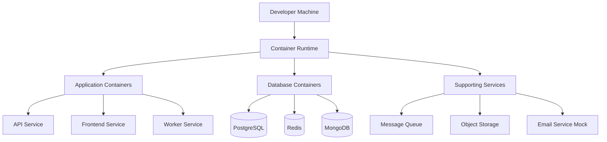
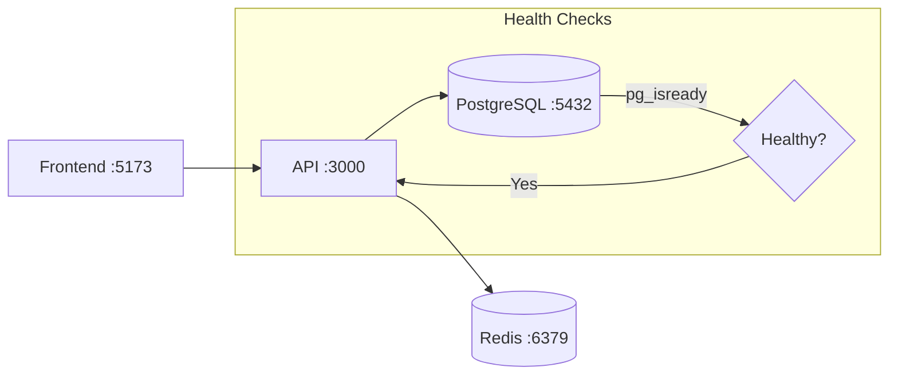
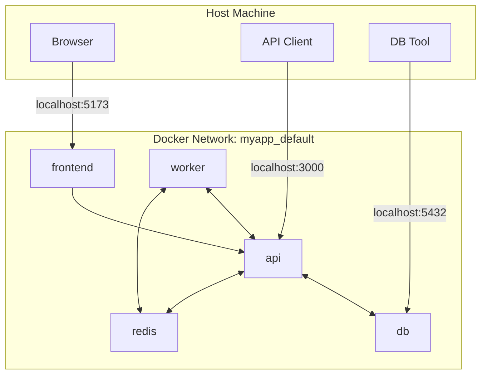
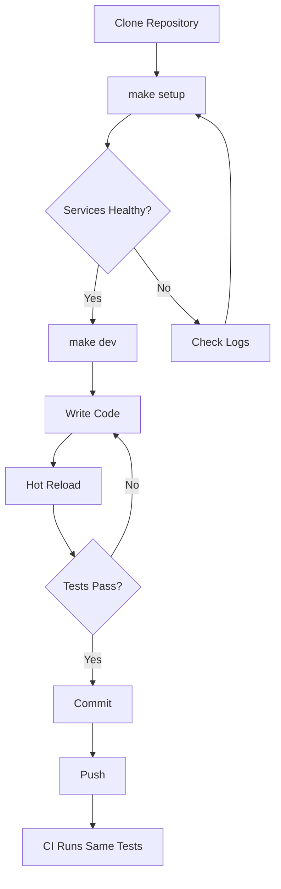

# How to Build Local Development Environment

Author: [nawazdhandala](https://github.com/nawazdhandala)

Tags: Developer Experience, DevOps, Development, Containers

Description: A comprehensive guide to building a reproducible, containerized local development environment that mirrors production and eliminates 'works on my machine' problems.

---

Every engineering team has heard it: "It works on my machine." This phrase signals a fundamental gap between local development and production environments. The fix is not discipline or documentation. It is building a local environment that behaves identically to production from day one.

This guide walks through building a modern local development environment using containers, proper tooling, and patterns that scale from solo developers to large teams.

---

## Table of Contents

1. Why Local Environment Matters
2. Core Components of a Modern Dev Environment
3. Setting Up the Foundation
4. Containerizing Your Application
5. Managing Dependencies with Docker Compose
6. Hot Reload and Developer Experience
7. Local Databases and Data Persistence
8. Service Discovery and Networking
9. Environment Variables and Secrets
10. Debugging in Containers
11. Testing Locally Before CI
12. Common Patterns and Best Practices

---

## 1. Why Local Environment Matters

A well-designed local environment provides:

| Benefit | Impact |
|---------|--------|
| Reproducibility | New team members productive in hours, not days |
| Parity with production | Bugs caught locally, not in staging |
| Isolation | No conflicts between projects or system packages |
| Speed | Fast feedback loops drive better code |
| Confidence | Developers trust their changes before pushing |

The goal is simple: `git clone && make dev` should give anyone a working environment in under 10 minutes.

---

## 2. Core Components of a Modern Dev Environment

A complete local development stack typically includes:



Key components:

1. **Container Runtime**: Docker or Podman for running isolated services
2. **Orchestration**: Docker Compose for multi-container applications
3. **Application Code**: Mounted from host for hot reload
4. **Databases**: Containerized with persistent volumes
5. **Supporting Services**: Queues, caches, and external service mocks

---

## 3. Setting Up the Foundation

### Installing Docker

Docker is the standard container runtime for local development.

**macOS:**

```bash
# Install Docker Desktop via Homebrew
brew install --cask docker

# Start Docker Desktop from Applications
# Or use Colima for a lightweight alternative
brew install colima
colima start --cpu 4 --memory 8
```

**Linux (Ubuntu/Debian):**

```bash
# Add Docker's official GPG key and repository
curl -fsSL https://get.docker.com -o get-docker.sh
sudo sh get-docker.sh

# Add your user to the docker group to run without sudo
sudo usermod -aG docker $USER
newgrp docker

# Verify installation
docker run hello-world
```

**Windows:**

```powershell
# Install Docker Desktop via winget
winget install -e --id Docker.DockerDesktop

# Or use WSL2 for a Linux-like experience
wsl --install
```

### Installing Docker Compose

Docker Compose comes bundled with Docker Desktop. For Linux standalone installations:

```bash
# Install Docker Compose plugin
sudo apt-get update
sudo apt-get install docker-compose-plugin

# Verify installation
docker compose version
```

### Directory Structure

Organize your project for containerized development:

```
my-project/
├── docker/
│   ├── Dockerfile.dev        # Development Dockerfile
│   ├── Dockerfile.prod       # Production Dockerfile
│   └── scripts/
│       ├── entrypoint.sh     # Container entrypoint
│       └── wait-for-it.sh    # Service dependency script
├── docker-compose.yml        # Development services
├── docker-compose.test.yml   # Test configuration
├── .env.example              # Environment template
├── .env                      # Local overrides (gitignored)
├── Makefile                  # Developer commands
└── src/                      # Application code
```

---

## 4. Containerizing Your Application

### Development Dockerfile

A development Dockerfile differs from production: it prioritizes fast iteration over image size.

```dockerfile
# docker/Dockerfile.dev
# Use a full image for development (includes debugging tools)
FROM node:20-bookworm

# Set working directory
WORKDIR /app

# Install development dependencies that rarely change
# This layer is cached until package files change
COPY package.json package-lock.json ./
RUN npm ci

# Install additional development tools
RUN apt-get update && apt-get install -y \
    vim \
    curl \
    postgresql-client \
    && rm -rf /var/lib/apt/lists/*

# Create non-root user for security
RUN useradd -m -s /bin/bash developer
RUN chown -R developer:developer /app
USER developer

# Application code is mounted as a volume, not copied
# This enables hot reload without rebuilding

# Default command runs the dev server with hot reload
CMD ["npm", "run", "dev"]
```

### Multi-stage Production Dockerfile

For comparison, here is a production Dockerfile using multi-stage builds:

```dockerfile
# docker/Dockerfile.prod
# Build stage: compile and prepare assets
FROM node:20-bookworm AS builder

WORKDIR /app
COPY package.json package-lock.json ./
RUN npm ci --production=false

COPY . .
RUN npm run build

# Production stage: minimal runtime image
FROM node:20-slim AS production

WORKDIR /app

# Copy only production dependencies
COPY package.json package-lock.json ./
RUN npm ci --production && npm cache clean --force

# Copy built assets from builder stage
COPY --from=builder /app/dist ./dist

# Run as non-root user
USER node

# Production command
CMD ["node", "dist/index.js"]
```

---

## 5. Managing Dependencies with Docker Compose

Docker Compose orchestrates multiple containers and their relationships.

### Basic docker-compose.yml

```yaml
# docker-compose.yml
# This file defines all services needed for local development

services:
  # Main API service
  api:
    build:
      context: .
      dockerfile: docker/Dockerfile.dev
    ports:
      - "3000:3000"      # Expose API on localhost:3000
      - "9229:9229"      # Node.js debugger port
    volumes:
      # Mount source code for hot reload
      - ./src:/app/src:delegated
      # Mount config files
      - ./package.json:/app/package.json:ro
      # Named volume for node_modules (prevents overwrite)
      - node_modules:/app/node_modules
    environment:
      - NODE_ENV=development
      - DATABASE_URL=postgresql://postgres:postgres@db:5432/myapp_dev
      - REDIS_URL=redis://redis:6379
    depends_on:
      db:
        condition: service_healthy
      redis:
        condition: service_started
    # Restart on crash during development
    restart: unless-stopped

  # PostgreSQL database
  db:
    image: postgres:16-alpine
    ports:
      - "5432:5432"      # Expose for local tools like pgAdmin
    environment:
      POSTGRES_USER: postgres
      POSTGRES_PASSWORD: postgres
      POSTGRES_DB: myapp_dev
    volumes:
      # Persist data between container restarts
      - postgres_data:/var/lib/postgresql/data
      # Run initialization scripts on first start
      - ./docker/init-db:/docker-entrypoint-initdb.d:ro
    healthcheck:
      test: ["CMD-SHELL", "pg_isready -U postgres"]
      interval: 5s
      timeout: 5s
      retries: 5

  # Redis for caching and sessions
  redis:
    image: redis:7-alpine
    ports:
      - "6379:6379"
    volumes:
      - redis_data:/data

  # Frontend development server
  frontend:
    build:
      context: ./frontend
      dockerfile: Dockerfile.dev
    ports:
      - "5173:5173"      # Vite dev server
    volumes:
      - ./frontend/src:/app/src:delegated
      - frontend_modules:/app/node_modules
    environment:
      - VITE_API_URL=http://localhost:3000

# Named volumes for data persistence
volumes:
  postgres_data:
  redis_data:
  node_modules:
  frontend_modules:
```

### Service Dependency Flow



---

## 6. Hot Reload and Developer Experience

Fast feedback loops are critical for developer productivity. Configure your services for instant code reload.

### Node.js with nodemon

```json
// package.json
{
  "scripts": {
    "dev": "nodemon --watch src --ext ts,js,json --exec 'ts-node src/index.ts'",
    "dev:debug": "nodemon --watch src --ext ts,js,json --exec 'node --inspect=0.0.0.0:9229 -r ts-node/register src/index.ts'"
  }
}
```

### Python with watchdog

```dockerfile
# In your Python Dockerfile.dev
CMD ["python", "-m", "watchdog", "auto-restart", "--patterns=*.py", "--", "python", "app.py"]

# Or with Flask
CMD ["flask", "run", "--host=0.0.0.0", "--reload", "--debugger"]
```

### Volume Mount Optimization

Docker volume mounts can be slow on macOS. Use these flags to improve performance:

```yaml
volumes:
  # 'delegated' mode improves write performance from container to host
  - ./src:/app/src:delegated

  # 'cached' mode improves read performance from host to container
  - ./config:/app/config:cached

  # Use named volumes for dependencies to avoid sync overhead
  - node_modules:/app/node_modules
```

---

## 7. Local Databases and Data Persistence

### Database Initialization

Create scripts that run when the database container first starts.

```sql
-- docker/init-db/01-create-schemas.sql
-- This runs automatically on first container start

CREATE SCHEMA IF NOT EXISTS app;

-- Create a read-only user for reporting
CREATE USER readonly_user WITH PASSWORD 'readonly_pass';
GRANT USAGE ON SCHEMA app TO readonly_user;
GRANT SELECT ON ALL TABLES IN SCHEMA app TO readonly_user;
ALTER DEFAULT PRIVILEGES IN SCHEMA app GRANT SELECT ON TABLES TO readonly_user;
```

```bash
#!/bin/bash
# docker/init-db/02-seed-data.sh
# Seed initial development data

set -e

psql -v ON_ERROR_STOP=1 --username "$POSTGRES_USER" --dbname "$POSTGRES_DB" <<-EOSQL
    INSERT INTO users (email, name) VALUES
        ('developer@example.com', 'Test Developer'),
        ('admin@example.com', 'Test Admin');
EOSQL

echo "Database seeded successfully"
```

### Data Reset Commands

Add convenient commands for managing database state:

```makefile
# Makefile

# Reset database to clean state (destroys all data)
db-reset:
	docker compose down -v
	docker compose up -d db
	docker compose exec db psql -U postgres -c "DROP DATABASE IF EXISTS myapp_dev;"
	docker compose exec db psql -U postgres -c "CREATE DATABASE myapp_dev;"
	docker compose up -d

# Run migrations
db-migrate:
	docker compose exec api npm run migrate

# Open database shell
db-shell:
	docker compose exec db psql -U postgres -d myapp_dev

# Create a database backup
db-backup:
	docker compose exec db pg_dump -U postgres myapp_dev > backup-$$(date +%Y%m%d).sql
```

---

## 8. Service Discovery and Networking

Docker Compose creates a default network where services can reach each other by name.

### How Container Networking Works



### Connection Strings in Containers

When one container connects to another, use the service name as the hostname:

```yaml
# From api container connecting to db container
DATABASE_URL: postgresql://postgres:postgres@db:5432/myapp_dev
#                                              ^^
#                                              Service name, not localhost

# From api container connecting to redis container
REDIS_URL: redis://redis:6379
#                  ^^^^^
#                  Service name
```

### Custom Networks for Isolation

Separate networks for different concerns:

```yaml
services:
  api:
    networks:
      - frontend
      - backend

  frontend:
    networks:
      - frontend

  db:
    networks:
      - backend    # Database not accessible from frontend network

networks:
  frontend:
  backend:
```

---

## 9. Environment Variables and Secrets

### Environment File Strategy

```bash
# .env.example - Committed to git, documents required variables
NODE_ENV=development
DATABASE_URL=postgresql://postgres:postgres@db:5432/myapp_dev
REDIS_URL=redis://redis:6379
JWT_SECRET=change-this-in-production
STRIPE_SECRET_KEY=sk_test_your_key_here
AWS_ACCESS_KEY_ID=
AWS_SECRET_ACCESS_KEY=

# Feature flags
FEATURE_NEW_CHECKOUT=true
FEATURE_DARK_MODE=false
```

```bash
# .env - Gitignored, contains real values for local development
NODE_ENV=development
DATABASE_URL=postgresql://postgres:postgres@db:5432/myapp_dev
REDIS_URL=redis://redis:6379
JWT_SECRET=local-dev-secret-32-characters-min
STRIPE_SECRET_KEY=sk_test_abc123...
AWS_ACCESS_KEY_ID=AKIA...
AWS_SECRET_ACCESS_KEY=...
```

### Loading Environment in Docker Compose

```yaml
services:
  api:
    env_file:
      - .env              # Load from file
    environment:
      # Override specific variables
      - NODE_ENV=development
      - LOG_LEVEL=debug
```

### Secrets for Sensitive Data

For sensitive values, use Docker secrets instead of environment variables:

```yaml
services:
  api:
    secrets:
      - db_password
      - jwt_secret
    environment:
      # Reference secrets by their mounted path
      - DATABASE_PASSWORD_FILE=/run/secrets/db_password

secrets:
  db_password:
    file: ./secrets/db_password.txt
  jwt_secret:
    file: ./secrets/jwt_secret.txt
```

---

## 10. Debugging in Containers

### Node.js Debugging

Enable the Node.js inspector and connect from your IDE:

```yaml
services:
  api:
    ports:
      - "9229:9229"    # Debugger port
    command: node --inspect=0.0.0.0:9229 -r ts-node/register src/index.ts
```

VS Code launch configuration:

```json
// .vscode/launch.json
{
  "version": "0.2.0",
  "configurations": [
    {
      "name": "Docker: Attach to Node",
      "type": "node",
      "request": "attach",
      "port": 9229,
      "address": "localhost",
      "localRoot": "${workspaceFolder}/src",
      "remoteRoot": "/app/src",
      "protocol": "inspector",
      "restart": true
    }
  ]
}
```

### Python Debugging with debugpy

```dockerfile
# Dockerfile.dev
RUN pip install debugpy

# Start with debugger listening
CMD ["python", "-m", "debugpy", "--listen", "0.0.0.0:5678", "--wait-for-client", "app.py"]
```

### Interactive Shell Access

Open a shell in a running container for exploration:

```bash
# Open bash in the api container
docker compose exec api bash

# Run a one-off command
docker compose exec api npm run test

# Open a database shell
docker compose exec db psql -U postgres -d myapp_dev

# View logs in real-time
docker compose logs -f api

# View logs for multiple services
docker compose logs -f api worker
```

---

## 11. Testing Locally Before CI

Run the same tests locally that will run in CI to catch issues early.

### Test Configuration

```yaml
# docker-compose.test.yml
# Override configuration for running tests

services:
  api:
    environment:
      - NODE_ENV=test
      - DATABASE_URL=postgresql://postgres:postgres@db:5432/myapp_test
    command: npm run test

  db:
    environment:
      POSTGRES_DB: myapp_test
    # Use tmpfs for faster test database
    tmpfs:
      - /var/lib/postgresql/data
```

### Running Tests

```bash
# Run tests with isolated test database
docker compose -f docker-compose.yml -f docker-compose.test.yml run --rm api npm run test

# Run specific test file
docker compose exec api npm run test -- --grep "user authentication"

# Run tests with coverage
docker compose exec api npm run test:coverage
```

### Makefile Commands

```makefile
# Makefile - Developer workflow commands

.PHONY: dev test lint build clean

# Start all services for development
dev:
	docker compose up -d
	docker compose logs -f

# Run the full test suite
test:
	docker compose -f docker-compose.yml -f docker-compose.test.yml run --rm api npm run test

# Run tests in watch mode for TDD
test-watch:
	docker compose exec api npm run test:watch

# Run linter
lint:
	docker compose exec api npm run lint

# Build production images
build:
	docker compose -f docker-compose.prod.yml build

# Stop all services and remove volumes
clean:
	docker compose down -v --remove-orphans

# View service status
status:
	docker compose ps

# Tail logs from all services
logs:
	docker compose logs -f

# Rebuild and restart a specific service
restart-%:
	docker compose up -d --build $*
```

---

## 12. Common Patterns and Best Practices

### Pattern: One Command Setup

New developers should be productive with minimal steps:

```makefile
# Makefile

# Complete setup for new developers
setup: check-deps
	cp -n .env.example .env || true
	docker compose pull
	docker compose build
	docker compose up -d
	@echo "Waiting for services to be healthy..."
	sleep 10
	docker compose exec api npm run migrate
	docker compose exec api npm run seed
	@echo "Setup complete! Visit http://localhost:3000"

# Verify required tools are installed
check-deps:
	@which docker > /dev/null || (echo "Docker is required" && exit 1)
	@docker compose version > /dev/null || (echo "Docker Compose is required" && exit 1)
```

### Pattern: Service Health Checks

Ensure services are ready before dependent services start:

```yaml
services:
  api:
    depends_on:
      db:
        condition: service_healthy
      redis:
        condition: service_healthy
    healthcheck:
      test: ["CMD", "curl", "-f", "http://localhost:3000/health"]
      interval: 10s
      timeout: 5s
      retries: 5
      start_period: 30s

  db:
    healthcheck:
      test: ["CMD-SHELL", "pg_isready -U postgres"]
      interval: 5s
      timeout: 5s
      retries: 5

  redis:
    healthcheck:
      test: ["CMD", "redis-cli", "ping"]
      interval: 5s
      timeout: 3s
      retries: 5
```

### Pattern: Mock External Services

Replace external APIs with local mocks for reliable testing:

```yaml
services:
  # Mock Stripe API for payment testing
  stripe-mock:
    image: stripe/stripe-mock:latest
    ports:
      - "12111:12111"

  # Mock S3 with MinIO
  minio:
    image: minio/minio
    command: server /data --console-address ":9001"
    ports:
      - "9000:9000"
      - "9001:9001"
    environment:
      MINIO_ROOT_USER: minioadmin
      MINIO_ROOT_PASSWORD: minioadmin
    volumes:
      - minio_data:/data

  # Mock email server for testing
  mailhog:
    image: mailhog/mailhog
    ports:
      - "1025:1025"    # SMTP server
      - "8025:8025"    # Web UI

  api:
    environment:
      - STRIPE_API_BASE=http://stripe-mock:12111
      - S3_ENDPOINT=http://minio:9000
      - SMTP_HOST=mailhog
      - SMTP_PORT=1025
```

### Pattern: Profile-Based Configurations

Different configurations for different use cases:

```yaml
# docker-compose.yml - Base configuration

services:
  api:
    build:
      context: .
      dockerfile: docker/Dockerfile.dev
```

```yaml
# docker-compose.override.yml - Local development (auto-loaded)

services:
  api:
    volumes:
      - ./src:/app/src:delegated
    ports:
      - "3000:3000"
      - "9229:9229"
```

```yaml
# docker-compose.ci.yml - CI environment

services:
  api:
    # No volume mounts in CI - use built image
    volumes: []
    environment:
      - CI=true
```

### Workflow Summary



---

## Summary

| Goal | Solution |
|------|----------|
| Reproducible setup | Docker Compose + Makefile |
| Fast iteration | Volume mounts + hot reload |
| Production parity | Same base images, same dependencies |
| Data persistence | Named volumes for databases |
| Easy debugging | Exposed debugger ports + IDE config |
| Isolated testing | Separate test compose file with tmpfs |
| External service mocks | Mock containers for Stripe, S3, email |
| Team onboarding | `make setup` runs everything |

A good local development environment is invisible. Developers should focus on writing code, not fighting tooling. When you hear "it works on my machine," the correct response should be "good, it will work everywhere else too."

Start with the basics: containerize your app, add Docker Compose, write a Makefile. Then iterate based on what slows your team down. The perfect setup is the one nobody has to think about.

---

*Need observability for your local development environment? OneUptime can receive OpenTelemetry traces from your local containers, giving you the same debugging experience locally as in production. Point your OTLP exporter to OneUptime and see traces flow through your local service mesh.*

---

**Related Reading:**

- [How to Debug Failing Docker Containers Safely](https://oneuptime.com/blog/post/2025-11-27-debug-docker-containers/view)
- [How to Install kubectl, Configure kubeconfig, and Talk to Your First Cluster](https://oneuptime.com/blog/post/2025-11-27-install-kubectl-first-cluster/view)
- [How to Configure Node.js for Production with Environment Variables](https://oneuptime.com/blog/post/2026-01-06-nodejs-production-environment-variables/view)
