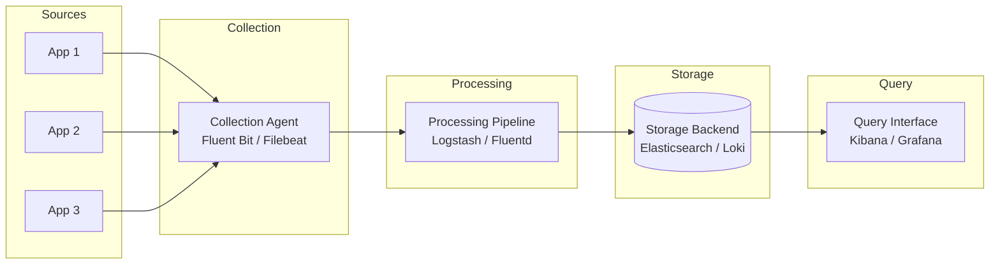

# How to Implement Log Aggregation Patterns

Author: [nawazdhandala](https://www.github.com/nawazdhandala)

Tags: Logging, Aggregation, Observability, ELK, Loki

Description: Build centralized log aggregation systems with collection agents, parsing pipelines, storage backends, and querying strategies for distributed systems.

---

> Centralized log aggregation transforms scattered application logs into a unified, searchable system. This guide walks through implementing a complete log aggregation pipeline from collection to querying.

When you move from a few servers to dozens or hundreds, grepping through individual log files stops working. You need a system that collects logs from everywhere, processes them consistently, stores them efficiently, and makes them searchable. Let's build one step by step.

---

## Architecture Overview

A typical log aggregation system has four main components:



Each component handles a specific responsibility: collection gathers logs from sources, processing parses and enriches them, storage indexes them for fast retrieval, and query interfaces let you search and visualize.

---

## Setting Up Collection Agents

Collection agents run on each node and forward logs to the processing pipeline. Fluent Bit is lightweight and works well for most setups.

Here is a Fluent Bit configuration that tails application logs and adds metadata:

```ini
# /etc/fluent-bit/fluent-bit.conf
# Main Fluent Bit configuration for log collection

[SERVICE]
    # Flush logs every 5 seconds
    Flush         5
    # Run in foreground for container deployments
    Daemon        Off
    # Set log level for troubleshooting
    Log_Level     info
    # Enable built-in HTTP server for metrics
    HTTP_Server   On
    HTTP_Listen   0.0.0.0
    HTTP_Port     2020

[INPUT]
    # Tail application log files
    Name          tail
    # Match all .log files in the app directory
    Path          /var/log/app/*.log
    # Use the JSON parser for structured logs
    Parser        json
    # Tag logs with app prefix and filename
    Tag           app.*
    # How often to check for new files
    Refresh_Interval 10
    # Memory buffer limit per monitored file
    Mem_Buf_Limit    5MB
    # Skip long lines instead of failing
    Skip_Long_Lines  On
    # Track file position for restart recovery
    DB            /var/lib/fluent-bit/tail.db

[INPUT]
    # Also collect system logs
    Name          systemd
    Tag           system.*
    # Read from journal
    Systemd_Filter _SYSTEMD_UNIT=docker.service
    Read_From_Tail On

[FILTER]
    # Add hostname to all records
    Name          record_modifier
    Match         *
    Record        hostname ${HOSTNAME}
    Record        environment production

[OUTPUT]
    # Forward to processing pipeline
    Name          forward
    Match         *
    Host          logstash.internal.example.com
    Port          24224
    # Retry on failure
    Retry_Limit   5
```

For Kubernetes environments, deploy Fluent Bit as a DaemonSet to collect from all nodes:

```yaml
# fluent-bit-daemonset.yaml
# Deploy Fluent Bit on every node in the cluster

apiVersion: apps/v1
kind: DaemonSet
metadata:
  name: fluent-bit
  namespace: logging
  labels:
    app: fluent-bit
spec:
  selector:
    matchLabels:
      app: fluent-bit
  template:
    metadata:
      labels:
        app: fluent-bit
    spec:
      serviceAccountName: fluent-bit
      containers:
        - name: fluent-bit
          image: fluent/fluent-bit:2.2
          ports:
            - containerPort: 2020
              name: metrics
          volumeMounts:
            # Mount host log directories
            - name: varlog
              mountPath: /var/log
              readOnly: true
            # Mount container logs
            - name: containers
              mountPath: /var/lib/docker/containers
              readOnly: true
            # Configuration
            - name: config
              mountPath: /fluent-bit/etc/
          resources:
            limits:
              memory: 128Mi
              cpu: 200m
            requests:
              memory: 64Mi
              cpu: 100m
      volumes:
        - name: varlog
          hostPath:
            path: /var/log
        - name: containers
          hostPath:
            path: /var/lib/docker/containers
        - name: config
          configMap:
            name: fluent-bit-config
```

---

## Building the Processing Pipeline

The processing pipeline parses, transforms, and routes logs. Logstash provides powerful processing capabilities.

This pipeline configuration handles JSON and plain text logs, extracts fields, and routes to different outputs:

```ruby
# /etc/logstash/conf.d/pipeline.conf
# Logstash pipeline for log processing

input {
  # Receive logs from Fluent Bit
  beats {
    port => 24224
  }
}

filter {
  # Parse JSON logs if present
  if [message] =~ /^\{.*\}$/ {
    json {
      source => "message"
      target => "parsed"
      # Keep original message if parsing fails
      skip_on_invalid_json => true
    }

    # Move parsed fields to root level
    if [parsed] {
      ruby {
        code => '
          parsed = event.get("parsed")
          if parsed.is_a?(Hash)
            parsed.each { |k, v| event.set(k, v) }
          end
          event.remove("parsed")
        '
      }
    }
  }

  # Parse timestamps into a consistent format
  date {
    match => ["timestamp", "ISO8601", "yyyy-MM-dd HH:mm:ss"]
    target => "@timestamp"
    # Remove original timestamp field
    remove_field => ["timestamp"]
  }

  # Extract log level if not present
  if ![level] and [message] {
    grok {
      match => {
        "message" => "(?<level>DEBUG|INFO|WARN|ERROR|FATAL)"
      }
      # Do not fail if pattern does not match
      tag_on_failure => []
    }
  }

  # Normalize log levels to lowercase
  if [level] {
    mutate {
      lowercase => ["level"]
    }
  }

  # Add geographic data from IP addresses
  if [client_ip] {
    geoip {
      source => "client_ip"
      target => "geo"
      # Only include relevant fields
      fields => ["city_name", "country_name", "location"]
    }
  }

  # Drop health check logs to reduce noise
  if [message] =~ /health|ping|ready/ and [level] == "info" {
    drop { }
  }

  # Mask sensitive data
  mutate {
    gsub => [
      # Mask credit card numbers
      "message", "\b\d{4}[\s-]?\d{4}[\s-]?\d{4}[\s-]?\d{4}\b", "[CARD MASKED]",
      # Mask email addresses
      "message", "\b[\w.+-]+@[\w.-]+\.\w{2,}\b", "[EMAIL MASKED]"
    ]
  }
}

output {
  # Route based on log characteristics
  if [level] == "error" or [level] == "fatal" {
    # Errors go to a dedicated index for faster alerting
    elasticsearch {
      hosts => ["https://es.internal.example.com:9200"]
      index => "logs-errors-%{+YYYY.MM.dd}"
      user => "${ES_USER}"
      password => "${ES_PASSWORD}"
    }
  }

  # All logs go to the main index
  elasticsearch {
    hosts => ["https://es.internal.example.com:9200"]
    index => "logs-%{[service]}-%{+YYYY.MM.dd}"
    user => "${ES_USER}"
    password => "${ES_PASSWORD}"
    # Use bulk indexing for efficiency
    bulk_max_size => 1000
  }

  # Also send to S3 for long-term archival
  s3 {
    region => "us-east-1"
    bucket => "logs-archive"
    prefix => "logs/%{+YYYY}/%{+MM}/%{+dd}/"
    # Rotate files hourly
    time_file => 60
    # Compress for storage efficiency
    codec => json_lines
    encoding => "gzip"
  }
}
```

---

## Configuring Storage Backends

Elasticsearch provides powerful full-text search capabilities. Configure index templates for optimal performance:

```json
// elasticsearch-index-template.json
// Index template for log data optimization

{
  "index_patterns": ["logs-*"],
  "template": {
    "settings": {
      "number_of_shards": 3,
      "number_of_replicas": 1,
      "refresh_interval": "5s",
      "index.lifecycle.name": "logs-policy",
      "index.lifecycle.rollover_alias": "logs"
    },
    "mappings": {
      "dynamic_templates": [
        {
          "strings_as_keywords": {
            "match_mapping_type": "string",
            "mapping": {
              "type": "keyword",
              "ignore_above": 1024
            }
          }
        }
      ],
      "properties": {
        "@timestamp": {
          "type": "date"
        },
        "message": {
          "type": "text",
          "fields": {
            "keyword": {
              "type": "keyword",
              "ignore_above": 2048
            }
          }
        },
        "level": {
          "type": "keyword"
        },
        "service": {
          "type": "keyword"
        },
        "trace_id": {
          "type": "keyword"
        },
        "hostname": {
          "type": "keyword"
        }
      }
    }
  }
}
```

Set up index lifecycle management to handle retention automatically:

```json
// elasticsearch-ilm-policy.json
// Manage index lifecycle for cost optimization

{
  "policy": {
    "phases": {
      "hot": {
        "min_age": "0ms",
        "actions": {
          "rollover": {
            "max_size": "50gb",
            "max_age": "1d"
          },
          "set_priority": {
            "priority": 100
          }
        }
      },
      "warm": {
        "min_age": "7d",
        "actions": {
          "shrink": {
            "number_of_shards": 1
          },
          "forcemerge": {
            "max_num_segments": 1
          },
          "set_priority": {
            "priority": 50
          }
        }
      },
      "cold": {
        "min_age": "30d",
        "actions": {
          "searchable_snapshot": {
            "snapshot_repository": "logs-snapshots"
          }
        }
      },
      "delete": {
        "min_age": "90d",
        "actions": {
          "delete": {}
        }
      }
    }
  }
}
```

---

## Implementing Query Strategies

Effective querying requires understanding your data patterns. Here is a Python utility for common log queries:

```python
# log_query.py
# Utility functions for querying aggregated logs

from elasticsearch import Elasticsearch
from datetime import datetime, timedelta
from typing import Optional, List, Dict, Any

class LogQueryClient:
    """Client for querying aggregated logs in Elasticsearch."""

    def __init__(self, hosts: List[str], api_key: str):
        # Initialize Elasticsearch client with authentication
        self.es = Elasticsearch(
            hosts=hosts,
            api_key=api_key,
            request_timeout=30
        )

    def search_errors(
        self,
        service: str,
        hours: int = 24,
        size: int = 100
    ) -> List[Dict[str, Any]]:
        """
        Find recent errors for a specific service.
        Returns logs sorted by timestamp descending.
        """
        query = {
            "bool": {
                "must": [
                    {"term": {"service": service}},
                    {"terms": {"level": ["error", "fatal"]}}
                ],
                "filter": [
                    {
                        "range": {
                            "@timestamp": {
                                "gte": f"now-{hours}h",
                                "lte": "now"
                            }
                        }
                    }
                ]
            }
        }

        result = self.es.search(
            index="logs-*",
            query=query,
            size=size,
            sort=[{"@timestamp": "desc"}]
        )

        return [hit["_source"] for hit in result["hits"]["hits"]]

    def aggregate_by_level(
        self,
        service: Optional[str] = None,
        hours: int = 24
    ) -> Dict[str, int]:
        """
        Count logs by level for monitoring dashboards.
        Useful for detecting error rate spikes.
        """
        query = {
            "bool": {
                "filter": [
                    {
                        "range": {
                            "@timestamp": {
                                "gte": f"now-{hours}h"
                            }
                        }
                    }
                ]
            }
        }

        # Add service filter if specified
        if service:
            query["bool"]["must"] = [{"term": {"service": service}}]

        result = self.es.search(
            index="logs-*",
            query=query,
            size=0,
            aggs={
                "levels": {
                    "terms": {
                        "field": "level",
                        "size": 10
                    }
                }
            }
        )

        # Transform aggregation result to dictionary
        return {
            bucket["key"]: bucket["doc_count"]
            for bucket in result["aggregations"]["levels"]["buckets"]
        }

    def find_correlated_logs(
        self,
        trace_id: str
    ) -> List[Dict[str, Any]]:
        """
        Find all logs for a specific trace across services.
        Essential for debugging distributed request flows.
        """
        result = self.es.search(
            index="logs-*",
            query={"term": {"trace_id": trace_id}},
            size=1000,
            sort=[{"@timestamp": "asc"}]
        )

        return [hit["_source"] for hit in result["hits"]["hits"]]


# Example usage
if __name__ == "__main__":
    client = LogQueryClient(
        hosts=["https://es.example.com:9200"],
        api_key="your-api-key"
    )

    # Find recent errors in the API service
    errors = client.search_errors("api-gateway", hours=1)
    print(f"Found {len(errors)} errors in the last hour")

    # Check error rates across all services
    levels = client.aggregate_by_level(hours=24)
    error_rate = levels.get("error", 0) / sum(levels.values()) * 100
    print(f"Error rate: {error_rate:.2f}%")
```

---

## Monitoring the Pipeline

Your log aggregation system needs monitoring too. Track these key metrics:

```yaml
# prometheus-alerts.yaml
# Alerting rules for log pipeline health

groups:
  - name: log-pipeline
    rules:
      # Alert if collection agents stop sending
      - alert: FluentBitNoOutput
        expr: rate(fluentbit_output_records_total[5m]) == 0
        for: 5m
        labels:
          severity: warning
        annotations:
          summary: "Fluent Bit not sending logs"

      # Alert if processing pipeline backs up
      - alert: LogstashBacklog
        expr: logstash_node_queue_events > 10000
        for: 10m
        labels:
          severity: critical
        annotations:
          summary: "Logstash queue backlog growing"

      # Alert if Elasticsearch indexing fails
      - alert: ElasticsearchIndexingErrors
        expr: rate(elasticsearch_indices_indexing_index_failed_total[5m]) > 0
        for: 5m
        labels:
          severity: critical
        annotations:
          summary: "Elasticsearch indexing failures detected"
```

---

## Summary

Building a log aggregation system requires attention to each component: lightweight collection agents that do not impact application performance, processing pipelines that parse and enrich data consistently, storage backends optimized for your query patterns, and monitoring to ensure the pipeline itself stays healthy.

Start with the simplest setup that meets your needs. A single Fluent Bit instance forwarding to Loki or Elasticsearch handles most small to medium deployments. Add processing pipelines and multi-tier storage as your volume and complexity grow.

The most important thing is getting logs flowing early. You can always refine parsing rules and add enrichment later, but you cannot query logs you never collected.

---

*Looking for a managed observability platform? [OneUptime](https://oneuptime.com) provides integrated logging, metrics, and traces with automatic correlation, so you can focus on building instead of maintaining infrastructure.*
